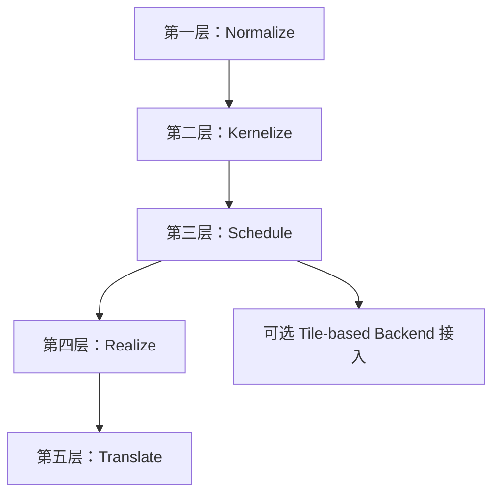

## 1. 整体五层架构

本节只定义实现蓝图的总分层与层间边界。五层主线可以概括为：

- `Normalize`：把入口 IR 收敛成统一分析形态
- `Kernelize`：把计算图切成可独立编译的 kernel
- `Schedule`：为每个 kernel 确定调度与结构骨架
- `Realize`：把调度结果落成显式内存实现
- `Translate`：把已实现的 kernel 翻译成 backend 与 runtime 可消费的工件

第 8 章 `Target Hardware Modeling` 不属于独立编译层；它为 `Schedule / Realize / Translate` 提供统一 target 查询模型。

### 1.1 五层定义

| 层 | 主要作用 | 输出编译单元 | 核心对象 |
|---|---|---|---|
| 第一层：Normalize | 统一入口，收敛方言子集、shape/indexing 表达和基础结构 | 方言子集、shape/indexing 表达、基础结构都已收敛到统一入口约定的 module | `Normalized Linalg/Tensor IR` |
| 第二层：Kernelize | 完成依赖分析、role 分类、融合候选分析和 kernel 划分 | kernel 边界、region 归属和主干拓扑已确定，可按 kernel 为单位继续处理的 module | `KernelPattern` |
| 第三层：Schedule | 生成调度问题和调度决策，并通过 structured lowering 固定结构骨架 | 每个 kernel 的调度中心、tile 结构和循环骨架已稳定下来的结构化 module | `ScheduleProblem`、`ScheduleDecisionSet` |
| 第四层：Realize | 把结构化 kernel 落成 buffer、placement 和显式数据搬运路径 | buffer、placement 和显式数据搬运路径都已确定，可直接进入 backend 翻译的 module | `BufferizedKernelIR`、`PlacementPlan`、`StaticMemoryPlan`、`MovementPlan`、`MemoryRealizationPlan` |
| 第五层：Translate | 把已实现的 kernel 翻译成 backend、toolchain 和 runtime 可消费的工件 | 面向 backend、toolchain 和 runtime 的最终工件集合 | `AscendC Kernel MLIR`、`AscendC Source`、`Host Tiling`，以及可选的 `Runtime Manifest` |

表中的“核心对象”不是该层的唯一输出，而是该层新增或固定下来的主边界对象。

| 核心对象 | 定义 |
|---|---|
| `KernelPattern` | 第二层形成的 region 级编译对象，描述哪些 op 被归入同一个 kernel，以及该 kernel 的 anchor、roles、primitives、输入输出边界等信息。 |
| `ScheduleProblem` | 第三层围绕 `KernelPattern` 抽取的调度问题，描述符号化 shape、axes、memory 约束、硬件约束等调度输入。这里的“约束信息”指的是会直接限制 tile、block、unit assignment 或 pipeline 选择的条件，例如并行轴/规约轴划分、broadcast 轴、ranked symbolic shape 中的动态维位置、片上容量上限、是否必须经过某类 memory place、是否同时使用 Cube 和 Vector、以及某些 primitive 带来的结构约束。 |
| `ScheduleDecisionSet` | 第三层生成的调度结果集合，持有当前 kernel 在编译期或运行期保留的一个或多个 `ScheduleDecision`。 |
| `MemoryRealizationPlan` | 第四层形成的稳定 realization 结果，冻结 `resolvedPlacement`、`workspaceLayout`、`resolvedMovements` 以及最终 materialization 结果。 |

### 1.2 实现接口最小集合

| 层 | 核心类/接口 | 输入 | 输出 |
|---|---|---|---|
| 第一层：Normalize | `EntryNormalizer` | 入口 `func/module` | `Normalized Linalg/Tensor IR` |
| 第二层：Kernelize | `DependencyAnalyzer`、`StructuralMarker`、`OpRoleClassifier`、`FusionCandidateAnalyzer`、`CandidateMergeAnalyzer`、`KernelPatternBuilder`、`KernelPartitioner` | `Normalized Linalg/Tensor IR` | `KernelPattern[]` |
| 第三层：Schedule | `AxisCoalescer`、`ScheduleProblemBuilder`、`TemplateRegistry`、`ScheduleSearch`、`StructuredLoweringDriver` | `KernelPattern[]` | `ScheduleDecisionSet[]` 与结构化 module |
| 第四层：Realize | `BufferizationDriver`、`PlacementPlanner`、`StaticMemoryPlanner`、`MovementPlanner`、`MemoryRealizationDriver` | 结构化 module、`ScheduleDecisionSet[]` | `MemoryRealizationPlan[]` 与 `Memory-Realized IR` |
| 第五层：Translate | `ComputeLoweringDriver`、`BackendABILoweringDriver`、`AscendCSourceEmitter`、`HostTilingEmitter`、`RuntimeManifestBuilder` | `Memory-Realized IR`、`MemoryRealizationPlan[]`、`ScheduleDecisionSet[]` | `AscendC Kernel MLIR`、`AscendC Source`、`Host Tiling`，以及可选的 `Runtime Manifest` |

这些类名是实现基线。后续补充细节时，默认围绕这组接口展开。

### 1.3 社区源码边界

当前实现方案默认不修改 MLIR upstream 社区源码。

统一约束：

- 社区 dialect、interface、analysis、pass 只复用，不直接修改
- 对社区 op 的语义补充优先通过：
    - external model
    - 独立 pass
    - 本地 wrapper analysis
    - 独立 dialect / 本地对象
- 若某步需要接入社区基础设施，例如 `One-Shot Bufferize`，优先通过本地扩展接入，不改社区实现本体

### 1.4 设计原则

#### 1.4.1 编译器入口契约：Linalg/Tensor IR 作为合约边界

本编译器以**规范化的 Linalg / Tensor / Arith / Math / Func IR** 为合约入口边界。

前端框架（torch-mlir、onnx-mlir 等）负责将框架算子降低到此 IR 形态；本编译器不负责框架层到 Linalg 的 lowering，也不依赖任何前端框架的内部实现。

| 职责 | 承担方 |
|---|---|
| 框架算子 → Linalg/Tensor IR | torch-mlir / onnx-mlir / 用户自定义前端 |
| Linalg/Tensor IR → AscendC kernel 产物 | **本编译器** |

选择此边界的理由：

- **职责清晰**：前端框架团队维护框架→Linalg lowering，编译器团队专注后端优化，两者可独立演进
- **复用社区成果**：Linalg/Tensor 是 MLIR 生态中最成熟的结构化 IR，社区已有大量前端对接工作
- **接入灵活**：任何能输出规范化 Linalg/Tensor IR 的工具（包括用户自定义前端）都可以直接接入本编译器，无需修改编译器内部逻辑

本编译器接受的入口 IR 必须满足第二章（Normalize）定义的统一入口约定；不满足该约定的 IR 在第一层入口处拒绝，不允许传入后续层。

#### 1.4.2 不引入新 Dialect

本编译器的所有优化 Pass **不引入新的 MLIR Dialect**，只复用社区已有的 Dialect（`linalg`、`tensor`、`arith`、`math`、`memref`、`scf`、`func`），通过扩展 Attribute 表达编译器内部语义标记。

约束细则：

| 场景 | 规则 |
|---|---|
| 编译器内部语义标记 | 使用 Attribute（如 `AscendOpRoleAttr`、`CacheReadMarker`），不新建 op |
| 新增计算语义 | 通过 `linalg.generic` + 自定义 indexing map 或 `arith`/`math` op 组合表达 |
| backend 专用 op（AscendC compute/move op） | 只在第五层 `Backend Compute IR` 阶段引入，以 `ascendc.*` op 形式存在，范围限于第五层内部 |
| `HandwrittenPattern` | 直接生成 AscendC C++ 源码，不经过新 Dialect |

这一原则的价值：

- 用户工具链只需标准 `mlir-opt` + 本项目注册的 Pass，**不依赖私有方言工具链**
- 与 upstream MLIR 保持最大兼容性，Pass 可以单独发布或选择性集成
- 降低社区贡献门槛

> **关于代码仓中的 AFIR Dialect**：AFIR 是历史原型实现阶段遗留的方言，不属于 V2 设计规范。V2 的所有 Pass 以社区 Dialect + 扩展 Attribute 为载体实现，不依赖 AFIR Dialect。

#### 1.4.3 可扩展性预留

当前版本在以下方向有意留白，预留扩展点而非封闭设计：

| 方向 | 当前状态 | 扩展路径 |
|---|---|---|
| 量化 / 混合精度（INT8、FP8） | cast op 链路已可表达类型转换；INT8 matmul 的 `s32s8s8` dtype 已在 `TargetIntrinsicModel` 中建模 | 后续在 Layer 2 补充 `QuantDequantFusion` primitive；Layer 5 补充对应 intrinsic 映射 |
| Scatter-like 写回（MoE dispatch 等） | 通过 `HandwrittenPattern` 机制支持；不走通用 primitive 路径 | 后续在 `accessPatternKind` 扩展 `Scatter` 枚举，补充对应 primitive |
| 新 compute pattern（TopK、Sort 等） | 通过 `HandwrittenPattern` 或 `FallbackSingleOpPattern` 支持 | 在 `HandwrittenPatternRegistry` 注册新 pattern；成熟后迁移至通用 primitive |
| 新前端框架接入 | 扩展第一层属性保留表和前端命名空间前缀表 | 不修改核心编译流程