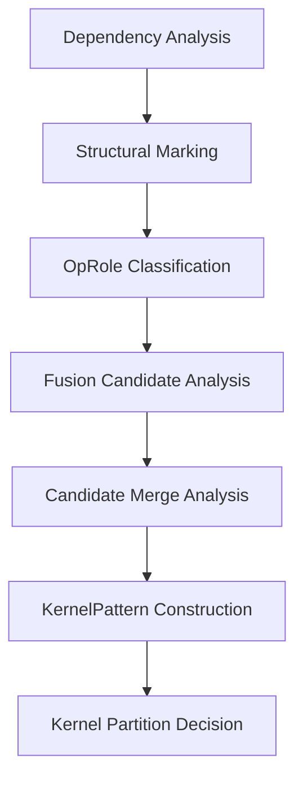

## 3. 第二层：Kernelize

第二层的任务是把第一层输出的规范化计算图划分成可独立调度的 `KernelPattern`。整个过程分七个有序步骤执行，每个步骤只消费前序步骤的产出，不回看原始 IR。



### 3.1 输入、输出与系统级约束

| 项         | 内容                                                         |
| ---------- | ------------------------------------------------------------ |
| 输入       | 第一层输出的规范化 module                                    |
| 输出       | 带最终 `KernelPattern[]` 标注的 module                       |
| 主边界对象 | `KernelPattern`                                              |
| 附加产物   | `OpRoleMap`、`scheduleContract[]`（供第三层消费）、划分 diagnostics |

**系统级约束一：模板覆盖完整性**

第一层许可集内的每类 op，必须在第三层 `TemplateRegistry` 中存在对应的单 op 模板族。若某 op 无法找到任何合法模板，第一层应直接拒绝该 op，不允许在第二层划分阶段才发现。`FallbackSingleOpPattern` 是第二层全覆盖性成立所依赖的显式回退契约，不是对任意未知 op 的隐式承诺。

**系统级约束二：HandwrittenPattern 注入机制**

对计算结构高度特化、通用生成路径性价比极低的 kernel（典型如 Flash Attention），采用两阶段处理：

- **结构识别阶段**（StructuralMarker）：识别符合条件的子图拓扑，附加 `handwritten_pattern_candidate` 结构标记。识别结果与 target 无关，不承诺任何融合决策。
- **注入决策阶段**（KernelPatternBuilder）：查询 `HandwrittenPatternRegistry`，对当前 target 已注册的 `patternId` 执行注入，生成 `HandwrittenPattern` 类型的 `KernelPatternCandidate`，绕过第三至第五层的通用生成路径；未命中的标记静默失效。

`HandwrittenPattern` 注册要求：须在 `HandwrittenPatternRegistry` 中显式声明 `patternId`、适用的 target 范围、支持的 dtype 集合，以及对应的预写 AscendC kernel 引用。结构识别条件在 `HandwrittenPatternCatalog` 中声明，与注册信息分离管理。

`HandwrittenPattern` 的优先级高于同覆盖范围内的所有通用候选。

### 3.2 核心类与接口

| 类 / 接口                 | 职责                                                         | 输入                                                         | 输出                                             |
| ------------------------- | ------------------------------------------------------------ | ------------------------------------------------------------ | ------------------------------------------------ |
| `DependencyAnalyzer`      | 构建 producer-consumer 索引与 op 语义摘要                    | 规范化 IR                                                    | `ProducerConsumerIndex`、`OpSemanticSummary`     |
| `StructuralMarker`        | 识别 gather / branch / merge 结构并附加属性                  | `ProducerConsumerIndex`、`OpSemanticSummary`、IR             | 带结构属性的 IR                                  |
| `OpRoleClassifier`        | 为每个 op 生成稳定的角色集合                                 | `OpSemanticSummary`、结构属性                                | `OpRoleMap`                                      |
| `FusionCandidateAnalyzer` | 构造单主角色候选并评估合法性与收益                           | `ProducerConsumerIndex`、`OpSemanticSummary`、`OpRoleMap`    | `FusionCandidate[]`                              |
| `CandidateMergeAnalyzer`  | 判断相邻候选是否可合并为复合候选                             | `FusionCandidate[]`、`CandidateAdjacencyIndex`               | `MergedCandidate[]`                              |
| `KernelPatternBuilder`    | 将通过筛选的候选归并为 `KernelPatternCandidate[]` 并构造依赖图；执行 `HandwrittenPattern` 子图匹配注入 | `FusionCandidate[]`、`MergedCandidate[]`、`HandwrittenPatternRegistry` | `KernelPatternCandidate[]`、`KernelPatternGraph` |
| `KernelPartitioner`       | 在依赖图上消解重叠，输出最终无歧义的 `KernelPattern[]`       | `KernelPatternCandidate[]`、`KernelPatternGraph`             | `KernelPattern[]`                                |

核心方法见各节实现描述。

### 3.3 Dependency Analysis（依赖分析）

#### 3.3.1 职责

依赖分析是第二层的基础设施步骤。其产出在第二层内全局只构建一次，后续所有步骤只读消费，不重复扫描 IR。

#### 3.3.2 产出

**`ProducerConsumerIndex`**：op 级直接依赖索引，只记录一跳依赖，不计算传递闭包。

| 字段            | 类型                                              | 含义                           |
| --------------- | ------------------------------------------------- | ------------------------------ |
| `producers[op]` | `DenseMap<Operation *, SmallVector<Operation *>>` | 直接产生当前 op 输入的 op 集合 |
| `consumers[op]` | `DenseMap<Operation *, SmallVector<Operation *>>` | 直接消费当前 op 结果的 op 集合 |

**`OpSemanticSummary`**：每个 op 的结构语义摘要，来源于自定义 `OpInterface`；对社区 op 通过 external model 挂接，不修改社区实现。

| 字段                | 类型                               | 含义                                                         |
| ------------------- | ---------------------------------- | ------------------------------------------------------------ |
| `resultShape`       | `SmallVector<DimExpr>`             | ranked symbolic shape                                        |
| `indexingMaps`      | `SmallVector<AffineMap>`           | 输入输出 indexing map                                        |
| `iteratorTypes`     | `SmallVector<utils::IteratorType>` | 并行轴 / reduction 轴                                        |
| `accessPatternKind` | `AccessPatternKind`                | 见下表                                                       |
| `semanticAttrs`     | `DictionaryAttr`                   | 单 op 可直接提取或由第一层透传的语义属性；跨 op 结构属性由 Structural Marking 单独产出。**来源限定**：仅允许包含 V2-2.3.3 节"属性保留表"中的条目（`linalg.iterator_types`、`linalg.indexing_maps`、`gather_dim` / `embedding_dim`、`AscendSymbolConstraintAttr`），以及 Structural Marking 在 3.4.2 节产出的 `branch_*` / `merge_*` / `handwritten_pattern_candidate` 标记；不允许出现 `ascend.unknown_origin` 或前端命名空间前缀属性（这些在第一层 verifier 阶段已删除） |

`accessPatternKind` 枚举值及其与前端语义分类的对应关系：

| `accessPatternKind` | 对应前端语义分类                                 | 说明                                                         |
| ------------------- | ------------------------------------------------ | ------------------------------------------------------------ |
| `Elementwise`       | `Elewise`、`Broadcast`                           | 两者调度行为一致，统一为同一枚举值；broadcast 的退化维度体现在 indexing map 中，不需在此区分 |
| `Reduction`         | `Reduce`                                         | 含 reduction iterator                                        |
| `LayoutTransform`   | `Transpose`、无 branch/merge 的 `Split / Concat` | 只做布局重排，不改变元素数                                   |
| `Indexing`          | `Gather`                                         | 存在数据相关地址访问                                         |
| `NotApplicable`     | `MatMul / Conv` 等具名 contraction-like op       | 该 op 的访问模式由具名 op 类型直接确定，`accessPatternKind` 在此刻意不重复编码；下游消费方须直接识别 op 类型，不得在此字段上新增 `Contraction` 分支 |

> `Split / Concat` 在存在 branch/merge 结构时，由 Structural Marking 附加 `branch_* / merge_*` 属性，OpRole 分类阶段据此派生 `Branch / Merge` 角色，不通过 `accessPatternKind` 表达。
>
> 凡 `accessPatternKind = NotApplicable` 的 op，`OpRoleClassifier` 的 `Anchor` 分类条件已按 op 类型直接推导（见 3.5.2 节），是当前唯一合法的消费路径。

#### 3.3.3 构建规则

`ProducerConsumerIndex`：遍历分析范围内的所有 op；若某 operand 的 defining op 也在范围内，则建立一条直接依赖边。

`OpSemanticSummary`：通过 `OpInterface` / external model 逐 op 提取；只缓存第二层直接消费的摘要字段，不保留完整推导过程；跨 op 的 branch / merge 结构识别不在此处处理。

`resultShape` 的填充方式：对每个 op，遍历其 result tensor 的每个维度 `d`；在 `AscendSymbolConstraintAttr.equivalenceClasses` 中查找包含 `DimRef(result, d)` 的等价类，若命中则 `resultShape[d] = DimExpr(symName)`；若未命中（独立维度）则 `resultShape[d] = DimExpr(sym_<新分配ID>)`；若维度为静态常数则 `resultShape[d] = DimExpr(constantValue)`。

#### 3.3.4 全局逻辑轴空间

**全局逻辑轴空间**（`GlobalAxisSpace`）是第二层在 `DependencyAnalyzer` 完成后一次性建立的轴标识系统，供 `tileableAxes`、`requiredReductionAxes` 等候选级字段使用。它的本质是把 `AscendSymbolConstraintAttr` 的等价类翻译成候选分析可直接索引的轴对象。

**数据结构：**

```cpp
struct LogicalAxis {
  StringAttr   symName;     // 与 AscendSymbolConstraintAttr 中的 symName 一一对应
  AxisKind     kind;        // Parallel | Reduction | Unknown（分析完成后不应出现 Unknown）
  int64_t      axisId;      // func 内唯一整数 ID，用于集合操作和 fingerprint
};

// GlobalAxisSpace 是 func 范围内所有 LogicalAxis 的有序集合
// key: symName（StringAttr），value: LogicalAxis
using GlobalAxisSpace = DenseMap<StringAttr, LogicalAxis>;
```

**建立步骤：**

1. 读取 `func` 上的 `AscendSymbolConstraintAttr`，为每个 `EquivalenceClass` 创建一个 `LogicalAxis`，`symName` 直接复用等价类的 `symName`，`axisId` 按等价类的拓扑出现顺序分配（从 0 开始，稳定且确定）
2. 对每个 `LogicalAxis`，通过其 `members` 中的任意 `DimRef` 定位到对应 op，查询该 op 的 `iteratorTypes`：若该维度对应的 iterator 类型为 `parallel`，则 `kind = Parallel`；若为 `reduction`，则 `kind = Reduction`
3. 同一等价类的所有 `DimRef` 在 `iteratorTypes` 上必须一致（`AscendSymbolConstraintAttr` 的 verifier 在 2.3.4 节负责保证这一点）；若出现不一致，`DependencyAnalyzer` 报 `StructuralBarrier` 错误

**轴传播：从 op 局部维度到 LogicalAxis 的映射**

`DependencyAnalyzer` 在建立 `GlobalAxisSpace` 后，为每个 op 建立一张**局部维度 → LogicalAxis** 的映射表 `OpAxisMap`：

```cpp
// op 的第 dimIdx 个 iterator 维度对应哪个 LogicalAxis
using OpAxisMap = DenseMap<Operation*, SmallVector<LogicalAxis*>>;
// OpAxisMap[op][iteratorIdx] = &logicalAxis（或 nullptr 表示静态常数维度）
```

填充方式：对 op 的每个 result，遍历其每个维度 `d`，在 `AscendSymbolConstraintAttr` 中查找 `DimRef(result, d)` 所属的等价类，得到对应 `LogicalAxis`；再通过 op 的 `indexingMaps` 把 result 维度 `d` 反查到 iterator 轴编号 `iteratorIdx`，建立 `OpAxisMap[op][iteratorIdx] = &logicalAxis`。

`linalg.generic` 的 `accessPatternKind = NotApplicable` 的具名 op（如 matmul）：iterator 轴到维度的映射由 op 的 `ContractionOpInterface` 给出，不依赖 indexing map 推导。

**`tileableAxes` 中的轴标识**：`tileableAxes` 的元素类型为 `LogicalAxis*`（指向 `GlobalAxisSpace` 中的条目），不是裸整数。集合操作（交集、并集）基于 `axisId` 做 set 运算。

**`matmul+add+reduce` 示例**

延续 2.3.4.2 末尾的分析结果，`AscendSymbolConstraintAttr` 已建立三个等价类 M / N / K。

`GlobalAxisSpace` 建立结果：

| axisId | symName | kind | 来源 |
| ------ | ------- | ---- | ---- |
| 0 | `"M"` | `Parallel` | matmul 的 iterator[0] 为 parallel |
| 1 | `"N"` | `Parallel` | matmul 的 iterator[1] 为 parallel |
| 2 | `"K"` | `Reduction` | matmul 的 iterator[2] 为 reduction |

`OpAxisMap` 节选：

| op | iteratorIdx | LogicalAxis |
| --- | --- | --- |
| matmul | 0 | M（axisId=0） |
| matmul | 1 | N（axisId=1） |
| matmul | 2 | K（axisId=2） |
| add | 0 | M（axisId=0） |
| add | 1 | N（axisId=1） |
| reduce | 0 | M（axisId=0） |
| reduce | 1 | N（axisId=1，reduction） |

3.6.2.1 节 `tileableAxes` 推导步骤 1 中"从 seed op 的 iteratorTypes 收集 parallel 轴"的具体含义：查 `OpAxisMap[seedOp]`，取 `kind = Parallel` 的 `LogicalAxis` 集合。步骤 2 中"沿 indexingMaps 传播"的具体含义：对候选内每个 op，检查初始集合中的每个 `LogicalAxis` 在 `OpAxisMap[op]` 中是否存在；若不存在（该 op 不感知此轴）则透明通过；若存在但 `kind` 为 `Reduction`，则从 `tileableAxes` 移入 `requiredReductionAxes`。

#### 3.3.5 案例

**案例 A：`matmul -> add -> leakyrelu`**

`ProducerConsumerIndex`：

| op          | producers        | consumers   |
| ----------- | ---------------- | ----------- |
| `matmul`    | 空               | `add`       |
| `add`       | `matmul`、`bias` | `leakyrelu` |
| `leakyrelu` | `add`            | 空          |

`OpSemanticSummary`：

| op          | resultShape | iteratorTypes                     | accessPatternKind |
| ----------- | ----------- | --------------------------------- | ----------------- |
| `matmul`    | `[M, N]`    | `[parallel, parallel, reduction]` | `Unknown`         |
| `add`       | `[M, N]`    | `[parallel, parallel]`            | `Elementwise`     |
| `leakyrelu` | `[M, N]`    | `[parallel, parallel]`            | `Elementwise`     |

**案例 B：`gather + add`**

| op       | resultShape | iteratorTypes          | accessPatternKind | semanticAttrs    |
| -------- | ----------- | ---------------------- | ----------------- | ---------------- |
| `gather` | `[B, K]`    | `[parallel, parallel]` | `Indexing`        | `gather_dim = 1` |
| `add`    | `[B, K]`    | `[parallel, parallel]` | `Elementwise`     | 空               |

### 3.4 Structural Marking（结构标记）

#### 3.4.1 职责

识别 gather、branch、merge 等跨 op 结构语义，将结果以属性形式附加到对应 op 上。后续步骤直接消费这些属性，不重复做结构识别。

#### 3.4.2 产出

| 属性                            | 含义                                                         |
| ------------------------------- | ------------------------------------------------------------ |
| `gather_dim`                    | gather 访问的动态索引轴                                      |
| `embedding_dim`                 | embedding 访问的动态索引轴                                   |
| `branch_root`                   | 所属分叉结构的唯一标识                                       |
| `branch_group`                  | 同一分叉结构内的支路编号                                     |
| `branch_source`                 | 分叉结构的公共源值引用                                       |
| `merge_root`                    | 所属汇合结构的唯一标识                                       |
| `merge_group`                   | 汇合结构中对应的上游支路编号                                 |
| `handwritten_pattern_candidate` | 符合某类已知高价值子图结构的候选标记；含义是"拓扑和语义形态与某类 HandwrittenPattern 匹配"，不承诺任何融合决策；最终是否注入 HandwrittenPattern 由 `KernelPatternBuilder` 查询 `HandwrittenPatternRegistry` 后决定 |

`handwritten_pattern_candidate` 字段：

| 子字段      | 含义                                                         |
| ----------- | ------------------------------------------------------------ |
| `patternId` | 候选结构的类型标识，如 `FlashAttention`、`GroupedMatMul` 等  |
| `groupId`   | 同一候选实例内各 op 共享的唯一组标识，用于在图中区分多个同类实例 |
| `role`      | 该 op 在候选结构中承担的语义角色，如 `score_matmul`、`softmax`、`context_matmul` |

属性约束：

- `handwritten_pattern_candidate` 是纯结构标记，不依赖 target；同一 IR 在不同 target 上产生相同的标记结果
- 若 target 未注册对应的 `HandwrittenPattern`，该标记不影响通用 primitive 路径的执行，op 照常参与 `FusionCandidateAnalyzer`
- 同一 op 可同时携带 `handwritten_pattern_candidate` 和其他结构属性（如 `branch_*`），两者互不干扰

#### 3.4.3 识别规则

| 结构                            | 识别条件                                                     |
| ------------------------------- | ------------------------------------------------------------ |
| `gather`                        | `linalg.generic` body 含 `tensor.extract`，且动态索引轴满足 gather 语义 |
| `Branch`                        | 以某 SSA 值 `v` 为 `branch_source`，从 `v` 出发沿纯 `Injective / SliceLike / LayoutTransform` 链向后搜索；若存在两个及以上 op 集不重叠的分支入口 `entry_i`，且各入口均直接或间接消费 `v`，则形成 `branch_root`；遇到 `Reduction / Anchor / Indexing / side-effect` op 时停止扩展 |
| `Merge`                         | 若某 op `m` 的两个及以上 operand 分别来自同一 `branch_root` 的不同 `branch_group`，且 `m` 是这些支路在允许穿越链上的第一个共同汇合点，则 `m` 形成 `merge_root`；覆盖某 `branch_root` 的候选必须同时覆盖其对应的 `merge_root`，否则视为部分闭合失败 |
| `handwritten_pattern_candidate` | 见下表；由 `HandwrittenPatternCatalog` 驱动，每类 HandwrittenPattern 在 catalog 中声明自己的结构识别条件，`StructuralMarker` 逐一匹配并附加标记 |

属性编码约束：

- `branch_root` / `merge_root` 使用 function 内唯一结构 ID
- `branch_group` / `merge_group` 使用同一结构下的连续支路编号
- `branch_group` 只附加在支路入口及其允许穿越链上；穿过 `Reduction / Anchor / Indexing` 或到达 `merge_root` 后不再传播
- `merge_group` 记录该 operand 所归属的上游 `branch_group`

**已注册的 `handwritten_pattern_candidate` 识别规则：**

| `patternId`      | 识别条件                                                     | op 角色分配                                                  |
| ---------------- | ------------------------------------------------------------ | ------------------------------------------------------------ |
| `FlashAttention` | 存在两个 `Anchor` op `M1`、`M2`，满足：`M1` 的输出经过若干 `Injective` op 后进入完整 softmax 结构（含 max_reduce、sub、exp、sum_reduce、div），softmax 的输出作为 `M2` 的一个输入；`M1` 的 K 维与 `M2` 的 M 维在 `AscendSymbolConstraintAttr` 中等价；识别时不要求 causal mask 存在，mask 作为可选输入 | `M1 → score_matmul`；scale/softmax 中各 op → `softmax`；`M2 → context_matmul` |

**识别规则的扩展约定：**

- 新增 `HandwrittenPattern` 时，在 `HandwrittenPatternCatalog` 中声明识别条件，不修改 `StructuralMarker` 主体逻辑
- 识别条件只允许依赖 `OpSemanticSummary`、`ProducerConsumerIndex` 和 `AscendSymbolConstraintAttr`，不允许依赖 target 信息
- 识别失败（部分 op 缺失或维度关系不满足）时，不附加 `handwritten_pattern_candidate`，不报错，op 进入通用路径
- 识别成功但后续 `KernelPatternBuilder` 查询 `HandwrittenPatternRegistry` 未命中时，标记静默失效，op 进入通用路径

属性编码约束（原有规则保持不变，补充以下内容）：

- `branch_root` / `merge_root` 使用 function 内唯一结构 ID
- `branch_group` / `merge_group` 使用同一结构下的连续支路编号
- `branch_group` 只附加在支路入口及其允许穿越链上；穿过 `Reduction / Anchor / Indexing` 或到达 `merge_root` 后不再传播
- `merge_group` 记录该 operand 所归属的上游 `branch_group`
- `handwritten_pattern_candidate.groupId` 使用 function 内唯一实例 ID，区分同一函数中多个同类结构实例（如多层 attention）

#### 3.4.4 案例

**案例 A：`index_select(dim=1) -> add`**

| op               | 结构属性         |
| ---------------- | ---------------- |
| `gather generic` | `gather_dim = 1` |
| `add`            | 空               |

**案例 B：`x -> split -> branch0 / branch1 -> concat`**

| op                             | 结构属性                                          |
| ------------------------------ | ------------------------------------------------- |
| `branch0` 上的 `extract_slice` | `branch_root=B0, branch_group=0, branch_source=x` |
| `branch1` 上的 `extract_slice` | `branch_root=B0, branch_group=1, branch_source=x` |
| `concat`（接收 branch0）       | `merge_root=M0, merge_group=0`                    |
| `concat`（接收 branch1）       | `merge_root=M0, merge_group=1`                    |

### 3.5 OpRole Classification（OpRole 分类）

#### 3.5.1 职责与设计说明

为每个 op 生成稳定的角色集合 `OpRoleMap`，供后续 primitive 判定、候选扩展和 kernel 划分直接消费。角色通过 `OpInterface` / external model 派生，不直接修改 IR。

> **分类体系对比：**
>
> * OpType 体系：前端语义分类，描述的是 op 是什么样的计算，记录于`OpSemanticSummary.accessPatternKind`
>
> * OpRole 体系：调度行为分类，描述的是 op 在 kernel 划分和调度时扮演什么角色。多个语义不同的 op 可以映射到同一个 role。
>
> 前端语义分类不能替代 OpRole，原因有三：
>
> * 语义分类不携带调度约束：`Injective` 的核心含义是"tile 可从 consumer 自由传播到 producer"，而不只是"做了逐元素计算"；`Elewise` 和 `Broadcast` 在语义上不同，但调度行为完全一致，统一为 `Injective`
>
> * `Branch / Merge` 是拓扑结构角色，不是 op 固有属性：同一个 `Split` op，在不同图结构中可能是 `Branch`，也可能只是普通的 `SliceLike`
>
> * 一个 op 可同时持有多个 role；前端语义分类是互斥的，无法表达多角色组合

**确定性保证**：`OpRoleClassifier` 的推导结果必须确定——相同 IR 多次运行产生相同 `OpRoleMap`。推导只依赖 `OpSemanticSummary`、结构属性和静态图拓扑，不依赖遍历顺序。

#### 3.5.2 角色定义

| 角色              | 分类条件                                                     |
| ----------------- | ------------------------------------------------------------ |
| `Anchor`          | 具名 contraction / conv-like `linalg` op（`linalg.matmul`、`linalg.batch_matmul`、`linalg.conv_*` 等） |
| `Reduction`       | `iteratorTypes` 含 reduction 的 `linalg.generic` 或具名 reduce-like op |
| `Injective`       | `accessPatternKind = Elementwise`                            |
| `LayoutTransform` | permutation indexing map；`expand/collapse/reshape` 且元素数不变；bitcast/view-like；可证明只做连续布局重排的 slice/concat 组合；**`OpRoleClassifier` 对此角色的分类路径分两类**：① 具有 linalg indexing map 的 `linalg.generic`，通过 `accessPatternKind` 推导；② 无 indexing map 的原生 MLIR op（`tensor.expand_shape`、`tensor.collapse_shape`、`memref.expand_shape`、`memref.collapse_shape`、`tensor.bitcast`、`memref.cast` 等），通过 op 类型直接匹配（`isa<>` 检查），不经过 `OpSemanticSummary` 推导 |
| `Indexing`        | `semanticAttrs` 含 `gather_dim` / `embedding_dim`；或可证明存在数据相关地址读取且无副作用写回 |
| `SliceLike`       | `tensor.extract_slice`                                       |
| `Branch`          | `semanticAttrs` 含 `branch_*`                                |
| `Merge`           | `semanticAttrs` 含 `merge_*`                                 |

#### 3.5.3 多角色规则

- `OpRoleMap` 使用 `op -> SmallVector<OpRole>`，必须保留全量角色
- 主角色优先级：`Anchor > Reduction > Indexing > Branch > Merge > LayoutTransform > SliceLike > Injective`
- primitive 判定默认读取主角色；若需要辅助角色，必须显式声明
- 当前不支持带副作用的不规则写入；scatter-like 写回若无法归入纯值语义，短期通过 `HandwrittenPattern` 机制支持，后续扩展路径见 1.4.3 节

#### 3.5.4 案例

| 案例                           | op                | roles                 | 主角色      |
| ------------------------------ | ----------------- | --------------------- | ----------- |
| `matmul + add + leakyrelu`     | `matmul`          | `[Anchor]`            | `Anchor`    |
|                                | `add`             | `[Injective]`         | `Injective` |
|                                | `leakyrelu`       | `[Injective]`         | `Injective` |
| `broadcast + add + reduce`     | `broadcast`       | `[Injective]`         | `Injective` |
|                                | `reduce`          | `[Reduction]`         | `Reduction` |
| `extract_slice` 位于 branch 上 | `extract_slice`   | `[SliceLike, Branch]` | `Branch`    |
| `softmax` 子结构               | `max_reduce`      | `[Reduction]`         | `Reduction` |
|                                | `sub / exp / div` | `[Injective]`         | `Injective` |
|                                | `sum_reduce`      | `[Reduction]`         | `Reduction` |

### 3.6 Fusion Candidate Analysis（融合候选分析）

#### 3.6.1 职责

基于依赖分析、结构属性和 `OpRoleMap`，构造第一轮**单主角色候选**，并为每个通过合法性检查的候选生成调度契约 `scheduleContract`。多主角色复合候选不在此阶段直接形成，由 3.7 节处理。

#### 3.6.2 产出

**`FusionCandidate`** 最小字段：

| 字段               | 含义                                                         |
| ------------------ | ------------------------------------------------------------ |
| `seedOps`          | 候选起始种子                                                 |
| `candidateOps`     | 候选包含的 op 集合                                           |
| `roles`            | 候选内出现的角色集合                                         |
| `primitives`       | 候选依赖的 primitive 集合                                    |
| `closure`          | 对应的 `CandidateClosure`                                    |
| `scheduleContract` | 候选级调度边界条件摘要，供第三层 `ScheduleProblemBuilder` 消费 |
| `benefitScore`     | 轻量收益评分                                                 |

**`CandidateClosure`** 最小字段：

| 字段                      | 类型                       | 含义                                               |
| ------------------------- | -------------------------- | -------------------------------------------------- |
| `internalOps`             | `SmallVector<Operation *>` | 候选内部 op 集合                                   |
| `externalInputs`          | `SmallVector<Value>`       | 从候选外部流入的值                                 |
| `externalOutputs`         | `SmallVector<Value>`       | 候选边界处的终结导出值                             |
| `escapingValues`          | `SmallVector<Value>`       | 非终结 op 的结果同时被候选外消费；非空则候选不闭合 |
| `rematerializableEscapes` | `SmallVector<Value>`       | 可通过 primitive 声明的重计算规则消解的逃逸值      |
| `isClosed`                | `bool`                     | 无硬逃逸且全部结构约束通过时为 `true`              |

**`scheduleContract`** 最小字段：

| 字段                    | 含义                                                         | 推导来源                                                     |
| ----------------------- | ------------------------------------------------------------ | ------------------------------------------------------------ |
| `tileableAxes`          | 候选允许后续切分的逻辑轴集合                                 | role、iteratorTypes、indexing map、primitive 允许的 tile 传播规则 |
| `requiredReductionAxes` | 必须保持为 reduction 的轴                                    | reduction role、reduce op 语义和 primitive 约束              |
| `axisScheduleConstraints` | 轴级调度约束与候选执行角色提示；只描述合法性和偏好，不选择具体 tile size；单轴通过 `coalescingGroupId` 反向引用组级合轴提示 | `tileableAxes`、`requiredReductionAxes`、broadcast/layout/indexing 传播关系、primitive 语义 |
| `axisCoalescingHints`   | 组级合轴提示；记录可一起线性化的轴组、组 kind 和成员顺序；与 `axisScheduleConstraints` 同级，不内嵌到单轴结构 | `axisScheduleConstraints`、layout 连续性约束、primitive 语义 |
| `layoutConstraints`     | 后续模板不能破坏的 layout 条件                               | indexing、layout transform、transpose / gather / concat 等结构语义 |
| `mustKeepOnChipValues`  | 进入单 kernel 时必须片上传递的值                             | producer-consumer carried values 和 primitive 的片上传播要求 |
| `templateFamilies`      | 当前候选按 role 组合推断出的模板族标签集合；元素为字符串标识符（如 `"AnchorEpilogue"`、`"SoftmaxTemplate"`） | role 组合与结构语义；**不依赖 `TemplateRegistry` 内部结构**，由第二层按静态规则推断；第三层凭此标签在 `TemplateRegistry` 中自行查找，查不到则报错 |
| `dynamicGuardSet`       | 候选必须承受的动态 shape guard 集                            | shape/indexing 证明条件和 primitive guard 要求               |

> **`templateFamilies` 与 `TemplateCapabilityQuery` 的分工**
>
> 第二层通过 `TemplateCapabilityQuery` 接口对第三层做唯一一次 bool 查询：当前 role 组合是否存在可承接模板。查询结果只用于合法性过滤（失败则记 `TemplateUnavailable`），不写入 `scheduleContract`。
>
> `templateFamilies` 的内容由第二层按 role 组合静态推断，第三层负责用这些标签实际匹配模板，两者之间的接口只是字符串集合，互不依赖对方的内部数据结构。

##### 3.6.2.1 scheduleContract 推导规则

每个 `scheduleContract` 字段在候选扩展完成、`CandidateClosure.isClosed = true` 后立即推导。推导只读消费 `OpSemanticSummary`、`OpRoleMap`、`ProducerConsumerIndex` 和候选自身的 `CandidateClosure`，不查询 target 硬件参数，不依赖 `TemplateRegistry` 内部结构。八个字段的推导顺序如下：`tileableAxes` → `requiredReductionAxes` → `axisScheduleConstraints` → `axisCoalescingHints` → `layoutConstraints` → `mustKeepOnChipValues` → `templateFamilies` → `dynamicGuardSet`；前序字段的结果可被后续字段消费。

---

**① `tileableAxes` 推导**

`tileableAxes` 是"沿该轴对整个候选做分块，候选内所有 op 均保持语义正确"的逻辑轴集合。推导分三步：

**步骤 1：收集初始轴集合**

查 `OpAxisMap[seedOp]`，取 `kind = Parallel` 的 `LogicalAxis` 集合作为初始轴集合（与 3.3.4 节定义一致）。seed op 的 `reduction` 类型轴不进入此集合，直接转入 `requiredReductionAxes`（见 ②）。非 seed op 的轴在步骤 2 传播过滤中处理，不在步骤 1 收集。

**步骤 2：沿 indexingMaps 做轴传播过滤**

对候选内每个 op，检查初始轴集合中的每个轴能否通过该 op 的 `indexingMaps` 安全传播：

| op 的主角色 | 传播规则 |
| ----------- | -------- |
| `Injective` | indexing map 为恒等或广播；广播维度（退化为常数的维度）在 consumer 侧轴集合中保留，在 producer 侧对应退化维度上标记为 `broadcastAxis`，不参与 tile 大小传播，但仍在集合中 |
| `LayoutTransform` | 按 permutation map 做轴重编号；转置后轴编号变更，集合中对应条目同步更新；reshape / expand_shape 做维度分裂或合并映射，若映射为静态常数则安全，动态则将涉及维度从集合中移除 |
| `Anchor` | seed op；其 `parallel` 轴全部加入初始集合；`reduction` 轴移入 `requiredReductionAxes` |
| `Reduction` | **seed 自身**：其 `parallel` 轴已在步骤 1 加入初始集合，`reduction` 轴直接移入 `requiredReductionAxes`，不参与步骤 2 传播；**非 seed 的 Reduction op**（如 SoftmaxFusion 内的第二个 reduce）：要求其 tile 轴与 seed Reduction 的 tile 轴相同；不一致的轴从集合中删除 |
| `Indexing` | `gather_dim` 对应的轴不可 tile（动态索引轴切分后访问模式不确定）；其余 parallel 轴正常传播 |
| `SliceLike / Branch / Merge` | 按 extract_slice 的 offset/size 静态分析；若切分轴与 tile 轴一致则安全；否则从集合中删除 |

若某轴在传播到某 op 时该 op 的 indexing map 中不存在对应维度（即该 op 完全不感知此轴），则该轴对此 op 透明，不影响集合。

**步骤 3：primitive 级附加约束**

| primitive | 附加约束 |
| --------- | -------- |
| `SoftmaxFusion` | 两个 Reduction op 的 `tileableAxes` 交集必须非空；取交集后写入 `tileableAxes`，若交集为空则候选合法性失败，记 `TileContractUnavailable` |
| `MultiBranch` | 所有 branch_group 上对应位置的轴必须同构（同 rank、同 size 关系）；不同构的轴从集合中删除 |
| `AnchorPrologue` | prologue 链内的轴必须能从 Anchor 的 tile 轴向前传播到每个 prologue op；不能传播的轴删除 |
| 其余 primitive | 无附加约束 |

**`matmul+add+reduce` 推导示例（候选 C1 = {add, reduce}，ReductionInlining）**：

| op | iteratorTypes | parallel 轴 | reduction 轴 |
| --- | --- | --- | --- |
| add | `[parallel(M), parallel(N)]` | M, N | — |
| reduce | `[parallel(M), reduction(N)]` | M | N |

步骤 1：初始轴集合 = `{M, N}`（来自 add 的两个 parallel 轴）。

步骤 2：reduce 的 indexing map 中 N 轴为 reduction，传播规则要求将 N 从 tileableAxes 移入 requiredReductionAxes → 集合剩余 `{M}`。

步骤 3：`ReductionInlining` 无附加约束。

结果：`tileableAxes = [M]`，`requiredReductionAxes = [N]`。

---

**② `requiredReductionAxes` 推导**

收集候选内所有 Reduction op 的 `reduction` 类型轴，取并集。若候选内存在多个 Reduction op（如 SoftmaxFusion），则各自的 reduction 轴全部加入；同一轴在多个 op 中出现只记录一次。

`requiredReductionAxes` 的元素在后续 tile 分块时必须保持完整，不允许跨 reduction 轴做分块（即 reduction 轴的 tile size 必须等于该轴的全长，除非 primitive 显式声明支持分块 reduction，当前 primitive 列表中无此声明）。

**`matmul+add+reduce` 示例**：reduce 的 N 轴为 reduction → `requiredReductionAxes = [N]`。

---

**③ `axisScheduleConstraints` 推导**

`axisScheduleConstraints` 是第二层向第三层交付的轴级调度边界。它回答"合轴之后每根逻辑轴可以被第三层怎样使用"，但不回答"最终 tile 多大、采用几个 block、是否启用某个 target 专属模板"。具体数值选择仍由第三层 `TemplateRegistry`、`ScheduleSearch`、target memory/cost model 和第四层 capacity check 共同决定。

业界同类编译系统通常采用这一分层：

- MLIR Linalg / transform dialect 先以 iteration domain 表达合法 loop 维度，再由后续 tiling、interchange、mapping 选择具体 loop 结构。
- IREE codegen 把 workgroup、subgroup、thread/vector 的多级 tiling 分开建模，先确认维度合法性，再绑定到硬件层级。
- Triton kernel 以 program id grid 表达 block 级映射，用 mask 处理非整除 tail，而不是要求所有 shape 整除 tile。
- TVM MetaSchedule 把 schedule trace、tile split、bind、vectorize 作为可搜索 decision，合法性和代价选择分离。

Ascend 主线采用相同思想：第二层只产出轴约束和候选角色，第三层把这些约束作为 `ScheduleProblemBuilder`（见 3.6.2 表中 `scheduleContract` 字段消费方）的输入，再由 structured lowering 物化为 `scf.for`、`memref.subview`、block mapping 和 tail guard。

**数据结构：**

```cpp
enum class AxisExecutionRole {
  BindCoreCandidate,     // 可映射到 Ascend AI Core 级并行（block_idx），等价于 IREE workgroup；
                         // 注意：Ascend 硬件无 GPU 意义上的 subgroup 层
  KernelLoopCandidate,   // 可生成核内 outer loop（intra-core 的 scf.for），由单个 AI Core 顺序执行；
                         // 不对应 GPU 的 subgroup / warp
  VectorizeCandidate,    // 可作为最内层向量化 / AscendC vector intrinsic 轴
  FullReduction,         // reduction 轴必须在单个 tile 内完整归约
  ChunkedReduction,      // reduction 轴允许分块归约；仅 primitive 显式声明时可用
  BroadcastProjection,   // broadcast 退化轴，不传播 tile size
  LayoutCarry            // layout transform 只重编号或携带该轴
};

enum class AxisTailPolicy {
  MustDivide,       // 模板要求整除；第三层需要产生 Divisible guard 或静态验证
  MaskedTail,       // 允许 tail，通过 min(tile, dim-origin) 或 mask 处理
  ScalarEpilogue,   // 允许单独尾部 epilogue
  FullExtent        // 轴必须全长覆盖，典型为当前 FullReduction
};

// 合轴提示是"组级别"概念（多根轴属于同一组），不挂在单根轴上。
// 单根轴的 AxisScheduleConstraint 只通过 coalescingGroupId 反向引用所属组，
// 真正的组信息存放在候选级别的 AxisCoalescingHint 列表里（见 scheduleContract 字段）。
enum class CoalescingHintKind {
  Vectorizable,    // 组内至少一根轴可作为 VectorizeCandidate；可一起线性化并允许作为最内向量轴
  LinearizeOnly    // 组内无轴可向量化；仅作为 block/grid 线性化提示，不传递为 vector 轴
};

struct AxisCoalescingHint {
  uint32_t groupId;                       // 候选内唯一；0 表示"未参与任何合轴组"，不出现在列表中
  CoalescingHintKind kind;                // 组级 kind，避免污染单轴 AxisExecutionRole
  SmallVector<LogicalAxis *> members;     // 同组全部轴，按候选内访问顺序排列；size >= 2
};

struct AxisScheduleConstraint {
  LogicalAxis *axis;
  AxisKind kind;
  SmallVector<AxisExecutionRole> allowedRoles;
  AxisTailPolicy tailPolicy;
  // 合轴在第二层只作为"提示"产出，不在此处执行折叠。
  // coalescingGroupId == 0 表示该轴不参与任何合轴组；
  // 非 0 时按 groupId 查找 scheduleContract.axisCoalescingHints 中唯一匹配项；
  // 若实现选择用连续数组存储，数组下标为 groupId - 1，由 verifier 保证连续性和唯一性。
  // 组的 kind / 成员 / 顺序均查那张表，本结构体不再重复存储。
  uint32_t coalescingGroupId;
  // reasons 仅用于诊断和 debug 构建，不参与 fingerprint，也不参与 cache key
  // （见 3.12.4 fingerprint 参与项中的"显式排除项"）。
  // Release 构建可为空；任何两次运行的 reasons 字符串差异不得改变编译产物。
  SmallVector<std::string> reasons;
};
```

> `axisCoalescingHints: SmallVector<AxisCoalescingHint>` 作为 `scheduleContract` 的并列字段（与 `axisScheduleConstraints` 同级），不内嵌到单轴结构。两者通过 `coalescingGroupId` 关联。这种"单轴属性 + 组级别属性"的分层与 MLIR `affine.parallel` / Linalg `loop tiling` 中"loop-level role"与"group-level mapping"的拆分一致。

**推导规则：**

| 轴类型 / 结构 | `allowedRoles` | `tailPolicy` | 说明 |
| --- | --- | --- | --- |
| `tileableAxes` 中的 parallel 轴 | `BindCoreCandidate`、`KernelLoopCandidate`、`VectorizeCandidate` | 默认 `MaskedTail` | 第三层可选择其中一级或多级切分；非整除 shape 必须通过 tail 处理，不应默认生成整除 guard |
| `requiredReductionAxes` 且 primitive 未声明分块 reduction | `FullReduction` | `FullExtent` | 归约轴在当前 kernel 内保持完整；例如 `broadcast + add + reduce` 的 N 轴 |
| `requiredReductionAxes` 且 primitive 声明分块 reduction | `ChunkedReduction`、`KernelLoopCandidate` | `MaskedTail` | 仅 Softmax online reduction、TopK 等专用 primitive 可开启；必须同步声明 cross-tile accumulate 语义 |
| broadcast 退化轴 | `BroadcastProjection` | 继承 consumer 轴 | 输入侧不传播 tile size；consumer 侧仍可 tile / bind / vectorize |
| layout transform 轴 | `LayoutCarry`，必要时附加 `KernelLoopCandidate` | 由被携带轴继承 | transpose 只改变轴顺序，reshape 只有在 product 可静态证明时才允许合轴 |
| gather / indexing 动态访问轴 | 空或仅 `KernelLoopCandidate` | `MustDivide` 或拒绝 | 数据相关索引轴默认不能 bind core / vectorize，除非 primitive 专门证明边界和重排合法 |

**合轴提示约束（语义：第二层只产出组级提示，不执行折叠）：**

合轴提示组在以下条件**全部满足**时成立，按下列步骤产生：

1. **组成立条件**（同时满足）：
   - 所有候选成员轴均为 `Parallel`，且不存在数据相关 indexing 访问。
   - 成员轴在候选内所有 op 的访问顺序一致，或仅通过可证明的 permutation 重编号。
   - 合轴后的线性化顺序不破坏 `layoutConstraints` 对连续维度的要求。
   - 组内 size ≥ 2。
2. **分配 `groupId`**：在候选内单调递增分配（从 1 起），写入 `AxisCoalescingHint.groupId` 与各成员轴 `AxisScheduleConstraint.coalescingGroupId`。
3. **决定组 `kind`**：
   - 若组内**至少一根轴**的 `allowedRoles` 含 `VectorizeCandidate`，则 `kind = Vectorizable`，组可向第三层提示"作为一组线性化、并允许其中之一作为最内向量轴"。
   - 否则 `kind = LinearizeOnly`，组只能作为 block/grid 线性化提示，**不**作为 vector 轴提示传递给第三层。
4. **顺序记录**：`members` 按候选内访问顺序排列；第三层在线性化时遵循该顺序（如需重排须自证不破坏 layout 约束）。

**第二层只写出提示，不做物理折叠**。组级 `AxisCoalescingHint` 描述"哪些轴可以一起线性化、是否允许其中之一作为最内向量轴"，但不指定折叠语义之外的内容；是否真正折叠成 flat logical axis、折叠后的 tile size、是否再做 split，全部由第三层 `ScheduleProblemBuilder` 决定。`tileableAxes` 与 `requiredReductionAxes` 在第二层始终以**未折叠**的逻辑轴形态保留，避免第二层产物在折叠后无法再被第三层重新切分。

**3.7 合并下的组合并规则**：跨候选合并时，组按以下规则取交。两侧候选的组先按"成员集合相等"匹配（成员是 `LogicalAxis *`，通过 `axisId` 比较，与顺序无关）；匹配成功的组取相同 `members` 顺序（两侧必须一致，否则记 `TileContractUnavailable`），`kind` 按下表合并：

| `a.kind` \ `b.kind` | `Vectorizable` | `LinearizeOnly` |
| --- | --- | --- |
| `Vectorizable` | `Vectorizable`（合并后仍需满足"组内至少一根轴的 `allowedRoles` 交集仍含 `VectorizeCandidate`"，否则降级为 `LinearizeOnly`） | `LinearizeOnly` |
| `LinearizeOnly` | `LinearizeOnly` | `LinearizeOnly` |

两侧组成员集合不一致时，**不**进行部分匹配：该组在合并后被整体丢弃（保守做法），不记错误；但若任一侧的某根轴在 `tileableAxes` 上仍存在且失去全部合轴提示，仍允许参与第三层调度，只是失去合轴优化空间。`groupId` 在合并后重新分配，不沿用两侧编号。

**`broadcast + add + reduce` 示例：**

| 逻辑轴 | 来源 | 约束 |
| --- | --- | --- |
| M | `tileableAxes` | `allowedRoles = [BindCoreCandidate, KernelLoopCandidate, VectorizeCandidate]`；`tailPolicy = MaskedTail` |
| N | `requiredReductionAxes` | `allowedRoles = [FullReduction]`；`tailPolicy = FullExtent` |

第三层据此可以生成如下层级，而不是依赖手写 transform：

```text
M: bind_core tile = TB_M, kernel_loop tile = Tb_M, tail = min(tile, M-origin)
N: full_reduction extent = N
```

若后续 primitive 声明支持分块 reduction，则 N 轴可变为：

```text
N: kernel_loop tile = TB_N, cross_tile_accumulate = true, tail = min(tile, N-origin)
```

这是扩展点，不属于当前默认 `ReductionInlining` 语义。

---

**④ `layoutConstraints` 推导**

收集候选内所有对内存布局有显式约束的 op，生成约束列表。每条约束的格式为 `{value, requiredLayout}`，`value` 为 SSA 值，`requiredLayout` 为枚举：

| 枚举值 | 含义 |
| --- | --- |
| `RowMajorContiguous` | 最内层维度连续，row-major |
| `ColMajorContiguous` | 最内层维度为列方向，col-major |
| `Strided(strides)` | 指定步长，strides 为静态常数数组 |
| `TransposedOf(srcLayout)` | 相对于 srcLayout 做了指定 permutation |
| `AnyContiguous` | 连续即可，不限方向 |

来源规则：

- `Anchor` op（matmul / conv）：对其 operand 的布局有硬约束，由 op 的 `OpInterface::getLayoutRequirements()` 查询
- `LayoutTransform` op：transpose 产生 `TransposedOf` 约束；reshape 若跨越非 1 维度则产生 `AnyContiguous` 约束
- `Indexing` op：gather 的 `data` 输入要求 `AnyContiguous`；indices 无约束
- `Injective / Reduction`：无显式布局约束，继承上下游

后续模板在生成 buffer 分配时必须满足 `layoutConstraints` 中的全部条目；违反则在第三层 verifier 阶段报错。

**`matmul+add+reduce` 示例**：matmul 要求 lhs `RowMajorContiguous`、rhs `ColMajorContiguous`（或按具名 op 的 interface 查询）；add / reduce 无约束 → `layoutConstraints = [{lhs, RowMajorContiguous}, {rhs, ColMajorContiguous}]`。

---

**⑤ `mustKeepOnChipValues` 推导**

收集在单 kernel 执行时必须保留在片上（不写回 GM 再读回）的 SSA 值。来源有两类：

**类型 A：producer-consumer carried values**

候选的 `CandidateClosure.internalOps` 中，若某 op 的 result 同时被候选内其他 op 消费（即在候选内存在 internal user），则该 result 必须片上传递，加入 `mustKeepOnChipValues`。

**类型 B：primitive 显式声明的片上传播值**

| primitive | 声明的片上传播值 |
| --------- | --------------- |
| `AnchorPrologue` | prologue 链内所有中间 result（从最深的 producer 到 Anchor 的 operand） |
| `NormFusion` | reduce result（均值 / 方差）→ elewise 链 |
| `SoftmaxFusion` | max_reduce result、sum_reduce result（online softmax 的两个统计量） |
| `IndexedFusion` | gather result → 后续 Injective 链 |
| `ConsumerIntoAnchorEpilogue` | Anchor result → epilogue 链 |
| `MultiBranch` | branch 入口值 → 各支路中间结果 → merge 入口 |
| `ReductionInlining` / `InjectiveChain` | 无额外声明；类型 A 已覆盖 |

**`matmul+add+reduce` 示例（C0 = {matmul, add}，ConsumerIntoAnchorEpilogue）**：

- 类型 A：matmul.result 被 add 消费（internal user）→ 加入
- 类型 B：`ConsumerIntoAnchorEpilogue` 声明 Anchor result 片上传递 → matmul.result 已在类型 A 中，不重复

结果：`mustKeepOnChipValues = {matmul.result}`。

**C1 = {add, reduce}，ReductionInlining**：add.result 被 reduce 消费（internal user）→ `mustKeepOnChipValues = {add.result}`。

---

**⑥ `templateFamilies` 推导**

`templateFamilies` 由候选的**主角色集合 + primitive 标识 + 结构属性**三元组查静态映射表得出。映射表在编译器中以常量数组形式存储，不在运行时动态计算。

**静态映射表**：

| 主角色集合 | primitive | 结构属性条件 | templateFamilies 标签 |
| ---------- | --------- | ------------ | --------------------- |
| `{Anchor}` | `ConsumerIntoAnchorEpilogue` | epilogue 链非空 | `AnchorEpilogue` |
| `{Anchor}` | `ConsumerIntoAnchorEpilogue` | epilogue 链为空（单 op） | `AnchorOnly` |
| `{Anchor}` | `AnchorPrologue` | prologue 链非空 | `AnchorPrologue` |
| `{Anchor}` | `AnchorPrologue` | prologue 链为空（单 op） | `AnchorOnly` |
| `{Anchor, Injective}` | `AnchorPrologue` + `ConsumerIntoAnchorEpilogue`（合并候选） | prologue 和 epilogue 均非空 | `AnchorPrologue`, `AnchorEpilogue` |
| `{Reduction}` | `ReductionInlining` | — | `ReduceTemplate` |
| `{Reduction, Injective}` | `NormFusion` | reduce → elewise 链 | `NormTemplate` |
| `{Reduction × 2, Injective}` | `SoftmaxFusion` | 两个 Reduction + 中间 Injective | `SoftmaxTemplate` |
| `{Indexing}` | `IndexedFusion` | 无 Anchor consumer | `IndexedElewise` |
| `{Indexing, Anchor}` | `IndexedFusion` | Indexing 直接接 Anchor | `IndexedAnchor` |
| `{Branch, Merge, Injective}` | `MultiBranch` | branch/merge 完整闭合 | `MultiBranchTemplate` |
| `{Injective}` | `InjectiveChain` | — | `ElewiseTemplate` |

查表逻辑：以 `(主角色集合的有序元组, primitive名称或primitive组合)` 为 key 查表，返回标签列表。单 primitive 候选用单个 primitive 名称查表；`MergedCandidate` 用参与合并的 primitive 名称集合（有序）查表，不对各源候选的 `templateFamilies` 取交集——取交集是兜底行为，仅在表中无匹配条目时执行。若重查表和取交集均无结果，记 `TemplateFamilyDisjoint`（候选合法性失败）。新增 primitive 时必须同步扩展此表；表中不允许存在歧义条目（同一 key 对应多行）。

**`matmul+add+reduce` 示例**：

- C0 = {matmul, add}，primitive = `ConsumerIntoAnchorEpilogue`，epilogue 链非空（add）→ `templateFamilies = {AnchorEpilogue}`
- C1 = {add, reduce}，primitive = `ReductionInlining`，主角色 = `{Reduction}`（add 是 Injective，非主角色）→ `templateFamilies = {ReduceTemplate}`
- C_merged = {matmul, add, reduce}，合并后主角色 = `{Anchor, Reduction}`，`templateFamilies` 取交集 = `{AnchorEpilogue} ∩ {ReduceTemplate}` = ∅ → `TemplateFamilyDisjoint`

> 注：C_merged 的 `templateFamilies` 为空不意味着这个融合模式不支持，而是当前映射表中缺少 `{Anchor, Reduction}` 的复合模板标签。若需支持 `matmul+add+reduce` 的完整融合，需在映射表中增加一条 `({Anchor, Reduction}, AnchorEpilogue+ReductionInlining) → AnchorReductionTemplate` 条目，并在 `TemplateRegistry` 注册对应模板。这是扩展点，不是当前版本的覆盖范围。

---

**⑦ `dynamicGuardSet` 推导**

`dynamicGuardSet` 是候选在运行时必须验证的 shape 谓词集合，格式为 `Set<ShapeGuard>`，每个 `ShapeGuard` 的结构为：

```
ShapeGuard {
  kind:     Equal | LessEqual | Divisible | NonZero
  lhs:      SymbolicDimExpr   // 来自 AscendSymbolConstraintAttr 的符号表达式
  rhs:      SymbolicDimExpr
  failAction: CompileError | FallbackSingleOp | EmitRuntimeCheck
}
```

来源规则：

| 来源 | 产生的 guard | failAction |
| ---- | ------------ | ---------- |
| Anchor op 的维度兼容性 | matmul 的 `lhs.dim(1) == rhs.dim(0)`；无法静态证明时产生 `Equal` guard | `CompileError` |
| `SoftmaxFusion` 的两个 Reduction tile 轴一致性 | `max_reduce.reductionDim == sum_reduce.reductionDim` | `CompileError` |
| `IndexedFusion` 的 gather 边界 | `max(indices) < data.dim(gather_dim)`；无法静态证明时产生 `LessEqual` guard | `EmitRuntimeCheck` |
| `LayoutTransform` 的 reshape 合法性 | reshape 涉及动态维度时产生 `Equal`（product 不变）guard | `CompileError` |
| `AnchorPrologue` 的 broadcast 兼容性 | broadcast 轴的 size 为 1 或与 consumer 轴 size 相等 | `CompileError` |
| `axisScheduleConstraints` 的 tail 策略 | `MustDivide` 产生 `Divisible` guard；`MaskedTail` / `ScalarEpilogue` 不产生整除 guard，由第三层和第五层生成 tail 处理 | `EmitRuntimeCheck` |

推导步骤：遍历候选内每个 op，调用 `op.getShapeGuards(OpSemanticSummary, AscendSymbolConstraintAttr)` 收集 guard；能被 `AscendSymbolConstraintAttr` 中已有等价关系静态证明的 guard 直接消除，不写入集合；剩余写入 `dynamicGuardSet`。若集合大小超过 `cfg.maxDynamicGuardBudget`，记 `DynamicGuardExplosion`，候选合法性失败。

**`matmul+add+reduce` 示例**：

- matmul 的维度兼容性：若 M/N/K 均为符号变量且 `AscendSymbolConstraintAttr` 中已有 `lhs.dim(1) == K` 和 `rhs.dim(0) == K`，静态证明成功，不产生 guard
- add 的 broadcast：若 bias shape 为 `[1, N]`，broadcast 规则静态可验证，不产生 guard
- reduce 的边界：reduction 轴为 N，静态已知，不产生 guard
- 结果：`dynamicGuardSet = ∅`（全静态可证）

若 M 为运行时动态值且模板要求 tile size = 128 整除 M，则产生一条 `Divisible(M, 128, EmitRuntimeCheck)` guard。

#### 3.6.3 Primitive 体系

每个 primitive 定义三件事：seed 规则（从何种 role / 结构出发构造候选）、扩展规则（候选如何向前后扩展）、合法性 / 收益规则（候选何时保留、何时丢弃，失败原因如何编码）。

**`FusionCandidateAnalyzer` 主循环结构**：

`FusionCandidateAnalyzer` 在 `function` 范围内执行两层确定性循环：

```text
for primitive in PRIMITIVES_BY_ROLE_PRIORITY:          # 外层
  seedOps = collectSeeds(primitive, OpRoleMap, depIndex)
  for seedOp in seedOps sorted by globalTopoOrder:     # 内层
    candidate = primitive.expand(seedOp, depIndex, OpSemanticSummary)
    if passLegalityAndBudget(candidate):
      register(candidate)
```

**`maxPrimitivePerOp = 1` 模式的竞争选择**：当配置为 `= 1` 时，同一 seed op 可能被多个 primitive 命中（如 `Anchor` op 同时命中 `AnchorPrologue` 和 `ConsumerIntoAnchorEpilogue`）。此时不再由 priority 先到先得，而是对所有命中该 op 的 primitive 调用 `estimateFusionBenefit` 进行轻量收益探测，选收益最高者做完整 `expand`，其余跳过。`estimateFusionBenefit` 是 primitive 基类的可选 override 接口，默认实现返回 `priority` 值（退化为原有 priority 排序）；各 primitive 子类可 override 提供更精确的启发式估算：

```cpp
class FusionPrimitive {
  virtual CandidateResult expand(SeedOp, ...) = 0;

  // 仅在 maxPrimitivePerOp = 1 时调用；默认返回 priority，退化为优先级排序
  virtual int estimateFusionBenefit(SeedOp, OpRoleMap,
                                    OpSemanticSummary, ...) {
    return this->priority;
  }
};
```

`estimateFusionBenefit` 只做轻量探测（如预估可吸收 op 数），不做完整 `expand`，不修改任何状态。`> 1` 时不调用此接口，所有命中的 primitive 均完整展开，收益消解交由 3.10 统一处理。

**外层顺序**：primitive 按主角色优先级排序：`Anchor > Reduction > Indexing > Branch > Merge > LayoutTransform > SliceLike > Injective`。同一主角色下多个 primitive 按各自注册的 `priority` 字段降序排列；`priority` 相同时按 primitive 名称的字典序兜底。`priority` 在 primitive 注册时显式声明（见下表），新增 primitive 必须填写，不允许留空。

**内层顺序**：seed op 集合按**全局拓扑序**遍历。全局拓扑序由 `DependencyAnalyzer` 在 3.3 阶段一次性产出：基于 `ProducerConsumerIndex` 做逆 Kahn 排序，遇到并列时按 op 在 IR 中的稳定 SSA 编号打破。该顺序在第二层全程只读消费，所有阶段共享同一份 op 排序 ID。

**单个 primitive 内部的扩展**按局部拓扑序（向后扩展）或逆拓扑序（向前扩展）执行，不依赖 IR 存储顺序。

**优先级的实际语义（与 seed 剪枝的耦合）**：

外层优先级不只是排序习惯，在 3.6.5 节 seed 剪枝中有可观察的语义效果：

- 高优先级 primitive 先产生候选并写入"已覆盖 op 表"
- 低优先级 primitive 在收集 seed 前查表：若某 `Injective` op 已被非 `Injective` 候选完整覆盖，则触发 seed suppression（不为该 op 起新 seed）
- `Anchor / Reduction / Indexing / Branch / Merge` 及"带独立外部输出的 `Injective`"不受 suppression 影响（参见 3.6.5 节）

这是为什么主线示例（3.12.5）中 `InjectiveChain` 的候选大多被压制：`{N0, N2, N3}` 已被 `C-Q / C-K / C-V`（`AnchorPrologue`）和 `C-Norm`（`NormFusion`）完整覆盖。

**互斥消解的归宿**：不同 primitive、不同扩展路径可能产生覆盖同一 op 的不同候选，本阶段**全部保留**，不在此处仲裁。候选产生阶段的目标是生成候选集合，不是产生唯一结果；互斥消解交由 `KernelPartitioner` 统一处理。

**Primitive 列表**：

| primitive                    | `priority` | seed 起点                              | 扩展方向与顺序                                               | 覆盖场景                                                     | `rematerializableOps` 声明                                   |
| ---------------------------- | ---------- | -------------------------------------- | ------------------------------------------------------------ | ------------------------------------------------------------ | ------------------------------------------------------------ |
| `ConsumerIntoAnchorEpilogue` | 10         | `Anchor`                               | 向后吸收 `Injective` consumer                                | `MatMul + bias + activation`，Linear epilogue                | 不声明；epilogue 链无重计算需求                              |
| `AnchorPrologue`             | 20         | `Anchor`                               | 向前吸收 `Injective / LayoutTransform` producer              | Linear 前的量化反量化、RoPE 注入等 prologue 场景             | `role = Injective AND hasSideEffect = false AND fanout ≤ maxRematerializationFanout`；`LayoutTransform` 不允许重计算（布局变换代价不可预测） |
| `ReductionInlining`          | 10         | `Reduction`                            | 向前吸收可内联的 `Injective / Broadcast` producer            | `broadcast + add + reduce`                                   | 不声明；向前扩展要求 single-use，不存在逃逸                  |
| `NormFusion`                 | 20         | `Reduction`                            | 向后吸收依赖该 reduce 结果的 `Injective` consumer            | RMSNorm（`reduce → x/rms`）、LayerNorm（`reduce → (x-mean)/std`）；与 `ReductionInlining` 方向相反，覆盖 reduce → elewise 的前向依赖链 | 不声明；NormFusion 不跨多个 consumer                         |
| `SoftmaxFusion`              | 30         | 第一个 `Reduction`（max reduce）       | 向后依次穿越 `Injective` 链到第二个 `Reduction`（sum reduce），再向后吸收 div | Softmax 完整结构（`max_reduce → sub → exp → sum_reduce → div`）；唯一允许跨越两个 `Reduction` 的 primitive；两个 Reduction 的 tile 轴必须相同，`scheduleContract` 需显式验证此约束；需在 `TemplateRegistry` 注册专用 `SoftmaxTemplate` | `role = Injective AND hasSideEffect = false AND fanout ≤ maxRematerializationFanout`；典型场景为 `exp` 被 `sum` 和外部 consumer 双重消费 |
| `IndexedFusion`              | 10         | `Indexing`                             | 先向后吸收 consumer 侧 `Injective`，再向前吸收 `data` producer；`indices` producer 不向前扩展 | KV Cache gather、embedding lookup、index_select + elewise    | `role = Injective AND hasSideEffect = false AND fanout ≤ maxRematerializationFanout`；仅对 `data` 路径的 multi-use producer 生效；`indices` 路径不声明 |
| `MultiBranch`                | 10         | `Branch` 或 `Merge`                    | 沿各 `branch_group` 向后扩展，在 `Merge` 处闭合              | RoPE 的 split + 旋转 + concat、MQA/GQA 的 K/V broadcast + 多头并行 | 不声明；branch/merge 结构要求完整闭合，闭合成功则无逃逸      |
| `InjectiveChain`             | 10         | `Injective`                            | 构造纯逐元素链候选                                           | RMSNorm 的 elewise 部分、SiLU / GeLU、residual add           | 不声明；纯链结构无 multi-use 节点                            |
| `TopKFusion`（P2，预留）     | 20         | topk op（`Reduction + Indexing` 复合） | 向后吸收直接 consumer 的 `Indexing`（gather）                | sampling、MoE routing 前半段；**当前版本 TopK 通过 `HandwrittenPattern` 路径支持，不走通用 primitive 路径**（与 V2-1.4.3 节扩展点保持一致）；本表条目作为通用路径的预留，启用时需同步在 `OpRoleClassifier` 增加 topk 角色，并在 V2-4.5.3 注册对应 `scheduleFamily` | 预留，启用时补充                                             |

`rematerializableOps` 声明的格式为断言表达式，在 `classifyRematerializable` 中逐条求值（见 3.6.4 节）。`hasSideEffect` 由 `OpInterface::hasSideEffect()` 查询；`fanout` 为该 op result 的全图 user 数（包含候选外 user）；`maxRematerializationFanout` 为配置项（见 3.6.5 节）。新增 primitive 必须在此列声明重计算策略，不允许留空；同时必须填写 `priority`，不允许留空。`priority` 值建议以 10 为步长分配，为后续插入留出空间。

**`IndexedFusion` 扩展方向的详细规则**：

- 向后扩展（先执行）：吸收 `Indexing` op 直接 consumer 链上的 `Injective` op，合法性判断简单，失败概率低
- 向前扩展（后执行）：仅对 `data` 输入的 producer 尝试融合；要求 producer 是 `Injective` 且为 single-use（无 `escapingValue` 风险）；multi-use producer 走 `classifyRematerializable` 判断（见 3.6.4 节），若 `netBenefit ≤ 0` 或 `fanout > maxRematerializationFanout` 则放弃向前扩展，producer 保留为 `externalInput`
- `indices` 输入的 producer 不向前扩展：indices 生成逻辑独立于主计算路径，融合通常无收益且增加 kernel 复杂度

**`FlashAttentionFusion`（HandwrittenPattern）**：

Flash Attention 结构高度特化（两个 `Anchor` + online softmax 交织），不走通用候选扩展路径。在 `KernelPatternBuilder` 中以子图匹配方式直接识别 `QK^T → scale → softmax → score@V` 的完整结构，匹配成功则生成 `HandwrittenPattern`，注入预写 AscendC kernel，绕过第三至第五层通用路径。匹配条件须声明：两个 `Anchor` 的维度关系、softmax 结构的完整性、causal mask 的存在性、适用 target 范围和 dtype。

`FusionCandidateAnalyzer` 职责：收集并去重所有 primitive 给出的 seed；调度 primitive 做候选扩展；对候选执行闭包、合法性和收益判断；同一候选只做一次评估遍历，同时产出 `CandidateClosure`、legality flags 和 `scheduleContract`。

#### 3.6.4 CandidateClosure 计算

**计算步骤：**

1. `internalOps = candidateOps`
2. 遍历每个 op 的 operand；若 defining op 不在候选内或来自 block/function argument，加入 `externalInputs`
3. 遍历每个 op 的 result；对每个 result 判断其 user 分布：
- 仅有候选外 user → 加入 `externalOutputs`
- 同时有候选内和候选外 user → 加入 `escapingValues`
4. 对 `escapingValues` 做 primitive 级重计算分类：命中 primitive 许可集且收益为正者，移入 `rematerializableEscapes`；剩余为硬逃逸
5. 附加 primitive 级结构检查：branch/merge 是否配对完整、indexing 访问边界是否保持合法、动态 shape guard 是否可在单候选边界内表达
6. 若 `escapingValues` 为空且全部检查通过，则 `isClosed = true`

**伪代码：**

```text
computeClosure(candidateOps, depIndex):
  candidateSet = set(candidateOps)
  externalInputs, externalOutputs, escapingValues = {}, {}, {}

  for op in candidateOps:
    for operand in op.operands:
      if operand.getDefiningOp() not in candidateSet:
        externalInputs.add(operand)

  for op in candidateOps:
    for result in op.results:
      hasInternal = any(u in candidateSet for u in result.users)
      hasExternal = any(u not in candidateSet for u in result.users)
      if hasExternal and hasInternal:
        escapingValues.add(result)
      elif hasExternal:
        externalOutputs.add(result)

  rematerializableEscapes = classifyRematerializable(
      escapingValues, primitive, candidateSet, cfg)
  escapingValues -= rematerializableEscapes
  isClosed = checkPrimitiveSpecificClosure(...)

  return {internalOps, externalInputs, externalOutputs,
          escapingValues, rematerializableEscapes, isClosed}
```

**`classifyRematerializable` 算法**：

```text
classifyRematerializable(escapingValues, primitive, candidateSet, cfg):
  result = {}
  totalExtraCost = 0

  for escapedResult in escapingValues:
    defOp = escapedResult.getDefiningOp()

    // 条件 1：命中 primitive 的 rematerializableOps 声明
    if not primitive.rematerializableOps.matches(defOp):
      continue   // 硬逃逸，不可重计算

    // 条件 2：fanout 未超上限
    fanout = count(escapedResult.users)   // 全图 user 数，含候选外
    if fanout > cfg.maxRematerializationFanout:
      continue

    // 条件 3：重计算代价估算
    //   remat_cost = op 的 elementwise 计算量 × (fanout - 1) 份额外副本
    //   单 op 计算量 = product(resultShape) × ops_per_element(defOp)
    //   ops_per_element 由 OpSemanticSummary 或静态 op cost table 给出；
    //   若无法静态估算（如动态 shape 且无符号约束），按悲观上界计入
    rematerialCost = estimateOpCost(defOp) * (fanout - 1)

    // 条件 4：节省的 GM 流量估算
    //   saved_traffic = 逃逸值的 tensor size × (fanout - 1) 次减少的 GM 读写
    //   tensor size = product(resultShape) × elementSize(dtype)
    savedTraffic = estimateTensorSize(escapedResult) * (fanout - 1)

    // 条件 5：净收益为正，且累计重计算代价未超预算
    netBenefit = savedTraffic * cfg.gmBandwidthCostWeight
                 - rematerialCost * cfg.computeCostWeight
    totalExtraCost += rematerialCost

    if netBenefit > 0 and totalExtraCost <= cfg.rematerializationCostBudget:
      result.add(escapedResult)

  return result
```

参数说明：

| 参数 | 来源 | 含义 |
| ---- | ---- | ---- |
| `cfg.maxRematerializationFanout` | target profile / 编译器配置 | 单个 escapedResult 的最大全图 user 数；超出则直接判硬逃逸，不估算代价 |
| `cfg.rematerializationCostBudget` | target profile / 编译器配置 | 单候选允许的累计重计算计算量上限（以 `ops_per_element × element_count` 为单位） |
| `cfg.gmBandwidthCostWeight` | target profile | GM 带宽代价权重，用于将 savedTraffic（字节数）归一化为与 computeCost 可比较的代价单位 |
| `cfg.computeCostWeight` | target profile | 计算代价权重 |
| `estimateOpCost(op)` | `OpSemanticSummary` + 静态 op cost table | 返回该 op 的 `product(resultShape) × ops_per_element`；动态 shape 取符号上界，无上界时取悲观常数 |
| `estimateTensorSize(value)` | `OpSemanticSummary.resultShape` + dtype | 返回 tensor 字节数；动态 shape 取符号上界 |

约束：`classifyRematerializable` 只读消费 `OpSemanticSummary` 和 `primitive.rematerializableOps`，不修改 IR，不查询 target 硬件参数（硬件参数已编码在 `cfg` 的权重中）。

#### 3.6.5 编译复杂度控制

候选分析只从种子出发扩展，不做全图任意组合枚举。以下预算配置项的值全部来自编译器配置或 target profile，文档不写死常量：

| 配置项                              | 含义                             |
| ----------------------------------- | -------------------------------- |
| `maxPrimitivePerOp`                 | 单个 op 命中的 primitive 数上限；**= 1 时每个 op 至多属于一个候选，`KernelPatternGraph` 不产生 `Overlap` 边，3.10 退化为纯评分排序，编译速度最快但融合质量最低**；值越大搜索空间越大、融合质量上界越高、编译开销越高；建议生产环境默认值由 target profile 给出 |
| `maxExpansionDepthPerPrimitive`     | 单个 primitive 的最大扩展深度    |
| `maxOpsPerCandidate`                | 单个候选允许包含的最大 op 数     |
| `maxBranchesPerCandidate`           | 单个候选允许包含的最大 branch 数 |
| `maxPrimaryRolesPerCandidate`       | 单个候选允许包含的最大主角色数   |
| `localTopKPerPrimaryOpNeighborhood` | 每个主导 op 邻域保留的局部 top-k |
| `candidateBudgetPerFunction`        | 每个 function 的候选总预算       |
| `maxRematerializationFanout`        | 单个逃逸值的最大全图 user 数上限；超出则判硬逃逸，不进入代价估算 |
| `rematerializationCostBudget`       | 单候选允许的累计重计算计算量上限（`ops_per_element × element_count` 单位） |
| `gmBandwidthCostWeight`             | GM 带宽代价权重，将节省的字节流量归一化为与计算代价可比的单位；由 target profile 给出 |
| `computeCostWeight`                 | 计算代价权重；与 `gmBandwidthCostWeight` 配合决定重计算的净收益符号 |

三阶段剪枝：

| 阶段       | 内容                                                         |
| ---------- | ------------------------------------------------------------ |
| seed 剪枝  | 同一 op 只保留少量高优先级 primitive；对已被非 `Injective` 候选覆盖的 `Injective` op 启用 seed suppression（`Anchor / Reduction / Indexing / Branch / Merge` 及带独立外部输出的 `Injective` 不适用）；当 `maxPrimitivePerOp = 1` 时，对同一 seed op 命中的多个 primitive 调用 `estimateFusionBenefit` 竞争选出唯一胜者，某 op 一旦被选中的候选覆盖即写入全局已覆盖表，后续所有 primitive 跳过该 op 作为 seed 且扩展时不吸收已覆盖 op，从而保证全程无 overlap |
| 扩展时剪枝 | 扩展过程中即时检查 role、shape/indexing、局部闭包和模板可承接性，不合法立即停止 |
| 候选后剪枝 | 等价去重（基于 `fingerprint`）、邻域 top-k 裁剪、function 级预算裁剪；未通过者不得进入候选合并分析 |

**候选数量复杂度上界**：

设 `N` 为函数内通过第一层许可的 op 数，`S` 为 seed 数（受 `maxPrimitivePerOp` 与 seed suppression 约束，`S ≤ maxPrimitivePerOp · N`），`D = maxExpansionDepthPerPrimitive`，`B = maxBranchesPerCandidate`，`P = primitive 总数`。

| 阶段 | 单步上界 | 备注 |
| ---- | -------- | ---- |
| seed 集合大小 | `O(S)` | seed 剪枝后 `S = O(N)`，常数由 `maxPrimitivePerOp` 决定 |
| 单 seed 扩展产生的候选 | `O(D · B)` | 扩展时剪枝在第一次合法性失败处终止；分支结构按 `B` 上界展开 |
| 候选总数（去重前） | `O(S · D · B) = O(N · D · B)` | 与 op 数线性相关，常数由预算决定 |
| 候选总数（去重 + top-k 后） | `≤ candidateBudgetPerFunction` | function 级预算硬上限，`candidateBudgetPerFunction` 由 target profile 给出 |

**候选去重等价类粒度**：`fingerprint` 的去重粒度为"同一 `candidateOps` 集合 + 同一 primitive + 同一 `closure` 边界"。即：

- `candidateOps` 完全相同但 primitive 不同的两个候选**不去重**（因为 `scheduleContract` 推导规则不同）
- `candidateOps` 不同但 `closure.externalInputs / externalOutputs` 完全一致的两个候选**不去重**（因为内部 op 集合差异会影响 `mustKeepOnChipValues` 与 `dynamicGuardSet`）
- 等价去重仅消除"同 primitive、同候选 op 集、同闭包边界"的重复扩展产物

`fingerprint` 的具体参与项见 3.12.4 节；其用途严格限定为第二层内部去重 key，不充当跨编译会话 cache key。

合法性失败分类：

| 类别                     | 典型原因                                                     |
| ------------------------ | ------------------------------------------------------------ |
| `RoleMismatch`           | 角色组合不满足 primitive 前提                                |
| `ShapeProofFailed`       | shape 关系、broadcast、rank 重组无法证明                     |
| `IndexingBoundaryBroken` | gather/indexing 访问边界在扩展后失真                         |
| `BranchMergeIncomplete`  | branch/merge 只覆盖了部分结构                                |
| `ClosureEscape`          | 存在硬逃逸值                                                 |
| `BudgetExceeded`         | 超出深度、op 数、branch 数或主角色预算                       |
| `TemplateUnavailable`    | 当前角色组合找不到可承接模板                                 |
| `DynamicGuardExplosion`  | 动态 shape 所需 guard 数超出配置上限                         |
| `MemoryRisk`             | 预测片上容量或中间搬运风险过高；片上容量约束通过切分可缓解，此处只做轻量预估，不做精确拒绝 |

收益评分项：

| 评分项 | 正/负 | 含义与计算来源 |
| ------ | ----- | -------------- |
| `savedGlobalMemoryTraffic` | 正 | 融合后减少的 GM 读写字节数；由 `externalOutputs` 减少量和 `mustKeepOnChipValues` 推算 |
| `savedKernelLaunch` | 正 | 减少的 kernel launch 次数折算代价；固定常数由 target profile 给出 |
| `coalescingBenefit` | 正 | 融合后访存模式变为更规则的合并访问的收益；由 indexing map 分析推算 |
| `operandUtilizationBenefit` | 正 | 操作数复用带来的片上带宽节省；由 `mustKeepOnChipValues` 和 tile 大小推算 |
| `tilePropagationBenefit` | 正 | tile 轴可从 consumer 向 producer 传播，减少冗余计算；由 `tileableAxes` 范围推算 |
| `onChipReuseBenefit` | 正 | 融合后片上数据复用带来的额外收益；由 `mustKeepOnChipValues` 中被多个 consumer 共享的值推算 |
| `rematerializationSavedTraffic` | 正 | `classifyRematerializable` 中 `savedTraffic` 的总和；仅在存在 `rematerializableEscapes` 时非零 |
| `extraOnChipPressurePenalty` | 负 | 融合后片上 buffer 压力增量；由 `mustKeepOnChipValues` 的 tensor size 总和与 target 片上容量对比推算 |
| `rematerializationCostPenalty` | 负 | `classifyRematerializable` 中所有 `rematerialCost` 的总和；与 `rematerializationSavedTraffic` 配对使用，净值必须为正才允许重计算 |
| `complexStructurePenalty` | 负 | branch/merge、多主角色等复杂结构带来的模板匹配不确定性惩罚 |
| `dynamicShapeUncertaintyPenalty` | 负 | 动态 shape guard 数量超过阈值后的惩罚；guard 数由 `dynamicGuardSet` 大小给出 |
| `templateRiskPenalty` | 负 | `templateFamilies` 中存在实验性或非稳定标签时的惩罚；由 `TemplateCapabilityQuery` 返回的稳定性标志决定 |

#### 3.6.6 案例

**案例 A：`matmul + add + leakyrelu`**

| 项                                  | 内容                         |
| ----------------------------------- | ---------------------------- |
| primitive                           | `ConsumerIntoAnchorEpilogue` |
| `candidateOps`                      | `{matmul, add, leakyrelu}`   |
| `externalInputs`                    | `{lhs, rhs, bias}`           |
| `externalOutputs`                   | `{out}`                      |
| `escapingValues`                    | 空                           |
| `isClosed`                          | `true`                       |
| `scheduleContract.tileableAxes`     | `[M, N]`                     |
| `scheduleContract.axisScheduleConstraints` | M/N 均允许 `BindCoreCandidate`、`KernelLoopCandidate`、`VectorizeCandidate`，默认 `MaskedTail` |
| `scheduleContract.templateFamilies` | `{AnchorEpilogue}`           |

**案例 B：失败闭包**

| 项               | 内容                                |
| ---------------- | ----------------------------------- |
| 图               | `a -> b -> c`，且 `b` 还被 `d` 消费 |
| `candidateOps`   | `{a, b, c}`                         |
| `escapingValues` | `{b_out}`                           |
| `isClosed`       | `false`                             |
| 处理             | 候选被裁剪                          |

**案例 C：可重计算逃逸**

| 项             | 内容                                                         |
| -------------- | ------------------------------------------------------------ |
| 图             | `x -> exp -> add(exp, b0)`，且 `mul(exp, b1)` 也消费 `exp`   |
| `candidateOps` | `{exp, add}`                                                 |
| 初算           | `exp_out` 加入 `escapingValues`                              |
| 重分类后       | primitive 声明 `exp` 可低成本重计算，移入 `rematerializableEscapes` |
| `isClosed`     | `escapingValues` 清空且重计算预算未超，`true`                |

**案例 D：多主角色情形（第一轮结果）**

| 项           | 内容                                                         |
| ------------ | ------------------------------------------------------------ |
| 图           | `matmul + elewise + reduce + elewise`                        |
| 第一轮 seeds | `{matmul}`（`ConsumerIntoAnchorEpilogue`）、`{reduce}`（`ReductionInlining`） |
| 产出         | 两个独立的单主角色候选                                       |
| 后续         | 进入候选合并分析                                             |

**案例 E：Softmax 结构**

| 项                                  | 内容                                                         |
| ----------------------------------- | ------------------------------------------------------------ |
| 图                                  | `max_reduce → sub → exp → sum_reduce → div`                  |
| primitive                           | `SoftmaxFusion`                                              |
| seed                                | `{max_reduce}`                                               |
| `candidateOps`                      | `{max_reduce, sub, exp, sum_reduce, div}`                    |
| 约束验证                            | `max_reduce` 和 `sum_reduce` 的 tile 轴均为 `seq_len`，`tileableAxes` 交集非空，契约成立 |
| `scheduleContract.axisScheduleConstraints` | `seq_len` 允许 `KernelLoopCandidate` / `VectorizeCandidate`；若 primitive 声明 online 分块归约，则 reduction 轴允许 `ChunkedReduction` |
| `scheduleContract.templateFamilies` | `{SoftmaxTemplate}`                                          |

### 3.7 Candidate Merge Analysis（候选合并分析）

#### 3.7.1 职责

判断相邻单主角色候选是否可合并为多主角色复合候选。这是多主角色候选进入系统的唯一入口，不允许在其他阶段越级形成复合候选。

#### 3.7.2 产出

**`MergedCandidate`** 最小字段：

| 字段               | 含义                                |
| ------------------ | ----------------------------------- |
| `sourceCandidates` | 参与合并的原始单主角色候选          |
| `candidateOps`     | 合并后的 op 集合                    |
| `primaryOps`       | 合并后的主导 op 集合                |
| `closure`          | 合并后重新计算的 `CandidateClosure` |
| `scheduleContract` | 各单候选契约取交集后的复合调度契约  |
| `benefitScore`     | 合并后的收益评分                    |

#### 3.7.3 实现

**邻接关系定义**：两个单主角色候选在 `CandidateAdjacencyIndex` 上存在一跳边，且边上至少有一个 `carriedValue`，则互为相邻候选。不允许跨两跳及以上直接尝试合并。

`CandidateAdjacencyIndex` 最小字段：

| 字段            | 含义                    |
| --------------- | ----------------------- |
| `preds / succs` | 候选之间的一跳前驱/后继 |
| `carriedValues` | 候选间直接传递的 SSA 值 |
| `sharedOps`     | 两候选是否存在重叠 op   |

**`CandidateAdjacencyIndex` 构建复杂度**：基于 `ProducerConsumerIndex` 按 op 反查归属候选，不做候选两两比较。设 `K` 为第一轮候选数，`E` 为 IR 内 producer-consumer 边数，`A` 为单 op 平均归属候选数（受 `localTopKPerPrimaryOpNeighborhood` 约束，常数级）。

| 步骤 | 复杂度 | 说明 |
| ---- | ------ | ---- |
| `op -> coveringCandidates` 反查表 | `O(N · A)` | 遍历每个候选的 `internalOps`，写入反查表 |
| `carriedValues` 与 `preds / succs` | `O(E · A²)` | 对每条 producer-consumer 边，枚举两端归属候选对 |
| `sharedOps` | `O(N · A²)` | 对每个被多候选覆盖的 op 枚举候选对 |
| 总体 | `O((N + E) · A²)` | 与候选数 `K` 线性相关，不存在 `O(K²)` 项 |

实现层禁止以两两候选比较的方式构建邻接索引；必须经由 `ProducerConsumerIndex` 反查。

**`scheduleContract` 合并规则**：不从零重新推导，只对相邻候选的已有契约做兼容性检查并取交集：

| 契约字段                | 合并方式                                      |
| ----------------------- | --------------------------------------------- |
| `tileableAxes`          | 取交集                                        |
| `requiredReductionAxes` | 取并集（任一候选要求保留的轴均须保留）        |
| `axisScheduleConstraints` | 按轴合并 allowedRoles：同一轴取交集，不同轴保留；`tailPolicy` 按下述合并函数取严格者（不是全序，而是成对规则，见下方"`tailPolicy` 合并规则"）；任一轴的 `allowedRoles` 交集为空，或同一轴在两侧之间 `tailPolicy` 不可合并，均记 `TileContractUnavailable` |
| `axisCoalescingHints`   | 按"成员集合相等 + 成员顺序一致"匹配组，匹配组按 3.6.2.1 的 `CoalescingHintKind` 2x2 表合并；成员集合不一致的组整体丢弃；合并后重新分配 `groupId` 并回写成员轴的 `coalescingGroupId` |
| `layoutConstraints`     | 取并集（约束只增不减）                        |
| `mustKeepOnChipValues`  | 取并集                                        |
| `templateFamilies`      | 以合并后主角色集合 + primitive 组合重查静态映射表；查到则用查表结果，查不到则取各源候选 `templateFamilies` 的交集兜底；交集亦为空则记 `TemplateFamilyDisjoint` |
| `dynamicGuardSet`       | 取并集；超出预算则记 `DynamicGuardExplosion`  |

**`tailPolicy` 合并规则**（成对函数，不是全序）：对同一根轴在两侧候选上的 `tailPolicy` 取值 `(a, b)`，按以下表格决定合并结果。表是对称的，未列出的组合视为冲突并记 `TileContractUnavailable`。

| `a` \ `b` | `FullExtent` | `MustDivide` | `MaskedTail` | `ScalarEpilogue` |
| --- | --- | --- | --- | --- |
| `FullExtent` | `FullExtent` | 冲突 | 冲突 | 冲突 |
| `MustDivide` | 冲突 | `MustDivide` | `MustDivide` | `MustDivide` |
| `MaskedTail` | 冲突 | `MustDivide` | `MaskedTail` | `ScalarEpilogue` |
| `ScalarEpilogue` | 冲突 | `MustDivide` | `ScalarEpilogue` | `ScalarEpilogue` |

要点说明：

- `FullExtent` 表示"轴必须全长覆盖"，与任何允许 tail 的策略不兼容；只能与 `FullExtent` 自身合并。
- `MustDivide` 是"强制整除"的硬要求，遇到 `MaskedTail` / `ScalarEpilogue` 时**结果收敛到 `MustDivide`**（更严格的一侧赢），不是冲突；这与第三层降级生成 Divisible guard 一致。
- `MaskedTail` 与 `ScalarEpilogue` 互兼容，合并结果偏向 `ScalarEpilogue`（更具体的 tail 处理形态由第三层模板决定，但合并产物不丢失"允许独立 epilogue"的可能性）。
- `requiredReductionAxes` 在并集后若同一轴在两侧分别为 `FullReduction` / `ChunkedReduction`，按上表落到 `FullExtent` ⊕ `MaskedTail` = 冲突，因此跨候选合并不允许 reduction 语义降级；只有双方均声明 `ChunkedReduction` 时合并仍为 `ChunkedReduction`。

**合并条件**：

| 检查项             | 通过条件                                                     | 失败记录                   |
| ------------------ | ------------------------------------------------------------ | -------------------------- |
| 主导 op 可唯一确定 | 能选出唯一主导 op                                            | `PrimaryOpAmbiguous`       |
| 调度契约交集非空   | `tileableAxes / requiredReductionAxes / axisScheduleConstraints / layoutConstraints` 兼容，且至少存在一根可 tile 或可完整 reduction 的轴 | `TileContractUnavailable`  |
| 中间结果可片上传递 | carried values 无需完整写回 GM；可通过切分使单 tile 的中间结果满足片上容量 | `OnChipTransferImpossible` |
| 动态 guard 可合并  | 合并后 guard 集未超预算                                      | `DynamicGuardExplosion`    |
| 模板可承接         | 存在复合模板可继续 lowering                                  | `TemplateFamilyDisjoint`   |
| 合并收益为正       | 减少 GM 往返或 kernel launch 开销                            | `MergeProfitNegative`      |

**合并前置过滤**：在执行完整的 `scheduleContract` 兼容性检查与 `CandidateClosure` 重算之前，先用一组 O(1) 级判断快速淘汰明显不可合并的候选对，避免无效的闭包重算。前置过滤只读消费两个候选已有的 `roles` / `primitives` / `scheduleContract.templateFamilies` 字段，不做任何深度推导。

| 前置过滤项 | 通过条件 | 失败时记录 |
| ---------- | -------- | ---------- |
| `templateFamilies` 可合并 | 以合并后 primitive 组合重查静态映射表有结果，或双方 `templateFamilies` 至少有一个共同元素（交集兜底） | `TemplateFamilyDisjoint`（前置） |
| 主角色组合可形成复合 | 双方主角色构成的对落在"已知可复合主角色组合表"内 | `PrimaryRoleCombinationUnsupported` |
| 主角色数未超 `maxPrimaryRolesPerCandidate` | 合并后主角色数（去重后）不超预算 | `BudgetExceeded`（前置） |
| `requiredReductionAxes` 与 `tileableAxes` 无显式冲突 | 一方的 `requiredReductionAxes` 不包含另一方 `tileableAxes` 的全部元素（否则合并后 `tileableAxes` 必空） | `TileContractUnavailable`（前置） |

"已知可复合主角色组合表"由 primitive 体系派生，至少覆盖以下组合：`{Anchor, Reduction}`、`{Anchor, Indexing}`、`{Reduction, Indexing}`、`{Anchor, Branch}`、`{Reduction, Branch}`、`{Indexing, Branch}`，以及上述任一组合与 `Merge` 的并集。组合表不允许在运行时动态扩展；新增 primitive 时需同步更新。

前置过滤标记为 `(前置)` 的失败原因仅写入诊断，不阻断同一对候选在后续阶段经由别的路径被合并（例如经过中间候选传递）。

实现顺序：

1. 基于第一轮候选与 `ProducerConsumerIndex` 反查一次性构建 `CandidateAdjacencyIndex`
2. 对每组相邻候选执行**合并前置过滤**；未通过者直接淘汰，不进入后续步骤
3. 对通过前置过滤的候选对做 `scheduleContract` 兼容性检查与取交 / 取并合并
4. 重新计算合并后的 `CandidateClosure`
5. 评估收益，保留通过所有检查的复合候选

#### 3.7.4 案例

**案例 A：`matmul + elewise + reduce + elewise` 合并成功**

| 项                 | 内容                                                        |
| ------------------ | ----------------------------------------------------------- |
| `sourceCandidates` | `C0 = {matmul, add}`，`C1 = {reduce, relu}`                 |
| `carriedValues`    | `C0` 的输出流入 `C1` 的输入                                 |
| 契约交集           | `tileableAxes`、`templateFamilies` 均非空                   |
| 结果               | 生成一个 `MergedCandidate`，`primaryOps = {matmul, reduce}` |

**案例 B：tile 契约不兼容，合并失败**

| 项   | 内容                                                         |
| ---- | ------------------------------------------------------------ |
| 图   | `C0 = batch_matmul -> transpose`，`C1 = row_reduce -> add`   |
| 冲突 | `C0` 只能沿 `[M, N]` 共享 tile；`C1` 要求沿转置后的 `[N]` 做 reduction |
| 结果 | `tileableAxes` 交集为空，记 `TileContractUnavailable`，禁止合并 |

### 3.8 Horizontal Fusion Analysis（水平融合分析）

#### 3.8.1 职责

识别共享外部输入、互不依赖的兄弟候选，将其合并为 `HorizontalFusionCandidate`，供 3.9 与通用候选统一归并。水平融合是多输出 kernel 的入口：合并后的候选拥有多个独立的输出组，各输出组各自保留原始的 `scheduleContract`，不做 tile 轴取交集。

本阶段**初期实现**仅覆盖最高价值的共享输入兄弟 matmul 场景（如 Q/K/V 投影），后续逐步扩展覆盖范围。

#### 3.8.2 产出

**`HorizontalFusionCandidate`** 最小字段：

| 字段                | 含义                                                         |
| ------------------- | ------------------------------------------------------------ |
| `siblingCandidates` | 参与水平融合的原始候选列表（初期 ≥ 2 个，均为单主角色）      |
| `sharedInputs`      | 各兄弟候选共同消费的外部输入值集合                           |
| `outputGroups`      | 每个兄弟候选对应一个输出组；各组独立保留原始 `externalOutputs` |
| `perGroupContracts` | 每个兄弟候选的原始 `scheduleContract`，不做跨组取交集        |
| `benefitScore`      | 合并后相对于各候选独立 launch 的收益估算                     |

#### 3.8.3 实现（初期）

**适用范围（初期）**：仅处理 seed 为 `Anchor`、主角色为 `{Anchor}` 或 `{Anchor, Injective}` 的候选；其他主角色组合暂不支持，直接跳过。

**兄弟候选识别**：

1. 遍历第一轮候选（`FusionCandidate[]`）和合并候选（`MergedCandidate[]`），按 `externalInputs` 建立反查表：`Value → List<Candidate>`
2. 对反查表中同一 `Value` 对应的候选列表，两两检查**互不可达条件**：在 `ProducerConsumerIndex` 上，候选 A 的任意 op 均不是候选 B 的任意 op 的祖先，反之亦然
3. 满足互不可达条件的候选对记为兄弟候选对；传递闭合后形成兄弟候选组（初期限制组内候选数 ≤ `cfg.maxHorizontalFusionGroupSize`，默认 8）

**合并条件**：

| 检查项                   | 通过条件                                                     | 失败记录                          |
| ------------------------ | ------------------------------------------------------------ | --------------------------------- |
| 主角色类型限制（初期）   | 所有兄弟候选的主角色均为 `Anchor`                            | `HorizontalRoleUnsupported`       |
| 共享输入非空             | `sharedInputs` 至少含一个值                                  | `NoSharedInput`                   |
| 候选间无依赖路径         | 互不可达条件通过                                             | `HorizontalDependencyViolation`   |
| 各组 `isClosed`          | 每个兄弟候选自身闭包合法（复用已有 `CandidateClosure`，不重算） | `SourceCandidateNotClosed`        |
| 组内候选数未超预算       | 组内候选数 ≤ `cfg.maxHorizontalFusionGroupSize`              | `HorizontalGroupSizeExceeded`     |
| 收益为正                 | 减少的 kernel launch 开销 > 合并带来的寄存器压力增量（初期用静态启发式估算） | `HorizontalMergeProfitNegative`   |

**初期不检查**：tile 轴兼容性（各组保留独立契约）、layout 约束冲突（各组独立）、动态 guard 预算（各组独立计算）。

**遍历顺序**：按兄弟候选组内所有 op 的最小全局拓扑序 ID 升序处理各组，保证确定性。

#### 3.8.4 与后续阶段的接口

- `HorizontalFusionCandidate` 进入 3.9 时，作为独立类型与 `FusionCandidate` / `MergedCandidate` 并列归并为 `KernelPatternCandidate`
- 每个输出组对应一个独立的 `scheduleContract`；第三层 `ScheduleProblemBuilder` 对各组分别处理，不做跨组 tile 轴传播
- 参与水平融合的原始候选**不再**单独进入 3.9；若水平融合合并失败，原始候选按原路径独立进入 3.9

#### 3.8.5 后续扩展路径

| 阶段   | 扩展内容                                                     |
| ------ | ------------------------------------------------------------ |
| P1（初期） | 仅支持 `{Anchor}` 主角色的兄弟候选；静态启发式收益估算；组内候选数上限 8 |
| P2     | 扩展支持 `{Reduction}`、`{Indexing}` 主角色；引入基于 occupancy 的收益模型替代静态启发式 |
| P3     | 支持异构主角色组合（`Anchor` 与 `Reduction` 兄弟）；支持部分共享输入（`sharedInputs` 为子集而非全集）；tile 轴跨组协同优化 |

#### 3.8.6 案例

**MHA Q/K/V 投影（初期可覆盖）**

```
        x (hidden_states)
       /|\
      / | \
    Q_w K_w V_w
     |   |   |
    mm0 mm1 mm2    ← 三个独立 matmul，主角色均为 Anchor
```

| 项                  | 内容                                                         |
| ------------------- | ------------------------------------------------------------ |
| `siblingCandidates` | `C_Q = {mm0}`，`C_K = {mm1}`，`C_V = {mm2}`                 |
| `sharedInputs`      | `{x}`                                                        |
| `outputGroups`      | 三组，各自输出独立                                           |
| `perGroupContracts` | 各自保留原始 `scheduleContract`，tile 轴可以不同（`N_Q ≠ N_KV`） |
| 结果                | 生成一个 `HorizontalFusionCandidate`，三个 matmul 合并为单次 kernel launch |

### 3.9 KernelPattern Construction（KernelPattern 构造）

#### 3.9.1 职责

将通过筛选的 `FusionCandidate[]` 、 `MergedCandidate[]` 和 `HorizontalFusionCandidate[]` 归并为统一的 `KernelPatternCandidate[]`，并构造候选级依赖图 `KernelPatternGraph`。

在归并通用候选之前，优先处理 `handwritten_pattern_candidate` 标记：查询 `HandwrittenPatternRegistry`，对当前 target 已注册的 `patternId`，将对应 op 集合转换为 `HandwrittenPattern` 并直接生成 `KernelPatternCandidate`；未命中的标记静默忽略，对应 op 照常参与通用候选的归并流程。

`HandwrittenPattern` 的注入不经过 `FusionCandidateAnalyzer` 和 `CandidateMergeAnalyzer`，其 `primitives` 字段记为 `Handwritten`，`scheduleContract` 字段记为 `NotApplicable`。注入完成后以 `MustCoLocate` 约束锁定其内部 op，不允许被通用候选拆分或部分覆盖。

后续的划分决策只消费 `KernelPatternCandidate[]` 和 `KernelPatternGraph`，不再回看原始候选集合。

**`TemplateCapabilityQuery` 调用时机**：`KernelPatternBuilder` 在归并通用候选时，对每个 `KernelPatternCandidate` 调用 `TemplateCapabilityQuery` 做最终合法性确认。查询接口只返回 bool，不返回模板内部结构；`HandwrittenPattern` 类型的候选跳过此查询。

#### 3.9.2 产出

**`KernelPatternCandidate`** 最小字段：

| 字段               | 含义                                                         |
| ------------------ | ------------------------------------------------------------ |
| `primaryOps`          | 该 kernel 的主导 op 集合                                     |
| `internalOps`         | 划入同一 kernel 的 op 集合（原始归属 op，不含重计算副本）     |
| `rematerializedOps`   | 本 pattern 中的重计算副本集合；副本是原始 op 的独立拷贝，原始 op 仍归属其原 pattern；fingerprint 计算时副本与原始 op 等价，不重复计入 |
| `externalInputs`      | kernel 的输入边界                                            |
| `externalOutputs`     | kernel 的输出边界                                            |
| `roles`               | kernel 内出现的角色集合                                      |
| `primitives`          | kernel 依赖的 primitive 集合；`HandwrittenPattern` 记为 `Handwritten` |
| `scheduleContract`    | 继承自源候选的调度契约；单候选或 `MergedCandidate` 为单个 `ScheduleContract` 对象；`HorizontalFusionCandidate` 为 `SmallVector<ScheduleContract>`（`perGroupContracts`，各兄弟候选独立保留）；第三层 `ScheduleProblemBuilder` 通过 `primitives` 字段中是否含 `HorizontalFusion` 标记来区分两种形态；`HandwrittenPattern` 记为 `NotApplicable` |
| `candidateId`         | 稳定的唯一标识                                               |
| `fingerprint`         | 用于去重的内容摘要                                           |

**`KernelPatternGraph`** 最小字段：

| 字段               | 含义                                 |
| ------------------ | ------------------------------------ |
| `nodes`            | `KernelPatternCandidate[]`           |
| `edges`            | 带类型的候选间边集合                 |
| `coveringMap`      | `op -> coveringCandidates`           |
| `overlapMap`       | `candidate -> overlappingCandidates` |
| `preds / succs`    | candidate 级前驱/后继                |
| `constraintGroups` | 硬约束集合                           |

边类型：

| 边类型            | 含义                                                         |
| ----------------- | ------------------------------------------------------------ |
| `CarriedValue`    | 存在 SSA 值从上游候选传至下游候选                            |
| `Overlap`         | 两候选覆盖了同一 op                                          |
| `BranchPair`      | 两候选分别覆盖同一 `branch_root` 的不同支路                  |
| `MergePair`       | 候选与某 `merge_root` 存在闭合配对关系                       |
| `MustCoLocate`    | 选其一则必须成组同选，否则结构失真；`HandwrittenPattern` 内部 op 以此约束锁定 |
| `MustSeparate`    | 两候选不能同时落入同一最终 kernel                            |
| `ScheduleBarrier` | 存在 layout / memory / dynamic guard 屏障，禁止跨边继续合并  |

#### 3.9.3 构造规则

1. 优先执行 `HandwrittenPattern` 子图匹配；匹配成功的 op 集合以 `MustCoLocate` 约束锁定，不允许被通用 primitive 拆分或部分覆盖
2. 读取保留下来的 `FusionCandidate[]`、`MergedCandidate[]` 和 `HorizontalFusionCandidate[]`，从各候选的 `CandidateClosure`（水平融合候选逐组提取）提取边界，构造 `KernelPatternCandidate[]`；对 `HorizontalFusionCandidate`，`scheduleContract` 字段填入 `perGroupContracts`（保留各兄弟候选原始契约列表），不做跨组取交集；参与水平融合的原始候选不再单独构造 `KernelPatternCandidate`
3. 以候选为节点构造图：若 `candidateB.externalInputs` 中某值由 `candidateA.internalOps` 产生，则建立 `CarriedValue` 边；对水平融合候选，`sharedInputs` 中的值不建立 `CarriedValue` 边（共享输入来自候选外部，不是候选间传递）
4. 在同一轮遍历中同步构建 `coveringMap`、`overlapMap`、`preds/succs` 和 `constraintGroups`
5. branch/merge 配对、must-co-locate、must-separate、schedule barrier 等硬约束写成显式边或约束组，不允许只靠分数隐含表达
6. 去重、合并、划分全程基于 `candidateId / fingerprint` 索引，不反复比较完整 op 集

构造前置条件：来源候选已通过 `closure.isClosed = true`、角色组合存在后续模板、所属阶段前置检查全部通过；对 `HorizontalFusionCandidate`，前置条件逐组独立检查，任一组不满足则整个水平融合候选退回，各兄弟候选按原路径单独进入本阶段。

#### 3.9.4 案例

已保留候选构造 `KernelPatternGraph`：

| candidateId | primaryOps | internalOps                | externalInputs          | externalOutputs |
| ----------- | ---------- | -------------------------- | ----------------------- | --------------- |
| `KP0`       | `{matmul}` | `{matmul, add, leakyrelu}` | `{lhs, rhs, bias}`      | `{v0}`          |
| `KP1`       | `{reduce}` | `{broadcast, add, reduce}` | `{x, b}`                | `{v1}`          |
| `KP2`       | `{gather}` | `{gather, add}`            | `{data, indices, bias}` | `{v2}`          |

图结构：

| 字段               | 内容                                                      |
| ------------------ | --------------------------------------------------------- |
| `edges`            | `KP0 -> KP1 (CarriedValue={v0})`，`KP1 <-> KP2 (Overlap)` |
| `constraintGroups` | `MustSeparate(KP1, KP2)`                                  |
| `coveringMap`      | `add_op_0 -> {KP0}`，`add_op_1 -> {KP1, KP2}`             |

### 3.10 Kernel Partition Decision（Kernel 划分决策）

#### 3.10.1 职责

从 `KernelPatternGraph` 中消解重叠候选，输出最终无歧义的 `KernelPattern[]`，满足无重叠、全覆盖、依赖可恢复、模板可承接、硬约束满足五个约束。不做全图最优搜索，采用局部连通子图上的受约束启发式选择。

#### 3.10.2 产出

| 输出                   | 内容                                     | 后续用途        |
| ---------------------- | ---------------------------------------- | --------------- |
| 最终 `KernelPattern[]` | 无重叠、全覆盖、有后续模板的 kernel 列表 | 第三层 Schedule |

#### 3.10.3 实现

**局部连通子图划分**：

1. 用 `MustCoLocate` 约束收缩候选，形成 `selection unit`（unit 内候选要么全选、要么全不选，每个 unit 生成稳定 `unitId`）
2. 在 unit 级图上以 `CarriedValue / Overlap / BranchPair / MergePair / MustSeparate / ScheduleBarrier` 边求弱连通分量
3. 不同连通分量之间不存在重叠或硬冲突，可独立执行划分

**选择算法（在每个连通分量内独立执行）**：

1. 若某 unit 内部同时出现 `MustSeparate`，立即报约束冲突错误
2. 按 unit 级 DAG 的拓扑顺序处理，对每个 `selection unit` 先做硬约束过滤：branch/merge 必须完整闭合；`Indexing` 边界不得被 overlap 消解破坏；unit 内所有复合候选必须满足各自 `scheduleContract`；`ScheduleBarrier` 不得被跨越
3. 为通过过滤的每个 unit 计算评分：`savedGlobalMemoryTraffic`、`savedKernelLaunch`、`onChipReuseBenefit`、`coalescingBenefit`、`operandUtilizationBenefit`、`tilePropagationBenefit`、`rematerializationSavedTraffic`、`extraOnChipPressurePenalty`、`rematerializationCostPenalty`、`complexStructurePenalty`、`dynamicShapeUncertaintyPenalty`、`templateRiskPenalty`；评分项含义与 3.6.5 节收益评分表一致；权重由 target 配置给出，不在运行时随机生成
4. 每轮选择分数最高且不与已选集合冲突的 unit；并列时按以下顺序打破：覆盖 op 数更多 → 满足更多配对/共选约束 → 主角色优先级更高 → `unitId` 更小
5. 选中后移除与之重叠或被 `MustSeparate` 排斥的 unit
6. 重复直到没有可继续保留的 unit
7. 对未被任何已选 unit 覆盖的 op，补 `FallbackSingleOpPattern`

**`FallbackSingleOpPattern` 约束**：

- 只覆盖一个主 op 及其必要 shape 计算，不跨 op 融合
- 必须保留原 op 的 `externalInputs / externalOutputs` 边界，并生成唯一可追踪的 `primaryOps`
- 若某未覆盖 op 找不到合法的回退单 op 模板，第二层不得宣称"全覆盖"，应直接报编译错误
- 参见 3.1 节系统级约束一：`FallbackSingleOpPattern` 的存在以第一层对 op 的合法性验证为前提

**最终结果验证条件**：

| 条件       | 要求                                                         |
| ---------- | ------------------------------------------------------------ |
| 无重叠     | 每个原始 op 最终只属于一个 `KernelPattern`（`internalOps` 无交集）；`rematerializedOps` 中的重计算副本不受此约束，允许多个 pattern 各自持有同一原始 op 的独立副本 |
| 全覆盖     | 所有需要编译的 op 均属于某个 `KernelPattern`                 |
| 依赖可恢复 | 最终 `KernelPattern[]` 之间组成完整 DAG                      |
| 模板可承接 | 每个 pattern 存在后续 `scheduleTemplate` 或已注册为 `HandwrittenPattern` |
| 硬约束满足 | `BranchPair / MergePair / MustCoLocate / MustSeparate / ScheduleBarrier` 全部满足 |

#### 3.10.4 案例

**案例 A：从 `{KP0, KP1, KP2}` 选择最终图**

| candidate | score | 约束                           | 处理                |
| --------- | ----- | ------------------------------ | ------------------- |
| `KP0`     | 高    | 无冲突                         | 优先选中            |
| `KP1`     | 中    | 与 `KP2` 重叠且 `MustSeparate` | 进入并列比较        |
| `KP2`     | 低    | 与 `KP1` 重叠且 `MustSeparate` | 被 `KP1` 压过，淘汰 |

选择过程：选 `KP0` → 比较 `KP1` 和 `KP2` → `KP1` 分数更高且模板可承接，选中 → 淘汰 `KP2` → 检查未覆盖 op，按需补 `FallbackSingleOpPattern`。

最终输出：`P0`（来自 `KP0`）、`P1`（来自 `KP1`）、`P2`（回退单 op pattern，若存在未覆盖 op）。

**案例 B：branch 部分闭合失败**

| 项   | 内容                                                         |
| ---- | ------------------------------------------------------------ |
| 候选 | `KPb0` 只覆盖 `branch_group=0`，未覆盖 `branch_group=1` 和对应 `merge_root` |
| 约束 | `KPb0` 带 `BranchPair` 和 `MergePair` 硬约束                 |
| 结果 | 硬约束过滤阶段直接淘汰，不进入评分                           |

**案例 C：动态 shape 参与合并**

| 项   | 内容                                                       |
| ---- | ---------------------------------------------------------- |
| 候选 | `C0 = reshape(dynamic M) -> add`，`C1 = reduce(dynamic M)` |
| 风险 | 合并后 guard 需同时覆盖 reshape 合法性和 reduction 上界    |
| 结果 | 若 `dynamicGuardSet` 超预算，不合并，两候选分别保留        |

**案例 D：overlap 消解与覆盖完整性**

| 项   | 内容                                                         |
| ---- | ------------------------------------------------------------ |
| 候选 | `KPx = {exp, add}`，`KPy = {exp, mul}`                       |
| 风险 | 选 `KPx` 后 `KPy` 因 overlap 被移除，`mul` 支路可能缺失      |
| 结果 | 只有 `mul` 支路仍能通过独立候选或回退模板覆盖时，才允许淘汰 `KPy` |

### 3.11 第二层 Verifier

第二层在关键阶段边界各设一组 verifier，按下列顺序执行；前一项失败仍继续后续以收集完整诊断，但整体返回 failure：

| 顺序 | Verifier                       | 检查时机              | 检查内容                                                     | 失败时 `reasonKind`     |
| ---- | ------------------------------ | --------------------- | ------------------------------------------------------------ | ----------------------- |
| 1    | `DependencyAnalysisVerifier`   | 3.3 完成后            | `ProducerConsumerIndex` 仅记录一跳依赖；`OpSemanticSummary` 覆盖 `KernelPattern` 候选范围内全部 op；`accessPatternKind` 取值合法；`NotApplicable` 仅出现在具名 contraction-like op 上 | `StructuralBarrier`     |
| 2    | `StructuralMarkingVerifier`    | 3.4 完成后            | `branch_root` / `merge_root` 在 function 内唯一；`branch_group` / `merge_group` 编号连续；branch / merge 配对完整；`handwritten_pattern_candidate` 的 `groupId` 在 function 内唯一；不依赖 target 信息 | `StructuralBarrier`     |
| 3    | `OpRoleClassificationVerifier` | 3.5 完成后            | `OpRoleMap` 覆盖第一层许可范围内全部 op；多角色组合符合 3.5.3 节优先级；同一 IR 多次运行结果稳定（确定性）；`AscendOpRoleAttr` 与 `OpRoleMap` 一致 | `StructuralBarrier`     |
| 4    | `FusionCandidateVerifier`      | 3.6 完成后            | 每个 `FusionCandidate.closure.isClosed = true`；`scheduleContract` 字段完整（`tileableAxes`、`templateFamilies` 等非空且来源可追溯）；**`axisScheduleConstraints` 覆盖 `tileableAxes ∪ requiredReductionAxes` 中每一根轴**，且每根轴的 `allowedRoles` 非空、`tailPolicy` 已显式赋值；**`axisCoalescingHints` 自洽**：每个 hint 的 `members.size() ≥ 2` 且全部出现在 `tileableAxes` 内、`groupId` 在候选内唯一且从 1 起连续分配；任一轴 `coalescingGroupId != 0` 时必须能找到唯一 hint，且该轴出现在该 hint 的 `members` 中；每个 hint 的成员轴必须反向指回同一 `groupId`；`kind = Vectorizable` 时组内至少一根轴的 `allowedRoles` 含 `VectorizeCandidate`；`kind = LinearizeOnly` 时不得依赖 vector 轴语义；`benefitScore` 已计算；候选编译预算未超 `candidateBudgetPerFunction` | `BudgetExceeded`、`ClosureEscape` 或 `ScheduleContractIncomplete` |
| 5    | `CandidateMergeVerifier`       | 3.7 完成后            | `MergedCandidate.scheduleContract` 来自 3.7.3 节合并规则（取交 / 取并），无任意推导；`primaryOps` 唯一确定；`dynamicGuardSet` 未超全局 `maxDynamicGuardBudget`；合并后 `axisScheduleConstraints` 的轴覆盖性、`tailPolicy` 合并规则约束和 `axisCoalescingHints` 自洽性仍成立 | `DynamicGuardExplosion` 或 `TileContractUnavailable` |
| 6    | `HorizontalFusionVerifier`     | 3.8 完成后            | 每个 `HorizontalFusionCandidate.siblingCandidates` 间互不可达条件成立（无 `ProducerConsumerIndex` 路径）；`sharedInputs` 非空；各兄弟候选主角色符合初期限制（均为 `Anchor`）；`perGroupContracts` 条目数与 `siblingCandidates` 数一致；组内候选数未超 `maxHorizontalFusionGroupSize`；参与水平融合的原始候选不再出现在独立候选列表中 | `HorizontalDependencyViolation`、`HorizontalRoleUnsupported`、`NoSharedInput`、`SourceCandidateNotClosed`、`HorizontalGroupSizeExceeded`、`HorizontalMergeProfitNegative` |
| 7    | `KernelPatternBuildVerifier`   | 3.9 完成后            | `KernelPatternCandidate.candidateId` 唯一；`fingerprint` 仅含 3.12.4 节允许的参与项（无 `ascend.unknown_origin`、无前端前缀 attr、无 location 信息）；`HandwrittenPattern` 的 `MustCoLocate` 约束已建立；`coveringMap` 与 `overlapMap` 互一致 | `StructuralBarrier`     |
| 8    | `KernelPatternFinalVerifier`   | 3.10 完成后（最终输出）| 最终 `KernelPattern[]` 满足 3.10.3 节验证条件：**无重叠**（各 pattern 的 `internalOps` 无交集；`rematerializedOps` 中副本不计入检查）、**全覆盖**（所有许可 op 已被覆盖）、**依赖可恢复**（pattern 间组成完整 DAG）、**模板可承接**（每个 pattern 存在后续 `scheduleTemplate` 或已注册为 `HandwrittenPattern`）；硬约束 `BranchPair / MergePair / MustCoLocate / MustSeparate / ScheduleBarrier` 全部满足；`HandwrittenPattern` 注入的 op 集合与匹配条件一致 | `StructuralBarrier` 或 `ScheduleFamilyNotSupported` |

**Verifier 数据流约束**：

- 所有 verifier 只读消费分析结果，不修改 `KernelPatternCandidate`、`OpRoleMap` 或 IR
- 失败诊断必须遵循 V2-7.4 节规范（含 `stage = Kernelize`、`objectId = candidateId / kernelPatternId`、`reasonKind`、`message`、`isRecoverable`、`fallbackTaken` 字段）
- `KernelPatternFinalVerifier` 失败属于不可回退（`isRecoverable = false`）：第二层不允许向第三层传递不完整或不合规的 `KernelPattern[]`，与 3.12.3 节层级不变量一致
- 中间 verifier（第 1–7 项）允许 `isRecoverable = true` 时触发 3.12 节降级策略（落入未覆盖池，由 `FallbackSingleOpPattern` 兜底）

**核心接口**：

```cpp
class KernelizationVerifierSuite {
public:
  LogicalResult verifyAll(ModuleOp module,
                          const KernelizationContext &ctx,
                          DiagnosticEmitter &diag) const;
};
```

### 3.12 编译降级策略

本节将第二层分散存在的失败与回退规则收拢为一条完整主线，供实现与排查参考。

#### 3.12.1 未覆盖池与两个入口

第二层维护一个**未覆盖池**，记录尚未归入任何 `KernelPattern` 的 op。未覆盖池有两个写入入口：

**入口 A：候选分析阶段**
某 op 未被任何候选的 `candidateOps` 覆盖，直接进入未覆盖池。典型原因：op 的 role 组合未命中任何 primitive 的 seed 规则，或所有扩展路径均因合法性失败被剪枝。

**入口 B：划分决策阶段**
某候选被淘汰后，其 `internalOps` 中不被其他已选候选覆盖的 op，进入未覆盖池。候选合并失败不触发此入口——合并失败的两个候选本身仍有效，继续参与划分；只有划分也淘汰了才触发入口 B。

#### 3.12.2 统一出口

未覆盖池的处理路径唯一：

```text
未覆盖池非空
  -> 逐 op 补 FallbackSingleOpPattern
     FallbackSingleOpPattern 查询 TemplateCapabilityQuery 确认单 op 模板存在
     -> 成功：生成回退 KernelPattern，op 离开未覆盖池
     -> 失败：编译错误（不允许静默跳过，不允许生成空 pattern）
```

#### 3.12.3 层级不变量

> 第一层通过的每个 op，第二层最终必须落入某个 `KernelPattern`。

该不变量由以下三条规则联合保证：
- `FusionCandidateAnalyzer` 的全覆盖性成立，以第三层 `TemplateRegistry` 对第一层许可 op 集的单 op 模板覆盖为前提（见 3.1 节系统级约束一）
- `FallbackSingleOpPattern` 是显式回退契约，不是对任意未知 op 的隐式承诺
- 若回退失败，编译错误在第二层末尾统一抛出，不向第三层传递不完整的 `KernelPattern[]`

#### 3.12.4 fingerprint 参与项

fingerprint 只刻画编译语义，不刻画来源痕迹。参与项按来源分两层：

**结构层**
- op 类型序列（按拓扑序）
- `iteratorTypes`
- `indexingMaps`
- `resultShape` 的 rank 与符号变量占位结构（不含具体符号变量名）
- `accessPatternKind`（`NotApplicable` 除外）

**本编译器语义层**
- `gather_dim` / `embedding_dim`
- `branch_root` / `branch_group` / `merge_root` / `merge_group`
- `AscendSymbolConstraintAttr` 的等价关系结构（只含哪些维度等价，不含符号变量名）

**显式排除项**
- `ascend.unknown_origin` 及其标记的所有 attr（已在第二层入口删除，理论上不会出现；此处作为防御性声明）
- 已知前端命名空间前缀的 attr（`torch.` / `onnx.` / `tf.` 等）
- location / debug 信息
- 任何 warning 级标记
- `AxisScheduleConstraint.reasons`（debug-only 字符串字段；不同环境下文案差异不得污染 fingerprint）

> `AscendSymbolConstraintAttr` 的符号变量**名**不参与 fingerprint，只有等价关系**结构**参与。来自不同前端但等价关系相同的两个 IR，在编译语义上等价，应命中同一 cache 条目。

**fingerprint 的用途边界**：

`fingerprint` 在第二层内的用途严格限定为**候选去重 key**，覆盖范围如 3.6.5 节"候选去重等价类粒度"所述。它**不充当跨编译会话的 cache key**，原因是：

- `fingerprint` 不含具体 shape 数值，只含 rank 与符号占位结构；同一 fingerprint 可对应不同的 `dynamicGuardSet`、不同的 `templateFamilies` 选型与不同的最终 `scheduleTemplate`
- `fingerprint` 不含 target 信息；同一 fingerprint 在不同 target 下可能产生不同的 `KernelPattern` 划分（例如 `HandwrittenPattern` 注册差异）
- `fingerprint` 不含运行时 profile 与 tuning 结果

**第三层及以上层级若需要跨编译会话 cache**：cache key 必须由 `fingerprint` 与下列字段共同构成，缺一不可：

| 必需附加字段 | 来源 | 用途 |
| ------------ | ---- | ---- |
| 具体 shape 数值或 shape 等价类 | `OpSemanticSummary.resultShape` 实例化 | 区分 `dynamicGuardSet` 不同的实例 |
| target 标识 | 编译上下文 | 区分 `HandwrittenPattern` 注册差异 |
| `scheduleContract` 摘要 | 第二层产物 | 区分模板选型不同的实例 |
| dtype 组合 | `OpSemanticSummary` | 区分精度路径 |

**cache 命中后的二次校验**：即便上述附加字段一致，cache 命中后仍须对 `scheduleContract` 与 `KernelPatternGraph.constraintGroups` 做一次结构化校验；不一致时按 cache miss 重新生成，不允许直接复用。

实现层禁止仅以 `fingerprint` 作为 cache key；违反时由第三层 verifier 拒绝。

### 3.13 端到端示例

本节用一个 simplified Llama attention 块作为主线，逐步演示 3.3 至 3.10 八个步骤的产出，再以三个简短旁支补齐主线未覆盖的特性。每一步只展示**本步新增**的属性、候选或图结构变化，已展示过的字段不重复列出。

#### 3.13.1 主线图

输入张量：`x : [B, S, H]`、权重 `w_norm : [H]` / `w_q, w_k, w_v, w_o : [H, H]`、`k_cache, v_cache : [B, S_max, H]`、`indices : [B, S]`。

主线 op（按 SSA 拓扑序，N0–N12 为简称）：

| op   | 名称       | 形式                                          | 备注                                  |
| ---- | ---------- | --------------------------------------------- | ------------------------------------- |
| N0   | rms_sq     | `mul(x, x)`                                   | RMSNorm 平方                          |
| N1   | rms_mean   | `reduce_sum(rms_sq) / H`                      | 沿 H 轴 reduction                     |
| N2   | rms_rsqrt  | `rsqrt(rms_mean + eps)`                       | 标量逐元素                            |
| N3   | x_normed   | `mul(x, broadcast(rms_rsqrt) * w_norm)`       | 广播 + 逐元素                         |
| N4   | q          | `matmul(x_normed, w_q)`                       | Anchor                                |
| N5   | k          | `matmul(x_normed, w_k)`                       | Anchor                                |
| N6   | v          | `matmul(x_normed, w_v)`                       | Anchor                                |
| N7   | k_full     | `gather(k_cache, indices)`                    | Indexing；`gather_dim = 1`            |
| N8   | v_full     | `gather(v_cache, indices)`                    | Indexing；`gather_dim = 1`            |
| N9   | scores     | `matmul(q, transpose(k_full))`                | Anchor，含 transpose prologue         |
| N10  | probs      | `softmax(scores)`                             | 展开为 `max → sub → exp → sum → div`  |
| N11  | ctx        | `matmul(probs, v_full)`                       | Anchor                                |
| N12  | out        | `matmul(ctx, w_o)`                            | Anchor                                |

为简化演示，softmax 内部 5 个细 op 在大部分阶段统一记为 `N10.{max, sub, exp, sum, div}`；只在 3.13.4 SoftmaxFusion 与 3.13.6 HandwrittenPattern 注入两处展开。

#### 3.13.2 Dependency Analysis（3.3）

`ProducerConsumerIndex` 节选（仅列展示意义最大的边）：

| op    | producers                | consumers      |
| ----- | ------------------------ | -------------- |
| N3    | N0..N2, x, w_norm        | N4, N5, N6     |
| N5    | N3, w_k                  | N7（k 写入 k_cache 已规范化） |
| N9    | N4, N7                   | N10.max, N10.sub |
| N10.exp | N10.sub                | N10.sum, N10.div |
| N11   | N10.div, N8              | N12            |

`OpSemanticSummary.accessPatternKind` 节选：

| op    | accessPatternKind | iteratorTypes                     |
| ----- | ----------------- | --------------------------------- |
| N0,N2,N3 | `Elementwise`  | `[parallel, parallel, parallel]`  |
| N1    | `Reduction`       | `[parallel, parallel, reduction]` |
| N4..N6, N9, N11, N12 | `NotApplicable` | 由 op 类型确定                |
| N7, N8 | `Indexing`       | `[parallel, parallel, parallel]`  |

#### 3.13.3 Structural Marking（3.4）

本步新增的属性（diff）：

| op       | 新增属性                                                     |
| -------- | ------------------------------------------------------------ |
| N7, N8   | `gather_dim = 1`                                             |
| N9, N10.*, N11 | `handwritten_pattern_candidate = {patternId: FlashAttention, groupId: G0, role: ...}` |

`handwritten_pattern_candidate` 的 `role` 分配：N9 → `score_matmul`；N10 全部子 op → `softmax`；N11 → `context_matmul`。识别条件是"两个 Anchor 之间存在完整 softmax 结构 + N9 的 K 维与 N11 的 M 维等价"，与 target 无关。

主线无 branch / merge 结构（用 3.13.9 旁支补）。

#### 3.13.4 OpRole Classification（3.5）

`OpRoleMap`（diff，仅列主角色变更）：

| op            | roles                  | 主角色      |
| ------------- | ---------------------- | ----------- |
| N0, N2, N3    | `[Injective]`          | `Injective` |
| N1            | `[Reduction]`          | `Reduction` |
| N4, N5, N6, N9, N11, N12 | `[Anchor]`  | `Anchor`    |
| N7, N8        | `[Indexing]`           | `Indexing`  |
| N10.max, N10.sum | `[Reduction]`       | `Reduction` |
| N10.sub, N10.exp, N10.div | `[Injective]` | `Injective` |
| transpose（N9 prologue 内） | `[LayoutTransform]` | `LayoutTransform` |

#### 3.13.5 Fusion Candidate Analysis（3.6）

按 primitive 主角色优先级（`Anchor > Reduction > Indexing > Injective`）依次产生 seed。本步只列每个候选的关键字段，`closure.isClosed = true` 不再重复。

| candidateId | primitive                    | candidateOps                    | scheduleContract.templateFamilies | 备注                                              |
| ----------- | ---------------------------- | ------------------------------- | --------------------------------- | ------------------------------------------------- |
| `C-Q`       | `AnchorPrologue`             | `{N0, N1, N2, N3, N4}`          | `{AnchorPrologue}`                | N4 吸收 RMSNorm 整链作为 prologue；N5/N6 同样产生 |
| `C-K`       | `AnchorPrologue`             | `{N0, N1, N2, N3, N5}`          | `{AnchorPrologue}`                | N3 在 C-Q/C-K/C-V 中重复出现，进入 overlap        |
| `C-V`       | `AnchorPrologue`             | `{N0, N1, N2, N3, N6}`          | `{AnchorPrologue}`                | 同上                                              |
| `C-Norm`    | `NormFusion`                 | `{N1, N2, N3}`                  | `{NormTemplate}`                  | reduce 向后吸收 elewise 链                        |
| `C-RmsIn`   | `ReductionInlining`          | `{N0, N1}`                      | `{ReduceTemplate}`                | reduce 向前吸收 mul                               |
| `C-Score`   | `IndexedFusion`              | `{N7, N9}`                      | `{IndexedAnchor}`                 | gather 向后接入 Anchor                            |
| `C-Ctx`     | `IndexedFusion`              | `{N8, N11}`                     | `{IndexedAnchor}`                 | 同上                                              |
| `C-Softmax` | `SoftmaxFusion`              | `{N10.max, sub, exp, sum, div}` | `{SoftmaxTemplate}`               | 跨两个 Reduction                                  |
| `C-Out`     | `ConsumerIntoAnchorEpilogue` | `{N12}`                         | `{AnchorEpilogue}`                | 当前无 consumer 可吸收，单 op 候选                |
| `C-Inj0`    | `InjectiveChain`             | `{N0}` 等                       | `{ElewiseTemplate}`               | 受 seed suppression 影响，多数被压制              |

`C-Q` 闭包简表：`externalInputs = {x, w_norm, w_q}`，`externalOutputs = {q}`，`escapingValues = ∅`，`isClosed = true`。`tileableAxes = [B, S, N_q]`，`mustKeepOnChipValues = {N1.out, N2.out, N3.out}`（RMSNorm 中间值要求片上传递）。

#### 3.13.6 Candidate Merge Analysis（3.7）

邻接候选对（节选）：

| 候选对              | carriedValues   | 前置过滤结果                    | 完整检查结果                  |
| ------------------- | --------------- | ------------------------------- | ----------------------------- |
| `C-Q` × `C-Norm`    | N3              | sharedOps 非空，转交 overlap    | 不进入合并（同覆盖通过 overlap 处理） |
| `C-Score` × `C-Softmax` | N9.out      | 主角色组合 `{Anchor, Reduction}` 在表内；`templateFamilies` 交集为空 | `TemplateFamilyDisjoint`（前置）淘汰 |
| `C-Softmax` × `C-Ctx` | N10.div.out   | 主角色组合 `{Reduction, Anchor}` 在表内；`templateFamilies` 交集为空 | `TemplateFamilyDisjoint`（前置）淘汰 |
| `C-RmsIn` × `C-Norm` | N1.out         | 主角色组合 `{Reduction, Reduction}` 不在表内 | `PrimaryRoleCombinationUnsupported`（前置）淘汰 |

主线在合并阶段不产生新的复合候选 — 相邻候选要么 `templateFamilies` 不相容，要么由 overlap 路径处理。这正是 3.7.3 节"前置过滤"的预期行为：用 O(1) 检查直接淘汰，不浪费闭包重算。

#### 3.13.7 Horizontal Fusion Analysis（3.8）

主线无水平融合场景（用 3.13.9 旁支补）。

#### 3.13.8 KernelPattern Construction（3.9）

**第一步：HandwrittenPattern 注入**。`KernelPatternBuilder` 查询 `HandwrittenPatternRegistry`，对当前 target 已注册 `FlashAttention`：

| candidateId | 类型               | internalOps                                       | constraint                  |
| ----------- | ------------------ | ------------------------------------------------- | --------------------------- |
| `KP-FA`     | `HandwrittenPattern` | `{N9, N10.max, sub, exp, sum, div, N11}`        | `MustCoLocate(KP-FA 内部)`  |

`KP-FA.primitives = Handwritten`，`scheduleContract = NotApplicable`。

**第二步：通用候选归并**。`C-Score`、`C-Ctx`、`C-Softmax` 因与 `KP-FA` overlap，进入 overlap 消解阶段（3.10）。其余候选作为 `KernelPatternCandidate` 进入图：

| candidateId | 来源        | primaryOps  | 与其他节点的关系                        |
| ----------- | ----------- | ----------- | --------------------------------------- |
| `KP-Q`      | `C-Q`       | `{N4}`      | 与 `KP-K`/`KP-V` overlap（共享 N0..N3） |
| `KP-K`      | `C-K`       | `{N5}`      | 同上                                    |
| `KP-V`      | `C-V`       | `{N6}`      | 同上                                    |
| `KP-Norm`   | `C-Norm`    | `{N1}`      | 与 `KP-Q/K/V` overlap（共享 N1..N3）    |
| `KP-Out`    | `C-Out`     | `{N12}`     | 入边 `KP-FA → KP-Out`，无 overlap       |

`KernelPatternGraph.edges` 摘要：

| edge                              | 类型           |
| --------------------------------- | -------------- |
| `KP-Q/K/V` 之间两两 overlap       | `Overlap`      |
| `KP-Norm` 与 `KP-Q/K/V` overlap   | `Overlap`      |
| `KP-Q → KP-FA`                    | `CarriedValue (q)` |
| `KP-K → KP-FA`                    | `CarriedValue (k_full 经 N7)` |
| `KP-V → KP-FA`                    | `CarriedValue (v_full 经 N8)` |
| `KP-FA → KP-Out`                  | `CarriedValue (ctx)` |
| `KP-FA` 内部 op 集                | `MustCoLocate` |

#### 3.13.9 Kernel Partition Decision（3.10）

弱连通分量：`{KP-Q, KP-K, KP-V, KP-Norm}` 形成一个 overlap 簇；`{KP-FA}` 独立；`{KP-Out}` 独立。

overlap 簇的选择过程（按 3.10.3 节算法）：

| 轮次 | 候选         | score 估算                                                      | 决策                  |
| ---- | ------------ | --------------------------------------------------------------- | --------------------- |
| 1    | `KP-Q/K/V` 三者并列 | 主角色 `Anchor`（高优先级）；`savedGlobalMemoryTraffic` 高（吸收 RMSNorm）；`onChipReuseBenefit` 高（共享 x_normed） | 三者均选中（不互相重叠 N4/N5/N6） |
| 2    | `KP-Norm`    | 主角色 `Reduction`；剩余可覆盖 op 集 = {N0..N3}；但 N0..N3 已被 `KP-Q/K/V` 完整覆盖 | 淘汰（无新覆盖）      |

注：`KP-Q/K/V` 之间的 "overlap" 来自共享的 prologue op（N0..N3）。最终选择允许它们各自保留 prologue 副本，由 primitive 声明的重计算规则支持，但**重计算粒度受 `AnchorPrologue.rematerializableOps` 约束**：

- N0（`mul`）、N2（`rsqrt`）、N3（`mul + broadcast`）的主角色为 `Injective`，满足 `role = Injective AND hasSideEffect = false AND fanout ≤ maxRematerializationFanout`，可在三个 kernel 中各自重计算
- N1（`rms_mean`，主角色 `Reduction`）**不属于 `AnchorPrologue.rematerializableOps` 默认许可的角色**，因此本例的"完整 RMSNorm 链在三个 kernel 中重计算"实际上需要以下两条路径之一才能成立：
  - 路径 A（推荐）：分裂出一个独立的 RMSNorm kernel（包含 N0..N3），其输出 `x_normed` 作为 GM-carried value 同时供 `KP-Q/K/V` 三个 kernel 消费；此时 `KP-Q/K/V` 不再持有 N0..N3 的副本，仅 N4/N5/N6 是 Anchor。这是当前 primitive 规则下的合法解
  - 路径 B（扩展）：在 `AnchorPrologue.rematerializableOps` 中显式增加 `Reduction` 角色的允许条件（如要求 reduction 轴为静态小常数 `H = hidden_size`，重计算开销可控），使 N1 也可重计算；此扩展不属于当前版本默认行为

**当前版本以路径 A 为准**：`KP-Q/K/V` 的最终 `internalOps` 应为 `{N4}` / `{N5}` / `{N6}`，并新增一个独立的 `KP-RMSNorm`（包含 `{N0, N1, N2, N3}`），其输出经 GM 传给三个 matmul kernel；DAG 拓扑变为 `KP-RMSNorm → KP-Q/K/V → KP-FA → KP-Out`，`P5/P6` 仍由 FallbackSingleOpPattern 兜底。下方"最终 `KernelPattern[]`"表中将 N0..N3 列入 P0/P1/P2 的 `rematerializedOps` 是简化展示，严格按 primitive 规则应改为独立 RMSNorm kernel；本节保留原表以体现重计算路径的存在性，实际编译产出按路径 A 落地。

最终 `KernelPattern[]`：

| pattern | 来源        | 包含 op                                            |
| ------- | ----------- | -------------------------------------------------- |
| `P0`    | `KP-Q`      | `{N0, N1, N2, N3, N4}`                             |
| `P1`    | `KP-K`      | `{N0, N1, N2, N3, N5}`                             |
| `P2`    | `KP-V`      | `{N0, N1, N2, N3, N6}`                             |
| `P3`    | `KP-FA`     | `{N9, N10.*, N11}`（HandwrittenPattern）           |
| `P4`    | `KP-Out`    | `{N12}`                                            |
| `P5`    | `FallbackSingleOpPattern` | `{N7}`（KV Cache gather；`C-Score` 因与 `KP-FA` overlap 被淘汰后 N7 进入未覆盖池，由回退模板兜底） |
| `P6`    | `FallbackSingleOpPattern` | `{N8}`（同上，V Cache gather）                     |

验证条件：

- 无重叠：各 pattern 的 `internalOps` 无交集；N0..N3 作为重计算副本出现在 P0/P1/P2 的 `rematerializedOps` 中，不违反此约束
- 全覆盖：N0..N12 全部覆盖（N7/N8 由 P5/P6 回退兜底）
- 依赖可恢复：`P0/P1/P2 → P3 → P4`，`P5/P6 → P3`，DAG 完整
- 模板可承接：`P0/P1/P2` 命中 `AnchorPrologue`，`P3` 命中 `FlashAttention` HandwrittenPattern，`P4` 命中 `AnchorEpilogue`，`P5/P6` 命中 `FallbackSingleOpPattern`

#### 3.13.10 旁支案例

**旁支 A：RoPE 的 Branch / Merge / LayoutTransform**

```
q ─ split(dim=-1) ─ q_left ─ neg ─┐
                  └ q_right ──────┴─ concat(dim=-1) ─ rope_out
```

| op           | 结构属性                                       | 主角色             |
| ------------ | ---------------------------------------------- | ------------------ |
| split        | `branch_root=B0, branch_source=q`              | `Branch`           |
| q_left 路径  | `branch_root=B0, branch_group=0`               | `Branch`           |
| q_right 路径 | `branch_root=B0, branch_group=1`               | `Branch`           |
| neg          | `branch_root=B0, branch_group=0`（链上传播）   | `Injective`        |
| concat       | `merge_root=M0, merge_group={0, 1}`            | `Merge`            |

`MultiBranch` primitive 从 split 出发，沿两条 branch_group 向后扩展，在 concat 处闭合。`candidateOps = {split, neg, concat}`，`isClosed = true`。若候选只覆盖 `{split, neg}` 而未覆盖 concat，`BranchMergeIncomplete` 失败，候选淘汰。

**旁支 B：rematerializableEscapes**

```
x → exp ─┬→ add(exp, b0) → out0
         └→ mul(exp, b1) → out1
```

候选 `{exp, add}`：

| 项                        | 内容                                                |
| ------------------------- | --------------------------------------------------- |
| 初算 `escapingValues`     | `{exp.out}`（被候选外的 mul 消费）                  |
| primitive 声明            | `exp` 可低成本重计算（无侧效，单 input）            |
| `rematerializableEscapes` | `{exp.out}`，重计算预算：每副本 1 次 exp，未超上限 |
| 最终 `escapingValues`     | ∅                                                   |
| `isClosed`                | `true`                                              |

候选 `{exp, mul}` 同理可独立成立；最终在划分阶段，`exp` 在两个 kernel 中各自重计算一次。

**旁支 C：FallbackSingleOpPattern**

孤立 op 场景：第一层许可一个 `linalg.generic` 实现的 `cumsum`，但当前 primitive 体系无 `CumsumFusion`，且无前后可融合的 `Injective` consumer / producer。

| 阶段              | 处理                                                          |
| ----------------- | ------------------------------------------------------------- |
| 候选分析          | 所有 primitive seed 规则均不命中 cumsum，op 进入未覆盖池入口 A |
| 划分决策          | 末尾发现未覆盖池非空                                          |
| FallbackSingleOpPattern | 查询 `TemplateCapabilityQuery(cumsum, target)` 命中单 op 模板，生成回退 pattern，op 离开未覆盖池 |

若 `TemplateCapabilityQuery` 未命中，第二层在末尾抛出编译错误，不向第三层传递不完整 `KernelPattern[]`（3.12.3 层级不变量）。
