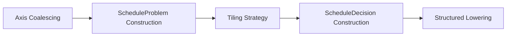

## 4. 第三层：Schedule

第三层把第二层输出的 `KernelPattern` 转换为可执行的调度决策（`ScheduleDecisionSet`），并由 `Structured Lowering` 将决策物化为稳定的结构化 IR，交给第四层做显式内存实现。

本层是 memory-aware scheduling：调度搜索必须感知片上 buffer 预算、数据复用、`cache_read/cache_write`、`double_buffer` 和 `pipeline` 约束。**第三层的输出是两个独立产物**：① 纯数据对象 `ScheduleDecisionSet`（不含 IR 变换）；② 由 `Structured Lowering` 产生的结构化 IR（loop 骨架与索引映射已固化，内存语义标记尚未物化）。第四层消费这两者，完成显式 buffer、placement 和数据搬运的实现。



| 项         | 内容                                                         |
| ---------- | ------------------------------------------------------------ |
| 输入       | 第二层输出的带 `KernelPattern[]`、`OpRoleMap`、`scheduleContract[]` 的 module |
| 输出       | ① `ScheduleDecisionSet[]`（纯数据）；② 调度后、bufferize 前的结构化 module |
| 主边界对象 | `ScheduleProblem`、`ScheduleDecisionSet`                     |

------

### 4.1 层间数据传递约定

**问题背景**：`OpRoleMap` 和 `scheduleContract[]` 是第二层的附加产物，不是 `KernelPattern` 的直接字段，需要明确传递方式，避免跨 pass 生命周期管理问题。

**传递规则**：

| 对象                    | 传递方式                                                   | 生命周期                                                     |
| ----------------------- | ---------------------------------------------------------- | ------------------------------------------------------------ |
| `KernelPattern[]`       | 附加为 `func` attribute（`AscendKernelPatternAttr`）       | 第三层入口读取，第五层结束后清除                             |
| `OpRoleMap`             | 附加为 per-op attribute（`AscendOpRoleAttr`），随 op 存活  | 第三层消费后不再需要；第三层末尾清除                         |
| `scheduleContract[]`    | 附加在对应 `KernelPattern` 的 `scheduleContractAttr` 字段  | 随 `KernelPattern` 携带；`ScheduleProblemBuilder` 消费后不再写入 IR |
| `ScheduleDecisionSet[]` | 附加为 `func` attribute（`AscendScheduleDecisionSetAttr`） | 第三层产出，第四、五层只读消费，第五层结束后清除             |
| `CoalescedAxisInfo`     | pass-local 分析结果，不写入 IR                             | 仅在当前 pass 生命周期内有效                                 |
| `ScheduleProblem`       | pass-local 数据对象，不写入 IR                             | 仅在当前 pass 生命周期内有效                                 |

`TargetMemoryModel` 和 `TargetHardwareInfo` 来自编译器初始化阶段构造的 target profile，第三至第五层共享，以只读引用方式注入各 pass，不通过 IR attribute 传递。

------

### 4.2 核心类与接口

| 类 / 接口                  | 职责                                                    | 输入                                                         | 输出                                |
| -------------------------- | ------------------------------------------------------- | ------------------------------------------------------------ | ----------------------------------- |
| `AxisCoalescer`            | 把 raw axes 归一化为 logical axes                       | `KernelPattern`、`OpSemanticSummary`                         | `CoalescedAxisInfo`                 |
| `ScheduleProblemBuilder`   | 汇总 shape、memory、hardware、structure 约束            | `KernelPattern`、`CoalescedAxisInfo`、`OpRoleMap`、`scheduleContract`、target 描述 | `ScheduleProblem`                   |
| `TemplateRegistry`         | 匹配 `scheduleFamily` 并选择 `ScheduleTemplate`         | `KernelPattern`、`ScheduleProblem`                           | `ScheduleTemplate`                  |
| `ScheduleSearch`           | 过滤并排序 `scheduleSearchSpace`，输出编译期候选        | `ScheduleProblem`、`TilingStrategy`                          | `SmallVector<ScheduleInstance>`     |
| `ScheduleDecisionBuilder`  | 精化选中候选，补充求值字段，组装最终决策集合            | `ScheduleInstance`、`ScheduleProblem`、可选 shape bucket     | `ScheduleDecisionSet`               |
| `StructuredLoweringDriver` | 把调度决策物化为结构化 IR                               | `ScheduleDecisionSet`、`KernelPattern`、`ScheduleProblem`    | 调度后、bufferize 前的结构化 module |
| `HandwrittenTilingStrategy` | `HandwrittenPattern` 旁路：生成参数化搜索空间并选出最优参数组合（见 4.8 节） | `HandwrittenPatternEntry`、`RuntimeShape` | `HandwrittenTilingInstance` |

> **旁路说明**：`scheduleContract` 为 `NotApplicable` 的 `KernelPattern`（即 `HandwrittenPattern`）不进入 `AxisCoalescer` → `ScheduleProblemBuilder` → `TemplateRegistry` → `ScheduleSearch` → `ScheduleDecisionBuilder` 的主流程，由 `HandwrittenTilingStrategy` 单独处理后直接输出 `ScheduleDecisionSet`，格式与主流程相同，第四层无感知。详见 4.8 节。

------

### 4.3 Axis Coalescing

#### 4.3.1 功能

把 `KernelPattern` 内的 raw axes 归一化为 logical axes，供后续调度搜索直接消费。

**核心对象定义**：

| 对象          | 最小身份             | 含义                                       |
| ------------- | -------------------- | ------------------------------------------ |
| `RawAxis`     | `(ownerOp, axisPos)` | 某 op 的一个原生迭代轴                     |
| `LogicalAxis` | `logicalAxisId`      | 由一个或多个 raw axes 归并得到的统一调度轴 |

#### 4.3.2 输出：`CoalescedAxisInfo`

| 字段                            | 类型                                            | 含义                                                         |
| ------------------------------- | ----------------------------------------------- | ------------------------------------------------------------ |
| `logicalAxes`                   | `SmallVector<LogicalAxis>`                      | coalesced logical axes 序列                                  |
| `axisKinds`                     | `DenseMap<LogicalAxis, AxisKind>`               | 每个 logical axis 的类型（Parallel / Reduction）             |
| `logicalExtentExprs`            | `DenseMap<LogicalAxis, DimExpr>`                | 每个 logical axis 的符号化 size；不可证明时记为 unavailable  |
| `rawAxesPerLogicalAxis`         | `DenseMap<LogicalAxis, SmallVector<RawAxis>>`   | 每个 logical axis 由哪些 raw axes 组成，**含路径来源标注**   |
| `rawToLogicalMap`               | `DenseMap<RawAxis, LogicalAxis>`                | raw → logical 映射                                           |
| `logicalToRawIndexExprs`        | `DenseMap<LogicalAxis, SmallVector<IndexExpr>>` | logical 索引反解回 raw 索引的表达式；不可反解时记为 unavailable |
| `parallelLogicalAxes`           | `SmallVector<LogicalAxis>`                      | 并行 logical axes                                            |
| `reductionLogicalAxes`          | `SmallVector<LogicalAxis>`                      | 规约 logical axes                                            |
| `broadcastLogicalAxes`          | `SmallVector<LogicalAxis>`                      | broadcast logical axes                                       |
| `coalescingBarriers`            | `SmallVector<AxisBarrier>`                      | 阻止继续合轴的边界                                           |
| `convergingPathsPerLogicalAxis` | `DenseMap<LogicalAxis, SmallVector<AxisPath>>`  | 每个 logical axis 的所有到达路径；菱形依赖时路径数 > 1，供 verifier 可追溯验证 |

`AxisBarrier` 最小字段：

| 字段            | 类型                       | 含义                                                         |
| --------------- | -------------------------- | ------------------------------------------------------------ |
| `barrierKind`   | `AxisBarrierKind`          | `GatherBarrier` / `BranchMergeBarrier` / `LayoutBarrier` / `SplitConcatBarrier` / `ConflictingPathBarrier` |
| `sourceRawAxes` | `SmallVector<RawAxis>`     | barrier 前的相关 raw axes                                    |
| `targetRawAxes` | `SmallVector<RawAxis>`     | barrier 后的相关 raw axes                                    |
| `anchorOps`     | `SmallVector<Operation *>` | 引入该 barrier 的关键 op                                     |
| `reason`        | `StringRef`                | 失败原因摘要                                                 |
| `isHardBarrier` | `bool`                     | 是否绝对禁止跨越合并；当前版本所有 barrier 均为 `true`，软 barrier（`false`）语义尚未定义，实现时不需要处理 `false` 分支 |

#### 4.3.3 合轴规则

实现策略：**能证明 trivial 才放行，否则保守记 barrier**。

| 场景                      | 规则                                                         |
| ------------------------- | ------------------------------------------------------------ |
| 连续 Elementwise 并行轴   | 允许合并：`[d0, d1, d2] → [d0d1d2]`                          |
| 连续规约轴                | 允许合并：`[k0, k1] → [k0k1]`                                |
| broadcast 轴              | 保留为独立 logical axis，可参与后续 reorder                  |
| gather 轴                 | 记 `GatherBarrier`，不跨越合并                               |
| branch / merge            | 记 `BranchMergeBarrier`，不跨越合并                          |
| layout transform（transpose、非 trivial reshape、pack/unpack 等改变轴语义的 op） | 记 `LayoutBarrier`，不跨越合并；对应 `AxisPath.mappingKind = LayoutTransform` |
| trivial split / concat    | 可不记 barrier，但必须通过 4.3.5 节步骤 2a 的显式证明；证明失败则记 `SplitConcatBarrier` |
| 非 trivial split / concat | 记 `SplitConcatBarrier`                                      |

`axisKinds` 归并规则：

- 所有来源 raw axes 均为 `parallel` → `Parallel`
- 所有来源 raw axes 均为 `reduction` → `Reduction`
- 同时出现 parallel 与 reduction → 禁止归并，记 barrier
- broadcast 不单独覆盖 `axisKinds`，通过 `broadcastLogicalAxes` 单独记录

#### 4.3.4 菱形依赖处理规则

**问题**：当同一个 raw axis 通过两条独立路径到达同一目标 op 时（菱形依赖），局部路径检查可能各自通过，但合并后违反全局一致性。

**实际发生概率**：在 Ascend-MLIR 的正常编译路径中，菱形依赖极少出现。第二层 `FusionCandidateAnalyzer` 在构造 `KernelPattern` 时已对 branch/merge、gather 等复杂结构单独处理，能进入同一 `KernelPattern.internalOps` 的子图结构已经比较规整；常见的 residual add 两条链语义对称、extent 相同，步骤 4 可以正常通过。本节的处理规则是防御性设计，确保 `AxisCoalescer` 的正确性不依赖"第二层一定过滤干净"的假设，实际编译中大概率不走 `ConflictingPathBarrier` 分支。

**辅助类型定义**：

`AxisPath` 最小字段：

| 字段          | 类型                       | 含义                                                     |
| ------------- | -------------------------- | -------------------------------------------------------- |
| `sourceAxis`  | `RawAxis`                  | 路径起点（来源 raw axis）                                |
| `targetAxis`  | `RawAxis`                  | 路径终点（目标 raw axis）                                |
| `hops`        | `SmallVector<Operation *>` | 路径经过的 op 序列（不含 source/target op 本身）         |
| `mappingKind` | `AxisMappingKind`          | `Identity / Broadcast / ReductionElim / LayoutTransform` |

`AxisMappingGraph` 最小字段：

| 字段      | 类型                                       | 含义                                                 |
| --------- | ------------------------------------------ | ---------------------------------------------------- |
| `edges`   | `SmallVector<AxisPath>`                    | 所有已证明的轴对应边                                 |
| `inEdges` | `DenseMap<RawAxis, SmallVector<AxisPath>>` | 某 raw axis 作为终点的所有入边（用于检测多路径汇合） |

**处理规则**：在构建 `AxisMappingGraph` 阶段，对每个候选 `logical axis` 记录其所有到达路径（`convergingPaths`）。若某个 raw axis 存在多条到达路径，则在合轴前执行全局一致性验证：

1. 收集该候选 logical axis 的所有来源 raw axes 及其完整路径
2. 验证所有路径上的 iteration kind、indexing 语义和顺序约束是否两两一致
3. 若任意两条路径存在不一致，在该 raw axis 处记录 `ConflictingPathBarrier` 并停止归并；不允许只验证其中一条路径

`rawAxesPerLogicalAxis` 字段须记录每个 raw axis 的来源路径，以便 verifier 可追溯验证，而不是只记录最终归并结果。`convergingPathsPerLogicalAxis` 字段已纳入 4.3.2 节主字段表。

#### 4.3.5 构造步骤

`AxisCoalescer` 所需的 producer-consumer 边来自两个来源：① `KernelPattern.internalOps` 中各 op 的 operand use-def 关系，可直接从 IR 中读取，不依赖第二层的 `ProducerConsumerIndex`（后者已在第二层分析完成后不再单独传递）；② `KernelPattern` 自身携带的 `externalInputs / externalOutputs` 边界信息，用于确定哪些值是从外部流入的，不构成 kernel 内部的 producer-consumer 边。`AxisCoalescer` 只在 `KernelPattern.internalOps` 范围内重建必要的轴对应关系，不扫描整个 module。

1. 从 `KernelPattern.internalOps` 提取每个 op 的 raw axes 视图

2. 基于 `internalOps` 范围内的 operand use-def 关系，逐条 producer-consumer 边判定轴映射类型，规则如下：
   - 读取两端 op 的 `OpSemanticSummary.indexingMaps`，对每对对应轴检查 affine 表达式：
     - affine 表达式为恒等（`d_i → d_i`）→ `Identity`
     - 来源轴为大小 1 的 broadcast 维度（`d_i → 0` 或维度本身为符号 1）→ `Broadcast`
     - 来源轴在目标端消失（reduction 语义，`d_i` 不出现在结果 indexing map 中）→ `ReductionElim`
     - 来源轴经过 transpose、非 trivial reshape、pack/unpack 等改变轴语义 → `LayoutTransform`；在此处直接记 `LayoutBarrier`，不进入后续合轴尝试
     - 无法归入上述任何类别 → 保守记 `ConflictingPathBarrier`，不进入合轴

   **步骤 2a（trivial split/concat 证明）**：若某条边的两端 op 是 split 或 concat，在记 barrier 之前先尝试证明 trivial 条件：① 切分/拼接的分段在目标轴上连续且无重叠、无空洞；② 切分/拼接之间只穿越 view-like 或 injective op；③ 分段顺序与目标轴顺序一致（无重排）。上述三条**同时成立**时视为 trivial，将对应轴映射记为 `Identity` 并继续合轴；任意一条不成立则记 `SplitConcatBarrier`。

3. 构建 `AxisMappingGraph`：将步骤 2 产出的所有合法边（`Identity / Broadcast / ReductionElim`）作为图的边集，`LayoutTransform` 和 barrier 边不进入图。记录每条边的 `mappingKind` 和 `hops`（经过的中间 op 序列）

4. 对每个候选 logical axis 执行全局一致性验证（见 4.3.4 节）；一致则合轴，否则记 `ConflictingPathBarrier`

5. 生成 `logicalAxes`、`axisKinds`、`logicalExtentExprs`；其中 `logicalExtentExprs` 可借助 `AscendSymbolConstraintAttr` 中已证明的维度等价关系辅助证明 extent 的符号等价性

6. 生成 `rawAxesPerLogicalAxis`（含路径来源）、`rawToLogicalMap`、`logicalToRawIndexExprs`、`convergingPathsPerLogicalAxis`。
   `logicalToRawIndexExprs` 的 unavailable 处理约定：
   - 对合并了多个 raw axes 的 logical axis，若反解表达式不可构造（如某个中间 reshape 引入了非线性变换），记为 `unavailable`
   - `unavailable` 的 logical axis 只允许在不需要索引代入的场景使用（如 tile 大小决策、block 映射），不允许用于 `StructuredLowering` 阶段的索引代入
   - `StructuredLoweringDriver` 在消费 `logicalToRawIndexExprs` 时，若遇到 `unavailable`，必须报编译错误，不允许静默跳过或使用近似值
   - 1:1 映射的 logical axis（单个 raw axis 未合并）其反解表达式恒为 identity，不会出现 `unavailable`

7. 生成 `parallelLogicalAxes`、`reductionLogicalAxes`、`broadcastLogicalAxes`

8. 输出 `CoalescedAxisInfo`

#### 4.3.6 案例

**Elementwise 链 `[d0, d1, d2]`**：

```
logicalAxes          = [d0d1d2]
axisKinds            = { d0d1d2: Parallel }
logicalExtentExprs   = { d0d1d2: d0 * d1 * d2 }
logicalToRawIndexExprs: flat → i2 = flat % d2, i1 = (flat/d2) % d1, i0 = flat/(d1*d2)
```

**broadcast axis 保留（`add(x[B, M, N], bias[N])`）**：

```
x[B, M, N] → add → y[B, M, N]
bias[N]    ↗        (bias 的 B、M 维度为 broadcast)
```

```
logicalAxes        = [B, M, N, N_bias]
axisKinds          = { B: Parallel, M: Parallel, N: Parallel, N_bias: Parallel }
broadcastLogicalAxes = [N_bias]        // bias 的 B/M 轴为 broadcast，不单独成轴；N 轴 identity 映射合入 N
rawToLogicalMap    = {
  x.axis[0] → B,  x.axis[1] → M,  x.axis[2] → N,
  bias.axis[0] → N_bias             // bias 只有 N 轴，mappingKind=Identity
}
coalescingBarriers = []              // 无 barrier；bias 的 broadcast 语义已由 broadcastLogicalAxes 记录
logicalToRawIndexExprs = {
  B → x.axis[0],  M → x.axis[1],  N → x.axis[2],  N_bias → bias.axis[0]
}
```

说明：bias 的 B、M 维度在 `add` 的 indexing map 中为 broadcast（大小 1），步骤 2 判定为 `Broadcast` 映射，不产生独立 logical axis，由 `broadcastLogicalAxes` 单独记录；`N` 轴 identity 映射，bias 的 `N_bias` 与 `x` 的 `N` 各自保留（大小相同但 owner 不同），均出现在 `logicalAxes` 中。

**非 trivial split / concat**：

```
x[M, N] → s0 = x[:, 0:N0] → relu → y0
         → s1 = x[:, N0:N] → exp  → y1
y = concat(y0, y1, dim=N)
```

步骤 2a 检查 trivial 条件：分段连续（`[0:N0]` 和 `[N0:N]` 无重叠无空洞）、中间只有 relu/exp（injective）、顺序一致——三条均满足，视为 trivial，`N` 轴记为 `Identity` 映射，不记 `SplitConcatBarrier`。

若分段间存在重排或中间有 gather，则三条不同时满足，记 `SplitConcatBarrier(N)`，不允许跨越继续合并 raw axes。

**菱形依赖**：

```
x[N]
  → a = pad(x, [0, P])   // a[N+P]；x.axis[0] → a.axis[0]，mappingKind=Identity，extent=N+P
  → b = slice(x, [0, N]) // b[N]；  x.axis[0] → b.axis[0]，mappingKind=Identity，extent=N
  → c = add(a[:N], b)    // 两条路径在 c 汇合
```

两条路径的 `mappingKind` 均为 `Identity`，步骤 2 各自通过，都进入 `AxisMappingGraph`。步骤 4 对 `c.axis[0]` 执行全局一致性验证时，发现 path-1（经 pad）的 extent 为 `N+P`，path-2（经 slice）的 extent 为 `N`，两条路径 indexing 语义不一致，记 `ConflictingPathBarrier`。

结果：`a.axis[0]` 和 `b.axis[0]` 分属两个独立 logical axis，各自参与后续调度，`c` 的两个操作数在 tile 计算中独立对待，不允许归并为同一 logical axis。

**注意**：若 path-2 经过的是 `transpose` 或 `reshape` 等 layout transform，在步骤 2 就直接记 `LayoutBarrier` 并退出，不会进入步骤 4 的全局验证——菱形依赖处理规则只针对两条路径都通过步骤 2 但在汇合点出现语义矛盾的情形。

#### 4.3.7 最小接口

```cpp
class AxisCoalescer {
public:
  FailureOr<CoalescedAxisInfo>
  build(const KernelPattern &pattern,
        const OpSemanticSummaryMap &summaries,
        DiagnosticEmitter &diag) const;
};
```

------

### 4.4 ScheduleProblem

#### 4.4.1 功能

把 `KernelPattern + CoalescedAxisInfo` 转成可求解的调度输入。后续调度决策只消费 `ScheduleProblem`，不再回看第二层候选分析细节。

`scheduleContract` 到 `ScheduleProblem` 的字段映射关系显式声明如下（见 4.4.3 节），保证信息不丢失且不重复推导。

#### 4.4.2 输出：`ScheduleProblem`

| 字段                   | 类型                               | 含义                                                         |
| ---------------------- | ---------------------------------- | ------------------------------------------------------------ |
| `pattern`              | `KernelPattern`                    | 当前 kernel 对应的 pattern                                   |
| `logicalAxes`          | `SmallVector<LogicalAxis>`         | 当前 kernel 的 logical axes                                  |
| `parallelAxes`         | `SmallVector<LogicalAxis>`         | 可直接并行的 logical axes                                    |
| `reductionAxes`        | `SmallVector<LogicalAxis>`         | reduction logical axes                                       |
| `broadcastAxes`        | `SmallVector<LogicalAxis>`         | 带 broadcast 关系的 logical axes                             |
| `symbolicShape`        | `SmallVector<DimExpr>`             | ranked symbolic shape                                        |
| `shapeConstraints`     | `SmallVector<ShapeConstraint>`     | 维度相等、广播相容、整除、对齐等约束                         |
| `memoryConstraints`    | `SmallVector<MemoryConstraint>`    | placement、movement、tile 容量、alignment、on-chip keepalive 约束 |
| `hardwareConstraints`  | `SmallVector<HardwareConstraint>`  | execution mapping、compute unit 使用、pipeline、并行度、原生 tile 合法性约束 |
| `structureConstraints` | `SmallVector<StructureConstraint>` | primitive 带来的结构限制                                     |
| `guardBudget`          | `int32_t`                          | 当前 kernel 允许的最大 guard 数量（来自编译器配置）          |

四类约束共同构成联合合法性条件，后续 `ScheduleInstance` 必须同时满足。

#### 4.4.3 scheduleContract 到 ScheduleProblem 的映射

`scheduleContract` 是第二层的输出，`ScheduleProblemBuilder` 必须按以下规则将其完整转换为 `ScheduleProblem` 中的对应约束，不允许静默丢弃任何字段：

| `scheduleContract` 字段 | 转换目标                                                     | 转换规则                                                     |
| ----------------------- | ------------------------------------------------------------ | ------------------------------------------------------------ |
| `tileableAxes`          | `StructureConstraint::TilePropagationConsistency`            | 将允许切分的 logical axes 集合提升为 tile 传播约束；非 tileable 轴对应的 logical axis 的 `schedulingConstraint` 设为 `NoSplit` |
| `requiredReductionAxes` | `StructureConstraint::PrimaryOpOrdering` + `HardwareConstraint::ReductionExecutionRule` | 强制这些轴保持为 reduction 语义，不允许被重分类；同时写入 hardware 约束限制其 tile 行为 |
| `layoutConstraints`     | `StructureConstraint::LayoutBarrierRespect`                  | 直接提升为结构约束；每条 layout 约束对应一个 `LayoutBarrierRespect` 实例 |
| `mustKeepOnChipValues`  | `MemoryConstraint::MustKeepOnChip`                           | 逐值直接转换；第四层 `PlacementPlanner` **必须遵从**此约束，不允许忽略或覆盖（见 4.4.4 节） |
| `templateFamilies`      | 传递给 `TemplateRegistry.matchFamilies()` 做候选过滤         | 不写入 `ScheduleProblem` 约束字段；只用于 family 选择阶段的合法性过滤 |
| `dynamicGuardSet`       | `ScheduleProblem.guardBudget` 的初始值来源                   | 将第二层已知的 guard 数量计入预算消耗；剩余预算供第三层继续添加 guard |

**`coalescingBarriers` 到 `StructureConstraint` 的转换**：上表只覆盖 `scheduleContract` 字段。`CoalescedAxisInfo.coalescingBarriers` 是另一条独立来源，由 `StructureConstraintBuilder` 在步骤 8 中按以下规则转换（与 `scheduleContract.layoutConstraints` 路径互补，不重叠）：

| `barrierKind`             | 转换目标                                      | 转换规则                                                     |
| ------------------------- | --------------------------------------------- | ------------------------------------------------------------ |
| `GatherBarrier`           | `StructureConstraint::PreserveGatherAxis`      | 每个 barrier 对应一个实例；`sourceRawAxes` 映射为受保护的 logical axis |
| `BranchMergeBarrier`      | `StructureConstraint::BranchMergePairing`      | 每对 branch/merge barrier 合并为一个实例；要求配对完整       |
| `SplitConcatBarrier`      | `StructureConstraint::LayoutBarrierRespect`    | 与来自 `scheduleContract.layoutConstraints` 的实例合并到同一列表；不允许重复生成 |
| `ConflictingPathBarrier`  | 不生成新约束；barrier 两侧的 raw axes 已分属不同 logical axis，各自独立参与调度 | —                                                            |

`SplitConcatBarrier` 与 `scheduleContract.layoutConstraints` 同时存在时，以 `scheduleContract` 给出的实例为准，`coalescingBarriers` 的转换结果仅作补充，不允许覆盖。

**`HorizontalFusionCandidate` 的处理规则**：当 `KernelPattern.scheduleContract` 的类型为 `SmallVector<ScheduleContract>`（即 `perGroupContracts`，由第二层 `HorizontalFusionCandidate` 携带）时，`ScheduleProblemBuilder` 按以下规则处理：

- 检查 `primitives` 字段中是否含 `HorizontalFusion` 标记以判定当前 pattern 是水平融合 kernel
- 对每个兄弟候选组的 `ScheduleContract` **独立**构造一套 `ScheduleProblem`，不做跨组约束合并或 tile 轴取交集
- 各组的 `ScheduleProblem` 独立进入 4.5—4.7 节的通用流程，各自产出 `ScheduleDecisionSet`
- `StructuredLoweringDriver` 为各组分别生成独立的 loop 骨架，组间不共享 tile 作用域；共享输入（`sharedInputs`）的 load 在各组 loop 骨架中各自独立出现，由第四层 `PlacementPlanner` 负责识别并消除重复搬运

**不允许的做法**：`ScheduleProblemBuilder` 不得对上表中任何字段做"按需推导"——即不得在第二层已经给出约束的情况下，在第三层重新从 `OpSemanticSummary` 推导等价约束并替换第二层结果。

**`OpSemanticSummary` 在第三层的合法消费场景**：`OpSemanticSummary` 传入 `ScheduleProblemBuilder` 的唯一合法用途是补充第二层 `scheduleContract` 未覆盖的细节，不是替代 `scheduleContract` 已给出的约束。具体只允许以下三类使用：① `ShapeConstraintBuilder` 在归一化 `symbolicShape` 时，从 `OpSemanticSummary.resultShape` 读取主输出的符号化维度表达式；② `MemoryConstraintBuilder` 在识别需要 on-chip 传递的 carried values 时，从 `OpSemanticSummary.indexingMaps` 确认 producer-consumer 间的 tile 传播关系；③ `StructureConstraintBuilder` 在补充 gather/branch/merge 结构约束时，从 `OpSemanticSummary.semanticAttrs` 读取 `gather_dim` 等结构属性（前提是该信息未被 `scheduleContract.layoutConstraints` 已覆盖）。除上述三类之外，不允许从 `OpSemanticSummary` 读取任何字段用于约束推导。

#### 4.4.4 promotionHints 的跨层契约

`ScheduleDecision.promotionHints` 是第三层向第四层传递的片上提升意图，其约束力按以下规则定义：

| `promotionHints` 来源                                        | 第四层 `PlacementPlanner` 的处理义务                         |
| ------------------------------------------------------------ | ------------------------------------------------------------ |
| 来自 `scheduleContract.mustKeepOnChipValues`提升的 hint      | **强制约束**：`PlacementPlanner` 必须为该 value 安排片上 placement，如实际 memory 容量不足则报编译错误，不允许静默降级到 GM |
| 来自第三层收益模型推断的 hint（`preferred execution unit`、`reuse scope`） | **建议性约束**：`PlacementPlanner` 优先遵从；若与实际容量或 memory path 冲突，允许降级并输出 warning，不报错 |

`promotionHints` 必须携带 `isBinding: bool` 字段，以区分强制与建议：

```cpp
struct PromotionHint {
  Value value;
  ValueRole role;           // 该 value 在 tile 计算中的语义角色
  ReuseScope reuseScope;    // 复用作用域
  ComputeUnit preferredUnit;
  int priority;
  bool isBinding;           // true = 强制约束（来自 mustKeepOnChipValues）
                            // false = 建议性（来自收益推断）
};
```

#### 4.4.5 四类约束说明

**`ShapeConstraint` 最小类型集合**：

| 类型                      | 作用                                                |
| ------------------------- | --------------------------------------------------- |
| `DimEquality`             | 约束两个维度表达式相等                              |
| `BroadcastCompatibility`  | 约束某轴满足 `lhs == rhs` / `lhs == 1` / `rhs == 1` |
| `ReductionElimination`    | 约束 reduction 前后的轴消去关系                     |
| `DivisibilityRequirement` | 约束 `expr % divisor == 0`                          |
| `RangeBound`              | 约束 `lower <= expr <= upper`                       |

**`MemoryConstraint` 最小类型集合**：

| 类型                   | 作用                                                        |
| ---------------------- | ----------------------------------------------------------- |
| `CapacityLimit`        | 限制 tile / temp buffer / cache buffer 总容量               |
| `AlignmentRequirement` | 限制 value 或 tile 的对齐要求                               |
| `MustKeepOnChip`       | 指定某中间值必须片上传递，不能先回 GM（`isBinding = true`） |
| `RequiredMemoryPath`   | 指定数据搬运必须经过的 memory path                          |
| `DoubleBufferSupport`  | 指定某路径是否允许双缓冲                                    |
| `TempBufferBudget`     | 限制额外临时 buffer 预算                                    |

**`HardwareConstraint` 最小类型集合**：

| 类型                         | 作用                                       |
| ---------------------------- | ------------------------------------------ |
| `RequiredComputeUnit`        | 指定某段计算必须映射到某类 compute unit    |
| `ForbiddenComputeUnit`       | 禁用某类 compute unit                      |
| `ParallelismUpperBound`      | 限制 block / core 级并行上限；来自 `TargetHardwareInfo.ai_core_cnt` |
| `NativeTileShapeRequirement` | 指定 tile shape 必须落在 target 支持范围内 |
| `ReductionExecutionRule`     | 指定 reduction 的合法执行骨架              |
| `UnitCombinationRule`        | 指定多类 compute unit 是否允许组合使用     |

`OpRoleMap` 在 `HardwareConstraintBuilder` 中的消费路径：`OpRoleMap` 是 `HardwareConstraintBuilder` 推导计算单元约束的唯一来源，不再从 IR 重新推导角色。具体规则：若某 `primaryOp` 的主角色为 `Anchor`，则生成 `RequiredComputeUnit{Cube}`；若 `roles` 中出现 `Injective`（无 `Anchor`），则生成 `RequiredComputeUnit{Vector}`；若同时出现 `Anchor` 和 `Injective/Reduction`，则生成 `UnitCombinationRule{Cube+Vector}`。`OpRoleMap` 不用于 `ShapeConstraintBuilder`、`MemoryConstraintBuilder` 或 `StructureConstraintBuilder`。

**`StructureConstraint` 最小类型集合**：

| 类型                         | 作用                                                        |
| ---------------------------- | ----------------------------------------------------------- |
| `PreserveGatherAxis`         | 保持 gather 轴的访问边界不被 tile/reorder 破坏              |
| `BranchMergePairing`         | 保持 branch/merge 结构配对完整                              |
| `LayoutBarrierRespect`       | 禁止跨 layout barrier 做非法 coalesce / reorder / tile 传播 |
| `TilePropagationConsistency` | 约束 producer-consumer 之间 tile 传播必须一致               |
| `PrimaryOpOrdering`          | 保持多主角色 op 的相对顺序不被破坏                          |

#### 4.4.6 构造步骤

`ScheduleProblemBuilder` 按以下步骤构造：

1. 从 `CoalescedAxisInfo` 读取逻辑轴、`axisKinds`、`logicalExtentExprs` 和 `coalescingBarriers`
2. 归一化输出 shape，构造 `symbolicShape`（从 `OpSemanticSummary.resultShape` 读取主输出维度；合法使用场景见 4.4.3 节）
3. 从 `scheduleContract` 按 4.4.3 节映射规则提取初始约束
4. 读取 `func` attribute 上的 `AscendSymbolConstraintAttr`：其中已证明等价的维度对，提升为 `ShapeConstraint::DimEquality`，作为 `shapeConstraints` 的初始条目；`AxisCoalescer` 也在合轴时消费过该 attr 用于证明轴映射，此处是在 `ScheduleProblem` 级别再次显式化等价关系，两者不冲突
5. `ShapeConstraintBuilder.build()` → `shapeConstraints`（补充推导，不覆盖来自 scheduleContract 和 `AscendSymbolConstraintAttr` 的约束）
6. `MemoryConstraintBuilder.build()` → `memoryConstraints`：`mustKeepOnChipValues` 已在步骤 3 转换为 `MustKeepOnChip`，此处补充以下两类约束：
   - `CapacityLimit`：从 `TargetMemoryModel.capacity[UB]`（即 `CapacityRule.availableCapacity`）读取片上可用容量，生成一条针对 UB 的联合容量约束——`mustKeepOnChipValues` 中所有值的 tile 字节数之和加上 temp buffer 预算不得超过该上限。Cube 和 Vector 共享同一 UB 总容量，不按执行单元分别限制（`CapacityRule.partitionedByUnit = false`）
   - `RequiredMemoryPath` / `AlignmentRequirement` / `DoubleBufferSupport`：从 `TargetMemoryModel.pathGraph`、`alignment`、`visibilityRules` 按各 value 的目标 place 逐条生成

7. `HardwareConstraintBuilder.build()` → `hardwareConstraints`：从 `OpRoleMap` 推导计算单元约束（见 4.4.5 节）；`ParallelismUpperBound` 从 `TargetHardwareInfo.ai_core_cnt` 读取

8. `StructureConstraintBuilder.build()` → `structureConstraints`：先按步骤 3 已转换的 `layoutConstraints`、`tileableAxes` 为基础，再将步骤 1 读取的 `coalescingBarriers` 按 4.4.3 节转换规则补充转换（`GatherBarrier` → `PreserveGatherAxis`，`BranchMergeBarrier` → `BranchMergePairing`，`SplitConcatBarrier` → `LayoutBarrierRespect` 补充项，`ConflictingPathBarrier` 不生成约束）；`SplitConcatBarrier` 与 `scheduleContract.layoutConstraints` 重叠时以后者为准

9. 初始化 `guardBudget`（来自编译器配置，扣除 `dynamicGuardSet` 已消耗数量）

10. 运行 `ScheduleProblemVerifier` 并输出

四个 builder 共享同一构造上下文 `ScheduleProblemBuildContext`，最小字段如下；互不依赖对方结果：

```cpp
struct ScheduleProblemBuildContext {
  const KernelPattern &pattern;
  const CoalescedAxisInfo &axisInfo;
  const OpRoleMap &roleMap;
  const scheduleContract &contract;
  const OpSemanticSummaryMap &summaries;
  const TargetMemoryModel &memoryModel;
  const TargetHardwareInfo &hardwareInfo;
  DiagnosticEmitter &diag;
};
```

#### 4.4.7 搜索阶段的消费方式

| 约束字段               | 作用                                                         |
| ---------------------- | ------------------------------------------------------------ |
| `shapeConstraints`     | 删除 shape 关系不成立的 `ScheduleInstance`                   |
| `memoryConstraints`    | 删除放不下、搬不动、对齐不满足或违反 on-chip keepalive 的候选 |
| `hardwareConstraints`  | 删除无法映射到目标执行资源、超过并行 / 流水限制或 tile shape 非法的候选 |
| `structureConstraints` | 删除破坏 gather / branch / merge / layout / tile 契约的候选  |

#### 4.4.8 案例

**`matmul + add + leakyrelu`**：

| 字段                   | 值                                                           |
| ---------------------- | ------------------------------------------------------------ |
| `logicalAxes`          | M、N                                                         |
| `parallelAxes`         | M、N                                                         |
| `reductionAxes`        | K                                                            |
| `symbolicShape`        | `[M, N]`                                                     |
| `memoryConstraints`    | matmul 输出 tile 必须可片上传递给后续 epilogue（来自 `mustKeepOnChipValues`，isBinding=true） |
| `hardwareConstraints`  | 同时使用 Cube 和 Vector                                      |
| `structureConstraints` | epilogue 跟随 matmul 输出，不允许破坏主链顺序                |
| `guardBudget`          | 由编译器配置给出（默认 8）                                   |

------

### 4.5 Tiling Strategy

#### 4.5.1 功能

根据 `ScheduleProblem` 选择 `scheduleFamily`、`scheduleTemplate`，生成调度骨架和受约束的 `ScheduleInstance`搜索空间。本阶段决定"按哪类方法解"和"允许哪些调度原语组合进入后续决策"，但不生成最终 `ScheduleDecision`。

#### 4.5.2 输出：`TilingStrategy`

| 字段                  | 类型                             | 含义                                          |
| --------------------- | -------------------------------- | --------------------------------------------- |
| `scheduleFamily`      | `ScheduleFamilyKind`             | 调度方法族                                    |
| `scheduleTemplate`    | `ScheduleTemplateKind`           | 选中的具体调度模板                            |
| `schedulePrimitives`  | `SmallVector<SchedulePrimitive>` | 该模板允许使用的 schedule 原语                |
| `scheduleSkeleton`    | `ScheduleSkeleton`               | 针对当前 `ScheduleProblem` 自动派生的调度骨架 |
| `solveMode`           | `SolveMode`（枚举：`RuleBased / PluginPolicy / AutotuneOnly`） | `RuleBased` = 纯规则驱动，按模板骨架直接枚举候选，不调用外部插件；`PluginPolicy` = 允许注册外部策略插件参与候选生成或排序；`AutotuneOnly` = 跳过规则枚举，完全由 Level-2 Autotuner 生成候选（仅在 `enableLevel2Autotuner=true` 时合法）。默认值为 `RuleBased` |
| `scheduleSearchSpace` | `ScheduleSearchSpace`            | 过滤后保留的 `ScheduleInstance` 候选空间      |
| `compileTimeTopK`     | `int64_t`                        | 编译期保留的候选上限                          |

#### 4.5.3 scheduleFamily 选择

#### `templateFamilies` 标签到 `scheduleFamily` 的映射

第二层 `scheduleContract.templateFamilies` 是字符串标签集合（如 `"AnchorEpilogue"`、`"SoftmaxTemplate"`），第三层通过以下机制消费：

`TemplateRegistry.matchFamilies()` 在对所有预置 `scheduleFamily` 做准入条件匹配时，会额外检查当前 `KernelPattern.scheduleContract.templateFamilies` 是否包含该 family 在注册表中声明的标签名。若某 family 的标签不在 `templateFamilies` 中，则该 family 直接被排除，不进入后续准入条件检查。反之，若 `templateFamilies` 中出现了注册表中不存在对应 family 的标签，则第三层报 `TemplateUnavailable` 错误。

**标签到 family 的固定映射**（在 `TemplateRegistry` 注册时声明，不允许运行时动态修改）：

| `templateFamilies` 标签   | 对应 `scheduleFamily`    |
| ------------------------- | ------------------------ |
| `"AnchorEpilogue"`        | `MatmulEpilogueFamily`   |
| `"SoftmaxTemplate"`       | `SoftmaxFamily`          |
| `"ReductionTemplate"`     | `ReductionFamily`        |
| `"IndexedFusionTemplate"` | `IndexedFusionFamily`    |
| `"MultiBranchTemplate"`   | `MultiBranchFamily`      |
| `"TransposeTemplate"`     | `TransposeFamily`        |
| `"InjectiveTemplate"`     | `GenericInjectiveFamily` |

新增 `scheduleFamily` 时必须同步在此映射表中声明对应标签，并在 `TemplateRegistry` 注册时写入该标签，不允许存在未映射的 family 或未对应 family 的标签。

#### 预置 scheduleFamily

`scheduleFamily` 是封装了一类 kernel 调度方法的标签，`scheduleTemplate` 是其下的具体实现。预置集合如下（可扩展，不封闭）：

| `scheduleFamily`         | 准入条件                                                     | 骨架规则摘要                                                 |
| ------------------------ | ------------------------------------------------------------ | ------------------------------------------------------------ |
| `MatmulEpilogueFamily`   | 存在 Anchor（contraction-like），可挂接不破坏主链 tile 传播的 elementwise epilogue | 固定 anchor 骨架；优先在输出平面轴做 block/UB tile，再决定主规约轴切分层次，epilogue 跟随输出 tile 传播 |
| `ReductionFamily`        | 主导 Reduction，前后可融合 elementwise / broadcast           | 划分 parallel/reduction axes；围绕输出平面做 block/UB tile；选择 `ReductionExecutionRule` |
| `IndexedFusionFamily`    | gather / indexing 主导，后续只融合不破坏索引边界的 elementwise | 固定 gather 输出平面；禁止破坏 indexing 边界的 reorder/tile  |
| `MultiBranchFamily`      | 带 branch / merge 结构约束，且成对出现并能建立统一 tile 契约 | 围绕共享输出平面建立统一 tile 骨架；branch 两侧共用兼容 tile 传播与执行顺序 |
| `TransposeFamily`        | transpose / layout transform 主导 memory path，后续只挂少量 elementwise | 固定转置后输出平面与重排顺序                                 |
| `SoftmaxFamily`          | 存在主导 `Reduction`（max reduce）且紧跟完整 softmax 结构（sub→exp→sum reduce→div），前后可融合 `Injective`；需在 `TemplateRegistry` 注册专用 `SoftmaxTemplate` | 固定两个 reduction 的联合骨架；要求两个 reduction 的 tile 轴相同；围绕 seq 轴做 block/UB tile，col 轴做 inner reduction |
| `GenericInjectiveFamily` | 纯 elementwise / injective 链，无更强 scheduleFamily 可承接  | 围绕统一输出平面建立单骨架                                   |

#### scheduleTemplate 与 scheduleFamily 的关系

一个 `scheduleFamily` 下可以有多个 `scheduleTemplate`。`scheduleTemplate` 是 family 骨架规则在特定结构变体上的具体实现——family 定义"用哪类方法解"，template 定义"在该方法下如何处理当前结构"。

**Template 选择逻辑**：确定 family 之后，`TemplateRegistry` 对该 family 下注册的所有 template 依次调用 `isApplicable()`，选择第一个通过的 template。Template 按注册顺序检查，特化程度更高的 template 先注册，兜底 template 最后注册。

**兜底约束**：每个 family 必须有一个兜底 template（fallback），其 `isApplicable()` 在该 family 准入条件满足时恒返回 `true`，保证 template 选择不会失败。

**各 family 预置 template 列表**（按注册顺序，即匹配优先级从高到低）：

| `scheduleFamily`         | 预置 template 列表（按注册顺序）                                                                                                  |
| ------------------------ | --------------------------------------------------------------------------------------------------------------------------------- |
| `MatmulEpilogueFamily`   | `MatmulNNTemplate`（A non-transposed，B non-transposed）、`MatmulNTTemplate`（B transposed）、`MatmulTNTemplate`（A transposed）、`MatmulEpilogueGenericTemplate`（兜底） |
| `ReductionFamily`        | `ReductionLastAxisTemplate`（reduction 在最后一轴）、`ReductionMultiAxisTemplate`（多轴 reduction）、`ReductionGenericTemplate`（兜底）                                  |
| `SoftmaxFamily`          | `SoftmaxOnlineTemplate`（online softmax，seq 轴动态）、`SoftmaxStaticTemplate`（静态 seq 轴）                                     |
| `IndexedFusionFamily`    | `GatherEpilogueTemplate`                                                                                                          |
| `MultiBranchFamily`      | `BranchMergeTemplate`                                                                                                             |
| `TransposeFamily`        | `TransposeContiguousTemplate`（连续转置）、`TransposeGenericTemplate`（兜底）                                                     |
| `GenericInjectiveFamily` | `GenericInjectiveTemplate`（唯一 template，兼作兜底）                                                                             |

#### 多 family 同时匹配时的优先级规则

当多个 `scheduleFamily` 同时满足准入条件时，按以下优先级选择（数值越大优先级越高）。优先级在 `TemplateRegistry` 中静态注册，不依赖遍历顺序：

| `scheduleFamily`         | 默认优先级 | 优先级说明                                                   |
| ------------------------ | ---------- | ------------------------------------------------------------ |
| `MatmulEpilogueFamily`   | 100        | Anchor 主导，结构最特化                                      |
| `IndexedFusionFamily`    | 90         | Indexing 主导，gather 边界需专用处理                         |
| `MultiBranchFamily`      | 80         | Branch/merge 结构强依赖，通用路径无法正确处理                |
| `TransposeFamily`        | 70         | 专用 memory path，通用骨架不足                               |
| `SoftmaxFamily`          | 65         | 双 Reduction 联合骨架，`ReductionFamily` 无法承接跨两个 reduction 的结构 |
| `ReductionFamily`        | 60         | Reduction 主导                                               |
| `GenericInjectiveFamily` | 10         | 兜底，仅在无更强 family 匹配时使用                           |

**同优先级并列处理规则**：同一优先级下若仍有多个 family 匹配，按以下顺序打破：

1. 结构匹配更强（更多 `scheduleContract` 字段被覆盖）的 family 优先
2. 模板 `scheduleFamily` 名字典序更小的优先
3. 不允许再引入其他随机或私有 tie-break

**新增 scheduleFamily 的最小要求**：

- 必须在 `TemplateRegistry` 中声明固定优先级，并说明与所有现有 family 的优先级关系
- 能用现有 `ScheduleProblem` 字段表达准入条件（否则先扩展 `ScheduleProblem`）
- 能生成自洽的 `scheduleSkeleton` 和非空 `scheduleSearchSpace`
- 至少补充一个正例和一个失败例

#### 4.5.4 schedulePrimitives

`schedulePrimitives` 是第三层内部调度语义原语，不等同于 Transform dialect op 集合。

| 原语              | 类别     | 含义                               |
| ----------------- | -------- | ---------------------------------- |
| `split`           | 结构原语 | 把逻辑轴切成外层 / 内层            |
| `tile`            | 结构原语 | 对逻辑轴生成块化切分               |
| `reorder`         | 结构原语 | 对切后轴做重排                     |
| `hoist_invariant` | 结构原语 | 把不依赖当前循环轴的计算或搬运外提 |
| `vectorize`       | 结构原语 | 指定向量化轴                       |
| `bind_block`      | 结构原语 | 指定 block 级映射                  |
| `cache_read`      | 内存原语 | 为输入值建立局部缓存副本           |
| `cache_write`     | 内存原语 | 为输出或中间值建立局部缓存副本     |
| `pipeline`        | 结构原语 | 标记流水结构；当前固定 2 级，与 `double_buffer` 配合使用 |
| `double_buffer`   | 内存原语 | 为搬运 / 计算重叠建立双缓冲；是当前唯一支持的 pipeline 实现形式 |

默认物化顺序：`split/tile → reorder → bind_block → hoist_invariant → cache_read/cache_write → pipeline/double_buffer → vectorize`。

可复用 Transform dialect 的原语：`split`、`tile`、`reorder`、`vectorize`（部分）。`cache_read/cache_write`、`pipeline`、`double_buffer`、`bind_block` 默认由第四层本地 materializer 实现。

#### 4.5.5 scheduleSkeleton

`scheduleSkeleton` 是 `scheduleTemplate` 针对当前 `ScheduleProblem` 自动派生的骨架对象，不是人工逐 kernel 编写。

**最小字段**：

| 字段                 | 类型                         | 含义                               |
| -------------------- | ---------------------------- | ---------------------------------- |
| `axisDecisions`      | `SmallVector<AxisDecision>`  | 每个 logical axis 的调度角色和约束 |
| `ubTilingAxes`       | `SmallVector<LogicalAxisId>` | 进入片上 tile 的 logical axes      |
| `blockSplitAxes`     | `SmallVector<LogicalAxisId>` | block 级切分轴                     |
| `reductionPlacement` | `ReductionPlacementKind`     | reduction 轴位于内层还是外层       |
| `vectorizationAxes`  | `SmallVector<LogicalAxisId>` | 倾向 vectorize 的轴                |
| `loadOrderPolicy`    | `SmallVector<LogicalAxisId>` | tile 搬运顺序策略                  |
| `computeOrderPolicy` | `SmallVector<LogicalAxisId>` | tile 内计算顺序策略                |
| `cachePolicy`        | `DefaultCachePolicy / BroadcastReusePolicy / OnChipCarryPolicy / AnchorEpiloguePolicy` | cache 原语使用策略；由 `buildSkeleton()` 根据下文规则选择 |

**`AxisDecision` 最小字段**：

| 字段                   | 类型                        | 含义                                               |
| ---------------------- | --------------------------- | -------------------------------------------------- |
| `axis`                 | `LogicalAxisId`             | 当前 logical axis                                  |
| `axisRole`             | `AxisRole`                  | `Parallel / Reduction`                             |
| `parallelPriority`     | `int`                       | 并行优先级，-1 表示非并行                          |
| `schedulingConstraint` | `AxisSchedulingConstraint`  | `Free / NoSplit / NoBlockSplit / SerialOnly`       |
| `axisProperties`       | `SmallVector<AxisProperty>` | `BroadcastLike / LayoutSensitive / IndexSensitive` |
| `enableUbTile`         | `bool`                      | 是否允许进入 UB tile                               |
| `enableBlockSplit`     | `bool`                      | 是否允许做 block 级切分                            |

说明："不可切"是 `AxisSchedulingConstraint`，不是 `AxisRole`。不可切轴既可以是 Parallel 也可以是 Reduction。

#### 派生规则

`buildSkeleton()` 根据 `AxisDecision` 序列和 `ScheduleProblem` 中的约束，按以下规则填充骨架字段：

**`ubTilingAxes` 选择规则**：

- 所有 `axisRole=Parallel` 且 `enableUbTile=true` 的 logical axis 进入 `ubTilingAxes`
- Reduction 轴若在内层（`reductionPlacement=Inner`）也进入 `ubTilingAxes`；若在外层（`reductionPlacement=Outer`）则不进入

**`blockSplitAxes` 选择规则**：

- 从 `parallelAxes` 中选 `enableBlockSplit=true` 的轴，按 `parallelPriority` 降序排列
- 选出的轴数量不超过 3（对应 blockX/Y/Z）
- 若 `parallelPriority` 相同，优先选 `logicalExtentExprs` 较大的轴（更大的轴切分并行度更高）

**`reductionPlacement` 决策规则**：

- 若 `ScheduleProblem.hardwareConstraints` 中存在 `ReductionExecutionRule` 且指定了 reduction 必须在内层 → `Inner`
- 若 reduction 轴的 extent 较小（符号化无法判断时默认按 `Inner`）→ `Inner`
- 其余情况 → 由 template 的 `buildSkeleton()` 实现决定，默认 `Inner`

**`cachePolicy` 选择规则**：

| 条件                                                       | 选择的 `cachePolicy`    |
| ---------------------------------------------------------- | ----------------------- |
| 存在 `broadcastAxes`                                       | `BroadcastReusePolicy`  |
| 存在 `MustKeepOnChip` 约束的值                             | `OnChipCarryPolicy`     |
| 存在 Anchor（Cube）+ epilogue（Vector）                    | `AnchorEpiloguePolicy`  |
| 以上条件均不满足                                           | `DefaultCachePolicy`    |

多个条件同时成立时，按表中从上到下的优先级选择第一个匹配项。

#### 4.5.6 ScheduleInstance 与搜索空间

`ScheduleInstance` 是搜索空间中的**候选描述**：符号化、不完整，仅描述调度形态（切哪些轴、轴如何分层、cache/pipeline 策略等）和 tile 参数表达式，不把某个 concrete tile 当成后续 lowering 的唯一事实。`ScheduleDecision` 是其**精化结果**：已求值、带 guard、字段完整。两者关系通过组合而非字段复制表达（见 4.6.2 节）。

**符号化 tile 约束**：第三层不得把 `selected_tile_shape` 作为第四、五层的主 contract。主 contract 是 `tile_params`：每个 logical tile 维度都有 `name`、`axis`、`binding`、`default`、`upper_bound`、`extent`、`roles` 和 `primitive_uses`。其中 `default` 是 host tiling 在没有 tuning 命中时的默认值，`upper_bound` 是资源合法性上界，二者都不是编译期固定 loop step。`selected_tile_shape` 只允许作为 legacy/debug 字段保留，不能成为新 lowering 的必需输入。

**`ScheduleInstance` 最小字段**：

| 字段                 | 类型                                        | 含义                                             |
| -------------------- | ------------------------------------------- | ------------------------------------------------ |
| `scheduleInstanceId` | `StringRef`                                 | 唯一标识                                         |
| `scheduleTemplate`   | `ScheduleTemplateKind`                      | 所属模板                                         |
| `candidateGuards`    | `SmallVector<GuardExpr>`                    | 编译期附着的 bucket / shape / alignment 过滤条件 |
| `axisDecisions`      | `SmallVector<AxisDecision>`                 | 该变体的轴决策（符号化）                         |
| `tileAxes`           | `SmallVector<LogicalAxisId>`                | 被切分的轴（符号化）                             |
| `tileExprs`          | `DenseMap<LogicalAxisId, Expr>`             | 各轴 tile 表达式（符号化，含参数化变量）         |
| `loadOrder`          | `SmallVector<LogicalAxisId>`                | tile 搬运顺序                                    |
| `computeOrder`       | `SmallVector<LogicalAxisId>`                | tile 内计算顺序                                  |
| `blockMapping`       | `DenseMap<LogicalAxisId, BlockMappingKind>` | block 映射方式                                   |
| `cacheChoices`       | `DenseMap<Value, CachePlacement>`           | cache 选择                                       |
| `pipelineDepthExpr`  | `Expr`                                      | pipeline 深度表达式（符号化）                    |
| `enableDoubleBuffer` | `bool`                                      | 是否启用双缓冲                                   |

##### 4.5.6.1 scheduleSearchSpace 生成逻辑

搜索空间由 `ScheduleTemplate.buildSearchSpace()` 通过**组合枚举**生成：对 `scheduleSkeleton` 中每个 `enableUbTile=true` 的 logical axis，枚举合法 tile size 集合；对 cache/pipeline 策略枚举布尔开关；对 block mapping 枚举轴分配方式；将上述枚举的笛卡尔积展开为候选列表，每个候选对应一个 `ScheduleInstance`。

**tileExprs 的符号化参数变量**：每个被切分的 logical axis 对应一个参数化变量 `T_<axisName>`（如 `T_M`、`T_N`、`T_K`），取值为符号表达式，在 `candidateGuards` 中附加合法性条件（如 `T_M % cube_m_size == 0`、`T_M <= M`）。具体取值在部署准备阶段的 Level-1 过滤中由 shape bucket 代入求值。

**MatmulEpilogueFamily 的搜索空间枚举规则**（作为最重要 family 的示例）：
- M 轴：tile 候选为 `{cube_m_size, 2*cube_m_size, 4*cube_m_size}`，guard 为 `T_M % cube_m_size == 0 && T_M <= M`
- N 轴：tile 候选为 `{cube_n_size, 2*cube_n_size, 4*cube_n_size}`，guard 为 `T_N % cube_n_size == 0 && T_N <= N`
- K 轴：tile 候选为 `{cube_k_size, 2*cube_k_size}`，guard 为 `T_K % cube_k_size == 0 && T_K <= K`
- cache 策略：`{on, off}` × double_buffer `{on, off}`
- block mapping：M 轴映射到 blockX，N 轴映射到 blockY（固定，不枚举）
- 展开后总候选数：`3 × 3 × 2 × 2 × 2 = 72`，经 Guard Budget Filter 和 TopK(8) 裁剪后保留最多 8 个

**`MatmulEpilogueFamily` 其余 template 的搜索空间差异**：上述枚举规则是 `MatmulNNTemplate`（A/B 均非转置）的形态。`MatmulNTTemplate`（B 转置）和 `MatmulTNTemplate`（A 转置）沿用同一组 M/N/K tile 候选与 cache/double_buffer 枚举，差别仅在搬运路径上选择 transpose intrinsic（对应 `TargetMemoryModel.pathGraph` 中的 `Load2DTranspose` 路径，而非 `Load2D`），不改变候选数量与 tile 取值范围。`MatmulEpilogueGenericTemplate`（兜底）的搜索空间由其自身 `buildSearchSpace()` 实现给出，本节不展开列举。

**其他 family 的搜索空间枚举规则**：各 `scheduleFamily` 的具体枚举由其下 template 的 `buildSearchSpace()` 实现给出，本节仅以 `MatmulEpilogueFamily` 为示例；新增 family 时必须在该 family 的 template 实现中遵守"tile 候选 × cache 策略 × double_buffer × block mapping"的笛卡尔积结构，并在 `candidateGuards` 中附加合法性条件，确保 `Guard Budget Filter` 与 `TopK Selection` 流程的统一性。

**候选生成的终止条件**：若笛卡尔积展开后总候选数超过编译器配置的 `maxSearchSpaceSize`（默认 1024），则对每个维度按 tile size 从大到小截断，直到总数不超过上限。

#### 4.5.7 动态 shape 下的 guard 预算约束

**问题**：动态 shape 场景下，`decisionGuards` 可能随轴数量和 bucket 划分策略线性增长，导致编译产物体积膨胀或运行期匹配延迟过高。`guardFragmentPenalty` 作为降权项无法阻止 guard 爆炸。

**guard 预算机制**：

- `ScheduleProblem.guardBudget` 记录当前 kernel 允许的最大 guard 数量（含编译期和运行期 guard 之和）
- `guardBudget` 来自编译器配置（默认值见下表），第二层 `dynamicGuardSet` 已消耗的数量在构建 `ScheduleProblem` 时从预算中扣除
- 第二层 `CandidateMergeAnalyzer` 合并时使用的"预算"是编译器配置中同一个全局 `maxDynamicGuardBudget` 值（与第三层 `guardBudget` 初始值来源相同），并非第三层 `ScheduleProblem.guardBudget`——后者在第三层才实例化。第二层超出该预算记 `DynamicGuardExplosion`，表示合并候选的 guard 总数超过全局上限，不允许继续合并
- 搜索阶段生成 `ScheduleInstance` 时，若当前候选的 `candidateGuards` 数量累计超过 `guardBudget`，该候选必须被强制裁剪（不是降权），不允许进入 `ScheduleDecisionSet`
- 若所有候选均因 guard 超预算而被裁剪（即无任何合法候选），则报编译错误，不允许静默生成空 `ScheduleDecisionSet`

**guard 预算默认值**（可被编译器配置覆盖）：

| 场景                | `guardBudget` 默认值 |
| ------------------- | -------------------- |
| 全静态 shape        | 4                    |
| 含 1 个动态轴       | 8                    |
| 含 2 个及以上动态轴 | 16                   |

**guard 合并规则**：对同一维度上的多个 guard（如 `A % 32 == 0` 和 `A <= 4096`）允许合并为单个复合 guard（`(A % 32 == 0) && (A <= 4096)`），合并后计为 1 个 guard 消耗，不计为 2 个。

#### 4.5.8 scheduleSearchSpace 过滤与裁剪

| 步骤                      | 动作                                                         |
| ------------------------- | ------------------------------------------------------------ |
| `Structural Filter`       | 删除不满足模板骨架、gather/branch/merge/transpose 结构约束的候选 |
| `Shape / Hardware Filter` | 删除不满足 `shapeConstraints`、对齐、`unitAssignment`、pipeline 基本约束的候选 |
| `Memory Filter`           | 删除 UB、临时 buffer、cache、double_buffer 超限的候选        |
| `Guard Budget Filter`     | 删除 `candidateGuards` 数量超过 `guardBudget` 的候选（强制裁剪，不降权） |
| `Dedup`                   | 合并语义等价的候选                                           |
| `Dominance Prune`         | 删除被其他候选在约束、内存和收益上支配的候选                 |
| `Lightweight Scoring`     | 用轻量收益模型打分并排序                                     |
| `TopK Selection`          | 只保留前 `compileTimeTopK` 个候选                            |

**`Dedup` 语义等价判定规则**：两个 `ScheduleInstance` 语义等价当且仅当以下字段完全相同：`tileAxes`、`tileExprs`（符号化表达式相同）、`loadOrder`、`computeOrder`、`blockMapping`、`cacheChoices`、`enableDoubleBuffer`。`scheduleInstanceId` 和 `candidateGuards` 不参与等价判定（不同 guard 的同结构候选视为等价，合并时保留 guard 更宽松的那个）。

**`Dominance Prune` 支配定义**：候选 A **强支配**候选 B，当且仅当：
1. A 的 `candidateGuards` 覆盖范围不窄于 B（B 合法的 shape，A 也合法）
2. A 的片上容量预估 ≤ B 的片上容量预估
3. A 的轻量收益分 ≥ B 的轻量收益分

三个条件同时成立时，B 被 A 支配，删除 B。不满足强支配（任意条件不成立）时保留两者。

**轻量收益模型**（只用于排序，不作为合法性判断）：

收益模型采用**小 MLP（2层全连接，输入维度 ~70）**，以 `KernelPattern` 结构特征和 `ScheduleInstance` 的硬件利用率估算值为联合输入，输出归一化延迟预估分（越低越好）。模型权重离线训练后序列化进 `TargetProfile`，推理开销在编译总时间中可忽略。

**输入特征向量**由两部分拼接：

_KernelPattern 结构特征_（描述"这是什么计算"，约 20 维）：

| 特征 | 编码方式 |
| ---- | -------- |
| `scheduleTemplate` 类型 | one-hot |
| primary op 类型（matmul / reduction / injective 等） | one-hot |
| logical axis 数量（parallel / reduction 分别计数） | 整数归一化 |
| 数据类型（fp16 / bf16 / fp32 等） | one-hot |
| 是否含 broadcast / gather / branch | 布尔 |
| `mustKeepOnChipValues` 数量 | 整数归一化 |

_ScheduleInstance 硬件利用率估算值_（描述"怎么调度"，约 50 维，由 tile 参数和 `TargetMemoryModel` 解析计算，无需实测）：

| 特征 | 计算方式 |
| ---- | -------- |
| core 利用率 | `ceil(M/T_M) × ceil(N/T_N) / ai_core_cnt` |
| UB 占用率 | `total_tile_bytes / ub_size` |
| GM 带宽利用率估算 | `tile_bytes × iterations / (peak_bandwidth × compute_time_est)` |
| L1 复用率 | `reuse_distance / l1_size` |
| tile size 相对于 native tile 的倍数 | 各轴分别归一化 |
| double_buffer 是否启用 | 布尔 |
| `candidateGuards` 数量 | 整数归一化 |
| tail 比例（非整除时的尾块占比） | 各轴分别归一化 |

**模型训练方式**：

- 离线对每个 target 在主流 shape 范围（小/中/大，覆盖静态和典型动态桶）随机采样 `ScheduleInstance`，实测延迟，构成 `(特征向量, 实测延迟)` 数据集
- 每个 target 独立训练；新硬件可用旧硬件模型做初始化（迁移学习），在少量新硬件数据（~200 条）上 fine-tune，降低采集成本
- 数据集规模参考：每个 target 约 5000–10000 条样本，fine-tune 约 200–500 条
- 模型权重以 flatbuffer 格式序列化，存入 `TargetProfile`，编译器初始化时加载

`TargetProfile` 新增字段：

```cpp
struct TargetProfile {
  // ... 现有字段 ...
  CostModelWeights costModel;  // 序列化的 MLP 权重（flatbuffer）
};
```

**回退机制**：若 `TargetProfile` 未提供 `costModel`（如新 target 尚未完成训练），退回到基于硬件利用率估算值的启发式线性打分，不允许静默使用未经标定的固定权重。

**同分决胜**：MLP 输出分相同时，依次按以下辅助量打破：

- `overflowPenalty`：片上容量预估超出 UB 上限的字节数；超出为正值，未超出为 0
- `movementPenalty`：跨 place movement 次数估算；由 `MovementPlan` 预估结果给出

同分决胜顺序：`overflowPenalty 更低 → movementPenalty 更低 → scheduleTemplate 名字典序更小 → variantId 更小`。

**`compileTimeTopK` 默认值**（可被编译器配置覆盖，一旦写入 `TilingStrategy` 后续只能消费）：

| 场景                                                         | 默认值 |
| ------------------------------------------------------------ | ------ |
| `GenericInjectiveFamily` / `ReductionFamily`                 | 4      |
| `MatmulEpilogueFamily` / `IndexedFusionFamily` / `TransposeFamily` | 8      |
| `SoftmaxFamily`                                              | 8      |
| `MultiBranchFamily`                                          | 12     |

#### 4.5.9 案例

**广播 Elementwise `(1, A) → (B, A)`**：

```
TilingStrategy {
  scheduleFamily   = GenericInjectiveFamily
  scheduleTemplate = GenericInjectiveTemplate
  scheduleSkeleton = {
    axisDecisions = {
      B: { axisRole=Parallel, BroadcastLike, enableUbTile=true, enableBlockSplit=true }
      A: { axisRole=Parallel, enableUbTile=true, enableBlockSplit=true }
    }
    cachePolicy = enableBroadcastReuse(B)
  }
  compileTimeTopK = 8
  scheduleSearchSpace = [
    { id=v0, tileAxes=[A], blockAxes=[A], candidateGuards=[A>=vector_width], cache=broadcast_reuse_on }
    { id=v1, tileAxes=[B], blockAxes=[B], candidateGuards=[B>=1], cache=broadcast_reuse_off }
    { id=v2, tileAxes=[B,A], blockAxes=[B], candidateGuards=[A>=vector_width, B>=1], cache=broadcast_reuse_on }
    ...
  ]
  // guardBudget=8；Guard Budget Filter 按 candidateGuards.size() 计数；所有候选均通过
}
```

说明：guard 预算过滤在 `Guard Budget Filter` 阶段动态计算 `candidateGuards.size()`，`ScheduleInstance` 字段表中不单独维护 `guardCount` 整数字段。

**`MatmulEpilogueFamily` 案例（matmul + add + leakyrelu，即 `C = leakyrelu(matmul(A, B) + bias)`）**：

```
TilingStrategy {
  scheduleFamily   = MatmulEpilogueFamily
  scheduleTemplate = MatmulNNTemplate         // A、B 均非转置
  scheduleSkeleton = {
    axisDecisions = {
      M: { axisRole=Parallel,   parallelPriority=1, enableUbTile=true,  enableBlockSplit=true }
      N: { axisRole=Parallel,   parallelPriority=0, enableUbTile=true,  enableBlockSplit=true }
      K: { axisRole=Reduction,  parallelPriority=-1, schedulingConstraint=NoBlockSplit,
           enableUbTile=true,   enableBlockSplit=false }
    }
    ubTilingAxes      = [M, N, K]
    blockSplitAxes    = [M, N]               // M 优先级更高，映射到 blockX；N 映射到 blockY
    reductionPlacement = Inner
    cachePolicy       = AnchorEpiloguePolicy
  }
  compileTimeTopK = 8
  scheduleSearchSpace = [
    { id=v0, tileAxes=[M,N,K], blockAxes={M→blockX, N→blockY},
      tileExprs={M: T_M, N: T_N, K: T_K},
      candidateGuards=[T_M % cube_m_size==0, T_N % cube_n_size==0, T_K % cube_k_size==0],
      cache=anchor_epilogue_on, enableDoubleBuffer=true }
    { id=v1, ..., enableDoubleBuffer=false }
    ...
  ]
  // 展开 3×3×2×2×2=72 个候选，经过滤后保留 compileTimeTopK=8 个
}
```

说明：K 轴设 `NoBlockSplit` 是因为 `requiredReductionAxes` 约束禁止 K 轴做 block 级切分（block 之间不能各自规约再合并）；K 轴的 UB tile 切分用于控制 L0 buffer 占用，合法性由 `CapacityLimit` 约束保证。

#### 4.5.10 核心接口

```cpp
class ScheduleTemplate {
public:
  virtual bool isApplicable(const KernelPattern &, const ScheduleProblem &,
                            const TargetProfile &, DiagnosticEmitter &) const = 0;
  virtual SmallVector<SchedulePrimitive>
  buildPrimitives(const ScheduleProblem &) const = 0;
  virtual FailureOr<ScheduleSkeleton>
  buildSkeleton(const ScheduleProblem &, const TargetProfile &,
                DiagnosticEmitter &) const = 0;
  virtual FailureOr<ScheduleSearchSpace>
  buildSearchSpace(const ScheduleProblem &, const ScheduleSkeleton &,
                   const TargetProfile &, DiagnosticEmitter &) const = 0;
};

class TemplateRegistry {
public:
  // 返回所有匹配的 family，按优先级降序排列；优先级相同时按 4.5.3 节规则排序
  // templateFamilies 是第二层 scheduleContract 给出的标签过滤集合；
  // 不在此集合中的 family 直接排除，不做准入条件检查
  SmallVector<ScheduleFamilyMatchResult>
  matchFamilies(const KernelPattern &, const ScheduleProblem &,
                const TargetProfile &,
                ArrayRef<StringRef> templateFamilyFilter) const;

  // 注册时必须提供 priority 和 templateFamilyLabel；重复注册同一 family 时报错
  void registerFamily(std::unique_ptr<ScheduleFamilyMatcher> matcher,
                      int priority,
                      StringRef templateFamilyLabel);
  void registerTemplate(ScheduleFamilyKind family,
                        std::unique_ptr<ScheduleTemplate> templ);
};

class ScheduleSearch {
public:
  SmallVector<ScheduleInstance>
  filterAndRank(const ScheduleProblem &, const TilingStrategy &,
                DiagnosticEmitter &) const;
};
```

`matchFamilies()` 的返回类型最小定义：

```cpp
struct ScheduleFamilyMatchResult {
  ScheduleFamilyKind family;          // 匹配的 family
  ScheduleTemplateKind selectedTemplate; // 该 family 下选中的 template
  int priority;                       // 注册优先级（用于调用方按优先级排序）
  int structureCoverage;              // 被覆盖的 scheduleContract 字段数（用于同优先级 tie-break）
};
```

------

### 4.6 ScheduleDecision

#### 4.6.1 ScheduleInstance 与 ScheduleDecision 的关系

**两级 `topK` 的关系**：搜索阶段的 `compileTimeTopK`（见 4.5.2 节，由 `TilingStrategy` 持有）与准备阶段的 `runtimeTopK`（由 `ScheduleDecisionSet` 持有）是同一概念在不同阶段的实例化。这里的 `runtimeTopK` 是历史命名，含义是“为运行时可消费产物保留的候选上限”，不表示 `runtime-session` 会在线搜索：

- `compileTimeTopK` 在编译期固定，限制 `scheduleSearchSpace` 经过滤排序后保留的 `ScheduleInstance` 候选数量上限；写入 `TilingStrategy` 后只读消费，第三层后续不再修改
- `runtimeTopK` 在编译期由 `ScheduleDecisionBuilder` 写入 `ScheduleDecisionSet`（默认值 `min(4, compileTimeTopK)`），限制 prepare/offline tuning 在已选 `ScheduleDecision` 之中可继续筛选的候选数量上限；恒满足 `runtimeTopK ≤ compileTimeTopK`（4.10 节 `ScheduleDecisionVerifier` 强制此约束）
- `topN` / `top1` 是 prepare/offline tuning 的进一步派生量，仅在 Level-1/Level-2 选择阶段使用，不写入 `ScheduleDecisionSet`

简言之：`compileTimeTopK` 决定"编译期保留多少候选写入决策集合"，`runtimeTopK` 决定"部署准备/离线调优阶段可在这些候选中再筛多少进入实测"，两者均为单调递减的容量上限。`runtime-session` 只消费已经物化的 `artifact_manifest.json`、host tiling `.so` 和 kernel artifact，不执行 Level-1/Level-2 Autotuner。

**辅助类型最小定义**（供 4.6 节各结构体引用）：

| 类型               | 最小定义                                                     |
| ------------------ | ------------------------------------------------------------ |
| `LoopId`           | 标识切分后某个具体 loop 的唯一 ID；通常以 `(logicalAxisId, tileLevel)` 二元组表示，其中 `tileLevel=0` 为外层，`tileLevel=1` 为内层 |
| `GuardExpr`        | `{ Expr predicate; StringRef reason; }`；`predicate` 是可在运行期求值的布尔表达式，`reason` 是面向调试的原因摘要 |
| `BlockMappingKind` | 枚举：`BlockX / BlockY / BlockZ / Serial`；表示某轴映射到 block 哪个维度，或串行不映射 |
| `CachePlacement`   | `{ MemoryPlace place; ReuseScope scope; }`；描述某 value 的缓存位置和复用作用域 |
| `CachePlan`        | `SmallVector<CacheEntry>`；每个 `CacheEntry = { Value sourceValue; MemoryPlace place; ReuseScope scope; LogicalAxisId scopeAxis; ValueRole cacheRole; }` |
| `UnitAssignment`   | `DenseMap<Operation *, ComputeUnit>`；描述每个关键 op 映射到哪类执行单元（`Cube / Vector`） |
| `ValueRole`        | 枚举：`InputTile / OutputTile / AccumulatorTile / BroadcastCache / WorkspaceTile`；描述 value 在 tile 计算中的语义角色 |
| `ReuseScope`       | `{ LogicalAxisId outerAxis; int tileLevel; }`；描述某 cache value 在哪个 loop 层级内保持有效并被复用 |

`ScheduleInstance` 是搜索空间中的候选描述（符号化），`ScheduleDecision` 是其精化结果（具体化）。两者通过**组合**关系表达，`ScheduleDecision` 持有选中的 `ScheduleInstance` 引用，并在此基础上补充求值后的具体字段，不重复存储 `ScheduleInstance` 已有的字段：

```cpp
enum class TailBufferingMode {
  SeparateTailBuffer,       // 默认：tail region 使用独立临时 buffer，不进入主循环 ping-pong
  ReuseMainBufferAfterDrain // 仅当主 pipeline 已 drain 且生命周期不重叠时复用主循环 tbuf
};

struct ScheduledAxisTailPlan {
  LogicalAxisId axis;
  AxisTailPolicy selectedPolicy;          // 从第二层 allowedTailPolicies 中选出的唯一策略
  SmallVector<PrimitiveAxisUseKind> affectedPrimitiveUses;
                                          // primitiveUses 的子集：该 tail 策略实际需要特殊 lowering 的用途
  Expr extentExpr;                        // 真实轴长度
  Expr tileExpr;                          // 当前 decision 下的 tile 长度
  Expr alignmentGranularityExpr;          // target / primitive 合并后的最终对齐粒度
  Expr mainExtentExpr;                    // 可按 tile/alignment 直接处理的主区间
  Expr tailExtentExpr;                    // extent - mainExtent；可为 0
  TailBufferingMode tailBufferingMode;     // PadAndMask / epilogue 的 buffer 复用策略
  bool emitsRuntimeGuard;                 // MustDivide 或动态 tail 分支需要运行时 guard 时为 true
};

enum class TileParamBinding {
  Runtime,        // Host tiling / tuning DB 在运行期给出 tile value
  Extent,         // tile value 等于该轴运行期 extent，不参与 autotune split
  StaticFallback  // 仅用于 legacy lowering 的静态兼容路径
};

struct ScheduleTileParam {
  StringRef name;                          // TilingData 字段名，例如 TB_M / TB_N / t_K
  LogicalAxisId axis;
  AxisKind axisKind;
  TileParamBinding binding;
  Expr defaultExpr;                        // fallback tile，不是编译期固定 loop step
  Expr upperBoundExpr;                     // 资源合法性上界
  Expr extentExpr;                         // 真实轴长度
  SmallVector<AxisExecutionRole> roles;
  SmallVector<PrimitiveAxisUseKind> primitiveUses;
};

struct ScheduleDecision {
  // --- 精化来源 ---
  ScheduleInstance scheduleInstance;  // 选中的候选（含所有符号化字段）

  // --- 精化补充字段（ScheduleInstance 中没有或需要求值的字段）---
  SmallVector<GuardExpr> decisionGuards;   // 该决策成立的最小 shape/alignment 条件
  DenseMap<LogicalAxisId,
           std::pair<LoopId,LoopId>> outerInnerMapping; // 轴切分后的外/内层映射
  Expr blockDimExpr;                       // launch 并行度（已求值表达式）
  UnitAssignment unitAssignment;           // Cube/Vector 分配（已确定）
  CachePlan cachePlan;                     // cache 计划（已从 cacheChoices 具体化）
  PromotionHints promotionHints;           // 片上提升意图（含 isBinding 字段）
  SmallVector<ScheduleTileParam> tileParams;
                                          // 新主 contract：后续 lowering / host tiling
                                          // 消费符号 tile 参数，而不是
                                          // selected_tile_shape 常量数组
  SmallVector<ScheduledAxisTailPlan> tailPlans;
                                          // 每根已调度轴的最终 tail 处理计划
};

struct ScheduleDecisionSet {
  SmallVector<ScheduleDecision> decisions;
  int runtimeTopK;  // 为运行时产物准备阶段保留的候选上限；属于集合级策略参数，
                    // 不属于单个 ScheduleDecision；由 ScheduleDecisionBuilder 统一写入；
                    // 不表示 runtime-session 在线筛选
};
```

**不允许的做法**：`ScheduleDecisionBuilder` 不得把 `ScheduleInstance` 中已有字段（`tileAxes`、`tileExprs`、`loadOrder`、`computeOrder`、`blockMapping`、`pipelineDepthExpr`、`enableDoubleBuffer`）复制到 `ScheduleDecision` 的平级字段。后续阶段通过 `decision.scheduleInstance.xxx` 访问这些字段。`tailPlans` 是对第二层轴约束、primitive 用途和 target 能力求交后的**新精化结果**，不属于重复存储。`runtimeTopK` 属于 `ScheduleDecisionSet` 级别，不得写入单个 `ScheduleDecision`。

#### 4.6.2 功能

根据 `ScheduleProblem + TilingStrategy` 生成带 guard 的最终调度结果。

#### 4.6.3 Axis Tail Plan

`AxisTailPlan` 是第三层把第二层 `axisScheduleConstraints.allowedTailPolicies` 具体化后的唯一结果。它是通用轴级机制，不属于 gather、reduce、transpose 或某个单独 op 的特判；任意 op 只通过 `primitiveUses` 和 primitive capability 影响策略集合。

`ScheduleProblem.axisScheduleConstraints.primitiveUses` 是该轴在候选内的用途全集；`ScheduledAxisTailPlan.affectedPrimitiveUses` 是选择某个 tail 策略后需要特殊 tail lowering 的用途子集。例如某轴同时参与 `DataCopy`、`VectorCompute` 和 `WriteBack`，若 `MaskedTail` 只影响 vector compute 与 writeback，则 `affectedPrimitiveUses = {VectorCompute, WriteBack}`，而不是重复全集。

**选择流程：**

1. 从 `ScheduleProblem.axisScheduleConstraints` 读取当前轴的 `allowedTailPolicies`、`primitiveUses` 和 `semanticAlignmentGranularity`。
2. 从选中 `ScheduleInstance` 读取该轴是否被 bind core、kernel loop、vectorize、coalesce 或 full reduction。
3. 查询 `TargetIntrinsicModel` / `TargetMemoryModel`，得到每个 `PrimitiveAxisUseKind` 的 mask、scalar epilogue、padding、alignment 支持情况。
4. 对第二层允许集合、primitive 能力集合、target 能力集合取交集；交集为空则该 `ScheduleInstance` 非法，不能进入 `ScheduleDecisionSet`。
5. 按 cost model 选择唯一 `selectedPolicy`：优先选无需额外 guard 且无需额外 buffer 的 `MaskedTail`；若 intrinsic 不支持 mask 但 tail 很小，选 `ScalarEpilogue`；若数据搬运或 cube/vector intrinsic 要求对齐访问，选 `PadAndMask`；只有上述策略都不可用时才选 `MustDivide` 并生成 divisibility guard。
6. 计算 `affectedPrimitiveUses`：从第二层 `primitiveUses` 中筛出会因为 `selectedPolicy` 改变 lowering 形态的用途，其余用途不写入该字段。
7. 计算 `tailBufferingMode`：默认 `SeparateTailBuffer`；只有当主循环 pipeline 已 drain、double-buffer 生命周期不重叠、且复用不会改变 queue/tbuf 顺序时，才允许 `ReuseMainBufferAfterDrain`。
8. 计算 `mainExtentExpr` / `tailExtentExpr`：静态 shape 直接常量折叠；动态 shape 写成符号表达式并进入 host tiling / artifact manifest。
9. 将结果写入 `ScheduleDecision.tailPlans`，并把必要 guard 写入 `decisionGuards`。第四、五层只消费该结果，不重新选择 tail 策略。

**策略语义：**

| `selectedPolicy` | 第三层含义 | guard 规则 | 后续层职责 |
| --- | --- | --- | --- |
| `MustDivide` | 当前 decision 只接受整除 shape | 静态证明或生成 `dim % granularity == 0` / `dim % tile == 0` | 第四、五层无需生成 tail region |
| `MaskedTail` | 主循环和 tail 共用同一结构，通过 valid extent / mask 防越界 | 不生成整除 guard；动态 `tailExtent > 0` 可生成 guarded region | 第五层发射 mask、`min(tile, dim-origin)` 或 guarded load/store |
| `ScalarEpilogue` | 主循环处理对齐区间，tail 使用 scalar 或小粒度 loop | 不生成整除 guard；生成 `tailExtent > 0` epilogue guard | 第五层发射 scalar/small-vector epilogue |
| `PadAndMask` | tail 读入或计算时使用对齐临时 buffer，最终只写回真实范围 | 不生成整除 guard；生成 padding temp 和 writeback guard 所需条件 | 第四层分配对齐临时 buffer；第五层发射 padding、mask 和 guarded writeback |
| `FullExtent` | 该轴必须完整覆盖，不按 tile 拆 tail | 不生成 tail guard；若与 tile split 冲突则 decision 非法 | reduction/finalize 保持全轴语义 |

`coalesced` 轴的 tail plan 必须同时记录 flat extent 与原始成员轴映射。若第三层把多根轴线性化为 flat axis，则 `mainExtentExpr` / `tailExtentExpr` 在 flat extent 上计算，Structured Lowering 在索引还原时必须用原始成员轴真实 extent 生成越界保护，不能只保护 flat index。

#### 4.6.4 输出：`ScheduleDecisionSet`

`ScheduleDecisionSet` 持有一个或多个 `ScheduleDecision`。动态 shape 场景下，多个 decision 会在编译/部署准备阶段被物化为多个 guard 分支或 kernel variant，运行时只做 guard 匹配和 ABI 查询。单个 decision 内部的 tile 大小通过 `tileParams` 进入 host tiling ABI；autotuner 或 fallback heuristic 只写运行期 tiling 字段，不重写 kernel IR。

#### 4.6.5 编译期、准备阶段与运行期分工

| 阶段                   | 动作                                                         |
| ---------------------- | ------------------------------------------------------------ |
| 编译期                 | 过滤 `scheduleSearchSpace`，保留 `compileTimeTopK`           |
| 部署准备 / Level-1     | 根据 profile shape、bucket 范围和 `candidateGuards` 做轻量打分，产出 `runtimeTopK / topN` |
| 离线 / Level-2（可选） | 对 `topN` 做更充分调优，生成最终 `ScheduleDecisionSet`、`best.config` 或 tuning DB，并写入缓存 |
| 运行期                 | 根据当前 shape 匹配 Artifact Manifest 中的 guard/fallback，调用 Host Tiling ABI 的 `GetTiling` / `GetBlockDim` / `GetWorkspaceSize`，不执行调优搜索 |

**Level-1 评分只允许使用**：legality、片上容量合法性、`cacheMissPenalty`、`bankConflictPenalty`、promotion / movement 数量、`blockDimExpr` 是否可直接求值、execution unit 与 memory hierarchy 匹配情况。

**Host Tiling 分工补充**：`GetTiling` 必须写入 `tile_params.name` 对应的 `TilingData` 字段。若 tuning DB 没有命中，则使用 `defaultExpr` 并按 `extentExpr` 与 `upperBoundExpr` clamp。`upperBoundExpr` 可用于静态 buffer 上界与 verifier，但不能作为 loop step 替代运行期 tile 字段。

**准备阶段选择链**：

```
Level-1 过滤后有候选
  → 直接使用 top1 或进入 Level-2
Level-1 过滤后无候选（当前 bucket 无合法实例）
  → 写负缓存；报 prepare-time warning；使用 fallback decision（见下文）
Level-2 调优失败（所有 topN 均不满足实测合法性）
  → 退回 Level-1 的 top1；若 Level-1 top1 也已失效，则报准备阶段错误
fallback decision
  → 取编译期 compileTimeTopK 中评分最高的 ScheduleInstance，
     不经 Level-1/2 直接生成 ScheduleDecision；
     此路径只用于 bucket 命中失败的降级，不用于 Level-2 调优失败
```

回退次数无上限，但每次回退都必须写入诊断日志（包含 kernel id、bucket key、失败原因）。若 fallback 被写入 Artifact Manifest，它必须是显式 `fallback=true` 的保守 `ScheduleDecision`：性能可以低于 bucket 专用 decision，但必须覆盖声明的合法 shape 范围；不能把“运行期未命中 guard 后在线调优”作为隐式 fallback。

**Level-2 触发条件**：Level-2 Autotuner 默认关闭，需在编译器配置中显式开启（`enableLevel2Autotuner = true`）。开启后，仅当以下条件**同时成立**时才实际执行 Level-2：① Level-1 筛出的候选数 `>= 2`（只有 1 个候选时无需进一步优化）；② 当前 kernel 的 `scheduleFamily` 不是 `GenericInjectiveFamily`（该 family 的搜索空间已足够小，Level-2 增益可忽略）；③ `TuningResultCache` 中无该 bucket 的有效缓存命中。不满足以上任意条件时，直接使用 Level-1 top1，不进入 Level-2。Level-2 只能在编译/部署准备或离线调优服务中执行，`runtime-session` 不触发 Level-2，也不在 guard 未命中时生成新的 `best.config`。

**当前版本冻结默认值**：

- `runtimeTopK = min(4, compileTimeTopK)`
- 未启用 Level-2 时 `topN = 1`；启用 Level-2 时 `topN = min(2, runtimeTopK)`
- `top1` 固定为 `runtimeTopK` 排序后的第一个候选

> 本节描述编译/准备阶段选择的决策逻辑（选哪个、如何回退）。支撑准备阶段选择的三级缓存结构（`TemplateCache`、`ShapeBucketCache`、`TuningResultCache`）及 runtime 消费边界见 4.9 节。

#### 4.6.6 构造步骤

1. 在编译期保留的 `scheduleSearchSpace` 上，按 profile bucket 和 `candidateGuards` 做 prepare-time 过滤
2. Level-1 轻量打分，保留 `runtimeTopK / topN`
3. 选出 `scheduleInstance`（直接用 Level-1 结果，或经 Level-2 精调；失败则走回退链）
4. 通过 `scheduleInstance.scheduleTemplate` 反向校验其 `scheduleFamily` 归属
5. 从选中 `scheduleInstance` 的 tile / vectorize / cache / pipeline 前提中提取最小 guards → `decisionGuards`
6. 生成 `outerInnerMapping`（由 `tileAxes` 和 `tileExprs` 求值得到）
7. 生成 `blockDimExpr`（由 `blockMapping` 和具体 shape 求值得到）
8. 生成 `unitAssignment`（由 `ScheduleProblem.hardwareConstraints` 和 pattern roles 确定）
9. 将 `cacheChoices` 具体化为 `cachePlan`（确定每个 value 的具体 memory place 和 scope）
10. 对每根 `tileAxes`、`requiredReductionAxes`、vectorized/coalesced 轴生成 `tailPlans`，并把 `MustDivide` 或显式 tail branch 所需条件合并进 `decisionGuards`
11. 生成 `promotionHints`（标注 `isBinding`，见 4.4.4 节）
12. 将所有 `ScheduleDecision` 汇总为 `ScheduleDecisionSet`，并写入集合级参数 `runtimeTopK`

#### 4.6.7 案例

**广播 Elementwise `(1, A) → (B, A)`**：

| 字段                | 值                                                           |
| ------------------- | ------------------------------------------------------------ |
| `scheduleInstance`  | `{id=v0, tileAxes=[A], blockMapping={A→block}, cache=broadcast_reuse_on, pipeline=1}` |
| `outerInnerMapping` | `{A → (Ao, Ai)}`（由 `tileExprs[A]` 求值后得到）             |
| `blockDimExpr`      | `ceil(A / TA)`（已代入具体 shape 后可求值）                  |
| `decisionGuards`    | `A >= vector_width`                                          |
| `cachePlan`         | 在 `Ao/Ai` tile 作用域内沿 B 轴复用广播值，置于 UB           |
| `promotionHints`    | `{value=b, isBinding=false, preferredUnit=Vector, reuseScope=Ao_tile}` |
| `tailPlans`         | `{axis=A, selectedPolicy=MaskedTail, mainExtent=floor(A/TA)*TA, tailExtent=A%TA}` |

`ScheduleDecisionSet.runtimeTopK = 4`（集合级参数，不在单个 `ScheduleDecision` 中重复记录）。

------

### 4.7 Structured Lowering

#### 4.7.1 功能与职责边界

`Structured Lowering` 把 `ScheduleDecision` 物化为结构化 loop IR。**本阶段只做结构变换，不做内存语义物化**：

- **本阶段做**：生成切分后的 loop 骨架，固化轴顺序和索引映射，落实 `hoist_invariant`、`bind_block`、`blockDimExpr` 等结构动作，按 `tailPlans` 生成主区间 / tail region / guard 结构，写入 `CacheReadMarker` 等内存意图标记
- **本阶段不做**：将 `CacheReadMarker` 展开为实际 buffer 分配、copy-in/out 或 placement 决策——这些由第四层 `BufferizationDriver` 和 `PlacementPlanner` 负责

内存语义标记（`CacheReadMarker`、`PipelineMarker`、`DoubleBufferMarker`）和结构化 tail 标记（`TailPlanMarker`）以显式 IR attribute 形式写入，携带足够信息供第四层直接消费，不依赖第四层反向解释 `ScheduleDecision`。

**内存意图标记最小字段**：

| 标记类型             | 最小字段                                                     | 附加位置                       |
| -------------------- | ------------------------------------------------------------ | ------------------------------ |
| `CacheReadMarker`    | `value: Value`（被缓存值）、`scope: ReuseScope`（复用作用域）、`place: MemoryPlace`（目标 memory place）、`isBinding: bool` | 对应的外层 loop op attribute   |
| `CacheWriteMarker`   | `value: Value`（写回值）、`dstPlace: MemoryPlace`、`isBinding: bool` | 产生该值的 op attribute        |
| `PipelineMarker`     | `depthExpr: Expr`（pipeline 深度表达式）                     | 最外层 pipeline loop attribute |
| `DoubleBufferMarker` | `enabled: bool`                                              | 对应 movement loop attribute   |
| `PromotionHintAttr`  | 与 `PromotionHint` 结构体字段一一对应（含 `isBinding`）      | 对应 op 或 loop attribute      |
| `TailPlanMarker`     | `axis`、`selectedPolicy`、`mainExtentExpr`、`tailExtentExpr`、`alignmentGranularityExpr`、`affectedPrimitiveUses`、`tailBufferingMode` | 主循环、tail guarded region 或相关 loop attribute |

**输出保证**：

- loop 层次已按 tile 和 reorder 固定
- 原始 logical axis 到切后轴的索引关系已显式化
- 结构动作（`bind_block`、`hoist_invariant`）已落实到 IR
- 每根已调度轴的 tail 结构已按 `ScheduleDecision.tailPlans` 物化：整除 guard、masked region、scalar epilogue 或 padding marker 至少有一种
- 内存意图标记已写入 IR，携带 `isBinding`、`reuseScope`、`preferredMemoryPlace` 等字段
- 后续第四层不需要再回头解释 `ScheduleDecision` 才能继续工作

#### 4.7.2 实施步骤

1. 读取 `scheduleInstance.tileAxes / tileExprs` 和 `outerInnerMapping`，生成切分后的 loop 骨架，替换原始轴
2. 按 `scheduleInstance.loadOrder / computeOrder` 固定 loop 层次和计算顺序
3. 按 `blockMapping / blockDimExpr / unitAssignment` 写入结构化并行映射信息
4. 按 `tailPlans` 对每根轴生成主区间 loop、tail guarded region 或整除 guard，并写入 `TailPlanMarker`
5. 将 `cachePlan` 转换为显式 `CacheReadMarker` / `CacheWriteMarker` attribute，写入对应 op 或 loop，**不展开为实际 buffer**
6. 将 `pipelineDepthExpr` 转换为 `PipelineMarker` attribute，标注流水语义
7. 将 `enableDoubleBuffer` 转换为 `DoubleBufferMarker` attribute
8. 按 `promotionHints` 写入 `PromotionHintAttr`（含 `isBinding` 字段），供第四层 `PlacementPlanner` 消费
9. 按 `hoist_invariant`、broadcast reuse、branch/merge 等结构约束，落实不变项外提和结构动作

**Tail lowering 通用模板：**

| `selectedPolicy` | Structured Lowering 结果 |
| --- | --- |
| `MustDivide` | 生成或挂接 `AscendGuardAttr(dim % granularity == 0)`；loop 内只保留完整 tile 路径 |
| `MaskedTail` | 生成 `validExtent = min(tileExpr, extentExpr - origin)`，load/compute/store 使用 `validExtent` 或 mask；不生成整除 guard |
| `ScalarEpilogue` | 生成主循环 `mainExtentExpr`，并生成 `if tailExtentExpr > 0` 的 scalar/small-loop epilogue region |
| `PadAndMask` | 生成主循环和 `if tailExtentExpr > 0` 的 padding tail region；本层只写 `TailPlanMarker(policy=PadAndMask)` 和 guarded writeback 边界，不分配临时 buffer |
| `FullExtent` | 不生成 tail split；若同一轴已被 `ScheduleInstance` 非法切分，`StructuredLoweringVerifier` 报错 |

`PadAndMask` 的实际对齐临时 buffer、padding fill、copy-in/copy-out 在第四、五层完成：第四层根据 `TailPlanMarker` 规划 buffer 与 movement，第五层根据 `selectedPolicy` 发射 AscendC 代码。本层只保证控制流、索引和 guard 已结构化。

`PadAndMask` / `ScalarEpilogue` tail region 默认位于主循环 steady-state pipeline 之外，不参与主循环 double buffer，也不占用主循环 ping-pong queue/tbuf。若 `ScheduledAxisTailPlan.tailBufferingMode = ReuseMainBufferAfterDrain`，`StructuredLoweringVerifier` 必须证明主 pipeline 已 drain、主循环 tbuf 生命周期结束、tail region 与下一轮主循环无重叠；否则第四层必须为 tail region 分配独立临时 buffer。

#### 4.7.3 融合边界

**适合在本层做的融合**：

- 同一 `KernelPattern` 内、第二层已确定为同一 kernel 边界的 producer-consumer
- injective / elementwise producer 并入 consumer tile
- broadcast producer 并入 consumer tile，在已固定作用域内复用
- anchor 主链后的 epilogue 并入同一输出 tile
- reduction 的 init / update / finalize 保持在同一 loop 骨架内

**本层不做的融合**：

- 跨 branch / merge、gather / indexing、layout barrier 的融合
- 需要单独外部可见结果、单独 write-back 边界或单独 kernel ABI 的融合

**单 kernel 内多 loop 的合法性条件**：同一 kernel 内允许保留多个结构化 loop，合法条件为：这些 loop 共享同一个 tile 作用域、on-chip buffer 生命周期和片上数据流，且关键中间值（`isBinding=true` 的 `PromotionHint`）不需要离开片上。若某个 `ScheduleDecision` 导致 `isBinding=true` 的中间值必须回写 GM，则本层在 verifier 阶段报错，触发 4.6.5 节的准备阶段选择链（`StructuredLowering` 失败属于"Level-2 调优失败"路径），不允许静默降级。

#### 4.7.4 案例

**`broadcast + add + reduce`**：`y[n] = reduce_m(x[m,n] + b[n])`

`ScheduleDecision` 已确定：`tileAxes=[n,m]`，`computeOrder=[No,Mo,Ni,Mi]`，`cachePlan=cache_read(b[n]) reuse on Ni`。

本层实施后的结构化结果（`b` 的 `CacheReadMarker` 写入 `No` loop 的 attribute，第四层据此分配 UB buffer）：

```
// CacheReadMarker on loop No: {value=b, scope=Ni, place=UB, isBinding=false}
for No in ...
  for Mo in ...
    for Ni in ...
      acc = init
      for Mi in ...
        acc += x[Mo*TM+Mi, No*TN+Ni] + b[No*TN+Ni]  // b 的 load 保留为逻辑引用
      y[No*TN+Ni] += acc
```

第四层读取 `CacheReadMarker` 后，将 `b` 的 load 替换为实际 UB buffer 操作，并生成 copy-in 指令。

#### 4.7.5 核心接口

```cpp
class StructuredLoweringDriver {
public:
  // 若某 isBinding=true 的中间值在当前 decision 下必须回写 GM，返回 failure()
  FailureOr<StructuredKernel> build(
      const KernelPattern &pattern,
      const ScheduleProblem &problem,
      const ScheduleDecision &decision,
      DiagnosticEmitter &diag) const;
};
```

------

### 4.8 HandwrittenPattern 的缓存与参数化

**问题**：第二层注入的 `HandwrittenPattern` 绕过通用路径，但动态 shape 下（如 seq_len 变化时的 Flash Attention）仍需要参数化 tiling，不能完全静态。

**与第三层主流程的关系**：`HandwrittenPattern` 对应的 `KernelPattern` 的 `scheduleContract` 字段记为 `NotApplicable`，因此它不进入 4.3 至 4.7 节的通用流程（`AxisCoalescer`、`ScheduleProblemBuilder`、`TilingStrategySelector`、`ScheduleSearch`、`StructuredLoweringDriver` 均跳过此类 pattern）。取而代之的是：

- 完全静态类型：直接绑定预写 AscendC kernel，跳过第三层所有分析，`ScheduleDecisionSet` 中记录一个固定 `ScheduleDecision`（`scheduleInstance` 字段填入预设常量实例，`decisionGuards` 为空）
- 参数化类型：走 `HandwrittenTilingStrategy`（见下文），生成有限候选集合后选出最优参数，填入一个 `ScheduleDecision`，再写入 `ScheduleDecisionSet`

两类结果最终均以 `ScheduleDecisionSet` 形式输出，与通用路径的输出格式相同，供第四、五层统一消费。

**处理规则**：

`HandwrittenPattern` 分两类处理：

| 类型     | 说明                                                         | tiling 方式                                                  |
| -------- | ------------------------------------------------------------ | ------------------------------------------------------------ |
| 完全静态 | 预写 kernel 覆盖所有合法 shape，无动态参数                   | 直接使用，无需缓存                                           |
| 参数化   | 预写 kernel 接受有限数量的 tiling 参数（如 `block_size`、`seq_tile`） | 走简化版 `HandwrittenTilingStrategy`，参数空间由注册信息声明 |

`HandwrittenPatternRegistry` 注册条目扩展：

```cpp
struct HandwrittenPatternEntry {
  StringRef patternId;
  SmallVector<StringRef> supportedTargets;
  SmallVector<DType> supportedDtypes;
  AscendCKernelRef kernelRef;

  // 新增：参数化 tiling 信息
  bool isFullyStatic;          // true = 无动态参数，false = 有 tiling 参数
  SmallVector<TilingParam> tilingParams;  // 参数名、类型、合法值域
  int32_t maxGuardCount;       // 该 handwritten kernel 允许的最大 guard 数
};
```

参数化 `HandwrittenPattern` 的缓存策略与通用路径相同：使用 `TuningResultCache`，key 中加入 `patternId` 和具体 tiling 参数值。完全静态 `HandwrittenPattern` 不写缓存。

`HandwrittenTilingStrategy` 最小接口：

```cpp
class HandwrittenTilingStrategy {
public:
  // 根据注册的 tilingParams 声明和当前 shape 生成参数化搜索空间
  FailureOr<SmallVector<HandwrittenTilingInstance>>
  buildSearchSpace(const HandwrittenPatternEntry &entry,
                   const RuntimeShape &shape,
                   DiagnosticEmitter &diag) const;

  // 从候选中选出最优参数组合；若启用 Level-2 Autotuner 则委托给 autotuner
  FailureOr<HandwrittenTilingInstance>
  selectBest(ArrayRef<HandwrittenTilingInstance> candidates,
             const HandwrittenPatternEntry &entry,
             DiagnosticEmitter &diag) const;
};
```

`HandwrittenTilingInstance` 最小定义：

```cpp
struct HandwrittenTilingInstance {
  StringRef patternId;                          // 所属 handwritten pattern
  DenseMap<StringRef, int64_t> paramValues;     // TilingParam 名 → 具体取值
  SmallVector<GuardExpr> instanceGuards;        // 该参数组合成立的 shape 条件
};
```

`paramValues` 的 key 与 `HandwrittenPatternEntry.tilingParams` 中声明的参数名一一对应；`instanceGuards` 语义与通用路径的 `candidateGuards` 相同，供 Artifact Manifest 生成 guard/fallback 路由。`HandwrittenTilingInstance` 持有各 `TilingParam` 的具体取值，供 `HostTilingEmitter` 生成 host 侧 `get_tiling(...)` 代码。

------

### 4.9 Compilation Cache, Guard and Runtime Consumption

#### 4.9.1 功能

描述编译/部署准备阶段如何缓存中间结果、如何为动态 shape 生成 guard/fallback，以及 `runtime-session` 如何消费已物化结果。Cache、guard 和 bucket 必须严格区分：

- **Cache** 是复用机制，保存已构造的模板、bucket 描述、调优结果或负缓存；cache hit 只说明某个决策/工件可以复用。
- **Guard** 是适用性谓词，说明某个 `ScheduleDecision` 或 kernel variant 是否能覆盖当前 shape；guard pass 才能启动该 variant。
- **Shape bucket** 是 cache key 和 variant 分组维度，用于把连续 shape 空间归一化；bucket 可由 guard 区间表达，但不等同于 guard。

因此，cache 命中后仍必须校验 guard；guard 命中也不表示存在在线调优结果。若当前 shape 不被任何优化 guard 覆盖，只能走 manifest 中显式声明的 fallback，或 fail fast 并由上层 prepare/offline 服务重新生成产物，`runtime-session` 不在线调用 Autotuner。

**Shape bucket 定义规则**：bucket 不按输入 tensor 的每个 dim 机械切分，而只对调度敏感的 logical axis 建桶。调度敏感轴来自 `tileableAxes`、`requiredReductionAxes`、coalesced axis、影响 `blockDimExpr` / `workspaceSizeExpr` 的 shape 参数、以及 tail/alignment 策略需要的轴。每个 bucket 边界由以下来源合并后裁剪：

- Profile shape 分布：高频 shape 或业务声明的典型范围优先形成专用 bucket。
- Target 约束：UB/L1 容量、DMA 对齐、Cube/Vector intrinsic 粒度、block 数上限。
- Tail 策略：`MustDivide` 需要整除 guard；`MaskedTail` / `PadAndMask` 可覆盖非整除范围，但可能需要单独 bucket 控制 workspace 或临时 buffer。
- Search budget：bucket 数与 guard 数共同受 `guardBudget` 限制；超过预算时合并相邻低收益 bucket，并保留一个保守 fallback。

例：`broadcast_add_reduce(M,N)` 中，若 schedule 只 tile/reduce `N` 且 `M` 只作为外层 batch 串行或 block 数的线性因子，则 bucket 可以只围绕 `N` 定义：`N % 32 == 0 && N <= 4096`、`N % 32 != 0 && N <= 4096`、`fallback(N > 0)`。不应因为输入有 `M`、`N` 两个维度就生成 `M_bucket × N_bucket` 的笛卡尔积，除非 `M` 也影响 tile、workspace、unit assignment 或 launch occupancy。

**多 kernel/多 variant 覆盖策略**：编译器应为高频 bucket 或调度差异明显的 bucket 生成多个 kernel/tiling variant，但不为每个具体 shape 生成一个专用 kernel。完整合法覆盖通过一个或少量 generic/fallback variant 实现；热点 shape 的性能通过专用 bucket variant 提升。若用户要求“覆盖全部场景”，含义是所有声明合法 shape 都能被某个 guard/fallback 运行成功，不表示所有 shape 都有专用最优 kernel。

#### 4.9.2 三级缓存

| 缓存                | Key（含 `cacheVersion / targetVersion / pipelineConfigHash`） | Value                               |
| ------------------- | ------------------------------------------------------------ | ----------------------------------- |
| `TemplateCache`     | `KernelPattern fingerprint`、`scheduleFamily`、`scheduleTemplate`、`scheduleSkeleton id`、关键结构约束哈希 | 模板与搜索空间（不含具体 shape 值） |
| `ShapeBucketCache`  | 归一化 shape signature、alignment class、capacity class、target id | bucket 描述                         |
| `TuningResultCache` | `KernelPattern fingerprint`、`scheduleTemplate`、`scheduleInstanceId`、shape bucket id、target id；对 `HandwrittenPattern` 另加 `patternId` | 最终 `ScheduleDecision` 或负缓存    |

缓存规则：

- 所有 key 必须稳定、可序列化
- 默认按 LRU 做容量淘汰
- `TuningResultCache` 允许记录负缓存
- 查询顺序：`TemplateCache → ShapeBucketCache → TuningResultCache`，未命中后级联回填

**ProfileDB（训练数据库）**：与 `TuningResultCache` 独立存储，专用于 cost model 训练数据的积累。每次 Level-2 Autotuner 实测后，将 `(特征向量, 实测延迟)` 写入 ProfileDB；`TuningResultCache` 只存决策结果，不存原始实测数据，两者不混用。

ProfileDB 条目结构：

```cpp
struct ProfileEntry {
  std::string targetVersion;          // 硬件版本，防止跨代数据污染
  std::string kernelPatternFingerprint; // KernelPattern 结构唯一标识
  std::string scheduleTemplate;       // 所属 template
  FeatureVector features;             // 输入特征向量（KernelPattern + ScheduleInstance）
  float measuredLatencyUs;            // 实测延迟（微秒）
  std::string shapeBucketId;          // 所属 shape bucket
};
```

ProfileDB 按 `targetVersion` 分区存储，不同硬件代际的数据不混用。定期（如每次 target 版本升级后）用 ProfileDB 重新训练 MLP，更新 `TargetProfile.costModel`，不需要重新编译编译器。

#### 4.9.3 准备阶段选择流程

1. 用 `KernelPattern fingerprint + ScheduleProblem` 构造 `TemplateCache` key，查询
2. 未命中则生成与具体 shape 解耦的 `scheduleFamily + scheduleTemplate + scheduleSkeleton + scheduleSearchSpace`，回填
3. 根据 profile shape、用户声明的动态 shape 范围和 target 约束生成 shape bucket，查询或回填 `ShapeBucketCache`
4. 用当前 bucket 构造 `TuningResultCache` key，查询；命中（含负缓存）则直接使用结果
5. 未命中则在 `compileTimeTopK` 保留的候选中做 Level-1 快速调优，筛出 `runtimeTopK / topN`
6. 直接使用 Level-1 结果，或在 `topN` 上执行离线 Level-2 Autotuner
7. 级联回填 `TuningResultCache`；无合法结果则写负缓存，触发 4.6.5 节准备阶段选择链
8. 将每个最终 decision 写入 Artifact Manifest 的 guard entry；若需要全范围合法覆盖，额外生成显式 fallback entry

#### 4.9.4 运行期消费流程

`runtime-session` 的动态 shape 运行流程固定为：

1. 读取 `artifact_manifest.json`
2. 从输入 tensor 提取 `shape_args`，按 `shapeArgOrder` 排列
3. 按 manifest 中的 priority 顺序匹配 guard；若无优化 guard 命中，则选择 `fallback=true` entry；仍无 entry 则 fail fast
4. 根据选中 entry 的 `hostTilingId` 查找 `hostTilingBindings`，用其中的 `library` 和 `symbols` 绑定 C ABI 符号
5. 调用 `GetTilingSize` 分配 host tiling buffer
6. 调用 `GetTiling(shape_args, shape_count, tiling_out)` 填充 tiling
7. 调用 `GetBlockDim` 和 `GetWorkspaceSize` 获取 launch 参数
8. 按 Runtime TaskGraph / kernelGraph 启动 kernel

此流程只做 guard 判断、符号绑定和参数查询，不访问 `TuningResultCache`，不执行 Level-1/Level-2 搜索，不生成新的 `best.config`。

#### 4.9.5 decisionGuards 示例

同一 `scheduleTemplate` 下保留多套决策，各自有不同生效条件，guard 总数不超过 `guardBudget`：

```
decision_0: guard = (A % 32 == 0) && (A <= 4096)   // 合并计为 1 个 guard
decision_1: guard = (A % 32 != 0) && (A <= 4096)   // 合并计为 1 个 guard
decision_2: guard = (A > 4096)                      // 1 个 guard
// 共 3 个 guard，< guardBudget(8)，合法
```

------

### 4.10 第三层 Verifier

**执行顺序**：各 Verifier 在其所属阶段结束时立即执行，不集中到第三层末尾批量运行。顺序为：`AxisCoalescingVerifier`（4.3 末尾）→ `ScheduleProblemVerifier`（4.4 末尾）→ `TilingStrategyVerifier`（4.5 末尾）→ `ScheduleDecisionVerifier`（4.6 末尾）→ `StructuredLoweringVerifier`（4.7 末尾）。后级 Verifier 依赖前级产物，必须按此顺序串行执行。

**失败行为统一规则**：

| Verifier                     | 失败行为                                                     |
| ---------------------------- | ------------------------------------------------------------ |
| `AxisCoalescingVerifier`     | 报编译错误，终止当前 `KernelPattern` 的编译；错误携带 `barrierKind` 和 `anchorOps` 供诊断 |
| `ScheduleProblemVerifier`    | 报编译错误，终止当前 `KernelPattern` 的编译；不允许静默丢弃或降级 |
| `TilingStrategyVerifier`     | 报编译错误，终止当前 `KernelPattern` 的编译；悬空标签错误携带标签名 |
| `ScheduleDecisionVerifier`   | 报编译错误，终止当前 `KernelPattern` 的编译；不触发 4.6.5 节准备阶段选择链（该链只处理 bucket 候选选择失败，不处理编译期结构违规） |
| `StructuredLoweringVerifier` | `isBinding=true` 中间值回写 GM：报编译错误并触发 4.6.5 节准备阶段选择链（属于"Level-2 调优失败"路径）；其余检查失败：报编译错误，终止当前 `KernelPattern` 的编译 |

**检查内容**：

| Verifier                     | 检查内容                                                     |
| ---------------------------- | ------------------------------------------------------------ |
| `AxisCoalescingVerifier`     | 每个 logical axis 的路径来源完整；菱形依赖已检测；`axisKinds` 无 parallel/reduction 混合；`convergingPathsPerLogicalAxis` 与 `rawAxesPerLogicalAxis` 一致 |
| `ScheduleProblemVerifier`    | logical axes 非空；`scheduleContract` 字段已完整映射（无静默丢弃）；`guardBudget` 已正确扣除 `dynamicGuardSet` 消耗；`promotionHints.isBinding` 与 `mustKeepOnChipValues` 一致；`AscendSymbolConstraintAttr` 中的等价关系已提升为 `DimEquality` 约束；`hardwareConstraints` 中的 `RequiredComputeUnit / UnitCombinationRule` 与 `OpRoleMap` 中的主角色集合一致 |
| `TilingStrategyVerifier`     | `scheduleFamily` 优先级已注册；同优先级 family 的并列决策符合 4.5.3 节规则；`guardBudget` 未被过滤步骤违反；`scheduleContract.templateFamilies` 中每个标签均能在 `TemplateRegistry` 中找到对应 `scheduleFamily`（即无悬空标签） |
| `ScheduleDecisionVerifier`   | `ScheduleDecision` 字段无与 `ScheduleInstance` 的重复存储；`outerInnerMapping` 与 `tileAxes/tileExprs` 一致；每个被 tile / vectorize / coalesce / reduction 的 logical axis 都有唯一 `tailPlan`；`tailPlan.selectedPolicy` 属于第二层 `allowedTailPolicies` 与 primitive/target 能力交集；`tailPlan.affectedPrimitiveUses` 必须是第二层 `primitiveUses` 的子集；`MustDivide` 必须有静态证明或对应 `decisionGuard`；`PadAndMask` 必须有非零 `alignmentGranularityExpr`；`isBinding=true` 的 `promotionHint` 有对应 `MustKeepOnChip` 约束；`ScheduleDecisionSet.runtimeTopK` 已写入且不超过 `compileTimeTopK` |
| `StructuredLoweringVerifier` | loop 骨架与 `computeOrder` 一致；每个 `tailPlan` 已物化为 `AscendGuardAttr`、masked region、scalar epilogue 或 `TailPlanMarker`；coalesced axis 的 flat extent 与原始成员轴 extent 映射一致；`PadAndMask` region 的 writeback 受真实 extent guard 保护；若 `tailBufferingMode = ReuseMainBufferAfterDrain`，必须证明主 pipeline 已 drain 且 tbuf 生命周期不重叠；内存意图标记（`CacheReadMarker` 等）已写入 IR；`isBinding=true` 的中间值未出现在 GM 回写路径上；IR 不含未经标记的内存语义暗示 |
