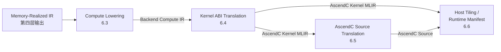

## 6. 第五层：Translate

第五层的任务是把第四层输出的 `Memory-Realized IR` 翻译成 backend 工具链和 runtime 所需的最终工件。

本层只做翻译，不引入新的调度决策或内存规划，消费的所有决策结果均来自上游。翻译过程分为四个有序阶段：Compute Lowering → Kernel ABI Translation → AscendC Source Translation → Host Tiling & Runtime Manifest。



---

### 6.1 输入与输出

#### 6.1.1 层间边界

| 项           | 内容                                                         |
| ------------ | ------------------------------------------------------------ |
| 输入         | 第四层输出的 `Memory-Realized IR`（普通 `memref + linalg + scf + func` MLIR，on-chip place 以 `memory_space` 表达，跨 place movement 以 `memref.copy` 表达） |
| 侧边输入     | `MemoryRealizationPlan`（含 `resolvedPlacement`、`resolvedMovements`、`workspaceLayout`）、`ScheduleDecisionSet`（含 `decisionGuards`、`tailPlans`、`pipelineDepthExpr`、`enableDoubleBuffer`、`tilingParams`、`unitAssignment`、`compileTimeTopK`） |
| 输出（必选） | `AscendC Kernel MLIR`、`AscendC Source`、`Host Tiling`       |
| 输出（可选） | `Runtime Manifest`                                           |

第五层不修改 `ScheduleDecisionSet` 和 `MemoryRealizationPlan`；它们在此层为只读消费，第五层结束后统一清除。

#### 6.1.2 阶段中间产物

| 阶段产物                   | 产出阶段                   | 消费阶段                                |
| -------------------------- | -------------------------- | --------------------------------------- |
| `Backend Compute IR`       | 6.3 Compute Lowering       | 6.4 Kernel ABI Translation              |
| `AscendC Kernel MLIR`      | 6.4 Kernel ABI Translation | 6.5 Source Translation、6.6 Host Tiling |
| `AscendC Source`           | 6.5 Source Translation     | 工具链编译                              |
| `Host Tiling`              | 6.6                        | Runtime 调用                            |
| `Runtime Manifest`（可选） | 6.6                        | Runtime kernel 选择与缓存               |

---

### 6.2 核心类与接口

| 类 / 接口                    | 职责                                                         | 主要输入                                                     | 主要输出              |
| ---------------------------- | ------------------------------------------------------------ | ------------------------------------------------------------ | --------------------- |
| `ComputeLoweringDriver`      | 把 `memref.copy` 和 `linalg` 计算落成 backend compute/movement op，并按 `tailPlans` 发射 mask / scalar epilogue / padding copy 结构 | `Memory-Realized IR`、`TargetMemoryModel`、`MemoryRealizationPlan`、`ScheduleDecisionSet` | `Backend Compute IR`  |
| `OpLoweringTemplateRegistry` | 按 op family 分发 compute lowering，管理 signature / strategy / primitive emission 规则 | op、`AscendCBufferContext`                                   | backend op 序列       |
| `BackendABILoweringDriver`   | 固定 kernel 函数签名、并行入口和 `TilingData` ABI            | `Backend Compute IR`、`ScheduleDecisionSet`、`MemoryRealizationPlan` | `AscendC Kernel MLIR` |
| `AscendCSourceEmitter`       | 把 `AscendC Kernel MLIR` 翻译成 C++ 源码                     | `AscendC Kernel MLIR`                                        | `AscendC Source`      |
| `HostTilingEmitter`          | 生成 host 侧 `TilingData` 结构和 `get_tiling/get_block_dim` 函数，包含动态 tail extent / main extent / alignment 字段 | `AscendC Kernel MLIR`、`ScheduleDecisionSet`、调优结果       | `Host Tiling`         |
| `RuntimeManifestBuilder`     | 组装 shape bucket、guard、tail plan、schedule entry 和 cache key        | `AscendC Kernel MLIR`、`ScheduleDecisionSet`、`decisionGuards` | `Runtime Manifest`    |

---

### 6.3 Compute Lowering

#### 6.3.1 功能

把第四层的结构化计算（`linalg.*`）和显式搬运（`memref.copy`）落成 backend 专用 op 序列，建立片上 buffer context（pipe / queue / tbuf），输出 `Backend Compute IR`。

**输入**：`Memory-Realized IR`、`TargetMemoryModel`、`MemoryRealizationPlan`、`ScheduleDecisionSet`
**输出**：`Backend Compute IR`

#### 6.3.2 输出规范

`Backend Compute IR` 必须满足：

| 约束                              | 含义                                                         |
| --------------------------------- | ------------------------------------------------------------ |
| 计算主体已绑定 backend compute op | 不再保留 `linalg.*` 形态                                     |
| 搬运路径与 place 一致             | 与 `MemoryRealizationPlan.resolvedMovements / resolvedPlacement` 严格对齐 |
| `decisionGuards` 已传递           | 动态 shape 场景下同一 kernel 可按 guard 区分实现路径         |
| `tailPlans` 已消费                | `MaskedTail` 发射 mask/valid extent，`ScalarEpilogue` 发射 epilogue，`PadAndMask` 发射 padding temp 对应的数据搬运和 guarded writeback；第五层不得重新选择 tail 策略 |
| pipe / queue / tbuf 已建立        | 每个片上 buffer 均对应唯一 queue 和 tbuf                     |

最小 backend op 集：

| op 类别           | 最小集合                                                     |
| ----------------- | ------------------------------------------------------------ |
| 计算 op           | `ascendc.mmad`、`ascendc.vector_unary`、`ascendc.vector_binary`、`ascendc.reduction`、`ascendc.transpose`、`ascendc.gather` |
| 搬运 op           | `ascendc.data_copy_*`、`ascendc.load_data_*`、`ascendc.queue_transfer`、`ascendc.fixpipe` |
| buffer context op | `ascendc.pipe`、`ascendc.queue`、`ascendc.tbuf`、`ascendc.alloc_tensor`、`ascendc.enque_tensor`、`ascendc.deque_tensor` |

#### 6.3.3 实现方案

`Compute Lowering` 实现为 `BackendComputeLoweringPass`，按四个 phase 顺序执行：

**Phase 0：Build Buffer Context**

- 在函数入口插入唯一的 `ascendc.pipe`
- 为每个 `memory_space > 0` 的 `memref.alloc` 创建对应的 `ascendc.queue`、`ascendc.tbuf`、`ascendc.pipe.init_buffer`、`ascendc.pipe.init_queue`
- 建立 `AscendCBufferContext`（维护 pipe、alloc→queue、alloc→tbuf、alloc→liveTensor 映射）

**queue depth 确定规则：** `ascendc.queue` 的 depth 参数从 `ScheduleDecisionSet` 读取，规则如下：

| 场景 | queue depth | 说明 |
|---|---|---|
| `enableDoubleBuffer = false`，`pipelineDepthExpr` 为常数 1 | `1` | 单缓冲，每个 queue 持有一份 tensor |
| `enableDoubleBuffer = true` | `2` | 双缓冲，queue depth 固定为 2，与 `pipelineDepthExpr` 无关 |
| `pipelineDepthExpr` 为常数 N（N > 1），`enableDoubleBuffer = false` | `N` | 流水线级数决定深度，每级对应一份 tensor |
| `pipelineDepthExpr` 含动态符号 | `2`（保守值） | 无法静态确定时退化为双缓冲深度；若 `enableDoubleBuffer = true` 亦取 `2` |

同一 `memref.alloc` 对应的 queue 和 tbuf 共享同一 depth 值。depth 值在 Phase 0 确定后不可在后续 phase 修改。

**`WorkspaceBuffer`（`memref.subview`）在 BufferContext 中的映射规则：**

第四层输出中，共享 workspace 以根 `memref.alloc` + 多个 `memref.subview` 的形式存在。Phase 0 的处理规则如下：

| buffer 类型 | Phase 0 处理方式 |
|---|---|
| 根 `memref.alloc`（`memory_space > 0`，对应共享 workspace） | 正常创建 queue、tbuf、`pipe.init_buffer`、`pipe.init_queue`，记录到 `AscendCBufferContext` |
| `memref.subview`（切片自上述 alloc） | **不创建**独立的 queue/tbuf；在 `AscendCBufferContext` 中记录 `subview → 父 alloc` 的映射（`subviewToParent`）；后续 Phase 1/2 中，凡引用该 subview 的 op，通过 `subviewToParent` 查找对应的父 queue/tbuf 处理 |

`subview` 不得在 `AscendCBufferContext` 中建立独立的 queue/tbuf 条目；若 Phase 0 遇到 subview 尝试建立独立 context，应报诊断错误。

**Phase 1：Movement Lowering**

- 遍历所有 `memref.copy`，按 `(src memory_space, dst memory_space)` 命中具体 movement lowering 分支
- 支持的路径：`GM→VECIN`、`GM→A1/B1`、`A1→A2`、`B1→B2`、`CO1→VECIN`、`VECOUT→GM`
- 每条路径产出对应的 `ascendc.data_copy_*` / `ascendc.load_data_*` 序列；enqueue/dequeue 节奏规则见下

**pipeline / double-buffer enqueue/dequeue 节奏规则：**

| 场景 | enqueue 时机 | dequeue 时机 |
|---|---|---|
| `enableDoubleBuffer = false`，depth = 1 | copy op 生成后立即 `enque_tensor` | 下一个消费该 tensor 的 compute op 前立即 `deque_tensor` |
| `enableDoubleBuffer = true`，depth = 2 | copy op 生成后立即 `enque_tensor` | 下一个消费该 tensor 的 compute op 前立即 `deque_tensor`；Phase 3 Hoist 会把 double-buffer 的 alloc 外提 |
| `pipelineDepthExpr = N`，depth = N | 与 double-buffer 相同；enqueue 在 copy 后立即执行 | dequeue 在对应级的 compute op 前执行；Phase 3 负责把 init_buffer / init_queue 外提到 entry block |

**"需立即使用"的判断规则（影响 dequeue 时机）：** Phase 1 在 enqueue 之后检查该 tensor 的下一个 use 是否在同一 basic block 内且紧随 copy 之后（无其他 movement 或 compute op 介入）。满足则在 Phase 1 内立即执行 `deque_tensor` 并记录到 `allocToLiveTensor`；否则推迟到 Phase 2 消费该操作数时按优先级顺序决定。不满足"立即使用"条件并不报错，只影响 dequeue 插入位置。

**Phase 2：Compute Op Lowering**

遍历 `linalg.matmul`、`linalg.batch_matmul` 和 `linalg.generic`，按以下规则 dispatch：

| 场景                                      | lowering 结果                                             |
| ----------------------------------------- | --------------------------------------------------------- |
| `linalg.matmul`                           | `ascendc.mmad`                                            |
| `linalg.batch_matmul`                     | batch 维度展开为 `scf.for` 循环（loop bound = batch size，步长 = 1），循环体内按 `linalg.matmul` 规则生成 `ascendc.mmad`；batch 维度不映射到 block_idx（block 并行仅在 M/N tile 维度展开，由 Pass 1 处理） |
| `linalg.generic`（含 reduction iterator） | `broadcast_l2/vector_op + reduce_sum_2d_l2`               |
| `linalg.generic`（全 parallel iterator）  | `vector compute op` 或 `broadcast_l2 + vector compute op` |
| `TransposeTemplate` 覆盖的 op             | backend transpose compute / transpose load                |
| `IndexedFusion` 覆盖的 op                 | backend gather / indexing compute                         |

**`unitAssignment = Both`（Cube + Vector epilogue）路径的 Phase 1/2 衔接规则：**

`Both` 路径在第四层 Placement 中已将 matmul 输出分配到 `CO1`，其 consumer（vector epilogue 的输入）在 `VECIN`，因此第四层输出的 IR 中必然包含一条 `CO1→VECIN` 的 `memref.copy`。Phase 1 和 Phase 2 对此路径的处理与单路径规则**完全一致**，无需特殊分支：

| 步骤 | 处理方式 |
|---|---|
| Phase 1：`CO1→VECIN` copy | 按 `CO1→VECIN` 路径生成 `ascendc.data_copy_co12dst`；"需立即使用"判断：若 copy 后紧接 vector epilogue op，则 Phase 1 内立即 `deque_tensor` 并记录到 `allocToLiveTensor` |
| Phase 2：`linalg.matmul` | 正常生成 `ascendc.mmad`；结果写入 CO1 queue |
| Phase 2：vector epilogue `linalg.generic` | 按全 parallel iterator 规则生成 vector compute op；读取操作数时优先查 `allocToLiveTensor`（若 Phase 1 已 dequeue）否则从 VECIN queue `deque_tensor` |

`Both` 路径不需要在 Phase 2 dispatch 表中增加专门条目；CO1→VECIN movement 由 Phase 1 独立处理，两个 compute op（mmad 和 vector epilogue）各自独立 dispatch，无跨 op 依赖需要额外协调。

Compute op 读取操作数的优先顺序固定为：

1. `allocToLiveTensor`（已 deque 的 local tensor）
2. 从 `queue` 执行 `deque_tensor`
3. 通过 `tbuf.get_tensor` 创建临时视图

写侧 result 的获取顺序固定为：

1. 若是 subview/tile，取 offset/slice 对应局部视图
2. `alloc_tensor(queue)`
3. `tbuf.get_tensor`

`OpLoweringTemplate` 按 op family 分别注册 signatureKinds、normalizationRules、strategyTable、primitiveEmissionRules、tempBufferPlanRules 和 fallbackPolicy。新增简单 unary/binary op 只需补 opcode 映射；新增复杂 op family（如 `Where/Cast/Reduction`）需补齐完整 signature、strategy、temp buffer 和 fallback 规则，但必须复用同一 framework，不能手写独立的 kernel API 副本。

**`fallbackPolicy` 取值与行为：**

`fallbackPolicy` 是 `OpLoweringTemplate` 的必填字段，在目标 intrinsic 缺失或 strategy 无法匹配时触发。取值和行为如下：

| 取值 | 行为 | 适用场景 |
|---|---|---|
| `FallbackPolicy::Fail` | 立即报诊断错误并中止 pass，不生成任何 backend op | 语义上无合法替代路径的 op（如 `ascendc.mmad` 缺失时 matmul 无法降级） |
| `FallbackPolicy::ScalarExpand` | 把向量 op 展开为逐元素标量循环（`scf.for` + 标量算术），仅用于 debug/验证，不用于生产编译 | elementwise op 在目标 SoC 上暂无对应 vector intrinsic |
| `FallbackPolicy::HandwrittenPattern` | 查找 `HandwrittenPatternRegistry` 中是否有匹配的手写 pattern；若有则直接 emit 手写序列，若无则退化为 `Fail` | 特殊 op family 有预先注册的手写实现（如特定 SoC 的定制搬运路径） |
| `FallbackPolicy::SoftwareEmulation` | 通过多个已支持 op 的组合模拟目标 op 语义，只在 `strategyTable` 中有对应 emulation entry 时生效；否则退化为 `Fail` | cast / compare-select 等可通过已有 vector op 组合实现的场景 |

注册规则：每个 `OpLoweringTemplate` 在构造时必须显式指定 `fallbackPolicy`，不允许缺省（缺省视为 `Fail`）。`HandwrittenPattern` 与 `SoftwareEmulation` 均需在 `OpLoweringTemplateRegistry` 初始化阶段完成注册，不允许在 lowering 执行时动态注册。

**Phase 3：Hoist**

- 对函数体内可安全外提的 `queue`、`tbuf`、`init_buffer`、`init_queue` 执行 hoist，将其移到 entry block

#### 6.3.4 失败与回退规则

| 场景                                                         | 处理方式                                                     |
| ------------------------------------------------------------ | ------------------------------------------------------------ |
| `memref.copy` 的 src/dst place 组合未命中支持分支            | 直接报诊断失败，禁止默默生成错误 backend op                  |
| `linalg.generic` indexing map 不是 identity / broadcast / reduction 形态 | 报诊断，要求上游先展开                                       |
| operand 无 live tensor 也无 queue/tbuf 可用                  | 报诊断失败，说明第四层 placement / movement 与第五层假设不一致 |
| 目标 intrinsic 缺失                                          | 走 `fallbackPolicy`；若未定义 fallback 则失败                |

#### 6.3.5 示例

**输入（Memory-Realized IR 片段）**：

```mlir
memref.copy %lhs_gm, %lhs_a1 : memref<128x128xf16>, memref<128x128xf16, 1>
memref.copy %rhs_gm, %rhs_b1 : memref<128x128xf16>, memref<128x128xf16, 3>
memref.copy %lhs_a1, %lhs_a2 : memref<128x128xf16, 1>, memref<128x128xf16, 2>
memref.copy %rhs_b1, %rhs_b2 : memref<128x128xf16, 3>, memref<128x128xf16, 4>
linalg.matmul ins(%lhs_a2, %rhs_b2 : ...) outs(%acc_co1 : memref<128x128xf32, 7>)
linalg.generic {iterator_types = ["parallel", "parallel"]}
  ins(%acc_vecin, %bias_vecin : ...) outs(%out_vecout : memref<128x128xf32, 10>)
memref.copy %out_vecout, %out_gm : memref<128x128xf32, 10>, memref<128x128xf32>
```

**输出（Backend Compute IR 片段）**：

```mlir
%pipe = ascendc.pipe
%qa1 = ascendc.queue : !ascendc.queue<A1, 1>
%qb1 = ascendc.queue : !ascendc.queue<B1, 1>
%qa2 = ascendc.queue : !ascendc.queue<A2, 1>
%qb2 = ascendc.queue : !ascendc.queue<B2, 1>
%qco1 = ascendc.queue : !ascendc.queue<CO1, 1>
%qvecin = ascendc.queue : !ascendc.queue<VECIN, 1>
%qvecout = ascendc.queue : !ascendc.queue<VECOUT, 1>

// Movement Lowering: GM -> A1/B1
%lhsA1 = ascendc.alloc_tensor %qa1 : tensor<128x128xf16, A1>
ascendc.data_copy_nd2nz %lhsA1, %lhs_gm
ascendc.enque_tensor %qa1, %lhsA1
%rhsB1 = ascendc.alloc_tensor %qb1 : tensor<128x128xf16, B1>
ascendc.data_copy_nd2nz %rhsB1, %rhs_gm
ascendc.enque_tensor %qb1, %rhsB1

// Movement Lowering: A1->A2, B1->B2
%lhsA2 = ascendc.alloc_tensor %qa2 : tensor<128x128xf16, A2>
ascendc.load_data_l0 %lhsA2, %lhsA1
ascendc.enque_tensor %qa2, %lhsA2
%rhsB2 = ascendc.alloc_tensor %qb2 : tensor<128x128xf16, B2>
ascendc.load_data_with_transpose %rhsB2, %rhsB1
ascendc.enque_tensor %qb2, %rhsB2

// Compute Op Lowering: matmul
%acc = ascendc.alloc_tensor %qco1 : tensor<128x128xf32, CO1>
ascendc.mmad %acc, %lhsA2, %rhsB2
ascendc.enque_tensor %qco1, %acc

// Movement Lowering: CO1 -> VECIN
%vecIn = ascendc.alloc_tensor %qvecin : tensor<128x128xf32, VECIN>
ascendc.data_copy_co12dst %vecIn, %acc
ascendc.enque_tensor %qvecin, %vecIn

// Compute Op Lowering: vector epilogue (add + leakyrelu)
%vecOut = ascendc.alloc_tensor %qvecout : tensor<128x128xf32, VECOUT>
ascendc.add_l2 %vecOut, %vecIn, %bias_vecin

// Movement Lowering: VECOUT -> GM
ascendc.data_copy_l2 %out_gm, %vecOut
```

#### 6.3.6 必须覆盖的 op family 清单

第五层 `OpLoweringTemplateRegistry` 的覆盖范围以第一层（Normalize）许可的 op 集合为基准。以下清单列出每类 op 的第五层落地方式和当前状态，作为开发完工标准：

| op 语义类别 | 第一层规范化形态 | 第五层 backend op / 落地方式 | 当前状态 |
|---|---|---|---|
| matmul / batch_matmul | `linalg.matmul`、`linalg.batch_matmul` | `ascendc.mmad` | ✓ 已覆盖 |
| elementwise（全 parallel） | `linalg.generic`（full parallel iterator） | `ascendc.vector_binary` / `ascendc.vector_unary` | ✓ 已覆盖 |
| reduce | `linalg.generic`（含 reduction iterator） | `ascendc.broadcast_l2` + `ascendc.reduce_sum_2d_l2` | ✓ 已覆盖 |
| broadcast | `linalg.generic`（broadcast indexing map） | `ascendc.broadcast_l2` | ✓ 已覆盖 |
| gather / index_select | `linalg.generic` + `tensor.extract` + `gather_dim` | `ascendc.gather` | ✓ 已覆盖 |
| transpose / layout transform | permutation indexing map | `ascendc.transpose` / `load_data_with_transpose` | ✓ 已覆盖 |
| cast（类型转换） | `linalg.generic`（cast body）或具名 cast op | `ascendc.vector_unary`（cast variant） | 需补充测试 |
| compare + select | `arith.cmp*` + `select`，或 body 可识别的 `linalg.generic` | `ascendc.vector_binary`（select variant） | 需补充测试 |
| reshape（仅布局重组） | `tensor.expand_shape` / `tensor.collapse_shape` | 通过 `memref.subview` 零拷贝表达；不生成 compute op | ✓ 已覆盖 |
| split / slice | `tensor.extract_slice` | 通过 `memref.subview` + movement 表达；不生成独立 compute op | ✓ 已覆盖 |
| concat | `tensor.concat` / slice + insert 组合 | 通过多段 `memref.copy` + subview 组合表达 | 需补充测试 |

**清单维护规则**：

- 新增 op family 支持时，必须同步更新本表状态
- 状态"需补充测试"的 op family 在 `OpLoweringTemplateRegistry` 中已有注册，但缺少系统性测试用例；不等于未实现
- 若某 op family 确认不支持（如 scatter），必须在此表注明"暂不支持"并注明 workaround（`HandwrittenPattern`）

---

### 6.4 Kernel ABI Translation

#### 6.4.1 功能

`Backend Compute IR` 完成后，kernel body 已进入 `ascendc/emitasc` 方言，但函数边界、并行入口、tiling 参数结构和 CANN 标准签名尚未固定。本阶段通过三个 pass 将其收敛，使 translator、host 和 runtime 能稳定消费。

最终效果：

- 固定 kernel 输入/输出/workspace/tiling 参数的 ABI 顺序
- 固定 block 级并行入口（`ascendc.get_block_idx`）
- 固定 host/kernel 共享的 `TilingData` ABI（通过 `!emitasc.py_struct<...>`）
- 输出带 `cann.num_inputs` attribute 的 CANN 标准签名 kernel function

**输入**：`Backend Compute IR`、`ScheduleDecisionSet`、`MemoryRealizationPlan`
**输出**：`AscendC Kernel MLIR`

#### 6.4.2 输出规范

`AscendC Kernel MLIR` 的函数签名固定为：

```
func @kernel(inputs..., outputs..., %workspace: memref<ui8>,
             %tiling: !emitasc.py_struct<"TilingData", [field: type, ...]>)
  attributes { ascendc.aicore, ascendc.global, cann.num_inputs = N : i32 }
```

关键约束：

| 约束                         | 说明                                                 |
| ---------------------------- | ---------------------------------------------------- |
| 参数顺序固定                 | inputs → outputs → workspace → tiling，不可重排      |
| 中间 buffer 不进入 ABI       | 只有 function boundary buffer 可见；识别依据：在 `Backend Compute IR` 中，function boundary buffer 是原始 `func.func` 的参数（`BlockArgument`）；`Pass 1` 改写并行 loop 时不新增 memref 参数，仅新增 `index` 类型的 block_idx 参数，不影响此规则；`TilingData` 作为最后一个参数属于 boundary buffer，受 ABI 约束保护 |
| `cann.num_inputs` 必须正确   | 后续 ABI 提取依赖此字段划分 inputs/outputs           |
| workspace 固定为倒数第二参数 | 类型固定 `memref<ui8>`                               |
| tiling 固定为最后参数        | 类型固定 `!emitasc.py_struct<"TilingData", [...]>`   |
| `TilingData` 是唯一真相来源  | host/kernel 均从同一份字段定义派生，禁止各自维护副本 |

#### 6.4.3 实现方案

推荐拆成三个独立 pass：

**Pass 1：`KernelDispatchLoweringPass`**

- 把最外层并行 loop 改写为 `ascendc.get_block_idx + scf.if` 形式
- 建立 block 维度与 tile 坐标的显式映射

**block index 到 tile 坐标的映射规则：**

`ascendc.get_block_idx` 返回一维线性 block index（`int64_t`，范围 `[0, blockDim)`）。多维 tile 坐标通过整除和取模从一维 index 拆解：

| tile 维度 | 映射方式 | 示例（M/N 两维，gridM × gridN 个 block）|
|---|---|---|
| 一维（仅 M 或仅 N 方向 tile） | `tile_idx = block_idx` | `int64_t tile_m = GetBlockIdx();` |
| 二维（M × N tile grid） | `tile_m = block_idx / gridN`；`tile_n = block_idx % gridN` | `gridN` 为 N 方向 tile 数，由 `TB_N` 和 N 总长度计算 |
| 三维及以上 | 按主序（row-major）逐维从高到低整除/取模拆解 | 依此类推 |

`gridM`、`gridN` 等 grid 尺寸从 `TilingData` 的 shape 参数（`fixed: true` 字段）和 tiling 参数（`TB_M`、`TB_N` 等）在 kernel body 内动态计算，不作为独立参数传入：`gridN = ceil(N / TB_N)`。映射关系以局部 `index` 变量的形式存在于 IR 中（`%tile_m = arith.divsi %block_idx, %gridN`），不写入 IR attribute。

**Pass 2：`TilingABIPreparationPass`**

- 收集 kernel 内所有 `memref.dim` 查询和离散 tiling 参数（i64 值）
- 生成统一的 `TilingData` 结构（通过 `!emitasc.py_struct<...>`）
- 用 `emitasc.copy_struct` / `emitasc.member` 替换所有 tiling 参数读取

**`TilingData` 字段的来源与构造规则：**

`TilingData` 字段来自两个来源，Pass 2 必须按以下顺序和规则合并：

| 来源 | 字段类型 | 识别方式 | 字段名规则 |
|---|---|---|---|
| `ScheduleDecisionSet` 中的可调优 tiling 参数（`TilingParam`） | 调优参数（`fixed: false`） | 从 `ScheduleDecision.tilingParams` 枚举，每个 `TilingParam.name` 对应一个字段 | 直接使用 `TilingParam.name`（如 `TB_M`、`TB_N`、`TB_K`） |
| `ScheduleDecision.tailPlans` 中的动态 tail 表达式 | 派生运行期参数（`derived: true`，不是 `get_tiling` 的直接 shape 参数） | 从 `mainExtentExpr`、`tailExtentExpr`、`alignmentGranularityExpr` 中收集无法静态折叠且 kernel 侧需要直接读取的表达式 | 使用 `axis_<name>_main`、`axis_<name>_tail`、`axis_<name>_align`；若表达式可由已有 shape/tiling 字段在 kernel 内低成本计算，则不生成独立字段 |
| `decisionGuards` 中引用的 shape 符号变量 | shape 参数（`fixed: true`） | 扫描所有 `GuardExpr` 中出现的自由变量；同一变量名只生成一个字段 | 使用变量名本身（如 `M`、`K`、`N`）；若与调优参数名冲突，加 `dim_` 前缀（如 `dim_M`） |

字段顺序规则：调优参数字段在前（按 `ScheduleDecision.tilingParams` 枚举顺序），tail 派生字段居中（按 `ScheduleDecision.tailPlans` 的轴顺序），shape 参数字段在后（按首次在 `decisionGuards` 和 `tailPlans` 中出现的顺序）。此顺序与 `tiling_space.json` 中 `tiling_params` 数组顺序严格一致，host 侧按同一顺序逐字段打包。

`decisionGuards` 中的 guard 表达式（如 `M % 32 == 0`）在 kernel 侧通过 `emitasc.member %tiling["M"]` 读取 shape 值后求值，不再作为独立参数传递——guard 的运行时求值责任落在 kernel body 内。`tailPlans` 中的 `mainExtentExpr` / `tailExtentExpr` 也遵循同一规则：能由 shape + tile 现场计算的表达式在 kernel body 内计算；只有跨 host/runtime 需要复用或表达式过重时，才作为 `TilingData` 派生字段写入。

**Pass 3：`KernelSignatureCanonicalizationPass`**

- 将函数签名改写为 `(inputs..., outputs..., workspace, tiling)` 顺序
- 移除 `emitasc.copy_struct`（内联展开为 member 读取）
- 添加 `cann.num_inputs` attribute

#### 6.4.4 示例

Pass 2 执行后：

```mlir
func.func @kernel(
  %in0: memref<?xf16>, %in1: memref<?xf16>, %out0: memref<?xf16>,
  %tiling_memref: memref<?x!emitasc.py_struct<"TilingData", [TB_M: i64, TB_N: i64]>, 22>
) attributes {ascendc.aicore, ascendc.global}
{
  %tiling = emitasc.copy_struct %tiling_memref
  %tb_m = emitasc.member %tiling["TB_M"] : i64
  %tb_n = emitasc.member %tiling["TB_N"] : i64
  ...
}
```

Pass 3 执行后（最终 CANN 标准签名）：

```mlir
func.func @kernel(
  %in0: memref<?xf16>,
  %in1: memref<?xf16>,
  %out0: memref<?xf16>,
  %workspace: memref<ui8>,
  %tiling: !emitasc.py_struct<"TilingData", [TB_M: i64, TB_N: i64]>
) attributes {ascendc.aicore, ascendc.global, cann.num_inputs = 2 : i32}
```

---

### 6.5 AscendC Source Translation

#### 6.5.1 功能

把 `AscendC Kernel MLIR` 翻译成 C++ 源码，供 CANN 工具链编译为最终二进制。本阶段只做语法映射，不引入任何结构变换。

**输入**：`AscendC Kernel MLIR`（CANN 标准签名形态）
**输出**：`AscendC Source`（`.cpp` 文件）

#### 6.5.2 翻译规则

| `AscendC Kernel MLIR` op / 构造        | C++ 输出                                |
| -------------------------------------- | --------------------------------------- |
| `ascendc.alloc_tensor %q`              | `LocalTensor<T> t = AllocTensor<T>(q);` |
| `ascendc.mmad %acc, %lhs, %rhs`        | `Mmad(acc, lhs, rhs, ...);`             |
| `ascendc.data_copy_nd2nz %dst, %src`   | `DataCopy(dst, src, ...);`              |
| `ascendc.data_copy_co12dst %dst, %src` | `DataCopyCO12Dst(dst, src, ...);`       |
| `ascendc.add_l2 %out, %a, %b`          | `Add(out, a, b, ...);`                  |
| `ascendc.enque_tensor %q, %t`          | `EnQue(q, t);`                          |
| `ascendc.deque_tensor %q`              | `DeQue<T>(q)`                           |
| `ascendc.get_block_idx`                | `GetBlockIdx()`                         |
| `emitasc.member %tiling["F"]`          | `tiling.F`                              |

**Buffer context op 的翻译规则：**

Phase 0 生成的 context 建立 op 在 Phase 3 Hoist 后已提升到 kernel 函数入口，Source Translation 将其翻译为 AscendC C++ 对象声明和初始化调用：

| op | C++ 输出 | 说明 |
|---|---|---|
| `ascendc.pipe` | `TPipe pipe;` | kernel 函数体顶部唯一的 pipe 对象声明 |
| `ascendc.queue<A1, D>` | `TQue<QuePosition::A1, D> qa1;` | queue 对象声明；`QuePosition` 枚举由 memory_space 映射（见下方 place→QuePosition 表） |
| `ascendc.tbuf<VECCALC>` | `TBuf<TPosition::VECCALC> tbuf;` | tbuf 对象声明；`TPosition` 枚举同样由 memory_space 映射 |
| `ascendc.pipe.init_buffer %pipe, %tbuf, %size` | `pipe.InitBuffer(tbuf, size);` | tbuf 注册到 pipe，size 为静态字节数或运行时表达式 |
| `ascendc.pipe.init_queue %pipe, %q, %depth` | `pipe.InitEventQueue(q, depth);` | 仅 double-buffer / pipeline 场景需要；depth 来自 Phase 0 确定的 queue depth |

**place → QuePosition / TPosition 映射：**

| memory_space | AscendC 类型 | C++ 枚举 |
|---|---|---|
| VECIN（memory_space=9） | `TQue` | `QuePosition::VECIN` |
| VECCALC（memory_space=11） | `TBuf` | `TPosition::VECCALC` |
| VECOUT（memory_space=10） | `TQue` | `QuePosition::VECOUT` |
| A1（memory_space=1） | `TQue` | `QuePosition::A1` |
| A2（memory_space=2） | `TQue` | `QuePosition::A2` |
| B1（memory_space=3） | `TQue` | `QuePosition::B1` |
| B2（memory_space=4） | `TQue` | `QuePosition::B2` |
| CO1（memory_space=7） | `TQue` | `QuePosition::CO1` |

**控制流与算术 op 的翻译规则：**

`AscendC Kernel MLIR` 中除 `ascendc.*` 和 `emitasc.*` op 之外，还保留了控制流和算术 op，翻译规则如下。这些 op 的 C++ 映射由 `emitc` dialect 的标准能力处理，`AscendCSourceTranslationDriver` 不需要为其编写专属规则，但必须确认以下映射在目标工具链可编译：

| op | C++ 输出 | 说明 |
|---|---|---|
| `scf.for %i = %lb to %ub step %s` | `for (int64_t i = lb; i < ub; i += s)` | tile loop 骨架 |
| `scf.if %cond` | `if (cond)` | guard branch |
| `arith.addi / subi / muli / divsi` | `a + b` / `a - b` / `a * b` / `a / b` | 标量算术 |
| `arith.cmpi` | `a == b`、`a < b` 等 | 标量比较 |
| `arith.index_cast` | `static_cast<int64_t>(...)` | index 类型转换 |
| `func.return` | `return;` | kernel 函数末尾 |
| `memref.dim %m, %c` | `m.GetSize()` 或等价 shape 查询 | 动态 shape 维度查询（已在 Pass 2 替换为 `emitasc.member` 后，此 op 不应出现在 Pass 3 后的 IR 中；若仍出现，报 `SourceTranslationVerifier` 错误） |

翻译入口统一为 `AscendCSourceTranslationDriver`，只消费已完成 CANN 签名规整的 kernel function，不处理更早阶段的通用 MLIR。

#### 6.5.3 示例

**输入（`AscendC Kernel MLIR` 片段）**：

```mlir
%acc = ascendc.alloc_tensor %qco1 : tensor<128x128xf32, CO1>
ascendc.mmad %acc, %lhsA2, %rhsB2
%vec = ascendc.alloc_tensor %qvecin : tensor<128x128xf32, VECIN>
ascendc.data_copy_co12dst %vec, %acc
ascendc.add_l2 %outVec, %vec, %bias
ascendc.data_copy_l2 %out_gm, %outVec
```

**输出（C++ 片段）**：

```cpp
LocalTensor<float> acc = AllocTensor<float>(qco1);
Mmad(acc, lhsA2, rhsB2, /* ... */);

LocalTensor<float> vec = AllocTensor<float>(qvecin);
DataCopyCO12Dst(vec, acc, /* ... */);
Add(outVec, vec, bias, /* ... */);
DataCopy(outGm, outVec, /* ... */);
```

---

### 6.6 Host Tiling / Runtime Manifest

#### 6.6.1 功能

本阶段有两项职责，可独立实现：

**Host Tiling Codegen**：从 `AscendC Kernel MLIR` 提取稳定的 `HostTilingABI`，结合 prepare/offline 阶段已经选定的 `ScheduleDecision`（Level-1 top1 或 Level-2 Autotuner 产出的 `best.config`），生成 host 侧 `TilingData` 结构体、`get_tiling(...)` 和 `get_block_dim(...)` 函数。Host Tiling 只物化已选参数，不运行搜索。

**Runtime Manifest（可选）**：把 `decisionGuards`、shape bucket、schedule entry、host tiling symbol binding 和 cache key 组装成 runtime 可消费的元数据结构，支持 runtime 按 shape 分桶选择已生成的 kernel/tiling variant。Manifest 中的 cache key 只用于产物复用和诊断，`runtime-session` 不通过它在线调用 Autotuner。

**Runtime Manifest 触发条件：**

| 场景 | 是否必须生成 | 原因 |
|---|---|---|
| `ScheduleDecisionSet.decisionGuards` 非空（动态 shape，多 guard） | **必须生成** | Runtime 需要 manifest 中的 `guardSet`、`scheduleEntries` 和 `hostTiling` binding 才能在运行时按 shape 选择正确的已生成 variant；缺失时 runtime 无法完成 shape bucket 路由，应报编译错误 |
| 静态 shape（`decisionGuards` 为空，单一决策） | 可选 | `get_tiling` 函数已包含全部参数，runtime 无需额外路由；可生成 manifest 用于缓存和调试，但不强制 |
| 需要编译缓存复用（`cacheKey` 用于跨编译实例共享） | 建议生成 | 无强制要求，但缺失时每次编译均需全量重建，影响增量编译性能 |

动态 shape 场景下不生成 manifest 时，编译器必须在 `HostTilingEmitter` 阶段检测到 `decisionGuards` 非空并报错，不允许静默跳过。

**输入**：`AscendC Kernel MLIR`、`ScheduleDecisionSet`、`decisionGuards`、prepare/offline Level-1 `topN` 结果（可选）、Level-2 Autotuner `best.config`（可选）
**输出**：`Host Tiling`（必选）、`Runtime Manifest`（动态 shape 必选，静态 shape 可选）

**运行期边界**：`runtime-session` 不消费 `tiling_space.json` 做搜索，也不在 guard 未命中时生成新的 `best.config`。运行期只读取 `runtime_manifest.json`，选择匹配 guard/fallback 的 `scheduleEntry`，绑定该 entry 指向的 Host Tiling ABI 符号，并调用 `GetTiling` / `GetBlockDim` / `GetWorkspaceSize` 查询当前 shape 的 launch 参数。

#### 6.6.2 输出规范

**`HostTilingABI`** 字段（从 CANN 标准签名 kernel function 提取）：

| 字段               | 来源                                                 | 说明                     |
| ------------------ | ---------------------------------------------------- | ------------------------ |
| `kernelName`       | kernel function 名                                   | kernel 族标识            |
| `numInputs`        | `cann.num_inputs` attribute                          | 划分 inputs/outputs 边界 |
| `inputs`           | 前 N 个参数（按 `numInputs`）                        | input buffer 描述        |
| `outputs`          | 参数 N+1 到倒数第三                                  | output buffer 描述       |
| `workspaceArg`     | 倒数第二参数（类型必须是 `memref<ui8>`）             | workspace buffer         |
| `tilingStructName` | `!emitasc.py_struct<"TilingData", ...>` 的 struct 名 | 与 kernel 侧一致         |
| `tilingFields`     | `py_struct` 字段按序提取；每个字段携带 `fixed` 标记（`true` = shape 参数，`false` = 调优参数）、可选 `derived` 标记（tail 派生字段）和可选 `shapeKey`（shape 维度名） | host 侧逐字段同序打包；`fixed: true` 字段同时用于生成 `get_tiling` / `get_block_dim` 的函数参数列表 |
| `abiArgs`          | 完整参数列表按序                                     | host 侧调用参数顺序      |

**`Runtime Manifest`** 最小字段：

| 字段                | 类型                           | 含义                                         |
| ------------------- | ------------------------------ | -------------------------------------------- |
| `kernelName`        | `StringRef`                    | kernel 名称                                  |
| `shapeBucketKey`    | `BucketKeyExpr`                | shape 分桶 key                               |
| `guardSet`          | `SmallVector<GuardExpr>`       | 可用 schedule decision 集合                  |
| `tilingSchema`      | `SmallVector<TilingParamDesc>` | host 须生成的参数描述                        |
| `tailPlanEntries`   | `SmallVector<TailPlanManifestEntry>` | 每个 schedule entry 对应的轴级 tail 策略、对齐粒度和派生字段映射 |
| `scheduleEntries`   | `SmallVector<ScheduleEntry>`   | runtime 可选择的决策集合                     |
| `abiSignature`      | `StringRef`                    | kernel ABI 签名摘要                          |
| `cacheKey`          | `StringRef`                    | 编译/调优结果缓存 key                        |
| `workspaceSizeExpr` | `StringRef`                    | workspace 大小的符号表达式（如 `"mt*nt*4"`）；表达式中的变量名必须与 `tilingSchema` 中的参数名一致 |
| `workspaceSizeBytes`| `int64_t`                      | 静态 shape 下的 workspace 字节数；动态 shape 时为 `-1`，Runtime 须用 `workspaceSizeExpr` 计算实际大小（见下方动态 shape 计算规则） |
| `shapeArgOrder`     | `SmallVector<ShapeArgDesc>`    | 调用 C ABI（见 6.6.6 节）时 `shape_args` 数组中每个槽位对应的语义维度；按顺序与 `HostTilingABI.abiArgs` 中的 shape 参数一一对齐 |
| `hostTilingBindings` | `SmallVector<HostTilingBinding>` | 可被 schedule entry 引用的 host tiling 动态库和导出符号；运行时通过此字段做 `dlopen` / `dlsym` |
| `kernelGraph`       | `KernelGraph`                  | 本 kernel 在多 kernel DAG 中的节点与依赖边   |

**动态 shape 下 workspace 大小的计算规则（`workspaceSizeBytes = -1` 时）：**

Runtime 在调用 `GetWorkspaceSize(shape_args, shape_count)` 时，按以下步骤计算实际字节数：

1. 按 `shapeArgOrder` 将 `shape_args` 数组中每个槽位映射到对应的变量名（`ShapeArgDesc.shapeKey`）
2. 将 `workspaceSizeExpr` 中的变量名替换为步骤1得到的运行时值，对表达式求值
3. 结果向上对齐到 `TargetMemoryModel` 要求的 workspace 对齐粒度（通常为 32 或 64 字节）

`workspaceSizeExpr` 只允许包含：四则运算（`+`、`-`、`*`、`/`）、整除（`//`）、取模（`%`）、常数字面量，以及 `tilingSchema` 中已声明的参数名。不允许包含条件分支或函数调用；若需要按 guard 分支计算 workspace，应为每个 guard 分支单独生成一个 `workspaceSizeExpr`（通过多个 `scheduleEntry` 各自携带 `workspaceSizeExpr` 字段）。

`ShapeArgDesc` 最小字段：

| 字段          | 类型        | 含义                                                         |
| ------------- | ----------- | ------------------------------------------------------------ |
| `name`        | `StringRef` | shape 参数名（与 `tilingSchema` 中 `fixed: true` 参数的 `name` 一致） |
| `shapeKey`    | `StringRef` | 该槽位对应的逻辑 shape 维度名（如 `"M"`、`"K"`、`"N"`）       |
| `abiPosition` | `int32_t`   | 该 shape 参数在 `HostTilingABI.abiArgs` 中的位置（0-based）；用于诊断与一致性校验 |

`ScheduleEntry` 最小字段：

| 字段 | 类型 | 含义 |
| --- | --- | --- |
| `decisionId` | `StringRef` | 对应第三层 `ScheduleDecision` 的稳定 ID |
| `kernelName` | `StringRef` | 该 entry 启动的 kernel 名称；多 variant 编译时可不同 |
| `guard` | `GuardExpr` | 当前 entry 的适用谓词；静态 shape 可为 `"true"` |
| `priority` | `int32_t` | 多个 guard 同时成立时的选择顺序，数值越小优先级越高 |
| `fallback` | `bool` | 是否为保守 fallback entry；只在所有普通 guard 未命中后使用 |
| `shapeBucketKey` | `BucketKeyExpr` | 当前 entry 覆盖的 bucket key，用于诊断和 cache 复用 |
| `tilingParams` | `DenseMap<StringRef, int64_t>` | 已选定的非 shape tiling 参数完整赋值，不允许差量赋值 |
| `workspaceSizeExpr` | `StringRef` | 当前 entry 的 workspace 表达式；覆盖顶层默认值 |
| `hostTilingId` | `StringRef` | 指向 `hostTilingBindings` 中的一项 |

`HostTilingBinding` 最小字段：

| 字段 | 类型 | 含义 |
| --- | --- | --- |
| `id` | `StringRef` | 被 `ScheduleEntry.hostTilingId` 引用的稳定 ID |
| `library` | `StringRef` | host tiling 动态库路径，相对 runtime artifact root 或 manifest 所在目录 |
| `symbols.getTilingSize` | `StringRef` | `GetTilingSize` 导出符号名 |
| `symbols.getTiling` | `StringRef` | `GetTiling` 导出符号名 |
| `symbols.getBlockDim` | `StringRef` | `GetBlockDim` 导出符号名 |
| `symbols.getWorkspaceSize` | `StringRef` | `GetWorkspaceSize` 导出符号名 |

Runtime 必须优先使用 `hostTilingBindings.symbols` 做显式 `dlsym`。`<KernelName>_GetTiling` 形式只作为默认命名约定和调试回退，不允许作为唯一绑定依据；这样可以支持同一 kernel family 下多个 bucket variant、版本化 symbol 和非 C++ framework 的稳定 FFI。

`TailPlanManifestEntry` 最小字段：

| 字段 | 类型 | 含义 |
| --- | --- | --- |
| `axis` | `StringRef` | 逻辑轴名或稳定 axis id |
| `selectedPolicy` | `AxisTailPolicy` | 第三层选定的 tail 策略 |
| `alignmentGranularity` | `StringRef` | 对齐粒度表达式；必须能从 `tilingSchema` 字段求值 |
| `mainExtentField` | `StringRef` | 对应 `mainExtent` 的 `TilingData` 字段名；若 kernel 内现场计算则为空 |
| `tailExtentField` | `StringRef` | 对应 `tailExtent` 的 `TilingData` 字段名；若 kernel 内现场计算则为空 |
| `tailBufferingMode` | `TailBufferingMode` | tail region buffer 复用策略；默认 `SeparateTailBuffer` |
| `affectedPrimitiveUses` | `SmallVector<PrimitiveAxisUseKind>` | 该 tail 策略影响的数据搬运、计算和写回用途 |

`KernelGraph` 最小字段：

| 字段    | 类型                                   | 含义                                       |
| ------- | -------------------------------------- | ------------------------------------------ |
| `nodes` | `SmallVector<KernelNodeDesc>`          | 当前编译单元内所有 kernel 节点             |
| `edges` | `SmallVector<KernelDependencyEdge>`    | kernel 间数据依赖边（DAG 边集合）          |

`KernelDependencyEdge` 最小字段：

| 字段            | 类型                  | 含义                                   |
| --------------- | --------------------- | -------------------------------------- |
| `from`          | `StringRef`           | 上游 kernel 名称                       |
| `to`            | `StringRef`           | 下游 kernel 名称                       |
| `carriedBuffers`| `SmallVector<StringRef>` | 两 kernel 间通过 GM 传递的 buffer 名 |

`cacheKey` 构成：`kernelName + shapeBucketKey + abiSignature + targetSignature`

**一致性约束**：

| 规则                                      | 含义                                                   |
| ----------------------------------------- | ------------------------------------------------------ |
| `tilingSchema` 与 `tilingFields` 一一对应 | host 生成什么字段，kernel 按同样顺序读取什么字段       |
| `ScheduleEntry` 只引用 schema 中已有字段  | 不允许 host/runtime 私自增加 kernel 不可见字段         |
| `get_tiling(...)` 不运行搜索              | 只写入 prepare/offline 阶段已选好的参数，不在运行时搜索 |
| `hostTilingBindings` 显式绑定符号         | Runtime 通过 manifest 中的 `library` 和 `symbols` 绑定 C ABI，不从 AFIR 工具或 MLIR symbol 反推 |
| `workspaceSizeExpr` 与 tiling 参数对齐    | 表达式中的变量名必须与 `tilingSchema` 中的参数名一致   |
| `kernelGraph` 覆盖完整 DAG               | 凡第二层 `KernelPattern[]` DAG 中存在的边，必须全部出现在此字段 |
| `kernelGraph` 只含 `CarriedValue` 边     | 第二层 `KernelPatternGraph` 有 7 种边类型（CarriedValue、Overlap、BranchPair、MergePair、MustCoLocate、MustSeparate、ScheduleBarrier），其中后 6 种在 Layer 2 内部调度决策阶段已完全消解，**不进入** Runtime Manifest；`kernelGraph.edges` 仅保留表达跨 kernel GM 数据流的 `CarriedValue` 类型边 |

#### 6.6.3 实现方案

实现拆成两条独立能力通路：

**通路 A：Host Tiling Codegen**

1. 解析 CANN 标准签名 kernel function，校验：
   - 倒数第二参数类型必须是 `memref<ui8>`（workspace）
   - 最后参数类型必须是 `!emitasc.py_struct<...>`（tiling）
   - `cann.num_inputs` 与签名参数数量一致
2. 提取 `HostTilingABI`（如 6.6.2 所定义）
3. 读取已物化的调优结果：
   - 仅启用 Level-1 时：读取 prepare 阶段选出的 `top1` 参数
   - 启用 Level-2 时：读取离线 Autotuner 给出的 `best.config` 参数
   - 若两者都不存在：读取显式 fallback decision 的保守参数；仍不存在则报编译错误
4. 按 `tilingFields` 顺序生成 `TilingData` 结构体
5. 确定 `get_tiling` / `get_block_dim` 的 shape 参数列表：从 `HostTilingABI.tilingFields` 中筛选 `fixed: true` 的字段（即 `tiling_space.json` 中 `fixed=true` 的参数），按其在 `tilingFields` 中的出现顺序作为函数参数，参数名使用 `ShapeArgDesc.name`，类型固定为 `int64_t`。**`fixed: true` 字段是 shape 参数的唯一来源**，`HostTilingEmitter` 不从其他地方推断 shape 参数列表。
6. 生成 `get_tiling(int64_t <shape_param_0>, ..., TilingData* out)` 函数，按以下规则处理多 guard 分支：
   - **静态 shape（无 `decisionGuards` 或单 guard）**：函数体为无分支的逐字段赋值；`fixed: false` 字段按调优结果填入常量，`fixed: true` 字段透传 shape 参数（`out->M = M;`）
   - **动态 shape（多 guard）**：函数体生成 `if / else if / else` 分支结构，每个 guard 对应一个分支；分支条件由 `decision_guards[i].guard` 表达式翻译为 C++ 布尔表达式（guard 中的 shape 变量名对应同名函数参数）；每个分支内对 `fixed: false` 字段赋该 guard 对应的调优结果值，`fixed: true` 字段在各分支中统一透传；普通 guard 分支必须互斥，若 manifest 声明 `fallback=true` entry 则最后分支使用 fallback 参数，否则最后一个 `else` 分支设置错误标志并返回非零值
   - guard 表达式到 C++ 的翻译规则：`%` → `%`，`==` → `==`，`!=` → `!=`，`&&` → `&&`，`||` → `||`；shape 变量名直接使用函数参数名，无需额外映射
7. 生成 `get_block_dim(int64_t <shape_param_0>, ...)` 函数（优先使用 `block_dim_expr`，否则使用最终结果中的 `blockDim` 常量；多 guard 时与 `get_tiling` 同结构生成分支）
8. **额外生成 C ABI 查询接口**（见 6.6.6 节）：以固定数组形式接收 shape 参数，供 `runtime-session` 和非 C++ Runtime 框架通过 `dlopen` 调用
9. **生成 `tiling_space.json`**（见 6.6.7 节）：根据 `ScheduleDecisionSet` 的搜索空间自动生成，供 Level-2 Autotuner、prepare/offline 工具和外部验证工具消费；此文件由编译器自动生成，不需要手工维护

**通路 B：Runtime Manifest（可选）**

1. 从 `ScheduleDecisionSet` 读取 `decisionGuards` 和 `scheduleEntries`
2. 按 shape 维度边界构造 `shapeBucketKey`
3. 为每个 `scheduleEntry` 写入 `guard`、`priority`、`fallback`、`hostTilingId`、`workspaceSizeExpr` 和完整 `tilingParams`
4. 组装 `guardSet`、`hostTilingBindings`、`abiSignature`、`cacheKey`，以及 `workspaceSizeExpr`、`kernelGraph`（见 6.6.2 节）
5. 输出 `Runtime Manifest`；动态 shape 场景必须落盘为 `runtime_manifest.json` 或嵌入等价 runtime artifact，不能只存在于编译器内存对象中

**两级调优接入规则**：

| 级别                      | 职责                                                         | 对接方式                                                     |
| ------------------------- | ------------------------------------------------------------ | ------------------------------------------------------------ |
| Level-1 prepare-time 选择 | 在 `compileTimeTopK` 候选中快速选出 `topN`（可直接用 `top1` 填参） | 调优结果作为输入传入 `HostTilingEmitter`                     |
| Level-2 Autotuner（可选） | 离线读取 `tiling_space.json` 和 Level-1 `topN`，搜索最优 `best.config` | `TilingSpaceExportPass` 输出 `tiling_space.json`；离线 Autotuner 回填最终结果 |
| `get_tiling(...)`         | 把已选参数写入 `TilingData`                                  | 仅填参，不搜索                                               |

#### 6.6.4 失败与回退规则

| 场景                                     | 处理方式                                                     |
| ---------------------------------------- | ------------------------------------------------------------ |
| 最后参数不是 `!emitasc.py_struct<...>`   | ABI 提取失败，直接报错                                       |
| 倒数第二参数不是 `memref<ui8>`           | ABI 提取失败，直接报错                                       |
| `cann.num_inputs` 与签名参数不一致       | 直接报错，不猜测输入输出边界                                 |
| `TilingData` 字段顺序 host/kernel 不一致 | 视为 ABI 错误，禁止继续                                      |
| `Runtime Manifest` 未生成，且 `decisionGuards` 非空 | 报编译错误；动态 shape 场景下 manifest 为必选，缺失将导致 runtime 无法路由 shape bucket |
| `Runtime Manifest` 未生成，且 `decisionGuards` 为空 | 允许；静态 shape 场景 manifest 为可选，`Host Tiling` 已足够 |
| `ScheduleEntry.hostTilingId` 找不到对应 binding | 报编译错误；runtime 不允许从 kernel 名猜测动态库或 symbol |
| 普通 guard 未覆盖且无 `fallback=true` entry | 报编译错误或要求上层声明 fail-fast 策略；不允许运行期在线调优补洞 |

#### 6.6.5 示例

**输入（CANN 标准签名 kernel function）**：

```mlir
func.func @matmul_add_leakyrelu(
  %in0: memref<1024xf16>,
  %in1: memref<1024xf16>,
  %out0: memref<1024xf16>,
  %workspace: memref<ui8>,
  %tiling: !emitasc.py_struct<"TilingData", [mt: ui32, nt: ui32, kt: ui32]>
) attributes {cann.num_inputs = 2 : i32}
```

**提取的 `HostTilingABI`**：

```text
kernelName     = "matmul_add_leakyrelu"
numInputs      = 2
inputs         = [%in0, %in1]
outputs        = [%out0]
workspaceArg   = %workspace
tilingStructName = "TilingData"
tilingFields   = [mt: ui32, nt: ui32, kt: ui32]
abiArgs        = [in0, in1, out0, workspace, tiling]
```

**生成的 host 侧代码**：

```cpp
// 由 tilingFields 生成（顺序与 kernel 侧严格一致）
struct TilingData {
  uint32_t mt;
  uint32_t nt;
  uint32_t kt;
};

// 由 prepare-time Level-1 top1 = { mt=128, nt=128, kt=64 } 或离线 Level-2 best.config 填入
void get_tiling(int64_t m, int64_t n, int64_t k, TilingData* out) {
  out->mt = 128;
  out->nt = 128;
  out->kt = 64;
}

int64_t get_block_dim(int64_t m, int64_t n, int64_t k) {
  return 20;  // 来自 block_dim_expr 或最终调优结果
}

// host 侧调用（abiArgs 顺序固定）
TilingData tiling;
get_tiling(m, n, k, &tiling);
int64_t block_dim = get_block_dim(m, n, k);
launch_kernel(in0, in1, out0, workspace, tiling, block_dim);
```

**生成的 Runtime Manifest（可选，以动态 shape broadcast+add 为例）**：

```json
{
  "kernelName": "broadcast_add",
  "shapeBucketKey": "A_bucket=(1..256)/(257..4096)",
  "guardSet": ["A % 32 == 0", "A % 32 != 0"],
  "hostTilingBindings": [
    {
      "id": "broadcast_add_tiling",
      "library": "broadcast_add_get_tiling.so",
      "symbols": {
        "getTilingSize": "broadcast_add_GetTilingSize",
        "getTiling": "broadcast_add_GetTiling",
        "getBlockDim": "broadcast_add_GetBlockDim",
        "getWorkspaceSize": "broadcast_add_GetWorkspaceSize"
      }
    }
  ],
  "scheduleEntries": [
    {
      "decisionId": "d0",
      "guard": "A % 32 == 0 && A <= 4096",
      "priority": 0,
      "fallback": false,
      "hostTilingId": "broadcast_add_tiling",
      "tilingParams": {"tileA": 128},
      "workspaceSizeExpr": "0"
    },
    {
      "decisionId": "d1",
      "guard": "A % 32 != 0 && A <= 4096",
      "priority": 1,
      "fallback": false,
      "hostTilingId": "broadcast_add_tiling",
      "tilingParams": {"tileA": 96},
      "workspaceSizeExpr": "0"
    },
    {
      "decisionId": "fallback",
      "guard": "A > 0",
      "priority": 99,
      "fallback": true,
      "hostTilingId": "broadcast_add_tiling",
      "tilingParams": {"tileA": 64},
      "workspaceSizeExpr": "0"
    }
  ],
  "abiSignature": "broadcast_add:f16f16f16:abi_v2",
  "cacheKey": "broadcast_add:bucket1:abi_v2:target_910B",
  "workspaceSizeExpr": "0",
  "workspaceSizeBytes": 0,
  "shapeArgOrder": [
    {"name": "dim_arg0_0", "shapeKey": "A", "abiPosition": 0}
  ],
  "kernelGraph": {
    "nodes": [{"name": "broadcast_add"}],
    "edges": []
  }
}
```

#### 6.6.6 C ABI 接口规范

`HostTilingEmitter` 必须额外生成一组以 C 链接暴露的查询函数，供 `runtime-session` 和非 C++ Runtime 框架（PyTorch custom op、ONNX Runtime EP、MindSpore 自定义算子等）通过 `dlopen` / FFI 调用：

```cpp
// 生成文件：<KernelName>_get_tiling.cpp → 编译为 <KernelName>_get_tiling.so
// 符号前缀使用 kernel 名称以避免冲突
extern "C" {

/// 返回 sizeof(TilingData)，供调用方分配输出 buffer。
int32_t <KernelName>_GetTilingSize(void);

/// 根据 shape_args 填充 tiling_out（必须 >= GetTilingSize() 字节）。
/// shape_args: 按 Runtime Manifest 的 shapeArgOrder 字段顺序排列的 int64_t 数组；
///             该顺序与 HostTilingABI.abiArgs 中 shape 维度参数的出现顺序严格一致（见 6.6.2 节）。
/// 返回 0 成功；非零表示 shape 超出合法范围（会同时写诊断信息）。
int32_t <KernelName>_GetTiling(const int64_t* shape_args, int32_t shape_count,
                                void* tiling_out);

/// 返回当前 shape 下的 block_dim（并行核数）。
int64_t <KernelName>_GetBlockDim(const int64_t* shape_args, int32_t shape_count);

/// 返回当前 shape 下的 workspace 字节数；静态 shape 时返回常量。
int64_t <KernelName>_GetWorkspaceSize(const int64_t* shape_args, int32_t shape_count);

} // extern "C"
```

**约束**：

| 规则 | 说明 |
|---|---|
| Host Tiling ABI Binding | Runtime Manifest 必须显式记录 `library` 和四个 `symbols`；这里的 symbol 是动态链接器符号，不是 MLIR symbol，也不依赖 AFIR 方言或 `afir-translate` 工具 |
| `shape_args` 顺序 | 必须按 Runtime Manifest 的 `shapeArgOrder` 字段顺序排列；该字段由编译器根据 `HostTilingABI.abiArgs` 中 shape 维度参数的出现顺序自动生成，调用方不得自行推断顺序 |
| `tiling_out` 大小 | 调用方通过 `GetTilingSize()` 获取大小后自行分配，避免 ABI 版本不一致导致的内存问题 |
| `shape_count` 校验 | 若 `shape_count` 与预期不符，`GetTiling` / `GetBlockDim` / `GetWorkspaceSize` 均返回错误 |
| 线程安全 | 这四个函数必须是线程安全的纯查询函数（只读 shape → 只写 tiling_out） |
| 符号可见性 | 必须以 `default` visibility 导出，确保 `dlopen` 可见 |

**典型接入示例（Python FFI）**：

```python
import ctypes, numpy as np

lib = ctypes.CDLL("./matmul_add_leakyrelu_get_tiling.so")
lib.matmul_add_leakyrelu_GetTilingSize.restype = ctypes.c_int32
lib.matmul_add_leakyrelu_GetTiling.restype  = ctypes.c_int32
lib.matmul_add_leakyrelu_GetTiling.argtypes = [
    ctypes.POINTER(ctypes.c_int64), ctypes.c_int32, ctypes.c_void_p
]
lib.matmul_add_leakyrelu_GetBlockDim.restype       = ctypes.c_int64
lib.matmul_add_leakyrelu_GetWorkspaceSize.restype  = ctypes.c_int64

tiling_size = lib.matmul_add_leakyrelu_GetTilingSize()
tiling_buf  = (ctypes.c_uint8 * tiling_size)()
shapes      = (ctypes.c_int64 * 3)(128, 256, 128)  # M, K, N

ret            = lib.matmul_add_leakyrelu_GetTiling(shapes, 3, tiling_buf)
block_dim      = lib.matmul_add_leakyrelu_GetBlockDim(shapes, 3)
workspace_size = lib.matmul_add_leakyrelu_GetWorkspaceSize(shapes, 3)
# 然后调用 ACL API 启动 kernel
```

#### 6.6.7 `tiling_space.json` 规范化 Schema

`tiling_space.json` 由 `TilingSpaceExportPass` 在编译期自动生成（**不需要手工维护**），用于 Level-2 Autotuner、prepare/offline 工具和外部验证工具消费。Layer 3 `ScheduleSearch` 产出 `ScheduleDecisionSet` 后，即可导出此文件；手写 transform 脚本阶段亦可手工提供此文件作为等价替代。`runtime-session` 不读取 `tiling_space.json` 做在线搜索。

**规范化 JSON Schema（版本 `2.0`）**：

```json
{
  "schema_version": "2.0",
  "kernel": "<kernel_name>",
  "soc": "<socVersion>",
  "block_dim_expr": "<表达式，使用 tiling_params 中的参数名>",
  "workspace_size_expr": "<表达式，使用 tiling_params 中的参数名；纯 vector 算子通常为 '0'>",
  "tiling_params": [
    {
      "name": "<param_name>",
      "type": "int64",
      "fixed": false,
      "shape_key": null,
      "min": 64,
      "max": 512,
      "step": 64,
      "values": null,
      "note": "<可选说明>"
    },
    {
      "name": "dim_arg0_0",
      "type": "int64",
      "fixed": true,
      "shape_key": "M",
      "note": "input0.shape[0]，运行时由框架填入实际 shape"
    }
  ],
  "decision_guards": [
    {
      "guard": "M % 32 == 0",
      "tiling_params": { "TB_M": 128, "TB_N": 128 }
    },
    {
      "guard": "M % 32 != 0",
      "tiling_params": { "TB_M": 96, "TB_N": 128 }
    }
  ],
  "shapes": {
    "M": 128,
    "K": 256,
    "N": 128
  }
}
```

**字段语义**：

| 字段 | 必填 | 含义 |
|---|---|---|
| `schema_version` | 是 | 固定为 `"2.0"` |
| `kernel` | 是 | kernel 名称，与 CANN 签名中的函数名一致 |
| `soc` | 是 | 目标 SoC 版本（如 `"Ascend910B1"`） |
| `block_dim_expr` | 是 | block 并行度表达式；变量名必须是 `tiling_params` 中已声明的参数名 |
| `workspace_size_expr` | 是 | workspace 大小表达式；纯 elementwise / vector 算子通常为 `"0"` |
| `tiling_params` | 是 | 参数列表，顺序与 `TilingData` 结构体字段顺序严格一致 |
| `fixed: true` | 参数可选 | 该参数是 shape 维度（运行时由框架传入），不是调优参数 |
| `shape_key` | 参数可选 | 当 `fixed=true` 时，标记该参数对应的逻辑 shape 维度名（如 `"M"`、`"K"`、`"N"`） |
| `min / max / step` | 参数可选 | 调优参数的搜索范围；`fixed=true` 时忽略 |
| `values` | 参数可选 | 枚举合法值列表；与 `min/max/step` 互斥 |
| `decision_guards` | 否 | 动态 shape 下不同 guard 对应的 tiling 参数选择；静态 shape 时可省略；每个条目的 `tiling_params` 字段必须是**完整赋值**（列出所有 `fixed: false` 的非 shape 参数），不允许差量赋值——Level-2 Autotuner、HostTilingEmitter 和 Runtime Manifest Builder 按每个 guard 条目独立读取完整参数集，不做跨 guard 合并，差量赋值会导致未声明参数值不确定 |
| `shapes` | 否 | 静态 shape 场景下的具体 shape 值，供 Level-2 Autotuner 和验证工具使用 |

**生成规则**：

- `TilingSpaceExportPass` 从 `ScheduleDecisionSet` 自动生成此文件；`fixed: true` 的参数从 `HostTilingABI.abiArgs` 中的 shape 参数推导
- `decision_guards` 从 `ScheduleDecisionSet.decisionGuards` 直接映射
- `workspace_size_expr` 从 `MemoryRealizationPlan.workspaceLayout` 的 peak 大小推导
- 手写阶段（原型路径）：手工维护此文件时，`schema_version` 必须为 `"2.0"`，`tiling_params` 顺序必须与 kernel ABI 中 `TilingData` 字段顺序严格一致

---

### 6.7 层级验证

第五层在关键阶段边界各设一个 verifier，失败即中止：

| Verifier                    | 检查时机   | 检查内容                                                     |
| --------------------------- | ---------- | ------------------------------------------------------------ |
| `ComputeLoweringVerifier`   | 6.3 完成后 | （1）所有 `linalg.*` 已消除（error，任一残留即失败）；（2）每个 `memory_space > 0` 的 `memref.alloc` 均在 `AscendCBufferContext` 中有对应 queue 和 tbuf（error）；（3）搬运路径双向对齐：`Backend Compute IR` 中每条 `ascendc.data_copy_*` / `ascendc.load_data_*` 必须能在 `MemoryRealizationPlan.resolvedMovements` 中找到对应条目（IR→plan 方向，error）；且 `resolvedMovements` 中每条 movement 必须在 `Backend Compute IR` 中有对应的 backend movement op（plan→IR 方向，error）；两方向均须满足，任一不满足均报 error 并列出具体缺失条目 |
| `KernelABIVerifier`         | 6.4 完成后 | 函数签名符合 CANN 标准；`cann.num_inputs` 与参数一致；workspace 参数类型为 `memref<ui8>`；tiling 参数类型为 `!emitasc.py_struct<...>`；`TilingData` 字段顺序与 6.4.3 节规则一致（`ScheduleDecisionSet.tilingParams` → `tailPlans` 派生字段 → shape 字段）；此时 host 侧 `TilingData` 尚未生成，**不做 host/kernel 一致性校验**，该校验由 6.6 完成后的 `HostTilingABIVerifier` 负责 |
| `SourceTranslationVerifier` | 6.5 完成后 | 所有 backend op 均有对应 C++ 映射；生成源码语法正确          |
| `HostTilingABIVerifier`     | 6.6 完成后 | （1）`HostTilingABI.tilingFields` 字段顺序与 kernel 侧 `!emitasc.py_struct` 字段顺序逐一一致（error）；（2）host 侧 `TilingData` 结构体字段顺序与 `tilingFields` 一致（error）；（3）`get_tiling` 函数的 shape 参数列表与 `tilingFields` 中 `fixed:true` 字段集合完全一致（error）；（4）若有 manifest，`guardSet` 与 `ScheduleDecisionSet.decisionGuards` 双向一致：manifest 中每个 guard 必须能在 `decisionGuards` 中找到对应条目（manifest→data，error），且 `decisionGuards` 中每个条目必须在 manifest `guardSet` 中有对应 guard（data→manifest，error）；（5）manifest 中每个 `tailPlanEntry` 必须能在 `ScheduleDecision.tailPlans` 中找到对应轴和策略，且其派生字段名必须存在于 `tilingSchema` 或可由 kernel body 现场计算；任一方向不满足均报 error 并列出具体缺失条目 |

---

### 6.8 层内 pass 顺序与依赖

```
Memory-Realized IR
  │
  ├─ BackendComputeLoweringPass (Phase 0→1→2→3)
  │     └─> Backend Compute IR
  │
  ├─ KernelDispatchLoweringPass
  ├─ TilingABIPreparationPass
  ├─ KernelSignatureCanonicalizationPass
  │     └─> AscendC Kernel MLIR
  │
  ├─ AscendCSourceTranslationDriver
  │     └─> AscendC Source
  │
  └─ HostTilingEmitter + RuntimeManifestBuilder（可选）
        └─> Host Tiling + Runtime Manifest（可选）
```

pass 顺序约束：

- **`BackendComputeLoweringPass` 必须在 `KernelDispatchLoweringPass` 之前**：`KernelDispatchLoweringPass` 需要改写最外层并行 loop，而该 loop 在 `BackendComputeLoweringPass` Phase 2 之后已绑定 backend compute op；如果先执行 dispatch lowering，compute op 尚未生成，block_idx 的 tile 坐标映射无法与实际 compute op 的操作数对应。此依赖不可并行化。
- **`KernelDispatchLoweringPass` 必须在 `TilingABIPreparationPass` 之前**：`TilingABIPreparationPass` 扫描 `memref.dim` 查询并将其替换为 `emitasc.member`，若 `KernelDispatchLoweringPass` 在其之后运行改写并行 loop，loop 边界中可能新增 `memref.dim`（从 shape 参数计算 grid size），这些新增的 `dim` 将无法被 Pass 2 替换；因此 dispatch 改写必须先于 tiling ABI 收集。
- `TilingABIPreparationPass` 必须在 `KernelSignatureCanonicalizationPass` 之前
- `AscendCSourceTranslationDriver` 只消费 Pass 3 之后的 CANN 标准签名 kernel function
- `HostTilingEmitter` 必须在 `KernelSignatureCanonicalizationPass` 之后（依赖 `cann.num_inputs` 和 `!emitasc.py_struct<...>`）
- `AscendCSourceTranslationDriver` 与 `HostTilingEmitter + RuntimeManifestBuilder` 均消费同一份 `AscendC Kernel MLIR`，两者之间无依赖，可并行执行
- 所有 verifier 在对应 pass 完成后立即运行，失败即中止后续 pass

---

### 6.9 MLIR 社区能力复用边界

| 社区能力                 | 在第五层的复用方式                 | 不可替代的本地实现                     |
| ------------------------ | ---------------------------------- | -------------------------------------- |
| `emitc` dialect          | 辅助表达 C++ 函数调用结构          | AscendC 专属 op 序列和 API 映射规则    |
| `func.func` / `scf`      | 作为 kernel IR 骨架载体            | CANN 签名规整逻辑                      |
| MLIR pass infrastructure | 组织 BackendComputeLoweringPass 等 | target-specific movement lowering 分支 |
| `memref` type system     | 承载 address space 信息            | 按 `memory_space` 分发 movement path   |

第五层不修改任何 MLIR upstream 代码；所有 AscendC 专属逻辑以独立 pass / driver / emitter 形式实现。
