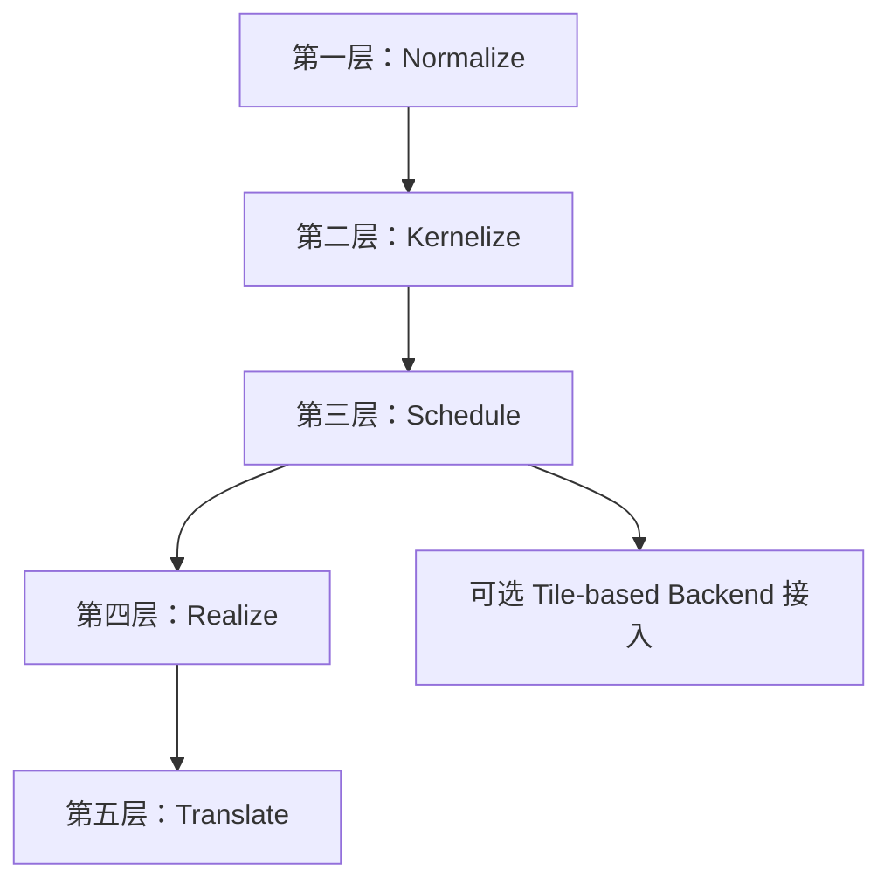
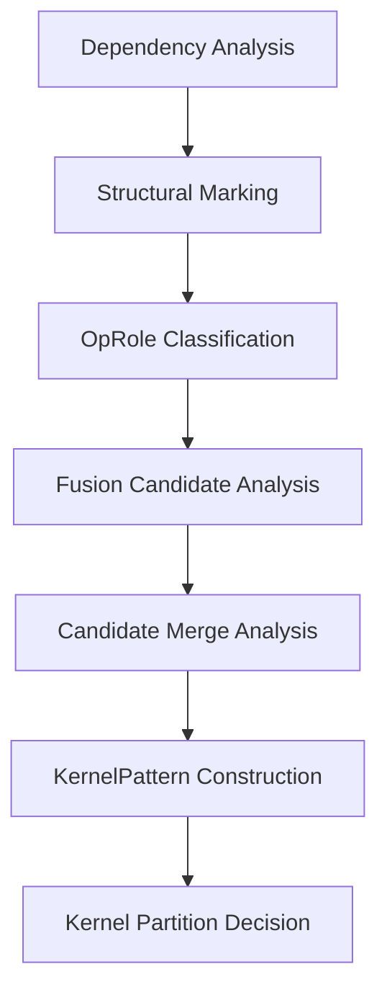
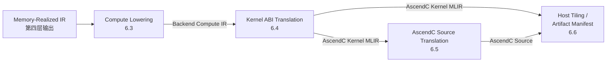

# Ascend NPU MLIR 编译器详细实现 V2

## 1. 整体五层架构

本节只定义实现蓝图的总分层与层间边界。五层主线可以概括为：

- `Normalize`：把入口 IR 收敛成统一分析形态
- `Kernelize`：把计算图切成可独立编译的 kernel
- `Schedule`：为每个 kernel 确定调度与结构骨架
- `Realize`：把调度结果落成显式内存实现
- `Translate`：把已实现的 kernel 翻译成 backend 与 runtime 可消费的工件

第 8 章 `Target Hardware Modeling` 不属于独立编译层；它为 `Schedule / Realize / Translate` 提供统一 target 查询模型。



### 1.1 五层定义

| 层 | 主要作用 | 输出编译单元 | 核心对象 |
|---|---|---|---|
| 第一层：Normalize | 统一入口，收敛方言子集、shape/indexing 表达和基础结构 | 方言子集、shape/indexing 表达、基础结构都已收敛到统一入口约定的 module | `Normalized Linalg/Tensor IR` |
| 第二层：Kernelize | 完成依赖分析、role 分类、融合候选分析和 kernel 划分 | kernel 边界、region 归属和主干拓扑已确定，可按 kernel 为单位继续处理的 module | `KernelPattern` |
| 第三层：Schedule | 生成调度问题和调度决策，并通过 structured lowering 固定结构骨架 | 每个 kernel 的调度中心、tile 结构和循环骨架已稳定下来的结构化 module | `ScheduleProblem`、`ScheduleDecisionSet` |
| 第四层：Realize | 把结构化 kernel 落成 buffer、placement 和显式数据搬运路径 | buffer、placement 和显式数据搬运路径都已确定，可直接进入 backend 翻译的 module | `BufferizedKernelIR`、`PlacementPlan`、`StaticMemoryPlan`、`MovementPlan`、`MemoryRealizationPlan` |
| 第五层：Translate | 把已实现的 kernel 翻译成 backend、toolchain 和 runtime 可消费的工件 | 面向 backend、toolchain 和 runtime 的最终工件集合 | `AscendC Kernel MLIR`、`AscendC Source`、`Host Tiling`，以及可选的 `Artifact Manifest` |

表中的“核心对象”不是该层的唯一输出，而是该层新增或固定下来的主边界对象。

| 核心对象 | 定义 |
|---|---|
| `KernelPattern` | 第二层形成的 region 级编译对象，描述哪些 op 被归入同一个 kernel，以及该 kernel 的 anchor、roles、primitives、输入输出边界等信息。 |
| `ScheduleProblem` | 第三层围绕 `KernelPattern` 抽取的调度问题，描述符号化 shape、axes、memory 约束、硬件约束等调度输入。这里的“约束信息”指的是会直接限制 tile、block、unit assignment 或 pipeline 选择的条件，例如并行轴/规约轴划分、broadcast 轴、ranked symbolic shape 中的动态维位置、片上容量上限、是否必须经过某类 memory place、是否同时使用 Cube 和 Vector、以及某些 primitive 带来的结构约束。 |
| `ScheduleDecisionSet` | 第三层生成的调度结果集合，持有当前 kernel 在编译期或运行期保留的一个或多个 `ScheduleDecision`。 |
| `MemoryRealizationPlan` | 第四层形成的稳定 realization 结果，冻结 `resolvedPlacement`、`workspaceLayout`、`resolvedMovements` 以及最终 materialization 结果。 |

### 1.2 实现接口最小集合

| 层 | 核心类/接口 | 输入 | 输出 |
|---|---|---|---|
| 第一层：Normalize | `EntryNormalizer` | 入口 `func/module` | `Normalized Linalg/Tensor IR` |
| 第二层：Kernelize | `DependencyAnalyzer`、`StructuralMarker`、`OpRoleClassifier`、`FusionCandidateAnalyzer`、`CandidateMergeAnalyzer`、`KernelPatternBuilder`、`KernelPartitioner` | `Normalized Linalg/Tensor IR` | `KernelPattern[]` |
| 第三层：Schedule | `AxisCoalescer`、`ScheduleProblemBuilder`、`TemplateRegistry`、`ScheduleSearch`、`StructuredLoweringDriver` | `KernelPattern[]` | `ScheduleDecisionSet[]` 与结构化 module |
| 第四层：Realize | `BufferizationDriver`、`PlacementPlanner`、`StaticMemoryPlanner`、`MovementPlanner`、`MemoryRealizationDriver` | 结构化 module、`ScheduleDecisionSet[]` | `MemoryRealizationPlan[]` 与 `Memory-Realized IR` |
| 第五层：Translate | `ComputeLoweringDriver`、`BackendABILoweringDriver`、`AscendCSourceEmitter`、`HostTilingEmitter`、`ArtifactManifestBuilder` | `Memory-Realized IR`、`MemoryRealizationPlan[]`、`ScheduleDecisionSet[]` | `AscendC Kernel MLIR`、`AscendC Source`、`Host Tiling`，以及可选的 `Artifact Manifest` |

这些类名是实现基线。后续补充细节时，默认围绕这组接口展开。

### 1.3 社区源码边界

当前实现方案默认不修改 MLIR upstream 社区源码。

统一约束：

- 社区 dialect、interface、analysis、pass 只复用，不直接修改
- 对社区 op 的语义补充优先通过：
  - external model
  - 独立 pass
  - 本地 wrapper analysis
  - 独立 dialect / 本地对象
- 若某步需要接入社区基础设施，例如 `One-Shot Bufferize`，优先通过本地扩展接入，不改社区实现本体

### 1.4 设计原则

#### 1.4.1 编译器入口契约：Linalg/Tensor IR 作为合约边界

本编译器以**规范化的 Linalg / Tensor / Arith / Math / Func IR** 为合约入口边界。

前端框架（torch-mlir、onnx-mlir 等）负责将框架算子降低到此 IR 形态；本编译器不负责框架层到 Linalg 的 lowering，也不依赖任何前端框架的内部实现。

| 职责 | 承担方 |
|---|---|
| 框架算子 → Linalg/Tensor IR | torch-mlir / onnx-mlir / 用户自定义前端 |
| Linalg/Tensor IR → AscendC kernel 产物 | **本编译器** |

选择此边界的理由：

- **职责清晰**：前端框架团队维护框架→Linalg lowering，编译器团队专注后端优化，两者可独立演进
- **复用社区成果**：Linalg/Tensor 是 MLIR 生态中最成熟的结构化 IR，社区已有大量前端对接工作
- **接入灵活**：任何能输出规范化 Linalg/Tensor IR 的工具（包括用户自定义前端）都可以直接接入本编译器，无需修改编译器内部逻辑

本编译器接受的入口 IR 必须满足第二章（Normalize）定义的统一入口约定；不满足该约定的 IR 在第一层入口处拒绝，不允许传入后续层。

#### 1.4.2 不引入新 Dialect

本编译器的所有优化 Pass **不引入新的 MLIR Dialect**，只复用社区已有的 Dialect（`linalg`、`tensor`、`arith`、`math`、`memref`、`scf`、`func`），通过扩展 Attribute 表达编译器内部语义标记。

约束细则：

| 场景 | 规则 |
|---|---|
| 编译器内部语义标记 | 使用 Attribute（如 `AscendOpRoleAttr`、`CacheReadMarker`），不新建 op |
| 新增计算语义 | 通过 `linalg.generic` + 自定义 indexing map 或 `arith`/`math` op 组合表达 |
| backend 专用 op（AscendC compute/move op） | 只在第五层 `Backend Compute IR` 阶段引入，以 `ascendc.*` op 形式存在，范围限于第五层内部 |
| `HandwrittenPattern` | 直接生成 AscendC C++ 源码，不经过新 Dialect |

这一原则的价值：

- 用户工具链只需标准 `mlir-opt` + 本项目注册的 Pass，**不依赖私有方言工具链**
- 与 upstream MLIR 保持最大兼容性，Pass 可以单独发布或选择性集成
- 降低社区贡献门槛

> **关于代码仓中的历史前端方言**：历史原型阶段遗留的前端方言不属于 V2 设计规范。V2 的所有 Pass 以社区 Dialect + 扩展 Attribute 为载体实现，不依赖旧前端方言。

#### 1.4.3 可扩展性预留

当前版本在以下方向有意留白，预留扩展点而非封闭设计：

| 方向 | 当前状态 | 扩展路径 |
|---|---|---|
| 量化 / 混合精度（INT8、FP8） | cast op 链路已可表达类型转换；INT8 matmul 的 `s32s8s8` dtype 已在 `TargetIntrinsicModel` 中建模 | 后续在 Layer 2 补充 `QuantDequantFusion` primitive；Layer 5 补充对应 intrinsic 映射 |
| Scatter-like 写回（MoE dispatch 等） | 通过 `HandwrittenPattern` 机制支持；不走通用 primitive 路径 | 后续在 `accessPatternKind` 扩展 `Scatter` 枚举，补充对应 primitive |
| 新 compute pattern（TopK、Sort 等） | 通过 `HandwrittenPattern` 或 `FallbackSingleOpPattern` 支持 | 在 `HandwrittenPatternRegistry` 注册新 pattern；成熟后迁移至通用 primitive |
| 新前端框架接入 | 扩展第一层属性保留表和前端命名空间前缀表 | 不修改核心编译流程


## 2. 第一层：Normalize

第一层的任务是把上层 lowering 后的 IR 规范化为第二层可稳定分析的统一入口形态。


### 2.1 输入、输出与附加结果

| 项         | 内容                                                         |
| ---------- | ------------------------------------------------------------ |
| 输入       | 上层 lowering 后的结构化 module；方言分两级管理，见 2.3.1 节 |
| 输出       | 满足统一入口约定的规范化 module                              |
| 主边界对象 | `Normalized Linalg/Tensor IR`                                |
| 附加结果   | `gather_dim` / `embedding_dim` 结构标记、符号等价约束标注、入口 diagnostics |

### 2.2 语义规范化表

| 语义                  | 第一层输出形态                                               | 典型来源                                 |
| --------------------- | ------------------------------------------------------------ | ---------------------------------------- |
| matmul                | 具名 `linalg` op，优先保留 `linalg.matmul` 等标准结构化形式  | `torch.aten.mm`、`onnx.MatMul`           |
| elementwise           | 可识别 indexing map 的 `linalg.generic`                      | `torch.aten.add`、`onnx.Relu`            |
| reduce                | 带 reduction iterator 的 `linalg.generic` 或具名 `linalg` op | `torch.aten.sum`、`onnx.ReduceMax`       |
| reshape               | `tensor.expand_shape` / `tensor.collapse_shape` / `tensor.reshape` | `torch.aten.view`、`onnx.Reshape`        |
| cast                  | 具名 cast 或 body 可识别的 `linalg.generic`                  | `torch.aten.to`、`onnx.Cast`             |
| compare / select      | `arith.cmp*` + `select`，或可识别 body 的 `linalg.generic`   | `torch.aten.where`、`onnx.Where`         |
| gather / index_select | 带 `tensor.extract` 的 `linalg.generic`，附加 `gather_dim` 或 `embedding_dim` 结构标记 | `torch.aten.index_select`、`onnx.Gather` |
| broadcast             | 显式 indexing map 表达的 broadcast 语义                      | `torch.aten.expand`、`onnx.Expand`       |
| transpose             | permutation 明确的 indexing map                              | `torch.aten.permute`、`onnx.Transpose`   |
| split / slice         | `tensor.extract_slice` / `tensor.insert_slice`               | `torch.aten.split`、`onnx.Slice`         |
| concat                | `tensor.concat` 或等价 slice/insert 组合                     | `torch.aten.cat`、`onnx.Concat`          |
| shape 查询            | `tensor.dim` + `arith`                                       | `torch.aten.size`、`onnx.Shape`          |

### 2.3 入口处理规则

#### 2.3.1 方言白名单

入口方言分两级管理：

**核心方言**（必须支持；第一层对其结构做完整规范化与合法性验证）：

| 方言     | 说明               |
| -------- | ------------------ |
| `linalg` | 主计算载体         |
| `tensor` | 值语义张量操作     |
| `arith`  | 标量算术与类型转换 |
| `math`   | 数学函数           |
| `func`   | 函数与调用边界     |

**允许透传方言**（不分析、不重写；第一层只验证其是否影响 kernel 候选闭包，影响则报错，不影响则透传至第二层）：

| 方言      | 说明                                             |
| --------- | ------------------------------------------------ |
| `index`   | 索引类型运算，MLIR 推荐用于替代 `i64` 的维度计算 |
| `shape`   | 动态形状计算，部分前端会保留少量 shape 计算 op   |
| `complex` | 复数运算，复数模型的合法入口                     |

此外，`cf.assert` 作为 **op 级例外** 允许透传，用于承载前端生成的动态 shape guard。该例外不表示 `cf` 方言整体进入白名单；`cf.br`、`cf.cond_br` 等控制流 op 仍然报错拒绝。

出现上述两级之外的方言或 op 级例外之外的操作，报错拒绝，不允许静默透传。

**透传方言的额外限制**：

| 方言      | 允许形态                                                     | 禁止形态                                                     |
| --------- | ------------------------------------------------------------ | ------------------------------------------------------------ |
| `index`   | 仅作为 shape / 维度计算的中间值；不参与 kernel 内主计算路径   | 不允许出现在 `linalg.generic` 的 body 内                     |
| `shape`   | 仅作为 dynamic shape 表达；不参与 kernel 内主计算路径         | 不允许出现在 kernel 候选闭包内（详见 2.4 节）                |
| `complex` | 仅允许 `complex.constant` 等纯常量在 module 顶层透传；不允许 `complex.add` / `complex.mul` 等计算 op 出现在任何 kernel 候选闭包内 | 当前版本下游层（第二、三、四、五层）**均不接受** `complex` 计算 op；遇到时第一层 verifier 报 `DialectRejected`。复数计算的完整支持在 V2-1.4.3 节中作为预留扩展点 |

**op 级例外的额外限制**：

| op          | 允许形态                                                     | 禁止形态                                                     |
| ----------- | ------------------------------------------------------------ | ------------------------------------------------------------ |
| `cf.assert` | 仅作为动态 shape guard 透传；不参与第二层 kernel 候选构造；后续层可将其消费为 guard 诊断或保留为 host/runtime guard 输入 | 不允许作为一般控制流载体；不允许引入 branch / region；不允许参与 `linalg` body 内主计算 |

#### 2.3.2 结构规范化规则

| 处理项          | 规则                                                         |
| --------------- | ------------------------------------------------------------ |
| 具名 op 保留    | 对 `linalg.matmul` 等已具备稳定结构语义的具名 `linalg` op，保留具名形式，不退化为通用 `linalg.generic` |
| 属性裁剪        | 按 2.3.3 节的可执行规则处理                                  |
| shape 规范化    | 只允许 ranked symbolic shape；维度可以是编译期常量或符号变量；rank 必须已知且在入口中不变化 |
| 符号等价标注    | 对结构上等价的符号维度附加统一符号变量名，将等价关系记录为 `AscendSymbolConstraintAttr`；详见 2.3.4 节 |
| indexing 规范化 | broadcast 必须规范化为 indexing map 表达；transpose 必须规范化为 permutation indexing map；split/slice 必须规范化为 `tensor.extract_slice` / `tensor.insert_slice`；concat 必须规范化为 `tensor.concat` 或等价 slice/insert 组合；gather 必须规范化为 `linalg.generic + tensor.extract + gather_dim/embedding_dim` |
| gather 规范化   | 上层框架（torch-mlir / onnx-mlir）lowering 后的 gather 已为 `linalg.generic + tensor.extract` 形态；第一层不做进一步 lowering，只由 `mark-structured-ops` 附加 `gather_dim` 或 `embedding_dim` 结构标记，供第二层 `OpRoleClassifier` 识别 |
| canonicalize    | 只运行 2.5.1 节许可 pass 集内的 pass；不得跨 op 语义边界重写，不得引入新控制流，不得改变 kernel 候选闭包 |

#### 2.3.3 属性裁剪规则

属性裁剪按以下优先级顺序执行，规则互斥，匹配第一条即停止：

1. attr name 在属性保留表中，保留。
2. attr name 以 `ascend.` 为命名空间前缀，保留（本编译器自身标记）。
3. attr name 以已知前端命名空间前缀开头，删除。
4. 其余情况，保留并输出 warning，附加 `ascend.unknown_origin` 标记。

规则 1 和规则 3 均依赖静态表，可直接编程实现；规则 2 和规则 4 为前缀匹配，无需人工介入。

**属性保留表**（规则 1）：

| 属性                           | 所属 dialect                                  | 消费方                                                       |
| ------------------------------ | --------------------------------------------- | ------------------------------------------------------------ |
| `linalg.iterator_types`        | `linalg`                                      | 第二层 `OpRoleClassifier`、第三层 `ScheduleProblemBuilder`   |
| `linalg.indexing_maps`         | `linalg`                                      | 第二层 `FusionCandidateAnalyzer`、第三层 `ScheduleProblemBuilder` |
| `gather_dim` / `embedding_dim` | 本编译器（第一层 `mark-structured-ops` 附加） | 第二层 `OpRoleClassifier`                                    |
| `AscendSymbolConstraintAttr`   | 本编译器（第一层符号等价分析附加）            | 第三层 `ScheduleProblemBuilder`                              |

属性保留表由人工维护；新增条目的判断标准为：后续层有代码显式读取该 attr。

**已知前端命名空间前缀表**（规则 3）：

| 前缀     | 来源前端        | 说明                                                  |
| -------- | --------------- | ----------------------------------------------------- |
| `torch.` | torch-mlir      | 前端专属属性，无后续消费方；典型如 `torch.type_bound` |
| `onnx.`  | onnx-mlir       | 调试 / 溯源用途，不影响编译语义；典型如 `onnx.name`   |
| `tf.`    | TensorFlow 前端 | 设备与图语义由本编译器重新建立，原 attr 失效          |

前缀表随接入前端扩展，新增前端时同步补充，不允许静默透传。

**未知来源 attr 的 warning 格式**：

```
warning: unknown attr '<attr_name>' on op '<op_name>' at <loc>;
         not in preserve list and not from known frontend namespace;
         preserved but marked as 'ascend.unknown_origin'
```

附加 `ascend.unknown_origin` 标记的 attr 在第二层入口 verifier 中再次提示，并在 verifier 完成后**立即删除**，不进入第二层后续分析流程。删除时机提前至入口的原因：`ascend.unknown_origin` attr 不携带任何编译语义，若允许其存活至结构识别或候选分析阶段，将污染 fingerprint 计算和结构匹配结果。

#### 2.3.4 符号等价标注

动态 shape 下同一符号维度可能在多个 op 的 operand 中独立出现。第一层末尾执行一次轻量的符号等价分析，将等价关系显式记录，避免后续各层重复推导。

##### 2.3.4.1 基础类型定义

**`DimRef`**：标识某个 SSA 值的某一维度，是等价关系的原子单位。

```cpp
struct DimRef {
  Value  value;   // 必须是 ranked tensor 类型的 SSA 值
  int64_t dim;    // 维度下标，范围 [0, rank(value))；负数不合法
};
```

`DimRef` 的等价关系定义为：两个 `DimRef` 等价，当且仅当在所有可能的运行时输入下，它们所指维度的大小始终相等。

**`DimExpr`**：`OpSemanticSummary.resultShape` 中每个维度的表示类型，是静态常数或符号变量的并集：

```cpp
using DimExpr = std::variant<
  int64_t,      // 编译期已知的静态常数，如 128、1
  StringAttr    // 符号变量名，与 AscendSymbolConstraintAttr 中的 symName 对应
>;
```

符号变量名在同一 `func` 范围内唯一，由 2.3.4.2 节的分析算法统一分配；不同 `func` 之间的符号变量名独立，不互相干扰。

**`AscendSymbolConstraintAttr`**：附加在 `func` attribute 上的等价关系表，结构如下：

```
AscendSymbolConstraintAttr ::= {
  equivalenceClasses: List<EquivalenceClass>
}

EquivalenceClass ::= {
  symName: StringAttr          // 该等价类的符号变量名，如 "M", "K", "seq_len"
  members: List<DimRef>        // 属于该等价类的全部 DimRef
}
```

约束：
- 每个 `DimRef` 至多属于一个 `EquivalenceClass`；不在任何等价类中的维度视为独立符号，后续层按悲观假设处理（不与任何其他维度等价）
- `symName` 在同一 `AscendSymbolConstraintAttr` 内唯一
- `members` 非空；空等价类不合法，不允许写入

##### 2.3.4.2 分析算法

分析采用**带权 Union-Find** 结构，以 `DimRef` 为节点，合并等价的节点。分析在 `func` 范围内一次性完成，输入为规范化后的 IR（indexing 规范化、gather 规范化均已完成）。

**触发合并的规则（按 IR 拓扑序遍历每个 op）：**

| 规则编号 | 触发场景 | 合并的 DimRef 对 |
| -------- | -------- | --------------- |
| R1 | `linalg.generic` op：对每对 `(ins[i], outs[j])` 或 `(ins[i], ins[j])`，若它们的 indexing map 在某个 iterator 维度 `d` 上指向同一个 `(value, dimIdx)` 位置，则合并这两个 `DimRef` | `(ins[i], f_i(d))` ↔ `(ins[j], f_j(d))`，其中 `f_i` / `f_j` 为对应的 indexing map |
| R2 | 具名 contraction-like op（`linalg.matmul` 等）：按 op 的语义显式合并收缩维度；`matmul(A: MxK, B: KxN)` → 合并 `(A, 1)` ↔ `(B, 0)` | 由 op 的 `ContractionOpInterface` 或静态规则表给出，不依赖 indexing map 推导 |
| R3 | producer-consumer SSA 边：若 `op_b` 的 operand 直接来自 `op_a` 的 result（即 `op_b.operand[i] == op_a.result[j]`），则对所有维度 `d` 合并 `(op_a.result[j], d)` ↔ `(op_b.operand[i], d)` | 两者是同一 SSA 值的不同引用上下文，维度严格对应 |
| R4 | `tensor.extract_slice(src, offsets, sizes, strides)`：对每个非退化维度 `d`（stride = 1 且 size 来自 `tensor.dim(src, d)` 或静态等于 `src.dim(d)`），合并 `(src, d)` ↔ `(result, d)` | 退化维度（size = 1）和 stride ≠ 1 的维度不合并 |
| R5 | `tensor.dim(v, d)` 的结果被多处引用：以该 `tensor.dim` 的 SSA value 为根，将所有以该值为 `sizes` / `offsets` 参数的 `tensor.extract_slice` / `tensor.empty` 等 op 的对应维度合并 | 间接等价，通过 SSA def-use 链追踪 |
| R6 | `linalg.broadcast`：output 的非广播维度与 input 的对应维度合并；广播维度（input 中不存在的维度）不合并 | 按 `linalg.broadcast` 的 `dimensions` attr 确定哪些是广播维度 |

**符号变量名分配**：Union-Find 合并完成后，对每个连通分量分配唯一 `symName`：
1. 若分量内存在来自 `func` 参数的 `DimRef`（即 `value` 是 `BlockArgument`），优先用参数名 + 维度下标，如 `arg0_dim1`
2. 否则用编译器生成的稳定 ID，格式为 `sym_<function内唯一整数>`
3. 静态常数维度（已知为编译期常量）不进入等价类，直接在 `DimExpr` 中以 `int64_t` 表示

**分析边界**：
- 只在 `func` 内分析，不跨 `func` 边界
- 只处理 ranked tensor 类型的 SSA 值；scalar / index 类型不参与
- 分析不修改 IR，只构建 `AscendSymbolConstraintAttr` 并附加到 `func`
- 若某维度无法确定等价类（如来自不透明的外部调用），保留为独立符号，不强行合并

**`matmul(A:MxK, B:KxN) → add(result, bias:N) → reduce(sum, dim=N)` 分析示例：**

遍历顺序（拓扑序）：matmul → add → reduce

| 步骤 | 触发规则 | 合并操作 |
| ---- | -------- | -------- |
| matmul R2 | 收缩维度 | `(A,1)` ↔ `(B,0)` → 等价类 `K = {(A,1),(B,0)}` |
| matmul R1 | outs 维度 | `(A,0)` ↔ `(result_mm,0)` → 类 `M`；`(B,1)` ↔ `(result_mm,1)` → 类 `N` |
| add R3 | producer-consumer | `(result_mm,0)` ↔ `(add.operand[0],0)` → 并入 `M`；`(result_mm,1)` ↔ `(add.operand[0],1)` → 并入 `N` |
| add R1 | ins/outs 共享 iterator | `(bias,0)` ↔ `(add.result,1)` → 并入 `N`（broadcast 维度 dim=0 不合并） |
| add R3 | producer-consumer | `(add.result,0)` ↔ `(reduce.operand,0)` → 并入 `M`；`(add.result,1)` ↔ `(reduce.operand,1)` → 并入 `N` |

最终 `AscendSymbolConstraintAttr`：

```
equivalenceClasses:
  - symName: "M", members: [(A,0),(result_mm,0),(add.op[0],0),(add.result,0),(reduce.op,0)]
  - symName: "N", members: [(B,1),(result_mm,1),(add.op[0],1),(bias,0),(add.result,1),(reduce.op,1)]
  - symName: "K", members: [(A,1),(B,0)]
```

`OpSemanticSummary.resultShape`（由上述等价类填充）：

| op | resultShape |
| --- | --- |
| matmul | `[DimExpr("M"), DimExpr("N")]` |
| add | `[DimExpr("M"), DimExpr("N")]` |
| reduce | `[DimExpr("M")]`（N 轴被 reduction 消去） |

### 2.4 入口非法条件

| 情况                                                  | 处理                                 |
| ----------------------------------------------------- | ------------------------------------ |
| 出现核心方言、透传方言白名单和 op 级例外之外的方言 / 操作 | 报错                                 |
| 透传方言中的 op 影响 kernel 候选闭包                  | 报错                                 |
| unranked tensor                                       | 报错                                 |
| 无法解释的 shape 语义，或同一语义存在多种未规范化表达 | 报错；不区分子类型，不允许第二层补救 |
| 具有内存写入、I/O、状态更新或未知副作用的 op          | 报错                                 |

### 2.5 进入第二层前的 Pass 约束

在 `Dependency Analysis` 之前，只允许运行许可 pass 集内的社区 pass；这些 pass 只能清理 IR，不得改变第二层将要消费的结构语义。

#### 2.5.1 许可 pass 列表

| Pass                      | 允许范围                                                     | 禁止事项                                                     |
| ------------------------- | ------------------------------------------------------------ | ------------------------------------------------------------ |
| `cse`                     | 全局公共子表达式消除                                         | 不得跨 region 消除带副作用的 op                              |
| `canonicalize`（受限）    | 仅开启 `arith` fold、`tensor` fold 相关 pattern；通过 `PatternApplicator` filter 机制显式禁用所有 `linalg` pattern | 禁止触发任何会改写 `indexingMaps`、`iteratorTypes`、`resultShape` 的 linalg pattern（如 `foldUnitExtentDims`） |
| `tensor` 局部 fold        | `tensor.cast` fold、`tensor.dim` 常量折叠                    | 不得改变 ranked symbolic shape 语义                          |
| `arith` / `math` 常量折叠 | 纯标量常量折叠与表达式化简                                   | 不得引入新控制流，不得重写主计算拓扑                         |

#### 2.5.2 禁止的 pass 类型

| 类型                                                         | 原因                                    |
| ------------------------------------------------------------ | --------------------------------------- |
| bufferization / memref lowering                              | 会改变值语义和后续 kernel 划分边界      |
| loop / scf lowering                                          | 会破坏结构化计算图和 region 分析基础    |
| 会重写 `resultShape` / `indexingMaps` / `iteratorTypes` 的 pass | 会导致第二层分析对象不稳定              |
| 社区 fusion / partition pass，或其他会跨 region 重组计算边界的 pass | 会绕过第二层的 `KernelPattern` 划分逻辑 |

#### 2.5.3 执行规则

- 许可 pass 集内的 pass 只允许在第一层结束到第二层开始之间执行
- 这些 pass 执行后，IR 仍必须满足第一层的统一入口约束
- 一旦执行了会修改 `resultShape`、`indexingMaps`、`iteratorTypes`、结构属性或 region 边界的 pass，必须重新进入第二层分析窗口，不得复用已有分析结果

### 2.6 第一层 Verifier

第一层结束后由 `EntryNormalizationVerifier` 在进入第二层前统一验证；任一项失败即中止编译，不允许向后传递不合规 IR。检查项按顺序执行，前一项失败仍继续后续以收集完整诊断：

| 顺序 | 检查项                  | 检查内容                                                     | 失败时 `reasonKind` |
| ---- | ----------------------- | ------------------------------------------------------------ | ------------------- |
| 1    | 方言白名单              | 所有 op 所属 dialect 必须出现在 2.3.1 节的核心方言、允许透传方言列表中，或命中 `cf.assert` op 级 shape-guard 例外 | `DialectRejected`   |
| 2    | 透传方言闭包安全        | 透传方言中的 op 不得位于任何 kernel 候选闭包内（详见 2.4 节） | `DialectRejected`   |
| 3    | shape 规范化            | 所有 tensor / memref 类型必须为 ranked symbolic；不允许 unranked，rank 必须已知且不变 | `DialectRejected`   |
| 4    | 具名 op 保留            | `linalg.matmul` 等具名 op 未被退化为 `linalg.generic`        | `DialectRejected`   |
| 5    | 属性裁剪正确性          | 不存在前端命名空间前缀属性（`torch.` / `onnx.` / `tf.`）；所有 `ascend.unknown_origin` 标记的 attr 已删除 | `DialectRejected`   |
| 6    | indexing 规范化         | broadcast / transpose / split / slice / concat / gather 已落到 2.3.2 节规定的标准载体上 | `DialectRejected`   |
| 7    | 符号等价标注完整性      | `AscendSymbolConstraintAttr` 已附加在 `func` attribute 上；其内容覆盖 2.3.4 节列出的所有等价场景 | `DialectRejected`   |
| 8    | 副作用 op 排除          | 所有 op 必须为纯值语义；不存在内存写入、I/O、状态更新或未知副作用 op | `DialectRejected`   |
| 9    | MLIR 内置 verifier      | 运行 `mlir::verify(module)`                                  | MLIR 自身诊断       |

**Verifier 数据流约束**：

- `EntryNormalizationVerifier` 只读消费 IR，不修改 IR 或 attribute
- 失败诊断必须遵循 V2-7.4 节 diagnostics 规范（含 `stage = Normalize`、`objectId`、`reasonKind`、`message`、`isRecoverable`、`fallbackTaken` 字段）
- 第一层 Verifier 的 `isRecoverable` 默认均为 `false`：入口非法的 IR 不允许第二层补救（与 2.4 节"不区分子类型，不允许第二层补救"一致）

**核心接口**：

```cpp
class EntryNormalizationVerifier {
public:
  LogicalResult verify(ModuleOp module,
                       const TargetProfile &targetProfile,
                       DiagnosticEmitter &diag) const;
};
```


## 3. 第二层：Kernelize

第二层的任务是把第一层输出的规范化计算图划分成可独立调度的 `KernelPattern`。整个过程分七个有序步骤执行，每个步骤只消费前序步骤的产出，不回看原始 IR。



### 3.1 输入、输出与系统级约束

| 项         | 内容                                                         |
| ---------- | ------------------------------------------------------------ |
| 输入       | 第一层输出的规范化 module                                    |
| 输出       | 带最终 `KernelPattern[]` 标注的 module                       |
| 主边界对象 | `KernelPattern`                                              |
| 附加产物   | `OpRoleMap`、`scheduleContract[]`（供第三层消费）、划分 diagnostics |

**系统级约束一：模板覆盖完整性**

第一层许可集内的每类 op，必须在第三层 `TemplateRegistry` 中存在对应的单 op 模板族。若某 op 无法找到任何合法模板，第一层应直接拒绝该 op，不允许在第二层划分阶段才发现。`FallbackSingleOpPattern` 是第二层全覆盖性成立所依赖的显式回退契约，不是对任意未知 op 的隐式承诺。

**系统级约束二：HandwrittenPattern 注入机制**

对计算结构高度特化、通用生成路径性价比极低的 kernel（典型如 Flash Attention），采用两阶段处理：

- **结构识别阶段**（StructuralMarker）：识别符合条件的子图拓扑，附加 `handwritten_pattern_candidate` 结构标记。识别结果与 target 无关，不承诺任何融合决策。
- **注入决策阶段**（KernelPatternBuilder）：查询 `HandwrittenPatternRegistry`，对当前 target 已注册的 `patternId` 执行注入，生成 `HandwrittenPattern` 类型的 `KernelPatternCandidate`，绕过第三至第五层的通用生成路径；未命中的标记静默失效。

`HandwrittenPattern` 注册要求：须在 `HandwrittenPatternRegistry` 中显式声明 `patternId`、适用的 target 范围、支持的 dtype 集合，以及对应的预写 AscendC kernel 引用。结构识别条件在 `HandwrittenPatternCatalog` 中声明，与注册信息分离管理。

`HandwrittenPattern` 的优先级高于同覆盖范围内的所有通用候选。

### 3.2 核心类与接口

| 类 / 接口                 | 职责                                                         | 输入                                                         | 输出                                             |
| ------------------------- | ------------------------------------------------------------ | ------------------------------------------------------------ | ------------------------------------------------ |
| `DependencyAnalyzer`      | 构建 producer-consumer 索引与 op 语义摘要                    | 规范化 IR                                                    | `ProducerConsumerIndex`、`OpSemanticSummary`     |
| `StructuralMarker`        | 识别 gather / branch / merge 结构并附加属性                  | `ProducerConsumerIndex`、`OpSemanticSummary`、IR             | 带结构属性的 IR                                  |
| `OpRoleClassifier`        | 为每个 op 生成稳定的角色集合                                 | `OpSemanticSummary`、结构属性                                | `OpRoleMap`                                      |
| `FusionCandidateAnalyzer` | 构造单主角色候选并评估合法性与收益                           | `ProducerConsumerIndex`、`OpSemanticSummary`、`OpRoleMap`    | `FusionCandidate[]`                              |
| `CandidateMergeAnalyzer`  | 判断相邻候选是否可合并为复合候选                             | `FusionCandidate[]`、`CandidateAdjacencyIndex`               | `MergedCandidate[]`                              |
| `KernelPatternBuilder`    | 将通过筛选的候选归并为 `KernelPatternCandidate[]` 并构造依赖图；执行 `HandwrittenPattern` 子图匹配注入 | `FusionCandidate[]`、`MergedCandidate[]`、`HandwrittenPatternRegistry` | `KernelPatternCandidate[]`、`KernelPatternGraph` |
| `KernelPartitioner`       | 在依赖图上消解重叠，输出最终无歧义的 `KernelPattern[]`       | `KernelPatternCandidate[]`、`KernelPatternGraph`             | `KernelPattern[]`                                |

核心方法见各节实现描述。

### 3.3 Dependency Analysis（依赖分析）

#### 3.3.1 职责

依赖分析是第二层的基础设施步骤。其产出在第二层内全局只构建一次，后续所有步骤只读消费，不重复扫描 IR。

#### 3.3.2 产出

**`ProducerConsumerIndex`**：op 级直接依赖索引，只记录一跳依赖，不计算传递闭包。

| 字段            | 类型                                              | 含义                           |
| --------------- | ------------------------------------------------- | ------------------------------ |
| `producers[op]` | `DenseMap<Operation *, SmallVector<Operation *>>` | 直接产生当前 op 输入的 op 集合 |
| `consumers[op]` | `DenseMap<Operation *, SmallVector<Operation *>>` | 直接消费当前 op 结果的 op 集合 |

**`OpSemanticSummary`**：每个 op 的结构语义摘要，来源于自定义 `OpInterface`；对社区 op 通过 external model 挂接，不修改社区实现。

| 字段                | 类型                               | 含义                                                         |
| ------------------- | ---------------------------------- | ------------------------------------------------------------ |
| `resultShape`       | `SmallVector<DimExpr>`             | ranked symbolic shape                                        |
| `indexingMaps`      | `SmallVector<AffineMap>`           | 输入输出 indexing map                                        |
| `iteratorTypes`     | `SmallVector<utils::IteratorType>` | 并行轴 / reduction 轴                                        |
| `accessPatternKind` | `AccessPatternKind`                | 见下表                                                       |
| `semanticAttrs`     | `DictionaryAttr`                   | 单 op 可直接提取或由第一层透传的语义属性；跨 op 结构属性由 Structural Marking 单独产出。**来源限定**：仅允许包含 V2-2.3.3 节"属性保留表"中的条目（`linalg.iterator_types`、`linalg.indexing_maps`、`gather_dim` / `embedding_dim`、`AscendSymbolConstraintAttr`），以及 Structural Marking 在 3.4.2 节产出的 `branch_*` / `merge_*` / `handwritten_pattern_candidate` 标记；不允许出现 `ascend.unknown_origin` 或前端命名空间前缀属性（这些在第一层 verifier 阶段已删除） |

`accessPatternKind` 枚举值及其与前端语义分类的对应关系：

| `accessPatternKind` | 对应前端语义分类                                 | 说明                                                         |
| ------------------- | ------------------------------------------------ | ------------------------------------------------------------ |
| `Elementwise`       | `Elewise`、`Broadcast`                           | 两者调度行为一致，统一为同一枚举值；broadcast 的退化维度体现在 indexing map 中，不需在此区分 |
| `Reduction`         | `Reduce`                                         | 含 reduction iterator                                        |
| `LayoutTransform`   | `Transpose`、无 branch/merge 的 `Split / Concat` | 只做布局重排，不改变元素数                                   |
| `Indexing`          | `Gather`                                         | 存在数据相关地址访问                                         |
| `NotApplicable`     | `MatMul / Conv` 等具名 contraction-like op       | 该 op 的访问模式由具名 op 类型直接确定，`accessPatternKind` 在此刻意不重复编码；下游消费方须直接识别 op 类型，不得在此字段上新增 `Contraction` 分支 |

> `Split / Concat` 在存在 branch/merge 结构时，由 Structural Marking 附加 `branch_* / merge_*` 属性，OpRole 分类阶段据此派生 `Branch / Merge` 角色，不通过 `accessPatternKind` 表达。
>
> 凡 `accessPatternKind = NotApplicable` 的 op，`OpRoleClassifier` 的 `Anchor` 分类条件已按 op 类型直接推导（见 3.5.2 节），是当前唯一合法的消费路径。

#### 3.3.3 构建规则

`ProducerConsumerIndex`：遍历分析范围内的所有 op；若某 operand 的 defining op 也在范围内，则建立一条直接依赖边。

`OpSemanticSummary`：通过 `OpInterface` / external model 逐 op 提取；只缓存第二层直接消费的摘要字段，不保留完整推导过程；跨 op 的 branch / merge 结构识别不在此处处理。

`resultShape` 的填充方式：对每个 op，遍历其 result tensor 的每个维度 `d`；在 `AscendSymbolConstraintAttr.equivalenceClasses` 中查找包含 `DimRef(result, d)` 的等价类，若命中则 `resultShape[d] = DimExpr(symName)`；若未命中（独立维度）则 `resultShape[d] = DimExpr(sym_<新分配ID>)`；若维度为静态常数则 `resultShape[d] = DimExpr(constantValue)`。

#### 3.3.4 全局逻辑轴空间

**全局逻辑轴空间**（`GlobalAxisSpace`）是第二层在 `DependencyAnalyzer` 完成后一次性建立的轴标识系统，供 `tileableAxes`、`requiredReductionAxes` 等候选级字段使用。它的本质是把 `AscendSymbolConstraintAttr` 的等价类翻译成候选分析可直接索引的轴对象。

**数据结构：**

```cpp
struct LogicalAxis {
  StringAttr   symName;     // 与 AscendSymbolConstraintAttr 中的 symName 一一对应
  AxisKind     kind;        // Parallel | Reduction | Unknown（分析完成后不应出现 Unknown）
  int64_t      axisId;      // func 内唯一整数 ID，用于集合操作和 fingerprint
};

// GlobalAxisSpace 是 func 范围内所有 LogicalAxis 的有序集合
// key: symName（StringAttr），value: LogicalAxis
using GlobalAxisSpace = DenseMap<StringAttr, LogicalAxis>;
```

**建立步骤：**

1. 读取 `func` 上的 `AscendSymbolConstraintAttr`，为每个 `EquivalenceClass` 创建一个 `LogicalAxis`，`symName` 直接复用等价类的 `symName`，`axisId` 按等价类的拓扑出现顺序分配（从 0 开始，稳定且确定）
2. 对每个 `LogicalAxis`，通过其 `members` 中的任意 `DimRef` 定位到对应 op，查询该 op 的 `iteratorTypes`：若该维度对应的 iterator 类型为 `parallel`，则 `kind = Parallel`；若为 `reduction`，则 `kind = Reduction`
3. 同一等价类的所有 `DimRef` 在 `iteratorTypes` 上必须一致（`AscendSymbolConstraintAttr` 的 verifier 在 2.3.4 节负责保证这一点）；若出现不一致，`DependencyAnalyzer` 报 `StructuralBarrier` 错误

**轴传播：从 op 局部维度到 LogicalAxis 的映射**

`DependencyAnalyzer` 在建立 `GlobalAxisSpace` 后，为每个 op 建立一张**局部维度 → LogicalAxis** 的映射表 `OpAxisMap`：

```cpp
// op 的第 dimIdx 个 iterator 维度对应哪个 LogicalAxis
using OpAxisMap = DenseMap<Operation*, SmallVector<LogicalAxis*>>;
// OpAxisMap[op][iteratorIdx] = &logicalAxis（或 nullptr 表示静态常数维度）
```

填充方式：对 op 的每个 result，遍历其每个维度 `d`，在 `AscendSymbolConstraintAttr` 中查找 `DimRef(result, d)` 所属的等价类，得到对应 `LogicalAxis`；再通过 op 的 `indexingMaps` 把 result 维度 `d` 反查到 iterator 轴编号 `iteratorIdx`，建立 `OpAxisMap[op][iteratorIdx] = &logicalAxis`。

`linalg.generic` 的 `accessPatternKind = NotApplicable` 的具名 op（如 matmul）：iterator 轴到维度的映射由 op 的 `ContractionOpInterface` 给出，不依赖 indexing map 推导。

**`tileableAxes` 中的轴标识**：`tileableAxes` 的元素类型为 `LogicalAxis*`（指向 `GlobalAxisSpace` 中的条目），不是裸整数。集合操作（交集、并集）基于 `axisId` 做 set 运算。

**`matmul+add+reduce` 示例**

延续 2.3.4.2 末尾的分析结果，`AscendSymbolConstraintAttr` 已建立三个等价类 M / N / K。

`GlobalAxisSpace` 建立结果：

| axisId | symName | kind | 来源 |
| ------ | ------- | ---- | ---- |
| 0 | `"M"` | `Parallel` | matmul 的 iterator[0] 为 parallel |
| 1 | `"N"` | `Parallel` | matmul 的 iterator[1] 为 parallel |
| 2 | `"K"` | `Reduction` | matmul 的 iterator[2] 为 reduction |

`OpAxisMap` 节选：

| op | iteratorIdx | LogicalAxis |
| --- | --- | --- |
| matmul | 0 | M（axisId=0） |
| matmul | 1 | N（axisId=1） |
| matmul | 2 | K（axisId=2） |
| add | 0 | M（axisId=0） |
| add | 1 | N（axisId=1） |
| reduce | 0 | M（axisId=0） |
| reduce | 1 | N（axisId=1，reduction） |

3.6.2.1 节 `tileableAxes` 推导步骤 1 中"从 seed op 的 iteratorTypes 收集 parallel 轴"的具体含义：查 `OpAxisMap[seedOp]`，取 `kind = Parallel` 的 `LogicalAxis` 集合。步骤 2 中"沿 indexingMaps 传播"的具体含义：对候选内每个 op，检查初始集合中的每个 `LogicalAxis` 在 `OpAxisMap[op]` 中是否存在；若不存在（该 op 不感知此轴）则透明通过；若存在但 `kind` 为 `Reduction`，则从 `tileableAxes` 移入 `requiredReductionAxes`。

#### 3.3.5 案例

**案例 A：`matmul -> add -> leakyrelu`**

`ProducerConsumerIndex`：

| op          | producers        | consumers   |
| ----------- | ---------------- | ----------- |
| `matmul`    | 空               | `add`       |
| `add`       | `matmul`、`bias` | `leakyrelu` |
| `leakyrelu` | `add`            | 空          |

`OpSemanticSummary`：

| op          | resultShape | iteratorTypes                     | accessPatternKind |
| ----------- | ----------- | --------------------------------- | ----------------- |
| `matmul`    | `[M, N]`    | `[parallel, parallel, reduction]` | `Unknown`         |
| `add`       | `[M, N]`    | `[parallel, parallel]`            | `Elementwise`     |
| `leakyrelu` | `[M, N]`    | `[parallel, parallel]`            | `Elementwise`     |

**案例 B：`gather + add`**

| op       | resultShape | iteratorTypes          | accessPatternKind | semanticAttrs    |
| -------- | ----------- | ---------------------- | ----------------- | ---------------- |
| `gather` | `[B, K]`    | `[parallel, parallel]` | `Indexing`        | `gather_dim = 1` |
| `add`    | `[B, K]`    | `[parallel, parallel]` | `Elementwise`     | 空               |

### 3.4 Structural Marking（结构标记）

#### 3.4.1 职责

识别 gather、branch、merge 等跨 op 结构语义，将结果以属性形式附加到对应 op 上。后续步骤直接消费这些属性，不重复做结构识别。

#### 3.4.2 产出

| 属性                            | 含义                                                         |
| ------------------------------- | ------------------------------------------------------------ |
| `gather_dim`                    | gather 访问的动态索引轴                                      |
| `embedding_dim`                 | embedding 访问的动态索引轴                                   |
| `branch_root`                   | 所属分叉结构的唯一标识                                       |
| `branch_group`                  | 同一分叉结构内的支路编号                                     |
| `branch_source`                 | 分叉结构的公共源值引用                                       |
| `merge_root`                    | 所属汇合结构的唯一标识                                       |
| `merge_group`                   | 汇合结构中对应的上游支路编号                                 |
| `handwritten_pattern_candidate` | 符合某类已知高价值子图结构的候选标记；含义是"拓扑和语义形态与某类 HandwrittenPattern 匹配"，不承诺任何融合决策；最终是否注入 HandwrittenPattern 由 `KernelPatternBuilder` 查询 `HandwrittenPatternRegistry` 后决定 |

`handwritten_pattern_candidate` 字段：

| 子字段      | 含义                                                         |
| ----------- | ------------------------------------------------------------ |
| `patternId` | 候选结构的类型标识，如 `FlashAttention`、`GroupedMatMul` 等  |
| `groupId`   | 同一候选实例内各 op 共享的唯一组标识，用于在图中区分多个同类实例 |
| `role`      | 该 op 在候选结构中承担的语义角色，如 `score_matmul`、`softmax`、`context_matmul` |

属性约束：

- `handwritten_pattern_candidate` 是纯结构标记，不依赖 target；同一 IR 在不同 target 上产生相同的标记结果
- 若 target 未注册对应的 `HandwrittenPattern`，该标记不影响通用 primitive 路径的执行，op 照常参与 `FusionCandidateAnalyzer`
- 同一 op 可同时携带 `handwritten_pattern_candidate` 和其他结构属性（如 `branch_*`），两者互不干扰

#### 3.4.3 识别规则

| 结构                            | 识别条件                                                     |
| ------------------------------- | ------------------------------------------------------------ |
| `gather`                        | `linalg.generic` body 含 `tensor.extract`，且动态索引轴满足 gather 语义 |
| `Branch`                        | 以某 SSA 值 `v` 为 `branch_source`，从 `v` 出发沿纯 `Injective / SliceLike / LayoutTransform` 链向后搜索；若存在两个及以上 op 集不重叠的分支入口 `entry_i`，且各入口均直接或间接消费 `v`，则形成 `branch_root`；遇到 `Reduction / Anchor / Indexing / side-effect` op 时停止扩展 |
| `Merge`                         | 若某 op `m` 的两个及以上 operand 分别来自同一 `branch_root` 的不同 `branch_group`，且 `m` 是这些支路在允许穿越链上的第一个共同汇合点，则 `m` 形成 `merge_root`；覆盖某 `branch_root` 的候选必须同时覆盖其对应的 `merge_root`，否则视为部分闭合失败 |
| `handwritten_pattern_candidate` | 见下表；由 `HandwrittenPatternCatalog` 驱动，每类 HandwrittenPattern 在 catalog 中声明自己的结构识别条件，`StructuralMarker` 逐一匹配并附加标记 |

属性编码约束：

- `branch_root` / `merge_root` 使用 function 内唯一结构 ID
- `branch_group` / `merge_group` 使用同一结构下的连续支路编号
- `branch_group` 只附加在支路入口及其允许穿越链上；穿过 `Reduction / Anchor / Indexing` 或到达 `merge_root` 后不再传播
- `merge_group` 记录该 operand 所归属的上游 `branch_group`

**已注册的 `handwritten_pattern_candidate` 识别规则：**

| `patternId`      | 识别条件                                                     | op 角色分配                                                  |
| ---------------- | ------------------------------------------------------------ | ------------------------------------------------------------ |
| `FlashAttention` | 存在两个 `Anchor` op `M1`、`M2`，满足：`M1` 的输出经过若干 `Injective` op 后进入完整 softmax 结构（含 max_reduce、sub、exp、sum_reduce、div），softmax 的输出作为 `M2` 的一个输入；`M1` 的 K 维与 `M2` 的 M 维在 `AscendSymbolConstraintAttr` 中等价；识别时不要求 causal mask 存在，mask 作为可选输入 | `M1 → score_matmul`；scale/softmax 中各 op → `softmax`；`M2 → context_matmul` |

**识别规则的扩展约定：**

- 新增 `HandwrittenPattern` 时，在 `HandwrittenPatternCatalog` 中声明识别条件，不修改 `StructuralMarker` 主体逻辑
- 识别条件只允许依赖 `OpSemanticSummary`、`ProducerConsumerIndex` 和 `AscendSymbolConstraintAttr`，不允许依赖 target 信息
- 识别失败（部分 op 缺失或维度关系不满足）时，不附加 `handwritten_pattern_candidate`，不报错，op 进入通用路径
- 识别成功但后续 `KernelPatternBuilder` 查询 `HandwrittenPatternRegistry` 未命中时，标记静默失效，op 进入通用路径

属性编码约束（原有规则保持不变，补充以下内容）：

- `branch_root` / `merge_root` 使用 function 内唯一结构 ID
- `branch_group` / `merge_group` 使用同一结构下的连续支路编号
- `branch_group` 只附加在支路入口及其允许穿越链上；穿过 `Reduction / Anchor / Indexing` 或到达 `merge_root` 后不再传播
- `merge_group` 记录该 operand 所归属的上游 `branch_group`
- `handwritten_pattern_candidate.groupId` 使用 function 内唯一实例 ID，区分同一函数中多个同类结构实例（如多层 attention）

#### 3.4.4 案例

**案例 A：`index_select(dim=1) -> add`**

| op               | 结构属性         |
| ---------------- | ---------------- |
| `gather generic` | `gather_dim = 1` |
| `add`            | 空               |

**案例 B：`x -> split -> branch0 / branch1 -> concat`**

| op                             | 结构属性                                          |
| ------------------------------ | ------------------------------------------------- |
| `branch0` 上的 `extract_slice` | `branch_root=B0, branch_group=0, branch_source=x` |
| `branch1` 上的 `extract_slice` | `branch_root=B0, branch_group=1, branch_source=x` |
| `concat`（接收 branch0）       | `merge_root=M0, merge_group=0`                    |
| `concat`（接收 branch1）       | `merge_root=M0, merge_group=1`                    |

### 3.5 OpRole Classification（OpRole 分类）

#### 3.5.1 职责与设计说明

为每个 op 生成稳定的角色集合 `OpRoleMap`，供后续 primitive 判定、候选扩展和 kernel 划分直接消费。角色通过 `OpInterface` / external model 派生，不直接修改 IR。

> **分类体系对比：**
>
> * OpType 体系：前端语义分类，描述的是 op 是什么样的计算，记录于`OpSemanticSummary.accessPatternKind`
>
> * OpRole 体系：调度行为分类，描述的是 op 在 kernel 划分和调度时扮演什么角色。多个语义不同的 op 可以映射到同一个 role。
>
> 前端语义分类不能替代 OpRole，原因有三：
>
> * 语义分类不携带调度约束：`Injective` 的核心含义是"tile 可从 consumer 自由传播到 producer"，而不只是"做了逐元素计算"；`Elewise` 和 `Broadcast` 在语义上不同，但调度行为完全一致，统一为 `Injective`
>
> * `Branch / Merge` 是拓扑结构角色，不是 op 固有属性：同一个 `Split` op，在不同图结构中可能是 `Branch`，也可能只是普通的 `SliceLike`
>
> * 一个 op 可同时持有多个 role；前端语义分类是互斥的，无法表达多角色组合

**确定性保证**：`OpRoleClassifier` 的推导结果必须确定——相同 IR 多次运行产生相同 `OpRoleMap`。推导只依赖 `OpSemanticSummary`、结构属性和静态图拓扑，不依赖遍历顺序。

#### 3.5.2 角色定义

| 角色              | 分类条件                                                     |
| ----------------- | ------------------------------------------------------------ |
| `Anchor`          | 具名 contraction / conv-like `linalg` op（`linalg.matmul`、`linalg.batch_matmul`、`linalg.conv_*` 等） |
| `Reduction`       | `iteratorTypes` 含 reduction 的 `linalg.generic` 或具名 reduce-like op |
| `Injective`       | `accessPatternKind = Elementwise`                            |
| `LayoutTransform` | permutation indexing map；`expand/collapse/reshape` 且元素数不变；bitcast/view-like；可证明只做连续布局重排的 slice/concat 组合；**`OpRoleClassifier` 对此角色的分类路径分两类**：① 具有 linalg indexing map 的 `linalg.generic`，通过 `accessPatternKind` 推导；② 无 indexing map 的原生 MLIR op（`tensor.expand_shape`、`tensor.collapse_shape`、`memref.expand_shape`、`memref.collapse_shape`、`tensor.bitcast`、`memref.cast` 等），通过 op 类型直接匹配（`isa<>` 检查），不经过 `OpSemanticSummary` 推导 |
| `Indexing`        | `semanticAttrs` 含 `gather_dim` / `embedding_dim`；或可证明存在数据相关地址读取且无副作用写回 |
| `SliceLike`       | `tensor.extract_slice`                                       |
| `Branch`          | `semanticAttrs` 含 `branch_*`                                |
| `Merge`           | `semanticAttrs` 含 `merge_*`                                 |

#### 3.5.3 多角色规则

- `OpRoleMap` 使用 `op -> SmallVector<OpRole>`，必须保留全量角色
- 主角色优先级：`Anchor > Reduction > Indexing > Branch > Merge > LayoutTransform > SliceLike > Injective`
- primitive 判定默认读取主角色；若需要辅助角色，必须显式声明
- 当前不支持带副作用的不规则写入；scatter-like 写回若无法归入纯值语义，短期通过 `HandwrittenPattern` 机制支持，后续扩展路径见 1.4.3 节

#### 3.5.4 案例

| 案例                           | op                | roles                 | 主角色      |
| ------------------------------ | ----------------- | --------------------- | ----------- |
| `matmul + add + leakyrelu`     | `matmul`          | `[Anchor]`            | `Anchor`    |
|                                | `add`             | `[Injective]`         | `Injective` |
|                                | `leakyrelu`       | `[Injective]`         | `Injective` |
| `broadcast + add + reduce`     | `broadcast`       | `[Injective]`         | `Injective` |
|                                | `reduce`          | `[Reduction]`         | `Reduction` |
| `extract_slice` 位于 branch 上 | `extract_slice`   | `[SliceLike, Branch]` | `Branch`    |
| `softmax` 子结构               | `max_reduce`      | `[Reduction]`         | `Reduction` |
|                                | `sub / exp / div` | `[Injective]`         | `Injective` |
|                                | `sum_reduce`      | `[Reduction]`         | `Reduction` |

### 3.6 Fusion Candidate Analysis（融合候选分析）

#### 3.6.1 职责

基于依赖分析、结构属性和 `OpRoleMap`，构造第一轮**单主角色候选**，并为每个通过合法性检查的候选生成调度契约 `scheduleContract`。多主角色复合候选不在此阶段直接形成，由 3.7 节处理。

#### 3.6.2 产出

**`FusionCandidate`** 最小字段：

| 字段               | 含义                                                         |
| ------------------ | ------------------------------------------------------------ |
| `seedOps`          | 候选起始种子                                                 |
| `candidateOps`     | 候选包含的 op 集合                                           |
| `roles`            | 候选内出现的角色集合                                         |
| `primitives`       | 候选依赖的 primitive 集合                                    |
| `closure`          | 对应的 `CandidateClosure`                                    |
| `scheduleContract` | 候选级调度边界条件摘要，供第三层 `ScheduleProblemBuilder` 消费 |
| `benefitScore`     | 轻量收益评分                                                 |

**`CandidateClosure`** 最小字段：

| 字段                      | 类型                       | 含义                                               |
| ------------------------- | -------------------------- | -------------------------------------------------- |
| `internalOps`             | `SmallVector<Operation *>` | 候选内部 op 集合                                   |
| `externalInputs`          | `SmallVector<Value>`       | 从候选外部流入的值                                 |
| `externalOutputs`         | `SmallVector<Value>`       | 候选边界处的终结导出值                             |
| `escapingValues`          | `SmallVector<Value>`       | 非终结 op 的结果同时被候选外消费；非空则候选不闭合 |
| `rematerializableEscapes` | `SmallVector<Value>`       | 可通过 primitive 声明的重计算规则消解的逃逸值      |
| `isClosed`                | `bool`                     | 无硬逃逸且全部结构约束通过时为 `true`              |

**`scheduleContract`** 最小字段：

| 字段                    | 含义                                                         | 推导来源                                                     |
| ----------------------- | ------------------------------------------------------------ | ------------------------------------------------------------ |
| `tileableAxes`          | 候选允许后续切分的逻辑轴集合                                 | role、iteratorTypes、indexing map、primitive 允许的 tile 传播规则 |
| `requiredReductionAxes` | 必须保持为 reduction 的轴                                    | reduction role、reduce op 语义和 primitive 约束              |
| `axisScheduleConstraints` | 轴级调度约束与候选执行角色提示；只描述合法性和偏好，不选择具体 tile size；单轴通过 `coalescingGroupId` 反向引用组级合轴提示 | `tileableAxes`、`requiredReductionAxes`、broadcast/layout/indexing 传播关系、primitive 语义 |
| `axisCoalescingHints`   | 组级合轴提示；记录可一起线性化的轴组、组 kind 和成员顺序；与 `axisScheduleConstraints` 同级，不内嵌到单轴结构 | `axisScheduleConstraints`、layout 连续性约束、primitive 语义 |
| `layoutConstraints`     | 后续模板不能破坏的 layout 条件                               | indexing、layout transform、transpose / gather / concat 等结构语义 |
| `mustKeepOnChipValues`  | 进入单 kernel 时必须片上传递的值                             | producer-consumer carried values 和 primitive 的片上传播要求 |
| `templateFamilies`      | 当前候选按 role 组合推断出的模板族标签集合；元素为字符串标识符（如 `"AnchorEpilogue"`、`"SoftmaxTemplate"`） | role 组合与结构语义；**不依赖 `TemplateRegistry` 内部结构**，由第二层按静态规则推断；第三层凭此标签在 `TemplateRegistry` 中自行查找，查不到则报错 |
| `dynamicGuardSet`       | 候选必须承受的动态 shape guard 集                            | shape/indexing 证明条件和 primitive guard 要求               |

> **`templateFamilies` 与 `TemplateCapabilityQuery` 的分工**
>
> 第二层通过 `TemplateCapabilityQuery` 接口对第三层做唯一一次 bool 查询：当前 role 组合是否存在可承接模板。查询结果只用于合法性过滤（失败则记 `TemplateUnavailable`），不写入 `scheduleContract`。
>
> `templateFamilies` 的内容由第二层按 role 组合静态推断，第三层负责用这些标签实际匹配模板，两者之间的接口只是字符串集合，互不依赖对方的内部数据结构。

##### 3.6.2.1 scheduleContract 推导规则

每个 `scheduleContract` 字段在候选扩展完成、`CandidateClosure.isClosed = true` 后立即推导。推导只读消费 `OpSemanticSummary`、`OpRoleMap`、`ProducerConsumerIndex` 和候选自身的 `CandidateClosure`，不查询 target 硬件参数，不依赖 `TemplateRegistry` 内部结构。八个字段的推导顺序如下：`tileableAxes` → `requiredReductionAxes` → `axisScheduleConstraints` → `axisCoalescingHints` → `layoutConstraints` → `mustKeepOnChipValues` → `templateFamilies` → `dynamicGuardSet`；前序字段的结果可被后续字段消费。

---

**① `tileableAxes` 推导**

`tileableAxes` 是"沿该轴对整个候选做分块，候选内所有 op 均保持语义正确"的逻辑轴集合。推导分三步：

**步骤 1：收集初始轴集合**

查 `OpAxisMap[seedOp]`，取 `kind = Parallel` 的 `LogicalAxis` 集合作为初始轴集合（与 3.3.4 节定义一致）。seed op 的 `reduction` 类型轴不进入此集合，直接转入 `requiredReductionAxes`（见 ②）。非 seed op 的轴在步骤 2 传播过滤中处理，不在步骤 1 收集。

**步骤 2：沿 indexingMaps 做轴传播过滤**

对候选内每个 op，检查初始轴集合中的每个轴能否通过该 op 的 `indexingMaps` 安全传播：

| op 的主角色 | 传播规则 |
| ----------- | -------- |
| `Injective` | indexing map 为恒等或广播；广播维度（退化为常数的维度）在 consumer 侧轴集合中保留，在 producer 侧对应退化维度上标记为 `broadcastAxis`，不参与 tile 大小传播，但仍在集合中 |
| `LayoutTransform` | 按 permutation map 做轴重编号；转置后轴编号变更，集合中对应条目同步更新；reshape / expand_shape 做维度分裂或合并映射，若映射为静态常数则安全，动态则将涉及维度从集合中移除 |
| `Anchor` | seed op；其 `parallel` 轴全部加入初始集合；`reduction` 轴移入 `requiredReductionAxes` |
| `Reduction` | **seed 自身**：其 `parallel` 轴已在步骤 1 加入初始集合，`reduction` 轴直接移入 `requiredReductionAxes`，不参与步骤 2 传播；**非 seed 的 Reduction op**（如 SoftmaxFusion 内的第二个 reduce）：要求其 tile 轴与 seed Reduction 的 tile 轴相同；不一致的轴从集合中删除 |
| `Indexing` | `gather_dim` 对应的轴不可 tile（动态索引轴切分后访问模式不确定）；其余 parallel 轴正常传播 |
| `SliceLike / Branch / Merge` | 按 extract_slice 的 offset/size 静态分析；若切分轴与 tile 轴一致则安全；否则从集合中删除 |

若某轴在传播到某 op 时该 op 的 indexing map 中不存在对应维度（即该 op 完全不感知此轴），则该轴对此 op 透明，不影响集合。

**步骤 3：primitive 级附加约束**

| primitive | 附加约束 |
| --------- | -------- |
| `SoftmaxFusion` | 两个 Reduction op 的 `tileableAxes` 交集必须非空；取交集后写入 `tileableAxes`，若交集为空则候选合法性失败，记 `TileContractUnavailable` |
| `MultiBranch` | 所有 branch_group 上对应位置的轴必须同构（同 rank、同 size 关系）；不同构的轴从集合中删除 |
| `AnchorPrologue` | prologue 链内的轴必须能从 Anchor 的 tile 轴向前传播到每个 prologue op；不能传播的轴删除 |
| 其余 primitive | 无附加约束 |

**`matmul+add+reduce` 推导示例（候选 C1 = {add, reduce}，ReductionInlining）**：

| op | iteratorTypes | parallel 轴 | reduction 轴 |
| --- | --- | --- | --- |
| add | `[parallel(M), parallel(N)]` | M, N | — |
| reduce | `[parallel(M), reduction(N)]` | M | N |

步骤 1：初始轴集合 = `{M, N}`（来自 add 的两个 parallel 轴）。

步骤 2：reduce 的 indexing map 中 N 轴为 reduction，传播规则要求将 N 从 tileableAxes 移入 requiredReductionAxes → 集合剩余 `{M}`。

步骤 3：`ReductionInlining` 无附加约束。

结果：`tileableAxes = [M]`，`requiredReductionAxes = [N]`。

---

**② `requiredReductionAxes` 推导**

收集候选内所有 Reduction op 的 `reduction` 类型轴，取并集。若候选内存在多个 Reduction op（如 SoftmaxFusion），则各自的 reduction 轴全部加入；同一轴在多个 op 中出现只记录一次。

`requiredReductionAxes` 的元素在后续 tile 分块时必须保持完整，不允许跨 reduction 轴做分块（即 reduction 轴的 tile size 必须等于该轴的全长，除非 primitive 显式声明支持分块 reduction，当前 primitive 列表中无此声明）。

**`matmul+add+reduce` 示例**：reduce 的 N 轴为 reduction → `requiredReductionAxes = [N]`。

---

**③ `axisScheduleConstraints` 推导**

`axisScheduleConstraints` 是第二层向第三层交付的轴级调度边界。它回答"合轴之后每根逻辑轴可以被第三层怎样使用"，但不回答"最终 tile 多大、采用几个 block、是否启用某个 target 专属模板"。具体数值选择仍由第三层 `TemplateRegistry`、`ScheduleSearch`、target memory/cost model 和第四层 capacity check 共同决定。

业界同类编译系统通常采用这一分层：

- MLIR Linalg / transform dialect 先以 iteration domain 表达合法 loop 维度，再由后续 tiling、interchange、mapping 选择具体 loop 结构。
- IREE codegen 把 workgroup、subgroup、thread/vector 的多级 tiling 分开建模，先确认维度合法性，再绑定到硬件层级。
- Triton kernel 以 program id grid 表达 block 级映射，用 mask 处理非整除 tail，而不是要求所有 shape 整除 tile。
- TVM MetaSchedule 把 schedule trace、tile split、bind、vectorize 作为可搜索 decision，合法性和代价选择分离。

Ascend 主线采用相同思想：第二层只产出轴约束和候选角色，第三层把这些约束作为 `ScheduleProblemBuilder`（见 3.6.2 表中 `scheduleContract` 字段消费方）的输入，再由 structured lowering 物化为 `scf.for`、`memref.subview`、block mapping 和 tail guard。

**数据结构：**

```cpp
enum class AxisExecutionRole {
  BindCoreCandidate,     // 可映射到 Ascend AI Core 级并行（block_idx），等价于 IREE workgroup；
                         // 注意：Ascend 硬件无 GPU 意义上的 subgroup 层
  KernelLoopCandidate,   // 可生成核内 outer loop（intra-core 的 scf.for），由单个 AI Core 顺序执行；
                         // 不对应 GPU 的 subgroup / warp
  VectorizeCandidate,    // 可作为最内层向量化 / AscendC vector intrinsic 轴
  FullReduction,         // reduction 轴必须在单个 tile 内完整归约
  ChunkedReduction,      // reduction 轴允许分块归约；仅 primitive 显式声明时可用
  BroadcastProjection,   // broadcast 退化轴，不传播 tile size
  LayoutCarry            // layout transform 只重编号或携带该轴
};

enum class AxisTailPolicy {
  MustDivide,       // 模板要求整除；第三层需要产生 Divisible guard 或静态验证
  MaskedTail,       // 允许 tail，通过 min(tile, dim-origin) 或 mask 处理
  ScalarEpilogue,   // 允许单独尾部 epilogue
  PadAndMask,       // 允许将 tail 搬入对齐临时 buffer，再用 mask / guard 写回真实范围
  FullExtent        // 轴必须全长覆盖，典型为当前 FullReduction
};

enum class PrimitiveAxisUseKind {
  DataCopy,          // 该轴参与 GM/L2/L1/UB 数据搬运
  VectorCompute,     // 该轴参与 vector intrinsic 计算
  Reduction,         // 该轴参与归约
  GatherIndex,       // 该轴参与数据相关 indexing / gather
  CubeM,             // 该轴映射到 cube M 维
  CubeN,             // 该轴映射到 cube N 维
  CubeK,             // 该轴映射到 cube K 维
  WriteBack          // 该轴参与最终写回
};

// 合轴提示是"组级别"概念（多根轴属于同一组），不挂在单根轴上。
// 单根轴的 AxisScheduleConstraint 只通过 coalescingGroupId 反向引用所属组，
// 真正的组信息存放在候选级别的 AxisCoalescingHint 列表里（见 scheduleContract 字段）。
enum class CoalescingHintKind {
  Vectorizable,    // 组内至少一根轴可作为 VectorizeCandidate；可一起线性化并允许作为最内向量轴
  LinearizeOnly    // 组内无轴可向量化；仅作为 block/grid 线性化提示，不传递为 vector 轴
};

struct AxisCoalescingHint {
  uint32_t groupId;                       // 候选内唯一；0 表示"未参与任何合轴组"，不出现在列表中
  CoalescingHintKind kind;                // 组级 kind，避免污染单轴 AxisExecutionRole
  SmallVector<LogicalAxis *> members;     // 同组全部轴，按候选内访问顺序排列；size >= 2
};

struct AxisScheduleConstraint {
  LogicalAxis *axis;
  AxisKind kind;
  SmallVector<AxisExecutionRole> allowedRoles;
  SmallVector<AxisTailPolicy> allowedTailPolicies;
  SmallVector<PrimitiveAxisUseKind> primitiveUses;
  // target-independent 的语义对齐粒度，单位是"元素个数"而不是字节；
  // 0 表示第二层无额外要求。dtype / target 相关的最终字节粒度由第三层
  // 结合 TargetIntrinsicModel / TargetMemoryModel 写入 ScheduledAxisTailPlan。
  int64_t semanticAlignmentGranularity;
  // 合轴在第二层只作为"提示"产出，不在此处执行折叠。
  // coalescingGroupId == 0 表示该轴不参与任何合轴组；
  // 非 0 时按 groupId 查找 scheduleContract.axisCoalescingHints 中唯一匹配项；
  // 若实现选择用连续数组存储，数组下标为 groupId - 1，由 verifier 保证连续性和唯一性。
  // 组的 kind / 成员 / 顺序均查那张表，本结构体不再重复存储。
  uint32_t coalescingGroupId;
  // reasons 仅用于诊断和 debug 构建，不参与 fingerprint，也不参与 cache key
  // （见 3.12.4 fingerprint 参与项中的"显式排除项"）。
  // Release 构建可为空；任何两次运行的 reasons 字符串差异不得改变编译产物。
  SmallVector<std::string> reasons;
};
```

> `axisCoalescingHints: SmallVector<AxisCoalescingHint>` 作为 `scheduleContract` 的并列字段（与 `axisScheduleConstraints` 同级），不内嵌到单轴结构。两者通过 `coalescingGroupId` 关联。这种"单轴属性 + 组级别属性"的分层与 MLIR `affine.parallel` / Linalg `loop tiling` 中"loop-level role"与"group-level mapping"的拆分一致。

`allowedTailPolicies` 表示第二层允许的 tail 处理集合，不表示最终选择。第三层在 `ScheduleDecisionBuilder` 中结合 `ScheduleInstance`、primitive 能力、target intrinsic / memory model、cost model 和具体 shape bucket 选择唯一 `selectedTailPolicy`，并写入 `ScheduleDecision.tailPlans`。因此第二层不得因为某个 primitive 当前实现只支持对齐 shape 就直接把轴特判为 `MustDivide`；只有 primitive 语义本身无法保证越界安全、重排合法性或写回正确性时，才允许收窄为 `MustDivide` 或拒绝候选。

**推导规则：**

| 轴类型 / 结构 | `allowedRoles` | `allowedTailPolicies` | 说明 |
| --- | --- | --- | --- |
| `tileableAxes` 中的 parallel 轴 | `BindCoreCandidate`、`KernelLoopCandidate`、`VectorizeCandidate` | 默认 `{MaskedTail, ScalarEpilogue}`，若 primitive/data movement 声明需要对齐搬运则附加 `PadAndMask` | 第三层可选择其中一级或多级切分；非整除 shape 必须优先通过 tail 处理，不应默认生成整除 guard |
| `requiredReductionAxes` 且 primitive 未声明分块 reduction | `FullReduction` | `{FullExtent}` | 归约轴在当前 kernel 内保持完整；例如 `broadcast + add + reduce` 的 N 轴 |
| `requiredReductionAxes` 且 primitive 声明分块 reduction | `ChunkedReduction`、`KernelLoopCandidate` | `{MaskedTail, ScalarEpilogue}`；若 primitive 声明 padding identity，可附加 `PadAndMask` | 仅 Softmax online reduction、TopK 等专用 primitive 可开启；必须同步声明 cross-tile accumulate 语义；padded lane 不得改变最终 reduction 结果 |
| broadcast 退化轴 | `BroadcastProjection` | 继承 consumer 轴的集合 | 输入侧不传播 tile size；consumer 侧仍可 tile / bind / vectorize |
| layout transform 轴 | `LayoutCarry`，必要时附加 `KernelLoopCandidate` | 由被携带轴继承；若线性化后需要对齐搬运，可附加 `PadAndMask` | transpose 只改变轴顺序，reshape 只有在 product 可静态证明时才允许合轴 |
| gather / indexing 动态访问轴 | 空或仅 `KernelLoopCandidate` | 默认 `{MaskedTail, ScalarEpilogue, PadAndMask}`；若索引语义无法证明边界安全，则收窄为 `{MustDivide}` 或拒绝 | 数据相关索引轴默认不能 bind core / vectorize，除非 primitive 专门证明边界和重排合法；N/K 对齐问题由第三层 tail plan 和第五层 codegen 处理，不在第二层写 op 专用特判 |

`primitiveUses` 用于把同一根逻辑轴在不同 primitive 中的用途显式交给第三层。例如同一 N 轴可能同时是 `DataCopy`、`VectorCompute` 和 `WriteBack`，K 轴可能是 `GatherIndex` 或 `Reduction`。第三层必须对这些用途的 tail 能力取交集，再从 `allowedTailPolicies` 中选择最终策略；任一用途只支持 `MustDivide` 时，该轴必须产生 guard，除非另一个合法策略（如 `PadAndMask`）能把该用途转换为对齐访问并保证真实范围写回。

`semanticAlignmentGranularity` 只描述轴语义上的元素粒度，例如"该轴必须按 16 个元素对齐"。不同 dtype 下的字节数（如 fp16 的 32B、fp32 的 64B）不是第二层职责，第三层在生成 `ScheduledAxisTailPlan.alignmentGranularityExpr` 时结合 dtype、intrinsic 和 target memory model 统一计算。

**合轴提示约束（语义：第二层只产出组级提示，不执行折叠）：**

合轴提示组在以下条件**全部满足**时成立，按下列步骤产生：

1. **组成立条件**（同时满足）：
  - 所有候选成员轴均为 `Parallel`，且不存在数据相关 indexing 访问。
  - 成员轴在候选内所有 op 的访问顺序一致，或仅通过可证明的 permutation 重编号。
  - 合轴后的线性化顺序不破坏 `layoutConstraints` 对连续维度的要求。
  - 组内 size ≥ 2。
2. **分配 `groupId`**：在候选内单调递增分配（从 1 起），写入 `AxisCoalescingHint.groupId` 与各成员轴 `AxisScheduleConstraint.coalescingGroupId`。
3. **决定组 `kind`**：
  - 若组内**至少一根轴**的 `allowedRoles` 含 `VectorizeCandidate`，则 `kind = Vectorizable`，组可向第三层提示"作为一组线性化、并允许其中之一作为最内向量轴"。
  - 否则 `kind = LinearizeOnly`，组只能作为 block/grid 线性化提示，**不**作为 vector 轴提示传递给第三层。
4. **顺序记录**：`members` 按候选内访问顺序排列；第三层在线性化时遵循该顺序（如需重排须自证不破坏 layout 约束）。

**第二层只写出提示，不做物理折叠**。组级 `AxisCoalescingHint` 描述"哪些轴可以一起线性化、是否允许其中之一作为最内向量轴"，但不指定折叠语义之外的内容；是否真正折叠成 flat logical axis、折叠后的 tile size、是否再做 split，全部由第三层 `ScheduleProblemBuilder` 决定。`tileableAxes` 与 `requiredReductionAxes` 在第二层始终以**未折叠**的逻辑轴形态保留，避免第二层产物在折叠后无法再被第三层重新切分。

**3.7 合并下的组合并规则**：跨候选合并时，组按以下规则取交。两侧候选的组先按"成员集合相等"匹配（成员是 `LogicalAxis *`，通过 `axisId` 比较，与顺序无关）；匹配成功的组取相同 `members` 顺序（两侧必须一致，否则记 `TileContractUnavailable`），`kind` 按下表合并：

| `a.kind` \ `b.kind` | `Vectorizable` | `LinearizeOnly` |
| --- | --- | --- |
| `Vectorizable` | `Vectorizable`（合并后仍需满足"组内至少一根轴的 `allowedRoles` 交集仍含 `VectorizeCandidate`"，否则降级为 `LinearizeOnly`） | `LinearizeOnly` |
| `LinearizeOnly` | `LinearizeOnly` | `LinearizeOnly` |

两侧组成员集合不一致时，**不**进行部分匹配：该组在合并后被整体丢弃（保守做法），不记错误；但若任一侧的某根轴在 `tileableAxes` 上仍存在且失去全部合轴提示，仍允许参与第三层调度，只是失去合轴优化空间。`groupId` 在合并后重新分配，不沿用两侧编号。

**`broadcast + add + reduce` 示例：**

| 逻辑轴 | 来源 | 约束 |
| --- | --- | --- |
| M | `tileableAxes` | `allowedRoles = [BindCoreCandidate, KernelLoopCandidate, VectorizeCandidate]`；`allowedTailPolicies = {MaskedTail, ScalarEpilogue}` |
| N | `requiredReductionAxes` | `allowedRoles = [FullReduction]`；`allowedTailPolicies = {FullExtent}` |

第三层据此可以生成如下层级，而不是依赖手写 transform：

```text
M: bind_core tile = TB_M, kernel_loop tile = Tb_M, tail = min(tile, M-origin)
N: full_reduction extent = N
```

若后续 primitive 声明支持分块 reduction，则 N 轴可变为：

```text
N: kernel_loop tile = TB_N, cross_tile_accumulate = true, tail = min(tile, N-origin)
```

这是扩展点，不属于当前默认 `ReductionInlining` 语义。

---

**④ `layoutConstraints` 推导**

收集候选内所有对内存布局有显式约束的 op，生成约束列表。每条约束的格式为 `{value, requiredLayout}`，`value` 为 SSA 值，`requiredLayout` 为枚举：

| 枚举值 | 含义 |
| --- | --- |
| `RowMajorContiguous` | 最内层维度连续，row-major |
| `ColMajorContiguous` | 最内层维度为列方向，col-major |
| `Strided(strides)` | 指定步长，strides 为静态常数数组 |
| `TransposedOf(srcLayout)` | 相对于 srcLayout 做了指定 permutation |
| `AnyContiguous` | 连续即可，不限方向 |

来源规则：

- `Anchor` op（matmul / conv）：对其 operand 的布局有硬约束，由 op 的 `OpInterface::getLayoutRequirements()` 查询
- `LayoutTransform` op：transpose 产生 `TransposedOf` 约束；reshape 若跨越非 1 维度则产生 `AnyContiguous` 约束
- `Indexing` op：gather 的 `data` 输入要求 `AnyContiguous`；indices 无约束
- `Injective / Reduction`：无显式布局约束，继承上下游

后续模板在生成 buffer 分配时必须满足 `layoutConstraints` 中的全部条目；违反则在第三层 verifier 阶段报错。

**`matmul+add+reduce` 示例**：matmul 要求 lhs `RowMajorContiguous`、rhs `ColMajorContiguous`（或按具名 op 的 interface 查询）；add / reduce 无约束 → `layoutConstraints = [{lhs, RowMajorContiguous}, {rhs, ColMajorContiguous}]`。

---

**⑤ `mustKeepOnChipValues` 推导**

收集在单 kernel 执行时必须保留在片上（不写回 GM 再读回）的 SSA 值。来源有两类：

**类型 A：producer-consumer carried values**

候选的 `CandidateClosure.internalOps` 中，若某 op 的 result 同时被候选内其他 op 消费（即在候选内存在 internal user），则该 result 必须片上传递，加入 `mustKeepOnChipValues`。

**类型 B：primitive 显式声明的片上传播值**

| primitive | 声明的片上传播值 |
| --------- | --------------- |
| `AnchorPrologue` | prologue 链内所有中间 result（从最深的 producer 到 Anchor 的 operand） |
| `NormFusion` | reduce result（均值 / 方差）→ elewise 链 |
| `SoftmaxFusion` | max_reduce result、sum_reduce result（online softmax 的两个统计量） |
| `IndexedFusion` | gather result → 后续 Injective 链 |
| `ConsumerIntoAnchorEpilogue` | Anchor result → epilogue 链 |
| `MultiBranch` | branch 入口值 → 各支路中间结果 → merge 入口 |
| `ReductionInlining` / `InjectiveChain` | 无额外声明；类型 A 已覆盖 |

**`matmul+add+reduce` 示例（C0 = {matmul, add}，ConsumerIntoAnchorEpilogue）**：

- 类型 A：matmul.result 被 add 消费（internal user）→ 加入
- 类型 B：`ConsumerIntoAnchorEpilogue` 声明 Anchor result 片上传递 → matmul.result 已在类型 A 中，不重复

结果：`mustKeepOnChipValues = {matmul.result}`。

**C1 = {add, reduce}，ReductionInlining**：add.result 被 reduce 消费（internal user）→ `mustKeepOnChipValues = {add.result}`。

---

**⑥ `templateFamilies` 推导**

`templateFamilies` 由候选的**主角色集合 + primitive 标识 + 结构属性**三元组查静态映射表得出。映射表在编译器中以常量数组形式存储，不在运行时动态计算。

**静态映射表**：

| 主角色集合 | primitive | 结构属性条件 | templateFamilies 标签 |
| ---------- | --------- | ------------ | --------------------- |
| `{Anchor}` | `ConsumerIntoAnchorEpilogue` | epilogue 链非空 | `AnchorEpilogue` |
| `{Anchor}` | `ConsumerIntoAnchorEpilogue` | epilogue 链为空（单 op） | `AnchorOnly` |
| `{Anchor}` | `AnchorPrologue` | prologue 链非空 | `AnchorPrologue` |
| `{Anchor}` | `AnchorPrologue` | prologue 链为空（单 op） | `AnchorOnly` |
| `{Anchor, Injective}` | `AnchorPrologue` + `ConsumerIntoAnchorEpilogue`（合并候选） | prologue 和 epilogue 均非空 | `AnchorPrologue`, `AnchorEpilogue` |
| `{Reduction}` | `ReductionInlining` | — | `ReduceTemplate` |
| `{Reduction, Injective}` | `NormFusion` | reduce → elewise 链 | `NormTemplate` |
| `{Reduction × 2, Injective}` | `SoftmaxFusion` | 两个 Reduction + 中间 Injective | `SoftmaxTemplate` |
| `{Indexing}` | `IndexedFusion` | 无 Anchor consumer | `IndexedElewise` |
| `{Indexing, Anchor}` | `IndexedFusion` | Indexing 直接接 Anchor | `IndexedAnchor` |
| `{Branch, Merge, Injective}` | `MultiBranch` | branch/merge 完整闭合 | `MultiBranchTemplate` |
| `{Injective}` | `InjectiveChain` | — | `ElewiseTemplate` |

查表逻辑：以 `(主角色集合的有序元组, primitive名称或primitive组合)` 为 key 查表，返回标签列表。单 primitive 候选用单个 primitive 名称查表；`MergedCandidate` 用参与合并的 primitive 名称集合（有序）查表，不对各源候选的 `templateFamilies` 取交集——取交集是兜底行为，仅在表中无匹配条目时执行。若重查表和取交集均无结果，记 `TemplateFamilyDisjoint`（候选合法性失败）。新增 primitive 时必须同步扩展此表；表中不允许存在歧义条目（同一 key 对应多行）。

**`matmul+add+reduce` 示例**：

- C0 = {matmul, add}，primitive = `ConsumerIntoAnchorEpilogue`，epilogue 链非空（add）→ `templateFamilies = {AnchorEpilogue}`
- C1 = {add, reduce}，primitive = `ReductionInlining`，主角色 = `{Reduction}`（add 是 Injective，非主角色）→ `templateFamilies = {ReduceTemplate}`
- C_merged = {matmul, add, reduce}，合并后主角色 = `{Anchor, Reduction}`，`templateFamilies` 取交集 = `{AnchorEpilogue} ∩ {ReduceTemplate}` = ∅ → `TemplateFamilyDisjoint`

> 注：C_merged 的 `templateFamilies` 为空不意味着这个融合模式不支持，而是当前映射表中缺少 `{Anchor, Reduction}` 的复合模板标签。若需支持 `matmul+add+reduce` 的完整融合，需在映射表中增加一条 `({Anchor, Reduction}, AnchorEpilogue+ReductionInlining) → AnchorReductionTemplate` 条目，并在 `TemplateRegistry` 注册对应模板。这是扩展点，不是当前版本的覆盖范围。

---

**⑦ `dynamicGuardSet` 推导**

`dynamicGuardSet` 是候选在运行时必须验证的 shape 谓词集合，格式为 `Set<ShapeGuard>`，每个 `ShapeGuard` 的结构为：

```
ShapeGuard {
  kind:     Equal | LessEqual | Divisible | NonZero
  lhs:      SymbolicDimExpr   // 来自 AscendSymbolConstraintAttr 的符号表达式
  rhs:      SymbolicDimExpr
  failAction: CompileError | FallbackSingleOp | EmitRuntimeCheck
}
```

来源规则：

| 来源 | 产生的 guard | failAction |
| ---- | ------------ | ---------- |
| Anchor op 的维度兼容性 | matmul 的 `lhs.dim(1) == rhs.dim(0)`；无法静态证明时产生 `Equal` guard | `CompileError` |
| `SoftmaxFusion` 的两个 Reduction tile 轴一致性 | `max_reduce.reductionDim == sum_reduce.reductionDim` | `CompileError` |
| `IndexedFusion` 的 gather 边界 | `max(indices) < data.dim(gather_dim)`；无法静态证明时产生 `LessEqual` guard | `EmitRuntimeCheck` |
| `LayoutTransform` 的 reshape 合法性 | reshape 涉及动态维度时产生 `Equal`（product 不变）guard | `CompileError` |
| `AnchorPrologue` 的 broadcast 兼容性 | broadcast 轴的 size 为 1 或与 consumer 轴 size 相等 | `CompileError` |
| `axisScheduleConstraints.allowedTailPolicies` | 只有集合收敛到 `MustDivide` 时产生 `Divisible` guard；`MaskedTail` / `ScalarEpilogue` / `PadAndMask` 不产生整除 guard，由第三层 `tailPlans` 和第五层 codegen 生成 tail 处理 | `EmitRuntimeCheck` |

推导步骤：遍历候选内每个 op，调用 `op.getShapeGuards(OpSemanticSummary, AscendSymbolConstraintAttr)` 收集 guard；能被 `AscendSymbolConstraintAttr` 中已有等价关系静态证明的 guard 直接消除，不写入集合；剩余写入 `dynamicGuardSet`。若集合大小超过 `cfg.maxDynamicGuardBudget`，记 `DynamicGuardExplosion`，候选合法性失败。

**`matmul+add+reduce` 示例**：

- matmul 的维度兼容性：若 M/N/K 均为符号变量且 `AscendSymbolConstraintAttr` 中已有 `lhs.dim(1) == K` 和 `rhs.dim(0) == K`，静态证明成功，不产生 guard
- add 的 broadcast：若 bias shape 为 `[1, N]`，broadcast 规则静态可验证，不产生 guard
- reduce 的边界：reduction 轴为 N，静态已知，不产生 guard
- 结果：`dynamicGuardSet = ∅`（全静态可证）

若 M 为运行时动态值且模板要求 tile size = 128 整除 M，则产生一条 `Divisible(M, 128, EmitRuntimeCheck)` guard。

#### 3.6.3 Primitive 体系

每个 primitive 定义三件事：seed 规则（从何种 role / 结构出发构造候选）、扩展规则（候选如何向前后扩展）、合法性 / 收益规则（候选何时保留、何时丢弃，失败原因如何编码）。

**`FusionCandidateAnalyzer` 主循环结构**：

`FusionCandidateAnalyzer` 在 `function` 范围内执行两层确定性循环：

```text
for primitive in PRIMITIVES_BY_ROLE_PRIORITY:          # 外层
  seedOps = collectSeeds(primitive, OpRoleMap, depIndex)
  for seedOp in seedOps sorted by globalTopoOrder:     # 内层
    candidate = primitive.expand(seedOp, depIndex, OpSemanticSummary)
    if passLegalityAndBudget(candidate):
      register(candidate)
```

**`maxPrimitivePerOp = 1` 模式的竞争选择**：当配置为 `= 1` 时，同一 seed op 可能被多个 primitive 命中（如 `Anchor` op 同时命中 `AnchorPrologue` 和 `ConsumerIntoAnchorEpilogue`）。此时不再由 priority 先到先得，而是对所有命中该 op 的 primitive 调用 `estimateFusionBenefit` 进行轻量收益探测，选收益最高者做完整 `expand`，其余跳过。`estimateFusionBenefit` 是 primitive 基类的可选 override 接口，默认实现返回 `priority` 值（退化为原有 priority 排序）；各 primitive 子类可 override 提供更精确的启发式估算：

```cpp
class FusionPrimitive {
  virtual CandidateResult expand(SeedOp, ...) = 0;

  // 仅在 maxPrimitivePerOp = 1 时调用；默认返回 priority，退化为优先级排序
  virtual int estimateFusionBenefit(SeedOp, OpRoleMap,
                                    OpSemanticSummary, ...) {
    return this->priority;
  }
};
```

`estimateFusionBenefit` 只做轻量探测（如预估可吸收 op 数），不做完整 `expand`，不修改任何状态。`> 1` 时不调用此接口，所有命中的 primitive 均完整展开，收益消解交由 3.10 统一处理。

**外层顺序**：primitive 按主角色优先级排序：`Anchor > Reduction > Indexing > Branch > Merge > LayoutTransform > SliceLike > Injective`。同一主角色下多个 primitive 按各自注册的 `priority` 字段降序排列；`priority` 相同时按 primitive 名称的字典序兜底。`priority` 在 primitive 注册时显式声明（见下表），新增 primitive 必须填写，不允许留空。

**内层顺序**：seed op 集合按**全局拓扑序**遍历。全局拓扑序由 `DependencyAnalyzer` 在 3.3 阶段一次性产出：基于 `ProducerConsumerIndex` 做逆 Kahn 排序，遇到并列时按 op 在 IR 中的稳定 SSA 编号打破。该顺序在第二层全程只读消费，所有阶段共享同一份 op 排序 ID。

**单个 primitive 内部的扩展**按局部拓扑序（向后扩展）或逆拓扑序（向前扩展）执行，不依赖 IR 存储顺序。

**优先级的实际语义（与 seed 剪枝的耦合）**：

外层优先级不只是排序习惯，在 3.6.5 节 seed 剪枝中有可观察的语义效果：

- 高优先级 primitive 先产生候选并写入"已覆盖 op 表"
- 低优先级 primitive 在收集 seed 前查表：若某 `Injective` op 已被非 `Injective` 候选完整覆盖，则触发 seed suppression（不为该 op 起新 seed）
- `Anchor / Reduction / Indexing / Branch / Merge` 及"带独立外部输出的 `Injective`"不受 suppression 影响（参见 3.6.5 节）

这是为什么主线示例（3.12.5）中 `InjectiveChain` 的候选大多被压制：`{N0, N2, N3}` 已被 `C-Q / C-K / C-V`（`AnchorPrologue`）和 `C-Norm`（`NormFusion`）完整覆盖。

**互斥消解的归宿**：不同 primitive、不同扩展路径可能产生覆盖同一 op 的不同候选，本阶段**全部保留**，不在此处仲裁。候选产生阶段的目标是生成候选集合，不是产生唯一结果；互斥消解交由 `KernelPartitioner` 统一处理。

**Primitive 列表**：

| primitive                    | `priority` | seed 起点                              | 扩展方向与顺序                                               | 覆盖场景                                                     | `rematerializableOps` 声明                                   |
| ---------------------------- | ---------- | -------------------------------------- | ------------------------------------------------------------ | ------------------------------------------------------------ | ------------------------------------------------------------ |
| `ConsumerIntoAnchorEpilogue` | 10         | `Anchor`                               | 向后吸收 `Injective` consumer                                | `MatMul + bias + activation`，Linear epilogue                | 不声明；epilogue 链无重计算需求                              |
| `AnchorPrologue`             | 20         | `Anchor`                               | 向前吸收 `Injective / LayoutTransform` producer              | Linear 前的量化反量化、RoPE 注入等 prologue 场景             | `role = Injective AND hasSideEffect = false AND fanout ≤ maxRematerializationFanout`；`LayoutTransform` 不允许重计算（布局变换代价不可预测） |
| `ReductionInlining`          | 10         | `Reduction`                            | 向前吸收可内联的 `Injective / Broadcast` producer            | `broadcast + add + reduce`                                   | 不声明；向前扩展要求 single-use，不存在逃逸                  |
| `NormFusion`                 | 20         | `Reduction`                            | 向后吸收依赖该 reduce 结果的 `Injective` consumer            | RMSNorm（`reduce → x/rms`）、LayerNorm（`reduce → (x-mean)/std`）；与 `ReductionInlining` 方向相反，覆盖 reduce → elewise 的前向依赖链 | 不声明；NormFusion 不跨多个 consumer                         |
| `SoftmaxFusion`              | 30         | 第一个 `Reduction`（max reduce）       | 向后依次穿越 `Injective` 链到第二个 `Reduction`（sum reduce），再向后吸收 div | Softmax 完整结构（`max_reduce → sub → exp → sum_reduce → div`）；唯一允许跨越两个 `Reduction` 的 primitive；两个 Reduction 的 tile 轴必须相同，`scheduleContract` 需显式验证此约束；需在 `TemplateRegistry` 注册专用 `SoftmaxTemplate` | `role = Injective AND hasSideEffect = false AND fanout ≤ maxRematerializationFanout`；典型场景为 `exp` 被 `sum` 和外部 consumer 双重消费 |
| `IndexedFusion`              | 10         | `Indexing`                             | 先向后吸收 consumer 侧 `Injective`，再向前吸收 `data` producer；`indices` producer 不向前扩展 | KV Cache gather、embedding lookup、index_select + elewise    | `role = Injective AND hasSideEffect = false AND fanout ≤ maxRematerializationFanout`；仅对 `data` 路径的 multi-use producer 生效；`indices` 路径不声明 |
| `MultiBranch`                | 10         | `Branch` 或 `Merge`                    | 沿各 `branch_group` 向后扩展，在 `Merge` 处闭合              | RoPE 的 split + 旋转 + concat、MQA/GQA 的 K/V broadcast + 多头并行 | 不声明；branch/merge 结构要求完整闭合，闭合成功则无逃逸      |
| `InjectiveChain`             | 10         | `Injective`                            | 构造纯逐元素链候选                                           | RMSNorm 的 elewise 部分、SiLU / GeLU、residual add           | 不声明；纯链结构无 multi-use 节点                            |
| `TopKFusion`（P2，预留）     | 20         | topk op（`Reduction + Indexing` 复合） | 向后吸收直接 consumer 的 `Indexing`（gather）                | sampling、MoE routing 前半段；**当前版本 TopK 通过 `HandwrittenPattern` 路径支持，不走通用 primitive 路径**（与 V2-1.4.3 节扩展点保持一致）；本表条目作为通用路径的预留，启用时需同步在 `OpRoleClassifier` 增加 topk 角色，并在 V2-4.5.3 注册对应 `scheduleFamily` | 预留，启用时补充                                             |

`rematerializableOps` 声明的格式为断言表达式，在 `classifyRematerializable` 中逐条求值（见 3.6.4 节）。`hasSideEffect` 由 `OpInterface::hasSideEffect()` 查询；`fanout` 为该 op result 的全图 user 数（包含候选外 user）；`maxRematerializationFanout` 为配置项（见 3.6.5 节）。新增 primitive 必须在此列声明重计算策略，不允许留空；同时必须填写 `priority`，不允许留空。`priority` 值建议以 10 为步长分配，为后续插入留出空间。

**`IndexedFusion` 扩展方向的详细规则**：

- 向后扩展（先执行）：吸收 `Indexing` op 直接 consumer 链上的 `Injective` op，合法性判断简单，失败概率低
- 向前扩展（后执行）：仅对 `data` 输入的 producer 尝试融合；要求 producer 是 `Injective` 且为 single-use（无 `escapingValue` 风险）；multi-use producer 走 `classifyRematerializable` 判断（见 3.6.4 节），若 `netBenefit ≤ 0` 或 `fanout > maxRematerializationFanout` 则放弃向前扩展，producer 保留为 `externalInput`
- `indices` 输入的 producer 不向前扩展：indices 生成逻辑独立于主计算路径，融合通常无收益且增加 kernel 复杂度

**`FlashAttentionFusion`（HandwrittenPattern）**：

Flash Attention 结构高度特化（两个 `Anchor` + online softmax 交织），不走通用候选扩展路径。在 `KernelPatternBuilder` 中以子图匹配方式直接识别 `QK^T → scale → softmax → score@V` 的完整结构，匹配成功则生成 `HandwrittenPattern`，注入预写 AscendC kernel，绕过第三至第五层通用路径。匹配条件须声明：两个 `Anchor` 的维度关系、softmax 结构的完整性、causal mask 的存在性、适用 target 范围和 dtype。

`FusionCandidateAnalyzer` 职责：收集并去重所有 primitive 给出的 seed；调度 primitive 做候选扩展；对候选执行闭包、合法性和收益判断；同一候选只做一次评估遍历，同时产出 `CandidateClosure`、legality flags 和 `scheduleContract`。

#### 3.6.4 CandidateClosure 计算

**计算步骤：**

1. `internalOps = candidateOps`
2. 遍历每个 op 的 operand；若 defining op 不在候选内或来自 block/function argument，加入 `externalInputs`
3. 遍历每个 op 的 result；对每个 result 判断其 user 分布：
- 仅有候选外 user → 加入 `externalOutputs`
- 同时有候选内和候选外 user → 加入 `escapingValues`
4. 对 `escapingValues` 做 primitive 级重计算分类：命中 primitive 许可集且收益为正者，移入 `rematerializableEscapes`；剩余为硬逃逸
5. 附加 primitive 级结构检查：branch/merge 是否配对完整、indexing 访问边界是否保持合法、动态 shape guard 是否可在单候选边界内表达
6. 若 `escapingValues` 为空且全部检查通过，则 `isClosed = true`

**伪代码：**

```text
computeClosure(candidateOps, depIndex):
  candidateSet = set(candidateOps)
  externalInputs, externalOutputs, escapingValues = {}, {}, {}

  for op in candidateOps:
    for operand in op.operands:
      if operand.getDefiningOp() not in candidateSet:
        externalInputs.add(operand)

  for op in candidateOps:
    for result in op.results:
      hasInternal = any(u in candidateSet for u in result.users)
      hasExternal = any(u not in candidateSet for u in result.users)
      if hasExternal and hasInternal:
        escapingValues.add(result)
      elif hasExternal:
        externalOutputs.add(result)

  rematerializableEscapes = classifyRematerializable(
      escapingValues, primitive, candidateSet, cfg)
  escapingValues -= rematerializableEscapes
  isClosed = checkPrimitiveSpecificClosure(...)

  return {internalOps, externalInputs, externalOutputs,
          escapingValues, rematerializableEscapes, isClosed}
```

**`classifyRematerializable` 算法**：

```text
classifyRematerializable(escapingValues, primitive, candidateSet, cfg):
  result = {}
  totalExtraCost = 0

  for escapedResult in escapingValues:
    defOp = escapedResult.getDefiningOp()

    // 条件 1：命中 primitive 的 rematerializableOps 声明
    if not primitive.rematerializableOps.matches(defOp):
      continue   // 硬逃逸，不可重计算

    // 条件 2：fanout 未超上限
    fanout = count(escapedResult.users)   // 全图 user 数，含候选外
    if fanout > cfg.maxRematerializationFanout:
      continue

    // 条件 3：重计算代价估算
    //   remat_cost = op 的 elementwise 计算量 × (fanout - 1) 份额外副本
    //   单 op 计算量 = product(resultShape) × ops_per_element(defOp)
    //   ops_per_element 由 OpSemanticSummary 或静态 op cost table 给出；
    //   若无法静态估算（如动态 shape 且无符号约束），按悲观上界计入
    rematerialCost = estimateOpCost(defOp) * (fanout - 1)

    // 条件 4：节省的 GM 流量估算
    //   saved_traffic = 逃逸值的 tensor size × (fanout - 1) 次减少的 GM 读写
    //   tensor size = product(resultShape) × elementSize(dtype)
    savedTraffic = estimateTensorSize(escapedResult) * (fanout - 1)

    // 条件 5：净收益为正，且累计重计算代价未超预算
    netBenefit = savedTraffic * cfg.gmBandwidthCostWeight
                 - rematerialCost * cfg.computeCostWeight
    totalExtraCost += rematerialCost

    if netBenefit > 0 and totalExtraCost <= cfg.rematerializationCostBudget:
      result.add(escapedResult)

  return result
```

参数说明：

| 参数 | 来源 | 含义 |
| ---- | ---- | ---- |
| `cfg.maxRematerializationFanout` | target profile / 编译器配置 | 单个 escapedResult 的最大全图 user 数；超出则直接判硬逃逸，不估算代价 |
| `cfg.rematerializationCostBudget` | target profile / 编译器配置 | 单候选允许的累计重计算计算量上限（以 `ops_per_element × element_count` 为单位） |
| `cfg.gmBandwidthCostWeight` | target profile | GM 带宽代价权重，用于将 savedTraffic（字节数）归一化为与 computeCost 可比较的代价单位 |
| `cfg.computeCostWeight` | target profile | 计算代价权重 |
| `estimateOpCost(op)` | `OpSemanticSummary` + 静态 op cost table | 返回该 op 的 `product(resultShape) × ops_per_element`；动态 shape 取符号上界，无上界时取悲观常数 |
| `estimateTensorSize(value)` | `OpSemanticSummary.resultShape` + dtype | 返回 tensor 字节数；动态 shape 取符号上界 |

约束：`classifyRematerializable` 只读消费 `OpSemanticSummary` 和 `primitive.rematerializableOps`，不修改 IR，不查询 target 硬件参数（硬件参数已编码在 `cfg` 的权重中）。

#### 3.6.5 编译复杂度控制

候选分析只从种子出发扩展，不做全图任意组合枚举。以下预算配置项的值全部来自编译器配置或 target profile，文档不写死常量：

| 配置项                              | 含义                             |
| ----------------------------------- | -------------------------------- |
| `maxPrimitivePerOp`                 | 单个 op 命中的 primitive 数上限；**= 1 时每个 op 至多属于一个候选，`KernelPatternGraph` 不产生 `Overlap` 边，3.10 退化为纯评分排序，编译速度最快但融合质量最低**；值越大搜索空间越大、融合质量上界越高、编译开销越高；建议生产环境默认值由 target profile 给出 |
| `maxExpansionDepthPerPrimitive`     | 单个 primitive 的最大扩展深度    |
| `maxOpsPerCandidate`                | 单个候选允许包含的最大 op 数     |
| `maxBranchesPerCandidate`           | 单个候选允许包含的最大 branch 数 |
| `maxPrimaryRolesPerCandidate`       | 单个候选允许包含的最大主角色数   |
| `localTopKPerPrimaryOpNeighborhood` | 每个主导 op 邻域保留的局部 top-k |
| `candidateBudgetPerFunction`        | 每个 function 的候选总预算       |
| `maxRematerializationFanout`        | 单个逃逸值的最大全图 user 数上限；超出则判硬逃逸，不进入代价估算 |
| `rematerializationCostBudget`       | 单候选允许的累计重计算计算量上限（`ops_per_element × element_count` 单位） |
| `gmBandwidthCostWeight`             | GM 带宽代价权重，将节省的字节流量归一化为与计算代价可比的单位；由 target profile 给出 |
| `computeCostWeight`                 | 计算代价权重；与 `gmBandwidthCostWeight` 配合决定重计算的净收益符号 |

三阶段剪枝：

| 阶段       | 内容                                                         |
| ---------- | ------------------------------------------------------------ |
| seed 剪枝  | 同一 op 只保留少量高优先级 primitive；对已被非 `Injective` 候选覆盖的 `Injective` op 启用 seed suppression（`Anchor / Reduction / Indexing / Branch / Merge` 及带独立外部输出的 `Injective` 不适用）；当 `maxPrimitivePerOp = 1` 时，对同一 seed op 命中的多个 primitive 调用 `estimateFusionBenefit` 竞争选出唯一胜者，某 op 一旦被选中的候选覆盖即写入全局已覆盖表，后续所有 primitive 跳过该 op 作为 seed 且扩展时不吸收已覆盖 op，从而保证全程无 overlap |
| 扩展时剪枝 | 扩展过程中即时检查 role、shape/indexing、局部闭包和模板可承接性，不合法立即停止 |
| 候选后剪枝 | 等价去重（基于 `fingerprint`）、邻域 top-k 裁剪、function 级预算裁剪；未通过者不得进入候选合并分析 |

**候选数量复杂度上界**：

设 `N` 为函数内通过第一层许可的 op 数，`S` 为 seed 数（受 `maxPrimitivePerOp` 与 seed suppression 约束，`S ≤ maxPrimitivePerOp · N`），`D = maxExpansionDepthPerPrimitive`，`B = maxBranchesPerCandidate`，`P = primitive 总数`。

| 阶段 | 单步上界 | 备注 |
| ---- | -------- | ---- |
| seed 集合大小 | `O(S)` | seed 剪枝后 `S = O(N)`，常数由 `maxPrimitivePerOp` 决定 |
| 单 seed 扩展产生的候选 | `O(D · B)` | 扩展时剪枝在第一次合法性失败处终止；分支结构按 `B` 上界展开 |
| 候选总数（去重前） | `O(S · D · B) = O(N · D · B)` | 与 op 数线性相关，常数由预算决定 |
| 候选总数（去重 + top-k 后） | `≤ candidateBudgetPerFunction` | function 级预算硬上限，`candidateBudgetPerFunction` 由 target profile 给出 |

**候选去重等价类粒度**：`fingerprint` 的去重粒度为"同一 `candidateOps` 集合 + 同一 primitive + 同一 `closure` 边界"。即：

- `candidateOps` 完全相同但 primitive 不同的两个候选**不去重**（因为 `scheduleContract` 推导规则不同）
- `candidateOps` 不同但 `closure.externalInputs / externalOutputs` 完全一致的两个候选**不去重**（因为内部 op 集合差异会影响 `mustKeepOnChipValues` 与 `dynamicGuardSet`）
- 等价去重仅消除"同 primitive、同候选 op 集、同闭包边界"的重复扩展产物

`fingerprint` 的具体参与项见 3.12.4 节；其用途严格限定为第二层内部去重 key，不充当跨编译会话 cache key。

合法性失败分类：

| 类别                     | 典型原因                                                     |
| ------------------------ | ------------------------------------------------------------ |
| `RoleMismatch`           | 角色组合不满足 primitive 前提                                |
| `ShapeProofFailed`       | shape 关系、broadcast、rank 重组无法证明                     |
| `IndexingBoundaryBroken` | gather/indexing 访问边界在扩展后失真                         |
| `BranchMergeIncomplete`  | branch/merge 只覆盖了部分结构                                |
| `ClosureEscape`          | 存在硬逃逸值                                                 |
| `BudgetExceeded`         | 超出深度、op 数、branch 数或主角色预算                       |
| `TemplateUnavailable`    | 当前角色组合找不到可承接模板                                 |
| `DynamicGuardExplosion`  | 动态 shape 所需 guard 数超出配置上限                         |
| `MemoryRisk`             | 预测片上容量或中间搬运风险过高；片上容量约束通过切分可缓解，此处只做轻量预估，不做精确拒绝 |

收益评分项：

| 评分项 | 正/负 | 含义与计算来源 |
| ------ | ----- | -------------- |
| `savedGlobalMemoryTraffic` | 正 | 融合后减少的 GM 读写字节数；由 `externalOutputs` 减少量和 `mustKeepOnChipValues` 推算 |
| `savedKernelLaunch` | 正 | 减少的 kernel launch 次数折算代价；固定常数由 target profile 给出 |
| `coalescingBenefit` | 正 | 融合后访存模式变为更规则的合并访问的收益；由 indexing map 分析推算 |
| `operandUtilizationBenefit` | 正 | 操作数复用带来的片上带宽节省；由 `mustKeepOnChipValues` 和 tile 大小推算 |
| `tilePropagationBenefit` | 正 | tile 轴可从 consumer 向 producer 传播，减少冗余计算；由 `tileableAxes` 范围推算 |
| `onChipReuseBenefit` | 正 | 融合后片上数据复用带来的额外收益；由 `mustKeepOnChipValues` 中被多个 consumer 共享的值推算 |
| `rematerializationSavedTraffic` | 正 | `classifyRematerializable` 中 `savedTraffic` 的总和；仅在存在 `rematerializableEscapes` 时非零 |
| `extraOnChipPressurePenalty` | 负 | 融合后片上 buffer 压力增量；由 `mustKeepOnChipValues` 的 tensor size 总和与 target 片上容量对比推算 |
| `rematerializationCostPenalty` | 负 | `classifyRematerializable` 中所有 `rematerialCost` 的总和；与 `rematerializationSavedTraffic` 配对使用，净值必须为正才允许重计算 |
| `complexStructurePenalty` | 负 | branch/merge、多主角色等复杂结构带来的模板匹配不确定性惩罚 |
| `dynamicShapeUncertaintyPenalty` | 负 | 动态 shape guard 数量超过阈值后的惩罚；guard 数由 `dynamicGuardSet` 大小给出 |
| `templateRiskPenalty` | 负 | `templateFamilies` 中存在实验性或非稳定标签时的惩罚；由 `TemplateCapabilityQuery` 返回的稳定性标志决定 |

#### 3.6.6 案例

**案例 A：`matmul + add + leakyrelu`**

| 项                                  | 内容                         |
| ----------------------------------- | ---------------------------- |
| primitive                           | `ConsumerIntoAnchorEpilogue` |
| `candidateOps`                      | `{matmul, add, leakyrelu}`   |
| `externalInputs`                    | `{lhs, rhs, bias}`           |
| `externalOutputs`                   | `{out}`                      |
| `escapingValues`                    | 空                           |
| `isClosed`                          | `true`                       |
| `scheduleContract.tileableAxes`     | `[M, N]`                     |
| `scheduleContract.axisScheduleConstraints` | M/N 均允许 `BindCoreCandidate`、`KernelLoopCandidate`、`VectorizeCandidate`，默认 `MaskedTail` |
| `scheduleContract.templateFamilies` | `{AnchorEpilogue}`           |

**案例 B：失败闭包**

| 项               | 内容                                |
| ---------------- | ----------------------------------- |
| 图               | `a -> b -> c`，且 `b` 还被 `d` 消费 |
| `candidateOps`   | `{a, b, c}`                         |
| `escapingValues` | `{b_out}`                           |
| `isClosed`       | `false`                             |
| 处理             | 候选被裁剪                          |

**案例 C：可重计算逃逸**

| 项             | 内容                                                         |
| -------------- | ------------------------------------------------------------ |
| 图             | `x -> exp -> add(exp, b0)`，且 `mul(exp, b1)` 也消费 `exp`   |
| `candidateOps` | `{exp, add}`                                                 |
| 初算           | `exp_out` 加入 `escapingValues`                              |
| 重分类后       | primitive 声明 `exp` 可低成本重计算，移入 `rematerializableEscapes` |
| `isClosed`     | `escapingValues` 清空且重计算预算未超，`true`                |

**案例 D：多主角色情形（第一轮结果）**

| 项           | 内容                                                         |
| ------------ | ------------------------------------------------------------ |
| 图           | `matmul + elewise + reduce + elewise`                        |
| 第一轮 seeds | `{matmul}`（`ConsumerIntoAnchorEpilogue`）、`{reduce}`（`ReductionInlining`） |
| 产出         | 两个独立的单主角色候选                                       |
| 后续         | 进入候选合并分析                                             |

**案例 E：Softmax 结构**

| 项                                  | 内容                                                         |
| ----------------------------------- | ------------------------------------------------------------ |
| 图                                  | `max_reduce → sub → exp → sum_reduce → div`                  |
| primitive                           | `SoftmaxFusion`                                              |
| seed                                | `{max_reduce}`                                               |
| `candidateOps`                      | `{max_reduce, sub, exp, sum_reduce, div}`                    |
| 约束验证                            | `max_reduce` 和 `sum_reduce` 的 tile 轴均为 `seq_len`，`tileableAxes` 交集非空，契约成立 |
| `scheduleContract.axisScheduleConstraints` | `seq_len` 允许 `KernelLoopCandidate` / `VectorizeCandidate`；若 primitive 声明 online 分块归约，则 reduction 轴允许 `ChunkedReduction` |
| `scheduleContract.templateFamilies` | `{SoftmaxTemplate}`                                          |

### 3.7 Candidate Merge Analysis（候选合并分析）

#### 3.7.1 职责

判断相邻单主角色候选是否可合并为多主角色复合候选。这是多主角色候选进入系统的唯一入口，不允许在其他阶段越级形成复合候选。

#### 3.7.2 产出

**`MergedCandidate`** 最小字段：

| 字段               | 含义                                |
| ------------------ | ----------------------------------- |
| `sourceCandidates` | 参与合并的原始单主角色候选          |
| `candidateOps`     | 合并后的 op 集合                    |
| `primaryOps`       | 合并后的主导 op 集合                |
| `closure`          | 合并后重新计算的 `CandidateClosure` |
| `scheduleContract` | 各单候选契约取交集后的复合调度契约  |
| `benefitScore`     | 合并后的收益评分                    |

#### 3.7.3 实现

**邻接关系定义**：两个单主角色候选在 `CandidateAdjacencyIndex` 上存在一跳边，且边上至少有一个 `carriedValue`，则互为相邻候选。不允许跨两跳及以上直接尝试合并。

`CandidateAdjacencyIndex` 最小字段：

| 字段            | 含义                    |
| --------------- | ----------------------- |
| `preds / succs` | 候选之间的一跳前驱/后继 |
| `carriedValues` | 候选间直接传递的 SSA 值 |
| `sharedOps`     | 两候选是否存在重叠 op   |

**`CandidateAdjacencyIndex` 构建复杂度**：基于 `ProducerConsumerIndex` 按 op 反查归属候选，不做候选两两比较。设 `K` 为第一轮候选数，`E` 为 IR 内 producer-consumer 边数，`A` 为单 op 平均归属候选数（受 `localTopKPerPrimaryOpNeighborhood` 约束，常数级）。

| 步骤 | 复杂度 | 说明 |
| ---- | ------ | ---- |
| `op -> coveringCandidates` 反查表 | `O(N · A)` | 遍历每个候选的 `internalOps`，写入反查表 |
| `carriedValues` 与 `preds / succs` | `O(E · A²)` | 对每条 producer-consumer 边，枚举两端归属候选对 |
| `sharedOps` | `O(N · A²)` | 对每个被多候选覆盖的 op 枚举候选对 |
| 总体 | `O((N + E) · A²)` | 与候选数 `K` 线性相关，不存在 `O(K²)` 项 |

实现层禁止以两两候选比较的方式构建邻接索引；必须经由 `ProducerConsumerIndex` 反查。

**`scheduleContract` 合并规则**：不从零重新推导，只对相邻候选的已有契约做兼容性检查并取交集：

| 契约字段                | 合并方式                                      |
| ----------------------- | --------------------------------------------- |
| `tileableAxes`          | 取交集                                        |
| `requiredReductionAxes` | 取并集（任一候选要求保留的轴均须保留）        |
| `axisScheduleConstraints` | 按轴合并 allowedRoles：同一轴取交集，不同轴保留；`allowedTailPolicies` 按下述成对函数计算可用集合；任一轴的 `allowedRoles` 交集为空，或同一轴的 `allowedTailPolicies` 合并后为空，均记 `TileContractUnavailable` |
| `axisCoalescingHints`   | 按"成员集合相等 + 成员顺序一致"匹配组，匹配组按 3.6.2.1 的 `CoalescingHintKind` 2x2 表合并；成员集合不一致的组整体丢弃；合并后重新分配 `groupId` 并回写成员轴的 `coalescingGroupId` |
| `layoutConstraints`     | 取并集（约束只增不减）                        |
| `mustKeepOnChipValues`  | 取并集                                        |
| `templateFamilies`      | 以合并后主角色集合 + primitive 组合重查静态映射表；查到则用查表结果，查不到则取各源候选 `templateFamilies` 的交集兜底；交集亦为空则记 `TemplateFamilyDisjoint` |
| `dynamicGuardSet`       | 取并集；超出预算则记 `DynamicGuardExplosion`  |

**`allowedTailPolicies` 合并规则**（成对函数，不是全序）：对同一根轴在两侧候选上的集合 `A`、`B`，枚举 `(a ∈ A, b ∈ B)`，按以下表格生成兼容结果集合；表是对称的，未列出的组合视为冲突。最终集合为空时记 `TileContractUnavailable`。

| `a` \ `b` | `FullExtent` | `MustDivide` | `MaskedTail` | `ScalarEpilogue` | `PadAndMask` |
| --- | --- | --- | --- | --- | --- |
| `FullExtent` | `FullExtent` | 冲突 | 冲突 | 冲突 | 冲突 |
| `MustDivide` | 冲突 | `MustDivide` | `MustDivide` | `MustDivide` | `MustDivide` |
| `MaskedTail` | 冲突 | `MustDivide` | `MaskedTail` | `ScalarEpilogue` | `PadAndMask` |
| `ScalarEpilogue` | 冲突 | `MustDivide` | `ScalarEpilogue` | `ScalarEpilogue` | `PadAndMask` |
| `PadAndMask` | 冲突 | `MustDivide` | `PadAndMask` | `PadAndMask` | `PadAndMask` |

要点说明：

- `FullExtent` 表示"轴必须全长覆盖"，与任何允许 tail 的策略不兼容；只能与 `FullExtent` 自身合并。
- `MustDivide` 是"强制整除"的硬要求，遇到 `MaskedTail` / `ScalarEpilogue` / `PadAndMask` 时**结果收敛到 `MustDivide`**（更严格的一侧赢），不是冲突；这与第三层降级生成 Divisible guard 一致。
- `MaskedTail` 与 `ScalarEpilogue` 互兼容，合并结果偏向 `ScalarEpilogue`（更具体的 tail 处理形态由第三层模板决定，但合并产物不丢失"允许独立 epilogue"的可能性）。
- `PadAndMask` 表示"可通过对齐临时 buffer 把非整除访问转为对齐访问"，比 `MaskedTail` / `ScalarEpilogue` 更具体；若另一侧也允许 tail，则合并结果保留为 `PadAndMask`。
- `requiredReductionAxes` 在并集后若同一轴在两侧分别为 `FullReduction` / `ChunkedReduction`，按上表落到 `FullExtent` ⊕ `MaskedTail` = 冲突，因此跨候选合并不允许 reduction 语义降级；只有双方均声明 `ChunkedReduction` 时合并仍为 `ChunkedReduction`。

实现时不得按 enum ordinal 或简单 max/min 比较。合并算子按三层规则实现：先处理 `FullExtent` 的独立冲突域，再处理 `MustDivide` 的严格性优先，最后在 tail-compatible 策略中按具体性 `MaskedTail < ScalarEpilogue < PadAndMask` 选择结果。集合合并必须枚举所有 `(a, b)` pair 生成结果集合，再去重；不要假设该表是全序。

**合并条件**：

| 检查项             | 通过条件                                                     | 失败记录                   |
| ------------------ | ------------------------------------------------------------ | -------------------------- |
| 主导 op 可唯一确定 | 能选出唯一主导 op                                            | `PrimaryOpAmbiguous`       |
| 调度契约交集非空   | `tileableAxes / requiredReductionAxes / axisScheduleConstraints / layoutConstraints` 兼容，且至少存在一根可 tile 或可完整 reduction 的轴 | `TileContractUnavailable`  |
| 中间结果可片上传递 | carried values 无需完整写回 GM；可通过切分使单 tile 的中间结果满足片上容量 | `OnChipTransferImpossible` |
| 动态 guard 可合并  | 合并后 guard 集未超预算                                      | `DynamicGuardExplosion`    |
| 模板可承接         | 存在复合模板可继续 lowering                                  | `TemplateFamilyDisjoint`   |
| 合并收益为正       | 减少 GM 往返或 kernel launch 开销                            | `MergeProfitNegative`      |

**合并前置过滤**：在执行完整的 `scheduleContract` 兼容性检查与 `CandidateClosure` 重算之前，先用一组 O(1) 级判断快速淘汰明显不可合并的候选对，避免无效的闭包重算。前置过滤只读消费两个候选已有的 `roles` / `primitives` / `scheduleContract.templateFamilies` 字段，不做任何深度推导。

| 前置过滤项 | 通过条件 | 失败时记录 |
| ---------- | -------- | ---------- |
| `templateFamilies` 可合并 | 以合并后 primitive 组合重查静态映射表有结果，或双方 `templateFamilies` 至少有一个共同元素（交集兜底） | `TemplateFamilyDisjoint`（前置） |
| 主角色组合可形成复合 | 双方主角色构成的对落在"已知可复合主角色组合表"内 | `PrimaryRoleCombinationUnsupported` |
| 主角色数未超 `maxPrimaryRolesPerCandidate` | 合并后主角色数（去重后）不超预算 | `BudgetExceeded`（前置） |
| `requiredReductionAxes` 与 `tileableAxes` 无显式冲突 | 一方的 `requiredReductionAxes` 不包含另一方 `tileableAxes` 的全部元素（否则合并后 `tileableAxes` 必空） | `TileContractUnavailable`（前置） |

"已知可复合主角色组合表"由 primitive 体系派生，至少覆盖以下组合：`{Anchor, Reduction}`、`{Anchor, Indexing}`、`{Reduction, Indexing}`、`{Anchor, Branch}`、`{Reduction, Branch}`、`{Indexing, Branch}`，以及上述任一组合与 `Merge` 的并集。组合表不允许在运行时动态扩展；新增 primitive 时需同步更新。

前置过滤标记为 `(前置)` 的失败原因仅写入诊断，不阻断同一对候选在后续阶段经由别的路径被合并（例如经过中间候选传递）。

实现顺序：

1. 基于第一轮候选与 `ProducerConsumerIndex` 反查一次性构建 `CandidateAdjacencyIndex`
2. 对每组相邻候选执行**合并前置过滤**；未通过者直接淘汰，不进入后续步骤
3. 对通过前置过滤的候选对做 `scheduleContract` 兼容性检查与取交 / 取并合并
4. 重新计算合并后的 `CandidateClosure`
5. 评估收益，保留通过所有检查的复合候选

#### 3.7.4 案例

**案例 A：`matmul + elewise + reduce + elewise` 合并成功**

| 项                 | 内容                                                        |
| ------------------ | ----------------------------------------------------------- |
| `sourceCandidates` | `C0 = {matmul, add}`，`C1 = {reduce, relu}`                 |
| `carriedValues`    | `C0` 的输出流入 `C1` 的输入                                 |
| 契约交集           | `tileableAxes`、`templateFamilies` 均非空                   |
| 结果               | 生成一个 `MergedCandidate`，`primaryOps = {matmul, reduce}` |

**案例 B：tile 契约不兼容，合并失败**

| 项   | 内容                                                         |
| ---- | ------------------------------------------------------------ |
| 图   | `C0 = batch_matmul -> transpose`，`C1 = row_reduce -> add`   |
| 冲突 | `C0` 只能沿 `[M, N]` 共享 tile；`C1` 要求沿转置后的 `[N]` 做 reduction |
| 结果 | `tileableAxes` 交集为空，记 `TileContractUnavailable`，禁止合并 |

### 3.8 Horizontal Fusion Analysis（水平融合分析）

#### 3.8.1 职责

识别共享外部输入、互不依赖的兄弟候选，将其合并为 `HorizontalFusionCandidate`，供 3.9 与通用候选统一归并。水平融合是多输出 kernel 的入口：合并后的候选拥有多个独立的输出组，各输出组各自保留原始的 `scheduleContract`，不做 tile 轴取交集。

本阶段**初期实现**仅覆盖最高价值的共享输入兄弟 matmul 场景（如 Q/K/V 投影），后续逐步扩展覆盖范围。

#### 3.8.2 产出

**`HorizontalFusionCandidate`** 最小字段：

| 字段                | 含义                                                         |
| ------------------- | ------------------------------------------------------------ |
| `siblingCandidates` | 参与水平融合的原始候选列表（初期 ≥ 2 个，均为单主角色）      |
| `sharedInputs`      | 各兄弟候选共同消费的外部输入值集合                           |
| `outputGroups`      | 每个兄弟候选对应一个输出组；各组独立保留原始 `externalOutputs` |
| `perGroupContracts` | 每个兄弟候选的原始 `scheduleContract`，不做跨组取交集        |
| `benefitScore`      | 合并后相对于各候选独立 launch 的收益估算                     |

#### 3.8.3 实现（初期）

**适用范围（初期）**：仅处理 seed 为 `Anchor`、主角色为 `{Anchor}` 或 `{Anchor, Injective}` 的候选；其他主角色组合暂不支持，直接跳过。

**兄弟候选识别**：

1. 遍历第一轮候选（`FusionCandidate[]`）和合并候选（`MergedCandidate[]`），按 `externalInputs` 建立反查表：`Value → List<Candidate>`
2. 对反查表中同一 `Value` 对应的候选列表，两两检查**互不可达条件**：在 `ProducerConsumerIndex` 上，候选 A 的任意 op 均不是候选 B 的任意 op 的祖先，反之亦然
3. 满足互不可达条件的候选对记为兄弟候选对；传递闭合后形成兄弟候选组（初期限制组内候选数 ≤ `cfg.maxHorizontalFusionGroupSize`，默认 8）

**合并条件**：

| 检查项                   | 通过条件                                                     | 失败记录                          |
| ------------------------ | ------------------------------------------------------------ | --------------------------------- |
| 主角色类型限制（初期）   | 所有兄弟候选的主角色均为 `Anchor`                            | `HorizontalRoleUnsupported`       |
| 共享输入非空             | `sharedInputs` 至少含一个值                                  | `NoSharedInput`                   |
| 候选间无依赖路径         | 互不可达条件通过                                             | `HorizontalDependencyViolation`   |
| 各组 `isClosed`          | 每个兄弟候选自身闭包合法（复用已有 `CandidateClosure`，不重算） | `SourceCandidateNotClosed`        |
| 组内候选数未超预算       | 组内候选数 ≤ `cfg.maxHorizontalFusionGroupSize`              | `HorizontalGroupSizeExceeded`     |
| 收益为正                 | 减少的 kernel launch 开销 > 合并带来的寄存器压力增量（初期用静态启发式估算） | `HorizontalMergeProfitNegative`   |

**初期不检查**：tile 轴兼容性（各组保留独立契约）、layout 约束冲突（各组独立）、动态 guard 预算（各组独立计算）。

**遍历顺序**：按兄弟候选组内所有 op 的最小全局拓扑序 ID 升序处理各组，保证确定性。

#### 3.8.4 与后续阶段的接口

- `HorizontalFusionCandidate` 进入 3.9 时，作为独立类型与 `FusionCandidate` / `MergedCandidate` 并列归并为 `KernelPatternCandidate`
- 每个输出组对应一个独立的 `scheduleContract`；第三层 `ScheduleProblemBuilder` 对各组分别处理，不做跨组 tile 轴传播
- 参与水平融合的原始候选**不再**单独进入 3.9；若水平融合合并失败，原始候选按原路径独立进入 3.9

#### 3.8.5 后续扩展路径

| 阶段   | 扩展内容                                                     |
| ------ | ------------------------------------------------------------ |
| P1（初期） | 仅支持 `{Anchor}` 主角色的兄弟候选；静态启发式收益估算；组内候选数上限 8 |
| P2     | 扩展支持 `{Reduction}`、`{Indexing}` 主角色；引入基于 occupancy 的收益模型替代静态启发式 |
| P3     | 支持异构主角色组合（`Anchor` 与 `Reduction` 兄弟）；支持部分共享输入（`sharedInputs` 为子集而非全集）；tile 轴跨组协同优化 |

#### 3.8.6 案例

**MHA Q/K/V 投影（初期可覆盖）**

```
        x (hidden_states)
       /|\
      / | \
    Q_w K_w V_w
     |   |   |
    mm0 mm1 mm2    ← 三个独立 matmul，主角色均为 Anchor
```

| 项                  | 内容                                                         |
| ------------------- | ------------------------------------------------------------ |
| `siblingCandidates` | `C_Q = {mm0}`，`C_K = {mm1}`，`C_V = {mm2}`                 |
| `sharedInputs`      | `{x}`                                                        |
| `outputGroups`      | 三组，各自输出独立                                           |
| `perGroupContracts` | 各自保留原始 `scheduleContract`，tile 轴可以不同（`N_Q ≠ N_KV`） |
| 结果                | 生成一个 `HorizontalFusionCandidate`，三个 matmul 合并为单次 kernel launch |

### 3.9 KernelPattern Construction（KernelPattern 构造）

#### 3.9.1 职责

将通过筛选的 `FusionCandidate[]` 、 `MergedCandidate[]` 和 `HorizontalFusionCandidate[]` 归并为统一的 `KernelPatternCandidate[]`，并构造候选级依赖图 `KernelPatternGraph`。

在归并通用候选之前，优先处理 `handwritten_pattern_candidate` 标记：查询 `HandwrittenPatternRegistry`，对当前 target 已注册的 `patternId`，将对应 op 集合转换为 `HandwrittenPattern` 并直接生成 `KernelPatternCandidate`；未命中的标记静默忽略，对应 op 照常参与通用候选的归并流程。

`HandwrittenPattern` 的注入不经过 `FusionCandidateAnalyzer` 和 `CandidateMergeAnalyzer`，其 `primitives` 字段记为 `Handwritten`，`scheduleContract` 字段记为 `NotApplicable`。注入完成后以 `MustCoLocate` 约束锁定其内部 op，不允许被通用候选拆分或部分覆盖。

后续的划分决策只消费 `KernelPatternCandidate[]` 和 `KernelPatternGraph`，不再回看原始候选集合。

**`TemplateCapabilityQuery` 调用时机**：`KernelPatternBuilder` 在归并通用候选时，对每个 `KernelPatternCandidate` 调用 `TemplateCapabilityQuery` 做最终合法性确认。查询接口只返回 bool，不返回模板内部结构；`HandwrittenPattern` 类型的候选跳过此查询。

#### 3.9.2 产出

**`KernelPatternCandidate`** 最小字段：

| 字段               | 含义                                                         |
| ------------------ | ------------------------------------------------------------ |
| `primaryOps`          | 该 kernel 的主导 op 集合                                     |
| `internalOps`         | 划入同一 kernel 的 op 集合（原始归属 op，不含重计算副本）     |
| `rematerializedOps`   | 本 pattern 中的重计算副本集合；副本是原始 op 的独立拷贝，原始 op 仍归属其原 pattern；fingerprint 计算时副本与原始 op 等价，不重复计入 |
| `externalInputs`      | kernel 的输入边界                                            |
| `externalOutputs`     | kernel 的输出边界                                            |
| `roles`               | kernel 内出现的角色集合                                      |
| `primitives`          | kernel 依赖的 primitive 集合；`HandwrittenPattern` 记为 `Handwritten` |
| `scheduleContract`    | 继承自源候选的调度契约；单候选或 `MergedCandidate` 为单个 `ScheduleContract` 对象；`HorizontalFusionCandidate` 为 `SmallVector<ScheduleContract>`（`perGroupContracts`，各兄弟候选独立保留）；第三层 `ScheduleProblemBuilder` 通过 `primitives` 字段中是否含 `HorizontalFusion` 标记来区分两种形态；`HandwrittenPattern` 记为 `NotApplicable` |
| `candidateId`         | 稳定的唯一标识                                               |
| `fingerprint`         | 用于去重的内容摘要                                           |

**`KernelPatternGraph`** 最小字段：

| 字段               | 含义                                 |
| ------------------ | ------------------------------------ |
| `nodes`            | `KernelPatternCandidate[]`           |
| `edges`            | 带类型的候选间边集合                 |
| `coveringMap`      | `op -> coveringCandidates`           |
| `overlapMap`       | `candidate -> overlappingCandidates` |
| `preds / succs`    | candidate 级前驱/后继                |
| `constraintGroups` | 硬约束集合                           |

边类型：

| 边类型            | 含义                                                         |
| ----------------- | ------------------------------------------------------------ |
| `CarriedValue`    | 存在 SSA 值从上游候选传至下游候选                            |
| `Overlap`         | 两候选覆盖了同一 op                                          |
| `BranchPair`      | 两候选分别覆盖同一 `branch_root` 的不同支路                  |
| `MergePair`       | 候选与某 `merge_root` 存在闭合配对关系                       |
| `MustCoLocate`    | 选其一则必须成组同选，否则结构失真；`HandwrittenPattern` 内部 op 以此约束锁定 |
| `MustSeparate`    | 两候选不能同时落入同一最终 kernel                            |
| `ScheduleBarrier` | 存在 layout / memory / dynamic guard 屏障，禁止跨边继续合并  |

#### 3.9.3 构造规则

1. 优先执行 `HandwrittenPattern` 子图匹配；匹配成功的 op 集合以 `MustCoLocate` 约束锁定，不允许被通用 primitive 拆分或部分覆盖
2. 读取保留下来的 `FusionCandidate[]`、`MergedCandidate[]` 和 `HorizontalFusionCandidate[]`，从各候选的 `CandidateClosure`（水平融合候选逐组提取）提取边界，构造 `KernelPatternCandidate[]`；对 `HorizontalFusionCandidate`，`scheduleContract` 字段填入 `perGroupContracts`（保留各兄弟候选原始契约列表），不做跨组取交集；参与水平融合的原始候选不再单独构造 `KernelPatternCandidate`
3. 以候选为节点构造图：若 `candidateB.externalInputs` 中某值由 `candidateA.internalOps` 产生，则建立 `CarriedValue` 边；对水平融合候选，`sharedInputs` 中的值不建立 `CarriedValue` 边（共享输入来自候选外部，不是候选间传递）
4. 在同一轮遍历中同步构建 `coveringMap`、`overlapMap`、`preds/succs` 和 `constraintGroups`
5. branch/merge 配对、must-co-locate、must-separate、schedule barrier 等硬约束写成显式边或约束组，不允许只靠分数隐含表达
6. 去重、合并、划分全程基于 `candidateId / fingerprint` 索引，不反复比较完整 op 集

构造前置条件：来源候选已通过 `closure.isClosed = true`、角色组合存在后续模板、所属阶段前置检查全部通过；对 `HorizontalFusionCandidate`，前置条件逐组独立检查，任一组不满足则整个水平融合候选退回，各兄弟候选按原路径单独进入本阶段。

#### 3.9.4 案例

已保留候选构造 `KernelPatternGraph`：

| candidateId | primaryOps | internalOps                | externalInputs          | externalOutputs |
| ----------- | ---------- | -------------------------- | ----------------------- | --------------- |
| `KP0`       | `{matmul}` | `{matmul, add, leakyrelu}` | `{lhs, rhs, bias}`      | `{v0}`          |
| `KP1`       | `{reduce}` | `{broadcast, add, reduce}` | `{x, b}`                | `{v1}`          |
| `KP2`       | `{gather}` | `{gather, add}`            | `{data, indices, bias}` | `{v2}`          |

图结构：

| 字段               | 内容                                                      |
| ------------------ | --------------------------------------------------------- |
| `edges`            | `KP0 -> KP1 (CarriedValue={v0})`，`KP1 <-> KP2 (Overlap)` |
| `constraintGroups` | `MustSeparate(KP1, KP2)`                                  |
| `coveringMap`      | `add_op_0 -> {KP0}`，`add_op_1 -> {KP1, KP2}`             |

### 3.10 Kernel Partition Decision（Kernel 划分决策）

#### 3.10.1 职责

从 `KernelPatternGraph` 中消解重叠候选，输出最终无歧义的 `KernelPattern[]`，满足无重叠、全覆盖、依赖可恢复、模板可承接、硬约束满足五个约束。不做全图最优搜索，采用局部连通子图上的受约束启发式选择。

#### 3.10.2 产出

| 输出                   | 内容                                     | 后续用途        |
| ---------------------- | ---------------------------------------- | --------------- |
| 最终 `KernelPattern[]` | 无重叠、全覆盖、有后续模板的 kernel 列表 | 第三层 Schedule |

#### 3.10.3 实现

**局部连通子图划分**：

1. 用 `MustCoLocate` 约束收缩候选，形成 `selection unit`（unit 内候选要么全选、要么全不选，每个 unit 生成稳定 `unitId`）
2. 在 unit 级图上以 `CarriedValue / Overlap / BranchPair / MergePair / MustSeparate / ScheduleBarrier` 边求弱连通分量
3. 不同连通分量之间不存在重叠或硬冲突，可独立执行划分

**选择算法（在每个连通分量内独立执行）**：

1. 若某 unit 内部同时出现 `MustSeparate`，立即报约束冲突错误
2. 按 unit 级 DAG 的拓扑顺序处理，对每个 `selection unit` 先做硬约束过滤：branch/merge 必须完整闭合；`Indexing` 边界不得被 overlap 消解破坏；unit 内所有复合候选必须满足各自 `scheduleContract`；`ScheduleBarrier` 不得被跨越
3. 为通过过滤的每个 unit 计算评分：`savedGlobalMemoryTraffic`、`savedKernelLaunch`、`onChipReuseBenefit`、`coalescingBenefit`、`operandUtilizationBenefit`、`tilePropagationBenefit`、`rematerializationSavedTraffic`、`extraOnChipPressurePenalty`、`rematerializationCostPenalty`、`complexStructurePenalty`、`dynamicShapeUncertaintyPenalty`、`templateRiskPenalty`；评分项含义与 3.6.5 节收益评分表一致；权重由 target 配置给出，不在运行时随机生成
4. 每轮选择分数最高且不与已选集合冲突的 unit；并列时按以下顺序打破：覆盖 op 数更多 → 满足更多配对/共选约束 → 主角色优先级更高 → `unitId` 更小
5. 选中后移除与之重叠或被 `MustSeparate` 排斥的 unit
6. 重复直到没有可继续保留的 unit
7. 对未被任何已选 unit 覆盖的 op，补 `FallbackSingleOpPattern`

**`FallbackSingleOpPattern` 约束**：

- 只覆盖一个主 op 及其必要 shape 计算，不跨 op 融合
- 必须保留原 op 的 `externalInputs / externalOutputs` 边界，并生成唯一可追踪的 `primaryOps`
- 若某未覆盖 op 找不到合法的回退单 op 模板，第二层不得宣称"全覆盖"，应直接报编译错误
- 参见 3.1 节系统级约束一：`FallbackSingleOpPattern` 的存在以第一层对 op 的合法性验证为前提

**最终结果验证条件**：

| 条件       | 要求                                                         |
| ---------- | ------------------------------------------------------------ |
| 无重叠     | 每个原始 op 最终只属于一个 `KernelPattern`（`internalOps` 无交集）；`rematerializedOps` 中的重计算副本不受此约束，允许多个 pattern 各自持有同一原始 op 的独立副本 |
| 全覆盖     | 所有需要编译的 op 均属于某个 `KernelPattern`                 |
| 依赖可恢复 | 最终 `KernelPattern[]` 之间组成完整 DAG                      |
| 模板可承接 | 每个 pattern 存在后续 `scheduleTemplate` 或已注册为 `HandwrittenPattern` |
| 硬约束满足 | `BranchPair / MergePair / MustCoLocate / MustSeparate / ScheduleBarrier` 全部满足 |

#### 3.10.4 案例

**案例 A：从 `{KP0, KP1, KP2}` 选择最终图**

| candidate | score | 约束                           | 处理                |
| --------- | ----- | ------------------------------ | ------------------- |
| `KP0`     | 高    | 无冲突                         | 优先选中            |
| `KP1`     | 中    | 与 `KP2` 重叠且 `MustSeparate` | 进入并列比较        |
| `KP2`     | 低    | 与 `KP1` 重叠且 `MustSeparate` | 被 `KP1` 压过，淘汰 |

选择过程：选 `KP0` → 比较 `KP1` 和 `KP2` → `KP1` 分数更高且模板可承接，选中 → 淘汰 `KP2` → 检查未覆盖 op，按需补 `FallbackSingleOpPattern`。

最终输出：`P0`（来自 `KP0`）、`P1`（来自 `KP1`）、`P2`（回退单 op pattern，若存在未覆盖 op）。

**案例 B：branch 部分闭合失败**

| 项   | 内容                                                         |
| ---- | ------------------------------------------------------------ |
| 候选 | `KPb0` 只覆盖 `branch_group=0`，未覆盖 `branch_group=1` 和对应 `merge_root` |
| 约束 | `KPb0` 带 `BranchPair` 和 `MergePair` 硬约束                 |
| 结果 | 硬约束过滤阶段直接淘汰，不进入评分                           |

**案例 C：动态 shape 参与合并**

| 项   | 内容                                                       |
| ---- | ---------------------------------------------------------- |
| 候选 | `C0 = reshape(dynamic M) -> add`，`C1 = reduce(dynamic M)` |
| 风险 | 合并后 guard 需同时覆盖 reshape 合法性和 reduction 上界    |
| 结果 | 若 `dynamicGuardSet` 超预算，不合并，两候选分别保留        |

**案例 D：overlap 消解与覆盖完整性**

| 项   | 内容                                                         |
| ---- | ------------------------------------------------------------ |
| 候选 | `KPx = {exp, add}`，`KPy = {exp, mul}`                       |
| 风险 | 选 `KPx` 后 `KPy` 因 overlap 被移除，`mul` 支路可能缺失      |
| 结果 | 只有 `mul` 支路仍能通过独立候选或回退模板覆盖时，才允许淘汰 `KPy` |

### 3.11 第二层 Verifier

第二层在关键阶段边界各设一组 verifier，按下列顺序执行；前一项失败仍继续后续以收集完整诊断，但整体返回 failure：

| 顺序 | Verifier                       | 检查时机              | 检查内容                                                     | 失败时 `reasonKind`     |
| ---- | ------------------------------ | --------------------- | ------------------------------------------------------------ | ----------------------- |
| 1    | `DependencyAnalysisVerifier`   | 3.3 完成后            | `ProducerConsumerIndex` 仅记录一跳依赖；`OpSemanticSummary` 覆盖 `KernelPattern` 候选范围内全部 op；`accessPatternKind` 取值合法；`NotApplicable` 仅出现在具名 contraction-like op 上 | `StructuralBarrier`     |
| 2    | `StructuralMarkingVerifier`    | 3.4 完成后            | `branch_root` / `merge_root` 在 function 内唯一；`branch_group` / `merge_group` 编号连续；branch / merge 配对完整；`handwritten_pattern_candidate` 的 `groupId` 在 function 内唯一；不依赖 target 信息 | `StructuralBarrier`     |
| 3    | `OpRoleClassificationVerifier` | 3.5 完成后            | `OpRoleMap` 覆盖第一层许可范围内全部 op；多角色组合符合 3.5.3 节优先级；同一 IR 多次运行结果稳定（确定性）；`AscendOpRoleAttr` 与 `OpRoleMap` 一致 | `StructuralBarrier`     |
| 4    | `FusionCandidateVerifier`      | 3.6 完成后            | 每个 `FusionCandidate.closure.isClosed = true`；`scheduleContract` 字段完整（`tileableAxes`、`templateFamilies` 等非空且来源可追溯）；**`axisScheduleConstraints` 覆盖 `tileableAxes ∪ requiredReductionAxes` 中每一根轴**，且每根轴的 `allowedRoles`、`allowedTailPolicies` 非空，`primitiveUses` 已按候选内 primitive 用途填充；**`axisCoalescingHints` 自洽**：每个 hint 的 `members.size() ≥ 2` 且全部出现在 `tileableAxes` 内、`groupId` 在候选内唯一且从 1 起连续分配；任一轴 `coalescingGroupId != 0` 时必须能找到唯一 hint，且该轴出现在该 hint 的 `members` 中；每个 hint 的成员轴必须反向指回同一 `groupId`；`kind = Vectorizable` 时组内至少一根轴的 `allowedRoles` 含 `VectorizeCandidate`；`kind = LinearizeOnly` 时不得依赖 vector 轴语义；`benefitScore` 已计算；候选编译预算未超 `candidateBudgetPerFunction` | `BudgetExceeded`、`ClosureEscape` 或 `ScheduleContractIncomplete` |
| 5    | `CandidateMergeVerifier`       | 3.7 完成后            | `MergedCandidate.scheduleContract` 来自 3.7.3 节合并规则（取交 / 取并），无任意推导；`primaryOps` 唯一确定；`dynamicGuardSet` 未超全局 `maxDynamicGuardBudget`；合并后 `axisScheduleConstraints` 的轴覆盖性、`allowedTailPolicies` 合并规则约束和 `axisCoalescingHints` 自洽性仍成立 | `DynamicGuardExplosion` 或 `TileContractUnavailable` |
| 6    | `HorizontalFusionVerifier`     | 3.8 完成后            | 每个 `HorizontalFusionCandidate.siblingCandidates` 间互不可达条件成立（无 `ProducerConsumerIndex` 路径）；`sharedInputs` 非空；各兄弟候选主角色符合初期限制（均为 `Anchor`）；`perGroupContracts` 条目数与 `siblingCandidates` 数一致；组内候选数未超 `maxHorizontalFusionGroupSize`；参与水平融合的原始候选不再出现在独立候选列表中 | `HorizontalDependencyViolation`、`HorizontalRoleUnsupported`、`NoSharedInput`、`SourceCandidateNotClosed`、`HorizontalGroupSizeExceeded`、`HorizontalMergeProfitNegative` |
| 7    | `KernelPatternBuildVerifier`   | 3.9 完成后            | `KernelPatternCandidate.candidateId` 唯一；`fingerprint` 仅含 3.12.4 节允许的参与项（无 `ascend.unknown_origin`、无前端前缀 attr、无 location 信息）；`HandwrittenPattern` 的 `MustCoLocate` 约束已建立；`coveringMap` 与 `overlapMap` 互一致 | `StructuralBarrier`     |
| 8    | `KernelPatternFinalVerifier`   | 3.10 完成后（最终输出）| 最终 `KernelPattern[]` 满足 3.10.3 节验证条件：**无重叠**（各 pattern 的 `internalOps` 无交集；`rematerializedOps` 中副本不计入检查）、**全覆盖**（所有许可 op 已被覆盖）、**依赖可恢复**（pattern 间组成完整 DAG）、**模板可承接**（每个 pattern 存在后续 `scheduleTemplate` 或已注册为 `HandwrittenPattern`）；硬约束 `BranchPair / MergePair / MustCoLocate / MustSeparate / ScheduleBarrier` 全部满足；`HandwrittenPattern` 注入的 op 集合与匹配条件一致 | `StructuralBarrier` 或 `ScheduleFamilyNotSupported` |

**Verifier 数据流约束**：

- 所有 verifier 只读消费分析结果，不修改 `KernelPatternCandidate`、`OpRoleMap` 或 IR
- 失败诊断必须遵循 V2-7.4 节规范（含 `stage = Kernelize`、`objectId = candidateId / kernelPatternId`、`reasonKind`、`message`、`isRecoverable`、`fallbackTaken` 字段）
- `KernelPatternFinalVerifier` 失败属于不可回退（`isRecoverable = false`）：第二层不允许向第三层传递不完整或不合规的 `KernelPattern[]`，与 3.12.3 节层级不变量一致
- 中间 verifier（第 1–7 项）允许 `isRecoverable = true` 时触发 3.12 节降级策略（落入未覆盖池，由 `FallbackSingleOpPattern` 兜底）

**核心接口**：

```cpp
class KernelizationVerifierSuite {
public:
  LogicalResult verifyAll(ModuleOp module,
                          const KernelizationContext &ctx,
                          DiagnosticEmitter &diag) const;
};
```

### 3.12 编译降级策略

本节将第二层分散存在的失败与回退规则收拢为一条完整主线，供实现与排查参考。

#### 3.12.1 未覆盖池与两个入口

第二层维护一个**未覆盖池**，记录尚未归入任何 `KernelPattern` 的 op。未覆盖池有两个写入入口：

**入口 A：候选分析阶段**
某 op 未被任何候选的 `candidateOps` 覆盖，直接进入未覆盖池。典型原因：op 的 role 组合未命中任何 primitive 的 seed 规则，或所有扩展路径均因合法性失败被剪枝。

**入口 B：划分决策阶段**
某候选被淘汰后，其 `internalOps` 中不被其他已选候选覆盖的 op，进入未覆盖池。候选合并失败不触发此入口——合并失败的两个候选本身仍有效，继续参与划分；只有划分也淘汰了才触发入口 B。

#### 3.12.2 统一出口

未覆盖池的处理路径唯一：

```text
未覆盖池非空
  -> 逐 op 补 FallbackSingleOpPattern
     FallbackSingleOpPattern 查询 TemplateCapabilityQuery 确认单 op 模板存在
     -> 成功：生成回退 KernelPattern，op 离开未覆盖池
     -> 失败：编译错误（不允许静默跳过，不允许生成空 pattern）
```

#### 3.12.3 层级不变量

> 第一层通过的每个 op，第二层最终必须落入某个 `KernelPattern`。

该不变量由以下三条规则联合保证：
- `FusionCandidateAnalyzer` 的全覆盖性成立，以第三层 `TemplateRegistry` 对第一层许可 op 集的单 op 模板覆盖为前提（见 3.1 节系统级约束一）
- `FallbackSingleOpPattern` 是显式回退契约，不是对任意未知 op 的隐式承诺
- 若回退失败，编译错误在第二层末尾统一抛出，不向第三层传递不完整的 `KernelPattern[]`

#### 3.12.4 fingerprint 参与项

fingerprint 只刻画编译语义，不刻画来源痕迹。参与项按来源分两层：

**结构层**
- op 类型序列（按拓扑序）
- `iteratorTypes`
- `indexingMaps`
- `resultShape` 的 rank 与符号变量占位结构（不含具体符号变量名）
- `accessPatternKind`（`NotApplicable` 除外）

**本编译器语义层**
- `gather_dim` / `embedding_dim`
- `branch_root` / `branch_group` / `merge_root` / `merge_group`
- `AscendSymbolConstraintAttr` 的等价关系结构（只含哪些维度等价，不含符号变量名）

**显式排除项**
- `ascend.unknown_origin` 及其标记的所有 attr（已在第二层入口删除，理论上不会出现；此处作为防御性声明）
- 已知前端命名空间前缀的 attr（`torch.` / `onnx.` / `tf.` 等）
- location / debug 信息
- 任何 warning 级标记
- `AxisScheduleConstraint.reasons`（debug-only 字符串字段；不同环境下文案差异不得污染 fingerprint）

> `AscendSymbolConstraintAttr` 的符号变量**名**不参与 fingerprint，只有等价关系**结构**参与。来自不同前端但等价关系相同的两个 IR，在编译语义上等价，应命中同一 cache 条目。

**fingerprint 的用途边界**：

`fingerprint` 在第二层内的用途严格限定为**候选去重 key**，覆盖范围如 3.6.5 节"候选去重等价类粒度"所述。它**不充当跨编译会话的 cache key**，原因是：

- `fingerprint` 不含具体 shape 数值，只含 rank 与符号占位结构；同一 fingerprint 可对应不同的 `dynamicGuardSet`、不同的 `templateFamilies` 选型与不同的最终 `scheduleTemplate`
- `fingerprint` 不含 target 信息；同一 fingerprint 在不同 target 下可能产生不同的 `KernelPattern` 划分（例如 `HandwrittenPattern` 注册差异）
- `fingerprint` 不含运行时 profile 与 tuning 结果

**第三层及以上层级若需要跨编译会话 cache**：cache key 必须由 `fingerprint` 与下列字段共同构成，缺一不可：

| 必需附加字段 | 来源 | 用途 |
| ------------ | ---- | ---- |
| 具体 shape 数值或 shape 等价类 | `OpSemanticSummary.resultShape` 实例化 | 区分 `dynamicGuardSet` 不同的实例 |
| target 标识 | 编译上下文 | 区分 `HandwrittenPattern` 注册差异 |
| `scheduleContract` 摘要 | 第二层产物 | 区分模板选型不同的实例 |
| dtype 组合 | `OpSemanticSummary` | 区分精度路径 |

**cache 命中后的二次校验**：即便上述附加字段一致，cache 命中后仍须对 `scheduleContract` 与 `KernelPatternGraph.constraintGroups` 做一次结构化校验；不一致时按 cache miss 重新生成，不允许直接复用。

实现层禁止仅以 `fingerprint` 作为 cache key；违反时由第三层 verifier 拒绝。

### 3.13 端到端示例

本节用一个 simplified Llama attention 块作为主线，逐步演示 3.3 至 3.10 八个步骤的产出，再以三个简短旁支补齐主线未覆盖的特性。每一步只展示**本步新增**的属性、候选或图结构变化，已展示过的字段不重复列出。

#### 3.13.1 主线图

输入张量：`x : [B, S, H]`、权重 `w_norm : [H]` / `w_q, w_k, w_v, w_o : [H, H]`、`k_cache, v_cache : [B, S_max, H]`、`indices : [B, S]`。

主线 op（按 SSA 拓扑序，N0–N12 为简称）：

| op   | 名称       | 形式                                          | 备注                                  |
| ---- | ---------- | --------------------------------------------- | ------------------------------------- |
| N0   | rms_sq     | `mul(x, x)`                                   | RMSNorm 平方                          |
| N1   | rms_mean   | `reduce_sum(rms_sq) / H`                      | 沿 H 轴 reduction                     |
| N2   | rms_rsqrt  | `rsqrt(rms_mean + eps)`                       | 标量逐元素                            |
| N3   | x_normed   | `mul(x, broadcast(rms_rsqrt) * w_norm)`       | 广播 + 逐元素                         |
| N4   | q          | `matmul(x_normed, w_q)`                       | Anchor                                |
| N5   | k          | `matmul(x_normed, w_k)`                       | Anchor                                |
| N6   | v          | `matmul(x_normed, w_v)`                       | Anchor                                |
| N7   | k_full     | `gather(k_cache, indices)`                    | Indexing；`gather_dim = 1`            |
| N8   | v_full     | `gather(v_cache, indices)`                    | Indexing；`gather_dim = 1`            |
| N9   | scores     | `matmul(q, transpose(k_full))`                | Anchor，含 transpose prologue         |
| N10  | probs      | `softmax(scores)`                             | 展开为 `max → sub → exp → sum → div`  |
| N11  | ctx        | `matmul(probs, v_full)`                       | Anchor                                |
| N12  | out        | `matmul(ctx, w_o)`                            | Anchor                                |

为简化演示，softmax 内部 5 个细 op 在大部分阶段统一记为 `N10.{max, sub, exp, sum, div}`；只在 3.13.4 SoftmaxFusion 与 3.13.6 HandwrittenPattern 注入两处展开。

#### 3.13.2 Dependency Analysis（3.3）

`ProducerConsumerIndex` 节选（仅列展示意义最大的边）：

| op    | producers                | consumers      |
| ----- | ------------------------ | -------------- |
| N3    | N0..N2, x, w_norm        | N4, N5, N6     |
| N5    | N3, w_k                  | N7（k 写入 k_cache 已规范化） |
| N9    | N4, N7                   | N10.max, N10.sub |
| N10.exp | N10.sub                | N10.sum, N10.div |
| N11   | N10.div, N8              | N12            |

`OpSemanticSummary.accessPatternKind` 节选：

| op    | accessPatternKind | iteratorTypes                     |
| ----- | ----------------- | --------------------------------- |
| N0,N2,N3 | `Elementwise`  | `[parallel, parallel, parallel]`  |
| N1    | `Reduction`       | `[parallel, parallel, reduction]` |
| N4..N6, N9, N11, N12 | `NotApplicable` | 由 op 类型确定                |
| N7, N8 | `Indexing`       | `[parallel, parallel, parallel]`  |

#### 3.13.3 Structural Marking（3.4）

本步新增的属性（diff）：

| op       | 新增属性                                                     |
| -------- | ------------------------------------------------------------ |
| N7, N8   | `gather_dim = 1`                                             |
| N9, N10.*, N11 | `handwritten_pattern_candidate = {patternId: FlashAttention, groupId: G0, role: ...}` |

`handwritten_pattern_candidate` 的 `role` 分配：N9 → `score_matmul`；N10 全部子 op → `softmax`；N11 → `context_matmul`。识别条件是"两个 Anchor 之间存在完整 softmax 结构 + N9 的 K 维与 N11 的 M 维等价"，与 target 无关。

主线无 branch / merge 结构（用 3.13.9 旁支补）。

#### 3.13.4 OpRole Classification（3.5）

`OpRoleMap`（diff，仅列主角色变更）：

| op            | roles                  | 主角色      |
| ------------- | ---------------------- | ----------- |
| N0, N2, N3    | `[Injective]`          | `Injective` |
| N1            | `[Reduction]`          | `Reduction` |
| N4, N5, N6, N9, N11, N12 | `[Anchor]`  | `Anchor`    |
| N7, N8        | `[Indexing]`           | `Indexing`  |
| N10.max, N10.sum | `[Reduction]`       | `Reduction` |
| N10.sub, N10.exp, N10.div | `[Injective]` | `Injective` |
| transpose（N9 prologue 内） | `[LayoutTransform]` | `LayoutTransform` |

#### 3.13.5 Fusion Candidate Analysis（3.6）

按 primitive 主角色优先级（`Anchor > Reduction > Indexing > Injective`）依次产生 seed。本步只列每个候选的关键字段，`closure.isClosed = true` 不再重复。

| candidateId | primitive                    | candidateOps                    | scheduleContract.templateFamilies | 备注                                              |
| ----------- | ---------------------------- | ------------------------------- | --------------------------------- | ------------------------------------------------- |
| `C-Q`       | `AnchorPrologue`             | `{N0, N1, N2, N3, N4}`          | `{AnchorPrologue}`                | N4 吸收 RMSNorm 整链作为 prologue；N5/N6 同样产生 |
| `C-K`       | `AnchorPrologue`             | `{N0, N1, N2, N3, N5}`          | `{AnchorPrologue}`                | N3 在 C-Q/C-K/C-V 中重复出现，进入 overlap        |
| `C-V`       | `AnchorPrologue`             | `{N0, N1, N2, N3, N6}`          | `{AnchorPrologue}`                | 同上                                              |
| `C-Norm`    | `NormFusion`                 | `{N1, N2, N3}`                  | `{NormTemplate}`                  | reduce 向后吸收 elewise 链                        |
| `C-RmsIn`   | `ReductionInlining`          | `{N0, N1}`                      | `{ReduceTemplate}`                | reduce 向前吸收 mul                               |
| `C-Score`   | `IndexedFusion`              | `{N7, N9}`                      | `{IndexedAnchor}`                 | gather 向后接入 Anchor                            |
| `C-Ctx`     | `IndexedFusion`              | `{N8, N11}`                     | `{IndexedAnchor}`                 | 同上                                              |
| `C-Softmax` | `SoftmaxFusion`              | `{N10.max, sub, exp, sum, div}` | `{SoftmaxTemplate}`               | 跨两个 Reduction                                  |
| `C-Out`     | `ConsumerIntoAnchorEpilogue` | `{N12}`                         | `{AnchorEpilogue}`                | 当前无 consumer 可吸收，单 op 候选                |
| `C-Inj0`    | `InjectiveChain`             | `{N0}` 等                       | `{ElewiseTemplate}`               | 受 seed suppression 影响，多数被压制              |

`C-Q` 闭包简表：`externalInputs = {x, w_norm, w_q}`，`externalOutputs = {q}`，`escapingValues = ∅`，`isClosed = true`。`tileableAxes = [B, S, N_q]`，`mustKeepOnChipValues = {N1.out, N2.out, N3.out}`（RMSNorm 中间值要求片上传递）。

#### 3.13.6 Candidate Merge Analysis（3.7）

邻接候选对（节选）：

| 候选对              | carriedValues   | 前置过滤结果                    | 完整检查结果                  |
| ------------------- | --------------- | ------------------------------- | ----------------------------- |
| `C-Q` × `C-Norm`    | N3              | sharedOps 非空，转交 overlap    | 不进入合并（同覆盖通过 overlap 处理） |
| `C-Score` × `C-Softmax` | N9.out      | 主角色组合 `{Anchor, Reduction}` 在表内；`templateFamilies` 交集为空 | `TemplateFamilyDisjoint`（前置）淘汰 |
| `C-Softmax` × `C-Ctx` | N10.div.out   | 主角色组合 `{Reduction, Anchor}` 在表内；`templateFamilies` 交集为空 | `TemplateFamilyDisjoint`（前置）淘汰 |
| `C-RmsIn` × `C-Norm` | N1.out         | 主角色组合 `{Reduction, Reduction}` 不在表内 | `PrimaryRoleCombinationUnsupported`（前置）淘汰 |

主线在合并阶段不产生新的复合候选 — 相邻候选要么 `templateFamilies` 不相容，要么由 overlap 路径处理。这正是 3.7.3 节"前置过滤"的预期行为：用 O(1) 检查直接淘汰，不浪费闭包重算。

#### 3.13.7 Horizontal Fusion Analysis（3.8）

主线无水平融合场景（用 3.13.9 旁支补）。

#### 3.13.8 KernelPattern Construction（3.9）

**第一步：HandwrittenPattern 注入**。`KernelPatternBuilder` 查询 `HandwrittenPatternRegistry`，对当前 target 已注册 `FlashAttention`：

| candidateId | 类型               | internalOps                                       | constraint                  |
| ----------- | ------------------ | ------------------------------------------------- | --------------------------- |
| `KP-FA`     | `HandwrittenPattern` | `{N9, N10.max, sub, exp, sum, div, N11}`        | `MustCoLocate(KP-FA 内部)`  |

`KP-FA.primitives = Handwritten`，`scheduleContract = NotApplicable`。

**第二步：通用候选归并**。`C-Score`、`C-Ctx`、`C-Softmax` 因与 `KP-FA` overlap，进入 overlap 消解阶段（3.10）。其余候选作为 `KernelPatternCandidate` 进入图：

| candidateId | 来源        | primaryOps  | 与其他节点的关系                        |
| ----------- | ----------- | ----------- | --------------------------------------- |
| `KP-Q`      | `C-Q`       | `{N4}`      | 与 `KP-K`/`KP-V` overlap（共享 N0..N3） |
| `KP-K`      | `C-K`       | `{N5}`      | 同上                                    |
| `KP-V`      | `C-V`       | `{N6}`      | 同上                                    |
| `KP-Norm`   | `C-Norm`    | `{N1}`      | 与 `KP-Q/K/V` overlap（共享 N1..N3）    |
| `KP-Out`    | `C-Out`     | `{N12}`     | 入边 `KP-FA → KP-Out`，无 overlap       |

`KernelPatternGraph.edges` 摘要：

| edge                              | 类型           |
| --------------------------------- | -------------- |
| `KP-Q/K/V` 之间两两 overlap       | `Overlap`      |
| `KP-Norm` 与 `KP-Q/K/V` overlap   | `Overlap`      |
| `KP-Q → KP-FA`                    | `CarriedValue (q)` |
| `KP-K → KP-FA`                    | `CarriedValue (k_full 经 N7)` |
| `KP-V → KP-FA`                    | `CarriedValue (v_full 经 N8)` |
| `KP-FA → KP-Out`                  | `CarriedValue (ctx)` |
| `KP-FA` 内部 op 集                | `MustCoLocate` |

#### 3.13.9 Kernel Partition Decision（3.10）

弱连通分量：`{KP-Q, KP-K, KP-V, KP-Norm}` 形成一个 overlap 簇；`{KP-FA}` 独立；`{KP-Out}` 独立。

overlap 簇的选择过程（按 3.10.3 节算法）：

| 轮次 | 候选         | score 估算                                                      | 决策                  |
| ---- | ------------ | --------------------------------------------------------------- | --------------------- |
| 1    | `KP-Q/K/V` 三者并列 | 主角色 `Anchor`（高优先级）；`savedGlobalMemoryTraffic` 高（吸收 RMSNorm）；`onChipReuseBenefit` 高（共享 x_normed） | 三者均选中（不互相重叠 N4/N5/N6） |
| 2    | `KP-Norm`    | 主角色 `Reduction`；剩余可覆盖 op 集 = {N0..N3}；但 N0..N3 已被 `KP-Q/K/V` 完整覆盖 | 淘汰（无新覆盖）      |

注：`KP-Q/K/V` 之间的 "overlap" 来自共享的 prologue op（N0..N3）。最终选择允许它们各自保留 prologue 副本，由 primitive 声明的重计算规则支持，但**重计算粒度受 `AnchorPrologue.rematerializableOps` 约束**：

- N0（`mul`）、N2（`rsqrt`）、N3（`mul + broadcast`）的主角色为 `Injective`，满足 `role = Injective AND hasSideEffect = false AND fanout ≤ maxRematerializationFanout`，可在三个 kernel 中各自重计算
- N1（`rms_mean`，主角色 `Reduction`）**不属于 `AnchorPrologue.rematerializableOps` 默认许可的角色**，因此本例的"完整 RMSNorm 链在三个 kernel 中重计算"实际上需要以下两条路径之一才能成立：
  - 路径 A（推荐）：分裂出一个独立的 RMSNorm kernel（包含 N0..N3），其输出 `x_normed` 作为 GM-carried value 同时供 `KP-Q/K/V` 三个 kernel 消费；此时 `KP-Q/K/V` 不再持有 N0..N3 的副本，仅 N4/N5/N6 是 Anchor。这是当前 primitive 规则下的合法解
  - 路径 B（扩展）：在 `AnchorPrologue.rematerializableOps` 中显式增加 `Reduction` 角色的允许条件（如要求 reduction 轴为静态小常数 `H = hidden_size`，重计算开销可控），使 N1 也可重计算；此扩展不属于当前版本默认行为

**当前版本以路径 A 为准**：`KP-Q/K/V` 的最终 `internalOps` 应为 `{N4}` / `{N5}` / `{N6}`，并新增一个独立的 `KP-RMSNorm`（包含 `{N0, N1, N2, N3}`），其输出经 GM 传给三个 matmul kernel；DAG 拓扑变为 `KP-RMSNorm → KP-Q/K/V → KP-FA → KP-Out`，`P5/P6` 仍由 FallbackSingleOpPattern 兜底。下方"最终 `KernelPattern[]`"表中将 N0..N3 列入 P0/P1/P2 的 `rematerializedOps` 是简化展示，严格按 primitive 规则应改为独立 RMSNorm kernel；本节保留原表以体现重计算路径的存在性，实际编译产出按路径 A 落地。

最终 `KernelPattern[]`：

| pattern | 来源        | 包含 op                                            |
| ------- | ----------- | -------------------------------------------------- |
| `P0`    | `KP-Q`      | `{N0, N1, N2, N3, N4}`                             |
| `P1`    | `KP-K`      | `{N0, N1, N2, N3, N5}`                             |
| `P2`    | `KP-V`      | `{N0, N1, N2, N3, N6}`                             |
| `P3`    | `KP-FA`     | `{N9, N10.*, N11}`（HandwrittenPattern）           |
| `P4`    | `KP-Out`    | `{N12}`                                            |
| `P5`    | `FallbackSingleOpPattern` | `{N7}`（KV Cache gather；`C-Score` 因与 `KP-FA` overlap 被淘汰后 N7 进入未覆盖池，由回退模板兜底） |
| `P6`    | `FallbackSingleOpPattern` | `{N8}`（同上，V Cache gather）                     |

验证条件：

- 无重叠：各 pattern 的 `internalOps` 无交集；N0..N3 作为重计算副本出现在 P0/P1/P2 的 `rematerializedOps` 中，不违反此约束
- 全覆盖：N0..N12 全部覆盖（N7/N8 由 P5/P6 回退兜底）
- 依赖可恢复：`P0/P1/P2 → P3 → P4`，`P5/P6 → P3`，DAG 完整
- 模板可承接：`P0/P1/P2` 命中 `AnchorPrologue`，`P3` 命中 `FlashAttention` HandwrittenPattern，`P4` 命中 `AnchorEpilogue`，`P5/P6` 命中 `FallbackSingleOpPattern`

#### 3.13.10 旁支案例

**旁支 A：RoPE 的 Branch / Merge / LayoutTransform**

```
q ─ split(dim=-1) ─ q_left ─ neg ─┐
                  └ q_right ──────┴─ concat(dim=-1) ─ rope_out
```

| op           | 结构属性                                       | 主角色             |
| ------------ | ---------------------------------------------- | ------------------ |
| split        | `branch_root=B0, branch_source=q`              | `Branch`           |
| q_left 路径  | `branch_root=B0, branch_group=0`               | `Branch`           |
| q_right 路径 | `branch_root=B0, branch_group=1`               | `Branch`           |
| neg          | `branch_root=B0, branch_group=0`（链上传播）   | `Injective`        |
| concat       | `merge_root=M0, merge_group={0, 1}`            | `Merge`            |

`MultiBranch` primitive 从 split 出发，沿两条 branch_group 向后扩展，在 concat 处闭合。`candidateOps = {split, neg, concat}`，`isClosed = true`。若候选只覆盖 `{split, neg}` 而未覆盖 concat，`BranchMergeIncomplete` 失败，候选淘汰。

**旁支 B：rematerializableEscapes**

```
x → exp ─┬→ add(exp, b0) → out0
         └→ mul(exp, b1) → out1
```

候选 `{exp, add}`：

| 项                        | 内容                                                |
| ------------------------- | --------------------------------------------------- |
| 初算 `escapingValues`     | `{exp.out}`（被候选外的 mul 消费）                  |
| primitive 声明            | `exp` 可低成本重计算（无侧效，单 input）            |
| `rematerializableEscapes` | `{exp.out}`，重计算预算：每副本 1 次 exp，未超上限 |
| 最终 `escapingValues`     | ∅                                                   |
| `isClosed`                | `true`                                              |

候选 `{exp, mul}` 同理可独立成立；最终在划分阶段，`exp` 在两个 kernel 中各自重计算一次。

**旁支 C：FallbackSingleOpPattern**

孤立 op 场景：第一层许可一个 `linalg.generic` 实现的 `cumsum`，但当前 primitive 体系无 `CumsumFusion`，且无前后可融合的 `Injective` consumer / producer。

| 阶段              | 处理                                                          |
| ----------------- | ------------------------------------------------------------- |
| 候选分析          | 所有 primitive seed 规则均不命中 cumsum，op 进入未覆盖池入口 A |
| 划分决策          | 末尾发现未覆盖池非空                                          |
| FallbackSingleOpPattern | 查询 `TemplateCapabilityQuery(cumsum, target)` 命中单 op 模板，生成回退 pattern，op 离开未覆盖池 |

若 `TemplateCapabilityQuery` 未命中，第二层在末尾抛出编译错误，不向第三层传递不完整 `KernelPattern[]`（3.12.3 层级不变量）。


## 4. 第三层：Schedule

第三层把第二层输出的 `KernelPattern` 转换为可执行的调度决策（`ScheduleDecisionSet`），并由 `Structured Lowering` 将决策物化为稳定的结构化 IR，交给第四层做显式内存实现。

本层是 memory-aware scheduling：调度搜索必须感知片上 buffer 预算、数据复用、`cache_read/cache_write`、`double_buffer` 和 `pipeline` 约束。**第三层的输出是两个独立产物**：① 纯数据对象 `ScheduleDecisionSet`（不含 IR 变换）；② 由 `Structured Lowering` 产生的结构化 IR（loop 骨架与索引映射已固化，内存语义标记尚未物化）。第四层消费这两者，完成显式 buffer、placement 和数据搬运的实现。


| 项         | 内容                                                         |
| ---------- | ------------------------------------------------------------ |
| 输入       | 第二层输出的带 `KernelPattern[]`、`OpRoleMap`、`scheduleContract[]` 的 module |
| 输出       | ① `ScheduleDecisionSet[]`（纯数据）；② 调度后、bufferize 前的结构化 module |
| 主边界对象 | `ScheduleProblem`、`ScheduleDecisionSet`                     |

------

### 4.1 层间数据传递约定

**问题背景**：`OpRoleMap` 和 `scheduleContract[]` 是第二层的附加产物，不是 `KernelPattern` 的直接字段，需要明确传递方式，避免跨 pass 生命周期管理问题。

**传递规则**：

| 对象                    | 传递方式                                                   | 生命周期                                                     |
| ----------------------- | ---------------------------------------------------------- | ------------------------------------------------------------ |
| `KernelPattern[]`       | 附加为 `func` attribute（`AscendKernelPatternAttr`）       | 第三层入口读取，第五层结束后清除                             |
| `OpRoleMap`             | 附加为 per-op attribute（`AscendOpRoleAttr`），随 op 存活  | 第三层消费后不再需要；第三层末尾清除                         |
| `scheduleContract[]`    | 附加在对应 `KernelPattern` 的 `scheduleContractAttr` 字段  | 随 `KernelPattern` 携带；`ScheduleProblemBuilder` 消费后不再写入 IR |
| `ScheduleDecisionSet[]` | 附加为 `func` attribute（`AscendScheduleDecisionSetAttr`） | 第三层产出，第四、五层只读消费，第五层结束后清除             |
| `CoalescedAxisInfo`     | pass-local 分析结果，不写入 IR                             | 仅在当前 pass 生命周期内有效                                 |
| `ScheduleProblem`       | pass-local 数据对象，不写入 IR                             | 仅在当前 pass 生命周期内有效                                 |

`TargetMemoryModel` 和 `TargetHardwareInfo` 来自编译器初始化阶段构造的 target profile，第三至第五层共享，以只读引用方式注入各 pass，不通过 IR attribute 传递。

------

### 4.2 核心类与接口

| 类 / 接口                  | 职责                                                    | 输入                                                         | 输出                                |
| -------------------------- | ------------------------------------------------------- | ------------------------------------------------------------ | ----------------------------------- |
| `AxisCoalescer`            | 把 raw axes 归一化为 logical axes                       | `KernelPattern`、`OpSemanticSummary`                         | `CoalescedAxisInfo`                 |
| `ScheduleProblemBuilder`   | 汇总 shape、memory、hardware、structure 约束            | `KernelPattern`、`CoalescedAxisInfo`、`OpRoleMap`、`scheduleContract`、target 描述 | `ScheduleProblem`                   |
| `TemplateRegistry`         | 匹配 `scheduleFamily` 并选择 `ScheduleTemplate`         | `KernelPattern`、`ScheduleProblem`                           | `ScheduleTemplate`                  |
| `ScheduleSearch`           | 过滤并排序 `scheduleSearchSpace`，输出编译期候选        | `ScheduleProblem`、`TilingStrategy`                          | `SmallVector<ScheduleInstance>`     |
| `ScheduleDecisionBuilder`  | 精化选中候选，补充求值字段，组装最终决策集合            | `ScheduleInstance`、`ScheduleProblem`、可选 shape bucket     | `ScheduleDecisionSet`               |
| `StructuredLoweringDriver` | 把调度决策物化为结构化 IR                               | `ScheduleDecisionSet`、`KernelPattern`、`ScheduleProblem`    | 调度后、bufferize 前的结构化 module |
| `HandwrittenTilingStrategy` | `HandwrittenPattern` 旁路：生成参数化搜索空间并选出最优参数组合（见 4.8 节） | `HandwrittenPatternEntry`、`RuntimeShape` | `HandwrittenTilingInstance` |

> **旁路说明**：`scheduleContract` 为 `NotApplicable` 的 `KernelPattern`（即 `HandwrittenPattern`）不进入 `AxisCoalescer` → `ScheduleProblemBuilder` → `TemplateRegistry` → `ScheduleSearch` → `ScheduleDecisionBuilder` 的主流程，由 `HandwrittenTilingStrategy` 单独处理后直接输出 `ScheduleDecisionSet`，格式与主流程相同，第四层无感知。详见 4.8 节。

------

### 4.3 Axis Coalescing

#### 4.3.1 功能

把 `KernelPattern` 内的 raw axes 归一化为 logical axes，供后续调度搜索直接消费。

**核心对象定义**：

| 对象          | 最小身份             | 含义                                       |
| ------------- | -------------------- | ------------------------------------------ |
| `RawAxis`     | `(ownerOp, axisPos)` | 某 op 的一个原生迭代轴                     |
| `LogicalAxis` | `logicalAxisId`      | 由一个或多个 raw axes 归并得到的统一调度轴 |

#### 4.3.2 输出：`CoalescedAxisInfo`

| 字段                            | 类型                                            | 含义                                                         |
| ------------------------------- | ----------------------------------------------- | ------------------------------------------------------------ |
| `logicalAxes`                   | `SmallVector<LogicalAxis>`                      | coalesced logical axes 序列                                  |
| `axisKinds`                     | `DenseMap<LogicalAxis, AxisKind>`               | 每个 logical axis 的类型（Parallel / Reduction）             |
| `logicalExtentExprs`            | `DenseMap<LogicalAxis, DimExpr>`                | 每个 logical axis 的符号化 size；不可证明时记为 unavailable  |
| `rawAxesPerLogicalAxis`         | `DenseMap<LogicalAxis, SmallVector<RawAxis>>`   | 每个 logical axis 由哪些 raw axes 组成，**含路径来源标注**   |
| `rawToLogicalMap`               | `DenseMap<RawAxis, LogicalAxis>`                | raw → logical 映射                                           |
| `logicalToRawIndexExprs`        | `DenseMap<LogicalAxis, SmallVector<IndexExpr>>` | logical 索引反解回 raw 索引的表达式；不可反解时记为 unavailable |
| `parallelLogicalAxes`           | `SmallVector<LogicalAxis>`                      | 并行 logical axes                                            |
| `reductionLogicalAxes`          | `SmallVector<LogicalAxis>`                      | 规约 logical axes                                            |
| `broadcastLogicalAxes`          | `SmallVector<LogicalAxis>`                      | broadcast logical axes                                       |
| `coalescingBarriers`            | `SmallVector<AxisBarrier>`                      | 阻止继续合轴的边界                                           |
| `convergingPathsPerLogicalAxis` | `DenseMap<LogicalAxis, SmallVector<AxisPath>>`  | 每个 logical axis 的所有到达路径；菱形依赖时路径数 > 1，供 verifier 可追溯验证 |

`AxisBarrier` 最小字段：

| 字段            | 类型                       | 含义                                                         |
| --------------- | -------------------------- | ------------------------------------------------------------ |
| `barrierKind`   | `AxisBarrierKind`          | `GatherBarrier` / `BranchMergeBarrier` / `LayoutBarrier` / `SplitConcatBarrier` / `ConflictingPathBarrier` |
| `sourceRawAxes` | `SmallVector<RawAxis>`     | barrier 前的相关 raw axes                                    |
| `targetRawAxes` | `SmallVector<RawAxis>`     | barrier 后的相关 raw axes                                    |
| `anchorOps`     | `SmallVector<Operation *>` | 引入该 barrier 的关键 op                                     |
| `reason`        | `StringRef`                | 失败原因摘要                                                 |
| `isHardBarrier` | `bool`                     | 是否绝对禁止跨越合并；当前版本所有 barrier 均为 `true`，软 barrier（`false`）语义尚未定义，实现时不需要处理 `false` 分支 |

#### 4.3.3 合轴规则

实现策略：**能证明 trivial 才放行，否则保守记 barrier**。

| 场景                      | 规则                                                         |
| ------------------------- | ------------------------------------------------------------ |
| 连续 Elementwise 并行轴   | 允许合并：`[d0, d1, d2] → [d0d1d2]`                          |
| 连续规约轴                | 允许合并：`[k0, k1] → [k0k1]`                                |
| broadcast 轴              | 保留为独立 logical axis，可参与后续 reorder                  |
| gather 轴                 | 记 `GatherBarrier`，不跨越合并                               |
| branch / merge            | 记 `BranchMergeBarrier`，不跨越合并                          |
| layout transform（transpose、非 trivial reshape、pack/unpack 等改变轴语义的 op） | 记 `LayoutBarrier`，不跨越合并；对应 `AxisPath.mappingKind = LayoutTransform` |
| trivial split / concat    | 可不记 barrier，但必须通过 4.3.5 节步骤 2a 的显式证明；证明失败则记 `SplitConcatBarrier` |
| 非 trivial split / concat | 记 `SplitConcatBarrier`                                      |

`axisKinds` 归并规则：

- 所有来源 raw axes 均为 `parallel` → `Parallel`
- 所有来源 raw axes 均为 `reduction` → `Reduction`
- 同时出现 parallel 与 reduction → 禁止归并，记 barrier
- broadcast 不单独覆盖 `axisKinds`，通过 `broadcastLogicalAxes` 单独记录

#### 4.3.4 菱形依赖处理规则

**问题**：当同一个 raw axis 通过两条独立路径到达同一目标 op 时（菱形依赖），局部路径检查可能各自通过，但合并后违反全局一致性。

**实际发生概率**：在 Ascend-MLIR 的正常编译路径中，菱形依赖极少出现。第二层 `FusionCandidateAnalyzer` 在构造 `KernelPattern` 时已对 branch/merge、gather 等复杂结构单独处理，能进入同一 `KernelPattern.internalOps` 的子图结构已经比较规整；常见的 residual add 两条链语义对称、extent 相同，步骤 4 可以正常通过。本节的处理规则是防御性设计，确保 `AxisCoalescer` 的正确性不依赖"第二层一定过滤干净"的假设，实际编译中大概率不走 `ConflictingPathBarrier` 分支。

**辅助类型定义**：

`AxisPath` 最小字段：

| 字段          | 类型                       | 含义                                                     |
| ------------- | -------------------------- | -------------------------------------------------------- |
| `sourceAxis`  | `RawAxis`                  | 路径起点（来源 raw axis）                                |
| `targetAxis`  | `RawAxis`                  | 路径终点（目标 raw axis）                                |
| `hops`        | `SmallVector<Operation *>` | 路径经过的 op 序列（不含 source/target op 本身）         |
| `mappingKind` | `AxisMappingKind`          | `Identity / Broadcast / ReductionElim / LayoutTransform` |

`AxisMappingGraph` 最小字段：

| 字段      | 类型                                       | 含义                                                 |
| --------- | ------------------------------------------ | ---------------------------------------------------- |
| `edges`   | `SmallVector<AxisPath>`                    | 所有已证明的轴对应边                                 |
| `inEdges` | `DenseMap<RawAxis, SmallVector<AxisPath>>` | 某 raw axis 作为终点的所有入边（用于检测多路径汇合） |

**处理规则**：在构建 `AxisMappingGraph` 阶段，对每个候选 `logical axis` 记录其所有到达路径（`convergingPaths`）。若某个 raw axis 存在多条到达路径，则在合轴前执行全局一致性验证：

1. 收集该候选 logical axis 的所有来源 raw axes 及其完整路径
2. 验证所有路径上的 iteration kind、indexing 语义和顺序约束是否两两一致
3. 若任意两条路径存在不一致，在该 raw axis 处记录 `ConflictingPathBarrier` 并停止归并；不允许只验证其中一条路径

`rawAxesPerLogicalAxis` 字段须记录每个 raw axis 的来源路径，以便 verifier 可追溯验证，而不是只记录最终归并结果。`convergingPathsPerLogicalAxis` 字段已纳入 4.3.2 节主字段表。

#### 4.3.5 构造步骤

`AxisCoalescer` 所需的 producer-consumer 边来自两个来源：① `KernelPattern.internalOps` 中各 op 的 operand use-def 关系，可直接从 IR 中读取，不依赖第二层的 `ProducerConsumerIndex`（后者已在第二层分析完成后不再单独传递）；② `KernelPattern` 自身携带的 `externalInputs / externalOutputs` 边界信息，用于确定哪些值是从外部流入的，不构成 kernel 内部的 producer-consumer 边。`AxisCoalescer` 只在 `KernelPattern.internalOps` 范围内重建必要的轴对应关系，不扫描整个 module。

1. 从 `KernelPattern.internalOps` 提取每个 op 的 raw axes 视图

2. 基于 `internalOps` 范围内的 operand use-def 关系，逐条 producer-consumer 边判定轴映射类型，规则如下：
  - 读取两端 op 的 `OpSemanticSummary.indexingMaps`，对每对对应轴检查 affine 表达式：
    - affine 表达式为恒等（`d_i → d_i`）→ `Identity`
    - 来源轴为大小 1 的 broadcast 维度（`d_i → 0` 或维度本身为符号 1）→ `Broadcast`
    - 来源轴在目标端消失（reduction 语义，`d_i` 不出现在结果 indexing map 中）→ `ReductionElim`
    - 来源轴经过 transpose、非 trivial reshape、pack/unpack 等改变轴语义 → `LayoutTransform`；在此处直接记 `LayoutBarrier`，不进入后续合轴尝试
    - 无法归入上述任何类别 → 保守记 `ConflictingPathBarrier`，不进入合轴

   **步骤 2a（trivial split/concat 证明）**：若某条边的两端 op 是 split 或 concat，在记 barrier 之前先尝试证明 trivial 条件：① 切分/拼接的分段在目标轴上连续且无重叠、无空洞；② 切分/拼接之间只穿越 view-like 或 injective op；③ 分段顺序与目标轴顺序一致（无重排）。上述三条**同时成立**时视为 trivial，将对应轴映射记为 `Identity` 并继续合轴；任意一条不成立则记 `SplitConcatBarrier`。

3. 构建 `AxisMappingGraph`：将步骤 2 产出的所有合法边（`Identity / Broadcast / ReductionElim`）作为图的边集，`LayoutTransform` 和 barrier 边不进入图。记录每条边的 `mappingKind` 和 `hops`（经过的中间 op 序列）

4. 对每个候选 logical axis 执行全局一致性验证（见 4.3.4 节）；一致则合轴，否则记 `ConflictingPathBarrier`

5. 生成 `logicalAxes`、`axisKinds`、`logicalExtentExprs`；其中 `logicalExtentExprs` 可借助 `AscendSymbolConstraintAttr` 中已证明的维度等价关系辅助证明 extent 的符号等价性

6. 生成 `rawAxesPerLogicalAxis`（含路径来源）、`rawToLogicalMap`、`logicalToRawIndexExprs`、`convergingPathsPerLogicalAxis`。
   `logicalToRawIndexExprs` 的 unavailable 处理约定：
  - 对合并了多个 raw axes 的 logical axis，若反解表达式不可构造（如某个中间 reshape 引入了非线性变换），记为 `unavailable`
  - `unavailable` 的 logical axis 只允许在不需要索引代入的场景使用（如 tile 大小决策、block 映射），不允许用于 `StructuredLowering` 阶段的索引代入
  - `StructuredLoweringDriver` 在消费 `logicalToRawIndexExprs` 时，若遇到 `unavailable`，必须报编译错误，不允许静默跳过或使用近似值
  - 1:1 映射的 logical axis（单个 raw axis 未合并）其反解表达式恒为 identity，不会出现 `unavailable`

7. 生成 `parallelLogicalAxes`、`reductionLogicalAxes`、`broadcastLogicalAxes`

8. 输出 `CoalescedAxisInfo`

#### 4.3.6 案例

**Elementwise 链 `[d0, d1, d2]`**：

```
logicalAxes          = [d0d1d2]
axisKinds            = { d0d1d2: Parallel }
logicalExtentExprs   = { d0d1d2: d0 * d1 * d2 }
logicalToRawIndexExprs: flat → i2 = flat % d2, i1 = (flat/d2) % d1, i0 = flat/(d1*d2)
```

**broadcast axis 保留（`add(x[B, M, N], bias[N])`）**：

```
x[B, M, N] → add → y[B, M, N]
bias[N]    ↗        (bias 的 B、M 维度为 broadcast)
```

```
logicalAxes        = [B, M, N, N_bias]
axisKinds          = { B: Parallel, M: Parallel, N: Parallel, N_bias: Parallel }
broadcastLogicalAxes = [N_bias]        // bias 的 B/M 轴为 broadcast，不单独成轴；N 轴 identity 映射合入 N
rawToLogicalMap    = {
  x.axis[0] → B,  x.axis[1] → M,  x.axis[2] → N,
  bias.axis[0] → N_bias             // bias 只有 N 轴，mappingKind=Identity
}
coalescingBarriers = []              // 无 barrier；bias 的 broadcast 语义已由 broadcastLogicalAxes 记录
logicalToRawIndexExprs = {
  B → x.axis[0],  M → x.axis[1],  N → x.axis[2],  N_bias → bias.axis[0]
}
```

说明：bias 的 B、M 维度在 `add` 的 indexing map 中为 broadcast（大小 1），步骤 2 判定为 `Broadcast` 映射，不产生独立 logical axis，由 `broadcastLogicalAxes` 单独记录；`N` 轴 identity 映射，bias 的 `N_bias` 与 `x` 的 `N` 各自保留（大小相同但 owner 不同），均出现在 `logicalAxes` 中。

**非 trivial split / concat**：

```
x[M, N] → s0 = x[:, 0:N0] → relu → y0
         → s1 = x[:, N0:N] → exp  → y1
y = concat(y0, y1, dim=N)
```

步骤 2a 检查 trivial 条件：分段连续（`[0:N0]` 和 `[N0:N]` 无重叠无空洞）、中间只有 relu/exp（injective）、顺序一致——三条均满足，视为 trivial，`N` 轴记为 `Identity` 映射，不记 `SplitConcatBarrier`。

若分段间存在重排或中间有 gather，则三条不同时满足，记 `SplitConcatBarrier(N)`，不允许跨越继续合并 raw axes。

**菱形依赖**：

```
x[N]
  → a = pad(x, [0, P])   // a[N+P]；x.axis[0] → a.axis[0]，mappingKind=Identity，extent=N+P
  → b = slice(x, [0, N]) // b[N]；  x.axis[0] → b.axis[0]，mappingKind=Identity，extent=N
  → c = add(a[:N], b)    // 两条路径在 c 汇合
```

两条路径的 `mappingKind` 均为 `Identity`，步骤 2 各自通过，都进入 `AxisMappingGraph`。步骤 4 对 `c.axis[0]` 执行全局一致性验证时，发现 path-1（经 pad）的 extent 为 `N+P`，path-2（经 slice）的 extent 为 `N`，两条路径 indexing 语义不一致，记 `ConflictingPathBarrier`。

结果：`a.axis[0]` 和 `b.axis[0]` 分属两个独立 logical axis，各自参与后续调度，`c` 的两个操作数在 tile 计算中独立对待，不允许归并为同一 logical axis。

**注意**：若 path-2 经过的是 `transpose` 或 `reshape` 等 layout transform，在步骤 2 就直接记 `LayoutBarrier` 并退出，不会进入步骤 4 的全局验证——菱形依赖处理规则只针对两条路径都通过步骤 2 但在汇合点出现语义矛盾的情形。

#### 4.3.7 最小接口

```cpp
class AxisCoalescer {
public:
  FailureOr<CoalescedAxisInfo>
  build(const KernelPattern &pattern,
        const OpSemanticSummaryMap &summaries,
        DiagnosticEmitter &diag) const;
};
```

------

### 4.4 ScheduleProblem

#### 4.4.1 功能

把 `KernelPattern + CoalescedAxisInfo` 转成可求解的调度输入。后续调度决策只消费 `ScheduleProblem`，不再回看第二层候选分析细节。

`scheduleContract` 到 `ScheduleProblem` 的字段映射关系显式声明如下（见 4.4.3 节），保证信息不丢失且不重复推导。

#### 4.4.2 输出：`ScheduleProblem`

| 字段                   | 类型                               | 含义                                                         |
| ---------------------- | ---------------------------------- | ------------------------------------------------------------ |
| `pattern`              | `KernelPattern`                    | 当前 kernel 对应的 pattern                                   |
| `logicalAxes`          | `SmallVector<LogicalAxis>`         | 当前 kernel 的 logical axes                                  |
| `parallelAxes`         | `SmallVector<LogicalAxis>`         | 可直接并行的 logical axes                                    |
| `reductionAxes`        | `SmallVector<LogicalAxis>`         | reduction logical axes                                       |
| `broadcastAxes`        | `SmallVector<LogicalAxis>`         | 带 broadcast 关系的 logical axes                             |
| `symbolicShape`        | `SmallVector<DimExpr>`             | ranked symbolic shape                                        |
| `shapeConstraints`     | `SmallVector<ShapeConstraint>`     | 维度相等、广播相容、整除、对齐等约束                         |
| `memoryConstraints`    | `SmallVector<MemoryConstraint>`    | placement、movement、tile 容量、alignment、on-chip keepalive 约束 |
| `hardwareConstraints`  | `SmallVector<HardwareConstraint>`  | execution mapping、compute unit 使用、pipeline、并行度、原生 tile 合法性约束 |
| `structureConstraints` | `SmallVector<StructureConstraint>` | primitive 带来的结构限制                                     |
| `guardBudget`          | `int32_t`                          | 当前 kernel 允许的最大 guard 数量（来自编译器配置）          |

四类约束共同构成联合合法性条件，后续 `ScheduleInstance` 必须同时满足。

#### 4.4.3 scheduleContract 到 ScheduleProblem 的映射

`scheduleContract` 是第二层的输出，`ScheduleProblemBuilder` 必须按以下规则将其完整转换为 `ScheduleProblem` 中的对应约束，不允许静默丢弃任何字段：

| `scheduleContract` 字段 | 转换目标                                                     | 转换规则                                                     |
| ----------------------- | ------------------------------------------------------------ | ------------------------------------------------------------ |
| `tileableAxes`          | `StructureConstraint::TilePropagationConsistency`            | 将允许切分的 logical axes 集合提升为 tile 传播约束；非 tileable 轴对应的 logical axis 的 `schedulingConstraint` 设为 `NoSplit` |
| `requiredReductionAxes` | `StructureConstraint::PrimaryOpOrdering` + `HardwareConstraint::ReductionExecutionRule` | 强制这些轴保持为 reduction 语义，不允许被重分类；同时写入 hardware 约束限制其 tile 行为 |
| `layoutConstraints`     | `StructureConstraint::LayoutBarrierRespect`                  | 直接提升为结构约束；每条 layout 约束对应一个 `LayoutBarrierRespect` 实例 |
| `mustKeepOnChipValues`  | `MemoryConstraint::MustKeepOnChip`                           | 逐值直接转换；第四层 `PlacementPlanner` **必须遵从**此约束，不允许忽略或覆盖（见 4.4.4 节） |
| `templateFamilies`      | 传递给 `TemplateRegistry.matchFamilies()` 做候选过滤         | 不写入 `ScheduleProblem` 约束字段；只用于 family 选择阶段的合法性过滤 |
| `dynamicGuardSet`       | `ScheduleProblem.guardBudget` 的初始值来源                   | 将第二层已知的 guard 数量计入预算消耗；剩余预算供第三层继续添加 guard |

**`coalescingBarriers` 到 `StructureConstraint` 的转换**：上表只覆盖 `scheduleContract` 字段。`CoalescedAxisInfo.coalescingBarriers` 是另一条独立来源，由 `StructureConstraintBuilder` 在步骤 8 中按以下规则转换（与 `scheduleContract.layoutConstraints` 路径互补，不重叠）：

| `barrierKind`             | 转换目标                                      | 转换规则                                                     |
| ------------------------- | --------------------------------------------- | ------------------------------------------------------------ |
| `GatherBarrier`           | `StructureConstraint::PreserveGatherAxis`      | 每个 barrier 对应一个实例；`sourceRawAxes` 映射为受保护的 logical axis |
| `BranchMergeBarrier`      | `StructureConstraint::BranchMergePairing`      | 每对 branch/merge barrier 合并为一个实例；要求配对完整       |
| `SplitConcatBarrier`      | `StructureConstraint::LayoutBarrierRespect`    | 与来自 `scheduleContract.layoutConstraints` 的实例合并到同一列表；不允许重复生成 |
| `ConflictingPathBarrier`  | 不生成新约束；barrier 两侧的 raw axes 已分属不同 logical axis，各自独立参与调度 | —                                                            |

`SplitConcatBarrier` 与 `scheduleContract.layoutConstraints` 同时存在时，以 `scheduleContract` 给出的实例为准，`coalescingBarriers` 的转换结果仅作补充，不允许覆盖。

**`HorizontalFusionCandidate` 的处理规则**：当 `KernelPattern.scheduleContract` 的类型为 `SmallVector<ScheduleContract>`（即 `perGroupContracts`，由第二层 `HorizontalFusionCandidate` 携带）时，`ScheduleProblemBuilder` 按以下规则处理：

- 检查 `primitives` 字段中是否含 `HorizontalFusion` 标记以判定当前 pattern 是水平融合 kernel
- 对每个兄弟候选组的 `ScheduleContract` **独立**构造一套 `ScheduleProblem`，不做跨组约束合并或 tile 轴取交集
- 各组的 `ScheduleProblem` 独立进入 4.5—4.7 节的通用流程，各自产出 `ScheduleDecisionSet`
- `StructuredLoweringDriver` 为各组分别生成独立的 loop 骨架，组间不共享 tile 作用域；共享输入（`sharedInputs`）的 load 在各组 loop 骨架中各自独立出现，由第四层 `PlacementPlanner` 负责识别并消除重复搬运

**不允许的做法**：`ScheduleProblemBuilder` 不得对上表中任何字段做"按需推导"——即不得在第二层已经给出约束的情况下，在第三层重新从 `OpSemanticSummary` 推导等价约束并替换第二层结果。

**`OpSemanticSummary` 在第三层的合法消费场景**：`OpSemanticSummary` 传入 `ScheduleProblemBuilder` 的唯一合法用途是补充第二层 `scheduleContract` 未覆盖的细节，不是替代 `scheduleContract` 已给出的约束。具体只允许以下三类使用：① `ShapeConstraintBuilder` 在归一化 `symbolicShape` 时，从 `OpSemanticSummary.resultShape` 读取主输出的符号化维度表达式；② `MemoryConstraintBuilder` 在识别需要 on-chip 传递的 carried values 时，从 `OpSemanticSummary.indexingMaps` 确认 producer-consumer 间的 tile 传播关系；③ `StructureConstraintBuilder` 在补充 gather/branch/merge 结构约束时，从 `OpSemanticSummary.semanticAttrs` 读取 `gather_dim` 等结构属性（前提是该信息未被 `scheduleContract.layoutConstraints` 已覆盖）。除上述三类之外，不允许从 `OpSemanticSummary` 读取任何字段用于约束推导。

#### 4.4.4 promotionHints 的跨层契约

`ScheduleDecision.promotionHints` 是第三层向第四层传递的片上提升意图，其约束力按以下规则定义：

| `promotionHints` 来源                                        | 第四层 `PlacementPlanner` 的处理义务                         |
| ------------------------------------------------------------ | ------------------------------------------------------------ |
| 来自 `scheduleContract.mustKeepOnChipValues`提升的 hint      | **强制约束**：`PlacementPlanner` 必须为该 value 安排片上 placement，如实际 memory 容量不足则报编译错误，不允许静默降级到 GM |
| 来自第三层收益模型推断的 hint（`preferred execution unit`、`reuse scope`） | **建议性约束**：`PlacementPlanner` 优先遵从；若与实际容量或 memory path 冲突，允许降级并输出 warning，不报错 |

`promotionHints` 必须携带 `isBinding: bool` 字段，以区分强制与建议：

```cpp
struct PromotionHint {
  Value value;
  ValueRole role;           // 该 value 在 tile 计算中的语义角色
  ReuseScope reuseScope;    // 复用作用域
  ComputeUnit preferredUnit;
  int priority;
  bool isBinding;           // true = 强制约束（来自 mustKeepOnChipValues）
                            // false = 建议性（来自收益推断）
};
```

#### 4.4.5 四类约束说明

**`ShapeConstraint` 最小类型集合**：

| 类型                      | 作用                                                |
| ------------------------- | --------------------------------------------------- |
| `DimEquality`             | 约束两个维度表达式相等                              |
| `BroadcastCompatibility`  | 约束某轴满足 `lhs == rhs` / `lhs == 1` / `rhs == 1` |
| `ReductionElimination`    | 约束 reduction 前后的轴消去关系                     |
| `DivisibilityRequirement` | 约束 `expr % divisor == 0`                          |
| `RangeBound`              | 约束 `lower <= expr <= upper`                       |

**`MemoryConstraint` 最小类型集合**：

| 类型                   | 作用                                                        |
| ---------------------- | ----------------------------------------------------------- |
| `CapacityLimit`        | 限制 tile / temp buffer / cache buffer 总容量               |
| `AlignmentRequirement` | 限制 value 或 tile 的对齐要求                               |
| `MustKeepOnChip`       | 指定某中间值必须片上传递，不能先回 GM（`isBinding = true`） |
| `RequiredMemoryPath`   | 指定数据搬运必须经过的 memory path                          |
| `DoubleBufferSupport`  | 指定某路径是否允许双缓冲                                    |
| `TempBufferBudget`     | 限制额外临时 buffer 预算                                    |

**`HardwareConstraint` 最小类型集合**：

| 类型                         | 作用                                       |
| ---------------------------- | ------------------------------------------ |
| `RequiredComputeUnit`        | 指定某段计算必须映射到某类 compute unit    |
| `ForbiddenComputeUnit`       | 禁用某类 compute unit                      |
| `ParallelismUpperBound`      | 限制 block / core 级并行上限；来自 `TargetHardwareInfo.ai_core_cnt` |
| `NativeTileShapeRequirement` | 指定 tile shape 必须落在 target 支持范围内 |
| `ReductionExecutionRule`     | 指定 reduction 的合法执行骨架              |
| `UnitCombinationRule`        | 指定多类 compute unit 是否允许组合使用     |

`OpRoleMap` 在 `HardwareConstraintBuilder` 中的消费路径：`OpRoleMap` 是 `HardwareConstraintBuilder` 推导计算单元约束的唯一来源，不再从 IR 重新推导角色。具体规则：若某 `primaryOp` 的主角色为 `Anchor`，则生成 `RequiredComputeUnit{Cube}`；若 `roles` 中出现 `Injective`（无 `Anchor`），则生成 `RequiredComputeUnit{Vector}`；若同时出现 `Anchor` 和 `Injective/Reduction`，则生成 `UnitCombinationRule{Cube+Vector}`。`OpRoleMap` 不用于 `ShapeConstraintBuilder`、`MemoryConstraintBuilder` 或 `StructureConstraintBuilder`。

**`StructureConstraint` 最小类型集合**：

| 类型                         | 作用                                                        |
| ---------------------------- | ----------------------------------------------------------- |
| `PreserveGatherAxis`         | 保持 gather 轴的访问边界不被 tile/reorder 破坏              |
| `BranchMergePairing`         | 保持 branch/merge 结构配对完整                              |
| `LayoutBarrierRespect`       | 禁止跨 layout barrier 做非法 coalesce / reorder / tile 传播 |
| `TilePropagationConsistency` | 约束 producer-consumer 之间 tile 传播必须一致               |
| `PrimaryOpOrdering`          | 保持多主角色 op 的相对顺序不被破坏                          |

#### 4.4.6 构造步骤

`ScheduleProblemBuilder` 按以下步骤构造：

1. 从 `CoalescedAxisInfo` 读取逻辑轴、`axisKinds`、`logicalExtentExprs` 和 `coalescingBarriers`
2. 归一化输出 shape，构造 `symbolicShape`（从 `OpSemanticSummary.resultShape` 读取主输出维度；合法使用场景见 4.4.3 节）
3. 从 `scheduleContract` 按 4.4.3 节映射规则提取初始约束
4. 读取 `func` attribute 上的 `AscendSymbolConstraintAttr`：其中已证明等价的维度对，提升为 `ShapeConstraint::DimEquality`，作为 `shapeConstraints` 的初始条目；`AxisCoalescer` 也在合轴时消费过该 attr 用于证明轴映射，此处是在 `ScheduleProblem` 级别再次显式化等价关系，两者不冲突
5. `ShapeConstraintBuilder.build()` → `shapeConstraints`（补充推导，不覆盖来自 scheduleContract 和 `AscendSymbolConstraintAttr` 的约束）
6. `MemoryConstraintBuilder.build()` → `memoryConstraints`：`mustKeepOnChipValues` 已在步骤 3 转换为 `MustKeepOnChip`，此处补充以下两类约束：
  - `CapacityLimit`：从 `TargetMemoryModel.capacity[UB]`（即 `CapacityRule.availableCapacity`）读取片上可用容量，生成一条针对 UB 的联合容量约束——`mustKeepOnChipValues` 中所有值的 tile 字节数之和加上 temp buffer 预算不得超过该上限。Cube 和 Vector 共享同一 UB 总容量，不按执行单元分别限制（`CapacityRule.partitionedByUnit = false`）
  - `RequiredMemoryPath` / `AlignmentRequirement` / `DoubleBufferSupport`：从 `TargetMemoryModel.pathGraph`、`alignment`、`visibilityRules` 按各 value 的目标 place 逐条生成

7. `HardwareConstraintBuilder.build()` → `hardwareConstraints`：从 `OpRoleMap` 推导计算单元约束（见 4.4.5 节）；`ParallelismUpperBound` 从 `TargetHardwareInfo.ai_core_cnt` 读取

8. `StructureConstraintBuilder.build()` → `structureConstraints`：先按步骤 3 已转换的 `layoutConstraints`、`tileableAxes` 为基础，再将步骤 1 读取的 `coalescingBarriers` 按 4.4.3 节转换规则补充转换（`GatherBarrier` → `PreserveGatherAxis`，`BranchMergeBarrier` → `BranchMergePairing`，`SplitConcatBarrier` → `LayoutBarrierRespect` 补充项，`ConflictingPathBarrier` 不生成约束）；`SplitConcatBarrier` 与 `scheduleContract.layoutConstraints` 重叠时以后者为准

9. 初始化 `guardBudget`（来自编译器配置，扣除 `dynamicGuardSet` 已消耗数量）

10. 运行 `ScheduleProblemVerifier` 并输出

四个 builder 共享同一构造上下文 `ScheduleProblemBuildContext`，最小字段如下；互不依赖对方结果：

```cpp
struct ScheduleProblemBuildContext {
  const KernelPattern &pattern;
  const CoalescedAxisInfo &axisInfo;
  const OpRoleMap &roleMap;
  const scheduleContract &contract;
  const OpSemanticSummaryMap &summaries;
  const TargetMemoryModel &memoryModel;
  const TargetHardwareInfo &hardwareInfo;
  DiagnosticEmitter &diag;
};
```

#### 4.4.7 搜索阶段的消费方式

| 约束字段               | 作用                                                         |
| ---------------------- | ------------------------------------------------------------ |
| `shapeConstraints`     | 删除 shape 关系不成立的 `ScheduleInstance`                   |
| `memoryConstraints`    | 删除放不下、搬不动、对齐不满足或违反 on-chip keepalive 的候选 |
| `hardwareConstraints`  | 删除无法映射到目标执行资源、超过并行 / 流水限制或 tile shape 非法的候选 |
| `structureConstraints` | 删除破坏 gather / branch / merge / layout / tile 契约的候选  |

#### 4.4.8 案例

**`matmul + add + leakyrelu`**：

| 字段                   | 值                                                           |
| ---------------------- | ------------------------------------------------------------ |
| `logicalAxes`          | M、N                                                         |
| `parallelAxes`         | M、N                                                         |
| `reductionAxes`        | K                                                            |
| `symbolicShape`        | `[M, N]`                                                     |
| `memoryConstraints`    | matmul 输出 tile 必须可片上传递给后续 epilogue（来自 `mustKeepOnChipValues`，isBinding=true） |
| `hardwareConstraints`  | 同时使用 Cube 和 Vector                                      |
| `structureConstraints` | epilogue 跟随 matmul 输出，不允许破坏主链顺序                |
| `guardBudget`          | 由编译器配置给出（默认 8）                                   |

------

### 4.5 Tiling Strategy

#### 4.5.1 功能

根据 `ScheduleProblem` 选择 `scheduleFamily`、`scheduleTemplate`，生成调度骨架和受约束的 `ScheduleInstance`搜索空间。本阶段决定"按哪类方法解"和"允许哪些调度原语组合进入后续决策"，但不生成最终 `ScheduleDecision`。

#### 4.5.2 输出：`TilingStrategy`

| 字段                  | 类型                             | 含义                                          |
| --------------------- | -------------------------------- | --------------------------------------------- |
| `scheduleFamily`      | `ScheduleFamilyKind`             | 调度方法族                                    |
| `scheduleTemplate`    | `ScheduleTemplateKind`           | 选中的具体调度模板                            |
| `schedulePrimitives`  | `SmallVector<SchedulePrimitive>` | 该模板允许使用的 schedule 原语                |
| `scheduleSkeleton`    | `ScheduleSkeleton`               | 针对当前 `ScheduleProblem` 自动派生的调度骨架 |
| `solveMode`           | `SolveMode`（枚举：`RuleBased / PluginPolicy / AutotuneOnly`） | `RuleBased` = 纯规则驱动，按模板骨架直接枚举候选，不调用外部插件；`PluginPolicy` = 允许注册外部策略插件参与候选生成或排序；`AutotuneOnly` = 跳过规则枚举，完全由 Level-2 Autotuner 生成候选（仅在 `enableLevel2Autotuner=true` 时合法）。默认值为 `RuleBased` |
| `scheduleSearchSpace` | `ScheduleSearchSpace`            | 过滤后保留的 `ScheduleInstance` 候选空间      |
| `compileTimeTopK`     | `int64_t`                        | 编译期保留的候选上限                          |

#### 4.5.3 scheduleFamily 选择

#### `templateFamilies` 标签到 `scheduleFamily` 的映射

第二层 `scheduleContract.templateFamilies` 是字符串标签集合（如 `"AnchorEpilogue"`、`"SoftmaxTemplate"`），第三层通过以下机制消费：

`TemplateRegistry.matchFamilies()` 在对所有预置 `scheduleFamily` 做准入条件匹配时，会额外检查当前 `KernelPattern.scheduleContract.templateFamilies` 是否包含该 family 在注册表中声明的标签名。若某 family 的标签不在 `templateFamilies` 中，则该 family 直接被排除，不进入后续准入条件检查。反之，若 `templateFamilies` 中出现了注册表中不存在对应 family 的标签，则第三层报 `TemplateUnavailable` 错误。

**标签到 family 的固定映射**（在 `TemplateRegistry` 注册时声明，不允许运行时动态修改）：

| `templateFamilies` 标签   | 对应 `scheduleFamily`    |
| ------------------------- | ------------------------ |
| `"AnchorEpilogue"`        | `MatmulEpilogueFamily`   |
| `"SoftmaxTemplate"`       | `SoftmaxFamily`          |
| `"ReductionTemplate"`     | `ReductionFamily`        |
| `"IndexedFusionTemplate"` | `IndexedFusionFamily`    |
| `"MultiBranchTemplate"`   | `MultiBranchFamily`      |
| `"TransposeTemplate"`     | `TransposeFamily`        |
| `"InjectiveTemplate"`     | `GenericInjectiveFamily` |

新增 `scheduleFamily` 时必须同步在此映射表中声明对应标签，并在 `TemplateRegistry` 注册时写入该标签，不允许存在未映射的 family 或未对应 family 的标签。

#### 预置 scheduleFamily

`scheduleFamily` 是封装了一类 kernel 调度方法的标签，`scheduleTemplate` 是其下的具体实现。预置集合如下（可扩展，不封闭）：

| `scheduleFamily`         | 准入条件                                                     | 骨架规则摘要                                                 |
| ------------------------ | ------------------------------------------------------------ | ------------------------------------------------------------ |
| `MatmulEpilogueFamily`   | 存在 Anchor（contraction-like），可挂接不破坏主链 tile 传播的 elementwise epilogue | 固定 anchor 骨架；优先在输出平面轴做 block/UB tile，再决定主规约轴切分层次，epilogue 跟随输出 tile 传播 |
| `ReductionFamily`        | 主导 Reduction，前后可融合 elementwise / broadcast           | 划分 parallel/reduction axes；围绕输出平面做 block/UB tile；选择 `ReductionExecutionRule` |
| `IndexedFusionFamily`    | gather / indexing 主导，后续只融合不破坏索引边界的 elementwise | 固定 gather 输出平面；禁止破坏 indexing 边界的 reorder/tile  |
| `MultiBranchFamily`      | 带 branch / merge 结构约束，且成对出现并能建立统一 tile 契约 | 围绕共享输出平面建立统一 tile 骨架；branch 两侧共用兼容 tile 传播与执行顺序 |
| `TransposeFamily`        | transpose / layout transform 主导 memory path，后续只挂少量 elementwise | 固定转置后输出平面与重排顺序                                 |
| `SoftmaxFamily`          | 存在主导 `Reduction`（max reduce）且紧跟完整 softmax 结构（sub→exp→sum reduce→div），前后可融合 `Injective`；需在 `TemplateRegistry` 注册专用 `SoftmaxTemplate` | 固定两个 reduction 的联合骨架；要求两个 reduction 的 tile 轴相同；围绕 seq 轴做 block/UB tile，col 轴做 inner reduction |
| `GenericInjectiveFamily` | 纯 elementwise / injective 链，无更强 scheduleFamily 可承接  | 围绕统一输出平面建立单骨架                                   |

#### scheduleTemplate 与 scheduleFamily 的关系

一个 `scheduleFamily` 下可以有多个 `scheduleTemplate`。`scheduleTemplate` 是 family 骨架规则在特定结构变体上的具体实现——family 定义"用哪类方法解"，template 定义"在该方法下如何处理当前结构"。

**Template 选择逻辑**：确定 family 之后，`TemplateRegistry` 对该 family 下注册的所有 template 依次调用 `isApplicable()`，选择第一个通过的 template。Template 按注册顺序检查，特化程度更高的 template 先注册，兜底 template 最后注册。

**兜底约束**：每个 family 必须有一个兜底 template（fallback），其 `isApplicable()` 在该 family 准入条件满足时恒返回 `true`，保证 template 选择不会失败。

**各 family 预置 template 列表**（按注册顺序，即匹配优先级从高到低）：

| `scheduleFamily`         | 预置 template 列表（按注册顺序）                                                                                                  |
| ------------------------ | --------------------------------------------------------------------------------------------------------------------------------- |
| `MatmulEpilogueFamily`   | `MatmulNNTemplate`（A non-transposed，B non-transposed）、`MatmulNTTemplate`（B transposed）、`MatmulTNTemplate`（A transposed）、`MatmulEpilogueGenericTemplate`（兜底） |
| `ReductionFamily`        | `ReductionLastAxisTemplate`（reduction 在最后一轴）、`ReductionMultiAxisTemplate`（多轴 reduction）、`ReductionGenericTemplate`（兜底）                                  |
| `SoftmaxFamily`          | `SoftmaxOnlineTemplate`（online softmax，seq 轴动态）、`SoftmaxStaticTemplate`（静态 seq 轴）                                     |
| `IndexedFusionFamily`    | `GatherEpilogueTemplate`                                                                                                          |
| `MultiBranchFamily`      | `BranchMergeTemplate`                                                                                                             |
| `TransposeFamily`        | `TransposeContiguousTemplate`（连续转置）、`TransposeGenericTemplate`（兜底）                                                     |
| `GenericInjectiveFamily` | `GenericInjectiveTemplate`（唯一 template，兼作兜底）                                                                             |

#### 多 family 同时匹配时的优先级规则

当多个 `scheduleFamily` 同时满足准入条件时，按以下优先级选择（数值越大优先级越高）。优先级在 `TemplateRegistry` 中静态注册，不依赖遍历顺序：

| `scheduleFamily`         | 默认优先级 | 优先级说明                                                   |
| ------------------------ | ---------- | ------------------------------------------------------------ |
| `MatmulEpilogueFamily`   | 100        | Anchor 主导，结构最特化                                      |
| `IndexedFusionFamily`    | 90         | Indexing 主导，gather 边界需专用处理                         |
| `MultiBranchFamily`      | 80         | Branch/merge 结构强依赖，通用路径无法正确处理                |
| `TransposeFamily`        | 70         | 专用 memory path，通用骨架不足                               |
| `SoftmaxFamily`          | 65         | 双 Reduction 联合骨架，`ReductionFamily` 无法承接跨两个 reduction 的结构 |
| `ReductionFamily`        | 60         | Reduction 主导                                               |
| `GenericInjectiveFamily` | 10         | 兜底，仅在无更强 family 匹配时使用                           |

**同优先级并列处理规则**：同一优先级下若仍有多个 family 匹配，按以下顺序打破：

1. 结构匹配更强（更多 `scheduleContract` 字段被覆盖）的 family 优先
2. 模板 `scheduleFamily` 名字典序更小的优先
3. 不允许再引入其他随机或私有 tie-break

**新增 scheduleFamily 的最小要求**：

- 必须在 `TemplateRegistry` 中声明固定优先级，并说明与所有现有 family 的优先级关系
- 能用现有 `ScheduleProblem` 字段表达准入条件（否则先扩展 `ScheduleProblem`）
- 能生成自洽的 `scheduleSkeleton` 和非空 `scheduleSearchSpace`
- 至少补充一个正例和一个失败例

#### 4.5.4 schedulePrimitives

`schedulePrimitives` 是第三层内部调度语义原语，不等同于 Transform dialect op 集合。

| 原语              | 类别     | 含义                               |
| ----------------- | -------- | ---------------------------------- |
| `split`           | 结构原语 | 把逻辑轴切成外层 / 内层            |
| `tile`            | 结构原语 | 对逻辑轴生成块化切分               |
| `reorder`         | 结构原语 | 对切后轴做重排                     |
| `hoist_invariant` | 结构原语 | 把不依赖当前循环轴的计算或搬运外提 |
| `vectorize`       | 结构原语 | 指定向量化轴                       |
| `bind_block`      | 结构原语 | 指定 block 级映射                  |
| `cache_read`      | 内存原语 | 为输入值建立局部缓存副本           |
| `cache_write`     | 内存原语 | 为输出或中间值建立局部缓存副本     |
| `pipeline`        | 结构原语 | 标记流水结构；当前固定 2 级，与 `double_buffer` 配合使用 |
| `double_buffer`   | 内存原语 | 为搬运 / 计算重叠建立双缓冲；是当前唯一支持的 pipeline 实现形式 |

默认物化顺序：`split/tile → reorder → bind_block → hoist_invariant → cache_read/cache_write → pipeline/double_buffer → vectorize`。

可复用 Transform dialect 的原语：`split`、`tile`、`reorder`、`vectorize`（部分）。`cache_read/cache_write`、`pipeline`、`double_buffer`、`bind_block` 默认由第四层本地 materializer 实现。

#### 4.5.5 scheduleSkeleton

`scheduleSkeleton` 是 `scheduleTemplate` 针对当前 `ScheduleProblem` 自动派生的骨架对象，不是人工逐 kernel 编写。

**最小字段**：

| 字段                 | 类型                         | 含义                               |
| -------------------- | ---------------------------- | ---------------------------------- |
| `axisDecisions`      | `SmallVector<AxisDecision>`  | 每个 logical axis 的调度角色和约束 |
| `ubTilingAxes`       | `SmallVector<LogicalAxisId>` | 进入片上 tile 的 logical axes      |
| `blockSplitAxes`     | `SmallVector<LogicalAxisId>` | block 级切分轴                     |
| `reductionPlacement` | `ReductionPlacementKind`     | reduction 轴位于内层还是外层       |
| `vectorizationAxes`  | `SmallVector<LogicalAxisId>` | 倾向 vectorize 的轴                |
| `loadOrderPolicy`    | `SmallVector<LogicalAxisId>` | tile 搬运顺序策略                  |
| `computeOrderPolicy` | `SmallVector<LogicalAxisId>` | tile 内计算顺序策略                |
| `cachePolicy`        | `DefaultCachePolicy / BroadcastReusePolicy / OnChipCarryPolicy / AnchorEpiloguePolicy` | cache 原语使用策略；由 `buildSkeleton()` 根据下文规则选择 |

**`AxisDecision` 最小字段**：

| 字段                   | 类型                        | 含义                                               |
| ---------------------- | --------------------------- | -------------------------------------------------- |
| `axis`                 | `LogicalAxisId`             | 当前 logical axis                                  |
| `axisRole`             | `AxisRole`                  | `Parallel / Reduction`                             |
| `parallelPriority`     | `int`                       | 并行优先级，-1 表示非并行                          |
| `schedulingConstraint` | `AxisSchedulingConstraint`  | `Free / NoSplit / NoBlockSplit / SerialOnly`       |
| `axisProperties`       | `SmallVector<AxisProperty>` | `BroadcastLike / LayoutSensitive / IndexSensitive` |
| `enableUbTile`         | `bool`                      | 是否允许进入 UB tile                               |
| `enableBlockSplit`     | `bool`                      | 是否允许做 block 级切分                            |

说明："不可切"是 `AxisSchedulingConstraint`，不是 `AxisRole`。不可切轴既可以是 Parallel 也可以是 Reduction。

#### 派生规则

`buildSkeleton()` 根据 `AxisDecision` 序列和 `ScheduleProblem` 中的约束，按以下规则填充骨架字段：

**`ubTilingAxes` 选择规则**：

- 所有 `axisRole=Parallel` 且 `enableUbTile=true` 的 logical axis 进入 `ubTilingAxes`
- Reduction 轴若在内层（`reductionPlacement=Inner`）也进入 `ubTilingAxes`；若在外层（`reductionPlacement=Outer`）则不进入

**`blockSplitAxes` 选择规则**：

- 从 `parallelAxes` 中选 `enableBlockSplit=true` 的轴，按 `parallelPriority` 降序排列
- 选出的轴数量不超过 3（对应 blockX/Y/Z）
- 若 `parallelPriority` 相同，优先选 `logicalExtentExprs` 较大的轴（更大的轴切分并行度更高）

**`reductionPlacement` 决策规则**：

- 若 `ScheduleProblem.hardwareConstraints` 中存在 `ReductionExecutionRule` 且指定了 reduction 必须在内层 → `Inner`
- 若 reduction 轴的 extent 较小（符号化无法判断时默认按 `Inner`）→ `Inner`
- 其余情况 → 由 template 的 `buildSkeleton()` 实现决定，默认 `Inner`

**`cachePolicy` 选择规则**：

| 条件                                                       | 选择的 `cachePolicy`    |
| ---------------------------------------------------------- | ----------------------- |
| 存在 `broadcastAxes`                                       | `BroadcastReusePolicy`  |
| 存在 `MustKeepOnChip` 约束的值                             | `OnChipCarryPolicy`     |
| 存在 Anchor（Cube）+ epilogue（Vector）                    | `AnchorEpiloguePolicy`  |
| 以上条件均不满足                                           | `DefaultCachePolicy`    |

多个条件同时成立时，按表中从上到下的优先级选择第一个匹配项。

#### 4.5.6 ScheduleInstance 与搜索空间

`ScheduleInstance` 是搜索空间中的**候选描述**：符号化、不完整，仅描述调度形态（切哪些轴、轴如何分层、cache/pipeline 策略等），不含具体 tile 数值。`ScheduleDecision` 是其**精化结果**：已求值、带 guard、字段完整。两者关系通过组合而非字段复制表达（见 4.6.2 节）。

**`ScheduleInstance` 最小字段**：

| 字段                 | 类型                                        | 含义                                             |
| -------------------- | ------------------------------------------- | ------------------------------------------------ |
| `scheduleInstanceId` | `StringRef`                                 | 唯一标识                                         |
| `scheduleTemplate`   | `ScheduleTemplateKind`                      | 所属模板                                         |
| `candidateGuards`    | `SmallVector<GuardExpr>`                    | 编译期附着的 bucket / shape / alignment 过滤条件 |
| `axisDecisions`      | `SmallVector<AxisDecision>`                 | 该变体的轴决策（符号化）                         |
| `tileAxes`           | `SmallVector<LogicalAxisId>`                | 被切分的轴（符号化）                             |
| `tileExprs`          | `DenseMap<LogicalAxisId, Expr>`             | 各轴 tile 表达式（符号化，含参数化变量）         |
| `loadOrder`          | `SmallVector<LogicalAxisId>`                | tile 搬运顺序                                    |
| `computeOrder`       | `SmallVector<LogicalAxisId>`                | tile 内计算顺序                                  |
| `blockMapping`       | `DenseMap<LogicalAxisId, BlockMappingKind>` | block 映射方式                                   |
| `cacheChoices`       | `DenseMap<Value, CachePlacement>`           | cache 选择                                       |
| `pipelineDepthExpr`  | `Expr`                                      | pipeline 深度表达式（符号化）                    |
| `enableDoubleBuffer` | `bool`                                      | 是否启用双缓冲                                   |

##### 4.5.6.1 scheduleSearchSpace 生成逻辑

搜索空间由 `ScheduleTemplate.buildSearchSpace()` 通过**组合枚举**生成：对 `scheduleSkeleton` 中每个 `enableUbTile=true` 的 logical axis，枚举合法 tile size 集合；对 cache/pipeline 策略枚举布尔开关；对 block mapping 枚举轴分配方式；将上述枚举的笛卡尔积展开为候选列表，每个候选对应一个 `ScheduleInstance`。

**tileExprs 的符号化参数变量**：每个被切分的 logical axis 对应一个参数化变量 `T_<axisName>`（如 `T_M`、`T_N`、`T_K`），取值为符号表达式，在 `candidateGuards` 中附加合法性条件（如 `T_M % cube_m_size == 0`、`T_M <= M`）。具体取值在部署准备阶段的 Level-1 过滤中由 shape bucket 代入求值。

**MatmulEpilogueFamily 的搜索空间枚举规则**（作为最重要 family 的示例）：
- M 轴：tile 候选为 `{cube_m_size, 2*cube_m_size, 4*cube_m_size}`，guard 为 `T_M % cube_m_size == 0 && T_M <= M`
- N 轴：tile 候选为 `{cube_n_size, 2*cube_n_size, 4*cube_n_size}`，guard 为 `T_N % cube_n_size == 0 && T_N <= N`
- K 轴：tile 候选为 `{cube_k_size, 2*cube_k_size}`，guard 为 `T_K % cube_k_size == 0 && T_K <= K`
- cache 策略：`{on, off}` × double_buffer `{on, off}`
- block mapping：M 轴映射到 blockX，N 轴映射到 blockY（固定，不枚举）
- 展开后总候选数：`3 × 3 × 2 × 2 × 2 = 72`，经 Guard Budget Filter 和 TopK(8) 裁剪后保留最多 8 个

**`MatmulEpilogueFamily` 其余 template 的搜索空间差异**：上述枚举规则是 `MatmulNNTemplate`（A/B 均非转置）的形态。`MatmulNTTemplate`（B 转置）和 `MatmulTNTemplate`（A 转置）沿用同一组 M/N/K tile 候选与 cache/double_buffer 枚举，差别仅在搬运路径上选择 transpose intrinsic（对应 `TargetMemoryModel.pathGraph` 中的 `Load2DTranspose` 路径，而非 `Load2D`），不改变候选数量与 tile 取值范围。`MatmulEpilogueGenericTemplate`（兜底）的搜索空间由其自身 `buildSearchSpace()` 实现给出，本节不展开列举。

**其他 family 的搜索空间枚举规则**：各 `scheduleFamily` 的具体枚举由其下 template 的 `buildSearchSpace()` 实现给出，本节仅以 `MatmulEpilogueFamily` 为示例；新增 family 时必须在该 family 的 template 实现中遵守"tile 候选 × cache 策略 × double_buffer × block mapping"的笛卡尔积结构，并在 `candidateGuards` 中附加合法性条件，确保 `Guard Budget Filter` 与 `TopK Selection` 流程的统一性。

**候选生成的终止条件**：若笛卡尔积展开后总候选数超过编译器配置的 `maxSearchSpaceSize`（默认 1024），则对每个维度按 tile size 从大到小截断，直到总数不超过上限。

#### 4.5.7 动态 shape 下的 guard 预算约束

**问题**：动态 shape 场景下，`decisionGuards` 可能随轴数量和 bucket 划分策略线性增长，导致编译产物体积膨胀或运行期匹配延迟过高。`guardFragmentPenalty` 作为降权项无法阻止 guard 爆炸。

**guard 预算机制**：

- `ScheduleProblem.guardBudget` 记录当前 kernel 允许的最大 guard 数量（含编译期和运行期 guard 之和）
- `guardBudget` 来自编译器配置（默认值见下表），第二层 `dynamicGuardSet` 已消耗的数量在构建 `ScheduleProblem` 时从预算中扣除
- 第二层 `CandidateMergeAnalyzer` 合并时使用的"预算"是编译器配置中同一个全局 `maxDynamicGuardBudget` 值（与第三层 `guardBudget` 初始值来源相同），并非第三层 `ScheduleProblem.guardBudget`——后者在第三层才实例化。第二层超出该预算记 `DynamicGuardExplosion`，表示合并候选的 guard 总数超过全局上限，不允许继续合并
- 搜索阶段生成 `ScheduleInstance` 时，若当前候选的 `candidateGuards` 数量累计超过 `guardBudget`，该候选必须被强制裁剪（不是降权），不允许进入 `ScheduleDecisionSet`
- 若所有候选均因 guard 超预算而被裁剪（即无任何合法候选），则报编译错误，不允许静默生成空 `ScheduleDecisionSet`

**guard 预算默认值**（可被编译器配置覆盖）：

| 场景                | `guardBudget` 默认值 |
| ------------------- | -------------------- |
| 全静态 shape        | 4                    |
| 含 1 个动态轴       | 8                    |
| 含 2 个及以上动态轴 | 16                   |

**guard 合并规则**：对同一维度上的多个 guard（如 `A % 32 == 0` 和 `A <= 4096`）允许合并为单个复合 guard（`(A % 32 == 0) && (A <= 4096)`），合并后计为 1 个 guard 消耗，不计为 2 个。

#### 4.5.8 scheduleSearchSpace 过滤与裁剪

| 步骤                      | 动作                                                         |
| ------------------------- | ------------------------------------------------------------ |
| `Structural Filter`       | 删除不满足模板骨架、gather/branch/merge/transpose 结构约束的候选 |
| `Shape / Hardware Filter` | 删除不满足 `shapeConstraints`、对齐、`unitAssignment`、pipeline 基本约束的候选 |
| `Memory Filter`           | 删除 UB、临时 buffer、cache、double_buffer 超限的候选        |
| `Guard Budget Filter`     | 删除 `candidateGuards` 数量超过 `guardBudget` 的候选（强制裁剪，不降权） |
| `Dedup`                   | 合并语义等价的候选                                           |
| `Dominance Prune`         | 删除被其他候选在约束、内存和收益上支配的候选                 |
| `Lightweight Scoring`     | 用轻量收益模型打分并排序                                     |
| `TopK Selection`          | 只保留前 `compileTimeTopK` 个候选                            |

**`Dedup` 语义等价判定规则**：两个 `ScheduleInstance` 语义等价当且仅当以下字段完全相同：`tileAxes`、`tileExprs`（符号化表达式相同）、`loadOrder`、`computeOrder`、`blockMapping`、`cacheChoices`、`enableDoubleBuffer`。`scheduleInstanceId` 和 `candidateGuards` 不参与等价判定（不同 guard 的同结构候选视为等价，合并时保留 guard 更宽松的那个）。

**`Dominance Prune` 支配定义**：候选 A **强支配**候选 B，当且仅当：
1. A 的 `candidateGuards` 覆盖范围不窄于 B（B 合法的 shape，A 也合法）
2. A 的片上容量预估 ≤ B 的片上容量预估
3. A 的轻量收益分 ≥ B 的轻量收益分

三个条件同时成立时，B 被 A 支配，删除 B。不满足强支配（任意条件不成立）时保留两者。

**轻量收益模型**（只用于排序，不作为合法性判断）：

收益模型采用**小 MLP（2层全连接，输入维度 ~70）**，以 `KernelPattern` 结构特征和 `ScheduleInstance` 的硬件利用率估算值为联合输入，输出归一化延迟预估分（越低越好）。模型权重离线训练后序列化进 `TargetProfile`，推理开销在编译总时间中可忽略。

**输入特征向量**由两部分拼接：

_KernelPattern 结构特征_（描述"这是什么计算"，约 20 维）：

| 特征 | 编码方式 |
| ---- | -------- |
| `scheduleTemplate` 类型 | one-hot |
| primary op 类型（matmul / reduction / injective 等） | one-hot |
| logical axis 数量（parallel / reduction 分别计数） | 整数归一化 |
| 数据类型（fp16 / bf16 / fp32 等） | one-hot |
| 是否含 broadcast / gather / branch | 布尔 |
| `mustKeepOnChipValues` 数量 | 整数归一化 |

_ScheduleInstance 硬件利用率估算值_（描述"怎么调度"，约 50 维，由 tile 参数和 `TargetMemoryModel` 解析计算，无需实测）：

| 特征 | 计算方式 |
| ---- | -------- |
| core 利用率 | `ceil(M/T_M) × ceil(N/T_N) / ai_core_cnt` |
| UB 占用率 | `total_tile_bytes / ub_size` |
| GM 带宽利用率估算 | `tile_bytes × iterations / (peak_bandwidth × compute_time_est)` |
| L1 复用率 | `reuse_distance / l1_size` |
| tile size 相对于 native tile 的倍数 | 各轴分别归一化 |
| double_buffer 是否启用 | 布尔 |
| `candidateGuards` 数量 | 整数归一化 |
| tail 比例（非整除时的尾块占比） | 各轴分别归一化 |

**模型训练方式**：

- 离线对每个 target 在主流 shape 范围（小/中/大，覆盖静态和典型动态桶）随机采样 `ScheduleInstance`，实测延迟，构成 `(特征向量, 实测延迟)` 数据集
- 每个 target 独立训练；新硬件可用旧硬件模型做初始化（迁移学习），在少量新硬件数据（~200 条）上 fine-tune，降低采集成本
- 数据集规模参考：每个 target 约 5000–10000 条样本，fine-tune 约 200–500 条
- 模型权重以 flatbuffer 格式序列化，存入 `TargetProfile`，编译器初始化时加载

`TargetProfile` 新增字段：

```cpp
struct TargetProfile {
  // ... 现有字段 ...
  CostModelWeights costModel;  // 序列化的 MLP 权重（flatbuffer）
};
```

**回退机制**：若 `TargetProfile` 未提供 `costModel`（如新 target 尚未完成训练），退回到基于硬件利用率估算值的启发式线性打分，不允许静默使用未经标定的固定权重。

**同分决胜**：MLP 输出分相同时，依次按以下辅助量打破：

- `overflowPenalty`：片上容量预估超出 UB 上限的字节数；超出为正值，未超出为 0
- `movementPenalty`：跨 place movement 次数估算；由 `MovementPlan` 预估结果给出

同分决胜顺序：`overflowPenalty 更低 → movementPenalty 更低 → scheduleTemplate 名字典序更小 → variantId 更小`。

**`compileTimeTopK` 默认值**（可被编译器配置覆盖，一旦写入 `TilingStrategy` 后续只能消费）：

| 场景                                                         | 默认值 |
| ------------------------------------------------------------ | ------ |
| `GenericInjectiveFamily` / `ReductionFamily`                 | 4      |
| `MatmulEpilogueFamily` / `IndexedFusionFamily` / `TransposeFamily` | 8      |
| `SoftmaxFamily`                                              | 8      |
| `MultiBranchFamily`                                          | 12     |

#### 4.5.9 案例

**广播 Elementwise `(1, A) → (B, A)`**：

```
TilingStrategy {
  scheduleFamily   = GenericInjectiveFamily
  scheduleTemplate = GenericInjectiveTemplate
  scheduleSkeleton = {
    axisDecisions = {
      B: { axisRole=Parallel, BroadcastLike, enableUbTile=true, enableBlockSplit=true }
      A: { axisRole=Parallel, enableUbTile=true, enableBlockSplit=true }
    }
    cachePolicy = enableBroadcastReuse(B)
  }
  compileTimeTopK = 8
  scheduleSearchSpace = [
    { id=v0, tileAxes=[A], blockAxes=[A], candidateGuards=[A>=vector_width], cache=broadcast_reuse_on }
    { id=v1, tileAxes=[B], blockAxes=[B], candidateGuards=[B>=1], cache=broadcast_reuse_off }
    { id=v2, tileAxes=[B,A], blockAxes=[B], candidateGuards=[A>=vector_width, B>=1], cache=broadcast_reuse_on }
    ...
  ]
  // guardBudget=8；Guard Budget Filter 按 candidateGuards.size() 计数；所有候选均通过
}
```

说明：guard 预算过滤在 `Guard Budget Filter` 阶段动态计算 `candidateGuards.size()`，`ScheduleInstance` 字段表中不单独维护 `guardCount` 整数字段。

**`MatmulEpilogueFamily` 案例（matmul + add + leakyrelu，即 `C = leakyrelu(matmul(A, B) + bias)`）**：

```
TilingStrategy {
  scheduleFamily   = MatmulEpilogueFamily
  scheduleTemplate = MatmulNNTemplate         // A、B 均非转置
  scheduleSkeleton = {
    axisDecisions = {
      M: { axisRole=Parallel,   parallelPriority=1, enableUbTile=true,  enableBlockSplit=true }
      N: { axisRole=Parallel,   parallelPriority=0, enableUbTile=true,  enableBlockSplit=true }
      K: { axisRole=Reduction,  parallelPriority=-1, schedulingConstraint=NoBlockSplit,
           enableUbTile=true,   enableBlockSplit=false }
    }
    ubTilingAxes      = [M, N, K]
    blockSplitAxes    = [M, N]               // M 优先级更高，映射到 blockX；N 映射到 blockY
    reductionPlacement = Inner
    cachePolicy       = AnchorEpiloguePolicy
  }
  compileTimeTopK = 8
  scheduleSearchSpace = [
    { id=v0, tileAxes=[M,N,K], blockAxes={M→blockX, N→blockY},
      tileExprs={M: T_M, N: T_N, K: T_K},
      candidateGuards=[T_M % cube_m_size==0, T_N % cube_n_size==0, T_K % cube_k_size==0],
      cache=anchor_epilogue_on, enableDoubleBuffer=true }
    { id=v1, ..., enableDoubleBuffer=false }
    ...
  ]
  // 展开 3×3×2×2×2=72 个候选，经过滤后保留 compileTimeTopK=8 个
}
```

说明：K 轴设 `NoBlockSplit` 是因为 `requiredReductionAxes` 约束禁止 K 轴做 block 级切分（block 之间不能各自规约再合并）；K 轴的 UB tile 切分用于控制 L0 buffer 占用，合法性由 `CapacityLimit` 约束保证。

#### 4.5.10 核心接口

```cpp
class ScheduleTemplate {
public:
  virtual bool isApplicable(const KernelPattern &, const ScheduleProblem &,
                            const TargetProfile &, DiagnosticEmitter &) const = 0;
  virtual SmallVector<SchedulePrimitive>
  buildPrimitives(const ScheduleProblem &) const = 0;
  virtual FailureOr<ScheduleSkeleton>
  buildSkeleton(const ScheduleProblem &, const TargetProfile &,
                DiagnosticEmitter &) const = 0;
  virtual FailureOr<ScheduleSearchSpace>
  buildSearchSpace(const ScheduleProblem &, const ScheduleSkeleton &,
                   const TargetProfile &, DiagnosticEmitter &) const = 0;
};

class TemplateRegistry {
public:
  // 返回所有匹配的 family，按优先级降序排列；优先级相同时按 4.5.3 节规则排序
  // templateFamilies 是第二层 scheduleContract 给出的标签过滤集合；
  // 不在此集合中的 family 直接排除，不做准入条件检查
  SmallVector<ScheduleFamilyMatchResult>
  matchFamilies(const KernelPattern &, const ScheduleProblem &,
                const TargetProfile &,
                ArrayRef<StringRef> templateFamilyFilter) const;

  // 注册时必须提供 priority 和 templateFamilyLabel；重复注册同一 family 时报错
  void registerFamily(std::unique_ptr<ScheduleFamilyMatcher> matcher,
                      int priority,
                      StringRef templateFamilyLabel);
  void registerTemplate(ScheduleFamilyKind family,
                        std::unique_ptr<ScheduleTemplate> templ);
};

class ScheduleSearch {
public:
  SmallVector<ScheduleInstance>
  filterAndRank(const ScheduleProblem &, const TilingStrategy &,
                DiagnosticEmitter &) const;
};
```

`matchFamilies()` 的返回类型最小定义：

```cpp
struct ScheduleFamilyMatchResult {
  ScheduleFamilyKind family;          // 匹配的 family
  ScheduleTemplateKind selectedTemplate; // 该 family 下选中的 template
  int priority;                       // 注册优先级（用于调用方按优先级排序）
  int structureCoverage;              // 被覆盖的 scheduleContract 字段数（用于同优先级 tie-break）
};
```

------

### 4.6 ScheduleDecision

#### 4.6.1 ScheduleInstance 与 ScheduleDecision 的关系

**两级 `topK` 的关系**：搜索阶段的 `compileTimeTopK`（见 4.5.2 节，由 `TilingStrategy` 持有）与准备阶段的 `runtimeTopK`（由 `ScheduleDecisionSet` 持有）是同一概念在不同阶段的实例化。这里的 `runtimeTopK` 是历史命名，含义是“为运行时可消费产物保留的候选上限”，不表示 `runtime-session` 会在线搜索：

- `compileTimeTopK` 在编译期固定，限制 `scheduleSearchSpace` 经过滤排序后保留的 `ScheduleInstance` 候选数量上限；写入 `TilingStrategy` 后只读消费，第三层后续不再修改
- `runtimeTopK` 在编译期由 `ScheduleDecisionBuilder` 写入 `ScheduleDecisionSet`（默认值 `min(4, compileTimeTopK)`），限制 prepare/offline tuning 在已选 `ScheduleDecision` 之中可继续筛选的候选数量上限；恒满足 `runtimeTopK ≤ compileTimeTopK`（4.10 节 `ScheduleDecisionVerifier` 强制此约束）
- `topN` / `top1` 是 prepare/offline tuning 的进一步派生量，仅在 Level-1/Level-2 选择阶段使用，不写入 `ScheduleDecisionSet`

简言之：`compileTimeTopK` 决定"编译期保留多少候选写入决策集合"，`runtimeTopK` 决定"部署准备/离线调优阶段可在这些候选中再筛多少进入实测"，两者均为单调递减的容量上限。`runtime-session` 只消费已经物化的 `artifact_manifest.json`、host tiling `.so` 和 kernel artifact，不执行 Level-1/Level-2 Autotuner。

**辅助类型最小定义**（供 4.6 节各结构体引用）：

| 类型               | 最小定义                                                     |
| ------------------ | ------------------------------------------------------------ |
| `LoopId`           | 标识切分后某个具体 loop 的唯一 ID；通常以 `(logicalAxisId, tileLevel)` 二元组表示，其中 `tileLevel=0` 为外层，`tileLevel=1` 为内层 |
| `GuardExpr`        | `{ Expr predicate; StringRef reason; }`；`predicate` 是可在运行期求值的布尔表达式，`reason` 是面向调试的原因摘要 |
| `BlockMappingKind` | 枚举：`BlockX / BlockY / BlockZ / Serial`；表示某轴映射到 block 哪个维度，或串行不映射 |
| `CachePlacement`   | `{ MemoryPlace place; ReuseScope scope; }`；描述某 value 的缓存位置和复用作用域 |
| `CachePlan`        | `SmallVector<CacheEntry>`；每个 `CacheEntry = { Value sourceValue; MemoryPlace place; ReuseScope scope; LogicalAxisId scopeAxis; ValueRole cacheRole; }` |
| `UnitAssignment`   | `DenseMap<Operation *, ComputeUnit>`；描述每个关键 op 映射到哪类执行单元（`Cube / Vector`） |
| `ValueRole`        | 枚举：`InputTile / OutputTile / AccumulatorTile / BroadcastCache / WorkspaceTile`；描述 value 在 tile 计算中的语义角色 |
| `ReuseScope`       | `{ LogicalAxisId outerAxis; int tileLevel; }`；描述某 cache value 在哪个 loop 层级内保持有效并被复用 |

`ScheduleInstance` 是搜索空间中的候选描述（符号化），`ScheduleDecision` 是其精化结果（具体化）。两者通过**组合**关系表达，`ScheduleDecision` 持有选中的 `ScheduleInstance` 引用，并在此基础上补充求值后的具体字段，不重复存储 `ScheduleInstance` 已有的字段：

```cpp
enum class TailBufferingMode {
  SeparateTailBuffer,       // 默认：tail region 使用独立临时 buffer，不进入主循环 ping-pong
  ReuseMainBufferAfterDrain // 仅当主 pipeline 已 drain 且生命周期不重叠时复用主循环 tbuf
};

struct ScheduledAxisTailPlan {
  LogicalAxisId axis;
  AxisTailPolicy selectedPolicy;          // 从第二层 allowedTailPolicies 中选出的唯一策略
  SmallVector<PrimitiveAxisUseKind> affectedPrimitiveUses;
                                          // primitiveUses 的子集：该 tail 策略实际需要特殊 lowering 的用途
  Expr extentExpr;                        // 真实轴长度
  Expr tileExpr;                          // 当前 decision 下的 tile 长度
  Expr alignmentGranularityExpr;          // target / primitive 合并后的最终对齐粒度
  Expr mainExtentExpr;                    // 可按 tile/alignment 直接处理的主区间
  Expr tailExtentExpr;                    // extent - mainExtent；可为 0
  TailBufferingMode tailBufferingMode;     // PadAndMask / epilogue 的 buffer 复用策略
  bool emitsRuntimeGuard;                 // MustDivide 或动态 tail 分支需要运行时 guard 时为 true
};

struct ScheduleDecision {
  // --- 精化来源 ---
  ScheduleInstance scheduleInstance;  // 选中的候选（含所有符号化字段）

  // --- 精化补充字段（ScheduleInstance 中没有或需要求值的字段）---
  SmallVector<GuardExpr> decisionGuards;   // 该决策成立的最小 shape/alignment 条件
  DenseMap<LogicalAxisId,
           std::pair<LoopId,LoopId>> outerInnerMapping; // 轴切分后的外/内层映射
  Expr blockDimExpr;                       // launch 并行度（已求值表达式）
  UnitAssignment unitAssignment;           // Cube/Vector 分配（已确定）
  CachePlan cachePlan;                     // cache 计划（已从 cacheChoices 具体化）
  PromotionHints promotionHints;           // 片上提升意图（含 isBinding 字段）
  SmallVector<ScheduledAxisTailPlan> tailPlans;
                                          // 每根已调度轴的最终 tail 处理计划
};

struct ScheduleDecisionSet {
  SmallVector<ScheduleDecision> decisions;
  int runtimeTopK;  // 为运行时产物准备阶段保留的候选上限；属于集合级策略参数，
                    // 不属于单个 ScheduleDecision；由 ScheduleDecisionBuilder 统一写入；
                    // 不表示 runtime-session 在线筛选
};
```

**不允许的做法**：`ScheduleDecisionBuilder` 不得把 `ScheduleInstance` 中已有字段（`tileAxes`、`tileExprs`、`loadOrder`、`computeOrder`、`blockMapping`、`pipelineDepthExpr`、`enableDoubleBuffer`）复制到 `ScheduleDecision` 的平级字段。后续阶段通过 `decision.scheduleInstance.xxx` 访问这些字段。`tailPlans` 是对第二层轴约束、primitive 用途和 target 能力求交后的**新精化结果**，不属于重复存储。`runtimeTopK` 属于 `ScheduleDecisionSet` 级别，不得写入单个 `ScheduleDecision`。

#### 4.6.2 功能

根据 `ScheduleProblem + TilingStrategy` 生成带 guard 的最终调度结果。

#### 4.6.3 Axis Tail Plan

`AxisTailPlan` 是第三层把第二层 `axisScheduleConstraints.allowedTailPolicies` 具体化后的唯一结果。它是通用轴级机制，不属于 gather、reduce、transpose 或某个单独 op 的特判；任意 op 只通过 `primitiveUses` 和 primitive capability 影响策略集合。

`ScheduleProblem.axisScheduleConstraints.primitiveUses` 是该轴在候选内的用途全集；`ScheduledAxisTailPlan.affectedPrimitiveUses` 是选择某个 tail 策略后需要特殊 tail lowering 的用途子集。例如某轴同时参与 `DataCopy`、`VectorCompute` 和 `WriteBack`，若 `MaskedTail` 只影响 vector compute 与 writeback，则 `affectedPrimitiveUses = {VectorCompute, WriteBack}`，而不是重复全集。

**选择流程：**

1. 从 `ScheduleProblem.axisScheduleConstraints` 读取当前轴的 `allowedTailPolicies`、`primitiveUses` 和 `semanticAlignmentGranularity`。
2. 从选中 `ScheduleInstance` 读取该轴是否被 bind core、kernel loop、vectorize、coalesce 或 full reduction。
3. 查询 `TargetIntrinsicModel` / `TargetMemoryModel`，得到每个 `PrimitiveAxisUseKind` 的 mask、scalar epilogue、padding、alignment 支持情况。
4. 对第二层允许集合、primitive 能力集合、target 能力集合取交集；交集为空则该 `ScheduleInstance` 非法，不能进入 `ScheduleDecisionSet`。
5. 按 cost model 选择唯一 `selectedPolicy`：优先选无需额外 guard 且无需额外 buffer 的 `MaskedTail`；若 intrinsic 不支持 mask 但 tail 很小，选 `ScalarEpilogue`；若数据搬运或 cube/vector intrinsic 要求对齐访问，选 `PadAndMask`；只有上述策略都不可用时才选 `MustDivide` 并生成 divisibility guard。
6. 计算 `affectedPrimitiveUses`：从第二层 `primitiveUses` 中筛出会因为 `selectedPolicy` 改变 lowering 形态的用途，其余用途不写入该字段。
7. 计算 `tailBufferingMode`：默认 `SeparateTailBuffer`；只有当主循环 pipeline 已 drain、double-buffer 生命周期不重叠、且复用不会改变 queue/tbuf 顺序时，才允许 `ReuseMainBufferAfterDrain`。
8. 计算 `mainExtentExpr` / `tailExtentExpr`：静态 shape 直接常量折叠；动态 shape 写成符号表达式并进入 host tiling / artifact manifest。
9. 将结果写入 `ScheduleDecision.tailPlans`，并把必要 guard 写入 `decisionGuards`。第四、五层只消费该结果，不重新选择 tail 策略。

**策略语义：**

| `selectedPolicy` | 第三层含义 | guard 规则 | 后续层职责 |
| --- | --- | --- | --- |
| `MustDivide` | 当前 decision 只接受整除 shape | 静态证明或生成 `dim % granularity == 0` / `dim % tile == 0` | 第四、五层无需生成 tail region |
| `MaskedTail` | 主循环和 tail 共用同一结构，通过 valid extent / mask 防越界 | 不生成整除 guard；动态 `tailExtent > 0` 可生成 guarded region | 第五层发射 mask、`min(tile, dim-origin)` 或 guarded load/store |
| `ScalarEpilogue` | 主循环处理对齐区间，tail 使用 scalar 或小粒度 loop | 不生成整除 guard；生成 `tailExtent > 0` epilogue guard | 第五层发射 scalar/small-vector epilogue |
| `PadAndMask` | tail 读入或计算时使用对齐临时 buffer，最终只写回真实范围 | 不生成整除 guard；生成 padding temp 和 writeback guard 所需条件 | 第四层分配对齐临时 buffer；第五层发射 padding、mask 和 guarded writeback |
| `FullExtent` | 该轴必须完整覆盖，不按 tile 拆 tail | 不生成 tail guard；若与 tile split 冲突则 decision 非法 | reduction/finalize 保持全轴语义 |

`coalesced` 轴的 tail plan 必须同时记录 flat extent 与原始成员轴映射。若第三层把多根轴线性化为 flat axis，则 `mainExtentExpr` / `tailExtentExpr` 在 flat extent 上计算，Structured Lowering 在索引还原时必须用原始成员轴真实 extent 生成越界保护，不能只保护 flat index。

#### 4.6.4 输出：`ScheduleDecisionSet`

`ScheduleDecisionSet` 持有一个或多个 `ScheduleDecision`。动态 shape 场景下，多个 decision 会在编译/部署准备阶段被物化为多个 guard 分支或 kernel variant，运行时只做 guard 匹配和 ABI 查询。

#### 4.6.5 编译期、准备阶段与运行期分工

| 阶段                   | 动作                                                         |
| ---------------------- | ------------------------------------------------------------ |
| 编译期                 | 过滤 `scheduleSearchSpace`，保留 `compileTimeTopK`           |
| 部署准备 / Level-1     | 根据 profile shape、bucket 范围和 `candidateGuards` 做轻量打分，产出 `runtimeTopK / topN` |
| 离线 / Level-2（可选） | 对 `topN` 做更充分调优，生成最终 `ScheduleDecisionSet`、`best.config` 或 tuning DB，并写入缓存 |
| 运行期                 | 根据当前 shape 匹配 Artifact Manifest 中的 guard/fallback，调用 Host Tiling ABI 的 `GetTiling` / `GetBlockDim` / `GetWorkspaceSize`，不执行调优搜索 |

**Level-1 评分只允许使用**：legality、片上容量合法性、`cacheMissPenalty`、`bankConflictPenalty`、promotion / movement 数量、`blockDimExpr` 是否可直接求值、execution unit 与 memory hierarchy 匹配情况。

**准备阶段选择链**：

```
Level-1 过滤后有候选
  → 直接使用 top1 或进入 Level-2
Level-1 过滤后无候选（当前 bucket 无合法实例）
  → 写负缓存；报 prepare-time warning；使用 fallback decision（见下文）
Level-2 调优失败（所有 topN 均不满足实测合法性）
  → 退回 Level-1 的 top1；若 Level-1 top1 也已失效，则报准备阶段错误
fallback decision
  → 取编译期 compileTimeTopK 中评分最高的 ScheduleInstance，
     不经 Level-1/2 直接生成 ScheduleDecision；
     此路径只用于 bucket 命中失败的降级，不用于 Level-2 调优失败
```

回退次数无上限，但每次回退都必须写入诊断日志（包含 kernel id、bucket key、失败原因）。若 fallback 被写入 Artifact Manifest，它必须是显式 `fallback=true` 的保守 `ScheduleDecision`：性能可以低于 bucket 专用 decision，但必须覆盖声明的合法 shape 范围；不能把“运行期未命中 guard 后在线调优”作为隐式 fallback。

**Level-2 触发条件**：Level-2 Autotuner 默认关闭，需在编译器配置中显式开启（`enableLevel2Autotuner = true`）。开启后，仅当以下条件**同时成立**时才实际执行 Level-2：① Level-1 筛出的候选数 `>= 2`（只有 1 个候选时无需进一步优化）；② 当前 kernel 的 `scheduleFamily` 不是 `GenericInjectiveFamily`（该 family 的搜索空间已足够小，Level-2 增益可忽略）；③ `TuningResultCache` 中无该 bucket 的有效缓存命中。不满足以上任意条件时，直接使用 Level-1 top1，不进入 Level-2。Level-2 只能在编译/部署准备或离线调优服务中执行，`runtime-session` 不触发 Level-2，也不在 guard 未命中时生成新的 `best.config`。

**当前版本冻结默认值**：

- `runtimeTopK = min(4, compileTimeTopK)`
- 未启用 Level-2 时 `topN = 1`；启用 Level-2 时 `topN = min(2, runtimeTopK)`
- `top1` 固定为 `runtimeTopK` 排序后的第一个候选

> 本节描述编译/准备阶段选择的决策逻辑（选哪个、如何回退）。支撑准备阶段选择的三级缓存结构（`TemplateCache`、`ShapeBucketCache`、`TuningResultCache`）及 runtime 消费边界见 4.9 节。

#### 4.6.6 构造步骤

1. 在编译期保留的 `scheduleSearchSpace` 上，按 profile bucket 和 `candidateGuards` 做 prepare-time 过滤
2. Level-1 轻量打分，保留 `runtimeTopK / topN`
3. 选出 `scheduleInstance`（直接用 Level-1 结果，或经 Level-2 精调；失败则走回退链）
4. 通过 `scheduleInstance.scheduleTemplate` 反向校验其 `scheduleFamily` 归属
5. 从选中 `scheduleInstance` 的 tile / vectorize / cache / pipeline 前提中提取最小 guards → `decisionGuards`
6. 生成 `outerInnerMapping`（由 `tileAxes` 和 `tileExprs` 求值得到）
7. 生成 `blockDimExpr`（由 `blockMapping` 和具体 shape 求值得到）
8. 生成 `unitAssignment`（由 `ScheduleProblem.hardwareConstraints` 和 pattern roles 确定）
9. 将 `cacheChoices` 具体化为 `cachePlan`（确定每个 value 的具体 memory place 和 scope）
10. 对每根 `tileAxes`、`requiredReductionAxes`、vectorized/coalesced 轴生成 `tailPlans`，并把 `MustDivide` 或显式 tail branch 所需条件合并进 `decisionGuards`
11. 生成 `promotionHints`（标注 `isBinding`，见 4.4.4 节）
12. 将所有 `ScheduleDecision` 汇总为 `ScheduleDecisionSet`，并写入集合级参数 `runtimeTopK`

#### 4.6.7 案例

**广播 Elementwise `(1, A) → (B, A)`**：

| 字段                | 值                                                           |
| ------------------- | ------------------------------------------------------------ |
| `scheduleInstance`  | `{id=v0, tileAxes=[A], blockMapping={A→block}, cache=broadcast_reuse_on, pipeline=1}` |
| `outerInnerMapping` | `{A → (Ao, Ai)}`（由 `tileExprs[A]` 求值后得到）             |
| `blockDimExpr`      | `ceil(A / TA)`（已代入具体 shape 后可求值）                  |
| `decisionGuards`    | `A >= vector_width`                                          |
| `cachePlan`         | 在 `Ao/Ai` tile 作用域内沿 B 轴复用广播值，置于 UB           |
| `promotionHints`    | `{value=b, isBinding=false, preferredUnit=Vector, reuseScope=Ao_tile}` |
| `tailPlans`         | `{axis=A, selectedPolicy=MaskedTail, mainExtent=floor(A/TA)*TA, tailExtent=A%TA}` |

`ScheduleDecisionSet.runtimeTopK = 4`（集合级参数，不在单个 `ScheduleDecision` 中重复记录）。

------

### 4.7 Structured Lowering

#### 4.7.1 功能与职责边界

`Structured Lowering` 把 `ScheduleDecision` 物化为结构化 loop IR。**本阶段只做结构变换，不做内存语义物化**：

- **本阶段做**：生成切分后的 loop 骨架，固化轴顺序和索引映射，落实 `hoist_invariant`、`bind_block`、`blockDimExpr` 等结构动作，按 `tailPlans` 生成主区间 / tail region / guard 结构，写入 `CacheReadMarker` 等内存意图标记
- **本阶段不做**：将 `CacheReadMarker` 展开为实际 buffer 分配、copy-in/out 或 placement 决策——这些由第四层 `BufferizationDriver` 和 `PlacementPlanner` 负责

内存语义标记（`CacheReadMarker`、`PipelineMarker`、`DoubleBufferMarker`）和结构化 tail 标记（`TailPlanMarker`）以显式 IR attribute 形式写入，携带足够信息供第四层直接消费，不依赖第四层反向解释 `ScheduleDecision`。

**内存意图标记最小字段**：

| 标记类型             | 最小字段                                                     | 附加位置                       |
| -------------------- | ------------------------------------------------------------ | ------------------------------ |
| `CacheReadMarker`    | `value: Value`（被缓存值）、`scope: ReuseScope`（复用作用域）、`place: MemoryPlace`（目标 memory place）、`isBinding: bool` | 对应的外层 loop op attribute   |
| `CacheWriteMarker`   | `value: Value`（写回值）、`dstPlace: MemoryPlace`、`isBinding: bool` | 产生该值的 op attribute        |
| `PipelineMarker`     | `depthExpr: Expr`（pipeline 深度表达式）                     | 最外层 pipeline loop attribute |
| `DoubleBufferMarker` | `enabled: bool`                                              | 对应 movement loop attribute   |
| `PromotionHintAttr`  | 与 `PromotionHint` 结构体字段一一对应（含 `isBinding`）      | 对应 op 或 loop attribute      |
| `TailPlanMarker`     | `axis`、`selectedPolicy`、`mainExtentExpr`、`tailExtentExpr`、`alignmentGranularityExpr`、`affectedPrimitiveUses`、`tailBufferingMode` | 主循环、tail guarded region 或相关 loop attribute |

**输出保证**：

- loop 层次已按 tile 和 reorder 固定
- 原始 logical axis 到切后轴的索引关系已显式化
- 结构动作（`bind_block`、`hoist_invariant`）已落实到 IR
- 每根已调度轴的 tail 结构已按 `ScheduleDecision.tailPlans` 物化：整除 guard、masked region、scalar epilogue 或 padding marker 至少有一种
- 内存意图标记已写入 IR，携带 `isBinding`、`reuseScope`、`preferredMemoryPlace` 等字段
- 后续第四层不需要再回头解释 `ScheduleDecision` 才能继续工作

#### 4.7.2 实施步骤

1. 读取 `scheduleInstance.tileAxes / tileExprs` 和 `outerInnerMapping`，生成切分后的 loop 骨架，替换原始轴
2. 按 `scheduleInstance.loadOrder / computeOrder` 固定 loop 层次和计算顺序
3. 按 `blockMapping / blockDimExpr / unitAssignment` 写入结构化并行映射信息
4. 按 `tailPlans` 对每根轴生成主区间 loop、tail guarded region 或整除 guard，并写入 `TailPlanMarker`
5. 将 `cachePlan` 转换为显式 `CacheReadMarker` / `CacheWriteMarker` attribute，写入对应 op 或 loop，**不展开为实际 buffer**
6. 将 `pipelineDepthExpr` 转换为 `PipelineMarker` attribute，标注流水语义
7. 将 `enableDoubleBuffer` 转换为 `DoubleBufferMarker` attribute
8. 按 `promotionHints` 写入 `PromotionHintAttr`（含 `isBinding` 字段），供第四层 `PlacementPlanner` 消费
9. 按 `hoist_invariant`、broadcast reuse、branch/merge 等结构约束，落实不变项外提和结构动作

**Tail lowering 通用模板：**

| `selectedPolicy` | Structured Lowering 结果 |
| --- | --- |
| `MustDivide` | 生成或挂接 `AscendGuardAttr(dim % granularity == 0)`；loop 内只保留完整 tile 路径 |
| `MaskedTail` | 生成 `validExtent = min(tileExpr, extentExpr - origin)`，load/compute/store 使用 `validExtent` 或 mask；不生成整除 guard |
| `ScalarEpilogue` | 生成主循环 `mainExtentExpr`，并生成 `if tailExtentExpr > 0` 的 scalar/small-loop epilogue region |
| `PadAndMask` | 生成主循环和 `if tailExtentExpr > 0` 的 padding tail region；本层只写 `TailPlanMarker(policy=PadAndMask)` 和 guarded writeback 边界，不分配临时 buffer |
| `FullExtent` | 不生成 tail split；若同一轴已被 `ScheduleInstance` 非法切分，`StructuredLoweringVerifier` 报错 |

`PadAndMask` 的实际对齐临时 buffer、padding fill、copy-in/copy-out 在第四、五层完成：第四层根据 `TailPlanMarker` 规划 buffer 与 movement，第五层根据 `selectedPolicy` 发射 AscendC 代码。本层只保证控制流、索引和 guard 已结构化。

`PadAndMask` / `ScalarEpilogue` tail region 默认位于主循环 steady-state pipeline 之外，不参与主循环 double buffer，也不占用主循环 ping-pong queue/tbuf。若 `ScheduledAxisTailPlan.tailBufferingMode = ReuseMainBufferAfterDrain`，`StructuredLoweringVerifier` 必须证明主 pipeline 已 drain、主循环 tbuf 生命周期结束、tail region 与下一轮主循环无重叠；否则第四层必须为 tail region 分配独立临时 buffer。

#### 4.7.3 融合边界

**适合在本层做的融合**：

- 同一 `KernelPattern` 内、第二层已确定为同一 kernel 边界的 producer-consumer
- injective / elementwise producer 并入 consumer tile
- broadcast producer 并入 consumer tile，在已固定作用域内复用
- anchor 主链后的 epilogue 并入同一输出 tile
- reduction 的 init / update / finalize 保持在同一 loop 骨架内

**本层不做的融合**：

- 跨 branch / merge、gather / indexing、layout barrier 的融合
- 需要单独外部可见结果、单独 write-back 边界或单独 kernel ABI 的融合

**单 kernel 内多 loop 的合法性条件**：同一 kernel 内允许保留多个结构化 loop，合法条件为：这些 loop 共享同一个 tile 作用域、on-chip buffer 生命周期和片上数据流，且关键中间值（`isBinding=true` 的 `PromotionHint`）不需要离开片上。若某个 `ScheduleDecision` 导致 `isBinding=true` 的中间值必须回写 GM，则本层在 verifier 阶段报错，触发 4.6.5 节的准备阶段选择链（`StructuredLowering` 失败属于"Level-2 调优失败"路径），不允许静默降级。

#### 4.7.4 案例

**`broadcast + add + reduce`**：`y[n] = reduce_m(x[m,n] + b[n])`

`ScheduleDecision` 已确定：`tileAxes=[n,m]`，`computeOrder=[No,Mo,Ni,Mi]`，`cachePlan=cache_read(b[n]) reuse on Ni`。

本层实施后的结构化结果（`b` 的 `CacheReadMarker` 写入 `No` loop 的 attribute，第四层据此分配 UB buffer）：

```
// CacheReadMarker on loop No: {value=b, scope=Ni, place=UB, isBinding=false}
for No in ...
  for Mo in ...
    for Ni in ...
      acc = init
      for Mi in ...
        acc += x[Mo*TM+Mi, No*TN+Ni] + b[No*TN+Ni]  // b 的 load 保留为逻辑引用
      y[No*TN+Ni] += acc
```

第四层读取 `CacheReadMarker` 后，将 `b` 的 load 替换为实际 UB buffer 操作，并生成 copy-in 指令。

#### 4.7.5 核心接口

```cpp
class StructuredLoweringDriver {
public:
  // 若某 isBinding=true 的中间值在当前 decision 下必须回写 GM，返回 failure()
  FailureOr<StructuredKernel> build(
      const KernelPattern &pattern,
      const ScheduleProblem &problem,
      const ScheduleDecision &decision,
      DiagnosticEmitter &diag) const;
};
```

------

### 4.8 HandwrittenPattern 的缓存与参数化

**问题**：第二层注入的 `HandwrittenPattern` 绕过通用路径，但动态 shape 下（如 seq_len 变化时的 Flash Attention）仍需要参数化 tiling，不能完全静态。

**与第三层主流程的关系**：`HandwrittenPattern` 对应的 `KernelPattern` 的 `scheduleContract` 字段记为 `NotApplicable`，因此它不进入 4.3 至 4.7 节的通用流程（`AxisCoalescer`、`ScheduleProblemBuilder`、`TilingStrategySelector`、`ScheduleSearch`、`StructuredLoweringDriver` 均跳过此类 pattern）。取而代之的是：

- 完全静态类型：直接绑定预写 AscendC kernel，跳过第三层所有分析，`ScheduleDecisionSet` 中记录一个固定 `ScheduleDecision`（`scheduleInstance` 字段填入预设常量实例，`decisionGuards` 为空）
- 参数化类型：走 `HandwrittenTilingStrategy`（见下文），生成有限候选集合后选出最优参数，填入一个 `ScheduleDecision`，再写入 `ScheduleDecisionSet`

两类结果最终均以 `ScheduleDecisionSet` 形式输出，与通用路径的输出格式相同，供第四、五层统一消费。

**处理规则**：

`HandwrittenPattern` 分两类处理：

| 类型     | 说明                                                         | tiling 方式                                                  |
| -------- | ------------------------------------------------------------ | ------------------------------------------------------------ |
| 完全静态 | 预写 kernel 覆盖所有合法 shape，无动态参数                   | 直接使用，无需缓存                                           |
| 参数化   | 预写 kernel 接受有限数量的 tiling 参数（如 `block_size`、`seq_tile`） | 走简化版 `HandwrittenTilingStrategy`，参数空间由注册信息声明 |

`HandwrittenPatternRegistry` 注册条目扩展：

```cpp
struct HandwrittenPatternEntry {
  StringRef patternId;
  SmallVector<StringRef> supportedTargets;
  SmallVector<DType> supportedDtypes;
  AscendCKernelRef kernelRef;

  // 新增：参数化 tiling 信息
  bool isFullyStatic;          // true = 无动态参数，false = 有 tiling 参数
  SmallVector<TilingParam> tilingParams;  // 参数名、类型、合法值域
  int32_t maxGuardCount;       // 该 handwritten kernel 允许的最大 guard 数
};
```

参数化 `HandwrittenPattern` 的缓存策略与通用路径相同：使用 `TuningResultCache`，key 中加入 `patternId` 和具体 tiling 参数值。完全静态 `HandwrittenPattern` 不写缓存。

`HandwrittenTilingStrategy` 最小接口：

```cpp
class HandwrittenTilingStrategy {
public:
  // 根据注册的 tilingParams 声明和当前 shape 生成参数化搜索空间
  FailureOr<SmallVector<HandwrittenTilingInstance>>
  buildSearchSpace(const HandwrittenPatternEntry &entry,
                   const RuntimeShape &shape,
                   DiagnosticEmitter &diag) const;

  // 从候选中选出最优参数组合；若启用 Level-2 Autotuner 则委托给 autotuner
  FailureOr<HandwrittenTilingInstance>
  selectBest(ArrayRef<HandwrittenTilingInstance> candidates,
             const HandwrittenPatternEntry &entry,
             DiagnosticEmitter &diag) const;
};
```

`HandwrittenTilingInstance` 最小定义：

```cpp
struct HandwrittenTilingInstance {
  StringRef patternId;                          // 所属 handwritten pattern
  DenseMap<StringRef, int64_t> paramValues;     // TilingParam 名 → 具体取值
  SmallVector<GuardExpr> instanceGuards;        // 该参数组合成立的 shape 条件
};
```

`paramValues` 的 key 与 `HandwrittenPatternEntry.tilingParams` 中声明的参数名一一对应；`instanceGuards` 语义与通用路径的 `candidateGuards` 相同，供 Artifact Manifest 生成 guard/fallback 路由。`HandwrittenTilingInstance` 持有各 `TilingParam` 的具体取值，供 `HostTilingEmitter` 生成 host 侧 `get_tiling(...)` 代码。

------

### 4.9 Compilation Cache, Guard and Runtime Consumption

#### 4.9.1 功能

描述编译/部署准备阶段如何缓存中间结果、如何为动态 shape 生成 guard/fallback，以及 `runtime-session` 如何消费已物化结果。Cache、guard 和 bucket 必须严格区分：

- **Cache** 是复用机制，保存已构造的模板、bucket 描述、调优结果或负缓存；cache hit 只说明某个决策/工件可以复用。
- **Guard** 是适用性谓词，说明某个 `ScheduleDecision` 或 kernel variant 是否能覆盖当前 shape；guard pass 才能启动该 variant。
- **Shape bucket** 是 cache key 和 variant 分组维度，用于把连续 shape 空间归一化；bucket 可由 guard 区间表达，但不等同于 guard。

因此，cache 命中后仍必须校验 guard；guard 命中也不表示存在在线调优结果。若当前 shape 不被任何优化 guard 覆盖，只能走 manifest 中显式声明的 fallback，或 fail fast 并由上层 prepare/offline 服务重新生成产物，`runtime-session` 不在线调用 Autotuner。

**Shape bucket 定义规则**：bucket 不按输入 tensor 的每个 dim 机械切分，而只对调度敏感的 logical axis 建桶。调度敏感轴来自 `tileableAxes`、`requiredReductionAxes`、coalesced axis、影响 `blockDimExpr` / `workspaceSizeExpr` 的 shape 参数、以及 tail/alignment 策略需要的轴。每个 bucket 边界由以下来源合并后裁剪：

- Profile shape 分布：高频 shape 或业务声明的典型范围优先形成专用 bucket。
- Target 约束：UB/L1 容量、DMA 对齐、Cube/Vector intrinsic 粒度、block 数上限。
- Tail 策略：`MustDivide` 需要整除 guard；`MaskedTail` / `PadAndMask` 可覆盖非整除范围，但可能需要单独 bucket 控制 workspace 或临时 buffer。
- Search budget：bucket 数与 guard 数共同受 `guardBudget` 限制；超过预算时合并相邻低收益 bucket，并保留一个保守 fallback。

例：`broadcast_add_reduce(M,N)` 中，若 schedule 只 tile/reduce `N` 且 `M` 只作为外层 batch 串行或 block 数的线性因子，则 bucket 可以只围绕 `N` 定义：`N % 32 == 0 && N <= 4096`、`N % 32 != 0 && N <= 4096`、`fallback(N > 0)`。不应因为输入有 `M`、`N` 两个维度就生成 `M_bucket × N_bucket` 的笛卡尔积，除非 `M` 也影响 tile、workspace、unit assignment 或 launch occupancy。

**多 kernel/多 variant 覆盖策略**：编译器应为高频 bucket 或调度差异明显的 bucket 生成多个 kernel/tiling variant，但不为每个具体 shape 生成一个专用 kernel。完整合法覆盖通过一个或少量 generic/fallback variant 实现；热点 shape 的性能通过专用 bucket variant 提升。若用户要求“覆盖全部场景”，含义是所有声明合法 shape 都能被某个 guard/fallback 运行成功，不表示所有 shape 都有专用最优 kernel。

#### 4.9.2 三级缓存

| 缓存                | Key（含 `cacheVersion / targetVersion / pipelineConfigHash`） | Value                               |
| ------------------- | ------------------------------------------------------------ | ----------------------------------- |
| `TemplateCache`     | `KernelPattern fingerprint`、`scheduleFamily`、`scheduleTemplate`、`scheduleSkeleton id`、关键结构约束哈希 | 模板与搜索空间（不含具体 shape 值） |
| `ShapeBucketCache`  | 归一化 shape signature、alignment class、capacity class、target id | bucket 描述                         |
| `TuningResultCache` | `KernelPattern fingerprint`、`scheduleTemplate`、`scheduleInstanceId`、shape bucket id、target id；对 `HandwrittenPattern` 另加 `patternId` | 最终 `ScheduleDecision` 或负缓存    |

缓存规则：

- 所有 key 必须稳定、可序列化
- 默认按 LRU 做容量淘汰
- `TuningResultCache` 允许记录负缓存
- 查询顺序：`TemplateCache → ShapeBucketCache → TuningResultCache`，未命中后级联回填

**ProfileDB（训练数据库）**：与 `TuningResultCache` 独立存储，专用于 cost model 训练数据的积累。每次 Level-2 Autotuner 实测后，将 `(特征向量, 实测延迟)` 写入 ProfileDB；`TuningResultCache` 只存决策结果，不存原始实测数据，两者不混用。

ProfileDB 条目结构：

```cpp
struct ProfileEntry {
  std::string targetVersion;          // 硬件版本，防止跨代数据污染
  std::string kernelPatternFingerprint; // KernelPattern 结构唯一标识
  std::string scheduleTemplate;       // 所属 template
  FeatureVector features;             // 输入特征向量（KernelPattern + ScheduleInstance）
  float measuredLatencyUs;            // 实测延迟（微秒）
  std::string shapeBucketId;          // 所属 shape bucket
};
```

ProfileDB 按 `targetVersion` 分区存储，不同硬件代际的数据不混用。定期（如每次 target 版本升级后）用 ProfileDB 重新训练 MLP，更新 `TargetProfile.costModel`，不需要重新编译编译器。

#### 4.9.3 准备阶段选择流程

1. 用 `KernelPattern fingerprint + ScheduleProblem` 构造 `TemplateCache` key，查询
2. 未命中则生成与具体 shape 解耦的 `scheduleFamily + scheduleTemplate + scheduleSkeleton + scheduleSearchSpace`，回填
3. 根据 profile shape、用户声明的动态 shape 范围和 target 约束生成 shape bucket，查询或回填 `ShapeBucketCache`
4. 用当前 bucket 构造 `TuningResultCache` key，查询；命中（含负缓存）则直接使用结果
5. 未命中则在 `compileTimeTopK` 保留的候选中做 Level-1 快速调优，筛出 `runtimeTopK / topN`
6. 直接使用 Level-1 结果，或在 `topN` 上执行离线 Level-2 Autotuner
7. 级联回填 `TuningResultCache`；无合法结果则写负缓存，触发 4.6.5 节准备阶段选择链
8. 将每个最终 decision 写入 Artifact Manifest 的 guard entry；若需要全范围合法覆盖，额外生成显式 fallback entry

#### 4.9.4 运行期消费流程

`runtime-session` 的动态 shape 运行流程固定为：

1. 读取 `artifact_manifest.json`
2. 从输入 tensor 提取 `shape_args`，按 `shapeArgOrder` 排列
3. 按 manifest 中的 priority 顺序匹配 guard；若无优化 guard 命中，则选择 `fallback=true` entry；仍无 entry 则 fail fast
4. 根据选中 entry 的 `hostTilingId` 查找 `hostTilingBindings`，用其中的 `library` 和 `symbols` 绑定 C ABI 符号
5. 调用 `GetTilingSize` 分配 host tiling buffer
6. 调用 `GetTiling(shape_args, shape_count, tiling_out)` 填充 tiling
7. 调用 `GetBlockDim` 和 `GetWorkspaceSize` 获取 launch 参数
8. 按 Runtime TaskGraph / kernelGraph 启动 kernel

此流程只做 guard 判断、符号绑定和参数查询，不访问 `TuningResultCache`，不执行 Level-1/Level-2 搜索，不生成新的 `best.config`。

#### 4.9.5 decisionGuards 示例

同一 `scheduleTemplate` 下保留多套决策，各自有不同生效条件，guard 总数不超过 `guardBudget`：

```
decision_0: guard = (A % 32 == 0) && (A <= 4096)   // 合并计为 1 个 guard
decision_1: guard = (A % 32 != 0) && (A <= 4096)   // 合并计为 1 个 guard
decision_2: guard = (A > 4096)                      // 1 个 guard
// 共 3 个 guard，< guardBudget(8)，合法
```

------

### 4.10 第三层 Verifier

**执行顺序**：各 Verifier 在其所属阶段结束时立即执行，不集中到第三层末尾批量运行。顺序为：`AxisCoalescingVerifier`（4.3 末尾）→ `ScheduleProblemVerifier`（4.4 末尾）→ `TilingStrategyVerifier`（4.5 末尾）→ `ScheduleDecisionVerifier`（4.6 末尾）→ `StructuredLoweringVerifier`（4.7 末尾）。后级 Verifier 依赖前级产物，必须按此顺序串行执行。

**失败行为统一规则**：

| Verifier                     | 失败行为                                                     |
| ---------------------------- | ------------------------------------------------------------ |
| `AxisCoalescingVerifier`     | 报编译错误，终止当前 `KernelPattern` 的编译；错误携带 `barrierKind` 和 `anchorOps` 供诊断 |
| `ScheduleProblemVerifier`    | 报编译错误，终止当前 `KernelPattern` 的编译；不允许静默丢弃或降级 |
| `TilingStrategyVerifier`     | 报编译错误，终止当前 `KernelPattern` 的编译；悬空标签错误携带标签名 |
| `ScheduleDecisionVerifier`   | 报编译错误，终止当前 `KernelPattern` 的编译；不触发 4.6.5 节准备阶段选择链（该链只处理 bucket 候选选择失败，不处理编译期结构违规） |
| `StructuredLoweringVerifier` | `isBinding=true` 中间值回写 GM：报编译错误并触发 4.6.5 节准备阶段选择链（属于"Level-2 调优失败"路径）；其余检查失败：报编译错误，终止当前 `KernelPattern` 的编译 |

**检查内容**：

| Verifier                     | 检查内容                                                     |
| ---------------------------- | ------------------------------------------------------------ |
| `AxisCoalescingVerifier`     | 每个 logical axis 的路径来源完整；菱形依赖已检测；`axisKinds` 无 parallel/reduction 混合；`convergingPathsPerLogicalAxis` 与 `rawAxesPerLogicalAxis` 一致 |
| `ScheduleProblemVerifier`    | logical axes 非空；`scheduleContract` 字段已完整映射（无静默丢弃）；`guardBudget` 已正确扣除 `dynamicGuardSet` 消耗；`promotionHints.isBinding` 与 `mustKeepOnChipValues` 一致；`AscendSymbolConstraintAttr` 中的等价关系已提升为 `DimEquality` 约束；`hardwareConstraints` 中的 `RequiredComputeUnit / UnitCombinationRule` 与 `OpRoleMap` 中的主角色集合一致 |
| `TilingStrategyVerifier`     | `scheduleFamily` 优先级已注册；同优先级 family 的并列决策符合 4.5.3 节规则；`guardBudget` 未被过滤步骤违反；`scheduleContract.templateFamilies` 中每个标签均能在 `TemplateRegistry` 中找到对应 `scheduleFamily`（即无悬空标签） |
| `ScheduleDecisionVerifier`   | `ScheduleDecision` 字段无与 `ScheduleInstance` 的重复存储；`outerInnerMapping` 与 `tileAxes/tileExprs` 一致；每个被 tile / vectorize / coalesce / reduction 的 logical axis 都有唯一 `tailPlan`；`tailPlan.selectedPolicy` 属于第二层 `allowedTailPolicies` 与 primitive/target 能力交集；`tailPlan.affectedPrimitiveUses` 必须是第二层 `primitiveUses` 的子集；`MustDivide` 必须有静态证明或对应 `decisionGuard`；`PadAndMask` 必须有非零 `alignmentGranularityExpr`；`isBinding=true` 的 `promotionHint` 有对应 `MustKeepOnChip` 约束；`ScheduleDecisionSet.runtimeTopK` 已写入且不超过 `compileTimeTopK` |
| `StructuredLoweringVerifier` | loop 骨架与 `computeOrder` 一致；每个 `tailPlan` 已物化为 `AscendGuardAttr`、masked region、scalar epilogue 或 `TailPlanMarker`；coalesced axis 的 flat extent 与原始成员轴 extent 映射一致；`PadAndMask` region 的 writeback 受真实 extent guard 保护；若 `tailBufferingMode = ReuseMainBufferAfterDrain`，必须证明主 pipeline 已 drain 且 tbuf 生命周期不重叠；内存意图标记（`CacheReadMarker` 等）已写入 IR；`isBinding=true` 的中间值未出现在 GM 回写路径上；IR 不含未经标记的内存语义暗示 |


## 5. 第四层：Realize

第四层将第三层确定的 schedule 结果落实为显式 buffer 语义和内存实现。本层不重新搜索 tile、reorder、pipeline 或 cache 策略，只消费第三层已确定的结构事实，并将其写回 MLIR。

**三条架构边界：**
- IR carrier 只使用已有 dialect、`memref.memory_space`、`memref.copy` 和 attributes
- on-chip place 通过 `memory_space` 表达，跨 place movement 通过 `memref.copy` 表达
- 对内允许持续增强本地 analysis、planner、cost model 和 verifier

### 5.1 整体流水线与核心类

```
Bufferization → Placement → Static Memory Planning → Data Movement → Materialization
```

| 类 | 职责 | 核心方法 |
|---|---|---|
| `BufferizationDriver` | 复用 `one-shot-bufferize`，并在 bufferized IR 上补做事实收集与一致性检查 | `runOneShotBufferize()`、`collectBufferFacts()`、`verifyPostBufferization()` |
| `PlacementPlanner` | 为每个 buffer 选择 memory place | `buildCandidatePlaces()`、`filterIllegalPlaces()`、`selectPlaces()` |
| `StaticMemoryPlanner` | 计算 live range、buffer reuse 和 workspace packing | `buildLiveIntervals()`、`planWorkspaceSlots()`、`verifyCapacity()` |
| `MovementPlanner` | 为跨 place producer-consumer 关系生成 movement 计划 | `buildMovements()`、`selectPath()`、`eliminateRedundantCopies()` |
| `MemoryRealizationDriver` | 把 placement / workspace / movement 结果写回普通 MLIR | `materializeAlloc()`、`materializeWorkspace()`、`materializeCopies()`、`verify()` |

这些类均为第四层内部的 planning / realization 组件，不是新的 IR 层，实现上可以先以 pass 内局部类或 analysis helper 形式存在。

### 阶段间数据流

| 阶段 | 产出 | 消费方 | 消费字段 |
|---|---|---|---|
| Bufferization | `BufferizedKernelIR` | Placement | `bufferValues`、`aliasInfo`、`guardBindings`、`bufferRoles` |
| Bufferization | `BufferizedKernelIR` | Static Memory Planning | `loopScopes`、`readPoints`、`writePoints` |
| Bufferization | `BufferizedKernelIR` | Data Movement | `aliasInfo`、`readPoints`、`writePoints` |
| Placement | `PlacementPlan` | Static Memory Planning | `selectedPlace`（按 place 分组 local buffer）|
| Placement | `PlacementPlan` | Data Movement | `selectedPlace`（识别跨 place 边）|
| Placement | `PlacementPlan` | Materialization | `selectedPlace`（写入 `memory_space`）|
| Static Memory Planning | `StaticMemoryPlan` | Data Movement | `workspaceSlots`（复用已有 on-chip slot）|
| Static Memory Planning | `StaticMemoryPlan` | Materialization | `workspaceSlots`（生成共享 workspace）、`peakUsagePerPlace`（容量 verifier）|
| Data Movement | `MovementPlan` | Materialization | `movements`、`selectedPath`（插入 `memref.copy`）|
| Materialization | `MemoryRealizationPlan` | 第五层 Translate | `resolvedPlacement`、`workspaceLayout`、`resolvedMovements`（只读消费）|

---

### 5.2 输入与输出

### 输入

第四层以 `ScheduleDecisionSet` 和第三层 `Structured Lowering` 后的结构化 module 为唯一真相来源，分四类：

| 来源 | 内容 | 访问方式 |
|---|---|---|
| 第三层决策结果 | `scheduleContract`、`promotionHints`、`cachePlan`、`unitAssignment`、`decisionGuards`、`tailPlans`、`pipelineDepthExpr`、`enableDoubleBuffer` | 从 `func` attribute `AscendScheduleDecisionSetAttr` 反序列化为 `ScheduleDecisionSet` 对象，以只读方式注入各 planner |
| 第三层 IR 结构 | loop 骨架、indexing 关系，以及 `Structured Lowering` 写入的内存意图和 tail 结构标记 | 直接从 IR attribute 读取：`CacheReadMarker` / `CacheWriteMarker`（附加在 loop op 或计算 op）、`TailPlanMarker`（附加在主循环、tail region 或相关 loop）、`PipelineMarker`（附加在最外层 pipeline loop）、`DoubleBufferMarker`（附加在 movement loop）、`PromotionHintAttr`（附加在对应 op 或 loop） |
| target 查询接口 | `TargetMemoryModel`、`TargetIntrinsicModel`、`TargetCostModel` | 编译器初始化阶段构造，以只读引用注入，不通过 IR attribute 传递 |
| 结构化 tensor IR | 本体 | 当前 pass 的 `ModuleOp` |

**`decisionGuards` 的双重来源：** `decisionGuards` 同时存在于两处，两者必须一致：
- `ScheduleDecisionSet` 中每个 `ScheduleDecision.decisionGuards` 字段（纯数据对象）
- IR 上 guarded region 的 `AscendGuardAttr`，由 `Structured Lowering` 在生成 loop 骨架时写入

第四层以 `AscendGuardAttr` 作为 guard 结构的 IR 载体；若两者出现不一致，`BufferizationDriver` 的前置校验应报错拒绝进入后续规划。一致性检查为双向：IR 上每个 `AscendGuardAttr` 的 guard 表达式必须能在 `ScheduleDecisionSet.decisionGuards` 中找到对应条目（IR→数据方向）；同时，`ScheduleDecisionSet` 中每个 `decisionGuard` 条目必须能在 IR 上找到对应的 `AscendGuardAttr` guarded region（数据→IR 方向）。任一方向不一致均报错。

**`tailPlans` 的职责边界：** 第四层只消费第三层已经选择好的 `ScheduleDecision.tailPlans`，不重新选择 `MaskedTail` / `ScalarEpilogue` / `PadAndMask` / `MustDivide`。`TailPlanMarker` 是 tail 结构在 IR 上的载体；若 `ScheduleDecision.tailPlans` 与 IR 上的 `TailPlanMarker` 不一致，前置校验必须报错。第四层只负责把 tail plan 转换为 buffer size、padding temp、guarded copy 和 workspace/lifetime 规划。

### 输出

输出为带显式 buffer、place、workspace 和 movement 语义的普通 MLIR，满足如下约定：

| 语义 | IR carrier |
|---|---|
| memory place | `memref` type 的 `memory_space` |
| 跨 place movement | `memref.copy` |
| workspace | `memref.alloc` + `memref.subview` |
| tail padding temp | guard 作用域内的 `memref.alloc` / `memref.subview`，由 `TailPlanMarker(policy=PadAndMask)` 触发 |
| guard / unit / schedule 信息 | 现有 op attribute |
| function boundary | `func.func` 的 `memref` 参数与结果 |

### 主边界对象

`BufferizedKernelIR`、`PlacementPlan`、`StaticMemoryPlan`、`MovementPlan`、`MemoryRealizationPlan`

---

### 5.3 Bufferization

### 职责

把第三层 tensor IR 落成 buffer IR，并在 bufferized IR 上补做第四层所需的事实收集与合法性检查。

**边界约定：**
- 主转换复用 upstream `one-shot-bufferize`，不重写其主逻辑
- 不依赖 upstream pass 的私有临时状态；拿不到的分析信息统一从 bufferized IR 二次扫描回填
- 不在本节决定最终 memory place，不生成 target-specific movement op

### 输出：`BufferizedKernelIR`

| 字段 | 类型 | 含义 |
|---|---|---|
| `bufferValues` | `SmallVector<Value>` | 当前 kernel 中所有关键 buffer 值 |
| `aliasInfo` | `AliasInfoView` | alias / subview / view-like 关系 |
| `readPoints` | `DenseMap<Value, SmallVector<Operation *>>` | 每个 buffer 的读点 |
| `writePoints` | `DenseMap<Value, SmallVector<Operation *>>` | 每个 buffer 的写点 |
| `loopScopes` | `DenseMap<Value, LoopRegion>` | 每个 buffer 的主要生存区间（从定义点、最后使用点和 loop 骨架推导）|
| `guardBindings` | `DenseMap<Value, SmallVector<GuardExpr>>` | 每个 buffer 关联的 guard 条件集合（从第三层 `decisionGuards` 回填）|
| `tailPlanBindings` | `DenseMap<Value, SmallVector<ScheduledAxisTailPlan>>` | 每个 buffer 受哪些轴级 tail plan 影响；从 `TailPlanMarker` 和 uses 回填 |
| `bufferRoles` | `DenseMap<Value, BufferRole>` | 输入、输出、临时、cache、workspace 等角色 |

`BufferRole` 枚举：`InputBuffer`、`OutputBuffer`、`TemporaryBuffer`、`CacheBuffer`、`WorkspaceBuffer`

`GuardedBufferKey` = `(baseBuffer, guardExpr)`，同一底层 buffer 在某个 guard 上下文中的独立规划单元；单 guard 时退化为单条记录。

`tailPlanBindings` 构造规则：

1. 遍历 `TailPlanMarker` 标记的主循环、tail guarded region、scalar epilogue region 和 padding region。
2. 对每个 region 内的 load/store、`memref.copy`、view-like op 和后续 movement op，沿 `aliasInfo` 归一到 base buffer。
3. 将该 region 对应的 `ScheduledAxisTailPlan` 绑定到所有被读、写或搬运的 base buffer；`PadAndMask` 额外绑定 padding temp、source buffer 和 guarded writeback destination。
4. 若同一 buffer 同时受多个 axis tail plan 影响，按 `ScheduleDecision.tailPlans` 中的轴顺序稳定排序并去重。
5. 后置校验要求双向一致：每个 `TailPlanMarker` 至少绑定一个 buffer；每个 `tailPlanBindings` 条目必须能追溯到 IR 中的 `TailPlanMarker` 或该 marker 控制下的 use。

### 实现

**执行步骤：**

1. 在本地 wrapper pass 中执行前置校验（见下）
2. 调用 upstream `one-shot-bufferize`
3. 在 bufferized IR 上回填 buffer facts（五步，见下）
4. 执行后置校验：确认 bufferization 前后 loop、索引、guard 结构无漂移
5. 输出 `BufferizedKernelIR`

**前置校验最小条件列表（步骤 1）：**

以下任一条件不满足，应立即报诊断并中止，不进入 `one-shot-bufferize`：

| 校验项 | 条件 |
|---|---|
| `AscendScheduleDecisionSetAttr` 存在 | `func` attribute 中必须可解析出 `ScheduleDecisionSet` |
| `AscendGuardAttr` 与 `decisionGuards` 双向一致 | IR 上每个 guarded region 的 guard 表达式必须能在 `ScheduleDecision.decisionGuards` 中找到对应条目（IR→数据）；且 `ScheduleDecisionSet` 中每个 `decisionGuard` 条目必须能在 IR 上找到对应的 `AscendGuardAttr` guarded region（数据→IR）；任一方向不满足均报错 |
| `TailPlanMarker` 与 `tailPlans` 双向一致 | IR 上每个 `TailPlanMarker.axis / selectedPolicy / mainExtentExpr / tailExtentExpr / tailBufferingMode` 必须能在 `ScheduleDecision.tailPlans` 中找到对应项；且每个 `tailPlan` 必须已由 Structured Lowering 物化为 guard、masked region、scalar epilogue 或 `TailPlanMarker` |
| 内存意图标记完整性 | 每个 `CacheReadMarker` 必须指向 IR 中存在的 `Value`，其 `place` 字段必须是 `TargetMemoryModel` 承认的合法 place；`PipelineMarker` 的 `depthExpr` 不得为空 |
| `PromotionHintAttr` 可解析 | 每个 `PromotionHintAttr` 的 `isBinding`、`reuseScope`、`preferredUnit` 字段必须完整，不允许存在 unknown 枚举值 |
| loop 骨架轴数与 `outerInnerMapping` 一致 | `ScheduleDecision.outerInnerMapping` 中记录的每个 `(outer, inner)` 轴对，在 IR loop 中必须能找到对应的嵌套层 |
| `unitAssignment` 非空 | 每个 `ScheduleDecision` 必须有明确的 `Cube` / `Vector` / `Both` 分配 |

**后置校验最小条件列表（步骤 4）：**

以下任一条件不满足，应报诊断并中止，不进入 Placement：

| 校验项 | 条件 |
|---|---|
| loop 层次数不变 | bufferization 不得新增或删除 loop 层次 |
| tile 索引可追溯 | 每个 `memref` 的 indexing 表达式仍可追溯到 `outerInnerMapping` 中的某个 `(outer, inner)` 轴对 |
| guarded region 边界不越界 | 原 guarded region 内的 op 集合不得因 bufferization 发生越界或合并 |
| `CacheReadMarker` / `PromotionHintAttr` 仍附着在对应 op 或 loop | bufferization 不得丢失这些 attr |
| 所有 `memref` 来源可追溯 | 每个 `memref` 值必须能追溯到 `memref.alloc`、function argument 或 loop carried block argument；"来源不明"指定义 op 既不是 `memref.alloc`，也不是已知的 view-like op（`memref.subview`、`memref.cast`、`memref.reinterpret_cast`、`memref.collapse_shape`、`memref.expand_shape`），且来源链在追溯过程中中断（出现无法识别的 definingOp）；此类 buffer 无法安全进入后续规划，必须报错 |

**回填五步：**

**① alias / subview 回填**

对每个关键 memref 值递归追溯其来源，形成两类事实：

- `baseBuffer(v)`：`v` 对应的底层 owning buffer / function argument / 根 block argument
- `aliasClass(base)`：所有 `baseBuffer` 相同的值构成同一 alias class

终止条件：定义 op 是 `memref.alloc`（owning buffer）、值是 function argument（ABI buffer）或无法继续追溯的 loop carried block argument。

**② read / write 回填**

优先复用 MLIR 已有接口（`MemoryEffectOpInterface`、`DestinationStyleOpInterface`）收集访问事实，所有访问折算到 `baseBuffer`。对未实现标准接口的未知 memref op，第一版保守记为同时读写；无法安全判定时直接报诊断阻止进入后续规划。

**③ loop scope 回填**

找定义点与最后 use 的最近公共 loop region 记为 `loopScope(baseBuffer)`。function argument 默认 function scope；若 use 泄漏到外层，scope 提升到覆盖所有 use 的最近公共 loop。

**④ guard 绑定回填**

`decisionGuards` 从 IR 上的 `AscendGuardAttr` 读取（而非重新解析 `ScheduleDecisionSet`），原因是 `Structured Lowering` 已把 guard 结构化地写入 IR，此处以 IR 为权威来源。绑定规则如下：

- 若 buffer 的定义点位于某个带 `AscendGuardAttr` 的 region 内，则继承该 guard
- 若其主要读写区间进一步落在更内层 guarded region 内，则收紧到该 guard
- 同一 `baseBuffer` 出现在多个不同 guard 下时，全部记录进 `guardBindings[baseBuffer]`
- 不生成新的 schedule 级 guard；若发现 IR 中出现 `ScheduleDecisionSet` 里不存在的 `AscendGuardAttr`，应在前置校验阶段已报错（见步骤 1）

**loop carried block argument 的跨 guard 归属规则：**

pipeline loop 中的 loop carried block argument 的定义点（loop 入口 block argument）和使用点可能分属不同 guarded region。归属规则如下：

| 场景 | 归属策略 |
|---|---|
| 定义点在 guard A 内，所有使用点也在 guard A 内 | 继承 guard A |
| 定义点在 guard A 内，部分使用点在 guard B 内 | 同时记录 guard A 和 guard B，在 `guardBindings[baseBuffer]` 中保留两条记录；后续各阶段按 `GuardedBufferKey` 展开独立规划 |
| 定义点在无 guard 的 region 内，使用点在 guard A 内 | 保守处理：不继承任何 guard，记为无 guard buffer；后续规划以最宽松约束处理 |
| 定义点在 guard A 内，使用点全部在无 guard 的 region 内 | 继承 guard A（定义点决定归属） |

loop carried block argument 不得被归并为单一 guard 后再分裂——若首次扫描发现跨 guard，直接记录多条，不做后置分裂。

后续各阶段仅在确实需要分支差异时，再把 `baseBuffer` 按 `GuardedBufferKey` 展开独立规划，避免无意义分裂。

**guard 分裂结果的下游传递约定：**

`BufferizedKernelIR` 是只读数据结构，`PlacementPlanner` 不得回写它。guard 分裂的结果通过 `PlacementPlan` 传递给下游：

- `PlacementPlan.selectedPlace` 以 `GuardedBufferKey = (baseBuffer, guardExpr)` 为 key；同一 `baseBuffer` 若在不同 guard 下被分裂，则在 `selectedPlace` 中有多条记录
- `StaticMemoryPlanner` 和 `MovementPlanner` 均以 `GuardedBufferKey` 为规划单元，通过查询 `PlacementPlan.selectedPlace` 感知分裂结果，无需再访问 `BufferizedKernelIR.guardBindings`
- 若某 `baseBuffer` 在 `PlacementPlan` 中只有一条记录（未分裂），下游以该单条记录处理；若有多条记录（已分裂），下游对每条 `GuardedBufferKey` 独立规划
- `PlacementPlanner` 在完成分裂决定后，必须在 `PlacementPlan.fallbackReason` 中为每个分裂的 key 记录分裂原因，供 debug 和 verifier 使用

**⑤ bufferRole 回填**

| 条件 | role | 说明 |
|---|---|---|
| function argument | `InputBuffer` | |
| ABI 可见输出 | `OutputBuffer` | |
| 对应 op 或 loop 上有 `CacheReadMarker` / `CacheWriteMarker` 指向该 value | `CacheBuffer` | 从 IR attribute 直接读取，不从 `cachePlan` 重新推导 |
| 由 `MovementPlanner` 在规划阶段创建的 copy 目标 buffer，或对应 op 上有 `PackingMarker` / `TransposeMarker` | `WorkspaceBuffer` | 此类 buffer 在 bufferization 完成时尚未存在，由 Data Movement 阶段在 `reuseOrCreateTransferBuffer` 中创建；`bufferRole` 回填阶段遇到此类 buffer 时，以 buffer 是否由 movement 规划新建为判断依据，而非基于计算语义 |
| 其余局部中间值（`memref.alloc` 来源，无上述任何 marker，非 movement 新建） | `TemporaryBuffer` | |

**`WorkspaceBuffer` 与 `TemporaryBuffer` 的区分依据：**

`bufferRole` 回填（步骤⑤）在 bufferization 完成时执行，此时 `MovementPlanner` 尚未运行，movement 新建的 buffer 还不存在。因此步骤⑤**不负责**识别 `WorkspaceBuffer`——所有由 `MovementPlanner` 新建的 copy 目标 buffer，在 `reuseOrCreateTransferBuffer` 中创建时直接标记为 `WorkspaceBuffer`，不经过步骤⑤的回填流程。步骤⑤只需区分 `InputBuffer`、`OutputBuffer`、`CacheBuffer` 和 `TemporaryBuffer` 四类。

`CacheBuffer` 的识别必须以 IR 上的 `CacheReadMarker` / `CacheWriteMarker` 为准，不允许重新从 `cachePlan` 推导——`Structured Lowering` 已把 `cachePlan` 物化为这两种 attr，第四层不得绕过它们直接解释 `cachePlan`。

**示例：`broadcast + add + reduce`**

| 字段 | 示例 |
|---|---|
| `bufferValues` | `%x_buf`、`%b_buf`、`%acc_buf` |
| `aliasInfo` | `%acc_buf` 与对应 `subview` 共享底层 buffer |
| `readPoints[%b_buf]` | `linalg.generic` 的输入 use |
| `writePoints[%acc_buf]` | `linalg.generic` 的 destination use |
| `loopScopes[%b_buf]` | 当前 tile loop |
| `bufferRoles[%b_buf]` | `CacheBuffer` 候选 |

**代码接口：**

```cpp
class BufferizationDriver {
public:
  FailureOr<BufferizedKernelIR>
  build(ModuleOp module, const ScheduleDecisionSet &schedule,
        DiagnosticEmitter &diag) const;

private:
  LogicalResult runOneShotBufferize(ModuleOp module, DiagnosticEmitter &diag) const;
  BufferizedKernelIR collectBufferFacts(ModuleOp module, DiagnosticEmitter &diag) const;
};
```

---

### 5.4 Placement

### 职责

决定每个 buffer 应落在哪个 memory place，输出 `PlacementPlan`。

**目标：** 为每个关键 buffer 生成合法 place 候选集合，结合第三层语义和 target memory hierarchy 选择最终 place，并在选择阶段处理容量、对齐、可见性和回退规则。

**非目标：** 不直接生成 target-specific movement op，不做 workspace packing。

### 输出：`PlacementPlan`

| 字段 | 类型 | 含义 |
|---|---|---|
| `selectedPlace` | `DenseMap<GuardedBufferKey, MemoryPlace>` | 每个规划单元的最终 place |
| `candidatePlaces` | `DenseMap<GuardedBufferKey, SmallVector<MemoryPlace>>` | 每个规划单元的合法候选集合 |
| `fallbackReason` | `DenseMap<GuardedBufferKey, StringRef>` | 发生降级或回退时的原因 |

最小 place 集合：`GM`（全局内存）、`VECIN`（向量输入）、`VECCALC`（向量计算）、`VECOUT`（向量输出）、`A1/B1`（matmul 输入上层）、`A2/B2`（matmul 输入下层）、`CO1`（matmul 累加输出）

### 实现

**执行步骤：**

1. 读取 `ScheduleDecisionSet` 中的 `unitAssignment`、`promotionHints`（含 `isBinding`）、`cachePlan`，以及 IR 上的 `PromotionHintAttr` 和 `CacheReadMarker`，构造候选 place 集合
2. 用 `TargetMemoryModel` 的容量、对齐、可见性和合法 path 过滤非法候选
3. 用 `TargetCostModel` 按复用收益、movement 成本和执行单元邻近性做稳定排序
4. 若同一 `baseBuffer` 在多个 guard 下需要不同 place，则按 `GuardedBufferKey` 分裂规划（否则保持共享）
5. 选出最终 place，记录回退原因，输出 `PlacementPlan`

**`unitAssignment` 到候选 place 的映射规则（步骤 1 候选构造的核心依据）：**

`unitAssignment` 决定了候选 place 的初始范围，是候选构造的第一优先依据，优先级高于 `promotionHints`：

| `unitAssignment` | buffer role | 候选 place 初始集合 |
|---|---|---|
| `Vector` | 输入 tile | `{VECIN, GM}` |
| `Vector` | 中间计算 | `{VECCALC}` |
| `Vector` | 输出 tile | `{VECOUT, GM}` |
| `Cube` | lhs tile | `{A1, A2, GM}` |
| `Cube` | rhs tile | `{B1, B2, GM}` |
| `Cube` | accumulator | `{CO1}` |
| `Both`（Cube+Vector epilogue）| matmul 输出中间值 | `{CO1}`（固定选 CO1；CO1→VECIN movement 由 Data Movement 阶段负责，Placement 只需将该 buffer 的 place 定为 CO1，其 consumer 在 VECIN，Data Movement 自动检测跨 place 边并插入 `memref.copy`）|
| 任意 | function 输入 / 输出 | `{GM}`（固定，不受 `unitAssignment` 影响）|

`promotionHints` 在候选集合基础上进一步约束（不扩展集合，只做收紧或排序调整）：若 hint 的 `preferredUnit` 与 `unitAssignment` 矛盾，以 `unitAssignment` 为准，hint 降级为建议。

**`isBinding` 强制约束处理：**

`promotionHints.isBinding = true` 来自第三层 `scheduleContract.mustKeepOnChipValues`，第四层必须严格遵守：

| 场景 | 处理方式 |
|---|---|
| `isBinding=true`，容量充足 | 按 `preferredUnit` / `unitAssignment` 选择最优片上 place |
| `isBinding=true`，容量不足 | **报编译错误**，不允许静默降级到 `GM`；错误信息必须包含：buffer 名、所需容量、place 当前剩余容量 |
| `isBinding=true`，path 不合法 | **报编译错误**，不允许绕过 path legality 检查 |
| `isBinding=false`，容量不足 | 允许降级并输出 warning；降级路径见默认 place 与回退规则表 |
| `isBinding=false`，path 不合法 | 允许回退到更保守合法路径，输出 warning |

**默认 place 与回退规则：**

| 场景 | 默认候选 | 回退 |
|---|---|---|
| function 输入 / 输出 | `GM` | 不回退 |
| vector 输入 tile | `VECIN` | 容量不足或 path 不合法时回退到 `GM` 直读 |
| vector 中间计算结果 | `VECCALC` | 容量不足时回退为更保守的 local alloc |
| vector 输出 tile | `VECOUT` | 容量不足时退回更保守的 local 组织，但必须仍可回写 `GM` |
| matmul lhs tile | `A1 -> A2` | 任一层不合法时回退到更短路径或禁用对应提升 |
| matmul rhs tile | `B1 -> B2` | 任一层不合法时回退到更短路径或禁用对应提升 |
| matmul accumulator | `CO1` | `CO1` 不可用时回退到更保守的累加组织方式 |
| cache / workspace buffer | 由 `cachePlan` 和主要 consumer 决定 | 容量或路径不满足时按显式规则降级 |

**guard 分裂判定：**

| 条件 | 是否必须分裂 |
|---|---|
| 不同 guard 下 `selectedPlace` 不同 | 必须 |
| 同一候选 place 在某个 guard 下合法、另一个不合法 | 必须 |
| 不同 guard 下需要的 movement `pathKind` 不同 | 必须 |
| 一个 guard 需要独立 local buffer，另一个可以共享 | 必须 |
| `selectedPlace`、path legality、容量结论完全相同 | 不必 |

**落地约束：** place legality、path legality、容量和对齐判断必须直接查询 `TargetMemoryModel`；结果最终只通过 `memory_space` 落地，不引入新的 placement op。

**`HorizontalFusionCandidate` 的 `sharedInputs` 去重规则：**

当 `ScheduleDecisionSet` 对应的原始候选为 `HorizontalFusionCandidate` 时（识别方式：`ScheduleDecision` 对象持有 `candidateKind` 字段，值为 `HorizontalFusion`；该字段由第三层 `ScheduleDecisionBuilder` 在构造 `ScheduleDecision` 时从原始 `KernelCandidate` 的 `primitives` 字段中提取并写入，第四层直接读取 `candidateKind`，不重新访问 `primitives`），同一 `HorizontalFusionCandidate` 的多个 sibling group 可能共享相同的输入 buffer（即 `sharedInputs` 字段所列的 buffer）。`PlacementPlanner` 在处理这类候选时必须遵守以下规则：

| 规则 | 说明 |
|---|---|
| 识别 `sharedInputs` | 从 `HorizontalFusionCandidate.sharedInputs` 中取出所有跨 sibling group 共享的输入 buffer；这些 buffer 在 `BufferizedKernelIR` 中可能对应同一 `baseBuffer` 的多个 use |
| 统一分配 place | 同一 `baseBuffer` 的 `sharedInputs` 只能分配一个 place；不允许同一底层 buffer 在不同 sibling group 中被分配到不同 place |
| 容量计入一次 | `sharedInputs` buffer 的容量只计入一次，不因 sibling group 数量放大；各 sibling group 的 consumer 通过 alias / subview 共享同一 place 上的 buffer |
| 非共享 buffer 独立规划 | 每个 sibling group 私有的输入、输出和中间 buffer 按各自 `unitAssignment` 独立进行 place 选择，不受其他 group 的影响 |
| `isBinding` 约束仍适用 | 若 `sharedInputs` 中某个 buffer 的 `promotionHints.isBinding = true`，则统一 place 必须满足片上约束；容量不足时按 `isBinding` 规则报编译错误 |

**规划伪代码：**

```text
for each buffer in bufferFacts:
  planningKeys = expandByGuardIfNeeded(buffer, guardBindings)
  for each key in planningKeys:
    candidates = buildCandidatePlaces(key, promotionHints, cachePlan, unitAssignment)
    candidates = filterByTargetLegality(candidates, targetMemoryModel)
    candidates = filterByCapacityAndAlignment(candidates, currentMemoryUsage)
    if candidates is empty:
      candidates = fallbackPlaces(key)
    selected = stableBest(candidates, targetCostModel, reuseBenefit, movementCost)
    assign key -> selected
    reserveCapacity(selected, key, pipelineDepthExpr, enableDoubleBuffer)
```

**示例 A：vector 通路**

| buffer | role | 候选 place | 最终 place |
|---|---|---|---|
| `%src_tile` | vector 输入 | `GM`, `VECIN` | `VECIN` |
| `%tmp_tile` | vector 中间值 | `VECCALC` | `VECCALC` |
| `%dst_tile` | vector 输出 | `VECOUT` | `VECOUT` |

**示例 B：matmul 通路**

| buffer | role | 候选 place | 最终 place |
|---|---|---|---|
| `%lhs_tile` | matmul lhs | `GM`, `A1`, `A2` | `A1/A2` |
| `%rhs_tile` | matmul rhs | `GM`, `B1`, `B2` | `B1/B2` |
| `%acc_tile` | matmul accumulator | `CO1` | `CO1` |

**代码接口：**

```cpp
class PlacementPlanner {
public:
  FailureOr<PlacementPlan>
  build(const BufferizedKernelIR &bufferizedIR,
        const ScheduleDecisionSet &schedule,
        const TargetMemoryModel &memoryModel,
        const TargetCostModel &costModel,
        DiagnosticEmitter &diag) const;
};
```

---

### 5.5 Static Memory Planning

### 职责

在 placement 确定之后，优化片上内存占用和工作区组织方式：计算 live range、识别可复用 local buffer、在条件满足时把多个 temporary / cache buffer 折叠到共享 workspace，并将 `enableDoubleBuffer`、`pipelineDepthExpr` 带来的额外占用纳入容量检查。

**算法策略（先保守、后增强）：**

| 层次 | 算法 | 适用阶段 |
|---|---|---|
| 第一层 | live interval reuse + 线性 packing | 第一版实现 |
| 第二层 | 带对齐和容量约束的 interval coloring / packing | 后续增强 |
| 回退层 | 禁用部分 promotion / 退回独立 alloc | 容量冲突无法化解时 |

### 输出：`StaticMemoryPlan`

| 字段 | 类型 | 含义 |
|---|---|---|
| `liveIntervals` | `DenseMap<GuardedBufferKey, LiveInterval>` | 每个规划单元的生存区间 |
| `workspaceSlots` | `DenseMap<GuardedBufferKey, WorkspaceSlot>` | 每个可复用规划单元对应的 workspace slot（第一版可为空）|
| `peakUsagePerPlace` | `DenseMap<MemoryPlace, int64_t>` | 每个 place 的峰值占用 |

**与 MLIR upstream 的边界：** upstream 只提供 IR carrier 和局部 pass 基础设施，不能替代 target-aware 的静态内存规划能力，本节 planner 仍需本地实现。

| upstream 能力 | 复用方式 | 不能替代的部分 |
|---|---|---|
| `one-shot-bufferize` | 提供 tensor->memref 和 in-place/out-of-place 基础结果 | 不负责 on-chip place 级静态内存规划 |
| ownership-based buffer deallocation | 处理 buffer 生命周期结束后的释放语义 | 不负责片上 workspace reuse |
| alloc / buffer hoisting | 把 alloc 外提到更合适的支配点 | 不决定哪些 buffer 应共享 slot |
| `memref.subview` | 表达共享 workspace 的切片结果 | 不负责 slot 规划和容量回退 |

### 实现

**执行步骤：**

1. 按 memory place 分组收集 local buffer
2. 根据定义点、最后使用点和 loop scope 计算 live range
3. 从 `ScheduleDecisionSet` 读取 `pipelineDepthExpr`、`enableDoubleBuffer`，生成容量放大系数；若 `pipelineDepthExpr` 含动态符号（运行时变量），按以下策略处理：
  - 若 `TargetMemoryModel` 为该 `pipelineDepthExpr` 提供了静态上界（`maxPipelineDepth`），则以该上界作为放大系数进行悲观容量检查
  - 若无静态上界可用，则跳过该 place 的容量检查，输出 warning（不报编译错误），并在 `StaticMemoryPlan.peakUsagePerPlace` 中将该 place 的峰值标记为 `kUnknown`
  - 不允许将含动态符号的 `pipelineDepthExpr` 直接当作编译期常数使用
4. 对 live range 不重叠且 size/alignment 兼容的 buffer 做 reuse 判定
5. 启用共享 workspace 时生成 workspace slot，并统计峰值占用
6. 超过 place 容量时触发回退或禁用部分 promotion

**最小实现规则：**

| 规则 | 说明 |
|---|---|
| 按 memory place 分组 | 只在同一 place 内做 reuse 和 packing，不跨 place 复用 |
| 按 live range 判定复用 | 生命周期重叠的 buffer 不能共享同一段 workspace |
| workspace 优先服务临时 buffer | function boundary buffer 不参与片上 workspace 复用 |
| `enableDoubleBuffer` 单独计入容量 | 默认按两份 local buffer 计算占用 |
| `pipelineDepthExpr` 参与容量估算 | pipeline stage 增加的并发必须计入容量检查 |
| 第一版允许退化 | 可退化为每个 local buffer 单独 alloc，但容量检查框架必须保留 |

**规划伪代码：**

```text
for each place in onChipPlaces:
  buffers = collectBuffersAssignedTo(place)
  factor = capacityMultiplier(schedule.pipelineDepthExpr,
                              schedule.enableDoubleBuffer, place)
  intervals = buildLiveIntervals(buffers)
  sort intervals by startPoint

  for each interval in intervals:
    slot = findReusableSlot(interval, existingSlots)
    if slot exists:
      assign interval -> slot
    else:
      slot = createNewSlot(interval.size, interval.alignment)
      assign interval -> slot

  if totalSize(existingSlots) * factor > place.capacity:
    triggerFallbackOrDisablePromotion(place)
```

**示例：两个生命周期不重叠的 local temporary**

| buffer | place | live range | 结果 |
|---|---|---|---|
| `%tmp0` | `VECIN` | `[L1, L3]` | 复用 slot0 |
| `%tmp1` | `VECIN` | `[L4, L6]` | 复用 slot0 |

启用共享 workspace 后的 materialized 结果：

```mlir
%workspace = memref.alloc(...) : memref<..., 9 : i32>
%tmp0 = memref.subview %workspace[...] : ...
%tmp1 = memref.subview %workspace[...] : ...
```

**与 Data Movement 的衔接：**

`StaticMemoryPlan` 中的 `workspaceSlots` 在 Data Movement 阶段有两处直接消费：

| 消费场景 | 消费字段 | 消费逻辑 |
|---|---|---|
| 判断是否可复用已有 local buffer | `workspaceSlots[key].place`、`.size`、`.alignment` | 若 consumer 所需 place / size / alignment 与已有 slot 匹配，且 live range 不重叠，则直接复用该 slot，不创建新 copy 目标 buffer |
| 跨 place movement 的 dst buffer 选择 | `workspaceSlots[key]` | 若 dst place 上已有 slot 可覆盖 consumer，则 `reuseOrCreateTransferBuffer` 应返回该 slot 对应的 `memref.subview`，而非新建 `memref.alloc` |

因此 Data Movement 在构造 movement 之前，必须先查询 `StaticMemoryPlan.workspaceSlots`，确认是否存在可复用的 on-chip slot，再决定是否插入新的 copy 目标。

**第一版 `workspaceSlots` 为空时的退化行为：** 第一版 `StaticMemoryPlanner` 允许输出空的 `workspaceSlots`。此时 Data Movement 的 `reuseOrCreateTransferBuffer` 将始终走"创建新 copy 目标"路径，不做 slot 复用。这是可接受的保守行为：所有跨 place 边各自新建独立 local buffer，不共享 slot，内存占用偏大但语义正确。第一版实现中不需要因 `workspaceSlots` 为空而报错或 warning。

**代码接口：**

```cpp
class StaticMemoryPlanner {
public:
  FailureOr<StaticMemoryPlan>
  build(const BufferizedKernelIR &bufferizedIR,
        const PlacementPlan &placement,
        const ScheduleDecisionSet &schedule,
        const TargetMemoryModel &memoryModel,
        DiagnosticEmitter &diag) const;
};
```

---

### 5.6 Data Movement

### 职责

在 placement 和静态内存规划结果的基础上，把跨 place 的 producer-consumer 关系显式化，并以 `memref.copy` 写回 MLIR。

**目标：** 识别所有跨 place 边 → 选择合法 path → 消除冗余 copy → 输出 `MovementPlan`。

### 输出：`MovementPlan`

| 字段 | 类型 | 含义 |
|---|---|---|
| `movements` | `SmallVector<MovementStep>` | 显式 movement 列表 |
| `selectedPath` | `DenseMap<MovementId, MemoryPath>` | 每个 movement 的合法路径 |
| `guardBinding` | `DenseMap<MovementId, GuardExpr>` | movement 绑定的 guard |

**第四层 movement carrier 与 target 语义映射：**

| `memref.copy` 路径 | `pathKind`（对应 V2-8.3 路径分类） | 后续 lowering 推导的 target 语义 |
|---|---|---|
| `GM -> VECIN` | `DirectCopy` | `data_copy_l2` |
| `GM -> A1/B1`（无 transpose） | `Load2D` | `data_copy_nd2nz` |
| `GM -> B1`（带 transpose variant） | `Load2DTranspose` | `data_copy_nd2nz` 的 transpose variant |
| `A1 -> A2` | `DirectCopy` | `load_data_l0` |
| `B1 -> B2` | `DirectCopy` | `load_data_with_transpose` |
| `CO1 -> VECIN` | `QueueTransfer` | `QueueTransfer` / `DataCopyCO12DstOp` |
| `CO1 -> GM`（fixpipe） | `FixPipe` | `fix_pipe_l0c2out` |
| `VECOUT -> GM` | `DirectCopy` | `data_copy_l2` |

**统一 carrier 约定**：第四层不为 `Load2DTranspose` 与 `FixPipe` 引入额外 op，所有跨 place 搬运（含 transpose load 与 fixpipe）均以 `memref.copy` 表达；具体路径区分由 `MovementPlan.selectedPath.pathKind` 持有，第五层 `ComputeLoweringDriver` 在 6.3 阶段按 `pathKind` 选择对应 backend intrinsic（如 `Load2DTranspose` → `data_copy_nd2nz` 的 transpose variant，`FixPipe` → `fix_pipe_l0c2out`）。`MovementPlanner` 选路时通过 `TargetMemoryModel.findPaths(src, dst)` 获取所有合法 path variant，再按 `TargetCostModel.getPathCost` 排序选最优；同一 src/dst pair 存在多条 path variant 时（如 `GM → B1` 的 `Load2D` 与 `Load2DTranspose`），由 `selectLegalPath` 根据 `scheduleContract.layoutConstraints` 决定采用哪条 variant。

### 实现

**执行步骤：**

1. 根据 producer place 和 consumer place 识别跨层传递
2. 对每条跨层边用 target memory / intrinsic / cost model 选择合法 path
3. 优先复用已有 local / workspace buffer，再决定是否创建新的 copy 目标
4. 先做冗余 copy 消除，再做相邻 copy 合并
5. 输出 `MovementPlan`

**最小实现规则：**

| 规则 | 说明 |
|---|---|
| 跨 place 必须显式化 | producer 和 consumer 不在同一 place 时，必须插入显式 movement |
| 同 place 默认不新增 copy | source / destination 已在同一 place 时，不额外插 movement |
| 优先复用现有 local buffer | 若已有合法 local buffer 能覆盖 consumer 需求，优先复用 |
| copy 消除优先于 copy 合并 | 先删冗余 movement，再考虑相邻 tile copy 合并 |
| path 不合法时必须回退 | 不能生成非法 `src -> dst` 组合，必须回退到合法路径 |
| dynamic guard 不改变原边界 | movement 可绑定已有 guard，但不能新增 schedule 级分支 |

**冗余 copy 的最小判断条件：**

以下任一条件成立，则该 copy 为冗余，应在 `eliminateRedundantCopies` 阶段删除：

| 条件 | 说明 |
|---|---|
| `src` 和 `dst` 经 alias 分析指向同一 `baseBuffer`，且在同一 place | 无需 copy，直接使用原 buffer |
| `dst` buffer 在 copy 之后的所有 use 都被覆盖（即 `dst` 只被该 copy 写、下一步立刻被另一个 copy 覆盖） | dead store，copy 结果从未被消费 |
| 存在两条连续 copy `A -> B -> C`，且 `B` 除这两条 copy 外没有其他 reader / writer | 若 `A -> C` 是合法 path，则消除中间 `B`，合并为 `A -> C`；若 `A -> C` 不是合法 path（target 不支持直接跨越），则**保留原 `A -> B -> C` 路径**，不做消除 |
| `src` 的 `baseBuffer` 和 `dst` 的 `baseBuffer` 在 `StaticMemoryPlan.workspaceSlots` 中指向同一 slot | 同 slot 内部不需要 copy |

注意：冗余消除只删除确定无用的 copy；对于不能静态证明冗余的情况，保守保留，不允许猜测性删除。

**相邻 copy 合并规则（`mergeAdjacentCopiesIfLegal`）：**

相邻 copy 合并与冗余消除不同：冗余消除删除无用 copy，合并则是将多个相邻 tile copy 折叠为粒度更大的单次 copy 以减少 movement 开销。第一版**不实现**相邻 copy 合并，伪代码中 `mergeAdjacentCopiesIfLegal` 为空操作（no-op），直接返回原 `movementPlan`。

后续版本若实现，最小合并条件如下：

| 条件 | 说明 |
|---|---|
| 相邻 tile copy 的 `src` 和 `dst` place 完全相同 | 只合并同一 place 对之间的连续 copy |
| 合并后的 copy 覆盖范围不超过 `TargetMemoryModel` 的单次 movement 粒度上限 | 超出上限时不合并 |
| 合并后的 dst buffer 在静态内存规划中有连续可用 slot | 不允许为合并创建额外碎片 |
| `src` 的 tile 在 IR 中是静态可分析的连续布局 | 动态布局或非连续布局不参与合并 |
| 合并不跨越 guarded region 边界 | 不同 guard 下的 copy 不合并 |

**规划伪代码：**

```text
movementPlan = []
for each consumer in bufferFacts:
  srcPlace = getProducerPlace(consumer)
  dstPlace = getConsumerPlace(consumer)
  if srcPlace == dstPlace: continue

  path = selectLegalPath(srcPlace, dstPlace,
                         targetMemoryModel, targetIntrinsicModel, targetCostModel)
  dstBuffer = reuseOrCreateTransferBuffer(consumer, dstPlace)
  movement = createMovement(srcBuffer, dstBuffer, path, guard)
  append movement

movementPlan = eliminateRedundantCopies(movementPlan)
movementPlan = mergeAdjacentCopiesIfLegal(movementPlan)
```

**示例 A：vector 通路**

| source | target | path | materialize |
|---|---|---|---|
| `%src_gm` | `%src_vecin` | `GM -> VECIN` | `memref.copy %src_gm, %src_vecin` |
| `%dst_vecout` | `%dst_gm` | `VECOUT -> GM` | `memref.copy %dst_vecout, %dst_gm` |

**示例 B：matmul 通路**

| source | target | path | materialize |
|---|---|---|---|
| `%lhs_gm` | `%lhs_a1` | `GM -> A1` | `memref.copy` |
| `%lhs_a1` | `%lhs_a2` | `A1 -> A2` | `memref.copy` |
| `%acc_co1` | `%acc_vecin` | `CO1 -> VECIN` | `memref.copy` |

**落地路径：** 第一版先复用 `memref.copy + memory_space` 通路；后续 backend lowering 再根据 `src/dst` place 选择具体 target-specific movement 实现；movement planning 增强时只改规划逻辑，不改 IR carrier。

**代码接口：**

```cpp
class MovementPlanner {
public:
  FailureOr<MovementPlan>
  build(const BufferizedKernelIR &bufferizedIR,
        const PlacementPlan &placement,
        const StaticMemoryPlan &staticMemory,
        const TargetMemoryModel &memoryModel,
        const TargetIntrinsicModel &intrinsicModel,
        const TargetCostModel &costModel,
        DiagnosticEmitter &diag) const;
};
```

---

### 5.7 Materialization 与 Verifier

将 Placement、Static Memory Planning 和 Data Movement 的结果统一写回普通 MLIR（5.7.1），并验证输出 IR 满足第三层约束和 target memory 约束（5.7.2）。两者由同一个 `MemoryRealizationDriver.materialize()` 调用完成，共享 `MemoryRealizationPlan` 输出结构。

### 输出：`MemoryRealizationPlan`

| 字段 | 类型 | 含义 |
|---|---|---|
| `resolvedPlacement` | `DenseMap<GuardedBufferKey, MemoryPlace>` | 最终冻结的 `(buffer, guard) -> place` 结果 |
| `workspaceLayout` | `DenseMap<GuardedBufferKey, WorkspaceSlot>` | 最终采用的 workspace slot 布局（未启用共享时可为空）|
| `resolvedMovements` | `SmallVector<MovementStep>` | 最终保留的 movement 及 path/guard 绑定 |
| `materializedAllocs` | `SmallVector<memref::AllocOp>` | 新生成的 local / workspace alloc |
| `materializedCopies` | `SmallVector<memref::CopyOp>` | 新生成的显式 movement |
| `diagnostics` | `SmallVector<StringRef>` | verifier 输出的诊断信息 |

**`MemoryRealizationPlan` 的冻结语义：**

`MemoryRealizationPlan` 是第四层唯一对外输出的稳定规划结果，第五层（Translate）以只读方式消费它。冻结规则如下：

| 字段 | 冻结时机 | 第五层消费方式 |
|---|---|---|
| `resolvedPlacement` | Materialization 完成后不可再修改 | `ComputeLoweringDriver` 用它确认每条 movement 的 `src/dst place`，验证 `Backend Compute IR` 的搬运路径与 place 对齐 |
| `workspaceLayout` | 同上 | `ComputeLoweringDriver` 用它确认 workspace 的 alloc 起始地址和 size，生成 `tbuf` 初始化 |
| `resolvedMovements` | 同上 | `ComputeLoweringDriver` 用 `pathKind` 选择对应的 target movement op（如 `data_copy_nd2nz`、`QueueTransfer`）|
| `materializedAllocs` / `materializedCopies` | 同上 | 为 debug / verifier 保留，不被 Translate 直接消费 |

一旦 `MemoryRealizationDriver.materialize()` 返回 success，`MemoryRealizationPlan` 进入冻结状态，不允许任何阶段（包括第五层内部）对其写入或修改。

**`materialize()` 失败时的 IR 状态约定：**

`materialize()` 按步骤 1→2→3→4→5 顺序执行，步骤 1–4 会修改 IR（插入 alloc、copy，改写 operand）。若步骤 5（verifier）失败，IR 已处于部分物化状态。约定如下：

| 场景 | IR 状态 | 处理方式 |
|---|---|---|
| 步骤 1–4 成功，步骤 5 verifier 失败 | IR 已被修改（含新增 alloc / copy），处于部分物化状态 | 保留修改后的 IR 供诊断使用，**不回滚**；调用方（编译 pipeline）在收到 failure 后应终止后续 pass，不将该 IR 传递给第五层 |
| 步骤 1–4 中途失败（如 `isBinding` error 中止）| IR 可能处于不完整的中间状态 | 同上，保留 IR 供诊断，不回滚，调用方终止 pipeline |
| `MemoryRealizationPlan` 的冻结状态 | `materialize()` 返回 failure 时，plan **不进入冻结状态**，第五层不得消费 | — |

不实现 IR 回滚的原因：MLIR pass 基础设施不提供事务性 IR 修改，回滚代价高且引入额外复杂度；编译失败时保留中间 IR 有助于诊断。

**代码接口：**

```cpp
class MemoryRealizationDriver {
public:
  // 成功返回时，plan 进入冻结状态，第五层以只读方式消费
  FailureOr<MemoryRealizationPlan>
  materialize(ModuleOp module,
              const PlacementPlan &placement,
              const StaticMemoryPlan &staticMemory,
              const MovementPlan &movement,
              const ScheduleDecisionSet &schedule,
              DiagnosticEmitter &diag) const;
};
```

---

#### 5.7.1 Materialization

**职责：** 将 Placement、Static Memory Planning 和 Data Movement 的规划结果写回 IR，生成可被后续 lowering 消费的普通 MLIR。

**执行步骤：**

1. 为 `PlacementPlan` 中的 local / workspace buffer 创建 alloc 或 subview，并写入 `memory_space`
2. 为 `StaticMemoryPlan` 中的 workspace slot 创建共享 workspace
3. 为 `MovementPlan` 中的 movement 插入 `memref.copy`，并改写相关 operand / subview
4. 删除已证明冗余的 alloc / copy

**实现原理：**

| 步骤 | 实现方式 | 落地要求 |
|---|---|---|
| alloc / workspace 落地 | 创建 local alloc 或共享 workspace，写入 `memory_space` | 不改变计算语义 |
| movement 落地 | 插入 `memref.copy`，改写相关 operand / subview | 只输出普通 MLIR |
| 清理与回写 | 删除冗余 alloc / copy，补充必要 attrs | 输出 IR 仍可被后续 lowering 消费 |

**落地路径：** 先把当前 `ascendc-buffer-placement` 的"标 `memory_space` + 插 `memref.copy`"能力整理成通用 materialization 框架，再逐步把 verifier 从零散检查收敛成一组稳定规则。

**伪代码：**

```text
// Phase 1: Alloc & workspace materialization
for each placement in placementPlan:
  materializeAllocOrSubview(placement)
  writeMemorySpace(placement)
  if placement.isBinding and not isOnChip(placement.place):
    emitError("isBinding buffer must be on-chip: " + placement.buffer + " -> " + placement.place)

for each workspaceSlot in staticMemoryPlan:
  materializeWorkspaceAndSubviews(workspaceSlot)

// Phase 2: Movement materialization
for each movement in movementPlan:
  insertMemrefCopy(movement)
  rewriteOperandsAndViews(movement)

// Phase 3: Cleanup
cleanupRedundantAllocAndCopy()
```

**示例：vector 通路最终落地**

```mlir
%src_vecin = memref.alloc(...) : memref<..., 9 : i32>
memref.copy %src_gm, %src_vecin : ...
%dst_vecout = memref.alloc(...) : memref<..., 10 : i32>
memref.copy %dst_vecout, %dst_gm : ...
```

---

#### 5.7.2 Verifier

**职责：** 在 Materialization 写回 IR 之后，验证输出 IR 满足第三层约束和 target memory 约束。Verifier 是 `materialize()` 步骤5，不单独暴露接口。

**检查顺序与最小诊断字段：**

Verifier 按以下顺序执行，前一项失败时后续项仍继续检查（以收集完整诊断），但整体返回 failure。例外：若检查项 1（Place legality）中存在 `isBinding=true` 的 buffer 失败，该 buffer 记录为 error 级别诊断后**立即中止后续 verifier**，原因是非法 place 会导致后续容量检查和 path legality 检查在无意义数据上产生级联错误，中止可避免误导性诊断。其余 warning 级别失败继续执行后续检查。

| 顺序 | 检查项 | 检查条件 | 失败时诊断必须包含 |
|---|---|---|---|
| 1 | Place legality | 每个 `memory_space` 值必须是 `TargetMemoryModel` 承认的合法 place；function boundary buffer 必须在 `GM` | buffer 名、非法 `memory_space` 值、`TargetMemoryModel` 支持的合法 place 列表 |
| 2 | Movement path legality | 每条 `memref.copy` 的 `src memory_space -> dst memory_space` 组合必须是 `TargetMemoryModel` 承认的合法 path | copy op 位置、`src place`、`dst place`、合法 path 列表 |
| 3 | 容量约束 | 每个 on-chip place 的 `peakUsagePerPlace` 不超过 `TargetMemoryModel` 的容量上限（含 `enableDoubleBuffer` 和 `pipelineDepthExpr` 的放大系数） | place 名、峰值用量、容量上限、放大系数来源 |
| 4 | Guard 一致性 | 每个 `GuardedBufferKey` 的 guard 表达式必须能在 `ScheduleDecisionSet.decisionGuards` 中找到对应条目；不同 guard 下的 `resolvedPlacement` 不得出现冲突的 `memory_space` | 冲突的 guard 对、buffer 名、对应的 place 差异 |
| 5 | MLIR 内置 verifier | 运行 `mlir::verify(module)` | MLIR 自身的诊断输出 |

`isBinding=true` 的 buffer 在 place legality 检查失败时，必须单独标注为编译错误（error 级别），不得与普通 warning 混淆。

**伪代码：**

```text
// Phase 4: Verifier（顺序执行；isBinding error 立即中止，其余失败继续收集诊断）
verifyPlaceLegality()          // 检查 memory_space 合法性
verifyMovementLegality()       // 检查 src->dst path 合法性
verifyCapacityConstraints()    // 检查峰值容量（含双缓冲/流水放大）
verifyGuardConsistency()       // 检查 GuardedBufferKey 与 decisionGuards 一致性
runMlirVerifier()              // MLIR 内置 verifier
```

Verifier 确认示例（vector 通路）：`9` 和 `10` 是合法 place；`GM -> VECIN`、`VECOUT -> GM` 是合法 path；当前 place 容量和对齐约束满足。


## 6. 第五层：Translate

第五层的任务是把第四层输出的 `Memory-Realized IR` 翻译成 backend 工具链和 runtime 所需的最终工件。

本层只做翻译，不引入新的调度决策或内存规划，消费的所有决策结果均来自上游。翻译过程分为四个有序阶段：Compute Lowering → Kernel ABI Translation → AscendC Source Translation → Host Tiling & Artifact Manifest。



---

### 6.1 输入与输出

#### 6.1.1 层间边界

| 项           | 内容                                                         |
| ------------ | ------------------------------------------------------------ |
| 输入         | 第四层输出的 `Memory-Realized IR`（普通 `memref + linalg + scf + func` MLIR，on-chip place 以 `memory_space` 表达，跨 place movement 以 `memref.copy` 表达） |
| 侧边输入     | `MemoryRealizationPlan`（含 `resolvedPlacement`、`resolvedMovements`、`workspaceLayout`）、`ScheduleDecisionSet`（含 `decisionGuards`、`tailPlans`、`pipelineDepthExpr`、`enableDoubleBuffer`、`tilingParams`、`unitAssignment`、`compileTimeTopK`） |
| 输出（必选） | `AscendC Kernel MLIR`、`AscendC Source`、`Host Tiling`       |
| 输出（可选） | `Artifact Manifest`                                           |

第五层不修改 `ScheduleDecisionSet` 和 `MemoryRealizationPlan`；它们在此层为只读消费，第五层结束后统一清除。

#### 6.1.2 阶段中间产物

| 阶段产物                   | 产出阶段                   | 消费阶段                                |
| -------------------------- | -------------------------- | --------------------------------------- |
| `Backend Compute IR`       | 6.3 Compute Lowering       | 6.4 Kernel ABI Translation              |
| `AscendC Kernel MLIR`      | 6.4 Kernel ABI Translation | 6.5 Source Translation、6.6 Host Tiling |
| `AscendC Source`           | 6.5 Source Translation     | 工具链编译                              |
| `Host Tiling`              | 6.6                        | Runtime 调用                            |
| `Artifact Manifest`（可选） | 6.6                        | Runtime kernel 选择与缓存               |

---

### 6.2 核心类与接口

| 类 / 接口                    | 职责                                                         | 主要输入                                                     | 主要输出              |
| ---------------------------- | ------------------------------------------------------------ | ------------------------------------------------------------ | --------------------- |
| `ComputeLoweringDriver`      | 把 `memref.copy` 和 `linalg` 计算落成 backend compute/movement op，并按 `tailPlans` 发射 mask / scalar epilogue / padding copy 结构 | `Memory-Realized IR`、`TargetMemoryModel`、`MemoryRealizationPlan`、`ScheduleDecisionSet` | `Backend Compute IR`  |
| `OpLoweringTemplateRegistry` | 按 op family 分发 compute lowering，管理 signature / strategy / primitive emission 规则 | op、`AscendCBufferContext`                                   | backend op 序列       |
| `BackendABILoweringDriver`   | 固定 kernel 函数签名、并行入口和 `TilingData` ABI            | `Backend Compute IR`、`ScheduleDecisionSet`、`MemoryRealizationPlan` | `AscendC Kernel MLIR` |
| `AscendCSourceEmitter`       | 把 `AscendC Kernel MLIR` 翻译成 C++ 源码                     | `AscendC Kernel MLIR`                                        | `AscendC Source`      |
| `HostTilingEmitter`          | 生成 host 侧 `TilingData` 结构和 `get_tiling/get_block_dim` 函数，包含动态 tail extent / main extent / alignment 字段 | `AscendC Kernel MLIR`、`ScheduleDecisionSet`、调优结果       | `Host Tiling`         |
| `ArtifactManifestBuilder`     | 组装 shape bucket、guard、tail plan、schedule entry 和 cache key        | `AscendC Kernel MLIR`、`ScheduleDecisionSet`、`decisionGuards` | `Artifact Manifest`    |

---

### 6.3 Compute Lowering

#### 6.3.1 功能

把第四层的结构化计算（`linalg.*`）和显式搬运（`memref.copy`）落成 backend 专用 op 序列，建立片上 buffer context（pipe / queue / tbuf），输出 `Backend Compute IR`。

**输入**：`Memory-Realized IR`、`TargetMemoryModel`、`MemoryRealizationPlan`、`ScheduleDecisionSet`
**输出**：`Backend Compute IR`

#### 6.3.2 输出规范

`Backend Compute IR` 必须满足：

| 约束                              | 含义                                                         |
| --------------------------------- | ------------------------------------------------------------ |
| 计算主体已绑定 backend compute op | 不再保留 `linalg.*` 形态                                     |
| 搬运路径与 place 一致             | 与 `MemoryRealizationPlan.resolvedMovements / resolvedPlacement` 严格对齐 |
| `decisionGuards` 已传递           | 动态 shape 场景下同一 kernel 可按 guard 区分实现路径         |
| `tailPlans` 已消费                | `MaskedTail` 发射 mask/valid extent，`ScalarEpilogue` 发射 epilogue，`PadAndMask` 发射 padding temp 对应的数据搬运和 guarded writeback；第五层不得重新选择 tail 策略 |
| pipe / queue / tbuf 已建立        | 每个片上 buffer 均对应唯一 queue 和 tbuf                     |

最小 backend op 集：

| op 类别           | 最小集合                                                     |
| ----------------- | ------------------------------------------------------------ |
| 计算 op           | `ascendc.mmad`、`ascendc.vector_unary`、`ascendc.vector_binary`、`ascendc.reduction`、`ascendc.transpose`、`ascendc.gather` |
| 搬运 op           | `ascendc.data_copy_*`、`ascendc.load_data_*`、`ascendc.queue_transfer`、`ascendc.fixpipe` |
| buffer context op | `ascendc.pipe`、`ascendc.queue`、`ascendc.tbuf`、`ascendc.alloc_tensor`、`ascendc.enque_tensor`、`ascendc.deque_tensor` |

#### 6.3.3 实现方案

`Compute Lowering` 实现为 `BackendComputeLoweringPass`，按四个 phase 顺序执行：

**Phase 0：Build Buffer Context**

- 在函数入口插入唯一的 `ascendc.pipe`
- 为每个 `memory_space > 0` 的 `memref.alloc` 创建对应的 `ascendc.queue`、`ascendc.tbuf`、`ascendc.pipe.init_buffer`、`ascendc.pipe.init_queue`
- 建立 `AscendCBufferContext`（维护 pipe、alloc→queue、alloc→tbuf、alloc→liveTensor 映射）

**queue depth 确定规则：** `ascendc.queue` 的 depth 参数从 `ScheduleDecisionSet` 读取，规则如下：

| 场景 | queue depth | 说明 |
|---|---|---|
| `enableDoubleBuffer = false`，`pipelineDepthExpr` 为常数 1 | `1` | 单缓冲，每个 queue 持有一份 tensor |
| `enableDoubleBuffer = true` | `2` | 双缓冲，queue depth 固定为 2，与 `pipelineDepthExpr` 无关 |
| `pipelineDepthExpr` 为常数 N（N > 1），`enableDoubleBuffer = false` | `N` | 流水线级数决定深度，每级对应一份 tensor |
| `pipelineDepthExpr` 含动态符号 | `2`（保守值） | 无法静态确定时退化为双缓冲深度；若 `enableDoubleBuffer = true` 亦取 `2` |

同一 `memref.alloc` 对应的 queue 和 tbuf 共享同一 depth 值。depth 值在 Phase 0 确定后不可在后续 phase 修改。

**`WorkspaceBuffer`（`memref.subview`）在 BufferContext 中的映射规则：**

第四层输出中，共享 workspace 以根 `memref.alloc` + 多个 `memref.subview` 的形式存在。Phase 0 的处理规则如下：

| buffer 类型 | Phase 0 处理方式 |
|---|---|
| 根 `memref.alloc`（`memory_space > 0`，对应共享 workspace） | 正常创建 queue、tbuf、`pipe.init_buffer`、`pipe.init_queue`，记录到 `AscendCBufferContext` |
| `memref.subview`（切片自上述 alloc） | **不创建**独立的 queue/tbuf；在 `AscendCBufferContext` 中记录 `subview → 父 alloc` 的映射（`subviewToParent`）；后续 Phase 1/2 中，凡引用该 subview 的 op，通过 `subviewToParent` 查找对应的父 queue/tbuf 处理 |

`subview` 不得在 `AscendCBufferContext` 中建立独立的 queue/tbuf 条目；若 Phase 0 遇到 subview 尝试建立独立 context，应报诊断错误。

**Phase 1：Movement Lowering**

- 遍历所有 `memref.copy`，按 `(src memory_space, dst memory_space)` 命中具体 movement lowering 分支
- 支持的路径：`GM→VECIN`、`GM→A1/B1`、`A1→A2`、`B1→B2`、`CO1→VECIN`、`VECOUT→GM`
- 每条路径产出对应的 `ascendc.data_copy_*` / `ascendc.load_data_*` 序列；enqueue/dequeue 节奏规则见下

**pipeline / double-buffer enqueue/dequeue 节奏规则：**

| 场景 | enqueue 时机 | dequeue 时机 |
|---|---|---|
| `enableDoubleBuffer = false`，depth = 1 | copy op 生成后立即 `enque_tensor` | 下一个消费该 tensor 的 compute op 前立即 `deque_tensor` |
| `enableDoubleBuffer = true`，depth = 2 | copy op 生成后立即 `enque_tensor` | 下一个消费该 tensor 的 compute op 前立即 `deque_tensor`；Phase 3 Hoist 会把 double-buffer 的 alloc 外提 |
| `pipelineDepthExpr = N`，depth = N | 与 double-buffer 相同；enqueue 在 copy 后立即执行 | dequeue 在对应级的 compute op 前执行；Phase 3 负责把 init_buffer / init_queue 外提到 entry block |

**"需立即使用"的判断规则（影响 dequeue 时机）：** Phase 1 在 enqueue 之后检查该 tensor 的下一个 use 是否在同一 basic block 内且紧随 copy 之后（无其他 movement 或 compute op 介入）。满足则在 Phase 1 内立即执行 `deque_tensor` 并记录到 `allocToLiveTensor`；否则推迟到 Phase 2 消费该操作数时按优先级顺序决定。不满足"立即使用"条件并不报错，只影响 dequeue 插入位置。

**Phase 2：Compute Op Lowering**

遍历 `linalg.matmul`、`linalg.batch_matmul` 和 `linalg.generic`，按以下规则 dispatch：

| 场景                                      | lowering 结果                                             |
| ----------------------------------------- | --------------------------------------------------------- |
| `linalg.matmul`                           | `ascendc.mmad`                                            |
| `linalg.batch_matmul`                     | batch 维度展开为 `scf.for` 循环（loop bound = batch size，步长 = 1），循环体内按 `linalg.matmul` 规则生成 `ascendc.mmad`；batch 维度不映射到 block_idx（block 并行仅在 M/N tile 维度展开，由 Pass 1 处理） |
| `linalg.generic`（含 reduction iterator） | `broadcast_l2/vector_op + reduce_sum_2d_l2`               |
| `linalg.generic`（全 parallel iterator）  | `vector compute op` 或 `broadcast_l2 + vector compute op` |
| `TransposeTemplate` 覆盖的 op             | backend transpose compute / transpose load                |
| `IndexedFusion` 覆盖的 op                 | backend gather / indexing compute                         |

**`unitAssignment = Both`（Cube + Vector epilogue）路径的 Phase 1/2 衔接规则：**

`Both` 路径在第四层 Placement 中已将 matmul 输出分配到 `CO1`，其 consumer（vector epilogue 的输入）在 `VECIN`，因此第四层输出的 IR 中必然包含一条 `CO1→VECIN` 的 `memref.copy`。Phase 1 和 Phase 2 对此路径的处理与单路径规则**完全一致**，无需特殊分支：

| 步骤 | 处理方式 |
|---|---|
| Phase 1：`CO1→VECIN` copy | 按 `CO1→VECIN` 路径生成 `ascendc.data_copy_co12dst`；"需立即使用"判断：若 copy 后紧接 vector epilogue op，则 Phase 1 内立即 `deque_tensor` 并记录到 `allocToLiveTensor` |
| Phase 2：`linalg.matmul` | 正常生成 `ascendc.mmad`；结果写入 CO1 queue |
| Phase 2：vector epilogue `linalg.generic` | 按全 parallel iterator 规则生成 vector compute op；读取操作数时优先查 `allocToLiveTensor`（若 Phase 1 已 dequeue）否则从 VECIN queue `deque_tensor` |

`Both` 路径不需要在 Phase 2 dispatch 表中增加专门条目；CO1→VECIN movement 由 Phase 1 独立处理，两个 compute op（mmad 和 vector epilogue）各自独立 dispatch，无跨 op 依赖需要额外协调。

Compute op 读取操作数的优先顺序固定为：

1. `allocToLiveTensor`（已 deque 的 local tensor）
2. 从 `queue` 执行 `deque_tensor`
3. 通过 `tbuf.get_tensor` 创建临时视图

写侧 result 的获取顺序固定为：

1. 若是 subview/tile，取 offset/slice 对应局部视图
2. `alloc_tensor(queue)`
3. `tbuf.get_tensor`

`OpLoweringTemplate` 按 op family 分别注册 signatureKinds、normalizationRules、strategyTable、primitiveEmissionRules、tempBufferPlanRules 和 fallbackPolicy。新增简单 unary/binary op 只需补 opcode 映射；新增复杂 op family（如 `Where/Cast/Reduction`）需补齐完整 signature、strategy、temp buffer 和 fallback 规则，但必须复用同一 framework，不能手写独立的 kernel API 副本。

**`fallbackPolicy` 取值与行为：**

`fallbackPolicy` 是 `OpLoweringTemplate` 的必填字段，在目标 intrinsic 缺失或 strategy 无法匹配时触发。取值和行为如下：

| 取值 | 行为 | 适用场景 |
|---|---|---|
| `FallbackPolicy::Fail` | 立即报诊断错误并中止 pass，不生成任何 backend op | 语义上无合法替代路径的 op（如 `ascendc.mmad` 缺失时 matmul 无法降级） |
| `FallbackPolicy::ScalarExpand` | 把向量 op 展开为逐元素标量循环（`scf.for` + 标量算术），仅用于 debug/验证，不用于生产编译 | elementwise op 在目标 SoC 上暂无对应 vector intrinsic |
| `FallbackPolicy::HandwrittenPattern` | 查找 `HandwrittenPatternRegistry` 中是否有匹配的手写 pattern；若有则直接 emit 手写序列，若无则退化为 `Fail` | 特殊 op family 有预先注册的手写实现（如特定 SoC 的定制搬运路径） |
| `FallbackPolicy::SoftwareEmulation` | 通过多个已支持 op 的组合模拟目标 op 语义，只在 `strategyTable` 中有对应 emulation entry 时生效；否则退化为 `Fail` | cast / compare-select 等可通过已有 vector op 组合实现的场景 |

注册规则：每个 `OpLoweringTemplate` 在构造时必须显式指定 `fallbackPolicy`，不允许缺省（缺省视为 `Fail`）。`HandwrittenPattern` 与 `SoftwareEmulation` 均需在 `OpLoweringTemplateRegistry` 初始化阶段完成注册，不允许在 lowering 执行时动态注册。

**Phase 3：Hoist**

- 对函数体内可安全外提的 `queue`、`tbuf`、`init_buffer`、`init_queue` 执行 hoist，将其移到 entry block

#### 6.3.4 失败与回退规则

| 场景                                                         | 处理方式                                                     |
| ------------------------------------------------------------ | ------------------------------------------------------------ |
| `memref.copy` 的 src/dst place 组合未命中支持分支            | 直接报诊断失败，禁止默默生成错误 backend op                  |
| `linalg.generic` indexing map 不是 identity / broadcast / reduction 形态 | 报诊断，要求上游先展开                                       |
| operand 无 live tensor 也无 queue/tbuf 可用                  | 报诊断失败，说明第四层 placement / movement 与第五层假设不一致 |
| 目标 intrinsic 缺失                                          | 走 `fallbackPolicy`；若未定义 fallback 则失败                |

#### 6.3.5 示例

**输入（Memory-Realized IR 片段）**：

```mlir
memref.copy %lhs_gm, %lhs_a1 : memref<128x128xf16>, memref<128x128xf16, 1>
memref.copy %rhs_gm, %rhs_b1 : memref<128x128xf16>, memref<128x128xf16, 3>
memref.copy %lhs_a1, %lhs_a2 : memref<128x128xf16, 1>, memref<128x128xf16, 2>
memref.copy %rhs_b1, %rhs_b2 : memref<128x128xf16, 3>, memref<128x128xf16, 4>
linalg.matmul ins(%lhs_a2, %rhs_b2 : ...) outs(%acc_co1 : memref<128x128xf32, 7>)
linalg.generic {iterator_types = ["parallel", "parallel"]}
  ins(%acc_vecin, %bias_vecin : ...) outs(%out_vecout : memref<128x128xf32, 10>)
memref.copy %out_vecout, %out_gm : memref<128x128xf32, 10>, memref<128x128xf32>
```

**输出（Backend Compute IR 片段）**：

```mlir
%pipe = ascendc.pipe
%qa1 = ascendc.queue : !ascendc.queue<A1, 1>
%qb1 = ascendc.queue : !ascendc.queue<B1, 1>
%qa2 = ascendc.queue : !ascendc.queue<A2, 1>
%qb2 = ascendc.queue : !ascendc.queue<B2, 1>
%qco1 = ascendc.queue : !ascendc.queue<CO1, 1>
%qvecin = ascendc.queue : !ascendc.queue<VECIN, 1>
%qvecout = ascendc.queue : !ascendc.queue<VECOUT, 1>

// Movement Lowering: GM -> A1/B1
%lhsA1 = ascendc.alloc_tensor %qa1 : tensor<128x128xf16, A1>
ascendc.data_copy_nd2nz %lhsA1, %lhs_gm
ascendc.enque_tensor %qa1, %lhsA1
%rhsB1 = ascendc.alloc_tensor %qb1 : tensor<128x128xf16, B1>
ascendc.data_copy_nd2nz %rhsB1, %rhs_gm
ascendc.enque_tensor %qb1, %rhsB1

// Movement Lowering: A1->A2, B1->B2
%lhsA2 = ascendc.alloc_tensor %qa2 : tensor<128x128xf16, A2>
ascendc.load_data_l0 %lhsA2, %lhsA1
ascendc.enque_tensor %qa2, %lhsA2
%rhsB2 = ascendc.alloc_tensor %qb2 : tensor<128x128xf16, B2>
ascendc.load_data_with_transpose %rhsB2, %rhsB1
ascendc.enque_tensor %qb2, %rhsB2

// Compute Op Lowering: matmul
%acc = ascendc.alloc_tensor %qco1 : tensor<128x128xf32, CO1>
ascendc.mmad %acc, %lhsA2, %rhsB2
ascendc.enque_tensor %qco1, %acc

// Movement Lowering: CO1 -> VECIN
%vecIn = ascendc.alloc_tensor %qvecin : tensor<128x128xf32, VECIN>
ascendc.data_copy_co12dst %vecIn, %acc
ascendc.enque_tensor %qvecin, %vecIn

// Compute Op Lowering: vector epilogue (add + leakyrelu)
%vecOut = ascendc.alloc_tensor %qvecout : tensor<128x128xf32, VECOUT>
ascendc.add_l2 %vecOut, %vecIn, %bias_vecin

// Movement Lowering: VECOUT -> GM
ascendc.data_copy_l2 %out_gm, %vecOut
```

#### 6.3.6 必须覆盖的 op family 清单

第五层 `OpLoweringTemplateRegistry` 的覆盖范围以第一层（Normalize）许可的 op 集合为基准。以下清单列出每类 op 的第五层落地方式和当前状态，作为开发完工标准：

| op 语义类别 | 第一层规范化形态 | 第五层 backend op / 落地方式 | 当前状态 |
|---|---|---|---|
| matmul / batch_matmul | `linalg.matmul`、`linalg.batch_matmul` | `ascendc.mmad` | ✓ 已覆盖 |
| elementwise（全 parallel） | `linalg.generic`（full parallel iterator） | `ascendc.vector_binary` / `ascendc.vector_unary` | ✓ 已覆盖 |
| reduce | `linalg.generic`（含 reduction iterator） | `ascendc.broadcast_l2` + `ascendc.reduce_sum_2d_l2` | ✓ 已覆盖 |
| broadcast | `linalg.generic`（broadcast indexing map） | `ascendc.broadcast_l2` | ✓ 已覆盖 |
| gather / index_select | `linalg.generic` + `tensor.extract` + `gather_dim` | `ascendc.gather` | ✓ 已覆盖 |
| transpose / layout transform | permutation indexing map | `ascendc.transpose` / `load_data_with_transpose` | ✓ 已覆盖 |
| cast（类型转换） | `linalg.generic`（cast body）或具名 cast op | `ascendc.vector_unary`（cast variant） | 需补充测试 |
| compare + select | `arith.cmp*` + `select`，或 body 可识别的 `linalg.generic` | `ascendc.vector_binary`（select variant） | 需补充测试 |
| reshape（仅布局重组） | `tensor.expand_shape` / `tensor.collapse_shape` | 通过 `memref.subview` 零拷贝表达；不生成 compute op | ✓ 已覆盖 |
| split / slice | `tensor.extract_slice` | 通过 `memref.subview` + movement 表达；不生成独立 compute op | ✓ 已覆盖 |
| concat | `tensor.concat` / slice + insert 组合 | 通过多段 `memref.copy` + subview 组合表达 | 需补充测试 |

**清单维护规则**：

- 新增 op family 支持时，必须同步更新本表状态
- 状态"需补充测试"的 op family 在 `OpLoweringTemplateRegistry` 中已有注册，但缺少系统性测试用例；不等于未实现
- 若某 op family 确认不支持（如 scatter），必须在此表注明"暂不支持"并注明 workaround（`HandwrittenPattern`）

---

### 6.4 Kernel ABI Translation

#### 6.4.1 功能

`Backend Compute IR` 完成后，kernel body 已进入 `ascendc/emitasc` 方言，但函数边界、并行入口、tiling 参数结构和 CANN 标准签名尚未固定。本阶段通过三个 pass 将其收敛，使 translator、host 和 runtime 能稳定消费。

最终效果：

- 固定 kernel 输入/输出/workspace/tiling 参数的 ABI 顺序
- 固定 block 级并行入口（`ascendc.get_block_idx`）
- 固定 host/kernel 共享的 `TilingData` ABI（通过 `!emitasc.py_struct<...>`）
- 输出带 `cann.num_inputs` attribute 的 CANN 标准签名 kernel function

**输入**：`Backend Compute IR`、`ScheduleDecisionSet`、`MemoryRealizationPlan`
**输出**：`AscendC Kernel MLIR`

#### 6.4.2 输出规范

`AscendC Kernel MLIR` 的函数签名固定为：

```
func @kernel(inputs..., outputs..., %workspace: memref<ui8>,
             %tiling: !emitasc.py_struct<"TilingData", [field: type, ...]>)
  attributes { ascendc.aicore, ascendc.global, cann.num_inputs = N : i32 }
```

关键约束：

| 约束                         | 说明                                                 |
| ---------------------------- | ---------------------------------------------------- |
| 参数顺序固定                 | inputs → outputs → workspace → tiling，不可重排      |
| 中间 buffer 不进入 ABI       | 只有 function boundary buffer 可见；识别依据：在 `Backend Compute IR` 中，function boundary buffer 是原始 `func.func` 的参数（`BlockArgument`）；`Pass 1` 改写并行 loop 时不新增 memref 参数，仅新增 `index` 类型的 block_idx 参数，不影响此规则；`TilingData` 作为最后一个参数属于 boundary buffer，受 ABI 约束保护 |
| `cann.num_inputs` 必须正确   | 后续 ABI 提取依赖此字段划分 inputs/outputs           |
| workspace 固定为倒数第二参数 | 类型固定 `memref<ui8>`                               |
| tiling 固定为最后参数        | 类型固定 `!emitasc.py_struct<"TilingData", [...]>`   |
| `TilingData` 是唯一真相来源  | host/kernel 均从同一份字段定义派生，禁止各自维护副本 |

#### 6.4.3 实现方案

推荐拆成三个独立 pass：

**Pass 1：`KernelDispatchLoweringPass`**

- 把最外层并行 loop 改写为 `ascendc.get_block_idx + scf.if` 形式
- 建立 block 维度与 tile 坐标的显式映射

**block index 到 tile 坐标的映射规则：**

`ascendc.get_block_idx` 返回一维线性 block index（`int64_t`，范围 `[0, blockDim)`）。多维 tile 坐标通过整除和取模从一维 index 拆解：

| tile 维度 | 映射方式 | 示例（M/N 两维，gridM × gridN 个 block）|
|---|---|---|
| 一维（仅 M 或仅 N 方向 tile） | `tile_idx = block_idx` | `int64_t tile_m = GetBlockIdx();` |
| 二维（M × N tile grid） | `tile_m = block_idx / gridN`；`tile_n = block_idx % gridN` | `gridN` 为 N 方向 tile 数，由 `TB_N` 和 N 总长度计算 |
| 三维及以上 | 按主序（row-major）逐维从高到低整除/取模拆解 | 依此类推 |

`gridM`、`gridN` 等 grid 尺寸从 `TilingData` 的 shape 参数（`fixed: true` 字段）和 tiling 参数（`TB_M`、`TB_N` 等）在 kernel body 内动态计算，不作为独立参数传入：`gridN = ceil(N / TB_N)`。映射关系以局部 `index` 变量的形式存在于 IR 中（`%tile_m = arith.divsi %block_idx, %gridN`），不写入 IR attribute。

**Pass 2：`TilingABIPreparationPass`**

- 收集 kernel 内所有 `memref.dim` 查询和离散 tiling 参数（i64 值）
- 生成统一的 `TilingData` 结构（通过 `!emitasc.py_struct<...>`）
- 用 `emitasc.copy_struct` / `emitasc.member` 替换所有 tiling 参数读取

**`TilingData` 字段的来源与构造规则：**

`TilingData` 字段来自两个来源，Pass 2 必须按以下顺序和规则合并：

| 来源 | 字段类型 | 识别方式 | 字段名规则 |
|---|---|---|---|
| `ScheduleDecisionSet` 中的可调优 tiling 参数（`TilingParam`） | 调优参数（`fixed: false`） | 从 `ScheduleDecision.tilingParams` 枚举，每个 `TilingParam.name` 对应一个字段 | 直接使用 `TilingParam.name`（如 `TB_M`、`TB_N`、`TB_K`） |
| `ScheduleDecision.tailPlans` 中的动态 tail 表达式 | 派生运行期参数（`derived: true`，不是 `get_tiling` 的直接 shape 参数） | 从 `mainExtentExpr`、`tailExtentExpr`、`alignmentGranularityExpr` 中收集无法静态折叠且 kernel 侧需要直接读取的表达式 | 使用 `axis_<name>_main`、`axis_<name>_tail`、`axis_<name>_align`；若表达式可由已有 shape/tiling 字段在 kernel 内低成本计算，则不生成独立字段 |
| `decisionGuards` 中引用的 shape 符号变量 | shape 参数（`fixed: true`） | 扫描所有 `GuardExpr` 中出现的自由变量；同一变量名只生成一个字段 | 使用变量名本身（如 `M`、`K`、`N`）；若与调优参数名冲突，加 `dim_` 前缀（如 `dim_M`） |

字段顺序规则：调优参数字段在前（按 `ScheduleDecision.tilingParams` 枚举顺序），tail 派生字段居中（按 `ScheduleDecision.tailPlans` 的轴顺序），shape 参数字段在后（按首次在 `decisionGuards` 和 `tailPlans` 中出现的顺序）。此顺序与 `tiling_space.json` 中 `tiling_params` 数组顺序严格一致，host 侧按同一顺序逐字段打包。

`decisionGuards` 中的 guard 表达式（如 `M % 32 == 0`）在 kernel 侧通过 `emitasc.member %tiling["M"]` 读取 shape 值后求值，不再作为独立参数传递——guard 的运行时求值责任落在 kernel body 内。`tailPlans` 中的 `mainExtentExpr` / `tailExtentExpr` 也遵循同一规则：能由 shape + tile 现场计算的表达式在 kernel body 内计算；只有跨 host/runtime 需要复用或表达式过重时，才作为 `TilingData` 派生字段写入。

**Pass 3：`KernelSignatureCanonicalizationPass`**

- 将函数签名改写为 `(inputs..., outputs..., workspace, tiling)` 顺序
- 移除 `emitasc.copy_struct`（内联展开为 member 读取）
- 添加 `cann.num_inputs` attribute

#### 6.4.4 示例

Pass 2 执行后：

```mlir
func.func @kernel(
  %in0: memref<?xf16>, %in1: memref<?xf16>, %out0: memref<?xf16>,
  %tiling_memref: memref<?x!emitasc.py_struct<"TilingData", [TB_M: i64, TB_N: i64]>, 22>
) attributes {ascendc.aicore, ascendc.global}
{
  %tiling = emitasc.copy_struct %tiling_memref
  %tb_m = emitasc.member %tiling["TB_M"] : i64
  %tb_n = emitasc.member %tiling["TB_N"] : i64
  ...
}
```

Pass 3 执行后（最终 CANN 标准签名）：

```mlir
func.func @kernel(
  %in0: memref<?xf16>,
  %in1: memref<?xf16>,
  %out0: memref<?xf16>,
  %workspace: memref<ui8>,
  %tiling: !emitasc.py_struct<"TilingData", [TB_M: i64, TB_N: i64]>
) attributes {ascendc.aicore, ascendc.global, cann.num_inputs = 2 : i32}
```

---

### 6.5 AscendC Source Translation

#### 6.5.1 功能

把 `AscendC Kernel MLIR` 翻译成 C++ 源码，供 CANN 工具链编译为最终二进制。本阶段只做语法映射，不引入任何结构变换。

**输入**：`AscendC Kernel MLIR`（CANN 标准签名形态）
**输出**：`AscendC Source`（`.cpp` 文件）

#### 6.5.2 翻译规则

| `AscendC Kernel MLIR` op / 构造        | C++ 输出                                |
| -------------------------------------- | --------------------------------------- |
| `ascendc.alloc_tensor %q`              | `LocalTensor<T> t = AllocTensor<T>(q);` |
| `ascendc.mmad %acc, %lhs, %rhs`        | `Mmad(acc, lhs, rhs, ...);`             |
| `ascendc.data_copy_nd2nz %dst, %src`   | `DataCopy(dst, src, ...);`              |
| `ascendc.data_copy_co12dst %dst, %src` | `DataCopyCO12Dst(dst, src, ...);`       |
| `ascendc.add_l2 %out, %a, %b`          | `Add(out, a, b, ...);`                  |
| `ascendc.enque_tensor %q, %t`          | `EnQue(q, t);`                          |
| `ascendc.deque_tensor %q`              | `DeQue<T>(q)`                           |
| `ascendc.get_block_idx`                | `GetBlockIdx()`                         |
| `emitasc.member %tiling["F"]`          | `tiling.F`                              |

**Buffer context op 的翻译规则：**

Phase 0 生成的 context 建立 op 在 Phase 3 Hoist 后已提升到 kernel 函数入口，Source Translation 将其翻译为 AscendC C++ 对象声明和初始化调用：

| op | C++ 输出 | 说明 |
|---|---|---|
| `ascendc.pipe` | `TPipe pipe;` | kernel 函数体顶部唯一的 pipe 对象声明 |
| `ascendc.queue<A1, D>` | `TQue<QuePosition::A1, D> qa1;` | queue 对象声明；`QuePosition` 枚举由 memory_space 映射（见下方 place→QuePosition 表） |
| `ascendc.tbuf<VECCALC>` | `TBuf<TPosition::VECCALC> tbuf;` | tbuf 对象声明；`TPosition` 枚举同样由 memory_space 映射 |
| `ascendc.pipe.init_buffer %pipe, %tbuf, %size` | `pipe.InitBuffer(tbuf, size);` | tbuf 注册到 pipe，size 为静态字节数或运行时表达式 |
| `ascendc.pipe.init_queue %pipe, %q, %depth` | `pipe.InitEventQueue(q, depth);` | 仅 double-buffer / pipeline 场景需要；depth 来自 Phase 0 确定的 queue depth |

**place → QuePosition / TPosition 映射：**

| memory_space | AscendC 类型 | C++ 枚举 |
|---|---|---|
| VECIN（memory_space=9） | `TQue` | `QuePosition::VECIN` |
| VECCALC（memory_space=11） | `TBuf` | `TPosition::VECCALC` |
| VECOUT（memory_space=10） | `TQue` | `QuePosition::VECOUT` |
| A1（memory_space=1） | `TQue` | `QuePosition::A1` |
| A2（memory_space=2） | `TQue` | `QuePosition::A2` |
| B1（memory_space=3） | `TQue` | `QuePosition::B1` |
| B2（memory_space=4） | `TQue` | `QuePosition::B2` |
| CO1（memory_space=7） | `TQue` | `QuePosition::CO1` |

**控制流与算术 op 的翻译规则：**

`AscendC Kernel MLIR` 中除 `ascendc.*` 和 `emitasc.*` op 之外，还保留了控制流和算术 op，翻译规则如下。这些 op 的 C++ 映射由 `emitc` dialect 的标准能力处理，`AscendCSourceTranslationDriver` 不需要为其编写专属规则，但必须确认以下映射在目标工具链可编译：

| op | C++ 输出 | 说明 |
|---|---|---|
| `scf.for %i = %lb to %ub step %s` | `for (int64_t i = lb; i < ub; i += s)` | tile loop 骨架 |
| `scf.if %cond` | `if (cond)` | guard branch |
| `arith.addi / subi / muli / divsi` | `a + b` / `a - b` / `a * b` / `a / b` | 标量算术 |
| `arith.cmpi` | `a == b`、`a < b` 等 | 标量比较 |
| `arith.index_cast` | `static_cast<int64_t>(...)` | index 类型转换 |
| `func.return` | `return;` | kernel 函数末尾 |
| `memref.dim %m, %c` | `m.GetSize()` 或等价 shape 查询 | 动态 shape 维度查询（已在 Pass 2 替换为 `emitasc.member` 后，此 op 不应出现在 Pass 3 后的 IR 中；若仍出现，报 `SourceTranslationVerifier` 错误） |

翻译入口统一为 `AscendCSourceTranslationDriver`，只消费已完成 CANN 签名规整的 kernel function，不处理更早阶段的通用 MLIR。

**AscendC API 扩展边界：**

当官方 AscendC API 没有直接覆盖某个已选 lowering 需要的 helper 时，第五层可以输出项目自有的 AscendC API extension，但它必须是显式、可复用、可审计的 API 层，而不是 pass 内部散落的临时代码。

历史参考材料是 GE autofuse 中的 `compiler/graph/optimize/autofuse/ascendc/api`：该目录把 `rsqrt.h`、`broadcast.h`、`reduce.h`、`scalar_*.h`、`datacopy.h` 等补充能力按 op family 拆分，并通过 `ascendc_api_extend` interface library 聚合。Ascend-MLIR 不直接复制这份实现；可借鉴的工程边界是：

1. 每个补充能力必须有独立 API 名称和实现归属，例如 `ascendc_api_*` helper 或未来的 header-backed API extension。
2. lowering 只引用稳定 API 名称，不把 helper 具体实现内联到调度、realize 或 debug 逻辑中。
3. Source Translation 根据 kernel IR 中实际出现的 API 调用按需输出声明、定义和必要 header；无关 kernel 不应携带无关 helper 或 header。
4. tensor-level extension（如历史 `RsqrtExtend`）和 scalar-level extension（如 scalar `math.rsqrt` fallback）必须作为不同 API 能力建模，不能因为名字相近而共享错误语义。
5. `ascend-debug` 只消费生成后的 artifact / contract JSON / source view，不解析或复制这些 API helper 的内部语义。
6. 该 extension 层属于 Ascend V2 / CANN target，不能重新耦合到历史前端兼容工具、命名或测试入口。

#### 6.5.3 示例

**输入（`AscendC Kernel MLIR` 片段）**：

```mlir
%acc = ascendc.alloc_tensor %qco1 : tensor<128x128xf32, CO1>
ascendc.mmad %acc, %lhsA2, %rhsB2
%vec = ascendc.alloc_tensor %qvecin : tensor<128x128xf32, VECIN>
ascendc.data_copy_co12dst %vec, %acc
ascendc.add_l2 %outVec, %vec, %bias
ascendc.data_copy_l2 %out_gm, %outVec
```

**输出（C++ 片段）**：

```cpp
LocalTensor<float> acc = AllocTensor<float>(qco1);
Mmad(acc, lhsA2, rhsB2, /* ... */);

LocalTensor<float> vec = AllocTensor<float>(qvecin);
DataCopyCO12Dst(vec, acc, /* ... */);
Add(outVec, vec, bias, /* ... */);
DataCopy(outGm, outVec, /* ... */);
```

---

### 6.6 Host Tiling / Artifact Manifest

#### 6.6.1 功能

本阶段有两项职责，可独立实现：

**Host Tiling Codegen**：从 `AscendC Kernel MLIR` 提取稳定的 `HostTilingABI`，结合 prepare/offline 阶段已经选定的 `ScheduleDecision`（Level-1 top1 或 Level-2 Autotuner 产出的 `best.config`），生成 host 侧 `TilingData` 结构体、`get_tiling(...)` 和 `get_block_dim(...)` 函数。Host Tiling 只物化已选参数，不运行搜索。

**Artifact Manifest（可选）**：把 `decisionGuards`、shape bucket、schedule entry、host tiling symbol binding 和 cache key 组装成 runtime 可消费的元数据结构，支持 runtime 按 shape 分桶选择已生成的 kernel/tiling variant。Manifest 中的 cache key 只用于产物复用和诊断，`runtime-session` 不通过它在线调用 Autotuner。

**Artifact Manifest 触发条件：**

| 场景 | 是否必须生成 | 原因 |
|---|---|---|
| `ScheduleDecisionSet.decisionGuards` 非空（动态 shape，多 guard） | **必须生成** | Runtime 需要 manifest 中的 `guardSet`、`scheduleEntries` 和 `hostTiling` binding 才能在运行时按 shape 选择正确的已生成 variant；缺失时 runtime 无法完成 shape bucket 路由，应报编译错误 |
| 静态 shape（`decisionGuards` 为空，单一决策） | 可选 | `get_tiling` 函数已包含全部参数，runtime 无需额外路由；可生成 manifest 用于缓存和调试，但不强制 |
| 需要编译缓存复用（`cacheKey` 用于跨编译实例共享） | 建议生成 | 无强制要求，但缺失时每次编译均需全量重建，影响增量编译性能 |

动态 shape 场景下不生成 manifest 时，编译器必须在 `HostTilingEmitter` 阶段检测到 `decisionGuards` 非空并报错，不允许静默跳过。

**输入**：`AscendC Kernel MLIR`、`ScheduleDecisionSet`、`decisionGuards`、prepare/offline Level-1 `topN` 结果（可选）、Level-2 Autotuner `best.config`（可选）
**输出**：`Host Tiling`（必选）、`Artifact Manifest`（动态 shape 必选，静态 shape 可选）

**运行期边界**：`runtime-session` 不消费 `tiling_space.json` 做搜索，也不在 guard 未命中时生成新的 `best.config`。运行期只读取 `artifact_manifest.json`，选择匹配 guard/fallback 的 `scheduleEntry`，绑定该 entry 指向的 Host Tiling ABI 符号，并调用 `GetTiling` / `GetBlockDim` / `GetWorkspaceSize` 查询当前 shape 的 launch 参数。

**命名兼容规则**：V2 主名统一为 `Artifact Manifest` / `artifact_manifest.json`，对应工具参数为 `--artifact-manifest-out` 和 `--artifact-manifest`。既有 `Runtime Manifest`、`runtime_manifest.json`、`--runtime-manifest-out`、`--runtime-manifest` 仅作为兼容别名保留，文档、示例和新测试不得继续新增旧名依赖。

**与 Run Manifest 的边界**：`artifact_manifest.json` 是编译产物清单，描述 kernel entries、guard/fallback、Host Tiling ABI binding、workspace 表达式和 kernel DAG；`run_manifest.json` 是一次具体执行请求，描述本次运行的 backend、artifact_root、输入/输出文件、expected output、具体 task 拓扑和已选 tiling/launch 参数。`runtime-session --artifact-manifest ... --emit-run-manifest run_manifest.json` 属于 prepare/packaging 步骤；`runtime-session --run-manifest run_manifest.json --run` 属于 run-only 执行步骤。运行期禁止把 `run_manifest.json` 反向当成编译产物索引，也禁止在 `--run-manifest --run` 路径重新触发 Autotuner。

#### 6.6.2 输出规范

**`HostTilingABI`** 字段（从 CANN 标准签名 kernel function 提取）：

| 字段               | 来源                                                 | 说明                     |
| ------------------ | ---------------------------------------------------- | ------------------------ |
| `kernelName`       | kernel function 名                                   | kernel 族标识            |
| `numInputs`        | `cann.num_inputs` attribute                          | 划分 inputs/outputs 边界 |
| `inputs`           | 前 N 个参数（按 `numInputs`）                        | input buffer 描述        |
| `outputs`          | 参数 N+1 到倒数第三                                  | output buffer 描述       |
| `workspaceArg`     | 倒数第二参数（类型必须是 `memref<ui8>`）             | workspace buffer         |
| `tilingStructName` | `!emitasc.py_struct<"TilingData", ...>` 的 struct 名 | 与 kernel 侧一致         |
| `tilingFields`     | `py_struct` 字段按序提取；每个字段携带 `fixed` 标记（`true` = shape 参数，`false` = 调优参数）、可选 `derived` 标记（tail 派生字段）和可选 `shapeKey`（shape 维度名） | host 侧逐字段同序打包；`fixed: true` 字段同时用于生成 `get_tiling` / `get_block_dim` 的函数参数列表 |
| `abiArgs`          | 完整参数列表按序                                     | host 侧调用参数顺序      |

**`Artifact Manifest`** 最小字段：

| 字段                | 类型                           | 含义                                         |
| ------------------- | ------------------------------ | -------------------------------------------- |
| `kernelName`        | `StringRef`                    | kernel 名称                                  |
| `shapeBucketKey`    | `BucketKeyExpr`                | shape 分桶 key                               |
| `guardSet`          | `SmallVector<GuardExpr>`       | 可用 schedule decision 集合                  |
| `tilingSchema`      | `SmallVector<TilingParamDesc>` | host 须生成的参数描述                        |
| `tailPlanEntries`   | `SmallVector<TailPlanManifestEntry>` | 每个 schedule entry 对应的轴级 tail 策略、对齐粒度和派生字段映射 |
| `scheduleEntries`   | `SmallVector<ScheduleEntry>`   | runtime 可选择的决策集合                     |
| `abiSignature`      | `StringRef`                    | kernel ABI 签名摘要                          |
| `cacheKey`          | `StringRef`                    | 编译/调优结果缓存 key                        |
| `workspaceSizeExpr` | `StringRef`                    | workspace 大小的符号表达式（如 `"mt*nt*4"`）；表达式中的变量名必须与 `tilingSchema` 中的参数名一致 |
| `workspaceSizeBytes`| `int64_t`                      | 静态 shape 下的 workspace 字节数；动态 shape 时为 `-1`，Runtime 须用 `workspaceSizeExpr` 计算实际大小（见下方动态 shape 计算规则） |
| `shapeArgOrder`     | `SmallVector<ShapeArgDesc>`    | 调用 C ABI（见 6.6.6 节）时 `shape_args` 数组中每个槽位对应的语义维度；按顺序与 `HostTilingABI.abiArgs` 中的 shape 参数一一对齐 |
| `hostTilingBindings` | `SmallVector<HostTilingBinding>` | 可被 schedule entry 引用的 host tiling 动态库和导出符号；运行时通过此字段做 `dlopen` / `dlsym` |
| `kernelGraph`       | `KernelGraph`                  | 本 kernel 在多 kernel DAG 中的节点与依赖边   |

**动态 shape 下 workspace 大小的计算规则（`workspaceSizeBytes = -1` 时）：**

Runtime 在调用 `GetWorkspaceSize(shape_args, shape_count)` 时，按以下步骤计算实际字节数：

1. 按 `shapeArgOrder` 将 `shape_args` 数组中每个槽位映射到对应的变量名（`ShapeArgDesc.shapeKey`）
2. 将 `workspaceSizeExpr` 中的变量名替换为步骤1得到的运行时值，对表达式求值
3. 结果向上对齐到 `TargetMemoryModel` 要求的 workspace 对齐粒度（通常为 32 或 64 字节）

`workspaceSizeExpr` 只允许包含：四则运算（`+`、`-`、`*`、`/`）、整除（`//`）、取模（`%`）、常数字面量，以及 `tilingSchema` 中已声明的参数名。不允许包含条件分支或函数调用；若需要按 guard 分支计算 workspace，应为每个 guard 分支单独生成一个 `workspaceSizeExpr`（通过多个 `scheduleEntry` 各自携带 `workspaceSizeExpr` 字段）。

`ShapeArgDesc` 最小字段：

| 字段          | 类型        | 含义                                                         |
| ------------- | ----------- | ------------------------------------------------------------ |
| `name`        | `StringRef` | shape 参数名（与 `tilingSchema` 中 `fixed: true` 参数的 `name` 一致） |
| `shapeKey`    | `StringRef` | 该槽位对应的逻辑 shape 维度名（如 `"M"`、`"K"`、`"N"`）       |
| `abiPosition` | `int32_t`   | 该 shape 参数在 `HostTilingABI.abiArgs` 中的位置（0-based）；用于诊断与一致性校验 |

`ScheduleEntry` 最小字段：

| 字段 | 类型 | 含义 |
| --- | --- | --- |
| `decisionId` | `StringRef` | 对应第三层 `ScheduleDecision` 的稳定 ID |
| `kernelName` | `StringRef` | 该 entry 启动的 kernel 名称；多 variant 编译时可不同 |
| `guard` | `GuardExpr` | 当前 entry 的适用谓词；静态 shape 可为 `"true"` |
| `priority` | `int32_t` | 多个 guard 同时成立时的选择顺序，数值越小优先级越高 |
| `fallback` | `bool` | 是否为保守 fallback entry；只在所有普通 guard 未命中后使用 |
| `shapeBucketKey` | `BucketKeyExpr` | 当前 entry 覆盖的 bucket key，用于诊断和 cache 复用 |
| `tilingParams` | `DenseMap<StringRef, int64_t>` | 已选定的非 shape tiling 参数完整赋值，不允许差量赋值 |
| `workspaceSizeExpr` | `StringRef` | 当前 entry 的 workspace 表达式；覆盖顶层默认值 |
| `hostTilingId` | `StringRef` | 指向 `hostTilingBindings` 中的一项 |

`HostTilingBinding` 最小字段：

| 字段 | 类型 | 含义 |
| --- | --- | --- |
| `id` | `StringRef` | 被 `ScheduleEntry.hostTilingId` 引用的稳定 ID |
| `library` | `StringRef` | host tiling 动态库路径，相对 runtime artifact root 或 manifest 所在目录 |
| `symbols.getTilingSize` | `StringRef` | `GetTilingSize` 导出符号名 |
| `symbols.getTiling` | `StringRef` | `GetTiling` 导出符号名 |
| `symbols.getBlockDim` | `StringRef` | `GetBlockDim` 导出符号名 |
| `symbols.getWorkspaceSize` | `StringRef` | `GetWorkspaceSize` 导出符号名 |

Runtime 必须优先使用 `hostTilingBindings.symbols` 做显式 `dlsym`。`<KernelName>_GetTiling` 形式只作为默认命名约定和调试回退，不允许作为唯一绑定依据；这样可以支持同一 kernel family 下多个 bucket variant、版本化 symbol 和非 C++ framework 的稳定 FFI。

`TailPlanManifestEntry` 最小字段：

| 字段 | 类型 | 含义 |
| --- | --- | --- |
| `axis` | `StringRef` | 逻辑轴名或稳定 axis id |
| `selectedPolicy` | `AxisTailPolicy` | 第三层选定的 tail 策略 |
| `alignmentGranularity` | `StringRef` | 对齐粒度表达式；必须能从 `tilingSchema` 字段求值 |
| `mainExtentField` | `StringRef` | 对应 `mainExtent` 的 `TilingData` 字段名；若 kernel 内现场计算则为空 |
| `tailExtentField` | `StringRef` | 对应 `tailExtent` 的 `TilingData` 字段名；若 kernel 内现场计算则为空 |
| `tailBufferingMode` | `TailBufferingMode` | tail region buffer 复用策略；默认 `SeparateTailBuffer` |
| `affectedPrimitiveUses` | `SmallVector<PrimitiveAxisUseKind>` | 该 tail 策略影响的数据搬运、计算和写回用途 |

`KernelGraph` 最小字段：

| 字段    | 类型                                   | 含义                                       |
| ------- | -------------------------------------- | ------------------------------------------ |
| `nodes` | `SmallVector<KernelNodeDesc>`          | 当前编译单元内所有 kernel 节点             |
| `edges` | `SmallVector<KernelDependencyEdge>`    | kernel 间数据依赖边（DAG 边集合）          |

`KernelDependencyEdge` 最小字段：

| 字段            | 类型                  | 含义                                   |
| --------------- | --------------------- | -------------------------------------- |
| `from`          | `StringRef`           | 上游 kernel 名称                       |
| `to`            | `StringRef`           | 下游 kernel 名称                       |
| `carriedBuffers`| `SmallVector<StringRef>` | 两 kernel 间通过 GM 传递的 buffer 名 |

`cacheKey` 构成：`kernelName + shapeBucketKey + abiSignature + targetSignature`

**一致性约束**：

| 规则                                      | 含义                                                   |
| ----------------------------------------- | ------------------------------------------------------ |
| `tilingSchema` 与 `tilingFields` 一一对应 | host 生成什么字段，kernel 按同样顺序读取什么字段       |
| `ScheduleEntry` 只引用 schema 中已有字段  | 不允许 host/runtime 私自增加 kernel 不可见字段         |
| `get_tiling(...)` 不运行搜索              | 只写入 prepare/offline 阶段已选好的参数，不在运行时搜索 |
| `hostTilingBindings` 显式绑定符号         | Runtime 通过 manifest 中的 `library` 和 `symbols` 绑定 C ABI，不从历史前端工具或 MLIR symbol 反推 |
| `workspaceSizeExpr` 与 tiling 参数对齐    | 表达式中的变量名必须与 `tilingSchema` 中的参数名一致   |
| `kernelGraph` 覆盖完整 DAG               | 凡第二层 `KernelPattern[]` DAG 中存在的边，必须全部出现在此字段 |
| `kernelGraph` 只含 `CarriedValue` 边     | 第二层 `KernelPatternGraph` 有 7 种边类型（CarriedValue、Overlap、BranchPair、MergePair、MustCoLocate、MustSeparate、ScheduleBarrier），其中后 6 种在 Layer 2 内部调度决策阶段已完全消解，**不进入** Artifact Manifest；`kernelGraph.edges` 仅保留表达跨 kernel GM 数据流的 `CarriedValue` 类型边 |

#### 6.6.3 实现方案

实现拆成两条独立能力通路：

**通路 A：Host Tiling Codegen**

1. 解析 CANN 标准签名 kernel function，校验：
  - 倒数第二参数类型必须是 `memref<ui8>`（workspace）
  - 最后参数类型必须是 `!emitasc.py_struct<...>`（tiling）
  - `cann.num_inputs` 与签名参数数量一致
2. 提取 `HostTilingABI`（如 6.6.2 所定义）
3. 读取已物化的调优结果：
   - 仅启用 Level-1 时：读取 prepare 阶段选出的 `top1` 参数
   - 启用 Level-2 时：读取离线 Autotuner 给出的 `best.config` 参数
   - 若两者都不存在：读取显式 fallback decision 的保守参数；仍不存在则报编译错误
4. 按 `tilingFields` 顺序生成 `TilingData` 结构体
5. 确定 `get_tiling` / `get_block_dim` 的 shape 参数列表：从 `HostTilingABI.tilingFields` 中筛选 `fixed: true` 的字段（即 `tiling_space.json` 中 `fixed=true` 的参数），按其在 `tilingFields` 中的出现顺序作为函数参数，参数名使用 `ShapeArgDesc.name`，类型固定为 `int64_t`。**`fixed: true` 字段是 shape 参数的唯一来源**，`HostTilingEmitter` 不从其他地方推断 shape 参数列表。
6. 生成 `get_tiling(int64_t <shape_param_0>, ..., TilingData* out)` 函数，按以下规则处理多 guard 分支：
  - **静态 shape（无 `decisionGuards` 或单 guard）**：函数体为无分支的逐字段赋值；`fixed: false` 字段按调优结果填入常量，`fixed: true` 字段透传 shape 参数（`out->M = M;`）
   - **动态 shape（多 guard）**：函数体生成 `if / else if / else` 分支结构，每个 guard 对应一个分支；分支条件由 `decision_guards[i].guard` 表达式翻译为 C++ 布尔表达式（guard 中的 shape 变量名对应同名函数参数）；每个分支内对 `fixed: false` 字段赋该 guard 对应的调优结果值，`fixed: true` 字段在各分支中统一透传；普通 guard 分支必须互斥，若 manifest 声明 `fallback=true` entry 则最后分支使用 fallback 参数，否则最后一个 `else` 分支设置错误标志并返回非零值
  - guard 表达式到 C++ 的翻译规则：`%` → `%`，`==` → `==`，`!=` → `!=`，`&&` → `&&`，`||` → `||`；shape 变量名直接使用函数参数名，无需额外映射
7. 生成 `get_block_dim(int64_t <shape_param_0>, ...)` 函数（优先使用 `block_dim_expr`，否则使用最终结果中的 `blockDim` 常量；多 guard 时与 `get_tiling` 同结构生成分支）
8. **额外生成 C ABI 查询接口**（见 6.6.6 节）：以固定数组形式接收 shape 参数，供 `runtime-session` 和非 C++ Runtime 框架通过 `dlopen` 调用
9. **生成 `tiling_space.json`**（见 6.6.7 节）：根据 `ScheduleDecisionSet` 的搜索空间自动生成，供 Level-2 Autotuner、prepare/offline 工具和外部验证工具消费；此文件由编译器自动生成，不需要手工维护

**通路 B：Artifact Manifest（可选）**

1. 从 `ScheduleDecisionSet` 读取 `decisionGuards` 和 `scheduleEntries`
2. 按 shape 维度边界构造 `shapeBucketKey`
3. 为每个 `scheduleEntry` 写入 `guard`、`priority`、`fallback`、`hostTilingId`、`workspaceSizeExpr` 和完整 `tilingParams`
4. 组装 `guardSet`、`hostTilingBindings`、`abiSignature`、`cacheKey`，以及 `workspaceSizeExpr`、`kernelGraph`（见 6.6.2 节）
5. 输出 `Artifact Manifest`；动态 shape 场景必须落盘为 `artifact_manifest.json` 或嵌入等价 runtime artifact，不能只存在于编译器内存对象中

**两级调优接入规则**：

| 级别                      | 职责                                                         | 对接方式                                                     |
| ------------------------- | ------------------------------------------------------------ | ------------------------------------------------------------ |
| Level-1 prepare-time 选择 | 在 `compileTimeTopK` 候选中快速选出 `topN`（可直接用 `top1` 填参） | 调优结果作为输入传入 `HostTilingEmitter`                     |
| Level-2 Autotuner（可选） | 离线读取 `tiling_space.json` 和 Level-1 `topN`，搜索最优 `best.config` | `TilingSpaceExportPass` 输出 `tiling_space.json`；离线 Autotuner 回填最终结果 |
| `get_tiling(...)`         | 把已选参数写入 `TilingData`                                  | 仅填参，不搜索                                               |

#### 6.6.4 失败与回退规则

| 场景                                     | 处理方式                                                     |
| ---------------------------------------- | ------------------------------------------------------------ |
| 最后参数不是 `!emitasc.py_struct<...>`   | ABI 提取失败，直接报错                                       |
| 倒数第二参数不是 `memref<ui8>`           | ABI 提取失败，直接报错                                       |
| `cann.num_inputs` 与签名参数不一致       | 直接报错，不猜测输入输出边界                                 |
| `TilingData` 字段顺序 host/kernel 不一致 | 视为 ABI 错误，禁止继续                                      |
| `Artifact Manifest` 未生成，且 `decisionGuards` 非空 | 报编译错误；动态 shape 场景下 manifest 为必选，缺失将导致 runtime 无法路由 shape bucket |
| `Artifact Manifest` 未生成，且 `decisionGuards` 为空 | 允许；静态 shape 场景 manifest 为可选，`Host Tiling` 已足够 |
| `ScheduleEntry.hostTilingId` 找不到对应 binding | 报编译错误；runtime 不允许从 kernel 名猜测动态库或 symbol |
| 普通 guard 未覆盖且无 `fallback=true` entry | 报编译错误或要求上层声明 fail-fast 策略；不允许运行期在线调优补洞 |

#### 6.6.5 示例

**输入（CANN 标准签名 kernel function）**：

```mlir
func.func @matmul_add_leakyrelu(
  %in0: memref<1024xf16>,
  %in1: memref<1024xf16>,
  %out0: memref<1024xf16>,
  %workspace: memref<ui8>,
  %tiling: !emitasc.py_struct<"TilingData", [mt: ui32, nt: ui32, kt: ui32]>
) attributes {cann.num_inputs = 2 : i32}
```

**提取的 `HostTilingABI`**：

```text
kernelName     = "matmul_add_leakyrelu"
numInputs      = 2
inputs         = [%in0, %in1]
outputs        = [%out0]
workspaceArg   = %workspace
tilingStructName = "TilingData"
tilingFields   = [mt: ui32, nt: ui32, kt: ui32]
abiArgs        = [in0, in1, out0, workspace, tiling]
```

**生成的 host 侧代码**：

```cpp
// 由 tilingFields 生成（顺序与 kernel 侧严格一致）
struct TilingData {
  uint32_t mt;
  uint32_t nt;
  uint32_t kt;
};

// 由 prepare-time Level-1 top1 = { mt=128, nt=128, kt=64 } 或离线 Level-2 best.config 填入
void get_tiling(int64_t m, int64_t n, int64_t k, TilingData* out) {
  out->mt = 128;
  out->nt = 128;
  out->kt = 64;
}

int64_t get_block_dim(int64_t m, int64_t n, int64_t k) {
  return 20;  // 来自 block_dim_expr 或最终调优结果
}

// host 侧调用（abiArgs 顺序固定）
TilingData tiling;
get_tiling(m, n, k, &tiling);
int64_t block_dim = get_block_dim(m, n, k);
launch_kernel(in0, in1, out0, workspace, tiling, block_dim);
```

**生成的 Artifact Manifest（可选，以动态 shape broadcast+add 为例）**：

```json
{
  "kernelName": "broadcast_add",
  "shapeBucketKey": "A_bucket=(1..256)/(257..4096)",
  "guardSet": ["A % 32 == 0", "A % 32 != 0"],
  "hostTilingBindings": [
    {
      "id": "broadcast_add_tiling",
      "library": "broadcast_add_get_tiling.so",
      "symbols": {
        "getTilingSize": "broadcast_add_GetTilingSize",
        "getTiling": "broadcast_add_GetTiling",
        "getBlockDim": "broadcast_add_GetBlockDim",
        "getWorkspaceSize": "broadcast_add_GetWorkspaceSize"
      }
    }
  ],
  "scheduleEntries": [
    {
      "decisionId": "d0",
      "guard": "A % 32 == 0 && A <= 4096",
      "priority": 0,
      "fallback": false,
      "hostTilingId": "broadcast_add_tiling",
      "tilingParams": {"tileA": 128},
      "workspaceSizeExpr": "0"
    },
    {
      "decisionId": "d1",
      "guard": "A % 32 != 0 && A <= 4096",
      "priority": 1,
      "fallback": false,
      "hostTilingId": "broadcast_add_tiling",
      "tilingParams": {"tileA": 96},
      "workspaceSizeExpr": "0"
    },
    {
      "decisionId": "fallback",
      "guard": "A > 0",
      "priority": 99,
      "fallback": true,
      "hostTilingId": "broadcast_add_tiling",
      "tilingParams": {"tileA": 64},
      "workspaceSizeExpr": "0"
    }
  ],
  "abiSignature": "broadcast_add:f16f16f16:abi_v2",
  "cacheKey": "broadcast_add:bucket1:abi_v2:target_910B",
  "workspaceSizeExpr": "0",
  "workspaceSizeBytes": 0,
  "shapeArgOrder": [
    {"name": "dim_arg0_0", "shapeKey": "A", "abiPosition": 0}
  ],
  "kernelGraph": {
    "nodes": [{"name": "broadcast_add"}],
    "edges": []
  }
}
```

#### 6.6.6 C ABI 接口规范

`HostTilingEmitter` 必须额外生成一组以 C 链接暴露的查询函数，供 `runtime-session` 和非 C++ Runtime 框架（PyTorch custom op、ONNX Runtime EP、MindSpore 自定义算子等）通过 `dlopen` / FFI 调用：

```cpp
// 生成文件：<KernelName>_get_tiling.cpp → 编译为 <KernelName>_get_tiling.so
// 符号前缀使用 kernel 名称以避免冲突
extern "C" {

/// 返回 sizeof(TilingData)，供调用方分配输出 buffer。
int32_t <KernelName>_GetTilingSize(void);

/// 根据 shape_args 填充 tiling_out（必须 >= GetTilingSize() 字节）。
/// shape_args: 按 Artifact Manifest 的 shapeArgOrder 字段顺序排列的 int64_t 数组；
///             该顺序与 HostTilingABI.abiArgs 中 shape 维度参数的出现顺序严格一致（见 6.6.2 节）。
/// 返回 0 成功；非零表示 shape 超出合法范围（会同时写诊断信息）。
int32_t <KernelName>_GetTiling(const int64_t* shape_args, int32_t shape_count,
                                void* tiling_out);

/// 返回当前 shape 下的 block_dim（并行核数）。
int64_t <KernelName>_GetBlockDim(const int64_t* shape_args, int32_t shape_count);

/// 返回当前 shape 下的 workspace 字节数；静态 shape 时返回常量。
int64_t <KernelName>_GetWorkspaceSize(const int64_t* shape_args, int32_t shape_count);

} // extern "C"
```

**约束**：

| 规则 | 说明 |
|---|---|
| Host Tiling ABI Binding | Artifact Manifest 必须显式记录 `library` 和四个 `symbols`；这里的 symbol 是动态链接器符号，不是 MLIR symbol，也不依赖历史前端方言或兼容翻译工具 |
| `shape_args` 顺序 | 必须按 Artifact Manifest 的 `shapeArgOrder` 字段顺序排列；该字段由编译器根据 `HostTilingABI.abiArgs` 中 shape 维度参数的出现顺序自动生成，调用方不得自行推断顺序 |
| `tiling_out` 大小 | 调用方通过 `GetTilingSize()` 获取大小后自行分配，避免 ABI 版本不一致导致的内存问题 |
| `shape_count` 校验 | 若 `shape_count` 与预期不符，`GetTiling` / `GetBlockDim` / `GetWorkspaceSize` 均返回错误 |
| 线程安全 | 这四个函数必须是线程安全的纯查询函数（只读 shape → 只写 tiling_out） |
| 符号可见性 | 必须以 `default` visibility 导出，确保 `dlopen` 可见 |

**典型接入示例（Python FFI）**：

```python
import ctypes, numpy as np

lib = ctypes.CDLL("./matmul_add_leakyrelu_get_tiling.so")
lib.matmul_add_leakyrelu_GetTilingSize.restype = ctypes.c_int32
lib.matmul_add_leakyrelu_GetTiling.restype  = ctypes.c_int32
lib.matmul_add_leakyrelu_GetTiling.argtypes = [
    ctypes.POINTER(ctypes.c_int64), ctypes.c_int32, ctypes.c_void_p
]
lib.matmul_add_leakyrelu_GetBlockDim.restype       = ctypes.c_int64
lib.matmul_add_leakyrelu_GetWorkspaceSize.restype  = ctypes.c_int64

tiling_size = lib.matmul_add_leakyrelu_GetTilingSize()
tiling_buf  = (ctypes.c_uint8 * tiling_size)()
shapes      = (ctypes.c_int64 * 3)(128, 256, 128)  # M, K, N

ret            = lib.matmul_add_leakyrelu_GetTiling(shapes, 3, tiling_buf)
block_dim      = lib.matmul_add_leakyrelu_GetBlockDim(shapes, 3)
workspace_size = lib.matmul_add_leakyrelu_GetWorkspaceSize(shapes, 3)
# 然后调用 ACL API 启动 kernel
```

#### 6.6.7 `tiling_space.json` 规范化 Schema

`tiling_space.json` 由 `TilingSpaceExportPass` 在编译期自动生成（**不需要手工维护**），用于 Level-2 Autotuner、prepare/offline 工具和外部验证工具消费。Layer 3 `ScheduleSearch` 产出 `ScheduleDecisionSet` 后，即可导出此文件；手写 transform 脚本阶段亦可手工提供此文件作为等价替代。`runtime-session` 不读取 `tiling_space.json` 做在线搜索。

**规范化 JSON Schema（版本 `2.0`）**：

```json
{
  "schema_version": "2.0",
  "kernel": "<kernel_name>",
  "soc": "<socVersion>",
  "block_dim_expr": "<表达式，使用 tiling_params 中的参数名>",
  "workspace_size_expr": "<表达式，使用 tiling_params 中的参数名；纯 vector 算子通常为 '0'>",
  "tiling_params": [
    {
      "name": "<param_name>",
      "type": "int64",
      "fixed": false,
      "shape_key": null,
      "min": 64,
      "max": 512,
      "step": 64,
      "values": null,
      "note": "<可选说明>"
    },
    {
      "name": "dim_arg0_0",
      "type": "int64",
      "fixed": true,
      "shape_key": "M",
      "note": "input0.shape[0]，运行时由框架填入实际 shape"
    }
  ],
  "decision_guards": [
    {
      "guard": "M % 32 == 0",
      "tiling_params": { "TB_M": 128, "TB_N": 128 }
    },
    {
      "guard": "M % 32 != 0",
      "tiling_params": { "TB_M": 96, "TB_N": 128 }
    }
  ],
  "shapes": {
    "M": 128,
    "K": 256,
    "N": 128
  }
}
```

**字段语义**：

| 字段 | 必填 | 含义 |
|---|---|---|
| `schema_version` | 是 | 固定为 `"2.0"` |
| `kernel` | 是 | kernel 名称，与 CANN 签名中的函数名一致 |
| `soc` | 是 | 目标 SoC 版本（如 `"Ascend910B1"`） |
| `block_dim_expr` | 是 | block 并行度表达式；变量名必须是 `tiling_params` 中已声明的参数名 |
| `workspace_size_expr` | 是 | workspace 大小表达式；纯 elementwise / vector 算子通常为 `"0"` |
| `tiling_params` | 是 | 参数列表，顺序与 `TilingData` 结构体字段顺序严格一致 |
| `fixed: true` | 参数可选 | 该参数是 shape 维度（运行时由框架传入），不是调优参数 |
| `shape_key` | 参数可选 | 当 `fixed=true` 时，标记该参数对应的逻辑 shape 维度名（如 `"M"`、`"K"`、`"N"`） |
| `min / max / step` | 参数可选 | 调优参数的搜索范围；`fixed=true` 时忽略 |
| `values` | 参数可选 | 枚举合法值列表；与 `min/max/step` 互斥 |
| `decision_guards` | 否 | 动态 shape 下不同 guard 对应的 tiling 参数选择；静态 shape 时可省略；每个条目的 `tiling_params` 字段必须是**完整赋值**（列出所有 `fixed: false` 的非 shape 参数），不允许差量赋值——Level-2 Autotuner、HostTilingEmitter 和 Artifact Manifest Builder 按每个 guard 条目独立读取完整参数集，不做跨 guard 合并，差量赋值会导致未声明参数值不确定 |
| `shapes` | 否 | 静态 shape 场景下的具体 shape 值，供 Level-2 Autotuner 和验证工具使用 |

**生成规则**：

- `TilingSpaceExportPass` 从 `ScheduleDecisionSet` 自动生成此文件；`fixed: true` 的参数从 `HostTilingABI.abiArgs` 中的 shape 参数推导
- `decision_guards` 从 `ScheduleDecisionSet.decisionGuards` 直接映射
- `workspace_size_expr` 从 `MemoryRealizationPlan.workspaceLayout` 的 peak 大小推导
- 手写阶段（原型路径）：手工维护此文件时，`schema_version` 必须为 `"2.0"`，`tiling_params` 顺序必须与 kernel ABI 中 `TilingData` 字段顺序严格一致

---

### 6.7 层级验证

第五层在关键阶段边界各设一个 verifier，失败即中止：

| Verifier                    | 检查时机   | 检查内容                                                     |
| --------------------------- | ---------- | ------------------------------------------------------------ |
| `ComputeLoweringVerifier`   | 6.3 完成后 | （1）所有 `linalg.*` 已消除（error，任一残留即失败）；（2）每个 `memory_space > 0` 的 `memref.alloc` 均在 `AscendCBufferContext` 中有对应 queue 和 tbuf（error）；（3）搬运路径双向对齐：`Backend Compute IR` 中每条 `ascendc.data_copy_*` / `ascendc.load_data_*` 必须能在 `MemoryRealizationPlan.resolvedMovements` 中找到对应条目（IR→plan 方向，error）；且 `resolvedMovements` 中每条 movement 必须在 `Backend Compute IR` 中有对应的 backend movement op（plan→IR 方向，error）；两方向均须满足，任一不满足均报 error 并列出具体缺失条目 |
| `KernelABIVerifier`         | 6.4 完成后 | 函数签名符合 CANN 标准；`cann.num_inputs` 与参数一致；workspace 参数类型为 `memref<ui8>`；tiling 参数类型为 `!emitasc.py_struct<...>`；`TilingData` 字段顺序与 6.4.3 节规则一致（`ScheduleDecisionSet.tilingParams` → `tailPlans` 派生字段 → shape 字段）；此时 host 侧 `TilingData` 尚未生成，**不做 host/kernel 一致性校验**，该校验由 6.6 完成后的 `HostTilingABIVerifier` 负责 |
| `SourceTranslationVerifier` | 6.5 完成后 | 所有 backend op 均有对应 C++ 映射；生成源码语法正确          |
| `HostTilingABIVerifier`     | 6.6 完成后 | （1）`HostTilingABI.tilingFields` 字段顺序与 kernel 侧 `!emitasc.py_struct` 字段顺序逐一一致（error）；（2）host 侧 `TilingData` 结构体字段顺序与 `tilingFields` 一致（error）；（3）`get_tiling` 函数的 shape 参数列表与 `tilingFields` 中 `fixed:true` 字段集合完全一致（error）；（4）若有 manifest，`guardSet` 与 `ScheduleDecisionSet.decisionGuards` 双向一致：manifest 中每个 guard 必须能在 `decisionGuards` 中找到对应条目（manifest→data，error），且 `decisionGuards` 中每个条目必须在 manifest `guardSet` 中有对应 guard（data→manifest，error）；（5）manifest 中每个 `tailPlanEntry` 必须能在 `ScheduleDecision.tailPlans` 中找到对应轴和策略，且其派生字段名必须存在于 `tilingSchema` 或可由 kernel body 现场计算；任一方向不满足均报 error 并列出具体缺失条目 |

---

### 6.8 层内 pass 顺序与依赖

```
Memory-Realized IR
  │
  ├─ BackendComputeLoweringPass (Phase 0→1→2→3)
  │     └─> Backend Compute IR
  │
  ├─ KernelDispatchLoweringPass
  ├─ TilingABIPreparationPass
  ├─ KernelSignatureCanonicalizationPass
  │     └─> AscendC Kernel MLIR
  │
  ├─ AscendCSourceTranslationDriver
  │     └─> AscendC Source
  │
  └─ HostTilingEmitter + ArtifactManifestBuilder（可选）
        └─> Host Tiling + Artifact Manifest（可选）
```

pass 顺序约束：

- **`BackendComputeLoweringPass` 必须在 `KernelDispatchLoweringPass` 之前**：`KernelDispatchLoweringPass` 需要改写最外层并行 loop，而该 loop 在 `BackendComputeLoweringPass` Phase 2 之后已绑定 backend compute op；如果先执行 dispatch lowering，compute op 尚未生成，block_idx 的 tile 坐标映射无法与实际 compute op 的操作数对应。此依赖不可并行化。
- **`KernelDispatchLoweringPass` 必须在 `TilingABIPreparationPass` 之前**：`TilingABIPreparationPass` 扫描 `memref.dim` 查询并将其替换为 `emitasc.member`，若 `KernelDispatchLoweringPass` 在其之后运行改写并行 loop，loop 边界中可能新增 `memref.dim`（从 shape 参数计算 grid size），这些新增的 `dim` 将无法被 Pass 2 替换；因此 dispatch 改写必须先于 tiling ABI 收集。
- `TilingABIPreparationPass` 必须在 `KernelSignatureCanonicalizationPass` 之前
- `AscendCSourceTranslationDriver` 只消费 Pass 3 之后的 CANN 标准签名 kernel function
- `HostTilingEmitter` 必须在 `KernelSignatureCanonicalizationPass` 之后（依赖 `cann.num_inputs` 和 `!emitasc.py_struct<...>`）
- `AscendCSourceTranslationDriver` 与 `HostTilingEmitter + ArtifactManifestBuilder` 均消费同一份 `AscendC Kernel MLIR`，两者之间无依赖，可并行执行
- 所有 verifier 在对应 pass 完成后立即运行，失败即中止后续 pass

---

### 6.9 MLIR 社区能力复用边界

| 社区能力                 | 在第五层的复用方式                 | 不可替代的本地实现                     |
| ------------------------ | ---------------------------------- | -------------------------------------- |
| `emitc` dialect          | 辅助表达 C++ 函数调用结构          | AscendC 专属 op 序列和 API 映射规则    |
| `func.func` / `scf`      | 作为 kernel IR 骨架载体            | CANN 签名规整逻辑                      |
| MLIR pass infrastructure | 组织 BackendComputeLoweringPass 等 | target-specific movement lowering 分支 |
| `memref` type system     | 承载 address space 信息            | 按 `memory_space` 分发 movement path   |

第五层不修改任何 MLIR upstream 代码；所有 AscendC 专属逻辑以独立 pass / driver / emitter 形式实现。


## 7. E2E Debug 与可观测性

本节定义贯穿五层编译流程的统一调试规范，目标是：在不污染正式 IR 契约的前提下，让开发者能够在每一层观察主边界对象、在层间转换时定位对象失真或失效。

### 7.1 Debug 输出机制

统一提供三种输出方式，彼此独立：

| 方式               | 用途                                                     | 是否进入正式 IR           |
| ------------------ | -------------------------------------------------------- | ------------------------- |
| `stage dump`       | 导出当前阶段的 IR、对象摘要和 verifier 结果              | 否                        |
| `debug annotation` | 在 IR 上临时标注关键分析结果，辅助 `mlir-opt` / 打印阅读 | 否，默认仅 debug 模式启用 |
| `debug report`     | 结构化导出分析结果、候选列表、决策和过滤原因             | 否                        |

**约束：**

- 正式编译链路不依赖任何 debug annotation
- 阶段内对象（`OpSemanticSummary`、`KernelPatternCandidate[]` 等）默认仅存在于 analysis cache 或 report 中，不写入 IR
- debug annotation 是只读观察视图，后续 pass 不得以其内容作为真相来源

### 7.2 各层可观测对象

| 层                | 应可观测的主边界对象                                         |
| ----------------- | ------------------------------------------------------------ |
| 第一层：Normalize | 规范化后的入口 module、被拒绝的方言 / 结构、保留的结构属性   |
| 第二层：Kernelize | `ProducerConsumerIndex`、`OpSemanticSummary`、结构标记属性、`OpRoleMap`、`FusionCandidate[]`、`KernelPatternCandidate[]`、最终 `KernelPattern[]` |
| 第三层：Schedule  | `CoalescedAxisInfo`、`ScheduleProblem`、`scheduleTemplate`、`scheduleSearchSpace`、过滤原因、`ScheduleDecisionSet` |
| 第四层：Realize   | `BufferizedKernelIR`、`PlacementPlan`、`StaticMemoryPlan`、`MovementPlan`、`MemoryRealizationPlan` |
| 第五层：Translate | `Backend Compute IR`、`AscendC Kernel MLIR`、`Host Tiling`、可选 `Artifact Manifest`、`ScheduleEntry[]` |

### 7.3 各层 Debug 重点

#### 7.3.1 第二层：Kernelize

重点回答：某个 op 为何被标记为某个 `OpRole`、某个候选为何能形成或被裁掉、最终 `KernelPattern` 为何拆成当前这组 region。

**最少输出内容：**

| 对象                         | 最少输出字段                                                 |
| ---------------------------- | ------------------------------------------------------------ |
| `OpSemanticSummary`          | `resultShape`、`indexingMaps`、`iteratorTypes`、`accessPatternKind`、`semanticAttrs` |
| `FusionCandidate`            | `seed`、内部 op 集合、外部输入 / 输出、合法性结果、收益分数  |
| `HorizontalFusionCandidate`  | `siblingCandidates`、`sharedInputs`、`perGroupContracts`、合法性结果（互不可达校验、组内候选数）、合并决策原因 |
| `KernelPatternCandidate`     | `primaryOps`、`roles`、`primitives`、边界输入输出、拆分原因  |

**`OpSemanticSummary` 生命周期：**

- 覆盖第二层全程，可选延伸至第三层 `ScheduleProblemBuilder`
- 一旦有 pass 修改 `resultShape`、`indexingMaps`、`iteratorTypes`、结构属性或 region 边界，旧 summary 立即失效
- 进入 `Structured Lowering` 前不再复用旧 summary

#### 7.3.2 第三层：Schedule

重点回答：为何选择了某个 `scheduleTemplate`、某些 `ScheduleInstance` 为何被保留或裁掉、最终 `ScheduleDecisionSet` 的 guard 和参数从何而来。

**最少输出内容：**

| 对象                  | 最少输出字段                                                 |
| --------------------- | ------------------------------------------------------------ |
| `CoalescedAxisInfo`   | 逻辑轴、原始轴来源、extent、barrier 原因                     |
| `ScheduleProblem`     | 轴集合、四类约束摘要、关键 shape 关系                        |
| `scheduleSearchSpace` | 候选总数、每个候选的 primitive 组合、`loadOrder`、`computeOrder`、cache 选择 |
| 过滤结果              | `StructuralFilter`、`Shape/HardwareFilter`、`MemoryFilter`、`Dedup`、`DominancePrune` 各自裁掉的候选和原因 |
| `ScheduleDecisionSet` | `decisionId`、guard 表达式、`scheduleInstance`、tiling 参数、`cachePlan`、`pipelineDepthExpr` |

#### 7.3.3 第四层：Realize

重点回答：某个值为何被放到某个 `MemoryPlace`、某条搬运路径为何存在、`cachePlan` / `promotionPlan` / `placement` 三者是否一致。

**最少输出内容：**

| 对象                        | 最少输出字段                                                 |
| --------------------------- | ------------------------------------------------------------ |
| `MemoryRealizationPlan`     | `resolvedPlacement`、`workspaceLayout`、`resolvedMovements`、materialized alloc/copy 列表 |
| `resolvedMovements`         | `src/dst`、`pathKind`、`loopRegion`、`guard`                 |
| `TargetMemoryModel`（参照） | path 可达性、容量规则、对齐约束                              |

#### 7.3.4 第五层：Translate

重点回答：backend lowering 是否忠实保留第三、四层决策；host / kernel / runtime 的 schema 是否一致；动态 shape 下 runtime 如何最终选中某个 decision。

**最少输出内容：**

| 对象                       | 最少输出字段                                                |
| -------------------------- | ----------------------------------------------------------- |
| `AscendC Kernel MLIR`      | kernel 参数列表、buffer 顺序、tiling params、guard 绑定情况 |
| `Host Tiling`              | 每个 tiling 参数的来源表达式                                |
| `Artifact Manifest`（可选） | `shapeBucketKey`、`guardSet`、`scheduleEntries`、`cacheKey` |

### 7.4 Diagnostics 规范

所有阶段的 diagnostics 必须包含以下最小字段集：

| 字段            | 含义                                                         |
| --------------- | ------------------------------------------------------------ |
| `stage`         | 所属阶段，取值为 `Normalize`、`Kernelize`、`Schedule`、`Realize`、`Translate` 之一 |
| `objectId`      | 绑定的最小对象标识，例如 `opName`、`candidateId`、`variantId`、`GuardedBufferKey`、`kernelName` |
| `reasonKind`    | 失败或回退原因类别，必须来自稳定枚举集合，不允许使用自由文本 |
| `message`       | 面向人类阅读的简短原因摘要                                   |
| `isRecoverable` | 是否允许当前阶段回退并继续主链                               |
| `fallbackTaken` | 若可回退，实际采用的回退路径；不可回退时为空                 |

**附加约束：**

- 若与动态 shape 或 guard 相关，额外记录 `guardExpr` 或 `shapeBucketKey`
- 若由 target 限制触发，额外记录最小 target 上下文（`memoryPlace`、`pathKind` 或 `intrinsicName`）
- 回退成功时也必须保留 diagnostics，供 debug 和缓存负结果使用

**当前版本最小 `reasonKind` 枚举集合：**

| `reasonKind`                  | 触发场景                                                     |
| ----------------------------- | ------------------------------------------------------------ |
| `TargetProfileMissingField`   | 构造期（Target 建模）：SoC config 缺少必要字段，fail-fast    |
| `TargetPathIntrinsicMissing`  | 构造期（Target 建模）：必需搬运路径（`GM→A1`、`GM→B1`、`CO1→VECIN`、`VECOUT→GM` 等）缺少对应 intrinsic，fail-fast |
| `DialectRejected`             | 第一层：遇到白名单之外的 dialect 或 op                       |
| `StructuralBarrier`           | 第二层：存在阻断融合的结构性 barrier                         |
| `ScheduleFamilyNotSupported`  | 第三层：当前 kernel 无法匹配任何已注册 schedule family       |
| `NoValidScheduleInstance`     | 第三层：搜索后所有候选均被过滤                               |
| `CapacityOverflow`            | 第三/四层：tile 或 buffer 超过片上容量                       |
| `AlignmentViolation`          | 第四层：buffer 或 stride 不满足对齐约束                      |
| `NoValidPath`                 | 第四层：src → dst 之间无合法搬运路径                         |
| `GuardSplit`                  | 第三/四层：shape 条件导致需要分支决策                        |
| `WorkspacePackingDisabled`    | 第四层：静态 workspace 打包未启用，退化为独立 alloc           |
| `KernelABIMismatch`           | 第五层：kernel 签名与 host/runtime 协议不一致                |

### 7.5 Debug 开关

| 开关                                 | 含义                                           |
| ------------------------------------ | ---------------------------------------------- |
| `--ascend-debug-stage=<stage>`       | 只 dump 指定层或指定任务的产物                 |
| `--ascend-debug-report-dir=<dir>`    | 将结构化 report 写入目录                       |
| `--ascend-debug-annotate-ir`         | 在 IR 上启用 debug annotation                  |
| `--ascend-debug-keep-all-candidates` | 第三层保留全部候选，关闭 `topK` 裁剪，便于对比 |

### 7.6 Debug 与 Verifier 的分工

- **Verifier** 回答"当前 IR / 对象是否合法"
- **Debug 输出** 回答"为什么变成现在这个状态"

每一层均应同时输出：verifier 是否通过；若未通过，失败点在哪；若通过，关键对象摘要和裁剪 / 选择理由。

### 7.7 推荐问题定位路径

按以下顺序逐层缩小范围：

1. **入口问题**：检查第一层输出是否已满足白名单和符号化 shape 约束
2. **融合 / 划分问题**：检查第二层 `FusionCandidate[]`、`KernelPatternCandidate[]`、最终 `KernelPattern[]`
3. **调度问题**：检查第三层 `scheduleSearchSpace`、过滤原因和 `ScheduleDecisionSet`
4. **内存问题**：检查第四层 `MemoryRealizationPlan` 和 `resolvedMovements`
5. **Backend / Runtime 问题**：检查第五层 `AscendC Kernel MLIR`、`Host Tiling` 和可选 `Artifact Manifest`


## 8. Target Hardware Modeling

`Target Hardware Modeling` 不属于五层流程中的任何一层，而是为第三层（Schedule）、第四层（Realize）和第五层（Translate）提供统一硬件查询模型。所有对目标硬件能力的查询均通过此模型完成，不允许各层自行推断或临时扩充 target 能力。

### 8.1 职责边界

**模型负责（目标）：**

- 声明 target 支持的 memory place 集合，及各 place 的容量、对齐和执行单元可见性
- 声明 place 之间合法的搬运路径、路径类型、约束和代价
- 声明 target 支持的 compute / movement / fixpipe intrinsic 及 dtype 约束
- 为 schedule 约束生成、placement 决策、movement 规划、backend lowering 提供统一查询接口

**模型不负责（非目标）：**

- 为具体 value 分配 memory place（第四层 Placement 负责）
- 判断某个 tile 是否应 promote（第四层 PlacementPlanner 负责）
- 生成 copy / DMA / queue / fixpipe op（第四层 Movement 负责）
- 生成最终 backend 指令编码（第五层 Translate 负责）
- 根据单个 kernel 临时修改 target 能力

### 8.2 核心对象与构造流程

```text
CANN platform_config/<socVersion>.ini
              │
              ▼
  CannTargetProfileLoader
              │
              ▼
        TargetProfile
    ├── TargetIdentity          ← SoC 版本、NpuArch、backend 版本
    ├── TargetHardwareInfo      ← core 数量、原生 tile shape、能力标志
    ├── TargetMemoryModel       ← memory place、容量、路径图
    ├── TargetIntrinsicModel    ← compute / movement intrinsic 表
    └── TargetCostModel         ← 带宽率、路径代价
```

| 子对象                 | 内容                                                         | 主要消费层                                             |
| ---------------------- | ------------------------------------------------------------ | ------------------------------------------------------ |
| `TargetIdentity`       | `SoC_version`、`Short_SoC_version`、`NpuArch`、`AIC_version`、Cube / Vector backend 版本 | 全流程 target 选择与 diagnostics                       |
| `TargetHardwareInfo`   | AI Core / Cube / Vector core 数、core 组合方式、原生 tile shape、BF16 / fixpipe 等能力标志 | 第三层调度搜索、第五层 backend lowering                |
| `TargetMemoryModel`    | memory place、容量、对齐、可见性、路径图、路径类型与约束     | 第三层 memory constraints、第四层 placement / movement |
| `TargetIntrinsicModel` | data movement / transpose / fixpipe / vector / cube intrinsic 及 dtype 支持表 | 第四层 movement 规划、第五层 intrinsic lowering        |
| `TargetCostModel`      | memory 带宽率、路径启动代价与单位字节代价                    | 第三层候选排序、第四层 movement 排序                   |

**核心构造类：**

| 类                            | 职责                                                 | 输入                        | 输出                   |
| ----------------------------- | ---------------------------------------------------- | --------------------------- | ---------------------- |
| `CannTargetProfileLoader`     | 加载并构造完整 target 描述                           | `CANN_ROOT`、`socVersion`   | `TargetProfile`        |
| `TargetIntrinsicModelBuilder` | 从 intrinsic dtype map 构建 intrinsic 能力模型       | `IniFile`、`TargetIdentity` | `TargetIntrinsicModel` |
| `TargetMemoryModelBuilder`    | 从 target profile 派生内存层次与路径图               | `TargetProfile`             | `TargetMemoryModel`    |
| `TargetModelVerifier`         | 校验 profile、memory model、intrinsic model 三者闭合 | `TargetProfile`             | `LogicalResult`        |

**`TargetModelVerifier` 最小闭合检查规则：**

| 检查项 | 规则 | 失败行为 |
| ------ | ---- | -------- |
| place 引用完整性 | `pathGraph` 中每条边的 `srcPlace` / `dstPlace` 必须存在于 `memoryPlaces` | fail-fast，报 `TargetProfileMissingField` |
| intrinsic 覆盖完整性 | `pathGraph` 中每条边至少有一个对应 intrinsic（通过 `movementIntrinsicMap` 可达）；必需路径（见 §8.3）缺少 intrinsic 时 fail-fast | fail-fast，报 `TargetPathIntrinsicMissing` |
| 能力标志一致性 | `TargetHardwareInfo.support_fixpipe == true` 当且仅当 `TargetIntrinsicModel` 包含 `Intrinsic_fix_pipe_*` 条目 | fail-fast，报 `TargetProfileMissingField` |
| 容量非零 | 每个非可选 place 的 `CapacityRule` 中静态容量 > 0 | fail-fast，报 `TargetProfileMissingField` |
| 路径约束 dtype 非空 | 每条 `PathEdge` 的 `pathConstraints` 至少包含一个合法 dtype | fail-fast，报 `TargetPathIntrinsicMissing` |

### 8.3 TargetMemoryModel

`TargetMemoryModel` 是路径规划和 placement 决策的基础数据源，描述目标硬件的内存层次结构与合法搬运路径。

**最小字段：**

| 字段              | 类型                                              | 含义                                                 | 填充来源                                      |
| ----------------- | ------------------------------------------------- | ---------------------------------------------------- | --------------------------------------------- |
| `memoryPlaces`    | `SmallVector<MemoryPlace>`                        | target 支持的 memory place 集合                      | `TargetHardwareInfo` + physical memory spec   |
| `capacity`        | `DenseMap<MemoryPlace, CapacityRule>`             | 每个 place 的容量规则                                | physical memory spec                          |
| `alignment`       | `DenseMap<MemoryPlace, AlignmentRule>`            | 地址、stride、tile 对齐约束                          | `TargetHardwareInfo` / `TargetIntrinsicModel` |
| `visibilityRules` | `DenseMap<MemoryPlace, VisibilityRule>`           | place 对 Cube / Vector / DMA 等执行单元的可见性      | `TargetHardwareInfo`                          |
| `pathGraph`       | `DenseMap<MemoryPlace, SmallVector<PathEdge>>`    | place 间有向可达图                                   | `TargetIntrinsicModel` + memory place 映射    |
| `pathKind`        | `DenseMap<PathEdge, PathKind>`                    | 每条边对应的搬运类型                                 | `TargetIntrinsicModel`                        |
| `pathConstraints` | `DenseMap<PathEdge, SmallVector<PathConstraint>>` | dtype、rank、layout、transpose、burst / 2D load 限制 | `TargetIntrinsicModel`                        |
| `pathCostModel`   | `DenseMap<PathEdge, PathCost>`                    | 路径启动代价、单位字节代价、是否可与计算重叠         | `TargetCostModel`                             |

**辅助类型：**

| 类型             | 定义                                                         |
| ---------------- | ------------------------------------------------------------ |
| `PathEdge`       | `{srcPlace, dstPlace, pathVariant}`；同一 `src → dst` 支持多种搬运方式时以不同 `pathVariant` 区分 |
| `CapacityRule`   | 静态容量、可用容量表达式、是否按 execution unit 分区         |
| `AlignmentRule`  | 最小地址对齐、stride 对齐、tile shape 对齐、是否要求 power-of-two |
| `VisibilityRule` | 可访问的执行单元集合、是否可跨 pipeline stage 重用、是否 ABI-visible |
| `PathConstraint` | 允许的 dtype、rank、layout、transpose、burst / 2D load 条件  |
| `PathCost`       | 固定启动代价、单位字节代价、是否可与计算重叠                 |

**`MemoryPlace` 枚举（最小集合）：**

| `MemoryPlace` | 对应硬件          | `memory_space` 编码 | 说明                    |
| ------------- | ----------------- | ------------------- | ----------------------- |
| `GM`          | DDR / HBM         | `0`                 | 全局内存（默认 memory_space，即不带 attribute 时） |
| `A1`          | L1（A 路径）      | `1`                 | Cube A 路径一级片上缓冲 |
| `A2`          | L0A               | `2`                 | Cube A 路径二级片上缓冲 |
| `B1`          | L1（B 路径）      | `3`                 | Cube B 路径一级片上缓冲 |
| `B2`          | L0B               | `4`                 | Cube B 路径二级片上缓冲 |
| `CO1`         | L0C               | `7`                 | Cube 输出中间缓冲       |
| `VECIN`       | UB（Vector 输入） | `9`                 | Vector 输入 place       |
| `VECOUT`      | UB（Vector 输出） | `10`                | Vector 输出 place       |
| `VECCALC`     | UB（Vector 临时） | `11`                | Vector 计算临时 place   |
| `GM_FLAT`     | DDR / HBM         | `22`                | PrepareForEmit 阶段引入的 flat GM 指针编码；仅出现在第五层 ABI 准备阶段，不参与第三、四层 placement 决策（见 V2-6.4 示例） |

**编码约束**：

- 上表是 `memory_space` 整数编码的**唯一权威定义**，V2-5、V2-6、V2-9 中所有 `memref<..., N>` 形式的示例必须按此表取值；后续如需新增 place，必须先在此表追加编码后再在其他文档中引用
- 编码 `0` 是 MLIR 默认 memory_space 含义，等价于"不写 attribute"；`memref<128xf16>` 与 `memref<128xf16, 0>` 在第四、五层视为同一类型
- `GM_FLAT` (22) 不参与 V2-5 `PlacementPlanner` 的候选 place 集合；它由第五层 `KernelSignatureCanonicalizationPass` 在生成 CANN 标准签名时引入，用于 ABI 边界的指针类型表达
- `getMemorySpace(Type)` 接口（见 `LinalgToAscendCUtils.h`）默认返回 `0` 表示 GM，与上表一致

**`PathKind` 枚举（最小集合）：**

| `PathKind`        | 含义                            | 典型 CANN intrinsic                                         |
| ----------------- | ------------------------------- | ----------------------------------------------------------- |
| `DirectCopy`      | 常规 copy / DMA                 | `Intrinsic_data_move_l12l0a`、`Intrinsic_data_move_ub2out`  |
| `Load2D`          | 二维搬运（外部内存 → 片上）     | `Intrinsic_data_move_out2l1`、`Intrinsic_data_move_out2l0a` |
| `Load2DTranspose` | 二维搬运并完成 layout transpose | `Intrinsic_data_move_transpose_l12l0a/b`                    |
| `FixPipe`         | Cube 输出专用 pipe 路径         | `Intrinsic_fix_pipe_l0c2out`、`Intrinsic_fix_pipe_l0c2l1`   |
| `QueueTransfer`   | Cube → Vector 执行单元切换      | 由 `CO1 → VECIN` 路径建模                                   |

**最小路径集合：**

"必需"路径（Required）缺少对应 intrinsic 时 `TargetModelVerifier` fail-fast；"可选"路径（Optional）仅在对应 intrinsic 存在时加入 `pathGraph`。

| 路径                | `PathKind`        | 必需/可选 | 说明                             |
| ------------------- | ----------------- | --------- | -------------------------------- |
| `GM → A1`           | `Load2D`          | 必需      | Cube A 路径一级提升              |
| `GM → B1`           | `Load2D`          | 必需      | Cube B 路径一级提升              |
| `GM → B1.transpose` | `Load2DTranspose` | 可选      | Cube B 路径一级提升并 transpose  |
| `A1 → A2`           | `DirectCopy`      | 必需      | Cube A 路径继续下沉              |
| `B1 → B2`           | `DirectCopy`      | 必需      | Cube B 路径继续下沉              |
| `CO1 → VECIN`       | `QueueTransfer`   | 必需      | Cube 结果交给 Vector             |
| `CO1 → GM.fixpipe`  | `FixPipe`         | 可选      | Cube 输出经 fixpipe 写回全局内存（需 `support_fixpipe=1`） |
| `GM → VECIN`        | `DirectCopy`      | 必需      | Vector 输入直接提升              |
| `VECOUT → GM`       | `DirectCopy`      | 必需      | Vector 结果写回全局内存          |

**查询接口：**

| 接口                            | 语义                                                         |
| ------------------------------- | ------------------------------------------------------------ |
| `isPlaceVisibleTo(place, unit)` | 判断 memory place 是否可被指定执行单元访问                   |
| `getCapacity(place)`            | 返回 place 的容量规则（不扣除当前 kernel 已用容量）          |
| `getAlignment(place)`           | 返回地址、stride、tile 对齐规则                              |
| `findPaths(src, dst)`           | 返回 `src → dst` 的合法路径候选列表                          |
| `getPathConstraints(edge)`      | 返回某条 path edge 的 layout / dtype / rank / transpose 限制 |
| `getPathCost(edge)`             | 返回路径代价摘要，供排序和启发式选择                         |

### 8.4 TargetIntrinsicModel

`TargetIntrinsicModel` 描述 target 支持的 intrinsic 能力，是 backend lowering 选择具体 API 的依据。

**最小字段：**

| 字段                   | 类型                                                | 含义                                    | 填充来源                                                     |
| ---------------------- | --------------------------------------------------- | --------------------------------------- | ------------------------------------------------------------ |
| `intrinsicTable`       | `DenseMap<IntrinsicId, IntrinsicCapability>`        | 全量 intrinsic 及其能力摘要             | CANN `*intrinsicDtypeMap`                                    |
| `unitIntrinsicMap`     | `DenseMap<ExecutionUnit, SmallVector<IntrinsicId>>` | 每类执行单元可用的 intrinsic            | `AICoreintrinsicDtypeMap`、`CUBECoreintrinsicDtypeMap`、`VectorCoreintrinsicDtypeMap` |
| `dtypeSupport`         | `DenseMap<IntrinsicId, SmallVector<DTypePattern>>`  | 每个 intrinsic 支持的数据类型或类型组合 | `Intrinsic_xxx|dtype-list`                                   |
| `movementIntrinsicMap` | `DenseMap<PathKind, SmallVector<IntrinsicId>>`      | 每类搬运路径可用的 intrinsic            | `Intrinsic_data_move_*`、`Intrinsic_fix_pipe_*`              |
| `computeIntrinsicMap`  | `DenseMap<ComputeKind, SmallVector<IntrinsicId>>`   | 每类计算可用的 intrinsic                | `Intrinsic_mmad`、`Intrinsic_vadd` 等                        |

**`intrinsicDtypeMap` 解析规则：**

| CANN 条目                                                    | 建模结果                                                     |
| ------------------------------------------------------------ | ------------------------------------------------------------ |
| `Intrinsic_mmad|...`                                         | 形成 Cube matmul / mma capability，供 matmul lowering 查询   |
| `Intrinsic_vadd`、`Intrinsic_vexp`、`Intrinsic_vtranspose`、`Intrinsic_vgather` | 形成 Vector compute / transform capability                   |
| `Intrinsic_data_move_out2l1`、`Intrinsic_data_move_l12l0a`   | 形成 memory path 候选搬运 intrinsic                          |
| `Intrinsic_data_move_transpose_l12l0a`                       | 形成带 transpose variant 的搬运 intrinsic，对应 `PathKind::Load2DTranspose` |
| `Intrinsic_fix_pipe_l0c2out`、`Intrinsic_fix_pipe_l0c2l1`    | 形成 Cube 输出后处理能力，对应 `PathKind::FixPipe`           |

**建模边界：**

- `TargetIntrinsicModel` 只描述 target 是否支持某类 intrinsic 及其 dtype / variant 约束
- 不描述 memory place 容量、value 生命周期或当前 kernel 是否应使用某条路径
- `TargetMemoryModel.pathGraph` 可引用 `TargetIntrinsicModel` 中的 intrinsic id，但不复制完整 intrinsic 表
- 第五层 backend lowering 再把 `IntrinsicId` 落成 AscendC / CCE / backend-native op，不在 target model 中生成最终指令编码

### 8.5 CANN 配置来源与映射

**已确认的配置文件位置（以 `Ascend910B2` 为例）：**

| 项           | 路径                                                         |
| ------------ | ------------------------------------------------------------ |
| CANN 根路径  | `/home/niu/Ascend/20260323_newest/cann-9.0.0`                |
| SoC 配置目录 | `aarch64-linux/data/platform_config/`                        |
| 代表配置文件 | `Ascend910B2.ini`、`Ascend950PR_9599.ini`、`Ascend310B*.ini` |
| 平台头文件   | `aarch64-linux/include/platform/soc_spec.h`、`platform_info.h` |

**`platform_config/*.ini` → `TargetProfile` 字段映射：**

| CANN section                                      | 关键字段示例                                                 | 目标对象                                                    |
| ------------------------------------------------- | ------------------------------------------------------------ | ----------------------------------------------------------- |
| `[version]`                                       | `SoC_version`、`Short_SoC_version`、`AIC_version`、`CCEC_CUBE_version`、`CCEC_VECTOR_version`、`NpuArch` | `TargetIdentity`                                            |
| `[SoCInfo]`                                       | `ai_core_cnt`、`cube_core_cnt`、`vector_core_cnt`、`memory_size`、`l2_size`、`core_type_list`、`cube_vector_combine`、`support_bf16` | `TargetHardwareInfo`、`TargetMemoryModel`                   |
| `[AICoreSpec]`                                    | `cube_m_size`、`cube_n_size`、`cube_k_size`、`l0_a_size`、`l0_b_size`、`l0_c_size`、`l1_size`、`ub_size`、`ubblock_size`、`ubbank_size`、`ubbank_num`、`support_fixpipe` | `TargetHardwareInfo`、`TargetMemoryModel`                   |
| `[VectorCoreSpec]`                                | `vec_calc_size`、`ub_size`、`ubblock_size`、`ubbank_size`    | `TargetHardwareInfo`、`TargetMemoryModel`                   |
| `[AICoreMemoryRates]` / `[VectorCoreMemoryRates]` | `ddr_rate`、`l2_rate`、`l1_to_l0_a_rate`、`l1_to_l0_b_rate`、`l1_to_ub_rate`、`l0_c_to_ub_rate`、`ub_to_l2_rate`、`ub_to_ddr_rate`、`ub_to_l1_rate` | `TargetCostModel.pathCostModel`                             |
| `[AICoreintrinsicDtypeMap]`                       | `Intrinsic_mmad`、`Intrinsic_data_move_out2l1`、`Intrinsic_data_move_l12l0a`、`Intrinsic_fix_pipe_l0c2out` | `TargetIntrinsicModel`、`TargetMemoryModel.pathConstraints` |
| `[CUBECoreintrinsicDtypeMap]`                     | `Intrinsic_mmad`                                             | `TargetIntrinsicModel.computeIntrinsicMap`                  |
| `[VectorCoreintrinsicDtypeMap]`                   | `Intrinsic_vadd`、`Intrinsic_vexp`、`Intrinsic_vtranspose`、`Intrinsic_vgather`、`Intrinsic_vreduce` | `TargetIntrinsicModel.computeIntrinsicMap`                  |

**CANN 物理内存 → 编译器逻辑 place 映射：**

| CANN / 硬件字段     | 编译器逻辑 place             | 说明                                                         |
| ------------------- | ---------------------------- | ------------------------------------------------------------ |
| `memory_size` / DDR | `GM`                         | 全局内存                                                     |
| `l2_size`           | `L2`（可选）                 | 跨 core / 全局 cache 能力，不一定作为每个 kernel 的显式 place |
| `l1_size`           | `A1`、`B1`                   | Cube A/B 路径一级片上缓冲的逻辑视图                          |
| `l0_a_size`         | `A2`                         | Cube A 路径二级片上缓冲                                      |
| `l0_b_size`         | `B2`                         | Cube B 路径二级片上缓冲                                      |
| `l0_c_size`         | `CO1`                        | Cube 输出中间 place                                          |
| `ub_size`           | `VECIN`、`VECOUT`、`VECCALC` | Vector 侧输入、输出、计算临时 place                          |

**Ascend910B2 典型配置数值（参考）：**

| section             | 字段                                                | 典型值                       |
| ------------------- | --------------------------------------------------- | ---------------------------- |
| `SoCInfo`           | `ai_core_cnt` / `cube_core_cnt` / `vector_core_cnt` | `24` / `24` / `48`           |
| `SoCInfo`           | `memory_size` / `l2_size`                           | `68 GB` / `192 MB`           |
| `AICoreSpec`        | `l0_a_size` / `l0_b_size` / `l0_c_size`             | `65536` / `65536` / `131072` |
| `AICoreSpec`        | `l1_size` / `ub_size`                               | `524288` / `196608`          |
| `AICoreSpec`        | `support_fixpipe`                                   | `1`                          |
| `AICoreMemoryRates` | `l1_to_l0_a_rate` / `l1_to_l0_b_rate`               | `512` / `256`                |
| `AICoreMemoryRates` | `l0_c_to_ub_rate` / `ub_to_ddr_rate`                | `256` / `64`                 |

### 8.6 构造步骤

`TargetProfile` 的构造顺序如下，步骤间严格顺序依赖：

1. `CannTargetProfileLoader` 根据 `CANN_ROOT` 和 `socVersion` 定位 `platform_config/<socVersion>.ini`
2. 解析 `[version]`，构造 `TargetIdentity`
3. 解析 `[SoCInfo]`、`[AICoreSpec]`、`[VectorCoreSpec]`，构造 `TargetHardwareInfo` 和 physical memory spec
4. 解析 `[AICoreMemoryRates]` / `[VectorCoreMemoryRates]`，构造 `TargetCostModel`
5. 解析 `[AICoreintrinsicDtypeMap]`、`[CUBECoreintrinsicDtypeMap]`、`[VectorCoreintrinsicDtypeMap]`，由 `TargetIntrinsicModelBuilder` 构造 `TargetIntrinsicModel`
6. 组装 `TargetProfile`（含上述四个子对象）
7. 由 `TargetMemoryModelBuilder` 从 `TargetProfile` 派生 `TargetMemoryModel`：
  - 构造 `memoryPlaces`、`capacity`、`alignment`、`visibilityRules`
  - 根据 data movement / fixpipe intrinsic 构造有向 `pathGraph`
  - 为每条 `PathEdge` 填充 `pathKind`、`pathConstraints`、`pathCostModel`
8. 运行 `TargetModelVerifier`，校验三者闭合（profile、memory model、intrinsic model）
9. 输出最终 `TargetProfile`，供全流程只读查询

**构造约束：**

| 场景                                    | 规则                                         |
| --------------------------------------- | -------------------------------------------- |
| 未声明的 memory place                   | 不进入模型，后续阶段不得临时补充             |
| 未声明的搬运路径                        | 不允许后续阶段临时补造 path                  |
| path 缺少对应 intrinsic                 | 不进入 `pathGraph`；若为必需路径则 fail-fast |
| path variant 不满足 dtype / layout 限制 | 不能被 data movement 选择                    |
| 目标 SoC 的 config 缺少必要字段         | fail-fast，不允许后续阶段以默认值推断        |
| 不同 SoC 目标                           | 只替换 `TargetProfile`，pass pipeline 不变   |

### 8.7 使用示例

**`matmul + vector epilogue` 所需的 target model 片段：**

```text
memoryPlaces = [GM, A1, A2, B1, B2, CO1, VECIN, VECOUT, VECCALC]

pathGraph = {
  GM:     [GM → A1, GM → B1, GM → B1.transpose, GM → VECIN],
  A1:     [A1 → A2],
  B1:     [B1 → B2],
  CO1:    [CO1 → VECIN, CO1 → GM.fixpipe],
  VECOUT: [VECOUT → GM]
}

pathKind = {
  GM → A1:             Load2D,
  GM → B1:             Load2D,
  GM → B1.transpose:   Load2DTranspose,
  A1 → A2:             DirectCopy,
  B1 → B2:             DirectCopy,
  CO1 → VECIN:         QueueTransfer,
  CO1 → GM.fixpipe:    FixPipe,
  VECOUT → GM:         DirectCopy
}

intrinsicTable = {
  Intrinsic_data_move_out2l1:           dtypes = [u8, s8, f16, u16, s16, f32, s32, u32],
  Intrinsic_data_move_l12l0a:           dtypes = [u8, s8, f16, u16, s16, f32, s32, u32],
  Intrinsic_data_move_transpose_l12l0b: dtypes = [u8, s8, f16, u16, s16, f32, s32, u32],
  Intrinsic_mmad:                       dtypes = [f16f16f16, f32f16f16, s32s8s8, ...],
  Intrinsic_fix_pipe_l0c2out:           dtypes = [f32, s32, f16]
}
```

**模型能回答的查询：**

| 查询                                     | 结果                                   |
| ---------------------------------------- | -------------------------------------- |
| `findPaths(GM, A2)`                      | `[GM → A1, A1 → A2]`                   |
| `findPaths(CO1, VECIN)`                  | `[CO1 → VECIN]`                        |
| `isPlaceVisibleTo(A2, Vector)`           | `false`                                |
| `isPlaceVisibleTo(VECIN, Vector)`        | `true`                                 |
| `getPathKind(GM → B1.transpose)`         | `Load2DTranspose`                      |
| `queryIntrinsic(GM → B1.transpose, f16)` | `Intrinsic_data_move_transpose_l12l0b` |

**模型不回答（由后续层负责）的问题：**

| 问题                                        | 负责层                           |
| ------------------------------------------- | -------------------------------- |
| `lhs tile` 是否真的放到 `A2`                | 第四层 Placement                 |
| `rhs tile` 是否选择 transpose load          | 第四层 Placement + Data Movement |
| `CO1 → VECIN` 的 queue op 插在哪里          | 第四层 Data Movement             |
| `Intrinsic_mmad` 如何落成 backend-native op | 第五层 backend lowering          |

### 8.8 代码接口参考

```cpp
// 顶层加载入口
class CannTargetProfileLoader {
public:
  FailureOr<TargetProfile> load(StringRef cannRoot, StringRef socVersion,
                                DiagnosticEmitter &diag) const;

private:
  FailureOr<IniFile> loadPlatformConfig(StringRef cannRoot,
                                        StringRef socVersion,
                                        DiagnosticEmitter &diag) const;
  FailureOr<TargetProfile> buildTargetProfile(const IniFile &ini,
                                              DiagnosticEmitter &diag) const;
};

// Intrinsic 能力表构造
class TargetIntrinsicModelBuilder {
public:
  FailureOr<TargetIntrinsicModel> build(const IniFile &ini,
                                        const TargetIdentity &identity,
                                        DiagnosticEmitter &diag) const;

private:
  FailureOr<SmallVector<IntrinsicCapability>>
  parseIntrinsicDtypeMap(const IniFile &ini, StringRef section,
                         ExecutionUnit unit,
                         DiagnosticEmitter &diag) const;

  DenseMap<PathKind, SmallVector<IntrinsicId>>
  buildMovementIntrinsicMap(ArrayRef<IntrinsicCapability> caps) const;

  DenseMap<ComputeKind, SmallVector<IntrinsicId>>
  buildComputeIntrinsicMap(ArrayRef<IntrinsicCapability> caps) const;
};

// 内存模型构造
class TargetMemoryModelBuilder {
public:
  FailureOr<TargetMemoryModel> build(const TargetProfile &profile,
                                     DiagnosticEmitter &diag) const;

private:
  SmallVector<MemoryPlace>
  buildPlaces(const TargetProfile &profile) const;

  DenseMap<MemoryPlace, CapacityRule>
  buildCapacityRules(const TargetProfile &profile) const;

  DenseMap<MemoryPlace, AlignmentRule>
  buildAlignmentRules(const TargetProfile &profile) const;

  DenseMap<MemoryPlace, VisibilityRule>
  buildVisibilityRules(const TargetProfile &profile) const;

  DenseMap<MemoryPlace, SmallVector<PathEdge>>
  buildPathGraph(const TargetProfile &profile) const;

  DenseMap<PathEdge, PathKind>
  buildPathKinds(const TargetProfile &profile) const;

  DenseMap<PathEdge, SmallVector<PathConstraint>>
  buildPathConstraints(const TargetProfile &profile) const;

  DenseMap<PathEdge, PathCost>
  buildPathCostModel(const TargetProfile &profile) const;
};

// 模型验证
class TargetModelVerifier {
public:
  LogicalResult verify(const TargetProfile &profile,
                       DiagnosticEmitter &diag) const;
};
```

**各消费层的典型调用模式：**

```cpp
// 第三层：查询 memory 约束
auto paths = targetProfile.memoryModel.findPaths(MemoryPlace::GM, MemoryPlace::A1);
bool visible = targetProfile.memoryModel.isPlaceVisibleTo(MemoryPlace::VECIN,
                                                           ExecutionUnit::Vector);
CapacityRule cap = targetProfile.memoryModel.getCapacity(MemoryPlace::A1);

// 第四层：查询路径代价，辅助 movement 选择
PathCost cost = targetProfile.memoryModel.getPathCost({GM, A1, 0});
auto constraints = targetProfile.memoryModel.getPathConstraints({GM, B1, 1}); // transpose variant

// 第五层：查询 intrinsic 支持，辅助 lowering
auto matmulIntrinsics = targetProfile.intrinsicModel.computeIntrinsicMap[ComputeKind::Matmul];
auto moveIntrinsics   = targetProfile.intrinsicModel.movementIntrinsicMap[PathKind::Load2D];
```


## 9. Pass 流水线参考与 Runtime 对接规范

本节作为开发参考补充，覆盖两个主题：

1. **Pass 流水线参考**：记录当前原型路径的 Pass 序列，以及目标 V2 自动化流水线的规划形态，供开发者在迁移过程中对照参考。
2. **Runtime 对接规范**：定义编译器产物与外部 Runtime 框架的集成协议，包括接口约定、动态 shape 支持、多 kernel DAG 调度和非 C++ 框架对接方式。

---

### 9.1 当前原型流水线（V1 路径）

> **工具说明**：本节命令行统一使用 Ascend 命名 driver。`ascend-mlir-opt` 承载优化与转换 pass，`ascend-mlir-translate` 承载 `-mlir-to-cann`、Artifact Manifest 和 Host Tiling ABI 生成。Ascend 工具链、Artifact Manifest、Host Tiling ABI 和业务能力不得依赖历史前端兼容工具或旧前端方言。

当前原型阶段，Layers 1–3（Normalize / Kernelize / Schedule）尚未实现为自动化 Pass，由手写 Transform 脚本和人工挑选的融合策略代替。完整 Pass 序列如下。

#### 9.1.1 标准向量算子流水线

适用于：broadcast-add-reduce、relu-broadcast-transpose、add-broadcast-concat 等纯向量 kernel。

```
# 阶段 1：融合（由 linalg 社区 Pass 完成）
ascend-mlir-opt --linalg-fuse-elementwise-ops \
         INPUT.mlir -o step1_fused.mlir

# 阶段 2：Tiling（由手写 Transform 脚本驱动）
ascend-mlir-opt --transform-interpreter \
         --canonicalize --cse \
         step2_transform.mlir -o step2_tiled.mlir

# 阶段 3：Bufferize（Layer 4 前置，社区 Pass）
ascend-mlir-opt '--one-shot-bufferize=bufferize-function-boundaries=true \
          allow-return-allocs-from-loops=true \
          function-boundary-type-conversion=identity-layout-map' \
         --cse \
         step2_tiled.mlir -o step3_bufferized.mlir

# 阶段 4：Buffer Placement（Layer 4 实现）
ascend-mlir-opt --ascendc-buffer-placement \
         step3_bufferized.mlir -o step4_buffer_placement.mlir

# 阶段 5：Compute Lowering（Layer 5 实现）
ascend-mlir-opt --linalg-to-ascendc \
         --canonicalize --cse \
         step4_buffer_placement.mlir -o step5_ascendc.mlir

# 阶段 6：多核调度（Layer 5 实现）
ascend-mlir-opt --ascendc-parallelize \
         --canonicalize --cse \
         step5_ascendc.mlir -o step6_parallelize.mlir

# 阶段 7：Emit 前处理（Layer 5 实现）
ascend-mlir-opt --ascendc-prepare-for-emit \
         --canonicalize --cse \
         step6_parallelize.mlir -o step7_kernel.mlir

# 阶段 7b：规范化 CANN Signature（Layer 5 实现）
ascend-mlir-opt --canonicalize-cann-signature \
         step7_kernel.mlir -o step7_cann.mlir

# 阶段 8：Codegen（Layer 5 实现）
ascend-mlir-translate -mlir-to-cann \
                      step7_cann.mlir -o step8_kernel.cpp
```

#### 9.1.2 混合 Cube+Vector 流水线扩展

适用于：matmul-add-leakyrelu、gemm 系列 kernel。在阶段 3 增加以下两个标注 Pass：

```
ascend-mlir-opt '--one-shot-bufferize=...' \
         --annotate-ascendc-kernel-kind \
         --annotate-mix-matmul-semantics \
         --cse \
         step2_tiled.mlir -o step3_bufferized.mlir
```

阶段 10 改用 `mix-compiler` 驱动 bisheng 编译，而非 `runtime-session --kernel`：

```
mix-compiler \
  --kernel step8_kernel.cpp \
  --cann-mlir step7_cann.mlir \
  --npy-dir DATA_DIR/npy \
  --output ARTIFACT_DIR \
  --soc Ascend910B1
```

#### 9.1.3 Gather 融合流水线扩展

适用于：gather-elementwise-fusion 示例。在阶段 1 前增加结构化标记：

```
ascend-mlir-opt --mark-structured-ops \
         --fuse-gather-elementwise \
         INPUT.mlir -o step1_gather_fused.mlir
```

其余阶段与标准向量流水线相同。

#### 9.1.4 原型路径的手工介入点

| 手工介入点 | 说明 | V2 目标替换 |
|---|---|---|
| 手写 `step2_transform.mlir` | 手动指定 tiling 尺寸和循环结构 | Layer 3 `ScheduleSearch` 自动搜索 |
| 手写 `tiling_space.json` | 手动维护 tiling 参数空间描述 | 编译器自动生成（见 6.6.7 节） |
| 手选融合策略 | 手动组合 `--linalg-fuse-elementwise-ops` 和 `--mark-structured-ops` | Layer 2 `FusionCandidateAnalyzer` 自动分析 |
| 手动标注 kernel kind | `--annotate-ascendc-kernel-kind` 需人工判断 | Layer 2 `OpRoleClassifier` 自动分类 |

---

### 9.2 目标 V2 自动化流水线

V2 完成后，Layers 1–3 替换为自动化 Pass，手工介入点全部消除。目标 Pass 序列如下。

> **命名约定说明**：本节列出的 Pass 名称（如 `--ascend-normalize`、`--ascend-kernelize`）是**目标命名约定**，作为 V2 实现阶段的命名指导。每个 Pass 内部由 V2-1.2 节最小接口表中的核心类组合实现（例如 `--ascend-kernelize` 内部展开为 `DependencyAnalyzer` → `StructuralMarker` → `OpRoleClassifier` → `FusionCandidateAnalyzer` → `CandidateMergeAnalyzer` → `KernelPatternBuilder` → `KernelPartitioner`）。实现时**以 V2-1.2 的类名为权威**；如需调整 Pass 边界（如把 `--ascend-kernelize` 拆为多个细粒度 Pass），需同步更新本节命名表，但内部类边界不变。

#### 9.2.1 统一入口命令

```
ascend-mlir-opt \
  # Layer 1：Normalize
  --ascend-normalize \
  # Layer 2：Kernelize
  --ascend-kernelize \
  # Layer 3：Schedule（含 structured lowering，输出已含 scf loop 骨架）
  --ascend-schedule \
  # Layer 4：Realize
  --one-shot-bufferize='bufferize-function-boundaries=true \
    allow-return-allocs-from-loops=true \
    function-boundary-type-conversion=identity-layout-map' \
  --ascend-buffer-placement \
  --ascend-movement-planning \
  # Layer 5：Translate
  --ascend-compute-lower \
  --ascend-parallelize \
  --ascend-prepare-for-emit \
  --ascend-canonicalize-cann-signature \
  INPUT.mlir -o KERNEL_CANN.mlir

ascend-mlir-translate -mlir-to-cann \
  KERNEL_CANN.mlir -o KERNEL.cpp
```

#### 9.2.2 与原型路径的对应关系

| V2 Pass | 等价原型操作 | 所属层 |
|---|---|---|
| `--ascend-normalize` | 方言白名单验证、shape 符号化、gather 规范化 | Layer 1 |
| `--ascend-kernelize` | 手写融合脚本 + 手动标注 kernel kind | Layer 2 |
| `--ascend-schedule` | 手写 `step2_transform.mlir` | Layer 3 |
| `--one-shot-bufferize` | 不变，社区 Pass | Layer 4 前置 |
| `--ascend-buffer-placement` | `--ascendc-buffer-placement` | Layer 4 |
| `--ascend-movement-planning` | 隐含在 bufferize 之后，当前无独立 Pass | Layer 4 |
| `--ascend-compute-lower` | `--linalg-to-ascendc` | Layer 5 |
| `--ascend-parallelize` | `--ascendc-parallelize` | Layer 5 |
| `--ascend-prepare-for-emit` | `--ascendc-prepare-for-emit` | Layer 5 |
| `--ascend-canonicalize-cann-signature` | `--canonicalize-cann-signature` | Layer 5 |

#### 9.2.3 自动生成产物清单

V2 完成后，编译器在一次调用中自动输出以下产物，无需人工维护：

| 产物文件 | 内容 | 当前状态 |
|---|---|---|
| `<kernel>.cpp` | AscendC C++ kernel 源码 | 已实现 |
| `<kernel>_cann.mlir` | CANN 标准签名 kernel MLIR | 已实现 |
| `tiling_space.json` | tiling 参数空间描述（v2.0 规范格式，见 6.6.7 节） | 待实现 |
| `artifact_manifest.json` | 编译产物清单，含 kernel entries、Host Tiling ABI binding 和 kernelGraph DAG（见 6.6.6 节） | 待实现 |
| `<KernelName>_get_tiling.so` | C ABI 动态库（见 9.4.3 节） | 待实现 |

---

### 9.3 编译产物与消费方

#### 9.3.1 产物总览

```
编译器输出目录/
├── <kernel>.cpp               ← bisheng 编译输入
├── <kernel>_cann.mlir         ← 元数据来源（ABI、buffer 顺序等）
├── tiling_space.json          ← Autotuner / prepare-time 参数空间
├── artifact_manifest.json      ← 编译产物总入口
└── <KernelName>_get_tiling.so ← C ABI 动态库（非 C++ Runtime 对接）

bisheng 编译后追加：
├── <kernel>.o                 ← device 侧目标文件
└── <kernel>.bin               ← device 侧 ELF，可直接加载
```

#### 9.3.2 各产物消费方

| 产物 | 主要消费方 | 消费场景 |
|---|---|---|
| `<kernel>.cpp` / `<kernel>.bin` | CANN Runtime / 自定义 device 侧执行引擎 | device 侧 kernel 执行 |
| `<kernel>_cann.mlir` | RuntimeMix、测试框架 | ABI 解析、tiling 参数填充 |
| `tiling_space.json` | Level-2 Autotuner、prepare/offline 工具 | tiling 参数搜索、bucket/guard 产物生成；`runtime-session` 不在线消费 |
| `artifact_manifest.json` | Runtime prepare 工具、C++ Runtime、外部 Runtime 框架 | artifact 发现、guard/fallback 选择、多 kernel DAG 执行 |
| `<KernelName>_get_tiling.so` | Python / Go / Rust 推理框架 | 非 C++ 语言跨语言调用 tiling 查询 |

`run_manifest.json` 不属于编译器直接产出的 artifact 清单。它由 prepare/packaging 步骤根据 `artifact_manifest.json`、artifact root、本次输入/输出文件、backend 和目标 shape 生成，是 `runtime-session --run-manifest ... --run` 的执行请求格式。二者命名必须严格区分：Artifact Manifest 描述“有哪些可运行产物以及如何按 shape 选择”，Run Manifest 描述“这一次运行哪些 task、读写哪些文件、使用哪些已选 launch 参数”。

---

### 9.4 外部 Runtime 框架对接规范

本节定义编译器产物与外部 Runtime 框架的集成最小协议。"外部 Runtime 框架"包括：PyTorch、TensorFlow、MindSpore、自研推理引擎等，以及非 C++ 语言实现的调度框架。

#### 9.4.1 接入最低要求

外部 Runtime 框架接入本编译器产物，必须满足以下最低要求：

| 要求 | 说明 |
|---|---|
| 能加载 `.bin` ELF | 调用 CANN `AscendCL` 或等效接口执行 device 侧 kernel |
| 能读取并解析 `artifact_manifest.json` | 获取 kernel 名称、ABI、guard/fallback、host tiling 符号绑定、workspace 大小、DAG 边 |
| 能分配 workspace buffer | 按 `GetWorkspaceSize` 或 manifest 中 `workspaceSizeExpr` 计算所需字节，在 device 侧分配 |
| 能按顺序（或 DAG 拓扑序）触发 kernel 执行 | 单 kernel 按顺序，多 kernel 按 `kernelGraph` 的拓扑序调度 |
| 能填充 tiling 参数结构体并传入 kernel | 通过 manifest 指向的 Host Tiling C ABI（见 9.4.3 节）填充 |

外部 Runtime **不需要**：

- 理解 MLIR IR 格式
- 依赖 CANN 编译器内部实现
- 重新实现 tiling 算法（tiling 计算由编译器生成的 C ABI 函数完成）
- 在线运行 Autotuner；若当前 shape 未被 manifest 的 guard/fallback 覆盖，应 fail fast 或交给离线 prepare 服务重新生成产物

#### 9.4.2 静态 Shape 对接流程

静态 shape（运行前形状固定）时，对接步骤最简：

```
1. 读取 artifact_manifest.json
   → 获取 kernelName、ABI 字段（inputs/outputs 顺序与类型）、hostTilingBindings

2. 根据当前 schedule entry 的 `hostTilingId` 查找 binding，`dlopen(binding.library)` 并按 manifest 中的显式 symbol 名 `dlsym`

3. 调用 GetTilingSize() → 获取 tiling 结构体字节数

4. 分配 tiling buffer（host 侧）

5. 调用 GetTiling(shape_args, shape_count, tiling_out)
   → 填充 tiling 结构体

6. 调用 GetWorkspaceSize(shape_args, shape_count)
   → 在 device 侧分配 workspace memref<ui8>

7. 调用 GetBlockDim(shape_args, shape_count)
   → 设置 block_dim（AICore 并行数）

8. 调用 AscendCL 执行 kernel
   参数顺序：inputs... outputs... workspace tiling_ptr
```

#### 9.4.3 C ABI 接口规范

编译器为每个 kernel 或 bucket variant 生成以下四个 C ABI 函数，以动态库（`.so`）形式导出，供 `runtime-session` 和任意支持 FFI 的语言调用。Runtime 必须以 `artifact_manifest.json` 中 `hostTilingBindings` 的 `library` 和 `symbols` 为准做动态链接；`<KernelName>_GetTiling` 只是默认命名约定，不是绑定来源。

```c
extern "C" {
  /**
   * 返回 tiling 结构体的字节大小。
   * 结果为编译期常量，与 shape 无关。
   */
  int32_t <KernelName>_GetTilingSize(void);

  /**
   * 根据运行时 shape 参数计算 tiling，填充到 tiling_out 指向的缓冲区。
   * shape_args: 按 artifact_manifest.json 中 shapeArgOrder 列出的维度值数组
   * shape_count: shape_args 的元素个数
   * tiling_out: 调用方分配、大小 >= GetTilingSize() 字节的缓冲区
   * 返回 0 表示成功，负数表示错误码
   */
  int32_t <KernelName>_GetTiling(
      const int64_t* shape_args, int32_t shape_count, void* tiling_out);

  /**
   * 根据运行时 shape 参数返回所需的 AICore 并行数（block_dim）。
   */
  int64_t <KernelName>_GetBlockDim(
      const int64_t* shape_args, int32_t shape_count);

  /**
   * 根据运行时 shape 参数返回所需的 workspace 字节数。
   * 返回 0 表示该 kernel 不需要 workspace。
   */
  int64_t <KernelName>_GetWorkspaceSize(
      const int64_t* shape_args, int32_t shape_count);
}
```

**Python FFI 使用示例（ctypes）：**

```python
import ctypes, numpy as np

lib = ctypes.CDLL("./matmul_add_leakyrelu_get_tiling.so")

lib.matmul_add_leakyrelu_GetTilingSize.restype  = ctypes.c_int32
lib.matmul_add_leakyrelu_GetTiling.restype      = ctypes.c_int32
lib.matmul_add_leakyrelu_GetTiling.argtypes     = [
  ctypes.POINTER(ctypes.c_int64), ctypes.c_int32, ctypes.c_void_p
]
lib.matmul_add_leakyrelu_GetBlockDim.restype    = ctypes.c_int64
lib.matmul_add_leakyrelu_GetWorkspaceSize.restype = ctypes.c_int64

# shape_args 顺序见 artifact_manifest.json 的 shapeArgOrder 字段
shape_args = np.array([128, 256, 128], dtype=np.int64)
n_shapes   = len(shape_args)
shape_ptr  = shape_args.ctypes.data_as(ctypes.POINTER(ctypes.c_int64))

tiling_size = lib.matmul_add_leakyrelu_GetTilingSize()
tiling_buf  = (ctypes.c_uint8 * tiling_size)()

ret = lib.matmul_add_leakyrelu_GetTiling(shape_ptr, n_shapes, tiling_buf)
assert ret == 0, f"GetTiling failed: {ret}"

block_dim      = lib.matmul_add_leakyrelu_GetBlockDim(shape_ptr, n_shapes)
workspace_size = lib.matmul_add_leakyrelu_GetWorkspaceSize(shape_ptr, n_shapes)
```

#### 9.4.4 动态 Shape 对接

动态 shape 下，每次推理调用前 shape 才确定。对接步骤与静态形相同，差异在于：

- `GetTiling`、`GetBlockDim`、`GetWorkspaceSize` 在每次推理时以当前 shape 为参数调用
- 编译器在 `artifact_manifest.json` 的 `scheduleEntries[].guard` 字段记录 shape 约束（guard 条件），Runtime 按 priority 顺序选择匹配 entry；若普通 guard 均未命中，只能使用显式 `fallback=true` entry
- `GetTiling` 只负责把已生成 binding 内的参数物化到 `TilingData`，并校验当前 shape 是否满足对应 guard/fallback 约束；它不调用 Autotuner、不生成新的 `best.config`
- 若没有匹配 guard 且没有 fallback，Runtime 必须 fail fast，交由离线 prepare 服务重新生成覆盖该 shape 的产物

```
动态推理调用流程（每次 forward）：

shape_args ← 本次输入的实际维度
entry ← artifact_manifest.scheduleEntries 按 priority 匹配 guard / fallback
通过 entry.hostTilingId 查找 binding，dlopen(binding.library) 并绑定 binding.symbols
GetTiling(shape_args, ..., tiling_out)  ← 物化已生成 binding 的参数
GetBlockDim(shape_args, ...)            ← 当前 entry 的 block 数
GetWorkspaceSize(shape_args, ...)       ← 当前 entry 的 workspace 大小
分配/复用 device workspace
执行 kernel
```

**shape_args 顺序约定**：`artifact_manifest.json` 中的 `shapeArgOrder` 字段（定义见 V2-6.6.2 节）显式列出每个位置对应哪个符号维度，Runtime 框架必须按此顺序传入，不得自行推断顺序。

**动态 shape manifest 示例**：

```json
{
  "kernelName": "broadcast_add",
  "shapeArgOrder": [
    {"name": "dim_arg0_1", "shapeKey": "A", "abiPosition": 0}
  ],
  "hostTilingBindings": [
    {
      "id": "broadcast_add_tiling",
      "library": "broadcast_add_get_tiling.so",
      "symbols": {
        "getTilingSize": "broadcast_add_GetTilingSize",
        "getTiling": "broadcast_add_GetTiling",
        "getBlockDim": "broadcast_add_GetBlockDim",
        "getWorkspaceSize": "broadcast_add_GetWorkspaceSize"
      }
    }
  ],
  "scheduleEntries": [
    {
      "decisionId": "aligned",
      "guard": "A % 32 == 0 && A <= 4096",
      "priority": 0,
      "fallback": false,
      "hostTilingId": "broadcast_add_tiling",
      "tilingParams": {"tileA": 128}
    },
    {
      "decisionId": "generic_tail",
      "guard": "A > 0",
      "priority": 99,
      "fallback": true,
      "hostTilingId": "broadcast_add_tiling",
      "tilingParams": {"tileA": 64}
    }
  ]
}
```

#### 9.4.5 多 Kernel DAG 调度

多 kernel 场景（融合失败、多段 kernel）下，`artifact_manifest.json` 的 `kernelGraph` 字段描述内核间的数据依赖 DAG：

```json
"kernelGraph": {
"nodes": [
{ "kernelName": "k1_matmul",  "blockDimExpr": "ceil(M/TB_M)" },
{ "kernelName": "k2_softmax", "blockDimExpr": "B" }
],
"edges": [
{
"from": "k1_matmul",
"to":   "k2_softmax",
"carriedBuffers": ["attn_score"]
}
]
}
```

外部 Runtime 框架的调度要求：

| 要求 | 说明 |
|---|---|
| 拓扑序执行 | 按 `edges` 的依赖关系确定执行顺序；无依赖关系的节点可并发执行 |
| carriedBuffers 生命周期管理 | 边上的 `carriedBuffers` 表示跨 kernel 传递的中间 buffer，Runtime 负责分配其生命周期，保证生产者执行完毕前消费者不启动 |
| 无需理解 buffer 语义 | `carriedBuffers` 仅作生命周期依赖标记，Runtime 不需要解析其数据格式 |
| 并发调度可选 | Runtime 可退化为串行拓扑序执行，不强制并发；并发执行可提升吞吐，但需正确处理 AscendCL stream 同步 |

当前 `lib/Runtime` 已支持多 kernel 并发调度（基于 AscendCL stream event），外部 Runtime 可直接复用，也可实现自己的 DAG 调度器。

**同步原语约定（重要）**：

编译器输出的 `kernelGraph.edges` 只表达**逻辑依赖关系**（"消费者必须在生产者完成后才能启动"），**不指定具体同步原语**。外部 Runtime 框架可自由选择以下任一实现方式：

| 同步方式 | 适用场景 | 说明 |
|---|---|---|
| AscendCL stream event（推荐） | 多 stream 并发执行 | 通过 `aclrtCreateEvent` / `aclrtStreamWaitEvent` 实现跨 stream 依赖；当前 `lib/Runtime` 默认采用此方式 |
| 单 stream 串行 | 单 stream / 退化场景 | 同一 stream 内 kernel 按提交顺序天然串行，无需显式同步原语；适合简单场景或调试 |
| AscendCL notify | 设备间同步（多卡） | 跨 device 的依赖通过 notify 机制；本编译器单 device 场景下不强制使用 |
| 自定义 semaphore / barrier | 框架定制场景 | PyTorch / 自研推理引擎的内部同步机制 |

**编译器对同步原语的零依赖**：

- `kernelGraph` 不携带 stream id、event id、notify id 等具体同步对象引用
- 编译器输出的 `.bin` 不包含任何同步原语调用代码（同步由 host 侧 Runtime 注入）
- 对于退化为单 stream 串行执行的 Runtime，`kernelGraph.edges` 仅作为执行顺序的合法性参考，不强制对应实际同步操作

#### 9.4.6 Workspace 管理约定

- `GetWorkspaceSize` 返回该 kernel 单次执行所需的 workspace 字节数
- Workspace buffer 类型为 `memref<ui8>`，对应 kernel ABI 签名中的倒数第二个参数（tiling 参数之前）
- 多次推理可复用同一 workspace buffer（只要大小满足当前 shape 的需求）
- 多 kernel 并发执行时，每个 kernel 的 workspace 必须**独立分配**，不得共享同一 workspace buffer 的不同偏移（除非编译器在 `workspaceSizeExpr` 中已做打包规划）

---

### 9.5 对接检查清单

以下清单供外部 Runtime 框架接入时自查：

#### 9.5.1 静态 Shape 场景

- [ ] 读取 `artifact_manifest.json`，验证 `schema_version`
- [ ] 按 `abi.inputs` / `abi.outputs` 字段顺序绑定 tensor buffer
- [ ] 读取 `hostTilingBindings`，通过显式 `library` / `symbols` 绑定 Host Tiling C ABI
- [ ] 调用 `GetTilingSize()` 确认 tiling 结构体大小
- [ ] 调用 `GetTiling(shape_args, ...)` 填充 tiling
- [ ] 按 `GetWorkspaceSize()` 分配 device workspace
- [ ] 按 `GetBlockDim()` 设置 block_dim
- [ ] 按 CANN ABI 顺序：inputs… → outputs… → workspace → tiling_ptr 传入 kernel
- [ ] 验证输出结果与 golden 吻合

#### 9.5.2 动态 Shape 场景（在静态清单基础上）

- [ ] 确认 `shapeArgOrder` 字段存在且与实际 shape 维度一一对应
- [ ] 按 `scheduleEntries[].priority` 匹配 guard；普通 guard 未命中时只使用显式 `fallback=true` entry
- [ ] 每次推理前调用 `GetTiling` / `GetBlockDim` / `GetWorkspaceSize`（不缓存上次结果）
- [ ] 若 workspace 大小随 shape 变化，在 size 增大时重新分配 device buffer
- [ ] 若 guard/fallback 均未覆盖当前 shape，直接报错并触发离线 prepare 流程，不在线运行 Autotuner

#### 9.5.3 多 Kernel DAG 场景（在静态清单基础上）

- [ ] 读取 `kernelGraph.nodes` 和 `kernelGraph.edges`
- [ ] 按拓扑序（或并发）调度各 kernel
- [ ] 为 `carriedBuffers` 中的每个 buffer 分配独立 device 内存，并在依赖边两端正确插入同步点
- [ ] 验证所有 kernel 执行完毕后输出结果正确

#### 9.5.4 非 C++ 框架（Python / Go / Rust）

- [ ] 通过 FFI 加载 `<KernelName>_get_tiling.so`
- [ ] 绑定 `GetTilingSize`、`GetTiling`、`GetBlockDim`、`GetWorkspaceSize` 四个符号
- [ ] 按 `shapeArgOrder` 构造 `int64[]` shape 参数数组
- [ ] 分配 host 侧 tiling buffer（大小 = `GetTilingSize()` 字节），调用 `GetTiling` 填充
- [ ] 将 tiling buffer 按字节传入 device（通过 AscendCL `aclrtMemcpy` 或等效接口）
