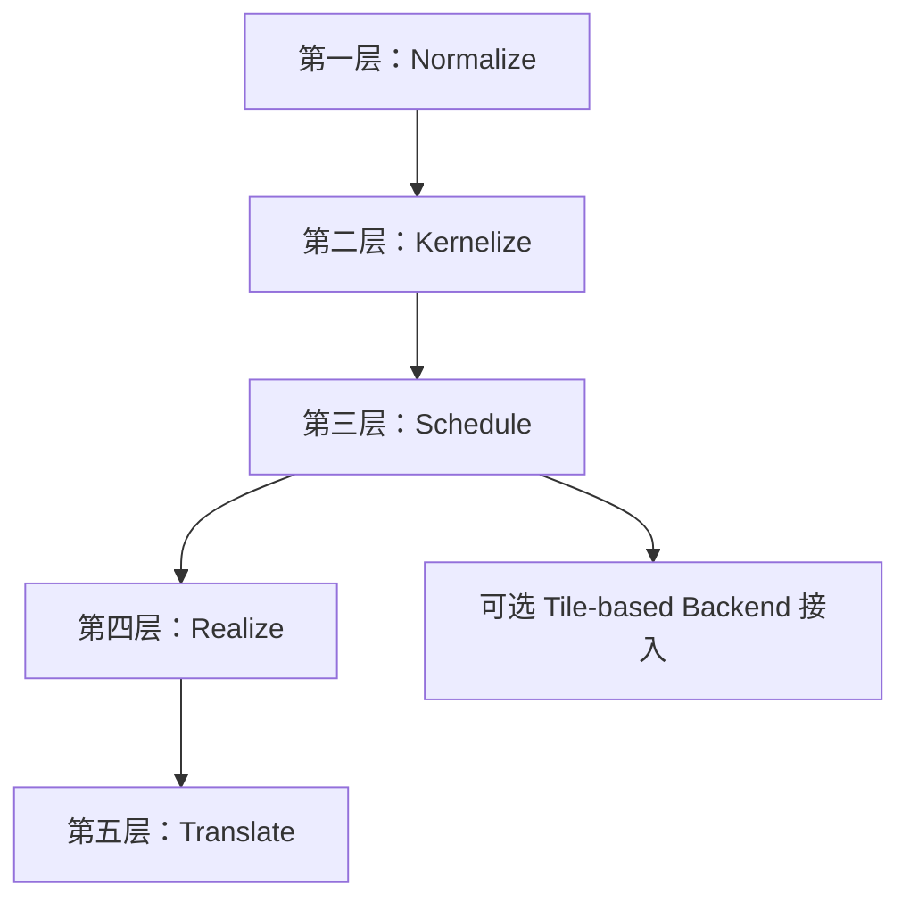
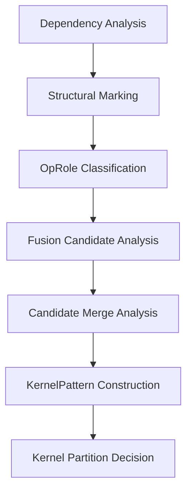
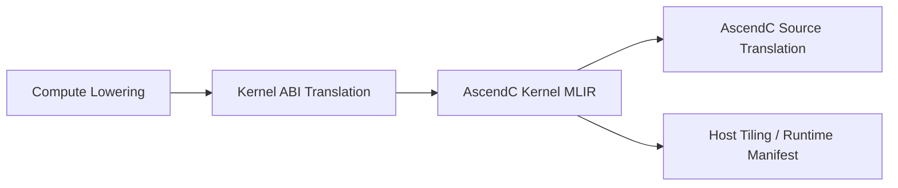

# Ascend NPU MLIR 编译器详细实现 V2

## 1. 整体五层架构

本节只定义实现蓝图的总分层与层间边界。五层主线可以概括为：

- `Normalize`：把入口 IR 收敛成统一分析形态
- `Kernelize`：把计算图切成可独立编译的 kernel
- `Schedule`：为每个 kernel 确定调度与结构骨架
- `Realize`：把调度结果落成显式内存实现
- `Translate`：把已实现的 kernel 翻译成 backend 与 runtime 可消费的工件

第 8 章 `Target Hardware Modeling` 不属于独立编译层；它为 `Schedule / Realize / Translate` 提供统一 target 查询模型。



### 1.1 五层定义

| 层 | 主要作用 | 输出编译单元 | 核心对象 |
|---|---|---|---|
| 第一层：Normalize | 统一入口，收敛方言子集、shape/indexing 表达和基础结构 | 方言子集、shape/indexing 表达、基础结构都已收敛到统一入口约定的 module | `Normalized Linalg/Tensor IR` |
| 第二层：Kernelize | 完成依赖分析、role 分类、融合候选分析和 kernel 划分 | kernel 边界、region 归属和主干拓扑已确定，可按 kernel 为单位继续处理的 module | `KernelPattern` |
| 第三层：Schedule | 生成调度问题和调度决策，并通过 structured lowering 固定结构骨架 | 每个 kernel 的调度中心、tile 结构和循环骨架已稳定下来的结构化 module | `ScheduleProblem`、`ScheduleDecisionSet` |
| 第四层：Realize | 把结构化 kernel 落成 buffer、placement 和显式数据搬运路径 | buffer、placement 和显式数据搬运路径都已确定，可直接进入 backend 翻译的 module | `BufferizedKernelIR`、`PlacementPlan`、`StaticMemoryPlan`、`MovementPlan`、`MemoryRealizationPlan` |
| 第五层：Translate | 把已实现的 kernel 翻译成 backend、toolchain 和 runtime 可消费的工件 | 面向 backend、toolchain 和 runtime 的最终工件集合 | `AscendC Kernel MLIR`、`AscendC Source`、`Host Tiling`，以及可选的 `Runtime Manifest` |

表中的“核心对象”不是该层的唯一输出，而是该层新增或固定下来的主边界对象。

| 核心对象 | 定义 |
|---|---|
| `KernelPattern` | 第二层形成的 region 级编译对象，描述哪些 op 被归入同一个 kernel，以及该 kernel 的 anchor、roles、primitives、输入输出边界等信息。 |
| `ScheduleProblem` | 第三层围绕 `KernelPattern` 抽取的调度问题，描述符号化 shape、axes、memory 约束、硬件约束等调度输入。这里的“约束信息”指的是会直接限制 tile、block、unit assignment 或 pipeline 选择的条件，例如并行轴/规约轴划分、broadcast 轴、ranked symbolic shape 中的动态维位置、片上容量上限、是否必须经过某类 memory place、是否同时使用 Cube 和 Vector、以及某些 primitive 带来的结构约束。 |
| `ScheduleDecisionSet` | 第三层生成的调度结果集合，持有当前 kernel 在编译期或运行期保留的一个或多个 `ScheduleDecision`。 |
| `MemoryRealizationPlan` | 第四层形成的稳定 realization 结果，冻结 `resolvedPlacement`、`workspaceLayout`、`resolvedMovements` 以及最终 materialization 结果。 |

### 1.2 实现接口最小集合

| 层 | 核心类/接口 | 输入 | 输出 |
|---|---|---|---|
| 第一层：Normalize | `EntryNormalizer` | 入口 `func/module` | `Normalized Linalg/Tensor IR` |
| 第二层：Kernelize | `DependencyAnalyzer`、`StructuralMarker`、`OpRoleClassifier`、`FusionCandidateAnalyzer`、`KernelPatternBuilder`、`KernelPartitioner` | `Normalized Linalg/Tensor IR` | `KernelPattern[]` |
| 第三层：Schedule | `AxisCoalescer`、`ScheduleProblemBuilder`、`TemplateRegistry`、`ScheduleSearch`、`StructuredLoweringDriver` | `KernelPattern[]` | `ScheduleDecisionSet[]` 与结构化 module |
| 第四层：Realize | `BufferizationDriver`、`PlacementPlanner`、`StaticMemoryPlanner`、`MovementPlanner`、`MemoryRealizationDriver` | 结构化 module、`ScheduleDecisionSet[]` | `MemoryRealizationPlan[]` 与 `Memory-Realized IR` |
| 第五层：Translate | `ComputeLoweringDriver`、`BackendABILoweringDriver`、`AscendCSourceEmitter`、`HostTilingEmitter`、`RuntimeManifestBuilder` | `Memory-Realized IR`、`MemoryRealizationPlan[]`、`ScheduleDecisionSet[]` | `AscendC Kernel MLIR`、`AscendC Source`、`Host Tiling`，以及可选的 `Runtime Manifest` |

这些类名是实现基线。后续补充细节时，默认围绕这组接口展开。

### 1.3 社区源码边界

当前实现方案默认不修改 MLIR upstream 社区源码。

统一约束：

- 社区 dialect、interface、analysis、pass 只复用，不直接修改
- 对社区 op 的语义补充优先通过：
  - external model
  - 独立 pass
  - 本地 wrapper analysis
  - 独立 dialect / 本地对象
- 若某步需要接入社区基础设施，例如 `One-Shot Bufferize`，优先通过本地扩展接入，不改社区实现本体

## 2. 第一层：Normalize

第一层的任务是把上层 lowering 后的 IR 收敛成第二层可稳定分析的统一入口。


### 2.1 输入、输出与附加结果

| 项 | 内容 |
|---|---|
| 输入 | 上层 lowering 后的结构化 module；合法入口方言仅限 `func`、`tensor`、`linalg`、`arith`、`math` |
| 输出 | 满足统一入口约定的规范化 module |
| 主边界对象 | `Normalized Linalg/Tensor IR` |
| 附加结果 | `gather_dim` / `embedding_dim` 一类结构标记、入口 diagnostics |

### 2.2 语义收敛表

| 语义 | 第一层输出形态 | 示例 |
|---|---|---|
| matmul | 具名 `linalg` op，优先保留 `linalg.matmul` 等标准结构化形式 | `matmul` |
| elementwise | 可识别 indexing map 的 `linalg.generic` | `add`、`relu` |
| reduce | 带 reduction iterator 的 `linalg.generic` 或命名 `linalg` op | `sum`、`max` |
| reshape | `tensor.expand_shape` / `tensor.collapse_shape` / `tensor.reshape` | `view`、`reshape` |
| cast | 具名 cast 或 body 可识别的 `linalg.generic` | `f16 -> f32` |
| compare / select | `arith.cmp*` + `select`，或可识别 body 的 `linalg.generic` | `where`、比较选择 |
| gather / index_select | 带 `tensor.extract` 的 `linalg.generic`，并带 `gather_dim` 或 `embedding_dim` | `index_select(dim=1)` |
| broadcast | 显式 indexing/broadcast 关系 | 列广播、行广播 |
| transpose | permutation 明确的 indexing map | `transpose` |
| split/slice | `tensor.extract_slice` / `tensor.insert_slice` | `split` |
| concat | `tensor.concat` 或等价 slice/insert 组合 | `concat` |
| shape 查询 | `tensor.dim` + `arith` | 维度读取与计算 |

### 2.3 入口收敛规则

| 处理项 | 规则 |
|---|---|
| 命名 op 保留 | 对 `matmul` 等已具备稳定结构语义的命名 `linalg` op，优先保留命名形式，不退化成通用 `linalg.generic` |
| 属性清洗 | 只保留后续明确消费的属性；其余前端私有属性默认删除；无法判断是否有用时打印 warning |
| shape 收敛 | 只允许 ranked symbolic shape；维度可以是常量或符号；rank 必须已知且在入口中不变化 |
| indexing 收敛 | broadcast 必须落成 indexing map；transpose 必须落成 permutation indexing map；split/slice 必须落成 `tensor.extract_slice` / `tensor.insert_slice`；concat 必须落成 `tensor.concat` 或等价 slice/insert 组合；gather 必须落成 `linalg.generic + tensor.extract + gather_dim/embedding_dim` |
| gather 收敛 | 当前不引入独立 gather op；统一成可识别的 `linalg.generic + tensor.extract` 形态，并由 `mark-structured-ops` 在进入第二层前打上 `gather_dim` 或 `embedding_dim` |
| canonicalize | 仅允许局部 canonicalize / cse；不得跨 op 语义边界重写，不得引入新控制流，不得改变 kernel 候选闭包 |

### 2.4 入口非法条件

| 情况 | 处理 |
|---|---|
| 出现白名单之外的方言 | 报错 |
| unranked tensor | 报错 |
| 无法解释的 shape 语义 | 报错 |
| 具有内存写入、I/O、状态更新或未知副作用的 op 出现在入口 IR 中 | 报错 |
| 同一语义存在多种未收敛表达 | 报错，不让第二层兜底 |

### 2.5 进入第二层前的社区 Pass 约束

在 `Dependency Analysis` 之前，允许执行一小组前置社区 pass 做通用收敛；这些 pass 只能清洗 IR，不能改变第二层将要消费的结构语义。

允许的 pass 类型：

| 类型 | 典型 pass | 约束 |
|---|---|---|
| 局部清洗 | `canonicalize`、`cse` | 只做局部 fold / cse，不跨 op 语义边界 |
| 局部 `tensor` 规范化 | `tensor` 相关 canonicalize/fold | 不改变 ranked symbolic shape 语义 |
| 局部 `linalg` 规范化 | 命名 op / `linalg.generic` 的局部清洗 | 不改变 iterator 语义，不改变 kernel 候选闭包 |
| 局部 `arith/math` 简化 | 常量折叠、表达式简化 | 不引入新控制流，不重写主计算拓扑 |

禁止放在第二层前面的 pass 类型：

| 类型 | 原因 |
|---|---|
| bufferization / memref lowering | 会改变值语义和后续 kernel 形成边界 |
| loop/scf lowering | 会破坏结构化计算图和 region 分析基础 |
| 会重写 `resultShape` / `indexingMaps` / `iteratorTypes` 的大改写 pass | 会让第二层分析对象不稳定 |
| 社区已有 fusion / partition pass，或其他会跨 region 重组计算边界的 pass | 会绕过第二层的 `KernelPattern` 形成逻辑 |

执行规则：

- 前置社区 pass 只允许出现在第一层结束到第二层开始之间
- 这些 pass 运行后，输入仍必须满足第一层的统一入口约束
- 一旦运行了会修改：
  - `resultShape`
  - `indexingMaps`
  - `iteratorTypes`
  - 结构属性
  - region 边界
  的 pass，就必须重新进入第二层分析窗口，不得复用旧分析结果


## 3. 第二层：Kernelize

第二层的任务是把第一层输出的结构化计算图切成可调度的 `KernelPattern`。



### 3.1 输入与输出

| 项 | 内容 |
|---|---|
| 输入 | 第一层输出的规范化结构化 module |
| 输出 | 带 `KernelPattern` 结果的 module |
| 主边界对象 | `KernelPattern` |

### 3.2 第二层直接产物

| 产物 | 含义 |
|---|---|
| `KernelPattern[]` | 最终 kernel 列表 |
| diagnostics | 为什么某些候选被拒绝或拆分 |
| role / primitive 标注结果 | 供第三层继续消费 |

### 3.3 核心类与接口

| 类 / 接口 | 职责 | 输入 | 输出 | 核心方法 |
|---|---|---|---|---|
| `DependencyAnalyzer` | 建立 producer-consumer、op 语义基础索引 | `Normalized Linalg/Tensor IR` | `ProducerConsumerIndex`、`OpSemanticSummary` | `buildProducerConsumerIndex()`、`buildOpSemanticSummary()` |
| `StructuralMarker` | 识别 `gather / branch / merge` 等结构语义并打属性 | `ProducerConsumerIndex`、`OpSemanticSummary`、IR | 带 `gather_dim / embedding_dim / branch_* / merge_*` 属性的 IR | `markGatherLike()`、`markBranchLike()`、`markMergeLike()` |
| `OpRoleClassifier` | 生成稳定的 `OpRoleMap` | `OpSemanticSummary`、结构属性 | `OpRoleMap` | `classify(Operation *)`、`classifyAll()` |
| `FusionCandidateAnalyzer` | 构造单主角色候选 region 并做合法性、收益判断 | `ProducerConsumerIndex`、`OpSemanticSummary`、`OpRoleMap` | `FusionCandidate[]` | `collectSeeds()`、`expandCandidate()`、`evaluateLegality()`、`evaluateProfitability()` |
| `CandidateMergeAnalyzer` | 基于候选邻接索引分析相邻候选是否可合并成复合候选，并生成第二层可判定的调度契约 | `FusionCandidate[]`、`CandidateAdjacencyIndex`、`ProducerConsumerIndex`、`OpSemanticSummary` | `MergedCandidate[]` | `buildAdjacencyIndex()`、`collectMergePairs()`、`buildScheduleContract()`、`evaluateMergeLegality()`、`evaluateMergeProfitability()` |
| `KernelPatternBuilder` | 把候选收敛成 `KernelPatternCandidate[]` 并构造 `KernelPatternGraph` | `FusionCandidate[]`、`MergedCandidate[]` | `KernelPatternCandidate[]`、`KernelPatternGraph` | `buildKernelPatternCandidate()`、`buildKernelPatternGraph()` |
| `KernelPartitioner` | 在 `KernelPatternGraph` 上解决重叠候选并输出最终 `KernelPattern[]` | `KernelPatternCandidate[]`、`KernelPatternGraph` | `KernelPattern[]` | `buildSelectionUnits()`、`resolveOverlap()`、`selectFinalPatterns()` |

### 3.4 Dependency Analysis（依赖分析）

#### 3.4.1 功能介绍

依赖分析任务是为第二层后续步骤准备统一的分析结果。  
后续的 `OpRole` 分类、候选扩展和 `KernelPattern` 划分，都只消费这里产出的结果，不再反复扫 IR。

#### 3.4.2 输出介绍

| 分析结果 | 内容 | 后续用途 |
|---|---|---|
| `ProducerConsumerIndex` | `op -> producers/consumers` 映射 | `OpRole` 分类、候选扩展、kernel 划分 |
| `OpSemanticSummary` | 每个 op 的 shape、indexing、iterator、语义属性摘要 | primitive 判定、shape/indexing 合法性检查 |

`ProducerConsumerIndex` 字段：

| 字段 | 类型 | 含义 |
|---|---|---|
| `producers[op]` | `DenseMap<Operation *, SmallVector<Operation *>>` | 直接产生当前 op 输入的 op 集合 |
| `consumers[op]` | `DenseMap<Operation *, SmallVector<Operation *>>` | 直接消费当前 op 结果的 op 集合 |

`OpSemanticSummary` 字段：

| 字段 | 类型 | 含义 |
|---|---|---|
| `resultShape` | `SmallVector<DimExpr>` | 结果张量的 ranked symbolic shape |
| `indexingMaps` | `SmallVector<AffineMap>` | 输入输出 indexing map |
| `iteratorTypes` | `SmallVector<utils::IteratorType>` | 并行轴 / reduction 轴信息 |
| `accessPatternKind` | `AccessPatternKind` | `Elementwise`、`Reduction`、`LayoutTransform`、`Indexing` 等访问模式 |
| `semanticAttrs` | `DictionaryAttr` | 可由单 op 直接提取或由第一层透传的基础语义属性；`branch_*` / `merge_*` 等跨 op 结构属性由 `Structural Marking` 单独产出 |

#### 3.4.3 实现原理与方案

实现顺序：

1. 全局预建 `ProducerConsumerIndex`
2. 全局预建 `OpSemanticSummary`

`ProducerConsumerIndex` 的构建规则：

- 遍历进入第二层分析范围的 op
- 若某个 operand 来自另一个分析范围内的 op 结果，则建立直接 producer-consumer 边
- 只记录直接依赖，不计算间接依赖

`OpSemanticSummary` 的构建规则：

- 语义来源于自定义 `OpInterface`
- 对 `linalg.matmul`、`linalg.generic`、`tensor.extract_slice`、`tensor.concat` 等现有 op，使用 external model 挂接 interface
- `OpSemanticSummary` 只缓存第二层直接消费的摘要，不保存完整推导过程
- 这里只做单 op 语义摘要，不负责跨 op 的 `Branch` / `Merge` 结构识别
- 第二层内全局只构建一次；后续任务只读，不重复推导

#### 3.4.4 案例演示

主案例 A：`matmul -> add -> leakyrelu`

`ProducerConsumerIndex`：

| op | producers | consumers |
|---|---|---|
| `matmul` | 空 | `add` |
| `add` | `matmul`、`bias` | `leakyrelu` |
| `leakyrelu` | `add` | 空 |

对应 `OpSemanticSummary`：

| op | resultShape | iteratorTypes | accessPatternKind | semanticAttrs |
|---|---|---|---|---|
| `matmul` | `[M, N]` | `[parallel, parallel, reduction]` | `Unknown` | 空 |
| `add` | `[M, N]` | `[parallel, parallel]` | `Elementwise` | 空 |
| `leakyrelu` | `[M, N]` | `[parallel, parallel]` | `Elementwise` | 空 |

主案例 B：`broadcast + add + reduce`

| op | resultShape | iteratorTypes | accessPatternKind | semanticAttrs |
|---|---|---|---|---|
| `broadcast` | `[M, N]` | `[parallel, parallel]` | `Elementwise` | `broadcast_axis = N` |
| `add` | `[M, N]` | `[parallel, parallel]` | `Elementwise` | 空 |
| `reduce` | `[N]` | `[reduction, parallel]` | `Reduction` | `reduction_axis = M` |

主案例 C：`gather + add`

| op | resultShape | iteratorTypes | accessPatternKind | semanticAttrs |
|---|---|---|---|---|
| `gather` | `[B, K]` | `[parallel, parallel]` | `Indexing` | `gather_dim = 1` |
| `add` | `[B, K]` | `[parallel, parallel]` | `Elementwise` | 空 |

### 3.5 Structural Marking（结构标记）

#### 3.5.1 功能介绍

`Structural Marking` 的任务是识别结构语义并打上统一属性。  
后续的 `OpRole` 分类、候选扩展和 kernel 划分直接消费这些属性，不再重复做结构识别。

#### 3.5.2 输出介绍

| 输出结果 | 内容 | 后续用途 |
|---|---|---|
| 结构属性 | `gather_dim`、`embedding_dim`、`branch_*`、`merge_*` 等 | `OpRole` 分类、primitive 判定、kernel 划分 |

最小结构属性集合：

| 属性 | 含义 |
|---|---|
| `gather_dim` | gather 访问的动态轴 |
| `embedding_dim` | embedding 访问的动态轴 |
| `branch_root` | 该 op 所属分叉结构的根标识 |
| `branch_group` | 同一分叉结构内的支路分组标识 |
| `branch_source` | 该分叉结构的公共源值标识 |
| `merge_root` | 该 op 所属汇合结构的根标识 |
| `merge_group` | 同一汇合结构内的支路分组标识 |

#### 3.5.3 实现原理与方案

实现顺序：

1. 基于依赖分析结果识别 `Indexing`、`Branch`、`Merge` 结构
2. 在对应 op 上写入结构属性
3. 后续步骤只消费结构属性，不再重复识别

结构识别规则：

| 结构 | 识别条件 |
|---|---|
| `gather` | `linalg.generic` 的 body 含 `tensor.extract`，动态索引轴满足 gather 规则 |
| `Branch` | 以某个 SSA 值 `v` 为 `branch_source`。从 `v` 出发，只沿纯 `Injective / SliceLike / LayoutTransform` 链向后搜索；若存在两个及以上彼此 op 集不重叠的最早分支入口 `entry_i`，且这些入口都直接或间接消费 `v`，则形成一个 `branch_root`。同一入口可继续向后扩展，但在遇到非允许穿越的 `Reduction / Anchor / Indexing / side-effect` op 时停止 |
| `Merge` | 存在一个 op `m`，其两个及以上 operands 分别来自同一 `branch_root` 的不同 `branch_group`，且 `m` 是这些支路在允许穿越链上的第一个共同汇合 op，则 `m` 形成 `merge_root`；若一个候选跨过某个 `branch_root`，则必须同时覆盖该结构要求闭合的 `merge_root`，否则视为部分闭合失败 |

属性编码规则：

- `branch_root` / `merge_root` 使用当前 function 内唯一的结构 ID
- `branch_group` / `merge_group` 使用同一结构下的连续支路编号
- `branch_source` 记录公共源值的稳定引用
- `branch_group` 只写在该支路入口及其允许穿越链上；一旦穿过 `Reduction / Anchor / Indexing` 或已到达 `merge_root`，不得继续传播
- `merge_group` 记录该 operand 所归属的上游 `branch_group`，用于后续闭包检查与图约束生成

#### 3.5.4 案例演示

主案例 A：`index_select(dim=1) -> add`

| op | 结构属性 |
|---|---|
| `gather generic` | `gather_dim = 1` |
| `add` | 空 |

主案例 B：`x -> split -> branch0 / branch1 -> concat`

| op | 结构属性 |
|---|---|
| `branch0` 上的 `extract_slice` | `branch_root = B0`，`branch_group = 0`，`branch_source = x` |
| `branch1` 上的 `extract_slice` | `branch_root = B0`，`branch_group = 1`，`branch_source = x` |
| `concat(branch0)` | `merge_root = M0`，`merge_group = 0` |
| `concat(branch1)` | `merge_root = M0`，`merge_group = 1` |

### 3.6 OpRole Classification（OpRole 分类）

#### 3.6.1 功能介绍

`OpRole` 分类的任务是给进入候选分析的关键 op 赋予稳定的 `OpRole`。  
后续的 primitive 判定、候选扩展和 kernel 划分，都直接消费这些角色。

#### 3.6.2 输出介绍

| 输出结果 | 内容 | 后续用途 |
|---|---|---|
| `OpRoleMap` | `op -> role` 或 `op -> roles` 映射 | primitive 判定、候选扩展、kernel 划分 |

标准角色集合：

| 结构化 op / 结构 | role |
|---|---|
| contraction / conv-like 命名 `linalg` op，例如 `linalg.matmul`、`linalg.batch_matmul`、`linalg.matvec`、`linalg.conv_*` | `Anchor` |
| 含 reduction iterator 的 `linalg.generic` 或命名 `linalg` reduce-like op | `Reduction` |
| `Elementwise` generic | `Injective` |
| permutation、rank-reassociation、contiguous slice/concat、bitcast/view-like 且不改变元素数的 layout-sensitive 变换 | `LayoutTransform` |
| 带 `gather_dim` / `embedding_dim`，或可证明存在数据相关地址选择的 irregular read 类 op | `Indexing` |
| `tensor.extract_slice` | `SliceLike` |
| 带 `branch_*` 结构属性的 op | `Branch` |
| 带 `merge_*` 结构属性的 op | `Merge` |

最小结构属性集合：

| 属性 | 含义 |
|---|---|
| `branch_root` | 该 op 所属分叉结构的根标识 |
| `branch_group` | 同一分叉结构内的支路分组标识 |
| `branch_source` | 该分叉结构的公共源值标识 |
| `merge_root` | 该 op 所属汇合结构的根标识 |
| `merge_group` | 同一汇合结构内的支路分组标识 |

#### 3.6.3 实现原理与方案

`OpRole` 分类的语义来源于自定义 `OpInterface`。

 - 对 `linalg.matmul`、`linalg.generic`、`tensor.extract_slice`、`tensor.concat` 等现有 op，通过 external model 挂接 interface
- `OpSemanticSummary` 为分类提供 shape、iterator、indexing 摘要
- 输出 `OpRoleMap`，不直接修改 IR 主体

分类规则：

| 条件 | role |
|---|---|
| 命名 contraction / conv-like `linalg` op | `Anchor` |
| `iteratorTypes` 含 reduction | `Reduction` |
| `accessPatternKind = Elementwise` | `Injective` |
| op 满足下列任一条件：permutation indexing map；`expand/collapse/reshape` 且元素数保持不变；bitcast/view-like；成组 `extract_slice/insert_slice/concat` 可证明只做连续布局重排 | `LayoutTransform` |
| `semanticAttrs` 含 `gather_dim` / `embedding_dim` | `Indexing` |
| `OpInterface` 可证明存在数据相关地址读取，但不引入副作用写回 | `Indexing` |
| op 为 `tensor.extract_slice` | `SliceLike` |
| `semanticAttrs` 含 `branch_*` | `Branch` |
| `semanticAttrs` 含 `merge_*` | `Merge` |

多角色规则：

- `OpRoleMap` 使用 `op -> SmallVector<OpRole>`
- 主角色优先级：`Anchor > Reduction > Indexing > Branch > Merge > LayoutTransform > SliceLike > Injective`
- `OpRoleMap` 必须保留全量角色，不允许只保留主角色
- primitive 判定默认优先读取主角色；若某 primitive 需要辅助角色，必须显式声明读取剩余角色
- 角色系统不要求“一类前端语义只映射到一个 role”。例如 softmax 子结构落成 `Reduction + Injective` 组合，batched matmul / conv-like 落成 `Anchor`，`select` 保持 `Injective`，不规则只读访问落成 `Indexing`
- 当前第一层不接受带副作用的不规则写入；scatter-like 写回若无法归一到纯值语义 op，则不属于本阶段支持范围

#### 3.6.4 案例演示

主案例 A：`matmul + add + leakyrelu`

| op | roles | 主角色 |
|---|---|---|
| `matmul` | `[Anchor]` | `Anchor` |
| `add` | `[Injective]` | `Injective` |
| `leakyrelu` | `[Injective]` | `Injective` |

主案例 B：`broadcast + add + reduce`

| op | roles | 主角色 |
|---|---|---|
| `broadcast` | `[Injective]` | `Injective` |
| `add` | `[Injective]` | `Injective` |
| `reduce` | `[Reduction]` | `Reduction` |

主案例 C：`gather + add`

| op | roles | 主角色 |
|---|---|---|
| `gather` | `[Indexing]` | `Indexing` |
| `add` | `[Injective]` | `Injective` |

主案例 D：`extract_slice` 位于 branch 上

| op | roles | 主角色 |
|---|---|---|
| `extract_slice(branch0)` | `[SliceLike, Branch]` | `Branch` |

主案例 E：`softmax(max/sub/exp/sum/div)` 子结构

| op | roles | 主角色 |
|---|---|---|
| `max_reduce` | `[Reduction]` | `Reduction` |
| `sub` | `[Injective]` | `Injective` |
| `exp` | `[Injective]` | `Injective` |
| `sum_reduce` | `[Reduction]` | `Reduction` |
| `div` | `[Injective]` | `Injective` |

主案例 F：`batch_matmul -> transpose -> add`

| op | roles | 主角色 |
|---|---|---|
| `linalg.batch_matmul` | `[Anchor]` | `Anchor` |
| `transpose` | `[LayoutTransform]` | `LayoutTransform` |
| `add` | `[Injective]` | `Injective` |

### 3.7 Fusion Candidate Analysis（融合候选分析）

#### 3.7.1 功能介绍

融合候选分析的任务是基于依赖分析结果、结构属性和 `OpRole`，构造第一轮可继续保留的单主角色候选 region。  
这一阶段输出的是单主角色候选，不是最终 `KernelPattern`。

#### 3.7.2 输出介绍

| 输出结果 | 内容 | 后续用途 |
|---|---|---|
| `FusionCandidate[]` | 第一轮单主角色候选 region 列表 | `Candidate Merge Analysis`、`KernelPattern` 构造 |

`FusionCandidate` 最小字段：

| 字段 | 含义 |
|---|---|
| `seedOps` | 候选起始种子 |
| `candidateOps` | 当前候选包含的 op 集合 |
| `roles` | 候选中出现的角色集合 |
| `primitives` | 当前候选依赖的 primitive 集合 |
| `closure` | 对应的 `CandidateClosure` |
| `benefitScore` | 候选的轻量收益分数 |

`CandidateClosure` 最小字段：

| 字段 | 类型 | 含义 |
|---|---|---|
| `internalOps` | `SmallVector<Operation *>` | 候选内部 op 集合 |
| `externalInputs` | `SmallVector<Value>` | 从候选外部流入的值 |
| `externalOutputs` | `SmallVector<Value>` | 允许作为候选边界导出的终结值 |
| `escapingValues` | `SmallVector<Value>` | 不允许存在的硬逃逸中间值；若该字段非空则候选一定不闭合 |
| `rematerializableEscapes` | `SmallVector<Value>` | 允许通过 primitive 显式声明的重算规则消解的逃逸值 |
| `isClosed` | `bool` | 是否满足“无硬逃逸，且可重算逃逸、结构边界与 guard 约束都已被当前 primitive 接受”的候选闭包条件 |

#### 3.7.3 实现原理与方案

实现顺序：

1. 各 `FusionPrimitiveRule` 先定义自己的 seed 规则
2. `FusionCandidateAnalyzer` 收集并去重所有 primitive 给出的 seed
3. 按对应 primitive 规则向前后扩展
4. 对扩展后的候选计算 `CandidateClosure`
5. 保留闭包成立、约束成立的单主角色候选

编译复杂度控制：

- 候选只从种子出发扩展，不做全图任意组合枚举
- 先做 role / primitive / shape/indexing 过滤，再算 closure
- 候选分析按局部 region 做，不做全图最优搜索
- 单个 op 命中的 primitive 数必须设上限
- 每个 primitive 的扩展深度、候选 op 数、branch 数、主角色数必须设上限
- 等价 `candidateOps` 必须在候选阶段去重
- 每个局部 region / function 的候选数必须受预算控制

预算配置项：

| 项 | 含义 |
|---|---|
| `maxPrimitivePerOp` | 单个 op 命中的 primitive 数上限 |
| `maxExpansionDepthPerPrimitive` | 单个 primitive 的最大扩展深度 |
| `maxOpsPerCandidate` | 单个候选允许包含的最大 op 数 |
| `maxBranchesPerCandidate` | 单个候选允许包含的最大 branch 数 |
| `maxPrimaryRolesPerCandidate` | 单个候选允许包含的最大主角色数 |
| `localTopKPerPrimaryOpNeighborhood` | 每个主导 op 邻域的局部 `top-k` |
| `candidateBudgetPerFunction` | 每个 function 的候选预算 |

规则：

- 上述预算全部来自编译器配置或 target profile
- 文档不写死常量
- 不同 target / 优化级别可提供不同默认值

三阶段早剪枝：

| 阶段 | 剪枝内容 |
|---|---|
| `seed pruning` | 同一个 op 只保留少量高优先级 primitive，不让 seed 集膨胀 |
| `expansion-time pruning` | 扩展过程中即时检查 role、shape/indexing、局部闭包、模板可承接性，不合法立即停止扩展 |
| `seed pruning`（补充） | 对纯 `Elementwise / InjectiveChain` seed 启用 `Injective` seed suppression：若某个 `Injective` op 已被包含进一个已保留的非 `Injective` 单主角色候选，且该 op 不引入新的外部输出边界，也不带 `Indexing`、`Branch`、`Merge` 等结构语义，则不再以该 op 为 seed 继续扩展；`Anchor`、`Reduction`、`Indexing`、`Branch`、`Merge` 以及带独立外部输出价值的 `Injective` op 不适用该规则 |
| `post-candidate pruning` | 候选形成后执行等价去重、以主导 op 邻域为单位的局部 `top-k`、function 级预算裁剪；未通过第一轮剪枝的候选不得进入 `Candidate Merge Analysis` |

primitive 负责定义三件事：

| 项 | 含义 |
|---|---|
| `seed rule` | 从什么 role / 结构出发构造候选 |
| `expand rule` | 候选如何向前后扩展 |
| `legality/profitability rule` | 候选何时保留、何时丢弃，以及失败原因如何编码 |

`FusionCandidateAnalyzer` 负责：

- 调用各 primitive 收集 seed
- 合并和去重 seed
- 调度 primitive 做候选扩展
- 对候选执行 closure、合法性和收益判断
- 只输出单主角色候选；多主角色复合候选不在这一阶段直接形成
- 对同一候选只做一次评估遍历，同时产出 `CandidateClosure`、legality flags 和 profitability features

`legality` 失败原因最小分类：

| 类别 | 典型原因 |
|---|---|
| `RoleMismatch` | role 组合不符合 primitive 前提 |
| `ShapeProofFailed` | shape 关系、broadcast、reassociation 无法证明 |
| `IndexingBoundaryBroken` | gather/indexing 访问边界在扩展后失真 |
| `BranchMergeIncomplete` | branch/merge 只覆盖了部分结构 |
| `ClosureEscape` | 存在 `escapingValues` |
| `BudgetExceeded` | 超出深度、op 数、branch 数或主角色预算 |
| `TemplateUnavailable` | 当前 role 组合找不到可承接模板 |
| `DynamicGuardExplosion` | 动态 shape 需要的 guard 数超过配置 |
| `MemoryRisk` | 预测片上容量或中间搬运风险过高 |

常见 seed 规则：

| primitive | seed 规则 |
|---|---|
| `ConsumerIntoAnchorEpilogue` | 从 `Anchor` 起始 |
| `ReductionInlining` | 从 `Reduction` 起始 |
| `IndexedFusion` | 从 `Indexing` 起始 |
| `MultiBranch` | 从 `Branch` 或 `Merge` 起始 |
| `InjectiveChain` | 从 `Injective` 起始，构造纯逐元素链候选 |

常见扩展规则：

| primitive | 扩展方式 |
|---|---|
| `ProducerIntoConsumer` | 从 consumer 向前吸收 `Elementwise` producer |
| `ReductionInlining` | 从 `Reduction` 向前吸收可内联的 `Elementwise` / `Broadcast` producer |
| `ConsumerIntoAnchorEpilogue` | 从 `Anchor` 向后吸收 `Elementwise` consumer |
| `IndexedFusion` | 从 `Indexing` 向前后吸收可内联的 `Elementwise` |
| `MultiBranch` | 从 `Branch` 沿各 `branch_group` 向后扩展，必要时在 `Merge` 处闭合 |

`CandidateClosure` 构建规则：

- 输入是当前阶段已经扩展出的 `candidateOps`
- 基于 `ProducerConsumerIndex` 计算：
  - `internalOps`
  - `externalInputs`
  - `externalOutputs`
  - `escapingValues`
  - `rematerializableEscapes`
  - `isClosed`
- `CandidateClosure` 是 `Fusion Candidate Analysis` 的中间结果，不属于 `Dependency Analysis` 输出

判定边界：

- 若某个结果由候选内终结 op 产生，且该结果没有被候选内其他 op 继续消费，则它可以成为 `externalOutputs`
- 若某个结果既被候选内消费，又同时被候选外消费，则它是 `escapingValues`，不是 `externalOutputs`
- 若某个结果由非终结 op 产生但被候选外消费，即使该结果最终也能在候选终结 op 上重算，closure 初算阶段仍先记为 `escapingValues`
- 只有 primitive 显式声明允许 rematerialization，且成本模型通过时，才可在合法性检查里把该值从 `escapingValues` 挪到 `rematerializableEscapes`
- `isClosed = true` 的必要条件是 `escapingValues` 为空，且 `rematerializableEscapes` 未超出重算预算，同时 branch/merge、indexing、dynamic-shape guard 边界都满足当前 primitive 的闭合约束

`CandidateClosure` 计算步骤：

1. `internalOps = candidateOps`
2. 遍历 `candidateOps` 中每个 op 的 operand
3. 若某个 operand 的 defining op 不在 `candidateOps` 内，或该 operand 来自 block argument / function argument，则加入 `externalInputs`
4. 遍历 `candidateOps` 中每个 op 的 result
5. 若某个 result 存在 user 不在 `candidateOps` 内，则先检查该 result 是否仍被 `candidateOps` 内其他 op 消费：
   - 否，则加入 `externalOutputs`
   - 是，则加入 `escapingValues`
6. 对当前 primitive 做附加闭包检查与可重算逃逸重分类：
   - 若某个 `escapingValue` 命中 primitive 的 rematerialization 白名单，且重算代价与重复读写代价比较后收益为正，则将其移入 `rematerializableEscapes`
   - 剩余仍留在 `escapingValues` 的值视为硬逃逸
7. 对当前 primitive 做附加闭包检查：
   - `Branch/Merge` 是否配对完整
   - `Indexing` 结构是否仍保持合法访问边界
   - 动态 shape guard 是否仍可在单候选边界内表达
8. 若 `escapingValues` 为空，且以上检查都通过，则 `isClosed = true`，否则为 `false`

最小伪代码：

```text
computeClosure(candidateOps, depIndex):
  internalOps = candidateOps
  externalInputs = {}
  externalOutputs = {}
  escapingValues = {}
  rematerializableEscapes = {}
  candidateSet = set(candidateOps)

  for op in candidateOps:
    for operand in op.operands:
      producer = operand.getDefiningOp()
      if producer is null or producer not in candidateSet:
        externalInputs.add(operand)

  for op in candidateOps:
    for result in op.results:
      hasInternalUser = false
      hasExternalUser = false
      for user in result.users:
        if user in candidateSet:
          hasInternalUser = true
        else:
          hasExternalUser = true
      if hasExternalUser and hasInternalUser:
        escapingValues.add(result)
      elif hasExternalUser:
        externalOutputs.add(result)

  rematerializableEscapes =
    classifyRematerializableEscapes(candidateOps, escapingValues)
  escapingValues = escapingValues - rematerializableEscapes

  isClosed = checkPrimitiveSpecificClosure(candidateOps,
                                           externalInputs,
                                           externalOutputs,
                                           escapingValues,
                                           rematerializableEscapes)

  return {internalOps,
          externalInputs,
          externalOutputs,
          escapingValues,
          rematerializableEscapes,
          isClosed}
```

过滤条件：

| 条件 | 处理 |
|---|---|
| `CandidateClosure.isClosed = true` | 保留候选 |
| role 组合存在后续模板 | 保留候选 |
| primitive 成立 | 保留候选 |
| shape/indexing 关系可证明 | 保留候选 |
| 候选含多个主导 op | 不在本阶段直接保留，转交 `Candidate Merge Analysis` |

收益模型：

- 核心对象：`FusionProfitabilityModel`
- 输入：
  - `FusionCandidate`
  - `CandidateClosure`
  - role / primitive
  - shape/indexing 摘要
- 输出：
  - `benefitScore`

最小打分项：

- `savedGlobalMemoryTraffic`
- `savedKernelLaunch`
- `coalescingBenefit`
- `operandUtilizationBenefit`
- `tilePropagationBenefit`
- `extraOnChipPressurePenalty`
- `complexStructurePenalty`
- `dynamicShapeUncertaintyPenalty`
- `templateStabilityPenalty`

#### 3.7.4 Candidate Schedule Contract Derivation（单候选调度契约推导）

这一小步仍属于 `Fusion Candidate Analysis`。  
它的任务不是做第三层调度搜索，而是为每个通过闭包和收益检查的单主角色候选，静态生成一个候选级 `scheduleContract`，供 `3.8 Candidate Merge Analysis` 做兼容性检查与契约求交。

输入：

- `FusionCandidate`
- `CandidateClosure`
- `OpRoleMap`
- `OpSemanticSummary`
- primitive 元数据
- 模板族元数据

输出：

| 输出结果 | 内容 | 后续用途 |
|---|---|---|
| `scheduleContract` | 当前单候选可承受的调度边界条件摘要 | `3.8 Candidate Merge Analysis`、`第 4 节 ScheduleProblem` 构造、`第 5 节 Bufferization/Placement` |

`scheduleContract` 最小字段：

| 字段 | 含义 | 推导来源 |
|---|---|---|
| `tileableAxes` | 候选允许后续做 tile 的逻辑轴集合 | 从 role、iteratorTypes、indexing map、primitive 允许的 tile 传播规则推导 |
| `requiredReductionAxes` | 必须保持为 reduction 的轴 | 从 reduction role、reduce op 语义和 primitive 约束推导 |
| `layoutConstraints` | 后续模板和内存实现不能破坏的 layout 条件 | 从 indexing、layout transform、transpose / gather / concat 等结构语义推导 |
| `mustKeepOnChipValues` | 若该候选进入单 kernel，必须片上传递的值 | 从 producer-consumer carried values、primitive 的 on-chip 传播要求推导 |
| `templateFamilies` | 当前候选仍可落入的模板族集合 | 从角色组合、结构语义和模板元数据筛选得到 |
| `dynamicGuardSet` | 当前候选必须承受的动态 shape guard 集 | 从 shape/indexing 证明条件和 primitive guard 要求汇总 |

推导步骤：

1. 从 `CandidateClosure` 与 `OpSemanticSummary` 归一化候选的逻辑轴和 shape/indexing 摘要
2. 根据 role、iteratorTypes 和 primitive 规则，筛出允许继续 tile 的轴，生成 `tileableAxes`
3. 根据 reduction 相关 op 和 primitive 约束，生成 `requiredReductionAxes`
4. 根据 transpose / gather / branch/merge / concat / layout barrier 等结构语义，生成 `layoutConstraints`
5. 根据候选内外 producer-consumer 关系和 primitive 的 on-chip 传播要求，生成 `mustKeepOnChipValues`
6. 根据候选角色组合、结构边界和模板元数据，筛出可承接的 `templateFamilies`
7. 根据动态 shape 证明条件和 primitive guard 约束，汇总 `dynamicGuardSet`
8. 运行 `ScheduleContractVerifier`，确认字段内部无冲突；通过后把 `scheduleContract` 挂到单候选结果上

推导原则：

- `scheduleContract` 是第二层静态可判定的边界条件，不是第三层调度结果
- 这一阶段只生成“允许什么 / 禁止什么”，不提前枚举 tile size、reorder 或 pipeline 组合
- 若某个字段无法稳定推导，则该候选不能进入依赖该字段的合并路径；例如无法确定 `templateFamilies` 时，直接记为不可合并

#### 3.7.5 案例演示

主案例 A：`matmul + add + leakyrelu`

| 项 | 内容 |
|---|---|
| seed primitive | `ConsumerIntoAnchorEpilogue` |
| `seedOps` | `{matmul}` |
| `candidateOps` | `{matmul, add, leakyrelu}` |
| `roles` | `{Anchor, Injective}` |
| `primitives` | `{ConsumerIntoAnchorEpilogue}` |
| `closure.externalInputs` | `{lhs, rhs, bias}` |
| `closure.externalOutputs` | `{out}` |
| `closure.escapingValues` | 空 |
| `closure.rematerializableEscapes` | 空 |
| `closure.isClosed` | `true` |
| `benefitScore` | 正值，保留 |

主案例 B：`broadcast + add + reduce`

| 项 | 内容 |
|---|---|
| seed primitive | `ReductionInlining` |
| `seedOps` | `{reduce}` |
| `candidateOps` | `{broadcast, add, reduce}` |
| `roles` | `{Injective, Reduction}` |
| `primitives` | `{ReductionInlining}` |
| `closure.externalInputs` | `{x, b}` |
| `closure.externalOutputs` | `{y}` |
| `closure.escapingValues` | 空 |
| `closure.rematerializableEscapes` | 空 |
| `closure.isClosed` | `true` |
| `benefitScore` | 正值，保留 |

主案例 C：`gather + add`

| 项 | 内容 |
|---|---|
| seed primitive | `IndexedFusion` |
| `seedOps` | `{gather}` |
| `candidateOps` | `{gather, add}` |
| `roles` | `{Indexing, Injective}` |
| `primitives` | `{IndexedFusion}` |
| `closure.externalInputs` | `{data, indices, bias}` |
| `closure.externalOutputs` | `{out}` |
| `closure.escapingValues` | 空 |
| `closure.rematerializableEscapes` | 空 |
| `closure.isClosed` | `true` |
| `benefitScore` | 正值，保留 |

主案例 D：失败闭包

| 项 | 内容 |
|---|---|
| 图 | `a -> b -> c`，且 `b` 还被 `d` 消费 |
| `candidateOps` | `{a, b, c}` |
| `closure.externalOutputs` | `{c_out}` |
| `closure.escapingValues` | `{b_out}` |
| `closure.rematerializableEscapes` | 空 |
| `closure.isClosed` | `false` |
| 处理 | 候选被裁掉 |

主案例 E：多主角色复合候选的第一轮结果

| 项 | 内容 |
|---|---|
| 图 | `matmul + elewise + reduce + elewise` |
| 第一轮 seeds | `{matmul}`、`{reduce}` |
| 第一轮结果 | 两个单主角色候选 |
| 后续处理 | 进入 `Candidate Merge Analysis` |

主案例 F：共享中间值可 rematerialization

| 项 | 内容 |
|---|---|
| 图 | `x -> exp -> y0 = add(exp, b0)` 且 `y1 = mul(exp, b1)` |
| `candidateOps` | `{exp, add}` |
| 初算闭包 | `exp_out` 被 `mul` 额外消费，先记入 `escapingValues` |
| 重分类后 | 若 primitive 声明 `exp` 可低成本 rematerialize，则把 `exp_out` 移入 `rematerializableEscapes` |
| 闭包结论 | 仅当 `escapingValues` 清空、`rematerializableEscapes` 未超预算且收益仍为正时，`isClosed = true` |

主案例 G：`transpose + reduce` 交织

| 项 | 内容 |
|---|---|
| 图 | `batch_matmul -> transpose -> reduce` |
| 风险 | `LayoutTransform` 改变了可共享 tile 轴 |
| 处理 | 若 `transpose` 后 reduction 轴无法映射到同一 tile 契约，则候选保留到单主角色阶段，不在本阶段越级合并 |

### 3.8 Candidate Merge Analysis（候选合并分析）

#### 3.8.1 功能介绍

候选合并分析任务是基于第一轮单主角色候选，判断相邻 candidate 是否值得合并成复合候选。  
这一阶段是多主角色复合候选进入系统的唯一入口。

#### 3.8.2 输出介绍

| 输出结果 | 内容 | 后续用途 |
|---|---|---|
| `MergedCandidate[]` | 通过相邻 candidate 合并形成的复合候选 | `KernelPattern` 构造 |

`MergedCandidate` 最小字段：

| 字段 | 含义 |
|---|---|
| `sourceCandidates` | 参与合并的原始候选 |
| `candidateOps` | 合并后的 op 集合 |
| `primaryOps` | 合并后的主导 op 集合 |
| `closure` | 合并后重新计算的 `CandidateClosure` |
| `scheduleContract` | 第二层可判定的统一调度契约摘要 |
| `benefitScore` | 合并后的轻量收益分数 |

#### 3.8.3 实现原理与方案

实现顺序：

1. 基于第一轮候选一次性构建 `CandidateAdjacencyIndex`
2. 对每组候选重新计算 `CandidateClosure`
3. 读取各单候选已生成的 `scheduleContract`，检查是否满足统一调度契约和统一收益条件
4. 保留通过检查的复合候选

实现约束：

- `CandidateMergeAnalyzer` 只能基于第一轮候选的局部邻接索引工作
- `CandidateAdjacencyIndex` 是 `Candidate Merge Analysis` 的内部对象，不等价于 3.9 的 `KernelPatternGraph`
- 不允许在 3.8 依赖 3.9 之后才产生的对象

“相邻 candidate” 定义：

- 在 `CandidateAdjacencyIndex` 上存在一跳边
- 边上至少有一个 `carriedValue`
- 不允许跨两跳及以上候选直接尝试合并

`CandidateAdjacencyIndex` 最小字段：

| 字段 | 含义 |
|---|---|
| `preds/succs` | 单主角色候选之间的一跳前驱/后继 |
| `carriedValues` | 候选间直接传递的 SSA 值 |
| `sharedOps` | 两候选是否存在重叠 op |

单候选 `scheduleContract` 到复合候选 `scheduleContract` 的收敛规则：

| 契约字段 | 含义 |
|---|---|
| `tileableAxes` | 候选可切 tile 的逻辑轴集合 |
| `requiredReductionAxes` | 必须保持为 reduction 的轴 |
| `layoutConstraints` | 不能被后续模板打破的 layout 条件 |
| `mustKeepOnChipValues` | 若合并成立，必须片上传递的 carried values |
| `templateFamilies` | 当前候选可落入的模板族集合 |
| `dynamicGuardSet` | 合并后必须共同承受的动态 shape guard 集 |

说明：

- 每个单主角色候选的 `scheduleContract` 在 `3.7.4 Candidate Schedule Contract Derivation` 已生成
- `3.8` 不重新从零构造 contract，而是只对相邻候选的 contract 做兼容性检查和交集收敛
- 第二层只检查“契约交集是否非空”，不在这里提前运行第三层调度搜索
- 若契约交集为空，则明确记为 `TileContractUnavailable` 或 `TemplateFamilyDisjoint`

合并条件：

| 检查项 | 通过条件 | 失败后处理 |
|---|---|---|
| 主导 op 可选 | 能唯一选出主导 op | 不合并 |
| tile 契约兼容 | 两候选 `tileableAxes / requiredReductionAxes / layoutConstraints` 存在非空交集 | 不合并 |
| 中间结果可片上传递 | 不需要完整写回 GM 再继续 | 不合并 |
| 动态 guard 可合并 | 合并后 guard 集可在单 kernel 内表达且未超预算 | 不合并 |
| 合并收益为正 | 减少 GM 往返或 kernel launch | 不合并 |
| 模板可承接 | 存在单 kernel 模板可继续 lowering | 不合并 |

#### 3.8.4 案例演示

主案例：`matmul + elewise + reduce + elewise`

| 项 | 内容 |
|---|---|
| `sourceCandidates` | `C0 = {matmul, add}`，`C1 = {reduce, relu}` |
| 相邻性 | `C0 -> C1` 存在一跳 carried-value 依赖 |
| `candidateOps` | `{matmul, add, reduce, relu}` |
| `primaryOps` | `{matmul, reduce}` |
| `closure` | 重新计算合并后边界 |
| `scheduleContract` | 共享的 tile 轴、layout 约束、模板族交集 |
| 合并检查 | 主导 op、tile 契约、片上传递、动态 guard、收益、模板可承接 |
| 结果 A | 通过：生成一个 `MergedCandidate` |
| 结果 B | 失败：保留 `C0`、`C1` 两个独立候选 |

主案例 B：两候选合并后 tile 不兼容

| 项 | 内容 |
|---|---|
| 图 | `C0 = batch_matmul -> transpose`，`C1 = row_reduce -> add` |
| 冲突 | `C0` 只能沿 `[M, N]` 共享 tile，`C1` 要求沿转置后的 `[N]` 做 reduction |
| 结果 | `scheduleContract` 交集为空，记 `TileContractUnavailable`，禁止合并 |

### 3.9 KernelPattern Candidate & Graph Construction（KernelPattern 候选与依赖图构造）

#### 3.9.1 功能介绍

这一阶段把通过筛选的候选统一收敛成 `KernelPatternCandidate[]`，并同步构造 candidate 级依赖图。  
后续的 `Kernel Partition Decision` 只消费这两个对象，不再回看原始候选集合。

#### 3.9.2 输出介绍

| 输出结果 | 内容 | 后续用途 |
|---|---|---|
| `KernelPatternCandidate[]` | 已构造但尚未完成全局选优的 kernel 候选列表 | `Kernel` 划分决策 |
| `KernelPatternGraph` | candidate 级依赖、覆盖和重叠关系图 | `Kernel` 划分决策 |

`KernelPatternCandidate` 最小字段：

| 字段 | 含义 |
|---|---|
| `primaryOps` | 该 kernel 的主导 op 或主导 op 集合 |
| `internalOps` | 被划入同一个 kernel 的 op |
| `externalInputs` | 该 kernel 的输入边界 |
| `externalOutputs` | 该 kernel 的输出边界 |
| `roles` | 该 kernel 内出现的角色集合 |
| `primitives` | 该 kernel 依赖的 primitive 集合 |

`KernelPatternGraph` 最小字段：

| 字段 | 含义 |
|---|---|
| `nodes` | `KernelPatternCandidate[]` |
| `edges` | candidate 之间的带类型边集合 |
| `coveringMap` | `op -> coveringCandidates` |
| `overlapMap` | `candidate -> overlappingCandidates` |
| `preds/succs` | candidate 级前驱/后继关系 |
| `constraintGroups` | `must-co-locate / must-separate / branch-merge-paired` 等硬约束集合 |

边类型最小集合：

| 边类型 | 含义 |
|---|---|
| `CarriedValue` | 存在 SSA 值从上游 candidate 传到下游 candidate |
| `Overlap` | 两 candidate 覆盖了同一 op |
| `BranchPair` | 两 candidate 分别覆盖同一 `branch_root` 的不同支路 |
| `MergePair` | candidate 与某个 `merge_root` 存在闭合配对关系 |
| `MustCoLocate` | 若选其一则必须成组同选，否则结构失真 |
| `MustSeparate` | 两 candidate 不能同时落入同一最终 kernel |
| `ScheduleBarrier` | 存在 layout / memory / dynamic guard 屏障，禁止跨边继续合并 |

#### 3.9.3 实现原理与方案

构造顺序：

1. 读取保留下来的 `FusionCandidate[]` 和 `MergedCandidate[]`
2. 复制候选中的 `candidateOps`、`roles`、`primitives`
3. 读取 `CandidateClosure`，确定 `externalInputs` 和 `externalOutputs`
4. 输出 `KernelPatternCandidate[]`
5. 以 `KernelPatternCandidate[]` 为节点构造 `KernelPatternGraph`
6. 若 `candidateB.externalInputs` 中某个值由 `candidateA.internalOps` 产生，则建立 `candidateA -> candidateB` 边
7. 同步建立：
   - `coveringMap`
   - `overlapMap`
   - `preds/succs`
   - `constraintGroups`
8. 若候选间存在 branch/merge 配对、must-co-locate、must-separate、schedule barrier 等硬约束，则写成显式边或约束组，不允许只靠 score 隐含表达

实现约束：

- `coveringMap` 和 `overlapMap` 必须在同一轮 candidate 遍历中构建
- 每个 candidate 必须生成稳定 `candidateId` 和 `fingerprint`
- 去重、merge、partition 全程基于 `candidateId/fingerprint` 索引，不反复比较完整 op 集

构造条件：

| 条件 | 处理 |
|---|---|
| `closure.isClosed = true` | 允许构造 `KernelPattern` |
| 角色组合存在后续模板 | 允许构造 `KernelPattern` |
| source candidate 已通过所属阶段前置检查 | 允许构造 `KernelPattern` |

#### 3.9.4 案例演示

主案例：三个候选构图

已保留候选：

| candidateId | primaryOps | internalOps | externalInputs | externalOutputs | roles | primitives |
|---|---|---|---|---|---|---|
| `KP0` | `{matmul}` | `{matmul, add, leakyrelu}` | `{lhs, rhs, bias}` | `{v0}` | `{Anchor, Injective}` | `{ConsumerIntoAnchorEpilogue}` |
| `KP1` | `{reduce}` | `{broadcast, add, reduce}` | `{x, b}` | `{v1}` | `{Injective, Reduction}` | `{ReductionInlining}` |
| `KP2` | `{gather}` | `{gather, add}` | `{data, indices, bias}` | `{v2}` | `{Indexing, Injective}` | `{IndexedFusion}` |

`KernelPatternGraph`：

| 字段 | 示例 |
|---|---|
| `nodes` | `{KP0, KP1, KP2}` |
| `edges` | `KP0 -> KP1 (carriedValues={v0})` |
| `constraintGroups` | `MustSeparate(KP1, KP2)` |
| `coveringMap` | `add_op_0 -> {KP0}`，`add_op_1 -> {KP1, KP2}` |
| `overlapMap` | `KP1 <-> KP2` |
| `preds/succs` | `preds[KP1]={KP0}`，`succs[KP0]={KP1}` |

### 3.10 Kernel Partition Decision（Kernel 划分决策）

#### 3.10.1 功能介绍

`Kernel` 划分决策任务是从重叠候选中选出最终保留的 `KernelPattern[]`。  
这一阶段负责解决“同一个 op 可属于多个候选”以及“多主角色复合候选是否拆分”的问题。

#### 3.10.2 输出介绍

| 输出结果 | 内容 | 后续用途 |
|---|---|---|
| 最终 `KernelPattern[]` | 第二层最终保留的 kernel 列表 | 第三层调度与结构规划 |

#### 3.10.3 实现原理与方案

划分决策输入：

- `KernelPatternCandidate[]`
- `KernelPatternGraph`
- role、primitive、shape/indexing、memory/hardware 约束

划分决策目标：

- 输出一组无重叠、全覆盖、依赖可恢复的最终 `KernelPattern[]`
- 不做全图最优搜索
- 采用局部候选集上的受约束启发式选择

需要维护两类关系：

| 关系 | 含义 |
|---|---|
| `op -> coveringCandidates` | 某个 op 被哪些候选覆盖 |
| `candidate -> overlappingCandidates` | 某个候选与哪些候选重叠 |

“局部连通子图” 定义：

- 先用 `MustCoLocate` 收缩 `KernelPatternCandidate`，形成 `selection unit`
- 再在 unit 级图上，使用 `CarriedValue / Overlap / BranchPair / MergePair / MustSeparate / ScheduleBarrier` 边求弱连通分量
- 节点为 `selection unit`
- 任意共享 op、互斥、配对或屏障关系必须落入同一局部选择子图
- `KernelPartitionDecision` 只在单个 unit 级弱连通分量内独立执行；不同分量之间不存在重叠或硬冲突

`selection unit` 定义：

- 由 `MustCoLocate` 闭包收缩得到的最小不可拆选择对象
- unit 内候选要么全选，要么全不选
- 每个 unit 必须生成稳定 `unitId`

选择算法：

1. 先用 `MustCoLocate` 收缩成 `selection unit`；若某个 unit 内部同时出现 `MustSeparate`，立即报约束冲突错误
2. 再按局部连通子图收集 unit
3. 在每个局部连通子图内，按 unit 级 DAG 的拓扑顺序处理 `selection unit`
4. 对每个 `selection unit` 先做硬约束过滤：
   - branch/merge 必须完整闭合
   - `Indexing` 边界不得被 overlap 消解破坏
   - unit 内所有多主角色复合候选都必须满足各自 `scheduleContract`
   - `ScheduleBarrier` 不能被跨越
5. 为每个 `selection unit` 计算轻量分数：
   - `savedGlobalMemoryTraffic`
   - `savedKernelLaunch`
   - `onChipReuseBenefit`
   - `coalescingBenefit`
   - `operandUtilizationBenefit`
   - `tilePropagationBenefit`
   - `extraOnChipPressurePenalty`
   - `complexStructurePenalty`
   - `dynamicShapeUncertaintyPenalty`
   - `templateRiskPenalty`
   - 固定权重由 target 配置给出，不允许运行时随机生成
6. 每轮选择当前分数最高、且不与已选集合冲突的 `selection unit`
7. 若多个 unit 并列，则按以下稳定顺序打破并列：
   - 覆盖 op 数更多
   - 满足更多 `BranchPair / MergePair / MustCoLocate` 约束
   - 包含的最高主角色优先级更高
   - `unitId` 更小
8. 选中后移除与之重叠、或被 `MustSeparate` 排斥的 unit
9. 重复直到没有可继续保留的 unit
10. 对未被任何已选 unit 覆盖的 op，自动补 `FallbackSingleOpPattern`

实现约束：

- `KernelPatternGraph` 构建完成后，需一次性缓存：
  - unit-level weakly connected components
  - unit-level topo order
- `KernelPartitionDecision` 直接消费这些缓存结果，不重复建图

最终结果必须满足：

| 条件 | 要求 |
|---|---|
| 无重叠 | 每个 op 最终只属于一个 `KernelPattern` |
| 全覆盖 | 所有需要编译的 op 最终都属于某个 `KernelPattern` |
| 依赖可恢复 | 最终 `KernelPattern[]` 之间仍组成完整 DAG |
| 模板可承接 | 每个 pattern 都存在后续 `scheduleTemplate` |
| 强约束不破坏 | `BranchPair / MergePair / MustCoLocate / MustSeparate / ScheduleBarrier` 全部满足 |

`FallbackSingleOpPattern` 契约：

- 不是“任意 op 永远兜底”的弱承诺，而是第二层覆盖性成立所依赖的显式模板契约
- 第一层允许进入第二层的每类 op，必须在 `TemplateRegistry` 中存在一个单 op 模板族，或在更早阶段直接报“不支持”
- `FallbackSingleOpPattern` 只覆盖一个主 op 及其必要 shape 计算，不跨 op 融合，不吞并邻接 branch/merge 结构
- 它必须保留原 op 的 `externalInputs` / `externalOutputs` 边界，并生成唯一可追踪的 `primaryOps`
- 若某个未覆盖 op 找不到合法 `FallbackSingleOpPattern`，则第二层不得宣称“全覆盖”，而应直接报编译错误

#### 3.10.4 案例演示

主案例：从 `{KP0, KP1, KP2}` 中选择完整图

| candidate | score | overlap | 处理 |
|---|---|---|---|
| `KP0` | 高 | 无 | 先选中 |
| `KP1` | 中 | 与 `KP2` 重叠 | 进入并列比较 |
| `KP2` | 低 | 与 `KP1` 重叠 | 被 `KP1` 压过 |

选择过程：

1. 在局部连通子图 `{KP0, KP1, KP2}` 内处理
2. 若 `KP1` 与 `KP2` 被 `MustSeparate` 约束，则它们不能同选
3. 先选 `KP0`
4. 比较 `KP1` 和 `KP2`
5. `KP1` 分数更高，且模板可承接，选中 `KP1`
6. 删除与 `KP1` 重叠或被其排斥的 `KP2`
7. 对未覆盖 op 检查是否需要补 `FallbackSingleOpPattern`

最终结果：

| 输出 `KernelPattern[]` | 内容 |
|---|---|
| `P0` | 来自 `KP0` |
| `P1` | 来自 `KP1` |
| `P2` | 对未覆盖 op 自动补的单 op pattern（若存在） |

满足：

- 无重叠
- 全覆盖
- 依赖可恢复
- 每个 pattern 都有后续 `scheduleTemplate`

主案例 B：branch 部分闭合失败

| 项 | 内容 |
|---|---|
| 候选 | `KPb0` 只覆盖 `branch_group = 0`，未覆盖同一 `branch_root` 的 `branch_group = 1` 和对应 `merge_root` |
| 图约束 | `KPb0` 带 `BranchPair` 与 `MergePair` |
| 结果 | 在硬约束过滤阶段直接淘汰，贪心选择不得把它当作可选解 |

主案例 C：动态 shape 参与 merge

| 项 | 内容 |
|---|---|
| 候选 | `C0 = reshape(dynamic M) -> add`，`C1 = reduce(dynamic M)` |
| 风险 | 合并后 guard 需要同时覆盖 reshape 合法性和 reduction 上界 |
| 结果 | 若 `dynamicGuardSet` 超预算，则不合并；两个候选分别保留 |

主案例 D：共享中间值 rematerialization 与 overlap 消解

| 项 | 内容 |
|---|---|
| 候选 | `KPx = {exp, add}`，`KPy = {exp, mul}` |
| 风险 | 若先选 `KPx`，`KPy` 被 overlap 移除，可能造成另一条支路缺失 |
| 结果 | 只有当 `mul` 支路仍能通过独立候选或 fallback 覆盖时，才允许淘汰 `KPy`；否则需优先保留完整覆盖解 |

第三层不会重新决定 kernel 边界，而是直接围绕这些 `KernelPattern` 生成 `ScheduleProblem` 和 `ScheduleDecisionSet`。

第二层 verifier：

| verifier | 检查内容 |
|---|---|
| `KernelPatternVerifier` | 最终 `KernelPattern[]` 无重叠冲突，边界闭合，`roles/primitives` 与候选分析结果一致 |


## 4. 第三层：Schedule

第三层的任务是把第二层输出的 `KernelPattern` 变成可执行的调度结果，并落成稳定的结构化实现。
这一层是 memory-aware scheduling：调度搜索必须感知片上 buffer 预算、数据复用、`cache_read/cache_write`、`double_buffer` 和 `pipeline` 约束；第四层只负责把这些决策落成显式 buffer、placement 和数据搬运。


### 4.1 输入与输出

| 项 | 内容 |
|---|---|
| 输入 | 第二层输出的带 `KernelPattern` 结果的 module |
| 输出 | 调度后、bufferize 前的结构化 module |
| 主边界对象 | `ScheduleProblem`、`ScheduleDecisionSet` |

### 4.2 核心类与接口

| 类 / 接口 | 职责 | 输入 | 输出 | 核心方法 |
|---|---|---|---|---|
| `AxisCoalescer` | 把 `raw axes` 归一化成 `logical axes` | `KernelPattern`、`OpSemanticSummary` | `CoalescedAxisInfo` | `buildLogicalAxes()`、`buildAxisMappings()` |
| `ScheduleProblemBuilder` | 汇总 shape、memory、hardware、structure 约束 | `KernelPattern`、`CoalescedAxisInfo`、`OpRoleMap`、`scheduleContract`、target 描述 | `ScheduleProblem` | `buildShapeConstraints()`、`buildMemoryConstraints()`、`buildHardwareConstraints()`、`buildStructureConstraints()` |
| `TemplateRegistry` | 匹配 `scheduleFamily` 并选择 `ScheduleTemplate` | `KernelPattern`、`ScheduleProblem` | `ScheduleTemplate` | `matchFamilies()`、`lookupTemplates()`、`selectTemplate()` |
| `ScheduleSearch` | 生成 `scheduleSearchSpace` 并选择 `ScheduleDecisionSet` | `ScheduleProblem`、`TilingStrategy`、可选 shape bucket | `ScheduleDecisionSet` | `buildScheduleSearchSpace()`、`filterScheduleSearchSpace()`、`scoreCandidates()`、`selectTopK()` |
| `StructuredLoweringDriver` | 把调度结果落成稳定结构化实现 | 结构化 module、`ScheduleDecisionSet` | 调度后、bufferize 前的结构化 module | `materializeTiles()`、`materializeOrders()`、`materializeCachePlan()` |

### 4.3 `Axis Coalescing`

#### 4.3.1 功能介绍

`Axis Coalescing` 的任务是把 `KernelPattern` 内的 `raw axes` 归一化成 `logical axes`。

#### 4.3.2 输出介绍

| 输出结果 | 内容 | 后续用途 |
|---|---|---|
| `CoalescedAxisInfo` | 当前 kernel 的 `logical axes`、`raw axes -> logical axes` 映射、不可合并边界 | `ScheduleProblem Construction` |

最小轴对象定义：

| 对象 | 最小身份 | 含义 |
|---|---|---|
| `RawAxis` | `(ownerOp, axisPos)` | 某个 op 的一个原生迭代轴；其 `kind`、`extent` 等信息由 `OpSemanticSummary.iteratorTypes`、shape 和 indexing 摘要补全 |
| `LogicalAxis` | `logicalAxisId` | 由一个或多个 `RawAxis` 归并得到的统一调度轴，是第三层后续调度搜索直接消费的轴对象 |

`CoalescedAxisInfo` 最小字段：

| 字段 | 类型 | 含义 | 来源 / 设置逻辑 |
|---|---|---|---|
| `logicalAxes` | `SmallVector<LogicalAxis>` | coalesced `logical axes` 序列 | 从 `raw axes`、indexing map、iteratorTypes 归一化 |
| `axisKinds` | `DenseMap<LogicalAxis, AxisKind>` | 每个 `logical axis` 的类型 | 从来源 `raw axis` 类型按归并规则收敛得到 |
| `logicalExtentExprs` | `DenseMap<LogicalAxis, DimExpr>` | 每个 `logical axis` 的符号化 size 表达式 | 在 extent 可证明时由来源 `raw axis` extent 连乘或保留得到；不可证明时记为 unavailable |
| `rawAxesPerLogicalAxis` | `DenseMap<LogicalAxis, SmallVector<RawAxis>>` | 每个 `logical axis` 由哪些 `raw axes` 组成 | 由合轴过程生成 |
| `rawToLogicalMap` | `DenseMap<RawAxis, LogicalAxis>` | `raw axis -> logical axis` 的映射 | 由合轴过程生成 |
| `logicalToRawIndexExprs` | `DenseMap<LogicalAxis, SmallVector<IndexExpr>>` | `logical axis` 索引反解回 `raw axis` 索引的表达式 | 在映射可逆或可部分反解时由展平/反展平规则生成；不可反解时记为 unavailable |
| `parallelLogicalAxes` | `SmallVector<LogicalAxis>` | 并行 `logical axes` | 从并行 `raw axes` 合并得到 |
| `reductionLogicalAxes` | `SmallVector<LogicalAxis>` | 规约 `logical axes` | 从规约 `raw axes` 合并得到 |
| `broadcastLogicalAxes` | `SmallVector<LogicalAxis>` | broadcast `logical axes` | 从 broadcast 关系提取 |
| `coalescingBarriers` | `SmallVector<AxisBarrier>` | 阻止继续合轴的边界 | 由 gather / transpose / split / concat / branch / merge / layout 变化产生 |

`AxisBarrier` 最小字段：

| 字段 | 类型 | 含义 |
|---|---|---|
| `barrierKind` | `AxisBarrierKind` | barrier 类型，例如 `GatherBarrier`、`BranchMergeBarrier`、`LayoutBarrier`、`SplitConcatBarrier` |
| `sourceRawAxes` | `SmallVector<RawAxis>` | barrier 前的相关 `raw axes` |
| `targetRawAxes` | `SmallVector<RawAxis>` | barrier 后的相关 `raw axes` |
| `anchorOps` | `SmallVector<Operation *>` | 引入该 barrier 的关键 op 或路径锚点 |
| `reason` | `StringRef` | 便于 diagnostics/debug 的失败原因摘要 |
| `isHardBarrier` | `bool` | 是否绝对禁止跨越合并；当前第 4.3 节默认都记为 `true` |

#### 4.3.3 实现原理与方案

核心对象：

- `AxisCoalescer`

输入：

- `KernelPattern`
- `OpSemanticSummary`

构造步骤：

1. 从 `KernelPattern` 读取 `internalOps`、`roles`、`primitives`
2. 遍历 `KernelPattern` 中所有 op 的 `OpSemanticSummary`，建立每个 op 的局部 `raw axes` 视图
3. 基于 producer-consumer 关系建立跨 op 的轴对应关系，只接受可证明的一一映射、broadcast 映射或 reduction 消去映射
4. 在整个 `KernelPattern` 范围内沿 producer-consumer 传播路径逐轴检查候选 `raw axes`；只有当某条轴在全 pattern 上保持一致的 iteration kind、indexing 语义和顺序约束时，才允许继续 coalesce，否则在该轴处记录 barrier 并停止传播
5. 对 `split/concat` 采用保守判定：只有当 `concat(extract_slice(...))` 可证明是连续、无重叠、无空洞、无重排、且中间只穿越允许的 view-like / injective 链时，才视为 trivial 重组；其余情况统一记为 `SplitConcatBarrier`
6. 生成 `logicalAxes`、`axisKinds`、`logicalExtentExprs`
7. 生成 `rawAxesPerLogicalAxis`、`rawToLogicalMap`、`logicalToRawIndexExprs`
8. 生成 `parallelLogicalAxes`、`reductionLogicalAxes`、`broadcastLogicalAxes`
9. 输出 `CoalescedAxisInfo`

`axisKinds` 归并规则：

- 若一个候选 `logical axis` 的所有来源 `raw axes` 都是 `parallel`，则该 `logical axis` 记为 `Parallel`
- 若所有来源 `raw axes` 都是 `reduction`，且不存在跨 op 的 reduction/parallel 混合传播，则该 `logical axis` 记为 `Reduction`
- broadcast 不单独覆盖 `axisKinds`；它通过 `broadcastLogicalAxes` 单独记录。也就是说，一个 `logical axis` 仍可为 `Parallel`，同时出现在 `broadcastLogicalAxes`
- 若同一候选集合中同时出现不可统一的 `parallel` 与 `reduction` 语义，或存在需要穿越 barrier 才能统一的局部类型，则禁止归并，直接在冲突处记录 barrier
- reduction 消去只允许体现在 producer-consumer 对应关系中，不允许把“已被消去的 reduction 轴”和“仍存在的 parallel 轴”强行归并成同一个 `logical axis`

`logicalExtentExprs` 与 `logicalToRawIndexExprs` 的生成边界：

- 当一个 `logical axis` 由连续可证明的一组 `raw axes` 展平得到时，必须生成 `logicalExtentExprs`，并生成完整的 `logicalToRawIndexExprs`
- 当存在 broadcast 映射时，可以生成 `logicalExtentExprs`，但对 broadcast 来源只允许生成部分反解；该来源不要求可逆索引表达式
- 当存在 reduction 消去时，可以保留结果侧 `logicalExtentExprs`，但对被消去的 reduction 来源不生成 `logicalToRawIndexExprs`
- 当遇到非 trivial `split/concat`、layout barrier、gather/indexing barrier 或 branch/merge barrier 时，若无法证明统一可逆映射，则 `logicalToRawIndexExprs` 记为 unavailable，并由 `coalescingBarriers` 和后续 `structureConstraints` 承接
- 任一 `logical axis` 若其 extent 无法在当前符号上下文中稳定证明，也应将 `logicalExtentExprs` 记为 unavailable，而不是隐式猜测为某个连乘结果

合轴规则：

| 场景 | 规则 | 示例 |
|---|---|---|
| 连续 `Elementwise` 并行轴 | 允许合并 | `[d0, d1, d2] -> [d0d1d2]` |
| 连续规约轴 | 允许合并 | `[k0, k1] -> [k0k1]` |
| broadcast 轴 | 保留为独立逻辑轴，但可参与后续 reorder | `(1, A) -> (B, A)` 中 `B` 保留 |
| gather 轴 | 作为 barrier，不跨越合并 | gather 轴前后不合并 |
| `branch / merge` | 作为 barrier，不跨越合并 | 分叉前后的同名轴不自动视为同一 `logical axis` |
| 非平凡 `split / concat` | 作为 barrier，不跨越合并 | 分段后走不同计算路径再 `concat` 回来 |
| trivial `split / concat` 重组 | 可不记 barrier，但必须有显式证明 | 连续 `extract_slice` 直接 `concat` 回原顺序 |

`SplitConcatBarrier` 判定规则：

- 不按 op 名直接判，而按轴语义是否仍保持统一、连续、可单调索引的调度语义判
- 若 `split` 后的各 segment 走了不同计算路径、不同 indexing 关系、或 `concat` 形成 piecewise 轴，则记 `SplitConcatBarrier`
- 若 `split/concat` 之间插入了 `gather`、`transpose`、`reduction`、`branch/merge` 或其他 layout barrier，则直接记 `SplitConcatBarrier`
- 只有当各 segment 来自同一源值、区间连续覆盖、无重叠、无空洞、无重排，且中间只穿越允许的 view-like / injective op 时，才允许视为 trivial 重组

工程策略：

- `AxisCoalescer` 必须遍历整个 `KernelPattern`，而不是只看单个 op 或局部邻接边
- 实现上采用“能证明 trivial 才放行，否则保守记 barrier”的策略
- diagnostics 中必须记录 barrier 原因类型，例如 `GatherBarrier`、`SplitConcatBarrier`、`BranchMergeBarrier`、`LayoutBarrier`

失败处理：

- 若某个 op 的 `raw axes` 无法映射到统一的 `logical axes` 集合，返回 diagnostics
- 若 `logical axes` 顺序无法保持全 kernel 一致，返回 diagnostics

#### 4.3.4 案例演示

示例：`Elementwise` 链 `[d0, d1, d2]`

| 字段 | 示例 |
|---|---|
| `raw axes` | `d0, d1, d2` |
| 合轴结果 | `logicalAxes = [d0d1d2]` |
| `logical axis` 类型 | `axisKinds[d0d1d2] = parallel` |
| `logical axis` size | `logicalExtentExprs[d0d1d2] = d0 * d1 * d2` |
| 来源 `raw axes` | `rawAxesPerLogicalAxis[d0d1d2] = [d0, d1, d2]` |
| `rawToLogicalMap` | `d0 -> d0d1d2`, `d1 -> d0d1d2`, `d2 -> d0d1d2` |
| `logicalToRawIndexExprs` | `flat -> [i0, i1, i2]`，其中 `i2 = flat % d2`, `i1 = (flat / d2) % d1`, `i0 = flat / (d1*d2)` |
| 后续效果 | 第三层后续只在一个 `logical axis` 上做 tile / block / reorder |

示例：非平凡 `split / concat` barrier

```text
x[M, N]
  ├─ s0 = extract_slice x[:, 0:N0]
  └─ s1 = extract_slice x[:, N0:N]

y0 = relu(s0)
y1 = exp(s1)

y = concat(y0, y1) along N
```

| 项 | 结果 |
|---|---|
| `raw axis` | `N` |
| `split` 后路径 | `s0` 与 `s1` 分别进入不同计算路径 |
| `concat` 后语义 | `N` 轴成为 piecewise 轴，前后半段不再共享统一调度语义 |
| barrier | 记 `SplitConcatBarrier(N)` |
| coalescing 结论 | 不允许把跨越该结构的 `raw axes` 继续并入同一个 `logical axis` |

#### 4.3.5 代码样例

最小接口示例：

```cpp
class AxisCoalescer {
public:
  FailureOr<CoalescedAxisInfo>
  build(const KernelPattern &pattern,
        const OpSemanticSummaryMap &summaries,
        DiagnosticEmitter &diag) const;

private:
  SmallVector<RawAxis> buildRawAxesForOp(Operation *op,
                                         const OpSemanticSummary &summary) const;

  Optional<AxisMapping> proveAxisMapping(const RawAxis &src,
                                         const RawAxis &dst,
                                         const ProducerConsumerEdge &edge,
                                         DiagnosticEmitter &diag) const;

  bool canCoalesce(const AxisCandidateGroup &group,
                   const AxisMappingGraph &graph,
                   SmallVectorImpl<AxisBarrier> &barriers,
                   DiagnosticEmitter &diag) const;
};
```

主流程示例：

```cpp
FailureOr<CoalescedAxisInfo>
AxisCoalescer::build(const KernelPattern &pattern,
                     const OpSemanticSummaryMap &summaries,
                     DiagnosticEmitter &diag) const {
  DenseMap<Operation *, SmallVector<RawAxis>> rawAxesPerOp;
  AxisMappingGraph mappingGraph;
  SmallVector<AxisBarrier> barriers;

  for (Operation *op : pattern.getInternalOps()) {
    rawAxesPerOp[op] = buildRawAxesForOp(op, summaries.lookup(op));
  }

  for (const ProducerConsumerEdge &edge : pattern.getProducerConsumerEdges()) {
    for (const RawAxis &srcAxis : rawAxesPerOp[edge.producer]) {
      for (const RawAxis &dstAxis : rawAxesPerOp[edge.consumer]) {
        if (auto mapping = proveAxisMapping(srcAxis, dstAxis, edge, diag))
          mappingGraph.addEdge(*mapping);
      }
    }
  }

  SmallVector<AxisCandidateGroup> candidateGroups =
      buildAxisCandidateGroups(mappingGraph, barriers);

  CoalescedAxisInfo result;
  for (const AxisCandidateGroup &group : candidateGroups) {
    if (!canCoalesce(group, mappingGraph, barriers, diag))
      continue;

    LogicalAxis logicalAxis = createLogicalAxis(group);
    result.logicalAxes.push_back(logicalAxis);
    result.rawAxesPerLogicalAxis[logicalAxis] = group.rawAxes;
    for (const RawAxis &rawAxis : group.rawAxes)
      result.rawToLogicalMap[rawAxis] = logicalAxis;

    result.axisKinds[logicalAxis] = mergeAxisKinds(group, diag);
    result.logicalExtentExprs[logicalAxis] =
        buildLogicalExtentExpr(group, diag).value_or(UnavailableDimExpr{});
    result.logicalToRawIndexExprs[logicalAxis] =
        buildLogicalToRawIndexExprs(group, diag).value_or(
            SmallVector<IndexExpr>{UnavailableIndexExpr{}});
  }

  result.parallelLogicalAxes = collectLogicalAxes(result, AxisKind::Parallel);
  result.reductionLogicalAxes = collectLogicalAxes(result, AxisKind::Reduction);
  result.broadcastLogicalAxes = collectBroadcastAxes(mappingGraph, result);
  result.coalescingBarriers = std::move(barriers);

  if (failed(verifyCoalescedAxisInfo(result, diag)))
    return failure();
  return result;
}
```

barrier 记录示例：

```cpp
if (isNonTrivialSplitConcat(path)) {
  barriers.push_back(AxisBarrier{
      /*barrierKind=*/AxisBarrierKind::SplitConcatBarrier,
      /*sourceRawAxes=*/collectSourceAxes(path),
      /*targetRawAxes=*/collectTargetAxes(path),
      /*anchorOps=*/collectAnchorOps(path),
      /*reason=*/"split/concat path is not trivially reconstructible",
      /*isHardBarrier=*/true,
  });
  return false;
}
```

axis kind 归并示例：

```cpp
AxisKind mergeAxisKinds(const AxisCandidateGroup &group,
                        DiagnosticEmitter &diag) {
  bool hasParallel = false;
  bool hasReduction = false;

  for (const RawAxis &rawAxis : group.rawAxes) {
    hasParallel |= rawAxis.kind == AxisKind::Parallel;
    hasReduction |= rawAxis.kind == AxisKind::Reduction;
  }

  if (hasParallel && hasReduction) {
    diag.emit("axis kind conflict inside one logical axis candidate");
    return AxisKind::Invalid;
  }
  if (hasReduction)
    return AxisKind::Reduction;
  return AxisKind::Parallel;
}
```

### 4.4 `ScheduleProblem`

#### 4.4.1 功能介绍

`ScheduleProblem` 构造的任务是把 `KernelPattern + CoalescedAxisInfo` 转成可求解的调度输入。  
后续调度决策只消费 `ScheduleProblem`，不再直接回看第二层的候选分析细节。

#### 4.4.2 输出介绍

| 输出结果 | 内容 | 后续用途 |
|---|---|---|
| `ScheduleProblem` | 当前 kernel 的调度输入对象 | `Tiling Strategy` |

`ScheduleProblem` 最小字段：

| 字段 | 类型 | 含义 | 来源 / 设置逻辑 |
|---|---|---|---|
| `pattern` | `KernelPattern` | 当前 kernel 对应的 pattern | 直接来自第二层输出 |
| `logicalAxes` | `SmallVector<LogicalAxis>` | 当前 kernel 的 `logical axes` | 直接来自 `CoalescedAxisInfo` |
| `parallelAxes` | `SmallVector<LogicalAxis>` | 可直接并行的 `logical axes` | 从 `CoalescedAxisInfo` 读取 |
| `reductionAxes` | `SmallVector<LogicalAxis>` | reduction `logical axes` | 从 `CoalescedAxisInfo` 读取 |
| `broadcastAxes` | `SmallVector<LogicalAxis>` | 带 broadcast 关系的 `logical axes` | 从 `CoalescedAxisInfo` 读取 |
| `symbolicShape` | `SmallVector<DimExpr>` | ranked symbolic shape | 从输出 shape 归一化得到 |
| `shapeConstraints` | `SmallVector<ShapeConstraint>` | 维度相等、广播、整除、对齐等约束 | 从 shape 和 indexing 摘要汇总 |
| `memoryConstraints` | `SmallVector<MemoryConstraint>` | 约束 placement、movement、tile capacity、alignment 和 on-chip keepalive 的规则集合 | 从 `TargetMemoryModel` 和 pattern 需求汇总 |
| `hardwareConstraints` | `SmallVector<HardwareConstraint>` | 约束 execution mapping、compute-unit usage、pipeline、parallelism 和 native tile legality 的规则集合 | 从 role、模板候选和 `TargetHardwareInfo` 汇总 |
| `structureConstraints` | `SmallVector<StructureConstraint>` | primitive 带来的结构限制 | 从 primitive 和结构属性汇总 |

#### 4.4.3 实现原理与方案

核心对象：

- `ScheduleProblemBuilder`

输入：

- `KernelPattern`
- `CoalescedAxisInfo`
- `scheduleContract`
- `OpRoleMap`
- `OpSemanticSummary`
- `TargetMemoryModel`
- `TargetHardwareInfo`

target 描述来源：

- `TargetMemoryModel` 与 `TargetHardwareInfo` 都来自编译器初始化阶段构造的 target profile / target descriptors
- 二者可以由统一的 `TargetProfile` 派生，但在层内以职责分离的两个对象被消费
- 它们按 target triple、chip SKU、toolchain 配置等信息统一选择，并在第 3 到第 5 层共享
- `ScheduleProblemBuilder` 只读取这些 target 描述，不负责现场探测，也不临时推导另一套 target truth

构造步骤：

1. 从 `KernelPattern` 读取 `primaryOps`、`internalOps`、`roles`、`primitives`
2. 从 `CoalescedAxisInfo` 读取逻辑轴和 barrier
3. 从 `TargetMemoryModel` 读取容量、对齐、可达路径、double-buffer 等 memory 能力
4. 从 `TargetHardwareInfo` 读取 Cube / Vector 单元能力、并行上限、pipeline 限制、原生 tile 约束等 hardware 能力
5. 归一化输出 shape，构造 `symbolicShape`
6. 构造 `shapeConstraints`
7. 构造 `memoryConstraints`
8. 构造 `hardwareConstraints`
9. 构造 `structureConstraints`
10. 运行 `ScheduleProblemVerifier`
11. 输出 `ScheduleProblem`

四类约束的构造规则：

| 约束字段 | 构造来源 | 构造规则 | 示例 |
|---|---|---|---|
| `shapeConstraints` | `symbolicShape`、indexing map、iteratorTypes | 生成维度相等、broadcast、整除、对齐等约束 | `broadcast + add` 生成广播维约束 |
| `memoryConstraints` | target memory model、pattern 需求 | 生成容量、对齐、必须经过某 memory place 等约束 | `matmul + epilogue` 生成片上传递约束 |
| `hardwareConstraints` | role、模板候选、target capability | 生成 Cube、Vector、mixed pipeline 等约束 | `matmul + add` 生成 Cube + Vector 约束 |
| `structureConstraints` | primitive、`gather_dim`、`branch_*`、`merge_*` | 生成保持 gather 轴、branch/merge 配对、broadcast 复用、一致 tile 等约束 | `gather + add` 生成 preserve-gather-axis 约束 |

说明：

- 四类约束共同构成同一个 `ScheduleProblem` 的联合合法性条件，后续 `ScheduleInstance` 必须同时满足
- 这些约束是 typed constraints，可包含符号表达式、离散枚举条件和结构谓词；不要求统一编码成单一表达式形式
- 四类约束默认由 `ScheduleProblemBuilder` 基于 pattern / axis / target / template 元数据自动派生，不依赖人工逐 kernel 编写

`ShapeConstraint` 最小类型集合：

| 类型 | 作用 | 检查逻辑 |
|---|---|---|
| `DimEquality` | 约束两个维度表达式必须相等 | 比较两个 `DimExpr` 是否在当前符号上下文中可证明相等，不可证明则失败。用于非-broadcast 对齐输入、reshape 后等价维、以及动态 shape 下需显式保留的逐轴相等关系 |
| `BroadcastCompatibility` | 约束某条轴满足 broadcast 相容关系 | 对对应轴检查是否满足 `lhs == rhs`、`lhs == 1` 或 `rhs == 1`；否则失败 |
| `ReductionElimination` | 约束 reduction 前后的轴消去关系 | 检查被消去轴是否仅出现在 reduction 域，不再出现在结果迭代域；否则失败 |
| `DivisibilityRequirement` | 约束某个维度或 tile 表达式满足整除关系 | 检查 `expr % divisor == 0` 是否可证明成立；否则失败 |
| `RangeBound` | 约束某个表达式满足上界/下界 | 检查 `lower <= expr <= upper` 是否在当前 shape/bucket 上可证明成立；否则失败 |

`MemoryConstraint` 最小类型集合：

| 类型 | 作用 | 检查逻辑 |
|---|---|---|
| `CapacityLimit` | 限制某组 tile / temp buffer / cache buffer 的总容量 | 估算当前 `ScheduleInstance` 下相关 tile、cache buffer、temp buffer 的总字节数，检查是否不超过目标 memory place 容量 |
| `AlignmentRequirement` | 限制某个 value 或 tile 的对齐要求 | 检查 value/tile 的 base address、stride 或 vector width 是否满足目标对齐要求 |
| `MustKeepOnChip` | 指定某个中间值必须片上传递，不能先回 GM | 检查该 value 在当前 `ScheduleInstance` 中是否存在 on-chip producer-consumer 直连路径，且未被强制回写 GM |
| `RequiredMemoryPath` | 指定数据搬运必须经过的 memory path | 检查 `TargetMemoryModel` 中是否存在要求的 `src -> ... -> dst` path，且当前 cache/movement 计划确实采用该 path |
| `DoubleBufferSupport` | 指定某条缓存/搬运路径是否允许双缓冲 | 检查当前 `ScheduleInstance` 请求双缓冲的 path 或 buffer class 是否被 target 标记为支持 |
| `TempBufferBudget` | 限制额外临时 buffer 的预算 | 统计当前 `ScheduleInstance` 引入的额外 temp buffer 总量，检查是否不超过预算 |

`HardwareConstraint` 最小类型集合：

| 类型 | 作用 | 检查逻辑 |
|---|---|---|
| `RequiredComputeUnit` | 指定某段计算必须映射到某类 compute unit | 检查当前 `ScheduleInstance` 的 compute mapping 是否包含指定 compute unit，且关键 op 确实映射到该 unit |
| `ForbiddenComputeUnit` | 指定某类 compute unit 不可用 | 检查当前 `ScheduleInstance` 的 compute mapping 不包含被禁用的 compute unit |
| `ParallelismUpperBound` | 限制 block / core 级并行上限 | 计算 block/core 级并行度，检查是否不超过 target 上限 |
| `PipelineStageUpperBound` | 限制 pipeline 深度或 stage 数 | 统计当前 `ScheduleInstance` 的 pipeline stage 或 software pipeline depth，检查是否不超过上限 |
| `NativeTileShapeRequirement` | 指定 tile shape 必须落在目标硬件支持范围内 | 检查当前 tile shape 是否落在 target 支持集合，或满足 target 的 tile shape 谓词 |
| `ReductionExecutionRule` | 指定 reduction 的合法执行骨架 | 检查 reduction 轴拆分、归约树形态、局部累加位置等是否符合目标硬件允许的 skeleton |
| `UnitCombinationRule` | 指定多类 compute unit 是否允许组合使用 | 检查当前 `ScheduleInstance` 同时使用的 compute unit 组合是否在允许列表内 |

`StructureConstraint` 最小类型集合：

| 类型 | 作用 | 检查逻辑 |
|---|---|---|
| `PreserveGatherAxis` | 保持 gather/indexing 轴的访问边界不被 tile/reorder 破坏 | 检查 gather 相关轴在当前 `ScheduleInstance` 中未被重排到非法位置，且索引访问域仍与第二层边界一致 |
| `BranchMergePairing` | 保持 branch/merge 结构配对完整 | 检查 branch/merge 成组结构在当前 `ScheduleInstance` 中仍完整存在，没有只调度部分支路或破坏配对 |
| `LayoutBarrierRespect` | 禁止跨 layout barrier 做非法 coalesce / reorder / tile 传播 | 检查当前 `ScheduleInstance` 没有跨越 `CoalescedAxisInfo.coalescingBarriers` 中记录的 barrier 做非法变换 |
| `TilePropagationConsistency` | 约束 producer-consumer 之间的 tile 传播必须一致 | 检查共享 tile 的 producer-consumer 边在当前 `ScheduleInstance` 中使用一致的 tile axes / tile shape / on-chip 传播方式 |
| `PrimaryOpOrdering` | 保持多主角色或主链 op 的相对顺序不被破坏 | 检查多主角色复合 pattern 中各 `primaryOps` 的执行骨架仍满足模板要求的先后关系 |

自动派生逻辑：

| 约束字段 | 自动派生输入 | 自动派生逻辑 |
|---|---|---|
| `shapeConstraints` | `KernelPattern`、`CoalescedAxisInfo`、`OpSemanticSummary.indexingMaps/resultShape/iteratorTypes` | 先归一化输出 `symbolicShape`，再沿 `logical axes` 汇总维度相等、broadcast 相容、reduction 消去、整除与对齐关系，生成 `ShapeConstraint[]` |
| `memoryConstraints` | `KernelPattern`、`CoalescedAxisInfo`、`TargetMemoryModel`、第二层 `scheduleContract` | 先识别需要片上传递的 carried values、候选 tile 涉及的 value group 与临时 buffer，再结合目标 memory 容量、对齐、路径可达性和 double-buffer 能力，生成 `CapacityLimit`、`MustKeepOnChip`、`RequiredMemoryPath` 等约束 |
| `hardwareConstraints` | `KernelPattern.roles/primaryOps/primitives`、模板候选集合、`TargetHardwareInfo` | 先计算当前 pattern 可承接的 template family 交集，再依据主角色、reduction 形态、目标执行单元能力、并行上限、pipeline 上限、原生 tile 规则，生成 `RequiredComputeUnit`、`ParallelismUpperBound`、`NativeTileShapeRequirement` 等约束 |
| `structureConstraints` | `KernelPattern.primitives`、`branch_* / merge_* / gather_dim`、`CoalescedAxisInfo.coalescingBarriers` | 将第二层保留下来的结构契约直接提升为第三层约束，例如 preserve-gather-axis、branch/merge 成对、layout barrier 不可跨越、tile 传播必须一致等，生成 `StructureConstraint[]` |

推荐实现拆分：

- `ShapeConstraintBuilder`
- `MemoryConstraintBuilder`
- `HardwareConstraintBuilder`
- `StructureConstraintBuilder`

四个 builder 共享同一个构造上下文：

```text
ScheduleProblemBuildContext {
  pattern
  axisInfo
  scheduleContract
  roleMap
  semanticSummary
  targetMemory
  targetHardware
  templateRegistryView
}
```

每个 builder 只负责生成本类 typed constraints，不负责搜索：

```text
problem.shapeConstraints = shapeBuilder.build(ctx)
problem.memoryConstraints = memoryBuilder.build(ctx)
problem.hardwareConstraints = hardwareBuilder.build(ctx)
problem.structureConstraints = structureBuilder.build(ctx)
```

实现边界：

- `ScheduleProblemBuilder` 只负责把 target 能力和 pattern 需求归并成统一约束对象，不直接展开具体 tile / reorder / cache 组合
- 具体 `ScheduleInstance` 是否满足这些约束，由 `Tiling Strategy` 和 `ScheduleSearch` 在构造与过滤 `scheduleSearchSpace` 时检查
- 一个 `ScheduleInstance` 可以因为 `hardwareConstraints` 失败而被裁掉，即使它在 `memoryConstraints` 上可满足；也可以反过来在硬件上可执行但因片上容量或搬运路径不满足而被裁掉

搜索阶段的消费方式：

| 约束字段 | 在搜索阶段的作用 |
|---|---|
| `shapeConstraints` | 删除 shape 关系不成立的 `ScheduleInstance` |
| `memoryConstraints` | 删除放不下、搬不动、对齐不满足或违反 on-chip keepalive 的 `ScheduleInstance` |
| `hardwareConstraints` | 删除无法映射到目标执行资源、超过并行/流水限制或 tile shape 非法的 `ScheduleInstance` |
| `structureConstraints` | 删除破坏 gather / branch / merge / layout / tile 契约的 `ScheduleInstance` |

失败处理：

- 若逻辑轴无法映射到统一 shape 约束，返回 diagnostics
- 若 memory / hardware 约束无法建立，返回 diagnostics

#### 4.4.4 案例演示

示例A：`matmul + add + leakyrelu`

| 字段 | 示例 |
|---|---|
| `pattern` | `matmul + add + leakyrelu` |
| `logicalAxes` | `M`、`N` |
| `parallelAxes` | `M`、`N` |
| `reductionAxes` | `K` |
| `broadcastAxes` | 空 |
| `symbolicShape` | `[M, N]` |
| `shapeConstraints` | `matmul` 输出迭代域为 `(M, N)`；`add` 和 `leakyrelu` 的输出迭代域必须与 `(M, N)` 一致；若存在 `bias`，则其 shape 必须与 `(M, N)` 满足逐轴相等或合法 broadcast |
| `memoryConstraints` | matmul 输出 tile 必须可片上传递给后续 epilogue |
| `hardwareConstraints` | 同时使用 Cube 和 Vector |
| `structureConstraints` | epilogue 必须跟随 matmul 输出，不允许破坏主链顺序 |

示例B：可合轴的 `Elementwise` 链

图：

```text
x[d0, d1, d2]
  -> add
  -> mul
  -> relu
  -> y[d0, d1, d2]
```

| 字段 | 示例 |
|---|---|
| `pattern` | `add + mul + relu` |
| `logicalAxes` | `L0 = d0d1d2` |
| `parallelAxes` | `L0` |
| `reductionAxes` | 空 |
| `broadcastAxes` | 空 |
| `symbolicShape` | `[d0, d1, d2]` |
| `shapeConstraints` | 无额外 shape 约束；各 op 输入输出 shape 完全一致 |
| `memoryConstraints` | 只要求 `L0` 上的 tile 满足目标片上容量与对齐约束 |
| `hardwareConstraints` | 使用 Vector 路径；不需要 Cube 约束 |
| `structureConstraints` | 无 gather / branch / merge / split-concat barrier，允许后续仅围绕 `L0` 构造 tile / block / reorder |

#### 4.4.5 代码样例

最小接口示例：

```cpp
class ScheduleProblemBuilder {
public:
  FailureOr<ScheduleProblem>
  build(const KernelPattern &pattern, const CoalescedAxisInfo &axisInfo,
        const ScheduleContract &scheduleContract,
        const OpRoleMap &roleMap,
        const OpSemanticSummaryMap &semanticSummary,
        const TargetMemoryModel &targetMemory,
        const TargetHardwareInfo &targetHardware,
        const TemplateRegistryView &templateRegistry,
        DiagnosticEmitter &diag) const;
};

class ShapeConstraintBuilder {
public:
  SmallVector<ShapeConstraint>
  build(const ScheduleProblemBuildContext &ctx, DiagnosticEmitter &diag) const;
};

class MemoryConstraintBuilder {
public:
  SmallVector<MemoryConstraint>
  build(const ScheduleProblemBuildContext &ctx, DiagnosticEmitter &diag) const;
};

class HardwareConstraintBuilder {
public:
  SmallVector<HardwareConstraint>
  build(const ScheduleProblemBuildContext &ctx, DiagnosticEmitter &diag) const;
};

class StructureConstraintBuilder {
public:
  SmallVector<StructureConstraint>
  build(const ScheduleProblemBuildContext &ctx, DiagnosticEmitter &diag) const;
};
```

主流程示例：

```cpp
FailureOr<ScheduleProblem> ScheduleProblemBuilder::build(
    const KernelPattern &pattern, const CoalescedAxisInfo &axisInfo,
    const ScheduleContract &scheduleContract,
    const OpRoleMap &roleMap, const OpSemanticSummaryMap &semanticSummary,
    const TargetMemoryModel &targetMemory,
    const TargetHardwareInfo &targetHardware,
    const TemplateRegistryView &templateRegistry,
    DiagnosticEmitter &diag) const {
  ScheduleProblem problem;
  problem.pattern = pattern;
  problem.logicalAxes = axisInfo.logicalAxes;
  problem.parallelAxes = axisInfo.parallelLogicalAxes;
  problem.reductionAxes = axisInfo.reductionLogicalAxes;
  problem.broadcastAxes = axisInfo.broadcastLogicalAxes;
  problem.symbolicShape = normalizeSymbolicShape(pattern, semanticSummary);

  ScheduleProblemBuildContext ctx{
      .pattern = pattern,
      .axisInfo = axisInfo,
      .scheduleContract = scheduleContract,
      .roleMap = roleMap,
      .semanticSummary = semanticSummary,
      .targetMemory = targetMemory,
      .targetHardware = targetHardware,
      .templateRegistryView = templateRegistry,
      .symbolicShape = problem.symbolicShape,
  };

  problem.shapeConstraints = shapeBuilder.build(ctx, diag);
  problem.memoryConstraints = memoryBuilder.build(ctx, diag);
  problem.hardwareConstraints = hardwareBuilder.build(ctx, diag);
  problem.structureConstraints = structureBuilder.build(ctx, diag);

  if (failed(verifyScheduleProblem(problem, diag)))
    return failure();
  return problem;
}
```

`ShapeConstraintBuilder` 示例：

```cpp
SmallVector<ShapeConstraint>
ShapeConstraintBuilder::build(const ScheduleProblemBuildContext &ctx,
                              DiagnosticEmitter &diag) const {
  SmallVector<ShapeConstraint> result;

  for (const LogicalAxis &axis : ctx.axisInfo.broadcastLogicalAxes) {
    auto lhs = lookupProducerExtent(ctx, axis);
    auto rhs = lookupConsumerExtent(ctx, axis);
    result.push_back(BroadcastCompatibility{lhs, rhs});
  }

  if (auto maybeMN = findNonBroadcastAlignedInput(ctx)) {
    result.push_back(DimEquality{maybeMN->lhs, maybeMN->rhs});
  }

  return result;
}
```

`MemoryConstraintBuilder` 示例：

```cpp
SmallVector<MemoryConstraint>
MemoryConstraintBuilder::build(const ScheduleProblemBuildContext &ctx,
                               DiagnosticEmitter &diag) const {
  SmallVector<MemoryConstraint> result;

  for (Value value : findOnChipCarriedValues(ctx.pattern)) {
    result.push_back(MustKeepOnChip{value});
  }

  result.push_back(CapacityLimit{
      .memoryPlace = MemoryPlace::UB,
      .limitBytes = ctx.targetMemory.getCapacity(MemoryPlace::UB),
      .reason = "UB tile budget",
  });

  if (ctx.targetMemory.supportsDoubleBuffer(MemoryPlace::UB)) {
    result.push_back(DoubleBufferSupport{MemoryPlace::UB});
  }
  return result;
}
```

`HardwareConstraintBuilder` 示例：

```cpp
SmallVector<HardwareConstraint>
HardwareConstraintBuilder::build(const ScheduleProblemBuildContext &ctx,
                                 DiagnosticEmitter &diag) const {
  SmallVector<HardwareConstraint> result;

  if (ctx.pattern.hasPrimaryRole(OpRole::Anchor)) {
    result.push_back(RequiredComputeUnit{ComputeUnit::Cube});
  }
  result.push_back(ParallelismUpperBound{
      .upperBound = ctx.targetHardware.maxBlocks()});
  result.push_back(PipelineStageUpperBound{
      .upperBound = ctx.targetHardware.maxPipelineStages()});
  return result;
}
```

`StructureConstraintBuilder` 示例：

```cpp
SmallVector<StructureConstraint>
StructureConstraintBuilder::build(const ScheduleProblemBuildContext &ctx,
                                  DiagnosticEmitter &diag) const {
  SmallVector<StructureConstraint> result;

  for (const AxisBarrier &barrier : ctx.axisInfo.coalescingBarriers) {
    if (barrier.barrierKind == AxisBarrierKind::LayoutBarrier) {
      result.push_back(LayoutBarrierRespect{barrier});
    }
  }

  if (ctx.pattern.hasPrimitive(FusionPrimitive::Gather)) {
    result.push_back(PreserveGatherAxis{});
  }
  if (ctx.pattern.hasPrimitive(FusionPrimitive::Branch)) {
    result.push_back(BranchMergePairing{});
  }
  return result;
}
```

verifier 示例：

```cpp
LogicalResult verifyScheduleProblem(const ScheduleProblem &problem,
                                    DiagnosticEmitter &diag) {
  if (problem.logicalAxes.empty()) {
    diag.emit("schedule problem has no logical axes");
    return failure();
  }
  if (problem.shapeConstraints.empty() && problem.symbolicShape.empty()) {
    diag.emit("schedule problem has neither symbolic shape nor shape constraints");
    return failure();
  }
  return success();
}
```

这些代码样例固定了最小实现边界：

- `ScheduleProblemBuilder` 只负责组装 `ScheduleProblem`
- 四类 builder 只生成 typed constraints
- verifier 只检查对象自洽性，不替代后续搜索阶段的 legality 过滤

### 4.5 `Tiling Strategy`

#### 4.5.1 功能介绍

`Tiling Strategy` 任务是根据 `ScheduleProblem` 选择 `scheduleFamily`、`scheduleTemplate`、schedule 原语集合、调度骨架，并生成受约束的 `ScheduleInstance` 空间。  
这一阶段决定“按哪一类方法解”和“允许哪些调度原语组合进入后续决策”，但还不生成最终 `ScheduleDecision`。

#### 4.5.2 输出介绍

| 输出结果 | 内容 | 后续用途 |
|---|---|---|
| `TilingStrategy` | 当前 kernel 采用的策略与模板选择 | `ScheduleDecision Construction` |

`TilingStrategy` 最小字段：

| 字段 | 类型 | 含义 |
|---|---|---|
| `scheduleFamily` | `ScheduleFamilyKind` | 采用的调度方法族 |
| `scheduleTemplate` | `ScheduleTemplateKind` | 在该 `scheduleFamily` 下选中的具体调度模板 |
| `schedulePrimitives` | `SmallVector<SchedulePrimitive>` | 当前 `scheduleTemplate` 允许使用的 schedule 原语 |
| `scheduleSkeleton` | `ScheduleSkeleton` | 当前 `scheduleTemplate` 自动生成的调度骨架 |
| `solveMode` | `SolveMode` | 规则驱动、插件策略等求解模式 |
| `scheduleSearchSpace` | `ScheduleSearchSpace` | 当前策略在编译期保留的 `ScheduleInstance` 空间 |
| `compileTimeTopK` | `int64_t` | 编译期保留的候选 `ScheduleInstance` 上限 |

#### 4.5.3 实现原理与方案

核心对象：

- `TilingStrategySelector`

输入：

- `ScheduleProblem`

##### 4.5.3.1 `scheduleFamily` 选择

`scheduleFamily` 与 `scheduleTemplate`：

- `scheduleFamily` 表示一类 kernel 级调度方法
- `scheduleTemplate` 表示该 `scheduleFamily` 下的具体调度模板
- `scheduleSkeleton` 是 `scheduleTemplate` 针对当前 `ScheduleProblem` 自动派生的骨架对象

`scheduleFamily` 集合：

| `scheduleFamily` | 准入条件 | 骨架规则摘要 | 常见失败条件 |
|---|---|---|---|
| `MatmulEpilogueFamily` | 存在 `Anchor` 主角色，且该 `Anchor` 属于 contraction-like family，并可挂接不破坏主链 tile 传播、且不要求独立骨架的合法 `elementwise epilogue` | 固定 anchor 主体骨架；优先在输出平面轴上生成 block/UB tile，再决定主规约轴是否切为外层/内层，epilogue 跟随输出 tile 传播 | 主规约轴切分不满足 target tile 规则；epilogue 需要独立回写或破坏 on-chip 传播；`Anchor` 不属于当前 family 支持范围 |
| `ReductionFamily` | 存在主导 `Reduction`，且前后可融合 `elementwise / broadcast`，并且融合后不破坏 reduction skeleton | 先按 `logicalAxes` 划分 `parallelAxes` 与 `reductionAxes`；优先围绕输出平面做 block/UB tile，再选择 `ReductionExecutionRule`，决定 reduction 轴是否做 split、放在内层还是外层，以及是否采用分层归约骨架 | 选出的 `ReductionExecutionRule` 不满足 target 规则；broadcast 复用与 reduction 放置冲突；memory budget 不支持局部累加 |
| `IndexedFusionFamily` | `gather / indexing` 主导，并且后续只融合不破坏索引边界的 `elementwise` | 固定 gather 输出平面；禁止破坏 indexing 边界的 reorder/tile，优先在非索引轴与输出平面轴上切分，并约束索引相关轴保持可追踪 | tile/reorder 破坏 gather 访问边界；索引轴无法保持合法 mapping |
| `MultiBranchFamily` | 带 `branch / merge` 结构约束，且 `branch / merge` 成对出现并能建立统一 tile 契约的 pattern | 先围绕共享输出平面建立统一 tile 骨架；branch 两侧必须共用兼容的 tile 传播与执行顺序，再决定 merge 前后的缓存和同步位置 | branch/merge 配对不完整；两支路 tile 契约不兼容；局部最优会破坏完整闭合 |
| `TransposeFamily` | `transpose / layout transform` 主导 memory path，后续仅挂少量 `elementwise`，且确实需要专用 transpose memory path 或 tmp buffer 约束 | 固定转置后的输出平面与重排顺序；优先决定 transpose 前后轴映射、缓存路径和临时 buffer 形态，再在输出平面上做 tile 与 vectorization | 普通 injective 骨架已足够承接；需要的 transpose path / tmp buffer / alignment 条件不满足 |
| `GenericInjectiveFamily` | 纯 `elementwise / injective` 链，且不存在更强主 `scheduleFamily` 可以承接当前 pattern | 围绕统一输出平面建立单骨架；优先选择输出并行轴做 block/UB tile，再决定 reorder、vectorize 和广播复用策略 | 输出平面不统一；layout/gather/branch barrier 使 injective 单骨架不成立 |

说明：

- 上表中的 `scheduleFamily` 是当前编译器预置的默认集合，而不是封闭枚举
- 后续可以按 target 特性、op family 特性或专用 memory path 需求新增自定义 `scheduleFamily`
- 新增自定义 `scheduleFamily` 不要求修改既有 `ScheduleProblem` 数据模型，但必须接入 `TemplateRegistry`

`scheduleFamily` 扩展方式：

1. 定义新的 `ScheduleFamilyKind`
2. 在 `TemplateRegistry` 中注册该 `scheduleFamily` 的匹配器与优先级
3. 为该 family 提供一个或多个 `scheduleTemplate`
4. 为每个 `scheduleTemplate` 提供：
    - 模板级准入条件
    - `schedulePrimitives` 生成规则
    - `scheduleSkeleton` 生成规则
    - `scheduleSearchSpace` 生成与裁剪规则
5. 为该 family 补充最小 verifier 和 diagnostics：
    - 为什么匹配成功
    - 为什么被裁剪
    - 为什么无法生成合法 `scheduleSkeleton` 或 `ScheduleInstance`

新增 `scheduleFamily` 的最小准入要求：

- 必须能用已有 `ScheduleProblem` 字段表达其准入条件；若做不到，应先扩展 `ScheduleProblem`，而不是在 family 内隐式读取额外状态
- 必须能生成自洽的 `scheduleSkeleton`
- 必须能生成非空且可裁剪的 `scheduleSearchSpace`
- 必须能说明与现有 family 的优先级关系；当多个 family 同时匹配时，排序规则必须稳定
- 必须补充至少一个正例和一个失败例，证明其触发边界与失败边界可验证

##### 4.5.3.2 `scheduleTemplate` 职责与准入条件

`scheduleTemplate` 本身只提供模板级准入条件与后续生成接口，不负责“选择自己”。

说明：

- `ScheduleTemplate` 只负责 kernel 级调度骨架，决定逻辑轴如何切分、重排、映射和传播
- `ScheduleTemplate` 不负责单个 op family 的 backend 实现细节；`Compare / Where / Cast / Reduce / Gather / Transpose` 等具体 compute 语义如何落到底层 backend，由第六层 `OpTemplate` 负责
- 因此同一个 `ScheduleTemplate` 下可以承接多种不同 op family；而同一个 op family 也可以在不同 `ScheduleTemplate` 下复用同一套 lowering 规则

- `scheduleTemplate` 不是人工逐 kernel 指定，而是 `TilingStrategySelector` 基于当前 `ScheduleProblem` 自动选择
- 当前文档阶段默认一个 `TilingStrategy` 最终只保留一个 `scheduleTemplate`
- `scheduleTemplate` 的输出不是最终 tile 数值，而是后续 `schedulePrimitives`、`scheduleSkeleton` 和 `scheduleSearchSpace` 的生成规则

##### 4.5.3.3 `TilingStrategySelector` 的 `scheduleTemplate` 选择流程

`TilingStrategySelector` 在已选 `scheduleFamily` 内执行的 `scheduleTemplate` 选择需要完成的工作：

1. 读取 `ScheduleProblem` 中的 `logicalAxes`、`parallelAxes`、`reductionAxes`、四类约束以及 target 信息
2. 读取上一步已经选中的 `scheduleFamily`
3. 在该 `scheduleFamily` 内，枚举当前 family 支持的 `scheduleTemplate`
4. 对每个候选 `scheduleTemplate` 检查其模板级准入条件：
    - 是否要求特定 `Anchor / Reduction / Indexing` 主导结构
    - 是否要求特定 `ReductionExecutionRule`、transpose path、branch tile 契约或 gather 边界
    - 是否满足 target memory / hardware 对该模板的最小支持条件
5. 删除无法生成合法 `scheduleSkeleton` 的 `scheduleTemplate`
6. 若剩余多个 `scheduleTemplate`，按模板专用性、结构匹配强度和 target 适配度做稳定排序，选出本轮使用的 `scheduleTemplate`

##### 4.5.3.4 `schedulePrimitives` 生成

`schedulePrimitives` 最小集合：

| 原语 | 类别 | 含义 |
|---|---|---|
| `split` | 结构原语 | 把逻辑轴切成外层 / 内层 |
| `tile` | 结构原语 | 对逻辑轴生成块化切分 |
| `reorder` | 结构原语 | 对切后轴做重排 |
| `hoist_invariant` | 结构原语 | 把不依赖当前循环轴的计算或搬运外提到循环外 |
| `vectorize` | 结构原语 | 指定向量化轴 |
| `bind_block` | 结构原语 | 指定 block 级映射 |
| `cache_read` | 内存原语 | 为输入值建立局部缓存副本 |
| `pipeline` | 结构原语 | 指定流水深度 |
| `cache_write` | 内存原语 | 为输出或中间值建立局部缓存副本 |
| `double_buffer` | 内存原语 | 为搬运 / 计算重叠建立双缓冲 |

调度原语生成规则：

| 规则 | 条件 | 结果 |
|---|---|---|
| `split` | 某逻辑轴需要分出外层/内层以承接 block、tile、reduction 或 tail 处理 | 生成 `split(axis)` 候选 |
| `tile` | 该轴属于并行输出轴、规约轴，或当前 `scheduleFamily` 要求局部块化 | 生成 `tile(axis)` 候选 |
| `reorder` | 复用、向量化、broadcast、transpose 或 memory path 依赖特定轴顺序 | 生成 `reorder(...)` 候选 |
| `hoist_invariant` | 某值或某段搬运不依赖当前内层轴，且外提后生命周期仍合法 | 生成 `hoist_invariant(value/op)` 候选 |
| `vectorize` | 某轴访问连续、元素类型和长度满足向量化要求 | 生成 `vectorize(axis)` 候选 |
| `bind_block` | 某并行轴具有足够粒度、跨迭代独立，适合 block 映射 | 生成 `bind_block(axis)` 候选 |
| `pipeline` | 当前 `scheduleFamily` 和 memory path 支持搬运/计算重叠 | 生成 `pipeline(depth)` 候选 |
| `cache_read` | 某输入值不依赖当前候选中的某个内层轴，且会在该轴迭代中重复使用 | 生成 `cache_read(value)` 候选 |
| `cache_write` | 某中间值会被同一 kernel 后续阶段立即消费，且写入局部 place 比直接回写更优 | 生成 `cache_write(value)` 候选 |
| `double_buffer` | 某搬运与计算可重叠，且双缓冲后 buffer 预算仍满足约束 | 生成 `double_buffer` 候选 |

##### 4.5.3.5 `scheduleSkeleton` 生成

`scheduleSkeleton` 最小字段：

| 字段 | 类型 | 含义 |
|---|---|---|
| `axisDecisions` | `SmallVector<AxisDecision>` | 每个逻辑轴的调度角色和优先级 |
| `ubTilingAxes` | `SmallVector<LogicalAxisId>` | 进入片上 tile 的逻辑轴 |
| `blockSplitAxes` | `SmallVector<LogicalAxisId>` | block 级切分轴 |
| `reductionPlacement` | `ReductionPlacementKind` | reduction 轴位于内层还是外层 |
| `vectorizationAxes` | `SmallVector<LogicalAxisId>` | 倾向 vectorize 的轴 |
| `loadOrderPolicy` | `SmallVector<LogicalAxisId>` | tile 搬运顺序策略 |
| `computeOrderPolicy` | `SmallVector<LogicalAxisId>` | tile 内计算顺序策略 |
| `cachePolicy` | `CachePolicyKind` | cache 原语使用策略 |

说明：

- `ScheduleTemplate` 手写的是 `scheduleSkeleton` 的生成规则，不是每个 kernel 的具体 `scheduleSkeleton`
- `scheduleSkeleton` 是 `ScheduleTemplate` 针对当前 `ScheduleProblem` 自动派生出的调度骨架对象
- 因此 `scheduleSkeleton` 属于 `ScheduleTemplate` 的实例化产物之一，既不是人工逐 kernel 编写，也不是模板名本身的别名

`schedulePrimitives` 的落地语义：

| primitive | Transform 方言承接情况 | 默认落地层 | 说明 |
|---|---|---|---|
| `split` | 较贴近，可复用 loop/linalg/structured tile-split 类变换 | 第四层 `Structured Lowering` | 若现有 Transform 不满足当前轴语义或 target 限制，可自行 materialize 外层/内层 loop 与 index remap |
| `tile` | 较贴近，可复用 `structured.tile_*` 一类能力 | 第四层 `Structured Lowering` | 是最容易借助 Transform 的 primitive，但规范不依赖其存在 |
| `reorder` | 较贴近，可复用 loop interchange / reorder 思路 | 第四层 `Structured Lowering` | 需保证不跨越 gather/layout/branch barrier；若 Transform 无法表达目标约束，则自己重排 loop nest |
| `hoist_invariant` | 部分贴近，已有 loop invariant hoist 类能力可借用 | 第四层 `Structured Lowering` | 只在生命周期与依赖合法时外提；若无现成 op，就自己做移动与 use-rewrite |
| `vectorize` | 部分贴近，可借助 vectorize 类变换 | 第四层 `Structured Lowering` 与后续 vector lowering | 常需结合 target vector path 与后续 lowering，不建议仅以 Transform 成败定义语义 |
| `bind_block` | 一般不由 upstream Transform 原生完整承接 | 第四层 `Structured Lowering` | 属于 target-specific 并行映射语义，通常需要本地 attribute/loop mapping materialization |
| `pipeline` | 一般不由 upstream Transform 原生完整承接 | 第四层 `Structured Lowering` 与显式内存实现 | 更像执行/调度语义，不是单步结构变换，通常需要本地 pipeline plan |
| `cache_read` | 一般不由 upstream Transform 原生完整承接 | 第四层显式内存实现 | 涉及 buffer、copy-in、lifetime、memory place，通常要自己 materialize |
| `cache_write` | 一般不由 upstream Transform 原生完整承接 | 第四层显式内存实现 | 涉及 write-back、临时 buffer 和消费链路重写，通常要自己 materialize |
| `double_buffer` | 一般不由 upstream Transform 原生完整承接 | 第四层显式内存实现 | 明显属于 memory realization 语义，默认由本地 pass/materializer 实现 |

说明：

- `schedulePrimitives` 是第三层内部调度语义原语，不等同于 Transform dialect op 集合
- 若某个 primitive 后续能自然映射到 Transform dialect，可作为实现手段之一；若不能，则由第四层 `Structured Lowering` 与显式内存实现逻辑自行 materialize

`SchedulePrimitive` 默认物化顺序：

1. `split / tile`
2. `reorder`
3. `bind_block`
4. `hoist_invariant`
5. `cache_read / cache_write`
6. `pipeline / double_buffer`
7. `vectorize`

说明：

- 这是默认物化顺序，不是 `schedulePrimitives` 的生成顺序
- 若某个模板要求更严格顺序，以模板规则为准
- `vectorize` 默认放在最后，因为它依赖最终 loop nest、访问顺序和 memory path 已固定

##### 4.5.3.6 `AxisDecision` 定义与生成规则

`AxisDecision` 最小字段：

| 字段 | 类型 | 含义 |
|---|---|---|
| `axis` | `LogicalAxisId` | 当前逻辑轴 |
| `axisRole` | `AxisRole` | `Parallel / Reduction` |
| `parallelPriority` | `int` | 并行优先级，`-1` 表示非并行，`0` 为主并行轴 |
| `schedulingConstraint` | `AxisSchedulingConstraint` | `Free / NoSplit / NoBlockSplit / SerialOnly` |
| `axisProperties` | `SmallVector<AxisProperty>` | `BroadcastLike / LayoutSensitive / IndexSensitive` 等附加约束 |
| `enableUbTile` | `bool` | 是否允许进入 UB tile |
| `enableBlockSplit` | `bool` | 是否允许做 block 级切分 |

辅助枚举：

| 类型 | 最小集合 | 说明 |
|---|---|---|
| `AxisRole` | `Parallel / Reduction` | 计算语义角色；只回答该轴在调度语义上属于并行轴还是规约轴 |
| `AxisSchedulingConstraint` | `Free / NoSplit / NoBlockSplit / SerialOnly` | 调度能力约束；回答该轴在当前模板和约束下能否切分、能否做 block split，或是否只能串行执行 |
| `AxisProperty` | `BroadcastLike / LayoutSensitive / IndexSensitive` | 附加属性；用于记录广播复用、layout barrier、indexing 边界等约束，不与 `AxisRole` 混写 |

说明：

- “不可切”不是新的 `AxisRole`，而是 `AxisSchedulingConstraint`
- 不可切轴既可能是 `Parallel`，也可能是 `Reduction`
- `BroadcastLike / LayoutSensitive / IndexSensitive` 不是主调度角色，而是附加约束标签，用于限制原语生成、轴传播和后续 lowering

生成规则：

- `axisDecisions` 不是手写预置结果
- `scheduleTemplate` 根据 `ScheduleProblem.logicalAxes / parallelAxes / reductionAxes / broadcastAxes / constraints` 自动生成 `axisDecisions`
- `scheduleTemplate` 手写的是生成规则，不是每个 kernel 的具体 `axisDecisions`
- 其中 `axisRole` 由 `parallelAxes / reductionAxes` 决定；`schedulingConstraint` 由 gather/layout/branch/target rule 等约束收紧；`axisProperties` 用于记录广播、layout、indexing 等附加语义

##### 4.5.3.7 `scheduleSearchSpace` 生成

`scheduleSearchSpace` 最小内容：

| 内容 | 含义 |
|---|---|
| `candidateAxes` | 可切分逻辑轴集合 |
| `ubAxisChoices` | 允许作为 UB tile 的轴组合 |
| `blockAxisChoices` | 允许作为 block split 的轴组合 |
| `reorderChoices` | 允许的轴重排方案 |
| `cacheChoices` | 允许的 `cache_read/cache_write` 与广播复用方案 |
| `tileRange` | 每个轴允许的 tile 范围 |
| `blockRange` | block 映射可选范围 |
| `pipelineRange` | pipelineDepth 可选范围 |
| `unitOptions` | unitAssignment 可选范围 |

这一小节先生成原始 `scheduleSearchSpace`。  
`scheduleSearchSpace` 在这里表示当前 `scheduleTemplate + scheduleSkeleton` 下枚举出的待过滤 `ScheduleInstance` 候选空间；`4.5.3.9` 再对其做 compile-time 过滤、去重、裁剪并回写为 `TilingStrategy` 中最终保留的 `scheduleSearchSpace`。  
每个 `ScheduleInstance` 描述一种调度形态候选，而不是最终 tile 数值解。常见内容包括：

- 切哪些轴
- 这些轴怎么分层
- 轴顺序如何重排
- 是否启用 `cache_read/cache_write`
- 是否启用 `double_buffer`
- block 如何映射
- pipeline 使用哪一档

##### 4.5.3.8 `ScheduleInstance` 定义

`ScheduleInstance` 最小字段：

| 字段 | 类型 | 含义 |
|---|---|---|
| `scheduleInstanceId` | `StringRef` | `ScheduleInstance` 唯一标识 |
| `scheduleTemplate` | `ScheduleTemplateKind` | 该实例所属的 `scheduleTemplate`，用于反推 `scheduleFamily` |
| `scheduleSkeletonId` | `StringRef` | 生成该实例的 `scheduleSkeleton` 标识 |
| `candidateGuards` | `SmallVector<GuardExpr>` | 编译期附着在候选上的 bucket / shape / alignment 过滤条件 |
| `axisDecisions` | `SmallVector<AxisDecision>` | 该变体采用的轴决策 |
| `tileAxes` | `SmallVector<LogicalAxisId>` | 实际被切分的轴 |
| `tileExprs` | `DenseMap<LogicalAxisId, Expr>` | 各轴 tile 表达式 |
| `loadOrder` | `SmallVector<LogicalAxisId>` | 实际采用的 tile 搬运顺序 |
| `computeOrder` | `SmallVector<LogicalAxisId>` | 实际采用的 tile 内计算顺序 |
| `blockMapping` | `DenseMap<LogicalAxisId, BlockMappingKind>` | block 映射方式 |
| `cacheChoices` | `DenseMap<Value, CachePlacement>` | 该变体下的 cache 选择 |
| `pipelineDepthExpr` | `Expr` | pipeline 深度表达式 |
| `enableDoubleBuffer` | `bool` | 是否启用 double buffer |

说明：

- `tile(N)` 不是示例硬编码，而是因为 `N` 属于输出并行轴，满足并行输出轴生成规则
- `tile(M)` 不是示例硬编码，而是因为 `M` 属于规约轴，满足规约轴生成规则
- `cache_read(b)` 不是示例硬编码，而是因为 `b[n]` 不依赖 `M`，并会在固定 `N` tile 下跨 `M` 规约迭代重复使用，满足广播值生成 `cache_read` 的条件

##### 4.5.3.9 `scheduleSearchSpace` 过滤与裁剪

选择步骤：

1. 读取 `ScheduleProblem`
2. 根据 `primary role / primaryOps` 类型、`primitive` 组合和结构约束选择 `scheduleFamily`
3. 在该 `scheduleFamily` 下选择 `scheduleTemplate`
4. 根据 `scheduleTemplate` 生成 `schedulePrimitives` 和 `scheduleSkeleton`
5. 根据 shape / memory / hardware / structure 约束生成 `scheduleSearchSpace`
6. 对 `scheduleSearchSpace` 做分层过滤、去重和排序，保留 `compileTimeTopK`
7. 生成 `TilingStrategy`

`scheduleSearchSpace` 过滤与裁剪步骤：

| 步骤 | 动作 | 结果 |
|---|---|---|
| `Structural Filter` | 删除不满足模板骨架、`branch/merge/gather/transpose` 结构约束的候选 | 保留结构合法的 `ScheduleInstance` |
| `Shape / Hardware Filter` | 删除不满足 `shapeConstraints`、对齐、`unitAssignment`、`pipeline` 基本约束的候选 | 保留 shape / hardware 合法的 `ScheduleInstance` |
| `Memory Filter` | 删除 UB、临时 buffer、`cache_read/cache_write`、`double_buffer` 超限的候选 | 保留 memory 可落地的 `ScheduleInstance` |
| `Dedup` | 合并语义等价、仅内部表示不同的候选 | 去掉重复 `ScheduleInstance` |
| `Dominance Prune` | 删除被其他候选在约束、内存和收益上支配的候选 | 缩小候选集合 |
| `Lightweight Scoring` | 用轻量收益模型给剩余候选打分 | 得到有序 `ScheduleInstance` 列表 |
| `TopK Selection` | 只保留前 `K` 个候选 | 输出最终的 `scheduleSearchSpace` |

轻量收益模型最小项：

- `savedGlobalMemoryTraffic`
- `cacheReuseBenefit`
- `cacheMissPenalty`
- `bankConflictPenalty`
- `blockParallelismBenefit`
- `pipelineOverlapBenefit`
- `ubPressurePenalty`
- `tempBufferPenalty`
- `complexReorderPenalty`
- `guardFragmentPenalty`
- `tailPenalty`

`compileTimeTopK` 的确定规则：

- `compileTimeTopK` 是当前 kernel 在编译期保留的候选 `ScheduleInstance` 预算上限，不是 shape 本身
- 当前版本先按 `scheduleFamily` 使用冻结默认值，再受显式编译器配置覆盖
- 当前版本不引入第二套“按预算动态收紧”的隐式规则，避免不同实现得到不同 `compileTimeTopK`
- 若 `scheduleSearchSpace` 过滤后的剩余数量小于该上限，则直接取剩余数量

当前版本冻结规则：

| 场景 | `compileTimeTopK` |
|---|---|
| `GenericInjectiveFamily` / `ReductionFamily` | `4` |
| `MatmulEpilogueFamily` / `IndexedFusionFamily` / `TransposeFamily` | `8` |
| `MultiBranchFamily` | `12` |
| 剩余 `ScheduleInstance` 数小于阈值 | 直接取剩余数量 |

补充约束：

- 当前版本只允许显式编译器配置覆盖上表默认值；未显式配置时，不允许 target、pass 内启发式或运行环境再隐式改写
- `compileTimeTopK` 的值一旦写入 `TilingStrategy`，后续阶段只能消费，不能再次重算

轻量收益模型形式：

```text
score =
  w1 * savedGlobalMemoryTraffic
+ w2 * cacheReuseBenefit
+ w3 * blockParallelismBenefit
+ w4 * pipelineOverlapBenefit
- w5 * cacheMissPenalty
- w6 * bankConflictPenalty
- w7 * ubPressurePenalty
- w8 * tempBufferPenalty
- w9 * complexReorderPenalty
- w10 * guardFragmentPenalty
- w11 * tailPenalty
```

说明：

- 轻量收益模型只用于对已合法 `ScheduleInstance` 排序
- 不作为合法性判断依据
- `cacheMissPenalty` 与 `bankConflictPenalty` 默认属于 target-specific profitability 估算项，不作为通用硬 legality；仅当某类 target rule 明确将其提升为硬约束时，才进入 `hardwareConstraints / memoryConstraints`
- 这两项通常由 target-specific access analyzer 基于 `tileExprs / loadOrder / computeOrder / vectorization / cacheChoices / memory layout` 估算
- 动态 shape 场景下，guard 过碎的 `ScheduleInstance` 会因 `guardFragmentPenalty` 被降权
- `compileTimeTopK` 只用于编译期粗筛；运行期 shape 已知后还会再做一次精筛

当前版本冻结规则：

- 所有收益与 penalty 项都必须先归一化到同一整数刻度，当前版本统一使用 `[0, 100]`
- target-specific analyzer 最少必须输出：
    - `cacheMissPenalty`
    - `bankConflictPenalty`
- 若 target-specific analyzer 暂时无法给出其中任一项，必须显式返回 `0`，不允许省略该字段或改用实现私有默认值
- 同分决胜顺序固定为：
    1. `overflowPenalty` 更低
    2. `movementPenalty` 更低
    3. `bankConflictPenalty` 更低
    4. `cacheMissPenalty` 更低
    5. `guardFragmentPenalty` 更低
    6. `scheduleTemplate` 名字典序更小
    7. `ScheduleInstance.variantId` 更小
- 若以上字段仍完全相同，则保留原始稳定顺序，不允许再引入额外随机或 target 私有 tie-break

选择依据：

| 信息 | 影响 |
|---|---|
| anchor 类型 | 决定 `scheduleFamily` |
| 逻辑轴类型 | 决定骨架和可切分空间 |
| 符号化 shape 约束 | 决定是否参数化 |
| memory 约束 | 决定 tile 上限和 buffer 策略 |
| hardware 约束 | 决定 Cube / Vector 分工 |
| primitive 结构 | 决定 branch/merge、broadcast、layout、gather 约束如何传递，以及是否引入 `cache_read/cache_write` |

失败处理：

- 若没有可用 `scheduleFamily`，返回 diagnostics
- 若 `scheduleSearchSpace` 被约束裁剪为空，返回 diagnostics

#### 4.5.4 案例演示

示例：`(1, A) -> (B, A)` 的广播 `Elementwise`

```text
TilingStrategy {
  scheduleFamily = GenericInjectiveFamily
  scheduleTemplate = GenericInjectiveTemplate
  schedulePrimitives = [split, tile, reorder, cache_read, bind_block, vectorize]
  scheduleSkeleton = {
    axisDecisions = {
      B: { axisRole=Parallel, schedulingConstraint=Free, axisProperties=[BroadcastLike], enableUbTile=true, enableBlockSplit=true },
      A: { axisRole=Parallel, schedulingConstraint=Free, axisProperties=[], enableUbTile=true, enableBlockSplit=true }
    }
    ubTilingAxes = [B, A]
    blockSplitAxes = [B, A]
    vectorizationAxes = [A]
    loadOrderPolicy = [B, Ao, Ai]
    computeOrderPolicy = [B, Ao, Ai]
    cachePolicy = enableBroadcastReuse(B)
  }
  solveMode = RuleBased
  scheduleSearchSpace = {
    candidateAxes = [B, A]
    ubAxisChoices = [[A], [B], [B, A]]
    blockAxisChoices = [[A], [B]]
    reorderChoices = [[B, Ao, Ai], [Bo, Bi, A], [Ao, B, Ai]]
    cacheChoices = [broadcast_reuse_on, broadcast_reuse_off]
    tileRange = { A: [...], B: [...] }
    blockRange = { block_a: [...], block_b: [...] }
    pipelineRange = [1, 2]
    unitOptions = { body: [Vector] }
  }
  compileTimeTopK = 8
}
```

对该广播场景：

- `scheduleSkeleton` 给出的是模板允许的能力上界，因此 `A` 和 `B` 都允许进入 `ubTilingAxes / blockSplitAxes`
- `scheduleSearchSpace` 给出的是在该上界内枚举出的完备候选，因此同时保留 `tile(A)`、`tile(B)` 和 `tile(B, A)` 一类候选
- 后续过滤阶段再决定是否保留 `tile(B)`：若 `tile(A)` 已能在当前 target UB 预算内完整容纳 `A` 轴工作集，则 `tile(B)` 往往只会额外增加广播切分和调度开销，应在 `Memory Filter + Lightweight Scoring` 中被裁掉或降权；若 `A` 轴单独切分无法满足 UB 容量、并行度或收益要求，则保留 `tile(B)` 作为补充候选

对应的 `scheduleSearchSpace` 可以理解为：

```text
scheduleSearchSpace = [
  {
    id = v0
    ubAxes = [A]
    blockAxes = [A]
    reorder = [B, Ao, Ai]
    cache = broadcast_reuse_on
    pipeline = 1
    doubleBuffer = false
  },
  {
    id = v1
    ubAxes = [B]
    blockAxes = [B]
    reorder = [Bo, Bi, A]
    cache = broadcast_reuse_off
    pipeline = 1
    doubleBuffer = false
  },
  {
    id = v2
    ubAxes = [B, A]
    blockAxes = [B]
    reorder = [Bo, Ao, Bi, Ai]
    cache = broadcast_reuse_on
    pipeline = 1
    doubleBuffer = false
  },
  {
    id = v3
    ubAxes = [A]
    blockAxes = [A]
    reorder = [Ao, B, Ai]
    cache = broadcast_reuse_off
    pipeline = 1
    doubleBuffer = false
  },
  {
    id = v4
    ubAxes = [A]
    blockAxes = [A]
    reorder = [B, Ao, Ai]
    cache = broadcast_reuse_on
    pipeline = 2
    doubleBuffer = true
  }
]
```

#### 4.5.5 代码样例

##### 4.5.5.1 `scheduleFamily` 选择代码样例

```cpp
enum class ScheduleFamilyKind {
  MatmulEpilogue,
  Reduction,
  IndexedFusion,
  MultiBranch,
  Transpose,
  GenericInjective,
  Softmax,
};

struct ScheduleFamilyMatchResult {
  ScheduleFamilyKind kind;
  bool matched = false;
  int priority = 0;
  std::string reason;
};

class ScheduleFamilyMatcher {
public:
  virtual ~ScheduleFamilyMatcher() = default;
  virtual ScheduleFamilyKind getKind() const = 0;
  virtual ScheduleFamilyMatchResult match(const KernelPattern &pattern,
                                          const ScheduleProblem &problem,
                                          const TargetProfile &target) const = 0;
};

class SoftmaxFamilyMatcher final : public ScheduleFamilyMatcher {
public:
  ScheduleFamilyKind getKind() const override {
    return ScheduleFamilyKind::Softmax;
  }

  ScheduleFamilyMatchResult match(const KernelPattern &pattern,
                                  const ScheduleProblem &problem,
                                  const TargetProfile &target) const override {
    if (!pattern.hasPrimaryRole(OpRole::Reduction))
      return {.kind = getKind(), .matched = false,
              .reason = "no reduction primary role"};
    if (!pattern.hasPrimitive(FusionPrimitive::Broadcast))
      return {.kind = getKind(), .matched = false,
              .reason = "missing broadcast normalization"};
    if (!target.hardware().supportsVectorExp())
      return {.kind = getKind(), .matched = false,
              .reason = "target has no vector exp path"};
    return {.kind = getKind(), .matched = true, .priority = 80,
            .reason = "softmax-like pattern"};
  }
};
```

```cpp
FailureOr<ScheduleFamilyKind>
pickBestFamily(ArrayRef<ScheduleFamilyMatchResult> matches,
               DiagnosticEmitter &diag) {
  SmallVector<ScheduleFamilyMatchResult> legal;
  for (const auto &m : matches) {
    if (m.matched)
      legal.push_back(m);
  }
  if (legal.empty()) {
    diag.emit("no scheduleFamily matched current schedule problem");
    return failure();
  }
  llvm::stable_sort(legal, [](const auto &lhs, const auto &rhs) {
    return lhs.priority > rhs.priority;
  });
  return legal.front().kind;
}
```

##### 4.5.5.2 `scheduleTemplate` 职责与接口代码样例

```cpp
class TemplateRegistry {
public:
  void registerFamily(std::unique_ptr<ScheduleFamilyMatcher> matcher);
  void registerTemplate(ScheduleFamilyKind family,
                        std::unique_ptr<ScheduleTemplate> templ);

  SmallVector<ScheduleFamilyMatchResult>
  matchFamilies(const KernelPattern &, const ScheduleProblem &,
                const TargetProfile &) const;

  SmallVector<const ScheduleTemplate *>
  lookupTemplates(ScheduleFamilyKind family) const;
};

class ScheduleTemplate {
public:
  virtual ~ScheduleTemplate() = default;
  virtual ScheduleTemplateKind getKind() const = 0;
  virtual ScheduleFamilyKind getFamily() const = 0;
  virtual bool isApplicable(const KernelPattern &pattern,
                            const ScheduleProblem &problem,
                            const TargetProfile &target,
                            DiagnosticEmitter &diag) const = 0;
  virtual SmallVector<SchedulePrimitive>
  buildPrimitives(const ScheduleProblem &problem) const = 0;
  virtual FailureOr<ScheduleSkeleton>
  buildSkeleton(const ScheduleProblem &problem,
                const TargetProfile &target,
                DiagnosticEmitter &diag) const = 0;
  virtual FailureOr<ScheduleSearchSpace>
  buildSearchSpace(const ScheduleProblem &problem,
                   const ScheduleSkeleton &skeleton,
                   const TargetProfile &target,
                   DiagnosticEmitter &diag) const = 0;
};
```

##### 4.5.5.3 `TilingStrategySelector` 的 `scheduleTemplate` 选择流程代码样例

```cpp
const ScheduleTemplate *
selectTemplate(ArrayRef<const ScheduleTemplate *> templates,
               const KernelPattern &pattern, const ScheduleProblem &problem,
               const TargetProfile &target, DiagnosticEmitter &diag) {
  SmallVector<const ScheduleTemplate *> legal;
  for (const ScheduleTemplate *templ : templates) {
    if (templ->isApplicable(pattern, problem, target, diag))
      legal.push_back(templ);
  }
  if (legal.empty()) {
    diag.emit("no scheduleTemplate remained after template-level checks");
    return nullptr;
  }
  llvm::stable_sort(legal, [](const ScheduleTemplate *lhs,
                              const ScheduleTemplate *rhs) {
    return templateSpecificity(*lhs) > templateSpecificity(*rhs);
  });
  return legal.front();
}
```

##### 4.5.5.4 `schedulePrimitives` 生成代码样例

```cpp
SmallVector<SchedulePrimitive>
GenericInjectiveTemplate::buildPrimitives(const ScheduleProblem &problem) const {
  SmallVector<SchedulePrimitive> prims = {
      SchedulePrimitive::Split,
      SchedulePrimitive::Tile,
      SchedulePrimitive::Reorder,
      SchedulePrimitive::BindBlock,
      SchedulePrimitive::Vectorize,
  };
  if (!problem.broadcastAxes.empty())
    prims.push_back(SchedulePrimitive::CacheRead);
  return prims;
}
```

```cpp
// 若环境具备合适的 Transform dialect 能力，可优先复用部分结构原语。
void materializeStructuralPrimitiveWithTransform(SchedulePrimitive primitive,
                                                 TransformRewriter &rewriter,
                                                 TransformHandle opHandle) {
  switch (primitive) {
  case SchedulePrimitive::Split:
    rewriter.applySplit(opHandle);
    break;
  case SchedulePrimitive::Tile:
    rewriter.applyTile(opHandle);
    break;
  case SchedulePrimitive::Reorder:
    rewriter.applyReorder(opHandle);
    break;
  case SchedulePrimitive::Vectorize:
    rewriter.applyVectorize(opHandle);
    break;
  default:
    llvm_unreachable("primitive is not transform-native");
  }
}
```

```cpp
// `cache_read` 这类 primitive 默认不要求 Transform dialect 原生承接，
// 而是在第四层按 `ScheduleInstance` 的 cache 计划自行 materialize。
void materializeCacheRead(Value source, CachePlacement placement,
                          const ScheduleInstance &instance,
                          StructuredKernelBuilder &builder) {
  MemRefType localType =
      inferLocalTileType(source, placement, instance.tileExprs);
  Value localBuffer = builder.createLocalBuffer(localType, placement);

  builder.createTileCopyIn(
      /*source=*/source,
      /*target=*/localBuffer,
      /*tileExprs=*/instance.tileExprs,
      /*loadOrder=*/instance.loadOrder);

  builder.replaceUsesInCurrentTile(source, localBuffer);
}
```

```cpp
void materializePrimitivesInOrder(const ScheduleInstance &instance,
                                  StructuredKernelBuilder &builder) {
  builder.materializeSplitAndTile(instance.tileAxes, instance.tileExprs);
  builder.materializeReorder(instance.computeOrder);
  builder.materializeBlockMapping(instance.blockMapping);
  builder.materializeInvariantHoisting(instance);
  builder.materializeCacheChoices(instance.cacheChoices);
  builder.materializePipeline(instance.pipelineDepthExpr);
  if (instance.enableDoubleBuffer)
    builder.materializeDoubleBuffer(instance);
  builder.materializeVectorize(instance);
}
```

##### 4.5.5.5 `scheduleSkeleton` 生成代码样例

```cpp
class SoftmaxRowReductionTemplate final : public ScheduleTemplate {
public:
  bool isApplicable(const KernelPattern &pattern,
                    const ScheduleProblem &problem,
                    const TargetProfile &target,
                    DiagnosticEmitter &diag) const override;

  SmallVector<SchedulePrimitive>
  buildPrimitives(const ScheduleProblem &problem) const override;

  FailureOr<ScheduleSkeleton>
  buildSkeleton(const ScheduleProblem &problem,
                const TargetProfile &target,
                DiagnosticEmitter &diag) const override;

  FailureOr<ScheduleSearchSpace>
  buildSearchSpace(const ScheduleProblem &problem,
                   const ScheduleSkeleton &skeleton,
                   const TargetProfile &target,
                   DiagnosticEmitter &diag) const override;
};
```

```cpp
FailureOr<ScheduleSkeleton>
SoftmaxRowReductionTemplate::buildSkeleton(const ScheduleProblem &problem,
                                           const TargetProfile &target,
                                           DiagnosticEmitter &diag) const {
  ScheduleSkeleton skeleton;

  LogicalAxisId row = problem.lookupParallelAxis("row");
  LogicalAxisId col = problem.lookupReductionAxis("col");
  if (!row || !col) {
    diag.emit("softmax_row_reduction requires row/col logical axes");
    return failure();
  }

  skeleton.axisDecisions.push_back(
      AxisDecision{row, AxisRole::Parallel, 0,
                   AxisSchedulingConstraint::Free,
                   {/*axisProperties=*/}, /*enableUbTile=*/true,
                   /*enableBlockSplit=*/true});
  skeleton.axisDecisions.push_back(
      AxisDecision{col, AxisRole::Reduction, -1,
                   AxisSchedulingConstraint::NoBlockSplit,
                   {/*axisProperties=*/}, /*enableUbTile=*/true,
                   /*enableBlockSplit=*/false});

  skeleton.ubTilingAxes = {row, col};
  skeleton.blockSplitAxes = {row};
  skeleton.reductionPlacement = ReductionPlacementKind::Inner;
  skeleton.vectorizationAxes = {col};
  skeleton.loadOrderPolicy = {row, col};
  skeleton.computeOrderPolicy = {row, col};
  skeleton.cachePolicy = CachePolicyKind::PreferOnChipReuse;
  return skeleton;
}
```

##### 4.5.5.6 `AxisDecision` 生成代码样例

```cpp
AxisDecision buildParallelAxisDecision(LogicalAxisId axis) {
  return AxisDecision{
      axis,
      AxisRole::Parallel,
      /*parallelPriority=*/0,
      AxisSchedulingConstraint::Free,
      /*axisProperties=*/{},
      /*enableUbTile=*/true,
      /*enableBlockSplit=*/true,
  };
}

AxisDecision buildReductionAxisDecision(LogicalAxisId axis) {
  return AxisDecision{
      axis,
      AxisRole::Reduction,
      /*parallelPriority=*/-1,
      AxisSchedulingConstraint::NoBlockSplit,
      /*axisProperties=*/{},
      /*enableUbTile=*/true,
      /*enableBlockSplit=*/false,
  };
}
```

##### 4.5.5.7 `scheduleSearchSpace` 生成代码样例

```cpp
FailureOr<ScheduleSearchSpace>
GenericInjectiveTemplate::buildSearchSpace(const ScheduleProblem &problem,
                                           const ScheduleSkeleton &skeleton,
                                           const TargetProfile &target,
                                           DiagnosticEmitter &diag) const {
  ScheduleSearchSpace space;
  space.candidateAxes = skeleton.ubTilingAxes;
  space.ubAxisChoices = enumerateUbAxisChoices(skeleton);
  space.blockAxisChoices = enumerateBlockAxisChoices(skeleton);
  space.reorderChoices = enumerateReorderChoices(skeleton);
  space.cacheChoices = enumerateCacheChoices(problem, skeleton);
  space.tileRange = buildTileRange(problem, skeleton, target);
  space.blockRange = buildBlockRange(problem, skeleton, target);
  space.pipelineRange = buildPipelineRange(problem, target);
  space.unitOptions = buildUnitOptions(problem, target);

  if (space.candidateAxes.empty()) {
    diag.emit("scheduleSearchSpace has no candidate axes");
    return failure();
  }
  return space;
}
```

##### 4.5.5.8 `ScheduleInstance` 物化代码样例

```cpp
SmallVector<ScheduleInstance>
materializeCandidates(const ScheduleSearchSpace &space,
                      DiagnosticEmitter &diag) {
  SmallVector<ScheduleInstance> result;
  for (auto ubAxes : space.ubAxisChoices) {
    for (auto blockAxes : space.blockAxisChoices) {
      for (auto reorder : space.reorderChoices) {
        ScheduleInstance inst;
        inst.scheduleInstanceId = buildInstanceId(ubAxes, blockAxes, reorder);
        inst.scheduleTemplate = space.originTemplate;
        inst.scheduleSkeletonId = space.originSkeletonId;
        inst.candidateGuards = buildCandidateGuards(space, ubAxes, blockAxes, reorder);
        inst.tileAxes = ubAxes;
        inst.loadOrder = reorder;
        inst.computeOrder = reorder;
        inst.blockMapping = buildBlockMapping(blockAxes);
        result.push_back(std::move(inst));
      }
    }
  }
  return result;
}
```

##### 4.5.5.9 `scheduleSearchSpace` 过滤与裁剪代码样例

```cpp
class ScheduleSearch {
public:
  SmallVector<ScheduleInstance>
  filterAndRank(const ScheduleProblem &problem,
                const TilingStrategy &strategy,
                DiagnosticEmitter &diag) const;
};
```

```cpp
// 非 transform-native primitive 默认在第四层自己 materialize。
void materializeMemoryAndSchedulePrimitive(const ScheduleInstance &instance,
                                          StructuredKernelBuilder &builder) {
  for (auto &[value, placement] : instance.cacheChoices) {
    builder.materializeCacheRead(value, placement);
  }
  if (instance.enableDoubleBuffer)
    builder.materializeDoubleBuffer(instance);
  if (!instance.pipelineDepthExpr.isNull())
    builder.materializePipeline(instance.pipelineDepthExpr);
  builder.materializeBlockMapping(instance.blockMapping);
}
```

```cpp
SmallVector<ScheduleInstance>
ScheduleSearch::filterAndRank(const ScheduleProblem &problem,
                              const TilingStrategy &strategy,
                              DiagnosticEmitter &diag) const {
  SmallVector<ScheduleInstance> instances =
      materializeCandidates(strategy.scheduleSearchSpace, diag);

  instances = runStructuralFilter(problem, strategy.scheduleSkeleton, instances);
  instances = runShapeHardwareFilter(problem, instances);
  instances = runMemoryFilter(problem, instances);
  instances = deduplicateInstances(instances);
  instances = dominancePrune(instances);

  llvm::stable_sort(instances, [&](const ScheduleInstance &lhs,
                                   const ScheduleInstance &rhs) {
    return scoreInstance(problem, lhs) > scoreInstance(problem, rhs);
  });

  if (instances.size() > strategy.compileTimeTopK)
    instances.resize(strategy.compileTimeTopK);
  return instances;
}
```

其中典型过滤逻辑可以写成：

```text
if tile(A) already fits full A working-set in UB:
  prune ScheduleInstance candidates whose primary benefit is tile(B)
else:
  keep `tile(B)` and `tile(B, A)` `ScheduleInstance` candidates for further scoring
```

这些代码样例固定了 `4.5` 的最小实现边界：

- `ScheduleSearch` 负责把 `scheduleSearchSpace` 物化为 `ScheduleInstance` 并做过滤排序
- `compileTimeTopK` 在进入 `ScheduleSearch::filterAndRank()` 前已经确定，并在该函数末尾生效
- 非 transform-native primitive 的最终 materialization 在过滤后的 `ScheduleInstance` 上执行，而不是在搜索空间枚举阶段执行

后续会对这些 `ScheduleInstance` 做去重、裁剪和排序，只保留 `compileTimeTopK` 进入 `ScheduleDecisionSet`。

### 4.6 `ScheduleDecision`

#### 4.6.1 功能介绍

`ScheduleDecision` 构造任务是根据 `ScheduleProblem + TilingStrategy` 生成带 guard 的调度结果。  
这一阶段决定切哪些轴、怎么切、映射到哪些执行资源、是否采用 `cache_read/cache_write`，以及该决策在什么 shape 条件下成立。

#### 4.6.2 输出介绍

| 输出结果 | 内容 | 后续用途 |
|---|---|---|
| `ScheduleDecisionSet` | 当前 kernel 在编译产物中保留的调度结果集 | `Structured Lowering` |

`ScheduleDecision` 最小字段：

| 字段 | 含义 |
|---|---|
| `scheduleInstance` | 最终选中的 `ScheduleInstance` |
| `decisionGuards` | 当前决策成立的 shape / alignment 条件 |
| `runtimeTopK` | 运行期在当前 bucket 内进一步保留的候选上限 |
| `tiledAxes` | 本次实际切分的逻辑轴 |
| `tileExprs` | 每个被切分轴的 tile 表达式 |
| `outerInnerMapping` | 原始轴到外层/内层轴的映射 |
| `loadOrder` | tile 搬运顺序 |
| `computeOrder` | tile 内计算顺序 |
| `blockMapping` | 哪些外层 tile 映射到 block |
| `blockDimExpr` | launch 并行度表达式 |
| `unitAssignment` | 哪些计算走 Cube，哪些走 Vector |
| `pipelineDepthExpr` | 搬运与计算重叠的阶段深度表达式 |
| `enableDoubleBuffer` | 是否启用双缓冲 |
| `cachePlan` | 广播复用和 `cache_read/cache_write` 的最终计划 |
| `promotionHints` | 第三层产生的片上提升意图；描述 value role、reuse scope、preferred execution unit、priority，不指定最终 memory place |

说明：

- `ScheduleDecision` 是单个最终调度结果；若同一 kernel 需要同时保留多个运行期可选结果，则由 `ScheduleDecisionSet` 持有多个 `ScheduleDecision`
- `decisionGuards` 是最终结果级 guard；运行期在候选过滤阶段使用的是每个 `ScheduleInstance` 在编译期预先记录的 `candidateGuards`

#### 4.6.3 实现原理与方案

核心对象：

- `ScheduleDecisionBuilder`
- `ScheduleSearch`

输入：

- `ScheduleProblem`
- `TilingStrategy`

`ScheduleSearch` 输入输出：

| 项 | 内容 |
|---|---|
| 输入 | `ScheduleProblem`、`TilingStrategy`、可选 shape bucket |
| 输出 | `ScheduleDecisionSet` |

编译期与运行期分工：

| 阶段 | 动作 |
|---|---|
| 编译期 | 基于符号化 `scheduleSearchSpace` 做过滤、裁剪、排序，保留 `compileTimeTopK` |
| 运行期 Level-1 快速调优 | shape 已知后按 bucket / `candidateGuards` 命中，在编译期保留的候选中做轻量筛选和少量固定参数评估，产出 `runtimeTopK` / `topN` 候选 |
| 运行期 Level-2 Autotuner | 仅在首次执行或 cache miss 时，对 Level-1 保留的 `topN` 候选做更充分调优，生成最终 `ScheduleDecisionSet` 并写入缓存 |

构造步骤：

1. 读取 `TilingStrategy` 中的 `schedulePrimitives`、`scheduleSkeleton` 和 `scheduleSearchSpace`
2. `ScheduleSearch` 在编译期保留的 `scheduleSearchSpace` 上，按 bucket 和每个 `ScheduleInstance` 预先携带的 `candidateGuards` 做运行期过滤
3. Level-1 快速调优对剩余变体做轻量收益打分，只搜索模板族和少量固定 tiling 参数，保留 `runtimeTopK` / `topN`
4. 若允许直接使用快速调优结果，则从 `topN` 中选出当前 `scheduleInstance`
5. 若启用 Level-2 Autotuner，则在 `topN` 上做更充分调优和实测，选出最终 `scheduleInstance`
6. 通过被选中的 `scheduleInstance.scheduleTemplate` 反向确定并校验其 `scheduleTemplate / scheduleFamily` 归属，其中 `scheduleFamily` 由 `TemplateRegistry` 唯一映射得到
7. 从被选中的 `scheduleInstance` 所依赖的 tile / vectorize / cache / pipeline / legality 前提中提取最小 shape / alignment guards，生成最终 `decisionGuards`
8. 生成 `tiledAxes`、`tileExprs`、`outerInnerMapping`、`loadOrder`、`computeOrder`
9. 生成 `blockMapping`、`blockDimExpr`、`unitAssignment`
10. 生成 `pipelineDepthExpr`、`enableDoubleBuffer`、`cachePlan`、`promotionHints`
11. 输出最终 `ScheduleDecisionSet`

`Level-1` 快速调优规则：

- `Level-1` 只做三件事：
    - 按 bucket / `candidateGuards` 过滤
    - 对少量固定模板和固定 tiling 参数组合做轻量打分
    - 输出 `runtimeTopK` / `topN`
- `Level-1` 不做这些事：
    - 不遍历完整大搜索空间
    - 不做长时间真实性能测量
    - 不做复杂在线 cost model 拟合
    - 不重新生成 `scheduleFamily / scheduleTemplate`
- `Level-1` 评分特征只允许来自当前已知信息：
    - legality 是否满足
    - 片上容量是否合法
    - `cacheMissPenalty`
    - `bankConflictPenalty`
    - promotion / movement 数量
    - `blockDimExpr` 是否可直接求值
    - execution unit 与 memory hierarchy 是否匹配
- 当前版本 `Level-1` 固定使用轻量 rule-based scorer，不使用在线 profiling
- 当前版本冻结默认值：
    - `runtimeTopK = min(4, compileTimeTopK)`
    - 若未启用 `Level-2`，则 `topN = 1`
    - 若启用 `Level-2`，则 `topN = min(2, runtimeTopK)`
- `Level-1` 的输出必须包含：
    - 可直接执行的 `top1`
    - 供 `Level-2` 继续精调的 `topN`
- `top1` 固定定义为 `runtimeTopK` 排序后的第一个候选；不允许再单独走另一套“默认候选”规则
- 当运行期过滤后的候选数少于 `runtimeTopK` 或 `topN` 时，直接取剩余数量，不做补齐
- `runtimeTopK` 与 `topN` 一旦写入 `ScheduleDecisionSet` 或 runtime cache，后续阶段只能消费，不能再次扩张

切分与映射关系：

| 原始轴 | 切后轴 | 映射关系 |
|---|---|---|
| `i` | `io`, `ii` | `i = io * Ti + ii` |
| `j` | `jo`, `ji` | `j = jo * Tj + ji` |
| `k` | `ko`, `ki` | `k = ko * Tk + ki` |

#### 4.6.4 案例演示

示例：`(1, A) -> (B, A)` 的广播 `Elementwise`

| 项 | 示例 |
|---|---|
| `scheduleInstance` | `template=GenericInjectiveTemplate, skeleton=generic_injective/base, ub=[A], block=[A], reorder=[Ao, B, Ai], cache=broadcast_reuse_on` |
| `decisionGuards` | `A >= vector_width` |
| `runtimeTopK` | `4` |
| 被切分轴 | `A` |
| `tileExprs` | `TA = min(A, ub_limit / lane_width)` |
| 切后轴 | `Ao, Ai` |
| `loadOrder` | `[Ao, Ai]` |
| `computeOrder` | `[Ao, B, Ai]` |
| `cachePlan` | 固定一个 `Ao/Ai` tile 后沿 `B` 轴复用广播值 |
| `blockMapping` | `Ao` 映射到 block |

#### 4.6.5 代码样例

最小对象：

```cpp
struct GuardExpr {
  Expr predicate;
  StringRef reason;
};

struct RuntimeShapeBucket {
  DenseMap<StringRef, int64_t> concreteDims;
};

struct ScheduleDecision {
  ScheduleInstance scheduleInstance;
  SmallVector<GuardExpr> decisionGuards;
  int runtimeTopK;
  SmallVector<LogicalAxisId> tiledAxes;
  DenseMap<LogicalAxisId, Expr> tileExprs;
  DenseMap<LogicalAxisId, std::pair<LoopId, LoopId>> outerInnerMapping;
  SmallVector<LogicalAxisId> loadOrder;
  SmallVector<LogicalAxisId> computeOrder;
  DenseMap<LogicalAxisId, BlockMappingKind> blockMapping;
  Expr blockDimExpr;
  UnitAssignment unitAssignment;
  Expr pipelineDepthExpr;
  bool enableDoubleBuffer;
  CachePlan cachePlan;
  PromotionHints promotionHints;
};
```

`ScheduleSearch` 最小接口：

```cpp
class ScheduleSearch {
public:
  SmallVector<ScheduleInstance> filterRuntimeCandidates(
      const ScheduleProblem &problem,
      const TilingStrategy &strategy,
      const RuntimeShapeBucket &bucket) const;

  SmallVector<ScheduleInstance> scoreAndSelectTopK(
      const ScheduleProblem &problem,
      ArrayRef<ScheduleInstance> candidates,
      int runtimeTopK) const;
};
```

`ScheduleDecisionBuilder` 最小接口：

```cpp
class ScheduleDecisionBuilder {
public:
  FailureOr<ScheduleDecisionSet> build(
      const ScheduleProblem &problem,
      const TilingStrategy &strategy,
      const RuntimeShapeBucket &bucket) const;
};
```

运行期候选过滤：

```cpp
SmallVector<ScheduleInstance> ScheduleSearch::filterRuntimeCandidates(
    const ScheduleProblem &problem,
    const TilingStrategy &strategy,
    const RuntimeShapeBucket &bucket) const {
  SmallVector<ScheduleInstance> result;
  for (const ScheduleInstance &inst : strategy.scheduleSearchSpace.instances) {
    if (!bucketMatches(inst.candidateGuards, bucket))
      continue;
    if (!shapeStillLegal(problem, inst, bucket))
      continue;
    if (!memoryStillLegal(problem, inst, bucket))
      continue;
    result.push_back(inst);
  }
  return result;
}
```

排序与 `runtimeTopK`：

```cpp
int64_t scoreInstanceLevel1(const ScheduleProblem &problem,
                            const ScheduleInstance &inst) {
  if (!isLegal(problem, inst))
    return std::numeric_limits<int64_t>::min();

  int64_t score = 0;
  score += localityScore(problem, inst);
  score += reuseScore(problem, inst);
  score -= movementPenalty(problem, inst);
  score -= bankConflictPenalty(problem, inst);
  score -= cacheMissPenalty(problem, inst);
  score -= overflowPenalty(problem, inst);
  return score;
}

static std::tuple<int64_t, int64_t, int64_t, int64_t, int64_t,
                  StringRef, int64_t>
buildTieBreakKey(const ScheduleProblem &problem,
                 const ScheduleInstance &inst) {
  return {
      overflowPenalty(problem, inst),
      movementPenalty(problem, inst),
      bankConflictPenalty(problem, inst),
      cacheMissPenalty(problem, inst),
      guardFragmentPenalty(problem, inst),
      stringifyScheduleTemplate(inst.scheduleTemplate),
      inst.variantId};
}

SmallVector<ScheduleInstance> ScheduleSearch::scoreAndSelectTopK(
    const ScheduleProblem &problem,
    ArrayRef<ScheduleInstance> candidates,
    int runtimeTopK) const {
  SmallVector<ScheduleInstance> ranked(candidates.begin(), candidates.end());
  llvm::stable_sort(ranked, [&](const ScheduleInstance &lhs,
                                const ScheduleInstance &rhs) {
    int64_t lhsScore = scoreInstanceLevel1(problem, lhs);
    int64_t rhsScore = scoreInstanceLevel1(problem, rhs);
    if (lhsScore != rhsScore)
      return lhsScore > rhsScore;
    return buildTieBreakKey(problem, lhs) < buildTieBreakKey(problem, rhs);
  });
  if (ranked.size() > static_cast<size_t>(runtimeTopK))
    ranked.resize(runtimeTopK);
  return ranked;
}
```

构造最终 `ScheduleDecisionSet`：

```cpp
FailureOr<ScheduleDecisionSet> ScheduleDecisionBuilder::build(
    const ScheduleProblem &problem,
    const TilingStrategy &strategy,
    const RuntimeShapeBucket &bucket) const {
  SmallVector<ScheduleInstance> filtered =
      search.filterRuntimeCandidates(problem, strategy, bucket);
  if (filtered.empty())
    return failure();

  SmallVector<ScheduleInstance> topK =
      search.scoreAndSelectTopK(problem, filtered, strategy.runtimeTopK);
  if (topK.empty())
    return failure();

  ScheduleDecisionSet result;
  for (const ScheduleInstance &selected : topK) {
    verifyTemplateOwnership(selected.scheduleTemplate);
    verifyFamilyOwnership(templateRegistry.familyOf(selected.scheduleTemplate));

    ScheduleDecision decision;
    decision.scheduleInstance = selected;
    decision.runtimeTopK = strategy.runtimeTopK;
    decision.decisionGuards = extractDecisionGuards(problem, selected);
    decision.tiledAxes = selected.tileAxes;
    decision.tileExprs = selected.tileExprs;
    decision.outerInnerMapping = buildOuterInnerMapping(selected);
    decision.loadOrder = selected.loadOrder;
    decision.computeOrder = selected.computeOrder;
    decision.blockMapping = selected.blockMapping;
    decision.blockDimExpr = buildBlockDimExpr(selected);
    decision.unitAssignment = buildUnitAssignment(problem, selected);
    decision.pipelineDepthExpr = selected.pipelineDepthExpr;
    decision.enableDoubleBuffer = selected.enableDoubleBuffer;
    decision.cachePlan = materializeCachePlan(problem, selected);
    decision.promotionHints = buildPromotionHints(problem, selected);
    result.decisions.push_back(std::move(decision));
  }
  return result;
}
```

`decisionGuards` 提取示例：

```cpp
SmallVector<GuardExpr> extractDecisionGuards(
    const ScheduleProblem &problem,
    const ScheduleInstance &inst) {
  SmallVector<GuardExpr> guards;
  if (requiresVectorMultiple(inst))
    guards.push_back({buildVectorMultipleGuard(inst), "vectorize"});
  if (requiresTileLowerBound(inst))
    guards.push_back({buildTileLowerBoundGuard(inst), "tile"});
  if (requiresAlignedCachePath(inst))
    guards.push_back({buildAlignmentGuard(inst), "cache"});
  return guards;
}
```

### 4.7 `Structured Lowering`

#### 4.7.1 功能介绍

`Structured Lowering` 任务是把 `ScheduleDecision` 中已经确定的调度结果，包括 `tile / reorder / blockMapping / cachePlan / pipeline / double_buffer / hoist_invariant` 等语义，落实到结构化 loop、索引映射和结构动作上。

#### 4.7.2 输出介绍

| 输出结果 | 内容 | 后续用途 |
|---|---|---|
| `Scheduled Structured Kernel IR` | 调度后、bufferize 前的结构化 kernel | 第四层 Bufferize 与内存实现 |

输出保证：

- loop 层次已经按 `tile` 和 `reorder` 固定
- 原始逻辑轴到切后轴的索引关系已经显式化
- `cachePlan`、`blockMapping`、`hoist_invariant` 等结构动作已落实到 IR
- 后续阶段不需要再回头解释 `ScheduleDecision` 才能继续做内存实现

#### 4.7.3 实现原理与方案

核心对象：

- `StructuredLoweringDriver`
- `LoopMaterializer`
- `IndexMappingBuilder`
- `StructureActionMaterializer`

实施步骤：

1. 读取 `ScheduleDecision` 中的 `tiledAxes / tileExprs / outerInnerMapping`
2. 生成切分后的 loop 骨架，并把原始轴替换为外层/内层轴
3. 根据 `loadOrder / computeOrder` 固定 loop 层次和计算顺序
4. 根据 `blockMapping / blockDimExpr / unitAssignment` 写入结构化并行映射信息
5. 根据 `cachePlan / promotionHints / enableDoubleBuffer / pipelineDepthExpr` 固定后续显式内存实现所需的顺序、作用域和依赖边界
6. 根据 `hoist_invariant`、broadcast reuse、branch/merge 等结构约束，落实不变项外提和结构动作
7. 输出稳定的 `Scheduled Structured Kernel IR`

这一层固定下来的结果至少包括：

| 结果 | 含义 |
|---|---|
| tile 后的 loop 骨架 | 后续不再重新设计循环层次 |
| 稳定的索引映射 | 后续 bufferize 和 placement 直接消费 |
| 不变项外提结果 | `hoist_invariant` 已落实到循环外层 |
| 保留下来的 `reorder` / `cache` 语义 | 后续内存实现和后端发射直接消费 |
| 明确的模板归属 | 第四层和第五层不再重新选模板 |

说明：

- 这一层负责把调度决策翻译成结构化 IR，不要求在这一层就把所有 `cache_read/cache_write/double_buffer` 直接变成最终 buffer 操作
- 对可以直接结构化表达的动作，这一层立即落地
- 对需要后续显式内存实现继续展开的动作，这一层先把顺序、作用域和依赖边界固定下来

适合在这一层做的融合：

- 同一 `KernelPattern` 内、且已被第二层确定为同一 kernel 边界的 producer-consumer 融合
- injective / elementwise producer 直接并入 consumer tile
- broadcast producer 并入 consumer tile，并在已固定作用域内复用
- anchor 主链后的 epilogue 并入同一输出 tile
- reduction 的 init / update / finalize 保持在同一已确定 loop 骨架内

这一层不做的融合：

- 跨 `branch / merge` barrier 的融合
- 跨 gather / indexing barrier 的融合
- 跨 layout barrier、且要求独立 memory path 的融合
- 需要单独外部可见结果、单独 write-back 边界或单独 kernel ABI 的融合

融合实现方式与可复用的 MLIR 能力：

- 默认做法是把已选 `KernelPattern` 内的 op 按 `ScheduleDecision` 指定的 loop nest 重排、内联和 use-rewrite
- 可直接复用的 MLIR 能力包括：
    - `scf.for` / `affine.apply` / `arith` 的 loop 和索引构造能力
    - `linalg` 的 indexing map、destination-style op clone / rewrite 能力
    - loop invariant hoisting 与通用 IR move / replace-use 能力
    - 后续 bufferization 的已有分析与 rewrite 能力
- `split / tile / reorder / vectorize` 若能复用 Transform dialect，可作为实现手段；`cache_read / cache_write / pipeline / double_buffer / bind_block` 默认仍由本地 materializer 实现

单 kernel 与结构化 loop 的关系：

- 单 kernel 说的是执行边界，不要求在第三层或第四层先把整个 `KernelPattern` 压成一个大 op
- 第四层允许在同一个 kernel 内保留多个结构化 loop，只要这些 loop 仍共享同一个 tile 作用域、on-chip buffer 生命周期和片上数据流
- 多个结构化 loop 本身不等于 UB 利用差；真正导致 UB 利用变差的是中间值被迫离开当前 kernel，或 loop 之间存在强 barrier，导致 `cache_read/cache_write`、promotion、double buffer 不能连续生效
- 若某个 `ScheduleDecision` 在单 kernel 内无法保持连续的 on-chip dataflow，导致关键中间值必须回写外存，第四层应将其判为不可自洽落地，并回退到第三层候选选择

#### 4.7.4 案例演示

示例：`broadcast + add + reduce`

输入语义：

```text
y[n] = reduce_m( x[m, n] + b[n] )
```

`ScheduleDecision` 已确定：

```text
parallel axis   = n
reduction axis  = m
tile(n)         = [No, Ni]
tile(m)         = [Mo, Mi]
loadOrder       = [No, Mo, Mi, Ni]
computeOrder    = [No, Mo, Mi, Ni]
cachePlan       = cache_read(b[n]), reuse on Ni
```

这一层具体实施的动作是：

- 把原始 `n` 轴展开成 `No / Ni`
- 把原始 `m` 轴展开成 `Mo / Mi`
- 按 `loadOrder` 固定搬运相关 loop 的外内次序
- 按 `computeOrder` 固定计算相关 loop 的外内次序
- 把 `cache_read(b[n])` 解释成“在 `Ni` 工作域上先装入、后复用”的结构动作
- 把广播值外提到不再依赖 `Mi` 的位置

`Structured Lowering` 之后的结构化直观结果：

```text
for No in ...
  for Mo in ...
    hoisted_b = load b[No * TN : ...]          // 广播值外提到 Ni 循环外
    for Ni in ...
      acc = init
      for Mi in ...
        x_tile = load x[Mo * TM + Mi, No * TN + Ni]
        acc += x_tile + hoisted_b[Ni]
      y[No * TN + Ni] += acc
```

这个结果说明第四层已经把第三层的调度决策落实成可继续 bufferize 的 loop 结构，而不是只保留一组抽象调度参数。

对比示例：多个结构化 loop 仍可共享 UB

```text
// 同一个 kernel 内
for No in ...
  load b_tile into UB
  for Mo in ...
    for Ni in ...
      for Mi in ...
        acc += x_tile + b_tile
  for Ni in ...
    y_tile = relu(acc_tile)
```

说明：

- 上面有两个结构化 loop 段：一个做 reduction，一个做 epilogue
- 但二者仍在同一个 kernel 内，共享同一组 `b_tile / acc_tile` 的片上作用域
- `acc_tile` 不需要回写 GM 再读回，因此 UB 利用仍然是连续的
- 只有当 reduction 和 epilogue 之间存在必须落回外存的边界时，才说明当前 `ScheduleDecision` 没有把单 kernel 内的数据流组织好

verifier：

| verifier | 检查内容 |
|---|---|
| `StructuredLoweringVerifier` | `ScheduleDecisionSet`、`decisionGuards`、`Structured Lowering` 结果与 `ScheduleProblem`、`TilingStrategy` 一致 |

这个结果固定了三件事：

| 项 | 结果 |
|---|---|
| loop 骨架 | `No -> Mo -> Ni -> Mi` 已固定 |
| 索引关系 | `x[m,n]` 和 `b[n]` 都已映射到切后的 loop 轴 |
| 结构动作 | `broadcast` 复用和不变项外提已落到结构化 loop 中 |

#### 4.7.5 代码样例

最小对象：

```cpp
struct StructuredKernel {
  SmallVector<LoopOp> loops;
  DenseMap<Value, Value> remappedValues;
};

class StructuredLoweringDriver {
public:
  FailureOr<StructuredKernel> build(
      const KernelPattern &pattern,
      const ScheduleProblem &problem,
      const ScheduleDecision &decision) const;
};
```

主流程：

```cpp
FailureOr<StructuredKernel> StructuredLoweringDriver::build(
    const KernelPattern &pattern,
    const ScheduleProblem &problem,
    const ScheduleDecision &decision) const {
  StructuredKernel kernel;

  kernel.loops = LoopMaterializer::materializeTiledLoops(
      decision.tiledAxes,
      decision.tileExprs,
      decision.outerInnerMapping,
      decision.loadOrder,
      decision.computeOrder);

  IndexMappingBuilder::rewriteIndexing(
      pattern,
      decision.outerInnerMapping,
      kernel.remappedValues);

  StructureActionMaterializer::materializeBlockMapping(
      kernel.loops,
      decision.blockMapping,
      decision.blockDimExpr,
      decision.unitAssignment);

  StructureActionMaterializer::materializeCachePlan(
      pattern,
      kernel.loops,
      decision.cachePlan,
      kernel.remappedValues);

  StructureActionMaterializer::materializePipelineSemantics(
      kernel.loops,
      decision.pipelineDepthExpr,
      decision.enableDoubleBuffer);

  StructureActionMaterializer::materializeInvariantHoisting(
      pattern,
      kernel.loops,
      kernel.remappedValues);

  return kernel;
}
```

loop 骨架物化：

```cpp
SmallVector<LoopOp> LoopMaterializer::materializeTiledLoops(
    ArrayRef<LogicalAxisId> tiledAxes,
    const DenseMap<LogicalAxisId, Expr> &tileExprs,
    const DenseMap<LogicalAxisId, std::pair<LoopId, LoopId>> &outerInnerMapping,
    ArrayRef<LogicalAxisId> loadOrder,
    ArrayRef<LogicalAxisId> computeOrder) {
  SmallVector<LoopOp> loops;
  // `computeOrder` 决定最终 loop nest；`loadOrder` 只用于后续 copy/load 的插入位置。
  for (LogicalAxisId axis : computeOrder) {
    if (auto it = outerInnerMapping.find(axis); it != outerInnerMapping.end()) {
      loops.push_back(createLoop(it->second.first, tileExprs.lookup(axis)));
      loops.push_back(createLoop(it->second.second, tileExprs.lookup(axis)));
      continue;
    }
    loops.push_back(createLoop(axis));
  }
  reorderLoops(loops, loadOrder, computeOrder);
  return loops;
}
```

索引映射重建：

```cpp
void IndexMappingBuilder::rewriteIndexing(
    const KernelPattern &pattern,
    const DenseMap<LogicalAxisId, std::pair<LoopId, LoopId>> &outerInnerMapping,
    DenseMap<Value, Value> &remappedValues) {
  for (Operation *op : pattern.ops) {
    SmallVector<Expr> remappedIndices;
    for (Expr idx : getOriginalIndexExprs(op)) {
      remappedIndices.push_back(remapIndexExpr(idx, outerInnerMapping));
    }
    remappedValues[op->getResult(0)] = cloneWithNewIndices(op, remappedIndices);
  }
}
```

`cache_read` 结构动作落地：

```cpp
void StructureActionMaterializer::materializeCachePlan(
    const KernelPattern &pattern,
    ArrayRef<LoopOp> loops,
    const CachePlan &cachePlan,
    DenseMap<Value, Value> &remappedValues) {
  for (const CacheEntry &entry : cachePlan.entries) {
    Value source = remappedValues.lookup(entry.sourceValue);
    CacheReadMarker marker =
        createCacheReadMarker(source, entry.reuseScope, entry.cacheRole);
    bindCacheScope(marker, findCacheScope(loops, entry.scopeAxis));
    recordCacheUseWithinScope(source, marker, entry.scopeAxis);
  }
}
```

不变项外提：

```cpp
void StructureActionMaterializer::materializeInvariantHoisting(
    const KernelPattern &pattern,
    ArrayRef<LoopOp> loops,
    DenseMap<Value, Value> &remappedValues) {
  for (Operation *op : pattern.ops) {
    if (!isLoopInvariantCandidate(op, loops))
      continue;
    Operation *hoisted = moveToInvariantScope(op, loops);
    remappedValues[op->getResult(0)] = hoisted->getResult(0);
  }
}
```

多个结构化 loop 共享 UB：

```cpp
void materializeReductionEpilogueWithSharedUb(
    Value xTile, Value bTile, StructuredKernelBuilder &builder) {
  Value accTile = builder.createLocalAccumulator();

  builder.forLoop("Mo", [&] {
    builder.forLoop("Ni", [&] {
      builder.forLoop("Mi", [&] {
        builder.accumulateFromUb(xTile, bTile, accTile);
      });
    });
  });

  builder.forLoop("Ni", [&] {
    builder.emitEpilogueFromUb(accTile);
  });
}
```

### 4.8 Compilation Cache and Runtime Selection

#### 4.8.1 功能介绍

这一节描述编译期如何缓存 `scheduleFamily / scheduleTemplate / scheduleSkeleton / scheduleSearchSpace` 等中间结果，以及运行期如何基于具体 shape 命中 bucket、筛选候选并选出最终 `ScheduleDecision`。

#### 4.8.2 核心思路

| 阶段 | 处理内容 |
|---|---|
| 编译期生成 | 基于 `KernelPattern + ScheduleProblem` 生成 `scheduleFamily`、`scheduleTemplate`、`scheduleSkeleton`、`scheduleSearchSpace` |
| 编译期缓存 | 缓存模板、中间骨架、搜索空间和已有调优结果 |
| 运行期选择 | 先做 Level-1 快速调优选出 `topN` 候选；必要时再做 Level-2 Autotuner 选出最终 `ScheduleDecision` |

#### 4.8.3 缓存与决策对象

| 对象 | key | value |
|---|---|---|
| `TemplateCache` | `KernelPattern`、`scheduleFamily`、`scheduleTemplate`、`scheduleSkeleton`、关键结构约束、`cacheVersion / targetVersion / pipelineConfigHash` | 已生成的模板与搜索空间 |
| `ShapeBucketCache` | `normalized shape signature`、`alignment class`、`capacity class`、target 信息、`cacheVersion / targetVersion / pipelineConfigHash` | bucket 描述 |
| `TuningResultCache` | `scheduleTemplate`、`scheduleInstanceId`、shape bucket、target 信息、`cacheVersion / targetVersion / pipelineConfigHash` | 最终 `ScheduleDecision` 或失败结果 |

缓存规则：

- 所有 cache key 必须稳定、可序列化，并带 `cacheVersion / targetVersion / pipelineConfigHash`
- 默认按 `LRU` 做容量淘汰
- `TuningResultCache` 允许记录负缓存，即“该 bucket 下无合法 `ScheduleDecision`”
- 查询顺序固定为：`TemplateCache -> ShapeBucketCache -> TuningResultCache`
- 未命中后按同一路径级联回填

#### 4.8.4 实现原理与方案

1. 基于 `KernelPattern + ScheduleProblem` 构造 `TemplateCache` key
2. 先查 `TemplateCache`
3. 未命中时，生成与具体 shape 值解耦的 `scheduleFamily + scheduleTemplate + scheduleSkeleton + scheduleSearchSpace`，并回填 `TemplateCache`
4. 对运行时 shape 做归一化和分桶
5. 再查 `ShapeBucketCache`
6. 再查 `TuningResultCache`
7. 未命中时，只在 `compileTimeTopK` 保留下来的 `ScheduleInstance` 中，先做 Level-1 快速调优，筛出 `runtimeTopK` / `topN`
8. 若配置允许直接使用快速调优结果，则直接生成 `ScheduleDecisionSet`
9. 若需要更优结果，则在 `topN` 上执行 Level-2 Autotuner，生成最终 `ScheduleDecisionSet`
10. 按 `ShapeBucketCache -> TuningResultCache` 的顺序级联回填缓存；若当前 bucket 无合法结果，则向 `TuningResultCache` 写入负缓存

`decisionGuards` 的作用：

- 表示某个 `ScheduleDecision` 在什么 shape 条件下成立
- 用于在同一 `scheduleTemplate` 下保留多套调度决策

示例：

```text
decision_0:
  guard = (A % 32 == 0) && (A <= 4096)

decision_1:
  guard = (A % 32 != 0) && (A <= 4096)

decision_2:
  guard = (A > 4096)
```

#### 4.8.5 案例演示

示例：`(1, A) -> (B, A)` 的广播 `Elementwise`

| 项 | 示例 |
|---|---|
| `scheduleFamily` | `GenericInjectiveFamily` |
| `scheduleTemplate` | `GenericInjectiveTemplate` |
| `scheduleSkeleton` | `ubTilingAxes=[A]`, `blockSplitAxes=[A]`, `loadOrderPolicy/computeOrderPolicy` 可分别约束 `B/A` 顺序 |
| shape bucket | `A % 32 == 0 && A <= 4096` |
| `scheduleSearchSpace` | 保留 `tile(B)`、`tile(A)+reorder`、`broadcast_reuse_on/off` 等合法变体 |
| 调优结果 | 当前 bucket 内选出一组 `ScheduleDecision` |
| `decisionGuards` | 标记该决策适用的 shape 条件 |

#### 4.8.6 代码样例

最小对象：

```cpp
struct CacheKeyBase {
  StringRef cacheVersion;
  StringRef targetVersion;
  StringRef pipelineConfigHash;
};

struct TemplateCacheKey : CacheKeyBase {
  KernelPatternId patternId;
  ScheduleFamilyKind scheduleFamily;
  ScheduleTemplateKind scheduleTemplate;
  StringRef scheduleSkeletonId;
  StringRef structureHash;
};

struct ShapeBucketCacheKey : CacheKeyBase {
  StringRef normalizedShapeSignature;
  StringRef alignmentClass;
  StringRef capacityClass;
  StringRef targetId;
};

struct TuningResultCacheKey : CacheKeyBase {
  ScheduleTemplateKind scheduleTemplate;
  StringRef scheduleInstanceId;
  StringRef shapeBucketId;
  StringRef targetId;
};
```

缓存查询主流程：

```cpp
FailureOr<ScheduleDecisionSet> RuntimeSelector::select(
    const KernelPattern &pattern,
    const ScheduleProblem &problem,
    const RuntimeShape &shape) const {
  auto templateKey = buildTemplateCacheKey(pattern, problem);
  auto templateEntry = templateCache.lookup(templateKey);
  if (!templateEntry)
    return failure();

  auto bucketKey = buildShapeBucketCacheKey(shape, templateEntry->targetInfo);
  auto bucketEntry = shapeBucketCache.lookup(bucketKey);
  if (!bucketEntry)
    bucketEntry = materializeShapeBucket(bucketKey, shape);

  for (StringRef instId : templateEntry->scheduleSearchSpace.instanceIds) {
    auto tuningKey = buildTuningResultCacheKey(
        templateEntry->scheduleTemplate, instId, bucketEntry->bucketId);
    if (auto tuning = tuningResultCache.lookup(tuningKey)) {
      if (tuning->isNegative)
        continue;
      return tuning->decision;
    }
  }

  return runRuntimeSelectionAndBackfill(*templateEntry, *bucketEntry, problem);
}
```

未命中后的运行期筛选与回填：

```cpp
FailureOr<ScheduleDecisionSet> RuntimeSelector::runRuntimeSelectionAndBackfill(
    const TemplateCacheEntry &templateEntry,
    const ShapeBucketEntry &bucketEntry,
    const ScheduleProblem &problem) const {
  SmallVector<ScheduleInstance> candidates =
      search.filterRuntimeCandidates(problem,
                                     templateEntry.tilingStrategy,
                                     bucketEntry.runtimeShapeBucket);
  SmallVector<ScheduleInstance> ranked =
      search.scoreAndSelectTopK(problem,
                                candidates,
                                templateEntry.tilingStrategy.runtimeTopK);

  if (ranked.empty()) {
    tuningResultCache.insertNegative(buildNegativeCacheKey(
        templateEntry.scheduleTemplate,
        /*scheduleInstanceId=*/"__template_wide_negative__",
        bucketEntry.bucketId));
    return failure();
  }

  auto decisionSet = decisionBuilder.build(
      problem, templateEntry.tilingStrategy, bucketEntry.runtimeShapeBucket);
  tuningResultCache.insert(buildTuningResultCacheKey(
      decisionSet->decisions.front().scheduleInstance.scheduleTemplate,
      decisionSet->decisions.front().scheduleInstance.scheduleInstanceId,
      bucketEntry.bucketId),
      *decisionSet);
  return decisionSet;
}
```

`LRU` 淘汰接口：

```cpp
template <typename KeyT, typename ValueT>
class LruCache {
public:
  std::optional<ValueT> lookup(const KeyT &key) const;
  void insert(const KeyT &key, const ValueT &value);
  void insertNegative(const KeyT &key);
  void evictIfNeeded(size_t capacity);
};
```


## 5. 第四层：Realize

第四层的任务是把第三层已经确定的 schedule 结果落成显式 buffer 语义和显式内存实现。
这一层不重新搜索 tile、reorder、pipeline 或 cache 策略；它只消费第三层已经确定的结构事实，并把这些事实写回已有 MLIR 载体。

- 对外 IR carrier 只使用已有 dialect、已有 op、`memref.memory_space`、`memref.copy` 和 attributes。
- 对内允许持续增强本地 analysis、planner、cost model 和 verifier，以支持更通用的 placement、movement 和静态内存优化。
- 当前 `linalg-to-ascendc` 只是后续 lowering 的一种实现通路，不是第四层的架构边界。


### 5.1 输入与输出

| 项 | 内容 |
|---|---|
| 输入 | 第三层输出的带显式 schedule 结果的结构化 module |
| 输出 | 带显式 buffer、place、workspace 和 movement 语义的普通 MLIR |
| 主边界对象 | `BufferizedKernelIR`、`PlacementPlan`、`StaticMemoryPlan`、`MovementPlan`、`MemoryRealizationPlan` |

第四层输入分为四类：

- 第三层决策结果：`ScheduleDecisionSet` 中的 `scheduleContract`、`promotionHints`、`cachePlan`、`unitAssignment`、`decisionGuards`、`pipelineDepthExpr`、`enableDoubleBuffer`
- 第三层已经 materialize 到 IR 上的结构结果：loop 骨架、indexing 关系、schedule attrs，以及由 `Structured Lowering` 固定的 cache / pipeline / double buffer 作用域与依赖边界
- target 查询接口：`TargetMemoryModel`、`TargetIntrinsicModel`、`TargetCostModel`
- 结构化 tensor IR 本体

其中，第四层以上游 `ScheduleDecisionSet` 和第三层 `Structured Lowering` 后的结构化 module 为唯一真相来源：

- `ScheduleDecisionSet` 给出第四层必须遵守的调度决策、guard 和内存意图
- IR 上的 loop 骨架和 schedule attrs 是这些决策的物化结果，供 `Bufferization`、`Placement`、`Static Memory Planning` 和 `Data Movement` 直接读取
- 第四层只补做 buffer 和 memory realization 相关分析，不重新生成新的调度决策

第四层输出必须满足三条边界：

- 仍然是普通 `memref + linalg + scf + func` IR
- on-chip place 通过 `memory_space` 表达
- 跨 place movement 通过 `memref.copy` 表达

第四层输出的 IR 承载约定：

| 语义 | IR carrier |
|---|---|
| memory place | `memref` type 的 `memory_space` |
| 跨 place movement | `memref.copy` |
| workspace | `memref.alloc` + `memref.subview` |
| guard / unit / schedule 信息 | 现有 op attribute |
| function boundary | `func.func` 的 `memref` 参数与结果 |

### 5.2 核心类与接口

| 类 / 接口 | 职责 | 输入 | 输出 | 核心方法 |
|---|---|---|---|---|
| `BufferizationDriver` | 复用 `one-shot-bufferize`，并在 bufferized IR 上补做事实收集与一致性检查 | 结构化 module、第三层 attrs | `BufferizedKernelIR` | `runOneShotBufferize()`、`collectBufferFacts()`、`verifyPostBufferization()` |
| `PlacementPlanner` | 为 function buffer、tile buffer、cache buffer、workspace buffer 选择 memory place | `BufferizedKernelIR`、`ScheduleDecisionSet`、target memory/cost 信息 | `PlacementPlan` | `buildCandidatePlaces()`、`filterIllegalPlaces()`、`selectPlaces()` |
| `StaticMemoryPlanner` | 计算 live range、buffer reuse 和 workspace packing | `BufferizedKernelIR`、`PlacementPlan`、`ScheduleDecisionSet`、`TargetMemoryModel` | `StaticMemoryPlan` | `buildLiveIntervals()`、`planWorkspaceSlots()`、`verifyCapacity()` |
| `MovementPlanner` | 为跨 place producer-consumer 关系生成 movement 计划 | `BufferizedKernelIR`、`PlacementPlan`、`StaticMemoryPlan`、target memory/intrinsic/cost 信息 | `MovementPlan` | `buildMovements()`、`selectPath()`、`eliminateRedundantCopies()` |
| `MemoryRealizationDriver` | 把 placement / workspace / movement 结果写回普通 MLIR，并做 verifier | 结构化 module、`PlacementPlan`、`StaticMemoryPlan`、`MovementPlan` | `MemoryRealizationPlan`、materialized module | `materializeAlloc()`、`materializeWorkspace()`、`materializeCopies()`、`verify()` |

这些对象都是第四层内部的 planning / realization 组件，不是新的 IR 层；实现上可以先以 pass 内局部类或 analysis helper 形式存在。

### 5.3 `Bufferization`

#### 5.3.1 功能介绍

`Bufferization` 的职责是先把第三层的 tensor IR 落成 buffer IR，再在 bufferized IR 上补做第四层需要的事实收集与合法性检查。

这一节的边界如下：

- 主转换复用 upstream `one-shot-bufferize`
- 不重写 one-shot 的主 bufferization 逻辑
- 不依赖 upstream pass 的私有临时状态
- 拿不到的分析信息统一从 bufferized IR 二次扫描回填
- 不在这一节决定最终 memory place
- 不在这一节生成 target-specific movement op

#### 5.3.2 输出介绍

| 输出结果 | 内容 | 后续用途 |
|---|---|---|
| `BufferizedKernelIR` | bufferized MLIR 上可查询的一组 buffer 事实 | `Placement`、`Static Memory Planning`、`Data Movement` |

`BufferizedKernelIR` 最小字段：

| 字段 | 类型 | 含义 | 来源 / 设置逻辑 |
|---|---|---|---|
| `bufferValues` | `SmallVector<Value>` | 当前 kernel 中所有关键 buffer 值 | 从 bufferized IR 扫描得到 |
| `aliasInfo` | `AliasInfoView` | alias / subview / view-like 关系 | 优先复用 one-shot 可公开获取的信息；不足部分从 bufferized IR 回填 |
| `readPoints` | `DenseMap<Value, SmallVector<Operation *>>` | 每个 buffer 的读点 | 从 use-def 和 memref 访问扫描得到 |
| `writePoints` | `DenseMap<Value, SmallVector<Operation *>>` | 每个 buffer 的写点 | 从写类 op 和 destination use 扫描得到 |
| `loopScopes` | `DenseMap<Value, LoopRegion>` | 每个 buffer 的主要生存区间 | 从定义点、最后使用点和 loop 骨架推导 |
| `guardBindings` | `DenseMap<Value, SmallVector<GuardExpr>>` | 每个 buffer 关联的 guard 条件集合 | 从第三层 `decisionGuards` 回填；单 guard 场景退化为长度为 1 |
| `bufferRoles` | `DenseMap<Value, BufferRole>` | 输入、输出、临时、cache、workspace 等角色 | 从第三层语义和 bufferized IR 一起推导 |

`BufferRole` 最小集合：

| `BufferRole` | 含义 |
|---|---|
| `InputBuffer` | function 输入对应 buffer |
| `OutputBuffer` | function 输出对应 buffer |
| `TemporaryBuffer` | 中间临时 buffer |
| `CacheBuffer` | 第三层 `cachePlan` 命中的 cache buffer |
| `WorkspaceBuffer` | 用于搬运、转置、packing 的工作区 buffer |

`guardBindings` 的最小语义：

| 对象 | 最小身份 | 含义 |
|---|---|---|
| `GuardedBufferKey` | `(baseBuffer, guardExpr)` | 同一底层 buffer 在某个 guard 上下文中的一个独立规划单元；若只有一个 guard，则退化为单条记录 |

#### 5.3.3 实现原理与方案

实现步骤：

1. 在本地 wrapper pass 中校验第三层 attrs、loop 骨架和 schedule 相关字段可追溯性。
2. 直接调用 upstream `one-shot-bufferize`。
3. 在 bufferized IR 上回填 buffer facts。
4. 校验 bufferization 前后 loop、索引、guard 结构没有漂移。
5. 输出 `BufferizedKernelIR`。

其中“在 bufferized IR 上回填 buffer facts”必须具体做成下面五步。

第一步，回填 `alias / subview`。

- 对每个关键 memref 值递归追溯其来源。
- 若定义 op 是 `memref.subview` 或其它 view-like op，则继续追 source。
- 若定义 op 是 `memref.alloc`，则视为 owning buffer，停止。
- 若该值是 function argument，则视为 ABI buffer，停止。
- 若该值是 loop carried block argument，则继续追外层来源；若无法继续追溯，则把当前 block argument 作为临时根。

由此形成两类事实：

| 结果 | 含义 |
|---|---|
| `baseBuffer(v)` | `v` 对应的底层 owning buffer / function argument / 根 block argument |
| `aliasClass(base)` | 所有 `baseBuffer` 相同的值构成同一个 alias class |

约束如下：

- `subview` / view-like 值默认仍属于 alias，不视为独立 buffer
- 只有后续 `Placement` 或 `Materialization` 显式新建 local buffer 时，才会出现真正新的 buffer 实体

第二步，回填 `read / write`。

- 优先复用 MLIR 已有接口收集访问事实：已实现 `MemoryEffectOpInterface` 的 op 直接读取其读写效果；已实现 `DestinationStyleOpInterface` 的 op 按 `ins/outs` 语义归类访问
- `memref.load`、`memref.copy` 的 source、destination-style op 的 `ins` 统一记为读点
- `memref.store`、`memref.copy` 的 target、destination-style op 的 `outs` 统一记为写点
- 原地更新类 op 同时记为读点和写点
- 对未实现上述接口、但 operand 类型为 `memref` 的未知 op，第一版保守记为同时读写；若无法安全判定，则直接报诊断并阻止进入后续规划

所有访问都先折算到其 `baseBuffer`：

```text
access value = %subview_3
baseBuffer(%subview_3) = %alloc_0
=> read/write 统一记到 %alloc_0
```

实现约束：

- 第四层优先复用 `MemoryEffectOpInterface`、`DestinationStyleOpInterface` 和现有 `memref` dialect 语义，不维护不断膨胀的手写 op 白名单
- 只有在 target-specific 本地 op 尚未实现标准接口时，才允许在 wrapper analysis 中补最小特判；补完后仍应尽快收敛回统一接口

第三步，回填 `loop scope`。

- 记录每个 `baseBuffer` 的定义点
- 记录其最后一次 use
- 找定义点与最后 use 的最近公共 loop region
- 把该 loop region 记为 `loopScope(baseBuffer)`

约束如下：

- function argument 默认属于整个 function scope
- 若某 buffer 的定义和 use 都局限在某个 `scf.for` body 内，则 scope 绑定到该 loop
- 若定义点在内层 loop，但 use 泄漏到外层，则 scope 提升到覆盖所有 use 的最近公共 loop
- loop carried block argument 的 scope 至少覆盖该 loop 自身

第四步，回填 `guard` 绑定。

- 第四层只绑定第三层已有的 `decisionGuards`，不生成新的 schedule 级 guard
- 若 buffer 的定义点位于某个 guarded region 内，则先继承该 guard
- 若其主要读写区间进一步落在更内层 guarded region 内，则可以收紧到该 guard
- 若同一个 `baseBuffer` 出现在多个不同 guard 下，则把这些 guard 全部记录进 `guardBindings[baseBuffer]`
- 后续 `Placement`、`Static Memory Planning` 和 `Data Movement` 仅在确实需要分支差异时，再把 `baseBuffer` 按 `(baseBuffer, guardExpr)` 展开成多个 `GuardedBufferKey` 独立规划；否则保持共享 buffer 事实，避免无意义分裂

第五步，回填 `bufferRoles`。

- function argument 对应 `InputBuffer`
- ABI 可见输出对应 `OutputBuffer`
- 第三层 `cachePlan` 命中的值对应 `CacheBuffer`
- 用于 packing / transpose / movement 过渡的局部缓冲对应 `WorkspaceBuffer`
- 其余局部中间值默认对应 `TemporaryBuffer`

这一步的本质不是再次做 bufferization，而是把 bufferized IR 整理成后续可直接消费的事实表：先找底层 `baseBuffer`，再把访问统一折算到 `baseBuffer`，最后给 `baseBuffer` 标出生存区间和 guard。

示例：`broadcast + add + reduce`

第三层输入：

```mlir
%result = linalg.generic ins(%x_tile, %b_tile : tensor<?x?xf16>, tensor<?xf16>)
                        outs(%acc_tile : tensor<?xf16>) -> tensor<?xf16>
```

经过 `one-shot-bufferize` 之后，第四层至少要能得到下面这些事实：

| 字段 | 示例 |
|---|---|
| `bufferValues` | `%x_buf`、`%b_buf`、`%acc_buf` |
| `aliasInfo` | `%acc_buf` 与对应 `subview` 共享底层 buffer |
| `readPoints[%b_buf]` | `linalg.generic` 的输入 use |
| `writePoints[%acc_buf]` | `linalg.generic` 的 destination use |
| `loopScopes[%b_buf]` | 当前 tile loop |
| `bufferRoles[%b_buf]` | `CacheBuffer` 候选 |

代码样例：

```cpp
class BufferizationDriver {
public:
  FailureOr<BufferizedKernelIR>
  build(ModuleOp module, const ScheduleDecisionSet &schedule,
        DiagnosticEmitter &diag) const;

private:
  LogicalResult runOneShotBufferize(ModuleOp module,
                                    DiagnosticEmitter &diag) const;
  BufferizedKernelIR collectBufferFacts(ModuleOp module,
                                        DiagnosticEmitter &diag) const;
};
```

### 5.4 `Placement`

#### 5.4.1 功能介绍

`Placement` 的任务是决定每个 function buffer、tile buffer、cache buffer、temporary buffer 和 workspace buffer 应该落在哪个 memory place。

目标：

- 为每个关键 buffer 生成合法的 place 候选集合
- 结合第三层语义和 target memory hierarchy 选择最终 place
- 在 place 选择阶段处理容量、对齐、可见性和回退规则

非目标：

- 不直接生成 target-specific movement op
- 不在这里做 workspace packing

#### 5.4.2 输出介绍

| 输出结果 | 内容 | 后续用途 |
|---|---|---|
| `PlacementPlan` | `(buffer, guard) -> place` 的决策结果 | `Static Memory Planning`、`Data Movement`、`Materialization` |

`PlacementPlan` 最小字段：

| 字段 | 类型 | 含义 | 来源 / 设置逻辑 |
|---|---|---|---|
| `selectedPlace` | `DenseMap<GuardedBufferKey, MemoryPlace>` | 每个 `(buffer, guard)` 规划单元的最终 place | 由候选构造、过滤和排序得到；无 guard 分裂时退化为单条记录 |
| `candidatePlaces` | `DenseMap<GuardedBufferKey, SmallVector<MemoryPlace>>` | 每个规划单元的合法候选集合 | 由 role、unit、guard、target memory model 推导 |
| `fallbackReason` | `DenseMap<GuardedBufferKey, StringRef>` | 发生降级或回退时的原因 | 容量、path legality、收益不足等 |

最小 place 集合：

| place | 含义 |
|---|---|
| `GM` | 全局内存 |
| `VECIN` | 向量输入片上缓冲 |
| `VECCALC` | 向量计算片上缓冲 |
| `VECOUT` | 向量输出片上缓冲 |
| `A1/B1` | matmul 输入上层片上缓冲 |
| `A2/B2` | matmul 输入下层片上缓冲 |
| `CO1` | matmul 累加输出片上缓冲 |

#### 5.4.3 实现原理与方案

实现步骤：

1. 根据 `BufferRole`、`promotionHints`、`cachePlan` 和执行单元构造候选 place 集合。
2. 用 `TargetMemoryModel` 的容量、对齐、可见性和合法 path 过滤非法候选。
3. 用 `TargetCostModel` 按复用收益、movement 成本和执行单元邻近性做稳定排序。
4. 若同一 `baseBuffer` 在多个 guard 下需要不同 place，则按 `GuardedBufferKey` 分裂规划；否则保持共享结果。
5. 选出最终 place，并记录回退原因。
6. 输出 `PlacementPlan`。

Placement 的最小实现规则：

| 场景 | 默认 place 候选 | 回退规则 |
|---|---|---|
| function 输入 / 输出 | `GM` | 不回退 |
| vector 输入 tile | `VECIN` | 容量不足或 path 不合法时回退到 `GM` 直读 |
| vector 中间计算结果 | `VECCALC` | 容量不足时回退为更保守的 local alloc |
| vector 输出 tile | `VECOUT` | 容量不足时退回更保守的 local 组织，但必须仍可回写 `GM` |
| matmul lhs tile | `A1 -> A2` | 任一层不合法时回退到更短路径或禁用对应提升 |
| matmul rhs tile | `B1 -> B2` | 任一层不合法时回退到更短路径或禁用对应提升 |
| matmul accumulator | `CO1` | `CO1` 不可用时回退到更保守的累加组织方式 |
| cache / workspace buffer | 由 `cachePlan` 和主要 consumer 决定 | 容量或路径不满足时只能按显式规则降级 |

实现原理表：

| 步骤 | 实现方式 | 落地要求 |
|---|---|---|
| 候选 place 构造 | 根据 role、`promotionHints`、`cachePlan`、`unitAssignment`、guard 和 target memory hierarchy 构造候选 | function boundary 默认 `GM` |
| 合法性过滤 | 用容量、对齐、可见性、path legality 过滤非法候选 | 不能生成 target 不支持的 place 组合 |
| 候选排序 | 用复用收益、movement 成本、执行单元邻近性做稳定排序 | 同分时必须稳定决胜 |
| guard 分裂 | 仅在不同 guard 的 place 决策确实不同、且不能安全共享时，才把同一底层 buffer 分裂成多个 `GuardedBufferKey` | 默认优先共享，避免无意义复制 |
| place 落地准备 | 形成 `(buffer, guard) -> place` 结果，供后续 materialization 写入 `memory_space` | 仍只输出计划，不直接改 IR |

guard 分裂硬判定表：

| 条件 | 是否必须分裂 | 说明 |
|---|---|---|
| 不同 guard 下 `selectedPlace` 不同 | 必须 | place 已不同，后续 alloc / copy / memory_space 结果无法共享 |
| 同一候选 place 在某个 guard 下合法、另一个 guard 下不合法 | 必须 | 包括容量、对齐、可见性或 path legality 结论不同 |
| 不同 guard 下需要的 movement `pathKind` 不同 | 必须 | 例如一个 guard 需要 `GM -> VECIN`，另一个需要 `GM -> A1` |
| 一个 guard 需要独立 local buffer，另一个 guard 可以共享原 buffer / workspace | 必须 | materialization 结果已不同 |
| `selectedPlace`、path legality、容量结论都相同，仅 cost 不同 | 不必 | 当前版本保留共享结果，不因纯收益差异分裂 |
| `selectedPlace` 相同，且后续 movement path 与 workspace 组织完全一致 | 不必 | 当前版本默认共享 |

`Placement` 的最小落地路径：

1. 当前版本的 place legality、path legality、容量和对齐判断必须直接查询 `TargetMemoryModel`。
2. 当前版本只允许把“vector / matmul 常见通路的候选 place 构造”保留为保守默认规则；一旦进入 legality/filter 阶段，不能再使用实现私有硬编码结论覆盖 `TargetMemoryModel`。
3. place 决策结果最终只通过 `memory_space` 落地，不引入新的 placement op。

Placement 决策伪代码：

```text
for each buffer in bufferFacts:
  planningKeys = expandByGuardIfNeeded(buffer, guardBindings)

  for each key in planningKeys:
    candidates = buildCandidatePlaces(key, promotionHints, cachePlan, unitAssignment)
    candidates = filterByTargetLegality(candidates, targetMemoryModel)
    candidates = filterByCapacityAndAlignment(candidates, currentMemoryUsage)

    if candidates is empty:
      candidates = fallbackPlaces(key)

    selected = stableBest(candidates, targetCostModel, reuseBenefit, movementCost)
    assign key -> selected
    reserveCapacity(selected, key, pipelineDepthExpr, enableDoubleBuffer)
```

示例A：vector 通路

| buffer | role | 候选 place | 最终 place |
|---|---|---|---|
| `%src_tile` | vector 输入 | `GM`, `VECIN` | `VECIN` |
| `%tmp_tile` | vector 中间值 | `VECCALC` | `VECCALC` |
| `%dst_tile` | vector 输出 | `VECOUT` | `VECOUT` |

示例B：matmul 通路

| buffer | role | 候选 place | 最终 place |
|---|---|---|---|
| `%lhs_tile` | matmul lhs | `GM`, `A1`, `A2` | `A1/A2` |
| `%rhs_tile` | matmul rhs | `GM`, `B1`, `B2` | `B1/B2` |
| `%acc_tile` | matmul accumulator | `CO1` | `CO1` |

代码样例：

```cpp
class PlacementPlanner {
public:
  FailureOr<PlacementPlan>
  build(const BufferizedKernelIR &bufferizedIR,
        const ScheduleDecisionSet &schedule,
        const TargetMemoryModel &memoryModel,
        const TargetCostModel &costModel,
        DiagnosticEmitter &diag) const;
};
```

### 5.5 `Static Memory Planning`

#### 5.5.1 功能介绍

`Static Memory Planning` 的任务是在 placement 已经确定之后，进一步优化片上内存占用和工作区组织方式。

目标：

- 计算 live range
- 识别可复用的 local buffer
- 在条件满足时，把多个 temporary / cache buffer 折叠到共享 workspace
- 把 `enableDoubleBuffer`、`pipelineDepthExpr` 带来的额外占用纳入容量检查

这一节的算法选择采用“先保守、后增强”的策略：

- 第一版借鉴业界常见的 live interval reuse / linear-scan packing 思路，先按 `MemoryPlace` 分组，再对不重叠区间做复用。
- 后续在容量压力更大、约束更复杂的场景，再增强为带对齐、容量和双缓冲约束的 interval coloring / packing。
- 目标不是在一开始就做全局最优求解，而是先提供可解释、可回退、可逐步增强的静态内存规划框架。

#### 5.5.2 输出介绍

| 输出结果 | 内容 | 后续用途 |
|---|---|---|
| `StaticMemoryPlan` | live range、workspace slot 和 reuse 结果 | `Data Movement`、`Materialization` |

`StaticMemoryPlan` 最小字段：

| 字段 | 类型 | 含义 | 来源 / 设置逻辑 |
|---|---|---|---|
| `liveIntervals` | `DenseMap<GuardedBufferKey, LiveInterval>` | 每个规划单元的生存区间 | 从定义点、最后使用点、loop scope 和 guard 分裂结果计算 |
| `workspaceSlots` | `DenseMap<GuardedBufferKey, WorkspaceSlot>` | 每个可复用规划单元对应的 workspace slot | 第一版可为空；启用共享 workspace 时由 packing 过程生成 |
| `peakUsagePerPlace` | `DenseMap<MemoryPlace, int64_t>` | 每个 place 的峰值占用 | 由 slot 总大小统计得到 |

这一节可以复用的 MLIR upstream 能力只有基础设施，不包括完整的静态内存规划器：

| upstream 能力 | 第四层复用方式 | 不能替代的部分 |
|---|---|---|
| `one-shot-bufferize` | 提供 tensor -> memref 和 in-place / out-of-place 基础结果 | 不负责 on-chip place 级静态内存规划 |
| ownership-based buffer deallocation | 处理 buffer 生命周期结束后的释放语义 | 不负责片上 workspace reuse |
| alloc / buffer hoisting | 把 alloc 外提到更合适的支配点 | 不决定哪些 buffer 应共享 slot |
| `memref.subview` | 表达共享 workspace 的切片结果 | 不负责 slot 规划和容量回退 |

因此，第 5.5 节的 planner 仍需本地实现；MLIR upstream 提供的是 IR carrier 和局部 pass 基础设施，而不是可直接替换的 target-aware 静态内存规划能力。

#### 5.5.3 实现原理与方案

实现步骤：

1. 按 memory place 分组收集 local buffer。
2. 根据定义点、最后使用点和 loop scope 计算 live range。
3. 从 `ScheduleDecisionSet` 读取 `pipelineDepthExpr`、`enableDoubleBuffer`，并生成容量放大系数。
4. 对 live range 不重叠且 size/alignment 兼容的 buffer 做 reuse 判定。
5. 在启用共享 workspace 时生成 workspace slot，并统计峰值占用。
6. 超过 place 容量时触发回退或禁用部分 promotion。

Static Memory Planning 的最小实现规则：

| 规则 | 说明 |
|---|---|
| 按 memory place 分组 | 只在同一 place 内做 reuse 和 packing，不跨 place 复用 |
| 按 live range 判定是否可复用 | 生命周期重叠的 buffer 不能共享同一段 workspace |
| workspace 优先服务 temporary / cache buffer | function boundary buffer 不参与片上 workspace 复用；第一版可完全不启用共享 workspace |
| `enableDoubleBuffer` 单独计入容量 | 双缓冲值默认按两份 local buffer 计算占用 |
| `pipelineDepthExpr` 参与容量估算 | pipeline stage 增加的并发在容量检查时必须计入 |
| 第一版允许退化 | 若静态 packing 尚未实现，可退化为每个 local buffer 单独 alloc，但容量检查仍必须保留 |

推荐算法分层：

| 层次 | 算法口径 | 适用阶段 |
|---|---|---|
| 第一层 | live interval reuse + 线性 packing | 第一版实现 |
| 第二层 | 带对齐和容量约束的 interval coloring / packing | 后续增强 |
| 回退层 | 禁用部分 promotion / 退回独立 alloc | 容量冲突无法化解时 |

实现原理表：

| 步骤 | 实现方式 | 落地要求 |
|---|---|---|
| 生命周期收集 | 根据定义点、最后使用点和 loop scope 计算 live range | 以 place 为单位分别计算；guard 分裂后按 `GuardedBufferKey` 计算 |
| 额外占用建模 | 从 `ScheduleDecisionSet` 读取 `pipelineDepthExpr`、`enableDoubleBuffer` 并换算容量放大系数 | 不能靠 IR 反推猜测 |
| 复用判定 | 仅允许 live range 不重叠且 shape / alignment 兼容的 buffer 复用 | 不允许跨 place 复用 |
| workspace packing | 把多个 temporary / cache buffer 折叠到共享 workspace | 这是增强项；第一版允许不启用 |
| 容量回写 | 把 `enableDoubleBuffer`、`pipelineDepthExpr` 带来的额外占用计入容量检查 | 超限时必须回退 |

`Static Memory Planning` 的最小落地路径：

1. 第一版允许退化为“每个 local buffer 单独 alloc”。
2. 但即使退化，也必须先保留 live range 和容量分析框架。
3. 共享 workspace 作为第二阶段增强项，再逐步把多个 local buffer 折叠到共享 workspace。

Static Memory Planning 伪代码：

```text
for each place in onChipPlaces:
  buffers = collectBuffersAssignedTo(place)
  factor = capacityMultiplier(schedule.pipelineDepthExpr,
                              schedule.enableDoubleBuffer,
                              place)
  intervals = buildLiveIntervals(buffers)
  sort intervals by startPoint

  for each interval in intervals:
    slot = findReusableSlot(interval, existingSlots)
    if slot exists:
      assign interval -> slot
    else:
      slot = createNewSlot(interval.size, interval.alignment)
      assign interval -> slot

  if totalSize(existingSlots) * factor > place.capacity:
    triggerFallbackOrDisablePromotion(place)
```

示例：两个 local temporary 生命周期不重叠

| buffer | place | live range | 结果 |
|---|---|---|---|
| `%tmp0` | `VECIN` | `[L1, L3]` | 复用 slot0 |
| `%tmp1` | `VECIN` | `[L4, L6]` | 复用 slot0 |

启用共享 workspace 后的 materialized 结果示意：

```mlir
%workspace = memref.alloc(...) : memref<..., 9 : i32>
%tmp0 = memref.subview %workspace[...] : ...
%tmp1 = memref.subview %workspace[...] : ...
```

代码样例：

```cpp
class StaticMemoryPlanner {
public:
  FailureOr<StaticMemoryPlan>
  build(const BufferizedKernelIR &bufferizedIR,
        const PlacementPlan &placement,
        const ScheduleDecisionSet &schedule,
        const TargetMemoryModel &memoryModel,
        DiagnosticEmitter &diag) const;
};
```

### 5.6 `Data Movement`

#### 5.6.1 功能介绍

`Data Movement` 的任务是在 placement 和静态内存规划结果的基础上，把跨 place 的 producer-consumer 关系显式化，并把这些 movement 写回普通 MLIR。

目标：

- 识别所有跨 place 的 producer-consumer 边
- 为这些边选择合法 path
- 统一以 `memref.copy` 作为第四层 movement carrier
- 在生成 movement 之前先消除冗余 copy

#### 5.6.2 输出介绍

| 输出结果 | 内容 | 后续用途 |
|---|---|---|
| `MovementPlan` | 显式 movement 序列及其 path 信息 | `Materialization` |

`MovementPlan` 最小字段：

| 字段 | 类型 | 含义 | 来源 / 设置逻辑 |
|---|---|---|---|
| `movements` | `SmallVector<MovementStep>` | 显式 movement 列表 | 从跨 place producer-consumer 关系生成 |
| `selectedPath` | `DenseMap<MovementId, MemoryPath>` | 每个 movement 的合法路径 | 由 target memory/cost model 选择 |
| `guardBinding` | `DenseMap<MovementId, GuardExpr>` | movement 绑定的 guard | 从 producer / consumer 绑定得到 |

#### 5.6.3 实现原理与方案

实现步骤：

1. 根据 producer place 和 consumer place 识别跨层传递。
2. 对每条跨层边选择合法 path。
3. 优先复用已有 local / workspace buffer，再决定是否创建新的 copy 目标。
4. 先做冗余 copy 消除，再做相邻 copy 合并。
5. 输出 `MovementPlan`。

当前流水线已经证明这一路径可行：

| 内存表达 | 后续 lowering 可推导的 target 语义 |
|---|---|
| `memref.copy` + `GM -> VECIN` | `data_copy_l2` |
| `memref.copy` + `GM -> A1/B1` | `data_copy_nd2nz` |
| `memref.copy` + `A1 -> A2` | `load_data_l0` |
| `memref.copy` + `B1 -> B2` | `load_data_with_transpose` |
| `memref.copy` + `CO1 -> VECIN` | `QueueTransfer` 路径；当前实现可 lowering 为 `DataCopyCO12DstOp` |
| `memref.copy` + `VECOUT -> GM` | `data_copy_l2` |

Data Movement 的最小实现规则：

| 规则 | 说明 |
|---|---|
| 跨 place 必须显式化 | producer 和 consumer 不在同一 place 时，必须插入显式 movement |
| 同 place 默认不新增 copy | source / destination 已在同一 place 时，默认不额外插 movement |
| 优先复用现有 local buffer | 若已有合法 local buffer 能覆盖 consumer 需求，优先复用 |
| copy 消除优先于 copy 合并 | 先删冗余 movement，再考虑相邻 tile copy 合并 |
| path 不合法时必须回退 | 不能生成非法 `src -> dst` 组合，必须回退到更保守的合法路径 |
| dynamic guard 不改变原边界 | movement 可以绑定已有 guard，但不能新增 schedule 级分支 |

实现原理表：

| 步骤 | 实现方式 | 落地要求 |
|---|---|---|
| movement 需求识别 | 根据 producer place 和 consumer place 识别跨层传递 | 同 place 默认不新增 movement |
| 路径选择 | 用 target memory / intrinsic / cost model 选择合法 path | 非法 path 必须回退 |
| copy 组织 | 优先复用已有 local buffer，再决定是否创建新的 copy 目标 | 先消除冗余，再做 copy 合并 |
| IR 落地准备 | movement 统一 materialize 为 `memref.copy` | 不直接生成 target-specific movement op |

`Data Movement` 的最小落地路径：

1. 第一版先复用当前 `memref.copy + memory_space` 通路。
2. 后续 backend lowering 再根据 `src/dst` place 选择具体的 target-specific movement 实现。
3. movement planning 增强时，只改规划逻辑，不改第四层 IR carrier。

Data Movement 规划伪代码：

```text
for each consumer in bufferConsumers:
  srcPlace = getProducerPlace(consumer)
  dstPlace = getConsumerPlace(consumer)

  if srcPlace == dstPlace:
    continue

  path = selectLegalPath(srcPlace,
                         dstPlace,
                         targetMemoryModel,
                         targetIntrinsicModel,
                         targetCostModel)
  dstBuffer = reuseOrCreateTransferBuffer(consumer, dstPlace)
  movement = createMovement(srcBuffer, dstBuffer, path, guard)
  append movement

movementPlan = eliminateRedundantCopies(movementPlan)
movementPlan = mergeAdjacentCopiesIfLegal(movementPlan)
```

示例A：vector 通路 movement

| source | target | path | materialize |
|---|---|---|---|
| `%src_gm` | `%src_vecin` | `GM -> VECIN` | `memref.copy %src_gm, %src_vecin` |
| `%dst_vecout` | `%dst_gm` | `VECOUT -> GM` | `memref.copy %dst_vecout, %dst_gm` |

示例B：matmul 通路 movement

| source | target | path | materialize |
|---|---|---|---|
| `%lhs_gm` | `%lhs_a1` | `GM -> A1` | `memref.copy` |
| `%lhs_a1` | `%lhs_a2` | `A1 -> A2` | `memref.copy` |
| `%acc_co1` | `%acc_vecin` | `CO1 -> VECIN` (`QueueTransfer`) | `memref.copy` |

代码样例：

```cpp
class MovementPlanner {
public:
  FailureOr<MovementPlan>
  build(const BufferizedKernelIR &bufferizedIR,
        const PlacementPlan &placement,
        const StaticMemoryPlan &staticMemory,
        const TargetMemoryModel &memoryModel,
        const TargetIntrinsicModel &intrinsicModel,
        const TargetCostModel &costModel,
        DiagnosticEmitter &diag) const;
};
```

### 5.7 `Materialization 与 Verifier`

#### 5.7.1 功能介绍

`Materialization` 的任务是把 Placement、Static Memory Planning 和 Data Movement 的结果统一写回普通 MLIR。
`Verifier` 的任务是确保 materialize 出来的 IR 仍然满足第三层约束和 target memory 约束。

目标：

- 创建 local alloc / workspace 并写入 `memory_space`
- 插入 `memref.copy`
- 改写 operand、subview、dealloc
- 检查 place legality、movement legality、容量约束和 guard 一致性

#### 5.7.2 输出介绍

| 输出结果 | 内容 | 后续用途 |
|---|---|---|
| `MemoryRealizationPlan` | placement / workspace / movement 落地后的普通 MLIR | 供后续 backend lowering 消费 |

`MemoryRealizationPlan` 最小字段：

| 字段 | 类型 | 含义 | 来源 / 设置逻辑 |
|---|---|---|---|
| `resolvedPlacement` | `DenseMap<GuardedBufferKey, MemoryPlace>` | 最终稳定的 `(buffer, guard) -> place` 结果 | 从 `PlacementPlan` 冻结得到，供后续 lowering 和调试读取 |
| `workspaceLayout` | `DenseMap<GuardedBufferKey, WorkspaceSlot>` | 最终采用的 workspace slot 布局 | 从 `StaticMemoryPlan` 冻结得到；未启用共享 workspace 时可为空 |
| `resolvedMovements` | `SmallVector<MovementStep>` | 最终保留的 movement 及 path/guard 绑定 | 从 `MovementPlan` 冻结得到 |
| `materializedAllocs` | `SmallVector<memref::AllocOp>` | 新生成的 local / workspace alloc | 由 placement / static memory plan 落地得到 |
| `materializedCopies` | `SmallVector<memref::CopyOp>` | 新生成的显式 movement | 由 movement plan 落地得到 |
| `diagnostics` | `SmallVector<StringRef>` | verifier 输出的诊断信息 | 由 verifier 生成 |

#### 5.7.3 实现原理与方案

实现步骤：

1. 为 `PlacementPlan` 中的 local / workspace buffer 创建 alloc 或 subview，并写入 `memory_space`。
2. 为 `StaticMemoryPlan` 中的 workspace slot 创建共享 workspace。
3. 为 `MovementPlan` 中的 movement 插入 `memref.copy`，并改写相关 operand / subview。
4. 删除已证明冗余的 alloc / copy。
5. 执行 verifier。

实现原理表：

| 步骤 | 实现方式 | 落地要求 |
|---|---|---|
| alloc / workspace 落地 | 创建 local alloc 或共享 workspace，并写入 `memory_space` | 不改变计算语义 |
| movement 落地 | 插入 `memref.copy`，并改写相关 operand / subview | 只输出普通 MLIR |
| 清理与回写 | 删除已证明冗余的 alloc / copy，补充必要 attrs | 输出 IR 仍可被后续 lowering 消费 |
| verifier | 检查 place legality、path legality、容量约束、guard 一致性和 MLIR verifier | 失败必须给出 diagnostics |

`Materialization 与 Verifier` 的最小落地路径：

1. 先把当前 `ascendc-buffer-placement` 的“标 `memory_space` + 插 `memref.copy`”能力整理成通用 materialization 框架。
2. 再逐步把 verifier 从零散检查收敛成一组稳定规则。

Materialization 与 Verifier 伪代码：

```text
for each placement in placementPlan:
  materializeAllocOrSubview(placement)
  writeMemorySpace(placement)

for each workspaceSlot in staticMemoryPlan:
  materializeWorkspaceAndSubviews(workspaceSlot)

for each movement in movementPlan:
  insertMemrefCopy(movement)
  rewriteOperandsAndViews(movement)

cleanupRedundantAllocAndCopy()

verifyPlaceLegality()
verifyMovementLegality()
verifyCapacityAndGuardConsistency()
runMlirVerifier()
```

示例：vector 通路最终落地

```mlir
%src_vecin = memref.alloc(...) : memref<..., 9 : i32>
memref.copy %src_gm, %src_vecin : ...
%dst_vecout = memref.alloc(...) : memref<..., 10 : i32>
memref.copy %dst_vecout, %dst_gm : ...
```

Verifier 需要确认：

- `9` 和 `10` 都是 target 支持的合法 place
- `GM -> VECIN`、`VECOUT -> GM` 是合法 path
- 当前 place 的容量和对齐约束满足

代码样例：

```cpp
class MemoryRealizationDriver {
public:
  LogicalResult materialize(ModuleOp module,
                            const PlacementPlan &placement,
                            const StaticMemoryPlan &staticMemory,
                            const MovementPlan &movement,
                            DiagnosticEmitter &diag) const;
};
```

## 6. 第五层：Translate

第五层的任务是把第四层输出的 `Memory-Realized IR` 绑定到原生 backend API，并生成工具链和 runtime 所需工件。



### 6.1 输入与输出

| 项 | 内容 |
|---|---|
| 输入 | 第四层输出的 `Memory-Realized IR` |
| 输出 | 原生 backend 工件集合 |
| 主边界对象 | `AscendC Kernel MLIR`、`AscendC Source`、`Host Tiling`，以及可选的 `Runtime Manifest` |

### 6.2 核心类与接口

| 类 / 接口 | 职责 | 输入 | 输出 | 核心方法 |
|---|---|---|---|---|
| `ComputeLoweringDriver` | 把结构化计算和搬运落成 backend compute 语义 | `Memory-Realized IR`、`TargetMemoryModel`、`MemoryRealizationPlan`、`ScheduleDecisionSet` | `Backend Compute IR` | `lowerComputeOps()`、`lowerMovementOps()` |
| `BackendABILoweringDriver` | 固定 kernel ABI 与 tiling/guard 绑定 | `Backend Compute IR`、`ScheduleDecisionSet`、`MemoryRealizationPlan` | `AscendC Kernel MLIR` | `buildKernelSignature()`、`buildTilingSchema()`、`buildScheduleEntries()` |
| `AscendCSourceEmitter` | 从 `AscendC Kernel MLIR` 生成源码 | `AscendC Kernel MLIR` | `AscendC Source` | `emitKernelBody()`、`emitMovementOps()` |
| `HostTilingEmitter` | 生成 host 侧 tiling 计算代码 | `AscendC Kernel MLIR`、`ScheduleDecisionSet` | `Host Tiling` | `emitTilingSchema()`、`emitTilingComputations()` |
| `RuntimeManifestBuilder` | 生成 runtime 所需选择和缓存元数据 | `AscendC Kernel MLIR`、`ScheduleDecisionSet`、`decisionGuards` | 可选的 `Runtime Manifest` | `buildBucketKey()`、`buildCacheKey()`、`buildScheduleEntries()` |

### 6.3 `Compute Lowering`

#### 6.3.1 功能介绍

`Compute Lowering` 任务是把第四层的结构化计算和显式搬运，落成原生 backend 可直接表达的计算语义。

#### 6.3.2 输出介绍

| 输出结果 | 内容 | 后续用途 |
|---|---|---|
| `Backend Compute IR` | 带 backend compute op 的 kernel IR | `Kernel ABI Translation` |

`Backend Compute IR` 最小要求：

| 要求 | 含义 |
|---|---|
| 计算主体已绑定 backend compute op | 不再保留通用 `linalg` 计算主体 |
| 搬运路径与 place 一致 | 与第四层 `MemoryRealizationPlan.resolvedMovements / resolvedPlacement` 对齐 |
| `decisionGuards` 已传递 | 动态 shape 下同一 kernel 可按 guard 区分实现 |

`Backend Compute IR` 最小 op 集：

| op 类别 | 最小集合 |
|---|---|
| 计算 op | `matmul`、`vector_unary`、`vector_binary`、`reduction`、`transpose`、`gather` |
| 搬运 op | `copy`、`transpose_copy`、`queue_transfer`、`fixpipe` |
| 存储 op | `load`、`store` |

#### 6.3.3 实现原理与方案

核心对象：

- `ComputeLoweringDriver`
- `OpLoweringTemplateRegistry`

输入：

- 第四层普通 MLIR
- `TargetMemoryModel`
- `MemoryRealizationPlan`
- `ScheduleDecisionSet`

推荐把 `Compute Lowering` 组织成一个 `BackendComputeLoweringPass`，按 4 个 phase 顺序推进：

1. `Phase 0: Build Buffer Context`
    - 在函数入口插入唯一的 `ascendc.pipe`
    - 为每个 `memory_space > 0` 的 `memref.alloc` 创建一个 `ascendc.queue`
    - 在 alloc 附近创建对应的 `ascendc.tbuf`、`ascendc.pipe.init_buffer`、`ascendc.pipe.init_queue`
    - 建立 `AscendCBufferContext`
2. `Phase 1: Movement Lowering`
    - 扫描所有 `memref.copy`
    - 按 `src/dst memory_space` 命中具体 movement lowering 分支
    - 产出 queue/tensor/data-move 序列，并把 live tensor 记录到 `AscendCBufferContext`
3. `Phase 2: Compute Op Lowering`
    - 扫描 `linalg.matmul`、`linalg.generic`
    - 读取 `AscendCBufferContext` 中已经准备好的 queue/live tensor/tbuf
    - 按 op family 和当前局部特征命中 compute lowering 分支
4. `Phase 3: Hoist`
    - 把可安全外提的 `queue`、`tbuf`、`init_buffer`、`init_queue` 规整到 entry block

`AscendCBufferContext` 最小字段：

| 字段 | 类型 | 含义 |
|---|---|---|
| `pipe` | `Value` | 当前函数唯一的 `ascendc.pipe` |
| `allocToQueue` | `DenseMap<Value, Value>` | `memref.alloc -> ascendc.queue` |
| `allocToTBuf` | `DenseMap<Value, Value>` | `memref.alloc -> ascendc.tbuf` |
| `allocToLiveTensor` | `DenseMap<Value, Value>` | 已 deque 且可跨后续循环复用的 `local_tensor` |

`OpLoweringTemplate` 的职责边界：单个 op family 的 signature 分类、规范化、strategy dispatch、primitive emission。其最小字段：

| 字段 | 类型 | 含义 |
|---|---|---|
| `opFamily` | `OpFamilyKind` | 当前模板承接的 op 语义族，如 `Where / Compare / Cast / Reduction / Gather / Transpose` |
| `signatureKinds` | `SmallVector<SignatureKind>` | 支持的输入/输出签名分类 |
| `normalizationRules` | `SmallVector<NormalizationRule>` | broadcast、rank、dtype、mask、valid-shape 归一化规则 |
| `strategyTable` | `SmallVector<LoweringStrategyRule>` | 从签名和 target 能力到 lowering path 的映射 |
| `primitiveEmissionRules` | `SmallVector<PrimitiveEmissionRule>` | 每条 lowering path 对应的 backend primitive / helper 组合 |
| `tempBufferPlanRules` | `SmallVector<TempBufferPlanRule>` | 各 path 所需临时 buffer 和 budget 规则 |
| `fallbackPolicy` | `FallbackPolicyKind` | 目标 backend 缺失直连 primitive 时如何退化为 helper 或结构化展开 |

逐步实现流程：

1. 遍历函数入口和所有 `memref.alloc`，构造 `AscendCBufferContext`。
2. 对每个 on-chip alloc 建立 `queue/tbuf/init_buffer/init_queue`，并记录 `alloc -> queue/tbuf` 映射。
3. 扫描所有 `memref.copy`，优先处理 movement：
    - 命中 `GM->VECIN`、`GM->A1/B1`、`A1->A2`、`B1->B2`、`CO1->VECIN`、`VECOUT->GM`
    - 生成对应 `ascendc.data_copy_*` / `load_data_*`
    - 如有必要立即 `deque_tensor`，把结果登记为 `allocToLiveTensor`
4. 再扫描 `linalg` 计算：
    - `linalg.matmul` 直接走 `mmad`
    - `linalg.generic` 先分析 `iterator_types` 和 indexing map
    - reduction generic 走 reduction lowering
    - all-parallel generic 走 elementwise lowering
5. compute lowering 时，读侧 operand 的获取顺序固定为：
    - 优先使用 `allocToLiveTensor`
    - 否则从 `queue` 上 `deque`
    - 再不行就通过 `tbuf.get_tensor` 创建临时
6. 写侧 result 的获取顺序固定为：
    - 若是 subview/tile，优先取 offset/slice 对应局部视图
    - 否则优先 `alloc_tensor(queue)`
    - 再不行落到 `tbuf.get_tensor`
7. 所有 lowering 完成后执行 hoist pattern，把可安全外提的对象移到 entry block。
8. 输出 `Backend Compute IR`。

失败与回退逻辑：

| 场景 | 处理方式 |
|---|---|
| `memref.copy` 的 `src/dst` place 组合未命中已支持分支 | 直接报诊断失败，不允许默默生成错误 backend op |
| `linalg.generic` 的 indexing map 不是当前已支持的 identity / broadcast / reduction 形态 | 直接报诊断，或要求前一层先展开成支持形态 |
| 某个 operand 既没有 live tensor，也没有 queue/tbuf 可用 | 报诊断失败，说明第四层 placement / movement 与第五层假设不一致 |
| 目标 intrinsic 缺失 | 走显式 fallback policy；若没有定义 fallback，则失败 |

compute lowering 规则：

| 场景 | lowering 结果 |
|---|---|
| `matmul` 主体 | `ascendc.mmad` |
| `linalg.generic` 含 reduction iterator | `broadcast_l2/add_l2/max_l2/... + reduce_sum_2d_l2` |
| `linalg.generic` 全并行 | `broadcast_l2 + vector compute op` 或直接 vector compute op |
| `TransposeTemplate` | backend transpose compute / load path |
| `IndexedFusion` | backend gather/indexing compute 路径 |

说明：

- `OpLoweringTemplate` 的目标不是继续为每个具体 op + dtype + 参数组合手写一份定制 API，而是优先复用少量稳定 backend primitive 与 helper primitive，通过 family-level 规则自动生成最终 lowering path
- 新增一个简单 unary / binary op 时，优先复用既有 `signatureKinds`、`normalizationRules` 和 `primitiveEmissionRules`，通常只需补 opcode 映射与少量 helper；新增 `Where / Compare / Cast / Reduction` 这类复杂 op family 时，需要完整补齐 signature、strategy、temp buffer 和 fallback 规则，但仍应复用统一 framework，而不是复制一组新的手写 kernel API
- 第五层必须支持将不同 `ReductionExecutionRule` 映射到目标 backend 原语，或展开成等价结构化实现
- 因此规范不要求 backend 必须提供名为 `RA` / `AR` 的固定 API，但必须能承接不同 reduction 轴放置、split 方式和分层归约骨架
- 第五层的抽象目标不是追求 Triton 式 block-level kernel DSL 的极简表达；当前问题域仍是 graph-to-kernel lowering，需要同时承接图级结构约束、dtype/layout/indexing 差异和 backend helper 缺口，因此更合适的目标是 family-level lowering framework，而不是把所有复杂度压成用户可见的单一 block program

最小伪代码：

```text
build pipe
for each on-chip alloc:
  create queue/tbuf/init_buffer/init_queue
  record allocToQueue/allocToTBuf

for each memref.copy:
  match (srcMs, dstMs)
  emit data move sequence
  if needs live tensor:
    deque now and record allocToLiveTensor

for each linalg op:
  if matmul:
    emit mmad
  else if generic with reduction:
    analyze indexing maps
    fetch read tensors
    emit broadcast/vector ops
    emit reduce_sum_2d_l2
  else if generic all-parallel:
    analyze indexing maps
    fetch read tensors
    emit vector ops
  else:
    fail

hoist queue/tbuf/init ops where dominated
```

#### 6.3.4 案例演示

示例：`matmul + add + leakyrelu`

```text
copy lhs/rhs tiles
cube.matmul -> CO1
queue_transfer CO1 -> VECIN
vector.add + vector.leakyrelu -> VECOUT
store VECOUT
```

示例：`where(cond, x, y)` 的 `OpLoweringTemplate` 作用边界

```text
ScheduleTemplate / ScheduleInstance:
  决定 where 所在 kernel 的 tileAxes、blockMapping、loadOrder、computeOrder

OpLoweringTemplate(Where):
  1. classify kind = Where
  2. build SignatureDesc:
     operandKinds = [Mask, Tensor, Scalar]
     inputRanks = [2, 2, 0]
     outputRanks = [2]
     broadcastPattern = scalar broadcast to full tile
  3. choose strategy: direct_select / cast_select_cast / helper_path
  4. build tempBufferPlan
  5. emit backend select / cast / helper sequence
```

这个例子说明：

- 第三层负责 `where` 所在 kernel 的 skeleton，不负责 `where` 的具体 dtype 和 mask 路径
- 第五层 `WhereOpLoweringTemplate` 负责把该 skeleton 中的 `where` 节点翻译成稳定的 backend 实现

#### 6.3.5 演示 Demo

示例：第四层 `memref.copy + linalg.matmul + linalg.generic` 如何落成 backend compute IR

输入：

```mlir
memref.copy %lhs_gm, %lhs_a1 : memref<128x128xf16>, memref<128x128xf16, 1 : i32>
memref.copy %rhs_gm, %rhs_b1 : memref<128x128xf16>, memref<128x128xf16, 3 : i32>
memref.copy %lhs_a1, %lhs_a2 : memref<128x128xf16, 1 : i32>, memref<128x128xf16, 2 : i32>
memref.copy %rhs_b1, %rhs_b2 : memref<128x128xf16, 3 : i32>, memref<128x128xf16, 4 : i32>
linalg.matmul ins(%lhs_a2, %rhs_b2 : memref<128x128xf16, 2 : i32>, memref<128x128xf16, 4 : i32>)
              outs(%acc_co1 : memref<128x128xf32, 7 : i32>)
linalg.generic {iterator_types = ["parallel", "parallel"]}
  ins(%acc_vecin, %bias_vecin : memref<128x128xf32, 9 : i32>, memref<128xf32, 9 : i32>)
  outs(%out_vecout : memref<128x128xf32, 10 : i32>)
memref.copy %out_vecout, %out_gm : memref<128x128xf32, 10 : i32>, memref<128x128xf32>
```

输出：

```mlir
%pipe = ascendc.pipe
%qa1 = ascendc.queue : !ascendc.queue<A1, 1>
%qb1 = ascendc.queue : !ascendc.queue<B1, 1>
%qa2 = ascendc.queue : !ascendc.queue<A2, 1>
%qb2 = ascendc.queue : !ascendc.queue<B2, 1>
%qco1 = ascendc.queue : !ascendc.queue<CO1, 1>
%qvecin = ascendc.queue : !ascendc.queue<VECIN, 1>
%qvecout = ascendc.queue : !ascendc.queue<VECOUT, 1>

%lhsA1 = ascendc.alloc_tensor %qa1 : tensor<128x128xf16, A1>
ascendc.data_copy_nd2nz %lhsA1, %lhs_gm
ascendc.enque_tensor %qa1, %lhsA1

%rhsB1 = ascendc.alloc_tensor %qb1 : tensor<128x128xf16, B1>
ascendc.data_copy_nd2nz %rhsB1, %rhs_gm
ascendc.enque_tensor %qb1, %rhsB1

%lhsA2 = ascendc.alloc_tensor %qa2 : tensor<128x128xf16, A2>
ascendc.load_data_l0 %lhsA2, %lhsA1
ascendc.enque_tensor %qa2, %lhsA2

%rhsB2 = ascendc.alloc_tensor %qb2 : tensor<128x128xf16, B2>
ascendc.load_data_with_transpose %rhsB2, %rhsB1
ascendc.enque_tensor %qb2, %rhsB2

%acc = ascendc.alloc_tensor %qco1 : tensor<128x128xf32, CO1>
ascendc.mmad %acc, %lhsA2, %rhsB2
ascendc.enque_tensor %qco1, %acc

%vecIn = ascendc.alloc_tensor %qvecin : tensor<128x128xf32, VECIN>
ascendc.data_copy_co12dst %vecIn, %acc
ascendc.enque_tensor %qvecin, %vecIn

%vecOut = ascendc.alloc_tensor %qvecout : tensor<128x128xf32, VECOUT>
ascendc.add_l2 %vecOut, %vecIn, %bias_vecin
ascendc.data_copy_l2 %out_gm, %vecOut
```

这个 demo 对应的能力切分是：

- `Movement Lowering` 先把 `memref.copy` 降成 `ascendc.data_copy_* / load_data_*`
- `Compute Op Lowering` 再把 `linalg.matmul` 降成 `ascendc.mmad`
- 向量 epilogue 继续由 `Compute Op Lowering` 降成 `ascendc.add_l2`

### 6.4 `Kernel ABI Translation`

#### 6.4.1 功能介绍

`Kernel ABI Translation` 的任务是解决这样一类问题：  
`Compute Lowering` 之后，kernel body 内部已经进入后端专用方言语义，当前主要是 `ascendc/emitasc`；但函数边界、并行入口、tiling 参数传递方式和发射器要求的签名形态还没有固定；如果直接进入翻译阶段，translator、host 和 runtime 都无法稳定理解这份 IR。

这一节通过一组面向翻译的结构收敛变换来解决上述问题，包括把外层并行 loop 固化为 block dispatch、把离散的 tiling 参数和 `memref.dim` 查询收束成统一的 `TilingData`、把函数签名改写为 backend/translator 可接受的参数顺序，并进一步规整成 CANN 标准签名。最终效果是：

- 固定 kernel 的输入、输出、workspace、tiling 参数边界
- 固定 block 级并行入口形式
- 固定 host/kernel 共享的 `TilingData` ABI
- 输出可直接被 translator 和 runtime 消费的发射前 kernel IR

#### 6.4.2 输出介绍

| 输出结果 | 内容 | 后续用途 |
|---|---|---|
| `AscendC Kernel MLIR` | 已固定 kernel 签名、参数顺序、并行入口和 tiling ABI 的 backend kernel IR | 源码翻译、host/runtime 工件生成 |

`AscendC Kernel MLIR` 最小字段：

| 字段 | 类型 | 含义 |
|---|---|---|
| `kernelName` | `StringRef` | kernel 符号名 |
| `inputBuffers` | `SmallVector<BufferDesc>` | 输入 buffer 描述 |
| `outputBuffers` | `SmallVector<BufferDesc>` | 输出 buffer 描述 |
| `tilingParams` | `SmallVector<TilingParamDesc>` | kernel 所需 tiling 参数 |
| `guardBinding` | `SmallVector<GuardExpr>` | 动态 shape 下的 guard 绑定；当前通常不在 canonicalized kernel IR 中显式物化 |
| `scheduleEntries` | `SmallVector<ScheduleEntry>` | 当前 kernel 对应的 schedule decision 集合；当前实现通常作为 host/runtime 逻辑视图而非 IR 必需字段 |

辅助类型：

| 类型 | 含义 |
|---|---|
| `BufferDesc` | buffer 类型、shape、layout、address space |
| `TilingParamDesc` | host 侧传入的 tiling 参数描述 |
| `ScheduleEntry` | `ScheduleDecisionId + GuardExpr + TilingParamDesc[]` |

`ScheduleEntry` 最小字段：

| 字段 | 类型 | 含义 |
|---|---|---|
| `decisionId` | `StringRef` | 对应的 `ScheduleDecision` 标识 |
| `guard` | `GuardExpr` | 该 decision 的适用条件 |
| `variantId` | `StringRef` | 来源 `ScheduleInstance` |
| `tilingParams` | `SmallVector<TilingParamDesc>` | host/kernel 共享的参数集合 |

#### 6.4.3 实现原理与方案

核心对象：

- `BackendABILoweringDriver`

输入：

- `Backend Compute IR`
- `ScheduleDecisionSet`
- `MemoryRealizationPlan`

构造步骤：

1. 固定 kernel 输入输出顺序
2. 固定 tiling 参数结构
3. 收束 tiling 参数和 `memref.dim` 查询为 `TilingData`
4. 通过 `KernelSignatureCanonicalizationPass` 固定 CANN 标准签名
5. 输出 `AscendC Kernel MLIR`

ABI 规则：

| 项 | 规则 |
|---|---|
| 输出 buffer | ABI 可见顺序固定 |
| 中间 buffer | 不进入 ABI |
| tiling 参数 | 只保留 host/runtime 必须消费的字段 |
| guard 绑定 | 不改变 ABI-visible output place；当前实现通常在 host/runtime 侧保留而不是在 kernel IR 中显式建模 |
| 多 decision 变体 | 设计上允许由 runtime 按 guard 选择；当前 examples 多为单 kernel function + 单 ABI 签名 |

tiling schema 规则：

| 规则 | 含义 |
|---|---|
| `tilingSchema` 是唯一真相来源 | host 侧和 kernel 侧都从同一份 `TilingParamDesc[]` 派生 |
| host/kernel 不允许手写两份独立结构 | 防止字段顺序、类型和对齐不一致 |

推荐 pass 切分：

1. `KernelDispatchLoweringPass`
    - 把最外层并行 loop 改写成 `ascendc.get_block_idx + scf.if`
2. `TilingABIPreparationPass`
    - 收集 `memref.dim` 和 i64 tiling 参数
    - 生成 `TilingData`
    - 用 `emitasc.copy_struct` / `emitasc.member` 收束 tiling 读取
3. `KernelSignatureCanonicalizationPass`
    - 把内部签名改成 `(inputs..., outputs..., workspace, tiling)`
    - 移除 `emitasc.copy_struct`
    - 添加 `cann.num_inputs`

#### 6.4.4 案例演示

示例：`matmul + add + leakyrelu`

| 项 | 示例 |
|---|---|
| 输入 | `lhs`、`rhs`、`bias` |
| 输出 | `out` |
| tiling 参数 | `TM/TN/TK/blockDim/pipelineDepth` |
| scheduleEntries | `d0: M % 16 == 0`，`d1: M % 16 != 0` |

#### 6.4.5 演示 Demo

示例：并行入口收敛 + tiling ABI 收敛 + CANN 签名规整

并行化之后：

```mlir
%block_idx = ascendc.get_block_idx : index
%i = arith.divui %block_idx, %num_blocks_n : index
%j = arith.remui %block_idx, %num_blocks_n : index
scf.if %in_bound {
  ...
}
```

`TilingABIPreparationPass` 之后：

```mlir
func.func @kernel(
  %in0: memref<?xf16>,
  %in1: memref<?xf16>,
  %out0: memref<?xf16>,
  %tiling_memref: memref<?x!emitasc.py_struct<"TilingData", [TB_M: i64, TB_N: i64]>, 22 : i32>
) attributes {ascendc.aicore, ascendc.global}

%tiling = emitasc.copy_struct %tiling_memref
%tb_m = emitasc.member %tiling["TB_M"] : i64
%tb_n = emitasc.member %tiling["TB_N"] : i64
```

`KernelSignatureCanonicalizationPass` 之后：

```mlir
func.func @kernel(
  %in0: memref<?xf16>,
  %in1: memref<?xf16>,
  %out0: memref<?xf16>,
  %workspace: memref<ui8>,
  %tiling: !emitasc.py_struct<"TilingData", [TB_M: i64, TB_N: i64]>
) attributes {ascendc.aicore, ascendc.global, cann.num_inputs = 2 : i32}
```

这个 demo 对应的能力边界是：kernel IR 只负责固定签名、并行入口和 `TilingData` ABI；`scheduleEntries/guardBinding` 若需要保留，更适合作为 host/runtime 逻辑视图，而不是强制写进 kernel IR。

### 6.5 `AscendC Source Translation`

#### 6.5.1 功能介绍

`AscendC Source Translation` 的任务是把 `AscendC Kernel MLIR` 翻译成最终源码。

#### 6.5.2 输出介绍

| 输出结果 | 内容 | 后续用途 |
|---|---|---|
| `AscendC Source` | 可交给工具链编译的源码文件 | kernel 编译 |

#### 6.5.3 实现原理与方案

核心对象：

- `AscendCSourceEmitter`

输入：

- `AscendC Kernel MLIR`

构造步骤：

1. 遍历 kernel body
2. 把 backend compute op 翻译成 AscendC API 调用
3. 把搬运 op 翻译成 AscendC 数据搬运调用
4. 输出 `AscendC Source`

#### 6.5.4 案例演示

| MLIR 语义 | 源码语义 |
|---|---|
| backend matmul op | AscendC matmul 调用 |
| `queue transfer` | AscendC queue / transfer API |
| vector epilogue | AscendC vector API |

#### 6.5.5 演示 Demo

示例：CANN 标准签名 kernel IR 中的 backend op 如何翻译成 C++

输入：

```mlir
%acc = ascendc.alloc_tensor %qco1 : tensor<128x128xf32, CO1>
ascendc.mmad %acc, %lhsA2, %rhsB2
%vec = ascendc.alloc_tensor %qvecin : tensor<128x128xf32, VECIN>
ascendc.data_copy_co12dst %vec, %acc
ascendc.add_l2 %outVec, %vec, %bias
ascendc.data_copy_l2 %out_gm, %outVec
```

输出：

```cpp
LocalTensor<float> acc = AllocTensor<float>(qco1);
Mmad(acc, lhsA2, rhsB2, ...);

LocalTensor<float> vec = AllocTensor<float>(qvecin);
DataCopyCO12Dst(vec, acc, ...);
Add(outVec, vec, bias, ...);
DataCopy(outGm, outVec, ...);
```

这一层的能力入口可以统一命名为 `AscendCSourceTranslationDriver`；它消费的是已经固定 CANN 标准签名的 kernel function，而不是更早阶段的通用 MLIR。

### 6.6 `Host Tiling / Runtime Manifest`

#### 6.6.1 功能介绍

`Kernel ABI Translation` 之后，kernel 侧函数签名、workspace 和 `TilingData` 结构已经固定，但 host 侧仍缺少一份可直接生成 tiling 参数、拼装调用参数并驱动 runtime 选择 kernel 的稳定接口。

这一节一方面从 `CANN` 标准签名的 `AscendC Kernel MLIR` 中提取稳定的函数签名、`cann.num_inputs`、workspace 和 `!emitasc.py_struct<...>` 信息，收敛成 `HostTilingABI`；另一方面结合 `ScheduleDecisionSet`、`decisionGuards`、Level-1 运行期快速调优结果以及可选的 Level-2 Autotuner 最优结果，按需生成 host 侧 `TilingData / get_tiling(...)` 代码，以及 runtime 可消费的 `Runtime Manifest` 元数据。最终效果是固定 host 与 kernel 共享的 tiling ABI，固定输入/输出/workspace/tiling 的参数边界，支持运行期快速调优和可选的运行期 Autotuner 生成一致的 `TilingData`，并为 runtime 提供 shape bucket、guard、schedule entry 和 cache key 等稳定元数据。

#### 6.6.2 输出介绍

| 输出结果 | 内容 | 用途 |
|---|---|---|
| `Host Tiling` | host 侧 tiling 参数计算代码 | 运行时生成实际参数 |
| 可选 `Runtime Manifest` | kernel 名称、参数、guard、shape bucket、缓存 key 等信息 | runtime 选择和调度 |

`Runtime Manifest` 最小字段：

| 字段 | 类型 | 含义 |
|---|---|---|
| `kernelName` | `StringRef` | kernel 名称 |
| `shapeBucketKey` | `BucketKeyExpr` | shape 分桶 key |
| `guardSet` | `SmallVector<GuardExpr>` | 可用 schedule decision 集合 |
| `tilingSchema` | `SmallVector<TilingParamDesc>` | host 需生成的参数 |
| `cacheKey` | `StringRef` | 编译/调优结果缓存 key |
| `scheduleEntries` | `SmallVector<ScheduleEntry>` | runtime 可选择的决策集合 |
| `abiSignature` | `StringRef` | kernel ABI 签名摘要 |

Host/Kernel tiling 对齐规则：

| 规则 | 含义 |
|---|---|
| `tilingSchema` 与 `tilingParams` 一一对应 | host 生成什么，kernel 就按同样字段读取什么 |
| `ScheduleEntry` 只引用 schema 中已有字段 | 不允许 host/runtime 私自增加 kernel 不可见字段 |

#### 6.6.3 实现原理与方案

核心对象：

- `HostTilingEmitter`
- `RuntimeManifestBuilder`
- `KernelABIExtractor`

输入：

- `AscendC Kernel MLIR`
- `ScheduleDecisionSet`
- `decisionGuards`
- Level-1 运行期快速调优的 `topN` / 固定参数结果
- Level-2 Autotuner 最优结果（如果启用）
- `tiling_space.json`

这一步建议拆成两条能力通路：

1. **Host Tiling Codegen**
    - Level-1 运行期快速调优先在 `compileTimeTopK` 保留的候选中选出 `topN`
    - 若允许直接使用快速调优结果，则把该结果直接写入 `get_tiling(...)`
    - 若启用 Level-2 Autotuner，则由 `RuntimeAutotuningPass` 读取 `tiling_space.json` 和 `topN` 候选，搜索最优 `best.config`
    - 最终按 `tilingSchema` 生成 `TilingData`，并把当前生效结果写入 `get_tiling(...)`
    - 同时根据 `block_dim_expr` 或当前生效的 `blockDim` 生成 `get_block_dim(...)`
2. **Kernel ABI Extraction**
    - `KernelABIExtractor` 直接从 CANN 标准签名 kernel function 解析函数签名
    - 校验最后两个参数必须是 `memref<ui8>` 和 `!emitasc.py_struct<...>`
    - 结合 `cann.num_inputs` 划分 inputs / outputs / workspace / tiling

两级调优与 autotuner 对接链路：

1. 第四层和第六层前半段先固定 `tilingSchema`、`block_dim_expr` 和 kernel ABI
2. Level-1 运行期快速调优先基于 bucket、`decisionGuards` 和少量固定 tiling 参数，筛出 `topN`
3. 当前已实现通路里，host tiling 代码主要消费 Level-2 Autotuner 的最终结果；若后续补齐 Level-1 直接落地能力，则也可以直接把 `top1` 写成 `get_tiling(...)` / `get_block_dim(...)`
4. 若启用 Level-2 Autotuner，则 `TilingSpaceExportPass` 为该 kernel 输出 `tiling_space.json`
5. autotuner 读取 `tiling_space.json` 和 Level-1 产出的 `topN` 候选，在缩小后的候选集中搜索最优 `best.config`
6. `RuntimeAutotuningPass` 用当前最终结果回填：
    - `TilingData` 每个字段
    - `get_tiling(shape..., TilingData *out)` 中的逐字段赋值
    - `get_block_dim(shape...)`
7. host 侧调用时先执行 `get_tiling(...)` / `get_block_dim(...)`，再按 `HostTilingABI` 约定顺序发起 kernel 调用

当前边界要点：

- Level-1 运行期快速调优负责“快速缩小搜索空间，并产出可直接执行的 `topN` / `top1`”
- Level-2 Autotuner 负责“在 `topN` 上做更充分调优，选出最终最优 tiling”
- `get_tiling(...)` 负责“把当前最终选定的参数写进 `TilingData`”
- `get_block_dim(...)` 负责“把 `block_dim_expr` 或当前最终 blockDim 转成 host 可直接调用的函数”
- `6.6` 不在 `get_tiling(...)` 中运行复杂搜索；搜索发生在 Level-1 或可选的 Level-2 中
- 推荐把 Level-2 最终结果和 host 侧 `get_tiling/get_block_dim` 代码生成解耦成独立能力；Level-1 直接代码生成仍属于增强项

逐步实现流程：

1. 从 `CANN` 标准签名的 `AscendC Kernel MLIR` 读取函数签名，提取：
    - `kernelName`
    - 参数顺序
    - `cann.num_inputs`
    - 最后一个 `!emitasc.py_struct<...>` 的字段序
2. 生成 `HostTilingABI`：
    - `tilingStructName`
    - `tilingFields`
    - `abiArgs`
    - `numInputs`
- `workspaceArg`
3. 读取运行期最终调优结果：
    - 若只启用 Level-1，则读取快速调优选出的 `top1`
    - 若启用 Level-2，则读取 Autotuner 给出的 `best.config`
4. 从 CANN 标准签名 kernel function 中 `!emitasc.py_struct<...>` 提取的 `tilingFields` 和当前最终结果生成 `TilingData`
5. 发射 `get_tiling(shape..., TilingData* out)` 和 `get_block_dim(shape...)` 代码
6. 若启用 runtime ABI 提取：
    - 解析 CANN 标准签名的 kernel function
    - 校验第二倒数参数是 `memref<ui8>`
    - 校验最后一个参数是 `!emitasc.py_struct<...>`
    - 用 `cann.num_inputs` 划分输入输出
7. 若需要更高层运行期选择：
    - 再把 `decisionGuards`、shape bucket、variant 信息组装成可选 `RuntimeManifest`
    - 当前这一步允许暂不单独落盘

字段生成规则：

| 字段 | 具体生成逻辑 |
|---|---|
| `tilingStructName` | 当前固定来自 `!emitasc.py_struct<"TilingData", ...>` 的 struct 名 |
| `tilingFields` | 按 `emitasc.py_struct` 中字段声明顺序提取，host 侧必须逐字段同序打包 |
| `abiArgs` | 直接按 CANN 函数签名顺序提取，不重新排序 |
| `numInputs` | 直接读取 `cann.num_inputs` |
| `workspaceArg` | 当前 ABI 固定要求倒数第二个参数必须是 `memref<ui8>` |
| `getTilingAssignments` | 来自运行期最终调优结果；字段集合以 `!emitasc.py_struct<...>` 为准，固定 shape 字段写 shape 变量，搜索参数写当前最终常量 |
| `blockDimComputation` | 优先来自 `block_dim_expr`；若为空则回退到当前最终结果中的 `blockDim` |
| `cacheKey` | 若生成 manifest，则由 `kernelName + shapeBucketKey + abiSignature + targetSignature` 组成 |

失败与回退逻辑：

| 场景 | 处理方式 |
|---|---|
| 最后一个参数不是 `!emitasc.py_struct<...>` | ABI 提取失败，直接报错 |
| 第二倒数参数不是 `memref<ui8>` | ABI 提取失败，直接报错 |
| `cann.num_inputs` 与签名不一致 | 直接报错，不能猜测输入输出边界 |
| host 侧 `TilingData` 字段顺序与 kernel 侧不一致 | 视为 ABI 错误，禁止继续 |
| 当前未单独输出 `RuntimeManifest` | 允许；第五层完成态至少需要 `AscendC Kernel MLIR + Host Tiling`，独立 manifest 属于可选增强输出 |

`cacheKey` 构成：

| 组成项 | 含义 |
|---|---|
| `kernelName` | 区分 kernel 族 |
| `shapeBucketKey` | 区分 shape 分桶 |
| `abiSignature` | 区分 ABI 形态 |
| `targetSignature` | 区分芯片/工具链能力差异 |

最小伪代码：

```text
parse func signature from CANN-signature AscendC Kernel MLIR
read cann.num_inputs
assert second-last arg is workspace
assert last arg is emitasc.py_struct

hostAbi.tilingStructName = py_struct.name
hostAbi.tilingFields = py_struct.fields
hostAbi.numInputs = cann.num_inputs
hostAbi.abiArgs = function args
hostAbi.workspaceArg = workspace

if runtime tuning result exists:
  read final config and block_dim_expr
  emit TilingData struct
  emit get_tiling(...) with field assignments from final config
  emit get_block_dim(...)

if runtime metadata enabled:
  build scheduleEntries / guardSet / cacheKey
else:
  return HostTilingABI only
```

#### 6.6.4 案例演示

示例：动态 shape `broadcast + add`

| 输出 | 示例 |
|---|---|
| `shapeBucketKey` | `A_bucket=(1..256)/(257..4096)` |
| `guardSet` | `A % 32 == 0`、`A % 32 != 0` |
| `scheduleEntries` | `d0 -> tileA=128`，`d1 -> tileA=96` |
| `tilingSchema` | `tileA`、`blockDim` |
| `cacheKey` | `broadcast_add:bucket1:abi_v1:target_910B` |

第五层 verifier：

| verifier | 检查内容 |
|---|---|
| `KernelABIVerifier` | `AscendC Kernel MLIR`、`Host Tiling`，以及可选 `Runtime Manifest` 的 buffer 顺序、tiling schema、decision bindings、guard 绑定一致 |

#### 6.6.5 演示 Demo

下面这个例子展示 `6.6` 这一步到底产出什么。

输入：已经规整好的 CANN 标准签名 kernel function

```mlir
func.func @kernel(
  %in0: memref<1024xf16>,
  %in1: memref<1024xf16>,
  %out0: memref<1024xf16>,
  %workspace: memref<ui8>,
  %tiling: !emitasc.py_struct<"TilingData", [
    mt: ui32,
    nt: ui32,
    kt: ui32
  ]>
) attributes {cann.num_inputs = 2 : i32}
```

从这段 `MLIR` 中，`6.6` 会先提取出稳定的 `HostTilingABI`：

```text
kernelName = "kernel"
numInputs = 2
inputs = [%in0, %in1]
outputs = [%out0]
workspaceArg = %workspace
tilingStructName = "TilingData"
tilingFields = [mt, nt, kt]
abiArgs = [in0, in1, out0, workspace, tiling]
```

如果启用了运行期快速调优、可选的 Level-2 Autotuner 或固定 tiling 规则，host 侧会继续生成与上面 ABI 对齐的代码：

```cpp
struct TilingData {
  uint32_t mt;
  uint32_t nt;
  uint32_t kt;
};

void get_tiling(int64_t m, int64_t n, int64_t k, TilingData *out) {
  out->mt = 128;
  out->nt = 128;
  out->kt = 64;
}
```

host 侧最终按完全一致的参数顺序发起调用：

```cpp
TilingData tiling;
get_tiling(m, n, k, &tiling);
launch_kernel(in0, in1, out0, workspace, tiling);
```

这个例子里，`6.6` 的实际产物不是单独一个“manifest 文件”，而是两部分：

- `HostTilingABI`
    - 从 CANN 标准签名 kernel function 提取出的稳定 ABI 信息
- `TilingData + get_tiling(...)`
    - host 侧真正计算并填充 tiling 参数的代码

如果还启用了 runtime metadata 扩展，才会在这两者之外，再额外组装：

```text
shapeBucketKey
guardSet
scheduleEntries
cacheKey
```

把这个例子和两级调优链路接起来之后，流程是：

```text
canonicalized kernel IR
  -> Level-1 运行期快速调优选出 topN，假设 top1 = { mt=128, nt=128, kt=64 }
  -> 若直接使用 top1：
       直接生成 get_tiling/get_block_dim
  -> 若启用 Level-2：
       translator 输出 tiling_space.json
       autotuner 在 topN 上搜索得到 best.config = { mt=128, nt=128, kt=64 }
  -> RuntimeAutotuningPass 或 HostTilingEmitter 生成:
       struct TilingData { mt, nt, kt }
       get_tiling(m, n, k, &out) { out->mt=128; out->nt=128; out->kt=64; }
       get_block_dim(m, n, k)
  -> host 侧先调用 get_tiling/get_block_dim
  -> 再按 abiArgs = [in0, in1, out0, workspace, tiling] 发起 kernel 调用
```

也就是说，当前 `get_tiling(...)` 不是运行时搜索器，而是“把 Level-1 或 Level-2 已经选好的结果写入 `TilingData`”的 host 侧填参函数。

## 7. E2E Debug

### 7.1 目标

这套 debug 方案服务三个目标：

- 在每一层看到当前阶段的主边界对象
- 在跨层转换时定位对象是否失真或失效
- 在不污染正式 IR 契约的前提下，保留足够的可观测性

### 7.2 Debug 输出方式

统一提供三种 debug 输出方式：

| 方式 | 用途 | 是否进入正式 IR |
|---|---|---|
| `stage dump` | 导出当前阶段的 IR、对象摘要和 verifier 结果 | 否 |
| `debug annotation` | 在 IR 上临时标注关键分析结果，便于配合 `mlir-opt`/打印阅读 | 否，默认仅 debug 模式启用 |
| `debug report` | 结构化导出分析结果、候选、决策和过滤原因 | 否 |

约束：

- 正式编译链不依赖 debug annotation
- `OpSemanticSummary`、`ProducerConsumerIndex`、`KernelPatternCandidate[]` 等阶段内对象默认只存在于 analysis cache 或 report 中
- debug annotation 只作为观察视图，不作为后续 pass 的真相来源

### 7.3 阶段级可观测对象

| 阶段 | 应可观测对象 |
|---|---|
| 第一层 | 规范化后的入口 module、被拒绝的方言/结构、保留的结构属性 |
| 第二层 | `ProducerConsumerIndex`、`OpSemanticSummary`、结构标记属性、`OpRoleMap`、`FusionCandidate[]`、`KernelPatternCandidate[]`、最终 `KernelPattern[]` |
| 第三层 | `CoalescedAxisInfo`、`ScheduleProblem`、`scheduleTemplate`、`scheduleSkeleton`、`scheduleSearchSpace`、过滤原因、`ScheduleDecisionSet` |
| 第四层 | `BufferizedKernelIR`、`PlacementPlan`、`StaticMemoryPlan`、`MovementPlan`、`MemoryRealizationPlan` |
| 第五层 | `Backend Compute IR`、`AscendC Kernel MLIR`、`Host Tiling`、可选 `Runtime Manifest`、`ScheduleEntry[]` |

### 7.4 第二层 Debug 规则

第二层重点回答：

- 某个 op 为什么被标成某个 `OpRole`
- 某个候选为什么能形成或为什么被裁掉
- 最终 `KernelPattern` 为什么拆成当前这组 region

建议输出：

| 对象 | 最少输出内容 |
|---|---|
| `OpSemanticSummary` | `resultShape`、`indexingMaps`、`iteratorTypes`、`accessPatternKind`、`semanticAttrs` |
| `FusionCandidate` | `seed`、内部 op、外部输入输出、合法性结果、收益分数 |
| `KernelPatternCandidate` | `primaryOps`、`roles`、`primitives`、边界、拆分原因 |

`OpSemanticSummary` 生命周期规则：

- 它是阶段内 analysis cache
- 默认生命周期覆盖第二层全程，可选延伸到第三层 `ScheduleProblemBuilder`
- 一旦有 pass 修改：
  - `resultShape`
  - `indexingMaps`
  - `iteratorTypes`
  - 结构属性
  - region 边界
  旧 summary 立即失效
- 进入 `Structured Lowering` 前，不再复用旧 summary

### 7.5 第三层 Debug 规则

第三层重点回答：

- 为什么选了这个 `scheduleTemplate`
- 为什么某些 `ScheduleInstance` 被保留或裁掉
- 最终 `ScheduleDecisionSet` 为什么是当前这组 guard 和参数

建议输出：

| 对象 | 最少输出内容 |
|---|---|
| `CoalescedAxisInfo` | 逻辑轴、原始轴来源、extent、barrier 原因 |
| `ScheduleProblem` | 轴集合、4 类约束、关键 shape 关系 |
| `scheduleSearchSpace` | 候选总数、每个候选的 primitive 组合、`loadOrder`、`computeOrder`、cache 选择 |
| 过滤结果 | `StructuralFilter`、`Shape/HardwareFilter`、`MemoryFilter`、`Dedup`、`DominancePrune` 各自裁掉的候选和原因 |
| `ScheduleDecisionSet` | `decisionId`、`guard`、`scheduleInstance`、tiling 参数、`cachePlan`、`pipelineDepthExpr` |

### 7.6 第四层 Debug 规则

第四层重点回答：

- 某个值为什么被放到这个 `MemoryPlace`
- 某条 movement 为什么存在
- `cachePlan`、`promotionPlan`、`placement` 是否一致

建议输出：

| 对象 | 最少输出内容 |
|---|---|
| `MemoryRealizationPlan` | `resolvedPlacement`、`workspaceLayout`、`resolvedMovements`、materialized alloc/copy |
| `resolvedMovements` | `src/dst`、`pathKind`、`loopRegion`、`guard` |
| `TargetMemoryModel` | path 可达性、容量、对齐规则 |

### 7.7 第五层 Debug 规则

第五层重点回答：

- backend lowering 是否忠实保留第三、四层决策
- host/kernel/runtime 的 schema 是否一致
- 动态 shape 下 runtime 最终如何选中某个 decision

建议输出：

| 对象 | 最少输出内容 |
|---|---|
| `AscendC Kernel MLIR` | kernel 参数、buffer 顺序、tiling params、guard 绑定 |
| `Host Tiling` | 每个 tiling 参数的来源表达式 |
| 可选 `Runtime Manifest` | `shapeBucketKey`、`guardSet`、`scheduleEntries`、`cacheKey` |

### 7.8 Diagnostics 最小规范

所有阶段返回的 diagnostics 至少必须包含同一组最小字段：

| 字段 | 含义 |
|---|---|
| `stage` | 所属阶段，例如 `Normalize`、`Kernelize`、`Schedule`、`Realize`、`Translate` |
| `objectId` | 当前诊断绑定的最小对象标识，例如 `opName`、`candidateId`、`variantId`、`GuardedBufferKey`、`kernelName` |
| `reasonKind` | 失败或回退原因类别，例如 `LegalityFailure`、`CapacityOverflow`、`GuardSplit`、`NoValidPath`、`CacheMissPenaltyTooHigh` |
| `message` | 面向人类阅读的简短原因摘要 |
| `isRecoverable` | 是否允许当前阶段回退并继续主链 |
| `fallbackTaken` | 若可回退，实际采用了哪条回退路径；不可回退时为空 |

补充约束：

- 若诊断与动态 shape 或 guard 有关，应额外记录 `guardExpr` 或 `shapeBucketKey`
- 若诊断由 target 限制触发，应额外记录最小 target 上下文，例如 `memoryPlace`、`pathKind` 或 `intrinsicName`
- `reasonKind` 必须来自稳定枚举集合，不允许直接把自由文本当作 reason kind
- 回退成功时也必须保留 diagnostics，供 debug 和缓存负结果使用

当前版本最小 `reasonKind` 集合：

- `DialectRejected`
- `StructuralBarrier`
- `ScheduleFamilyNotSupported`
- `NoValidScheduleInstance`
- `CapacityOverflow`
- `AlignmentViolation`
- `NoValidPath`
- `GuardSplit`
- `WorkspacePackingDisabled`
- `KernelABIMismatch`

### 7.9 推荐调试路径

推荐按下面顺序定位问题：

1. 入口问题：先看第一层输出是否已经满足白名单和符号化 shape 约束
2. 融合问题：看第二层 `FusionCandidate[]`、`KernelPatternCandidate[]` 是否已经偏离预期
3. 调度问题：看第三层 `scheduleSearchSpace`、过滤原因和最终 `ScheduleDecisionSet`
4. 内存问题：看第四层 `MemoryRealizationPlan` 和 `resolvedMovements`
5. backend/runtime 问题：看第五层 `AscendC Kernel MLIR`、`Host Tiling`，以及可选 `Runtime Manifest`

### 7.10 最小 Debug 开关

建议统一保留这组最小开关：

| 开关 | 含义 |
|---|---|
| `--ascend-debug-stage=<stage>` | 只 dump 某一层或某个任务的产物 |
| `--ascend-debug-report-dir=<dir>` | 输出结构化 report |
| `--ascend-debug-annotate-ir` | 在 IR 上临时打 debug annotation |
| `--ascend-debug-keep-all-candidates` | 在第三层保留全部候选，关闭 `topK` 裁剪，便于对比 |

### 7.11 与 Verifier 的关系

debug 和 verifier 分工如下：

- verifier 回答“是否合法”
- debug 回答“为什么变成这样”

因此每一层都应同时输出：

- verifier 是否通过
- 若未通过，失败点
- 若通过，关键对象摘要和裁剪/选择原因

## 8. Target Hardware Modeling

`Target Hardware Modeling` 的任务是把目标硬件的静态能力建成统一查询模型。

该模型不属于某一个编译层。第三层用它约束 schedule search，第四层用它约束 placement / data movement，第六层用它选择 backend intrinsic lowering。

### 8.1 目标与非目标

目标：

- 定义 target 支持的 memory place 集合
- 定义 place 的容量、对齐、可见性和执行单元访问规则
- 定义 place 之间的合法搬运路径、搬运类型、路径约束和路径代价
- 定义 target 支持的 compute / movement / fixpipe intrinsic 及 dtype 约束
- 为 schedule、placement、data movement 和 backend lowering 提供统一查询接口

非目标：

- 不为具体 value 分配 memory place
- 不判断某个 tile 是否应该 promote
- 不生成 copy / DMA / queue / fixpipe op
- 不根据单个 kernel 临时修改 target memory hierarchy
- 不生成最终 backend 指令编码

### 8.2 核心对象

```text
CANN platform_config/*.ini
        |
        v
CannTargetProfileLoader
        |
        v
TargetProfile
  ├─ TargetIdentity
  ├─ TargetHardwareInfo
  ├─ TargetMemoryModel
  ├─ TargetIntrinsicModel
  └─ TargetCostModel
```

| 对象 | 内容 | 消费阶段 |
|---|---|---|
| `TargetIdentity` | `SoC_version`、`Short_SoC_version`、`NpuArch`、`AIC_version`、Cube / Vector backend version | 全流程 target 选择和 diagnostics |
| `TargetHardwareInfo` | AI Core / Cube / Vector core 数、core 组合方式、原生 tile shape、BF16 / fixpipe 等能力 | 第三层调度搜索、第六层 backend lowering |
| `TargetMemoryModel` | memory place、容量、对齐、可见性、path graph、path kind、path constraints | 第三层 memory constraints、第四层 placement / movement |
| `TargetIntrinsicModel` | data movement、transpose、fixpipe、vector、cube intrinsic 及 dtype 支持 | 第四层 movement 规划、第六层 intrinsic lowering |
| `TargetCostModel` | memory rate、path cost、粗粒度带宽 / 延迟估计 | 第三层 schedule 排序、第四层 placement / movement 排序 |

核心构造类：

| 类 / 接口 | 职责 | 输入 | 输出 |
|---|---|---|---|
| `CannTargetProfileLoader` | 从 CANN target profile 构造统一 target 描述 | `CANN_ROOT`、`socVersion` | `TargetProfile` |
| `TargetIntrinsicModelBuilder` | 从 CANN intrinsic dtype map 构建 intrinsic 能力模型 | `IniFile`、`TargetIdentity` | `TargetIntrinsicModel` |
| `TargetMemoryModelBuilder` | 从 target profile 构建 memory model | `TargetProfile` | `TargetMemoryModel` |
| `TargetModelVerifier` | 校验 target profile、memory model 和 intrinsic model 闭合 | `TargetProfile` | `LogicalResult` |

### 8.3 `TargetMemoryModel`

`TargetMemoryModel` 描述 target 级内存层次和合法搬运路径。

`TargetMemoryModel` 最小字段：

| 字段 | 类型 | 含义 | 填充来源 |
|---|---|---|---|
| `memoryPlaces` | `SmallVector<MemoryPlace>` | target 支持的 memory place 集合 | `TargetHardwareInfo` + physical memory spec |
| `capacity` | `DenseMap<MemoryPlace, CapacityRule>` | 每个 memory place 的容量规则 | physical memory spec |
| `alignment` | `DenseMap<MemoryPlace, AlignmentRule>` | 地址、stride 和 tile 对齐约束 | `TargetHardwareInfo` / `TargetIntrinsicModel` |
| `visibilityRules` | `DenseMap<MemoryPlace, VisibilityRule>` | place 对 Cube / Vector / DMA / queue 等执行单元的可见性 | `TargetHardwareInfo` |
| `pathGraph` | `DenseMap<MemoryPlace, SmallVector<PathEdge>>` | place 之间的有向可达图 | `TargetIntrinsicModel` + memory place mapping |
| `pathKind` | `DenseMap<PathEdge, PathKind>` | 每条边对应的搬运类型 | `TargetIntrinsicModel` |
| `pathConstraints` | `DenseMap<PathEdge, SmallVector<PathConstraint>>` | dtype、rank、layout、transpose、burst / 2D load 限制 | `TargetIntrinsicModel` |
| `pathCostModel` | `DenseMap<PathEdge, PathCost>` | 路径启动代价、单位字节代价、是否可重叠 | `TargetCostModel` |

辅助类型：

| 类型 | 定义 |
|---|---|
| `PathEdge` | `{srcPlace, dstPlace, pathVariant}`；同一 `src -> dst` 支持多种搬运方式时，用不同 `pathVariant` 表示 |
| `CapacityRule` | 静态容量、可用容量表达式、是否按 execution unit 分区 |
| `AlignmentRule` | 最小地址对齐、stride 对齐、tile shape 对齐、是否要求 power-of-two 对齐 |
| `VisibilityRule` | 哪些执行单元可见、是否可跨 pipeline stage 重用、是否 ABI-visible |
| `PathConstraint` | 路径允许的数据类型、rank、layout、transpose、burst / 2D load 条件 |
| `PathCost` | 固定启动代价、单位字节代价、是否可与计算重叠 |

`MemoryPlace` 最小枚举：

| `MemoryPlace` | 含义 |
|---|---|
| `GM` | 全局内存 |
| `A1` | matmul A 路径一级片上缓冲 |
| `B1` | matmul B 路径一级片上缓冲 |
| `A2` | matmul A 路径二级片上缓冲 |
| `B2` | matmul B 路径二级片上缓冲 |
| `CO1` | Cube 输出中间 place |
| `VECIN` | Vector 输入 place |
| `VECOUT` | Vector 输出 place |
| `VECCALC` | Vector 计算临时 place |

`PathKind` 最小集合：

| `PathKind` | 含义 |
|---|---|
| `DirectCopy` | 常规 copy / DMA |
| `Load2D` | 二维搬运 |
| `Load2DTranspose` | 带 transpose 的二维搬运 |
| `FixPipe` | 专用 pipe 路径 |
| `QueueTransfer` | queue / pipe 切换 |

最小路径集合：

| 路径 | `PathKind` | 说明 |
|---|---|---|
| `GM -> VECIN` | `DirectCopy` | 向量输入直接提升 |
| `GM -> A1` | `Load2D` | A 路径一级提升 |
| `A1 -> A2` | `DirectCopy` / target-specific | A 路径继续下沉 |
| `GM -> B1` | `Load2D` | B 路径一级提升 |
| `GM -> B1.transpose` | `Load2DTranspose` | B 路径一级提升并在搬运时 transpose |
| `B1 -> B2` | `DirectCopy` / target-specific | B 路径继续下沉 |
| `CO1 -> VECIN` | `QueueTransfer` | Cube 结果交给 Vector |
| `CO1 -> GM.fixpipe` | `FixPipe` | Cube 输出经 fixpipe 写回 |
| `VECOUT -> GM` | `DirectCopy` | 向量结果回写 |

查询接口：

| 接口 | 语义 |
|---|---|
| `isPlaceVisibleTo(place, unit)` | 判断某个 memory place 是否可被指定执行单元访问 |
| `getCapacity(place)` | 返回 place 的容量规则，不扣除当前 kernel 已用容量 |
| `getAlignment(place)` | 返回该 place 的地址、stride、tile 对齐规则 |
| `findPaths(src, dst)` | 返回 `src -> dst` 的合法路径候选 |
| `getPathConstraints(edge)` | 返回某条 path edge 的 layout / dtype / rank / transpose 限制 |
| `getPathCost(edge)` | 返回路径代价摘要，供排序和启发式选择 |

### 8.4 `TargetIntrinsicModel`

`TargetIntrinsicModel` 描述 target 支持的 intrinsic 能力。

`TargetIntrinsicModel` 最小字段：

| 字段 | 类型 | 含义 | 填充来源 |
|---|---|---|---|
| `intrinsicTable` | `DenseMap<IntrinsicId, IntrinsicCapability>` | target 支持的 intrinsic 及能力摘要 | CANN `*intrinsicDtypeMap` |
| `unitIntrinsicMap` | `DenseMap<ExecutionUnit, SmallVector<IntrinsicId>>` | 每类执行单元可用的 intrinsic 集合 | `[AICoreintrinsicDtypeMap]`、`[CUBECoreintrinsicDtypeMap]`、`[VectorCoreintrinsicDtypeMap]` |
| `dtypeSupport` | `DenseMap<IntrinsicId, SmallVector<DTypePattern>>` | intrinsic 支持的数据类型或类型组合 | `Intrinsic_xxx|dtype-list` |
| `movementIntrinsicMap` | `DenseMap<PathKind, SmallVector<IntrinsicId>>` | 搬运路径可选择的 intrinsic | `Intrinsic_data_move_*`、`Intrinsic_fix_pipe_*` |
| `computeIntrinsicMap` | `DenseMap<ComputeKind, SmallVector<IntrinsicId>>` | 计算 lowering 可选择的 intrinsic | `Intrinsic_mmad`、`Intrinsic_v*` |

`intrinsicDtypeMap` 解析规则：

| CANN 条目 | 建模结果 |
|---|---|
| `Intrinsic_mmad|...` | 形成 Cube matmul / mma capability，供 matmul lowering 查询 |
| `Intrinsic_vadd`、`Intrinsic_vexp`、`Intrinsic_vtranspose`、`Intrinsic_vgather` | 形成 Vector compute / transform capability，供 vector lowering 查询 |
| `Intrinsic_data_move_out2l1`、`Intrinsic_data_move_l12l0a` | 形成 memory path 的候选搬运 intrinsic，供 data movement 选择 |
| `Intrinsic_data_move_transpose_l12l0a` | 形成带 transpose variant 的搬运 intrinsic，对应 `PathKind::Load2DTranspose` |
| `Intrinsic_fix_pipe_l0c2out`、`Intrinsic_fix_pipe_l0c2l1` | 形成 Cube 输出后处理 / path switch capability，对应 fixpipe path |

`PathKind` 与 CANN intrinsic 的默认映射：

| `PathKind` | CANN intrinsic 示例 | 语义 |
|---|---|---|
| `Load2D` | `Intrinsic_data_move_out2l1`、`Intrinsic_data_move_out2l0a`、`Intrinsic_data_move_out2l0b` | 从外部内存或上层 buffer 搬到片上 buffer |
| `DirectCopy` | `Intrinsic_data_move_l12l0a`、`Intrinsic_data_move_l12l0b`、`Intrinsic_data_move_l12out`、`Intrinsic_data_move_ub2out` | 同一执行链路内的常规搬运 |
| `Load2DTranspose` | `Intrinsic_data_move_transpose_l12l0a`、`Intrinsic_data_move_transpose_l12l0b` | 搬运时完成 layout transpose |
| `QueueTransfer` | 由 `CO1 -> VECIN` 等执行单元切换路径建模 | Cube 到 Vector 的中间结果交接 |
| `FixPipe` | `Intrinsic_fix_pipe_l0c2l1`、`Intrinsic_fix_pipe_l0c2out`、`Intrinsic_fix_pipe_l0c2ub` | Cube 输出后的专用 pipe 写回或转换 |

建模边界：

- `TargetIntrinsicModel` 只描述 target 是否支持某类 intrinsic 及其 dtype / variant 约束
- `TargetIntrinsicModel` 不描述 memory place 容量、生命周期和当前 kernel 是否该使用某条路径
- `TargetMemoryModel.pathGraph` 可以引用 `TargetIntrinsicModel` 中的 data movement / fixpipe intrinsic，但不复制完整 intrinsic 表
- 第六层 backend lowering 再把 `IntrinsicId` 落成 AscendC / CCE / backend-native op，不在 target model 中生成最终指令编码

### 8.5 CANN 配置映射

当前已在 xvm CANN 包中确认的配置来源：

| 项 | 路径 / 内容 |
|---|---|
| xvm 连接 | `ssh xvm@orb` |
| CANN 根路径 | `/home/niu/Ascend/20260323_newest/cann` |
| 实际目录 | `/home/niu/Ascend/20260323_newest/cann-9.0.0` |
| SoC 配置目录 | `aarch64-linux/data/platform_config/` |
| 代表配置文件 | `Ascend910B2.ini`、`Ascend950PR_9599.ini`、`Ascend310B*.ini`、`Ascend910B*.ini` |
| 平台头文件 | `aarch64-linux/include/platform/soc_spec.h`、`platform_info.h`、`platform_info_def.h`、`platform_infos_def.h` |
| intrinsic 能力表 | `grep -n "intrinsicDtypeMap\|Intrinsic_" aarch64-linux/data/platform_config/<socVersion>.ini` |
| 其他参考 | `data/fusion_strategy/built-in/*_l2cache.json`、`simulator/*/lib/config*.json` |

`Ascend910B2.ini` 中已检索到的代表值：

| 类别 | 字段 | 值 |
|---|---|---|
| version | `SoC_version` | `Ascend910B2` |
| version | `Short_SoC_version` | `Ascend910B` |
| version | `NpuArch` | `2201` |
| version | `CCEC_CUBE_version` / `CCEC_VECTOR_version` | `dav-c220-cube` / `dav-c220-vec` |
| SoCInfo | `ai_core_cnt` / `cube_core_cnt` / `vector_core_cnt` | `24` / `24` / `48` |
| SoCInfo | `memory_size` | `68719476736` |
| SoCInfo | `l2_size` | `201326592` |
| SoCInfo | `core_type_list` / `cube_vector_combine` | `CubeCore,VectorCore` / `split` |
| AICoreSpec | `l0_a_size` / `l0_b_size` / `l0_c_size` | `65536` / `65536` / `131072` |
| AICoreSpec | `l1_size` / `ub_size` | `524288` / `196608` |
| AICoreSpec | `ubblock_size` / `ubbank_size` / `ubbank_num` | `32` / `4096` / `64` |
| AICoreSpec | `support_fixpipe` | `1` |
| AICoreMemoryRates | `l1_to_l0_a_rate` / `l1_to_l0_b_rate` | `512` / `256` |
| AICoreMemoryRates | `l1_to_ub_rate` / `l0_c_to_ub_rate` | `128` / `256` |
| AICoreMemoryRates | `ub_to_l2_rate` / `ub_to_ddr_rate` / `ub_to_l1_rate` | `64` / `64` / `128` |

`platform_config/*.ini` 到 `TargetProfile` 的映射：

| CANN section / 字段 | 示例字段 | 编译器目标对象 |
|---|---|---|
| `[version]` | `SoC_version`、`Short_SoC_version`、`AIC_version`、`CCEC_CUBE_version`、`CCEC_VECTOR_version`、`Arch_type`、`NpuArch` | `TargetIdentity` |
| `[SoCInfo]` | `ai_core_cnt`、`cube_core_cnt`、`vector_core_cnt`、`ai_cpu_cnt`、`memory_size`、`l2_size`、`core_type_list`、`cube_vector_combine`、`support_bf16` | `TargetHardwareInfo`、`TargetMemoryModel` |
| `[AICoreSpec]` | `cube_m_size`、`cube_n_size`、`cube_k_size`、`vec_calc_size`、`l0_a_size`、`l0_b_size`、`l0_c_size`、`l1_size`、`ub_size`、`ubblock_size`、`ubbank_size`、`ubbank_num`、`support_fixpipe` | `TargetHardwareInfo`、`TargetMemoryModel` |
| `[VectorCoreSpec]` | `vec_calc_size`、`ub_size`、`ubblock_size`、`ubbank_size` | `TargetHardwareInfo`、`TargetMemoryModel` |
| `[AICoreMemoryRates]` / `[VectorCoreMemoryRates]` | `ddr_rate`、`l2_rate`、`l1_to_l0_a_rate`、`l1_to_l0_b_rate`、`l1_to_ub_rate`、`l0_c_to_ub_rate`、`ub_to_l2_rate`、`ub_to_ddr_rate`、`ub_to_l1_rate` | `TargetCostModel.pathCostModel` |
| `[AICoreintrinsicDtypeMap]` | `Intrinsic_mmad`、`Intrinsic_data_move_out2l1`、`Intrinsic_data_move_l12l0a`、`Intrinsic_fix_pipe_l0c2out` | `TargetIntrinsicModel`、`TargetMemoryModel.pathConstraints` |
| `[CUBECoreintrinsicDtypeMap]` | `Intrinsic_mmad` | `TargetIntrinsicModel.computeIntrinsicMap` |
| `[VectorCoreintrinsicDtypeMap]` | `Intrinsic_vadd`、`Intrinsic_vexp`、`Intrinsic_vtranspose`、`Intrinsic_vgather`、`Intrinsic_vreduce` | `TargetIntrinsicModel.computeIntrinsicMap` |

CANN physical memory 到编译器 logical place 的默认映射：

| CANN / 硬件字段 | 编译器 logical place | 说明 |
|---|---|---|
| `memory_size` / DDR | `GM` | 全局内存 |
| `l2_size` | `L2` / target-level cache capability | 可作为跨 core / 全局 cache 能力，不一定作为每个 kernel 的显式 place |
| `l1_size` | `A1`、`B1` | Cube A/B 路径一级片上缓冲的逻辑视图 |
| `l0_a_size` | `A2` | Cube A 路径二级片上缓冲 |
| `l0_b_size` | `B2` | Cube B 路径二级片上缓冲 |
| `l0_c_size` | `CO1` | Cube 输出中间 place |
| `ub_size` | `VECIN`、`VECOUT`、`VECCALC` | Vector 侧输入、输出、计算临时 place 的逻辑视图 |

### 8.6 构造步骤

1. `CannTargetProfileLoader` 根据 `CANN_ROOT` 和 `socVersion` 定位 `platform_config/<socVersion>.ini`
2. 解析 `[version]`，构造 `TargetIdentity`
3. 解析 `[SoCInfo]`、`[AICoreSpec]`、`[VectorCoreSpec]`，构造 `TargetHardwareInfo` 和 physical memory spec
4. 解析 memory rates，构造 `TargetCostModel`
5. 解析 `[AICoreintrinsicDtypeMap]`、`[CUBECoreintrinsicDtypeMap]`、`[VectorCoreintrinsicDtypeMap]`，构造 `TargetIntrinsicModel`
6. 组装 `TargetProfile`
7. 由 `TargetProfile` 派生 `TargetMemoryModel`
8. 构造 `memoryPlaces`、`capacity`、`alignment`、`visibilityRules`
9. 根据 data movement / fixpipe intrinsic 构造有向 `pathGraph`
10. 为每条 `PathEdge` 填充 `pathKind`、`pathConstraints`、`pathCostModel`
11. 运行 `TargetModelVerifier`
12. 输出 `TargetProfile`

构造约束：

| 场景 | 规则 |
|---|---|
| 未声明的 memory place | 不进入模型 |
| 未声明的 path | 不允许后续阶段临时补造 |
| path 缺少对应 intrinsic | 不进入 `pathGraph`；若为必需路径则报错 |
| path variant 不满足 layout / dtype 限制 | 不能被 data movement 选择 |
| 目标 SoC 的 config 缺少必要字段 | fail-fast，不允许后续阶段临时补造能力 |
| 不同 SoC | 只替换 `TargetProfile`，不替换 pass pipeline |

### 8.7 案例

示例：`matmul + vector epilogue` 所需的 target model 片段。

```text
memoryPlaces = [GM, A1, A2, B1, B2, CO1, VECIN, VECOUT, VECCALC]

pathGraph = {
  GM:     [GM -> A1, GM -> B1, GM -> B1.transpose, GM -> VECIN],
  A1:     [A1 -> A2],
  B1:     [B1 -> B2],
  CO1:    [CO1 -> VECIN, CO1 -> GM.fixpipe],
  VECOUT: [VECOUT -> GM]
}

pathKind = {
  GM -> A1:            Load2D,
  GM -> B1:            Load2D,
  GM -> B1.transpose:  Load2DTranspose,
  A1 -> A2:            DirectCopy,
  B1 -> B2:            DirectCopy,
  CO1 -> VECIN:        QueueTransfer,
  CO1 -> GM.fixpipe:   FixPipe,
  VECOUT -> GM:        DirectCopy
}

intrinsicTable = {
  Intrinsic_data_move_out2l1:           dtypes = [u8, s8, f16, u16, s16, f32, s32, u32],
  Intrinsic_data_move_l12l0a:           dtypes = [u8, s8, f16, u16, s16, f32, s32, u32],
  Intrinsic_data_move_transpose_l12l0b: dtypes = [u8, s8, f16, u16, s16, f32, s32, u32],
  Intrinsic_mmad:                       dtypes = [f16f16f16, f32f16f16, s32s8s8, ...],
  Intrinsic_fix_pipe_l0c2out:           dtypes = [f32, s32, f16]
}

pathIntrinsic = {
  GM -> A1:            Intrinsic_data_move_out2l1,
  A1 -> A2:            Intrinsic_data_move_l12l0a,
  GM -> B1.transpose:  Intrinsic_data_move_transpose_l12l0b,
  CO1 -> GM.fixpipe:   Intrinsic_fix_pipe_l0c2out
}
```

该模型回答的问题：

| 查询 | 结果 |
|---|---|
| `findPaths(GM, A2)` | `[GM -> A1, A1 -> A2]` |
| `findPaths(CO1, VECIN)` | `[CO1 -> VECIN]` |
| `isPlaceVisibleTo(A2, Vector)` | `false` |
| `isPlaceVisibleTo(VECIN, Vector)` | `true` |
| `getPathKind(GM -> B1.transpose)` | `Load2DTranspose` |
| `queryIntrinsic(GM -> B1.transpose, f16)` | `Intrinsic_data_move_transpose_l12l0b` |

该模型不回答的问题：

| 问题 | 后续阶段 |
|---|---|
| `lhs tile` 是否真的放到 `A2` | 第四层 `Placement` |
| `rhs tile` 是否选择 transpose load | 第四层 `Placement` + `Data Movement` |
| `CO1 -> VECIN` 的 queue op 插在哪里 | 第四层 `Data Movement` |
| `Intrinsic_mmad` 如何落成 backend-native op | 第六层 backend lowering |

### 8.8 代码样例

```cpp
class CannTargetProfileLoader {
public:
  FailureOr<TargetProfile> load(StringRef cannRoot, StringRef socVersion,
                                DiagnosticEmitter &diag) const;

private:
  FailureOr<IniFile> loadPlatformConfig(StringRef cannRoot,
                                        StringRef socVersion,
                                        DiagnosticEmitter &diag) const;

  FailureOr<TargetProfile> buildTargetProfile(const IniFile &ini,
                                              DiagnosticEmitter &diag) const;
};

class TargetIntrinsicModelBuilder {
public:
  FailureOr<TargetIntrinsicModel> build(const IniFile &ini,
                                        const TargetIdentity &identity,
                                        DiagnosticEmitter &diag) const;

private:
  FailureOr<SmallVector<IntrinsicCapability>>
  parseIntrinsicDtypeMap(const IniFile &ini, StringRef section,
                         ExecutionUnit unit,
                         DiagnosticEmitter &diag) const;

  DenseMap<PathKind, SmallVector<IntrinsicId>>
  buildMovementIntrinsicMap(ArrayRef<IntrinsicCapability> caps) const;

  DenseMap<ComputeKind, SmallVector<IntrinsicId>>
  buildComputeIntrinsicMap(ArrayRef<IntrinsicCapability> caps) const;
};

class TargetMemoryModelBuilder {
public:
  FailureOr<TargetMemoryModel> build(const TargetProfile &profile,
                                     DiagnosticEmitter &diag) const;

private:
  SmallVector<MemoryPlace> buildPlaces(const TargetProfile &profile) const;

  DenseMap<MemoryPlace, CapacityRule>
  buildCapacityRules(const TargetProfile &profile) const;

  DenseMap<MemoryPlace, VisibilityRule>
  buildVisibilityRules(const TargetProfile &profile) const;

  DenseMap<MemoryPlace, SmallVector<PathEdge>>
  buildPathGraph(const TargetProfile &profile) const;

  DenseMap<PathEdge, PathKind>
  buildPathKinds(const TargetProfile &profile) const;

  DenseMap<PathEdge, SmallVector<PathConstraint>>
  buildPathConstraints(const TargetProfile &profile) const;

  DenseMap<PathEdge, PathCost>
  buildPathCostModel(const TargetProfile &profile) const;
};
```
