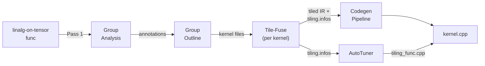

# Ascend-MLIR Vector Plan & Codegen

**版本:** 3.1  
**日期:** 2026-04-23  
**状态:** Documentation Suite Entry Point

---

## 总体目标

在 Ascend-MLIR 中实现全自动、自洽且可扩展的 **Plan-Driven 编译流水线**：将预处理后的 `linalg-on-tensor` 算子子图，通过自动化的图分析（Group Analysis）、函数剥离（Outlining）、切分计划与循环融合（Tile-Fuse），最终生成高性能的 `AscendC` 内核代码。

**支持的核心场景**：
*   **VectorGroup**: Pointwise、Reduction（Reduce-Pointwise 链）、Broadcast、Horizontal Fusion（水平融合）、LayerNorm、Softmax 等。
*   **CubeGroup**: 以 `linalg.matmul` 为核心，吸收 Prologue（前处理）和 Epilogue（后处理 VectorGroup），覆盖 QKV Projection、FFN Linear 等。

---

## 流水线总览



| Phase | Pass 名称 | 粒度 | 产出 |
|-------|----------|------|------|
| 1 | `auto-fuse-group-analysis` | @func | 每个 linalg op 标注 `group_id` + `topo_index` |
| 2 | `auto-fuse-group-outline` | @module | `network.mlir` + `kernel_group{N}.mlir` |
| 3 | `auto-fuse-tile-fuse` | @func | tiled+fused kernel IR + `tiling.infos` attribute |
| 4 | codegen pipeline | @module & @func | `kernel_group{N}.cpp` |
| 5 | AutoTuner | offline | `tiling_func.cpp`（最优 tile 参数） |

---

## 文档索引 (Documentation Suite)

### 架构层（L2 Architecture）

| 文档 | 内容 |
|------|------|
| [00-architecture.md](./00-architecture.md) | **架构总纲** — 流水线设计、融合规则概要、核心不变量、接口边界、迁移路径 |
| [00-data-model.md](./00-data-model.md) | **数据结构字典** — `GroupInfo`, `TilePlan`, `TileParam`, `TileInfo` 定义及生命周期 |

### 实现层（L3 Implementation）

| 文档 | 对应 Phase | 内容 |
|------|-----------|------|
| [01-group-analysis.md](./01-group-analysis.md) | Phase 1 | AxisLattice 推导、CanFuse 融合规则、迭代合并主循环 |
| [02-group-outline.md](./02-group-outline.md) | Phase 2 | 分桶、两级拓扑排序、func outlining、文件分离 |
| [03-tile-fuse.md](./03-tile-fuse.md) | Phase 3 | BAII、Collapse (A/B2/C)、TilePlanGen、LoopNestBuilder、GroupEmitter、Accumulator Pattern |
| [04-tile-info.md](./04-tile-info.md) | Phase 3→4 | TilePlan→TileInfo 序列化、PrepareForEmit 适配 |
| [05-codegen-design.md](./05-codegen-design.md) | Phase 4 | `ascendc-parallelize` N-D dispatch、`ascendc-prepare-for-emit`、Solver 接口 |
| [06-autotuner-design.md](./06-autotuner-design.md) | Phase 5 | Runner 框架、剪枝策略、并发执行池、Fallback 机制 |

---

## 架构不变量 (Key Invariants)

1. **ABI 权威性解耦:** `TileInfo.fields` 中的 `abi_index` 是构建 `TilingData` 的**唯一真理来源**，后端 Codegen 和 Host 不得按名字或参数序号硬编码。
2. **无全长中间缓存:** Phase 3 后所有临时 Tensor 的 Static Shape 必须收缩为 Tile Slice 块大小，杜绝 SRAM 无法承载的全尺寸分配。
3. **Group 内拓扑保序:** GroupEmitter 必须严格按 `topoMembers` 数据依赖序发射代码。
4. **初始化贴紧最内层:** Reduction 的 `linalg.fill` 必须在最贴近累加的最内层循环之外。

---

## 快速上手

```bash
# Phase 1 + 2：图分析 → Group Outline
mlir-opt \
  --auto-fuse-group-analysis \
  --auto-fuse-group-outline \
  input.mlir

# Phase 3：对每个 kernel 执行 Tile-Fuse（生成 tiling.infos）
mlir-opt --auto-fuse-tile-fuse kernel_group0.mlir

# Phase 4：Codegen pipeline
mlir-opt \
  --one-shot-bufferize \
  --ascendc-buffer-placement \
  --linalg-to-ascendc \
  --ascendc-parallelize \
  --ascendc-prepare-for-emit \
  kernel_group0.mlir \
  | afir-translate --mlir-to-cann > kernel_group0.cpp
```
