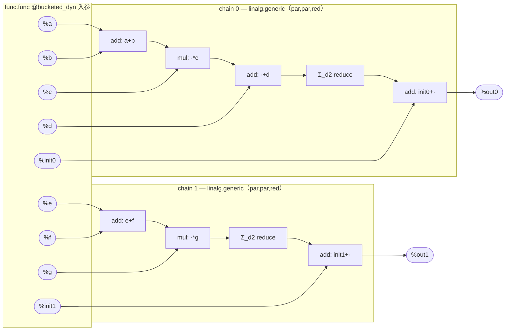
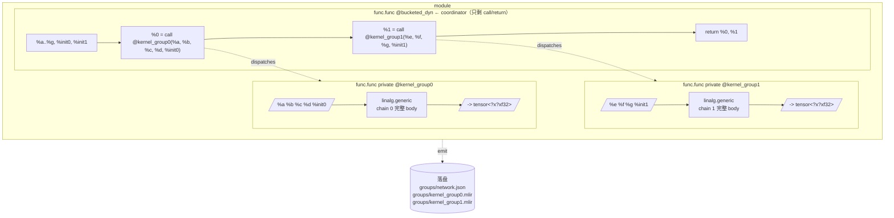

# 端到端流程走读

本文是和同目录 [`README.zh.md`](README.zh.md) 配套的**宏观视角**：README 是逐
pass 拆 IR；本文把整条链路 `model.mlir → 多 kernel AscendC 二进制 → host 调度
→ sim 校验` 串起来讲，落到 5 个 phase。详细的 IR 改写细节请回 README。

- 源：[`examples/dyn-bucketed-e2e/model.mlir`](../../../../examples/dyn-bucketed-e2e/model.mlir)
- 一键复现：`bash examples/dyn-bucketed-e2e/run.sh`
- Driver：`python/network_runner.py`（[[network-runner-v1]]，5 phase 已落地）

```
model.mlir                                                     ← Phase 0
   │  ① group 划分：afir-opt --group-{analysis,outline}
   ▼
network.mlir + network.json + kernel_groupN.mlir × G            ← Phase 1
   │  ② tile-plan 模板枚举：tile-fuse → __v<i>
   │  ③ codegen：linalg-to-ascendc + pack TilingData + finalize
   │  ④ mlir-to-cann（MLIR → AscendC C++ 源码翻译，非编译）
   │  ⑤ ccec（C++ → .so 编译）
   ▼
kernel_groupN__v<i>.{mlir,cpp,so} × ΣVariants                  ← Phase 2
   │  保守默认tiling,保证编译产物本身可运行：default tiling + dump tilingdata schema 
   ▼
network_intermediate（含 default tilings_best.json）           ← Phase 3
   │    内层：对每个 __v<i>，在它的 *_space.json 描述的 tile 搜索空间里
   │          跑 sim-based tile-search，取 latency 最小的一组 tile
   │    外层：在所有 __v<i> 的内层最优解之间再取 argmin
   │    输出：picked_variant + 该 variant 的最佳 TilingData → tilings_best.json
   ▼
tilings_best.json                                              ← Phase 4
   │  network_runner host  →  camodel simulator  →  numpy 比对
   ▼
PASS / max_diff                                                ← Phase 5
```

## 关键中间 dump 索引

按照流程图把每个 phase 真正"形态变了"的 dump 挑出来——其它的多半是
canonicalize/cse 之类的 no-op 或微调。Phase 2 默认链接到 `kernel_group0` 的
dump 树，`kernel_group1` 是镜像结构。

| # | 阶段                              | 关键 dump（点击查看）                                                                                                                                                      | 这一份相对上一份的新变化                                                                                                     |
|---|---------------------------------|--------------------------------------------------------------------------------------------------------------------------------------------------------------------|------------------------------------------------------------------------------------------------------------------|
| 1 | **Phase 0 源**                   | [model.mlir](model.mlir)                                                                                                                                           | 起点：2 个 `linalg.generic`，全维 `?`（[上游原件](../../../../examples/dyn-bucketed-e2e/model.mlir)）                         |
| 2 | **Phase 1b outline**            | [1_vector-plan-group-outline.mlir](pass_dumps_phase1b/builtin_module_no-symbol-name/1_vector-plan-group-outline.mlir)                                              | module 拆成 `@kernel_groupN` private func + coordinator `func.call`；落盘 `network.json`                              |
| 3 | **Phase 2-A symbolize-shapes**  | [0_3_afir-symbolize-shapes.mlir](pass_dumps_phase2_kernel_group0/builtin_module_no-symbol-name/func_func_kernel_group0/0_3_afir-symbolize-shapes.mlir)             | func 头挂 `afir.dim_symbols`，op 挂 `afir.iter_extents` / `afir.symbolic_shapes` —— 整条符号 shape 链的起点                  |
| 4 | **Phase 2-B tile-fuse**         | [1_vector-plan-tile-fuse.mlir](pass_dumps_phase2_kernel_group0/builtin_module_no-symbol-name/1_vector-plan-tile-fuse.mlir)                                         | 每个 feasible TilePlanDraft 复制出一个 `…__v<i>`；挂 `vector_plan.tiling_infos`                               |
| 5 | **Phase 2-B bufferize**         | [3_one-shot-bufferize.mlir](pass_dumps_phase2_kernel_group0/builtin_module_no-symbol-name/3_one-shot-bufferize.mlir)                                               | **tensor → memref**：参数变 `memref<?x?x?xf32>`，整个 IR 切到 buffer 语义                                                   |
| 6 | **Phase 2-C linalg-to-ascendc** | [4_8_linalg-to-ascendc.mlir](pass_dumps_phase2_kernel_group0/builtin_module_no-symbol-name/func_func_kernel_group0__v0/4_8_linalg-to-ascendc.mlir)                 | `linalg.generic` body → `ascendc.add_l2 / mul_l2 / reduce_sum_2d_l2 / data_copy_l2 / duplicate_l2`；queue+pipe 物化 |
| 7 | **Phase 2-D pack-tiling-data**  | [6_12_ascendc-pack-tiling-data.mlir](pass_dumps_phase2_kernel_group0/builtin_module_no-symbol-name/func_func_kernel_group0__v0/6_12_ascendc-pack-tiling-data.mlir) | 所有 tunable + 动态维打包成 `TilingData` struct，作为新 func arg                                                             |
| 8 | **Phase 2-D finalize-kernel**   | [6_13_ascendc-finalize-kernel.mlir](pass_dumps_phase2_kernel_group0/builtin_module_no-symbol-name/func_func_kernel_group0__v0/6_13_ascendc-finalize-kernel.mlir)   | 改名到 `@kernel_group0__v0`，加 CANN ABI 属性（`ascendc.aicore` / `cann.num_inputs`），去 `func.return`，CANN ABI 最终态        |


---

## Phase 0 — 源 IR 与运行期 shape

`func.func @bucketed_dyn` 9 参 2 出，全维 `?`（`tensor<?x?x?xf32>` /
`tensor<?x?xf32>`），两条 `linalg.generic`（迭代器 `[par, par, red]`），都读
DPS init 做累加：

```
out0 = init0 + Σ_d2 ((a + b) * c + d)
out1 = init1 + Σ_d2 ((e + f) * g)
```

运行期由 `gen_inputs.py` 生成 `.npy`（默认 `d0=8, d1=16, d2=64`），shape 完全
由 host 在 launch 前填入 TilingData。

## Phase 1 — Group analyze + outline（一次性，module 级）

### 分组前 — `model.mlir` 数据流



### 分组后 — `vector-plan-group-{analysis,outline}` 之后的模块结构



### Pass 行为

`afir-opt` 顺序跑两个 pass（见 `pass_dumps_phase1b/`）：

1. **`vector-plan-group-analysis`**：按 canonical-axes lattice 把
   `linalg.generic` 分桶，`canFuseVector` 贪婪合并。融合关系由
   `getFusionKind(g1, g2)` 判定：
   - **Vertical**：两个 group 之间存在 SSA 边（producer → consumer）；
   - **Horizontal**：两个 group 的 `boundaryIn` 至少**共享一个** value；
   - 否则 `FusionKind::None`，直接拒绝合并

   本例 chain 0 / chain 1 的 boundaryIn 是 `{a,b,c,d,init0}` vs
   `{e,f,g,init1}`，**完全不相交**、也没有 SSA 边 → `None` →
   **分成 2 个 group**。每个存活 op 上挂 `vector_plan.group_id` / `topo_index`。
2. **`vector-plan-group-outline`**：每个 group 克隆到 `kernel_groupN`
   private func；coordinator 用 `func.call` 替换。同时落盘：
   - `groups/network.mlir`  — 只剩 coordinator
   - `groups/network.json`  — 调用图（phase 3/5 host 消费）
   - `groups/kernel_groupN.mlir` — phase 2 的输入

产出后 module 长这样：

```mlir
func.func private @kernel_group0(%a, %b, %c, %d, %init0) -> ...
func.func private @kernel_group1(%e, %f, %g,     %init1) -> ...
func.func @bucketed_dyn(...) -> (...) {
  %0 = call @kernel_group0(%arg0, %arg1, %arg2, %arg3, %arg7) : ...
  %1 = call @kernel_group1(%arg4, %arg5, %arg6, %arg8) : ...
  return %0, %1
}
```

## Phase 2 — tile-fuse + codegen（每 kernel 一遍）+ 编译

**严格顺序：先划分（group + tile-plan 模板），再 codegen。** Phase 2 内部还有一
次"小划分"——`vector-plan-tile-fuse` 枚举所有 feasible TilePlanDraft 并 emit
`__v<i>`，**这一步必须在 `linalg-to-ascendc` 之前**：

- group 划分（Phase 1）依赖 `linalg.generic` 的 indexing-map / canonical-axes；
  进入 group C 后 body 被替成 AscendC 原语，分组信息就抹掉了，无法回头分。
- tile-plan 模板枚举（Phase 2-B）依赖 `afir.iter_extents`，且必须在
  `one-shot-bufferize` 之前选定，否则 memref 已按某一套 tile 形状分配。

23 个 sub-pass 的复合 pipeline（A/B/C/D/E 五组，详 README §Phase 2）。要点：

| 阶段 | 关键 pass | 这一步做完后的"形态"   |
| ---- | -------- | ---------------------- |
| A    | `vector-plan-isolate-kernel-outputs`、`afir-symbolize-shapes` | tensor IR；func 头挂 `afir.dim_symbols`，op 挂 `afir.iter_extents` |
| B    | `vector-plan-tile-fuse`、`one-shot-bufferize` | **func 改名**为 `kernel_groupN__v<i>`（每个 feasible TilePlanDraft 一份，[[multi-plan-tiling-variants]]）；tensor → memref |
| C    | `linalg-to-ascendc`、`ascendc-parallelize` | linalg body 替换为 `ascendc.add_l2 / mul_l2 / reduce_sum_2d_l2 / data_copy_l2 / duplicate_l2`；外层 parallel 套 `scf.for %i = block_idx, total, num_cores` |
| D    | `ascendc-pack-tiling-data`、`ascendc-finalize-kernel` | 所有 tunable + 动态维打包成一个 `TilingData` struct 作为新 arg；签名对齐 CANN ABI |
| E    | `canonicalize-cann-signature` | 准备喂给 `mlir-to-cann`             |

`network_runner.phase2_codegen_compile`：对每个 `kernel_groupN.mlir` 跑一次
codegen → 取到所有 `__v<i>` variants → `mlir-to-cann` 转成 AscendC C++ →
CCEC 编译成 `.so`。同时为每个 variant dump 一份 `*_space.json`（描述
TilingData 结构、tunable 取值域），phase 4 autotuner 据此搜索。

> 这一 phase 的"故事感"主要在 **C 和 D**：C 把抽象的 `linalg.generic` 替成
> AscendC 原语并物化 queue/pipe；D 把"形状/tile"这一份运行期信息从 MLIR 属
> 性挪进一个 plain-C struct，让 host 能动态填。

## Phase 3 — Default tiling 试跑 + schema 提取

`phase3_default_build_and_dump`：

1. 对每个 kernel（`kernel_groupN`）的所有 variant（`__v<i>`）选一组
   conservative default tiling。
2. 用 aclnn-backend 生成 `network_host_default.cpp`，跑一遍 sim 确认链路通。
3. dump `network_intermediate.json` —— 包含每个 variant 的 TilingData
   schema、参数顺序，以及 `kernel → {variant}` 映射。phase 4 的输入。

## Phase 4 — Autotune（每个 kernel 内跨 variant 取 latency argmin）

`phase4_autotune` 对每个 ascendc kernel（即一个 `kernel_groupN`，对应一个
`<kid>_family.json` 工件，记录该 kernel 的所有 variant）调一次
`autotuner --family <kid>_family.json`：

- autotuner 内部遍历每个 variant 的 `*_space.json`，对每个 variant 跑一轮
  tile-search；
- 跨 variant 取 latency argmin，写入聚合 `tilings_best.json`，字段里既有
  `picked_variant` 也有该 variant 的最佳 tiling。

`--shape` 由 `gen_inputs.py` 写的 npy shape 自动拼出（如 `d0=8,d1=16,d2=64`）。
aclnn kernel 不进 autotune。

## Phase 5 — 终态构建 + camodel sim + 校验

`phase5_final_run_verify`：

1. 用 `tilings_best.json` 重新生成 [network_host.cpp](network_host.cpp)（aclnn-backend 产物：把 `network.json` 调用图翻译成对 `hostLaunchAscendCKernel` / aclnn op 的 host 调用序列；TilingData 不在此文件填，launcher 内部读 JSON + input shape 自动组装）。
2. 链接 phase 2 产出的 `.so`，跑 camodel simulator（`Ascend910B1`）。
3. 输出 `out0.npy / out1.npy`，与 `expected*.npy` 用 `--atol/--rtol` 比对。

本例终态：两 kernel PASS，`max_diff ≈ 1e-6`（f32 ulp 量级）。

---


本目录其它产物：[model.mlir](model.mlir) · [network_host.cpp](network_host.cpp)

dump 子树速览：[pass_dumps_phase1a/](pass_dumps_phase1a/) ·
[pass_dumps_phase1b/](pass_dumps_phase1b/) ·
[pass_dumps_phase2_kernel_group0/](pass_dumps_phase2_kernel_group0/) ·
[pass_dumps_phase2_kernel_group1/](pass_dumps_phase2_kernel_group1/)

---

## 相关

- 逐 pass 细节：[`README.zh.md`](README.zh.md)
- 失败模式合集：[`../../../../examples/dyn-bucketed-e2e/BUG_REPORT.md`](../../../../examples/dyn-bucketed-e2e/BUG_REPORT.md)
- Driver 设计：`docs/superpowers/specs/2026-05-13-network-runner-mixed-cpu-sim-design.md`
- 记忆：[[network-runner-v1]]、[[multi-input-dyn-reduce-bug]]、[[multi-plan-tiling-variants]]、[[shape-symbolization]]、[[af-scheduler-port]]
